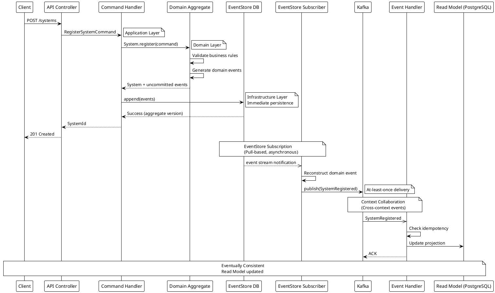
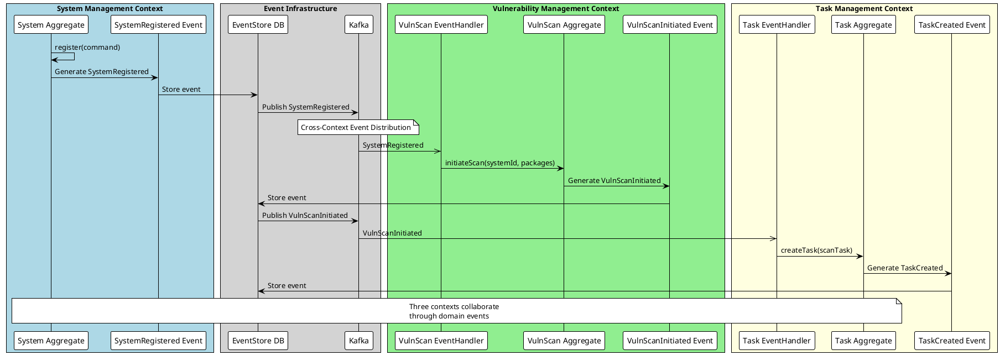
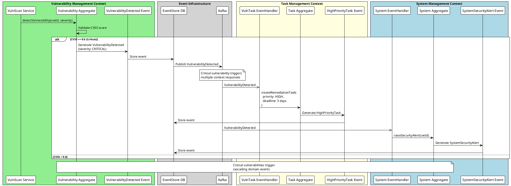

# Event Sourcing + CQRS アーキテクチャ設計書

**作成日**: 2025-09-22
**更新日**: 2025-09-22
**アーキテクチャパターン**: Event Sourcing + CQRS + EventStore DB + Kafka

## 1. 概要

System Boardにおけるイベントソーシング＋CQRSの実装設計とコンテキスト間コラボレーション戦略。EventStore DBを真実の源泉とし、Kafkaによるイベントストリーミングでコンテキスト間の非同期連携を実現する。

### 1.1 核心原則

- **Single Source of Truth**: EventStore DBがすべてのドメインイベントの真実の源泉
- **最終的整合性**: コンテキスト間はイベント駆動による最終的整合性
- **責務分離**: コマンド（書き込み）とクエリ（読み取り）の完全分離
- **冪等性保証**: イベント重複処理の安全性確保

## 2. EventStore保存タイミング戦略

### 2.1 イベント保存フロー



### 2.2 重要なタイミング制御

**即座の永続化**:

- ドメインイベントはコマンド処理と同一トランザクションでEventStoreに保存
- ビジネスロジック実行後、即座にイベントストアにコミット

**非同期配信**:

- EventStore Subscriptionによるプル型配信
- Kafkaへの再配信でコンテキスト間連携

## 3. コンテキスト間コラボレーション実装

### 3.1 システム登録時の脆弱性スキャン開始



### 3.2 脆弱性発見時のタスク自動生成



## 4. EventStore実装詳細

### 4.1 イベントストリーム構造

```typescript
// イベントストリーム命名規則
const STREAM_PATTERNS = {
  SYSTEM: 'system-{systemId}',           // システム集約用
  VULNERABILITY: 'vuln-{vulnId}',        // 脆弱性集約用
  TASK: 'task-{taskId}',                 // タスク集約用
  RELATIONSHIP: 'relation-{relationId}'   // 関係集約用
};

// パーティション戦略
interface EventStoreConfig {
  partitionStrategy: 'by-aggregate-id';
  snapshotFrequency: 100; // 100イベント毎
  retentionPolicy: '7-years'; // コンプライアンス要件
}
```

### 4.2 ドメインイベント基底クラス

```typescript
export abstract class DomainEvent {
  public readonly eventId: string;
  public readonly eventType: string;
  public readonly aggregateId: string;
  public readonly aggregateType: string;
  public readonly aggregateVersion: number;
  public readonly occurredOn: Date;
  public readonly correlationId: string;
  public readonly causationId?: string;

  constructor(
    eventType: string,
    aggregateId: string,
    aggregateType: string,
    aggregateVersion: number,
    correlationId: string,
    causationId?: string
  ) {
    this.eventId = crypto.randomUUID();
    this.eventType = eventType;
    this.aggregateId = aggregateId;
    this.aggregateType = aggregateType;
    this.aggregateVersion = aggregateVersion;
    this.occurredOn = new Date();
    this.correlationId = correlationId;
    this.causationId = causationId;
  }

  abstract getData(): any;
}
```

### 4.3 コンテキスト間イベント実装例

```typescript
// System Management Context Event
export class SystemRegistered extends DomainEvent {
  constructor(
    public readonly systemId: SystemId,
    public readonly name: SystemName,
    public readonly packages: SystemPackages,
    public readonly securityClassification: SecurityClassification,
    aggregateVersion: number,
    correlationId: string
  ) {
    super(
      'SystemRegistered',
      systemId.getValue(),
      'System',
      aggregateVersion,
      correlationId
    );
  }

  getData() {
    return {
      systemId: this.systemId.getValue(),
      name: this.name.getValue(),
      packages: this.packages.getAll().map(p => ({
        name: p.getName(),
        version: p.getVersion()
      })),
      securityClassification: this.securityClassification
    };
  }
}

// Vulnerability Management Context Event
export class VulnerabilityDetected extends DomainEvent {
  constructor(
    public readonly vulnerabilityId: VulnerabilityId,
    public readonly systemId: SystemId,
    public readonly cveId: string,
    public readonly severity: VulnerabilitySeverity,
    public readonly cvssScore: number,
    aggregateVersion: number,
    correlationId: string,
    causationId?: string
  ) {
    super(
      'VulnerabilityDetected',
      vulnerabilityId.getValue(),
      'Vulnerability',
      aggregateVersion,
      correlationId,
      causationId
    );
  }

  getData() {
    return {
      vulnerabilityId: this.vulnerabilityId.getValue(),
      systemId: this.systemId.getValue(),
      cveId: this.cveId,
      severity: this.severity,
      cvssScore: this.cvssScore,
      isCritical: this.cvssScore >= 9.0
    };
  }
}

// Task Management Context Event
export class TaskCreated extends DomainEvent {
  constructor(
    public readonly taskId: TaskId,
    public readonly systemId: SystemId,
    public readonly taskType: TaskType,
    public readonly priority: TaskPriority,
    public readonly deadline: Date,
    aggregateVersion: number,
    correlationId: string,
    causationId?: string
  ) {
    super(
      'TaskCreated',
      taskId.getValue(),
      'Task',
      aggregateVersion,
      correlationId,
      causationId
    );
  }

  getData() {
    return {
      taskId: this.taskId.getValue(),
      systemId: this.systemId.getValue(),
      taskType: this.taskType,
      priority: this.priority,
      deadline: this.deadline.toISOString()
    };
  }
}
```

## 5. EventStore Subscription実装

### 5.1 EventStore購読パターン

```typescript
@Injectable()
export class EventStoreSubscriber implements OnModuleInit {
  constructor(
    private readonly eventStoreClient: EventStoreDBClient,
    private readonly eventBus: EventBus,
    private readonly logger: Logger
  ) {}

  async onModuleInit(): Promise<void> {
    // システム管理コンテキストのイベント購読
    await this.subscribeToSystemEvents();

    // 脆弱性管理コンテキストのイベント購読
    await this.subscribeToVulnerabilityEvents();

    // タスク管理コンテキストのイベント購読
    await this.subscribeToTaskEvents();
  }

  private async subscribeToSystemEvents(): Promise<void> {
    await this.eventStoreClient.subscribeToAll({
      fromPosition: 'end',
      filter: { streamNamePrefix: 'system-' },
      onEvent: this.handleSystemEvent.bind(this),
      onError: this.handleSubscriptionError.bind(this)
    });
  }

  private async handleSystemEvent(resolvedEvent: ResolvedEvent): Promise<void> {
    const eventType = resolvedEvent.event.eventType;
    const eventData = JSON.parse(resolvedEvent.event.data.toString());

    // コンテキスト間配信のためKafkaに再配信
    switch (eventType) {
      case 'SystemRegistered':
        const systemRegistered = SystemRegistered.fromEventStore(eventData);
        await this.eventBus.publish(systemRegistered);
        break;

      case 'SystemSecurityAlert':
        const securityAlert = SystemSecurityAlert.fromEventStore(eventData);
        await this.eventBus.publish(securityAlert);
        break;
    }
  }
}
```

### 5.2 Kafkaイベント配信

```typescript
@Injectable()
export class KafkaEventPublisher implements DomainEventPublisher {
  constructor(
    private readonly kafkaService: KafkaService,
    private readonly logger: Logger
  ) {}

  async publishAll(events: DomainEvent[]): Promise<void> {
    const publishPromises = events.map(event => this.publish(event));
    await Promise.all(publishPromises);
  }

  async publish(event: DomainEvent): Promise<void> {
    const topic = this.determineTopicByEventType(event.eventType);

    const message = {
      key: event.aggregateId,
      value: JSON.stringify({
        eventId: event.eventId,
        eventType: event.eventType,
        aggregateId: event.aggregateId,
        aggregateType: event.aggregateType,
        aggregateVersion: event.aggregateVersion,
        occurredOn: event.occurredOn.toISOString(),
        correlationId: event.correlationId,
        causationId: event.causationId,
        data: event.getData()
      }),
      headers: {
        'content-type': 'application/json',
        'event-type': event.eventType,
        'correlation-id': event.correlationId
      }
    };

    await this.kafkaService.send({
      topic,
      messages: [message]
    });

    this.logger.debug('Event published to Kafka', {
      eventType: event.eventType,
      aggregateId: event.aggregateId,
      topic
    });
  }

  private determineTopicByEventType(eventType: string): string {
    // イベントタイプごとのトピック振り分け
    const topicMap = {
      // System Management Context
      'SystemRegistered': 'system-events',
      'SystemConfigurationUpdated': 'system-events',
      'SystemDecommissioned': 'system-events',
      'SystemSecurityAlert': 'security-events',

      // Vulnerability Management Context
      'VulnerabilityDetected': 'vulnerability-events',
      'VulnerabilityScanCompleted': 'vulnerability-events',
      'VulnerabilityResolved': 'vulnerability-events',

      // Task Management Context
      'TaskCreated': 'task-events',
      'TaskCompleted': 'task-events',
      'HighPriorityTaskCreated': 'urgent-events'
    };

    return topicMap[eventType] || 'domain-events';
  }
}
```

## 6. 冪等性保証とエラーハンドリング

### 6.1 重複処理防止機構

```typescript
@Injectable()
export class IdempotentEventHandler {
  constructor(
    private readonly processedEventRepository: ProcessedEventRepository,
    private readonly logger: Logger
  ) {}

  async handleWithIdempotency<T extends DomainEvent>(
    event: T,
    handler: (event: T) => Promise<void>
  ): Promise<void> {
    // 処理済みイベントチェック
    const isProcessed = await this.processedEventRepository.isProcessed(
      event.eventId
    );

    if (isProcessed) {
      this.logger.debug('Event already processed, skipping', {
        eventId: event.eventId,
        eventType: event.eventType
      });
      return;
    }

    try {
      // イベント処理実行
      await handler(event);

      // 処理済みマーク
      await this.processedEventRepository.markAsProcessed(
        event.eventId,
        event.eventType,
        new Date()
      );

      this.logger.debug('Event processed successfully', {
        eventId: event.eventId,
        eventType: event.eventType
      });
    } catch (error) {
      this.logger.error('Event processing failed', {
        eventId: event.eventId,
        eventType: event.eventType,
        error: error.message
      });
      throw error;
    }
  }
}
```

### 6.2 コンテキスト間イベントハンドラー実装例

```typescript
// Vulnerability Management Context
@EventsHandler(SystemRegistered)
export class VulnerabilitySystemRegisteredHandler
  implements IEventHandler<SystemRegistered> {

  constructor(
    private readonly vulnerabilityScanService: VulnerabilityScanService,
    private readonly idempotentHandler: IdempotentEventHandler,
    private readonly logger: Logger
  ) {}

  async handle(event: SystemRegistered): Promise<void> {
    await this.idempotentHandler.handleWithIdempotency(
      event,
      async (e) => {
        // 新規システム登録時に脆弱性スキャンを自動開始
        const scanCommand = new InitiateVulnerabilityScanCommand({
          systemId: e.systemId,
          packages: e.getData().packages,
          scanType: 'INITIAL_REGISTRATION',
          priority: this.determineScanPriority(e.getData().securityClassification),
          correlationId: e.correlationId
        });

        await this.vulnerabilityScanService.initiateScan(scanCommand);

        this.logger.info('Vulnerability scan initiated for new system', {
          systemId: e.systemId.getValue(),
          correlationId: e.correlationId
        });
      }
    );
  }

  private determineScanPriority(classification: SecurityClassification): ScanPriority {
    switch (classification) {
      case SecurityClassification.RESTRICTED:
      case SecurityClassification.CONFIDENTIAL:
        return ScanPriority.HIGH;
      case SecurityClassification.INTERNAL:
        return ScanPriority.MEDIUM;
      default:
        return ScanPriority.LOW;
    }
  }
}

// Task Management Context
@EventsHandler(VulnerabilityDetected)
export class TaskVulnerabilityDetectedHandler
  implements IEventHandler<VulnerabilityDetected> {

  constructor(
    private readonly taskManagementService: TaskManagementService,
    private readonly idempotentHandler: IdempotentEventHandler,
    private readonly logger: Logger
  ) {}

  async handle(event: VulnerabilityDetected): Promise<void> {
    await this.idempotentHandler.handleWithIdempotency(
      event,
      async (e) => {
        const eventData = e.getData();

        // CVSS 9.0以上の場合は高優先度タスクを自動生成
        if (eventData.isCritical) {
          const taskCommand = new CreateRemediationTaskCommand({
            systemId: e.systemId,
            vulnerabilityId: e.vulnerabilityId,
            taskType: TaskType.VULNERABILITY_REMEDIATION,
            priority: TaskPriority.HIGH,
            deadline: this.calculateDeadline(eventData.cvssScore),
            description: `Critical vulnerability remediation: ${eventData.cveId}`,
            correlationId: e.correlationId,
            causationId: e.eventId
          });

          await this.taskManagementService.createTask(taskCommand);

          this.logger.warn('High priority remediation task created', {
            vulnerabilityId: e.vulnerabilityId.getValue(),
            systemId: e.systemId.getValue(),
            cveId: eventData.cveId,
            cvssScore: eventData.cvssScore,
            correlationId: e.correlationId
          });
        }
      }
    );
  }

  private calculateDeadline(cvssScore: number): Date {
    const now = new Date();

    if (cvssScore >= 9.0) {
      // Critical: 3日以内
      return new Date(now.getTime() + 3 * 24 * 60 * 60 * 1000);
    } else if (cvssScore >= 7.0) {
      // High: 1週間以内
      return new Date(now.getTime() + 7 * 24 * 60 * 60 * 1000);
    } else {
      // Medium/Low: 1ヶ月以内
      return new Date(now.getTime() + 30 * 24 * 60 * 60 * 1000);
    }
  }
}
```

## 7. 実装上の重要なポイント

### 7.1 イベント保存タイミング

- **即座保存**: ドメインイベントはコマンド処理完了と同時にEventStoreに永続化
- **非同期配信**: EventStore Subscriptionで他コンテキストへの配信は非同期
- **最終的整合性**: コンテキスト間は最終的整合性を受け入れ

### 7.2 エラー処理戦略

- **At-least-once配信**: 重複配信前提の冪等性設計
- **Dead Letter Queue**: 処理失敗イベントの隔離と再処理
- **補償処理**: Sagaパターンによるロールバック機構

### 7.3 パフォーマンス考慮事項

- **スナップショット**: 100イベント毎の集約スナップショット
- **インデックス最適化**: EventStore検索性能向上
- **パーティション戦略**: 集約ID単位でのイベント分散

この設計により、System Boardの各コンテキストは疎結合を保ちながら、ドメインイベントを通じて効率的にコラボレーションできる。
