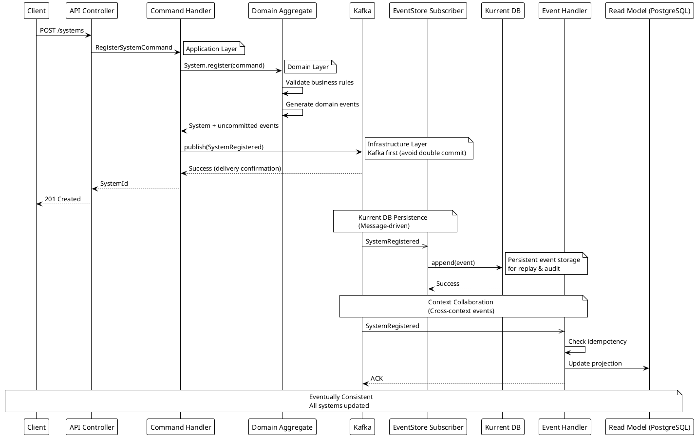
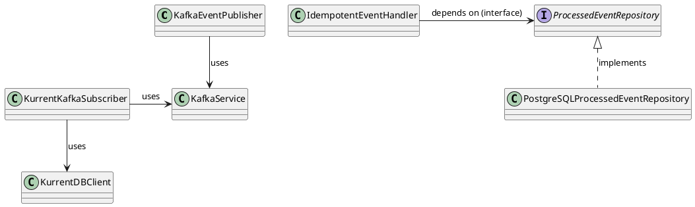
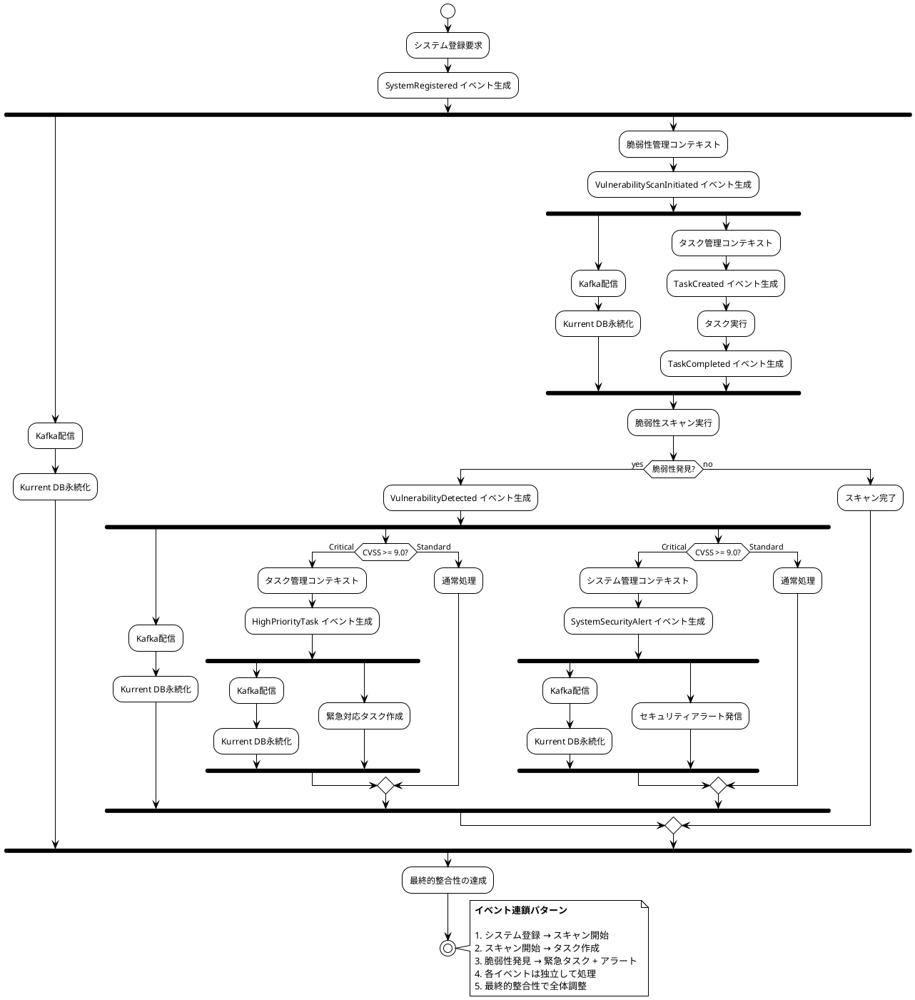
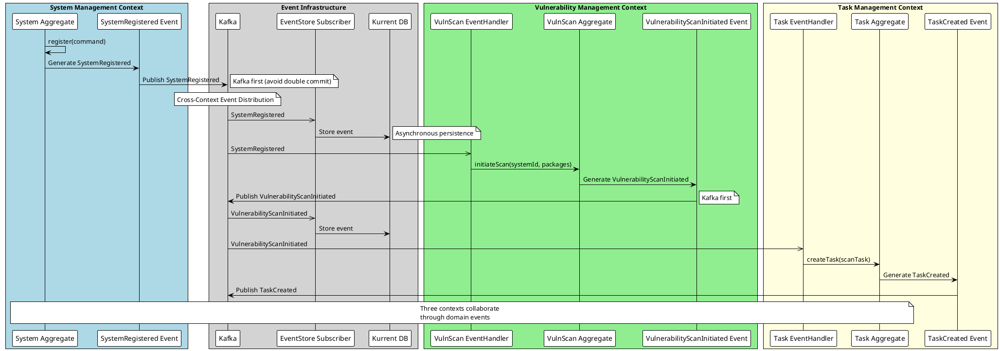
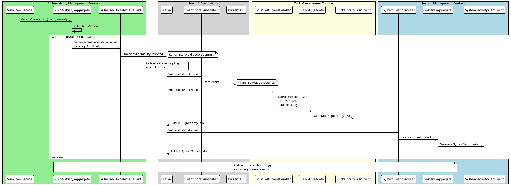

# Event Sourcing + CQRS アーキテクチャ設計書

**作成日**: 2025-09-22
**更新日**: 2025-09-22
**アーキテクチャパターン**: Event Sourcing + CQRS + Kurrent DB + Kafka

## 1. 概要

System Boardにおけるイベントソーシング＋CQRSの実装設計とコンテキスト間コラボレーション戦略。Kurrent DBを真実の源泉とし、Kafkaによるイベントストリーミングでコンテキスト間の非同期連携を実現する。

### 1.1 核心原則

- **Single Source of Truth**: Kurrent DBがすべてのドメインイベントの真実の源泉
- **最終的整合性**: コンテキスト間はイベント駆動による最終的整合性
- **責務分離**: コマンド（書き込み）とクエリ（読み取り）の完全分離
- **冪等性保証**: イベント重複処理の安全性確保
- **ダブルコミット回避**: Kafkaへの配信成功後にKurrent DBへ保存（トランザクション境界統一）

## 2. ダブルコミット回避戦略

### 2.0 ダブルコミット問題とは

**ダブルコミットの問題**：

- Kurrent DBとKafkaの2つの異なるストレージシステムへの書き込みが必要
- 各システムが独立したトランザクション境界を持つため、部分的な失敗が発生する可能性
- Kurrent DB書き込み成功 + Kafka配信失敗 → データ不整合
- Kurrent DB書き込み失敗 + Kafka配信成功 → データ不整合

**従来設計の問題点**：

```text
CH -> ES: append(events)     // 成功
ES -> Kafka: publish()       // 失敗 ← 不整合発生
```

**回避の必要性**：

- **データ一貫性**: 2つのシステム間でのデータ同期ずれを防止
- **システムの信頼性**: 部分的失敗による予期しない状態を回避
- **運用の複雑性軽減**: 障害復旧時の手動データ修正作業を削減
- **パフォーマンス向上**: 2フェーズコミットによる性能劣化を回避

### 2.1 修正されたイベント保存フロー



### 2.2 ダブルコミット回避の重要なタイミング制御

**Kafkaファースト配信**:

- ドメインイベントは先にKafkaに配信（単一トランザクション境界）
- ビジネスロジック実行後、即座にKafkaへコミット
- Kafkaの配信確認を受けてからクライアントへレスポンス

**Kurrent DB非同期永続化**:

- Kafkaメッセージを受信してKurrent DBに保存
- イベント再生とコンプライアンス監査用の永続ストレージ
- Kafkaを一次配信チャネル、Kurrent DBを永続アーカイブとして位置づけ

## 3. コンテキスト間コラボレーション実装

### 3.0 コラボレーションクラス設計

#### 3.0.1 コアクラス構造

```plantuml
@startuml collaboration_class_diagram
!theme plain

package "Shared Domain Layer" {
  abstract class AggregateRoot {
    +aggregateId: AggregateId
    +version: number
    +uncommittedEvents: DomainEvent[]
    +markEventsAsCommitted(): void
    +getUncommittedEvents(): DomainEvent[]
    #addEvent(event: DomainEvent): void
  }

  abstract class DomainEvent {
    +eventId: string
    +eventType: string
    +aggregateId: string
    +aggregateType: string
    +aggregateVersion: number
    +occurredOn: Date
    +correlationId: string
    +causationId?: string
    +abstract getData(): any
  }
}

package "System Management Context" {
  package "Domain Layer" {
    class SystemAggregate extends AggregateRoot {
      +static readonly AGGREGATE_NAME: string = 'System'
      +systemId: SystemId
      +name: SystemName
      +packages: SystemPackages
      +securityClassification: SecurityClassification
      +register(command: RegisterSystemCommand): void
      +raiseSecurityAlert(cveId: string): void
    }
  }

  package "Application Layer" {
    class SystemService {
      +eventPublisher: EventPublisher
      +registerSystem(command: RegisterSystemCommand): Promise<void>
      +handleSecurityAlert(command: RaiseSecurityAlertCommand): Promise<void>
    }

    class SystemEventHandler implements EventHandler {
      +systemService: SystemService
      +idempotentEventHandler: IdempotentEventHandler
      +handle(event: VulnerabilityDetected): Promise<void>
    }
  }

  package "Infrastructure Layer" {
    class SystemRepository {
      +save(aggregate: SystemAggregate): Promise<void>
      +findById(systemId: SystemId): Promise<SystemAggregate>
    }
  }
}

package "Vulnerability Management Context" {
  package "Domain Layer" {
    class VulnerabilityAggregate extends AggregateRoot {
      +static readonly AGGREGATE_NAME: string = 'Vulnerability'
      +vulnerabilityId: VulnerabilityId
      +systemId: SystemId
      +cveId: string
      +severity: VulnerabilitySeverity
      +cvssScore: number
      +detectVulnerability(cveId: string, severity: VulnerabilitySeverity): void
    }

    class VulnerabilityScanAggregate extends AggregateRoot {
      +static readonly AGGREGATE_NAME: string = 'VulnerabilityScan'
      +scanId: ScanId
      +systemId: SystemId
      +packages: SystemPackages
      +scanType: ScanType
      +priority: ScanPriority
      +initiateScan(systemId: SystemId, packages: SystemPackages): void
    }
  }

  package "Application Layer" {
    class VulnerabilityScanService {
      +eventPublisher: EventPublisher
      +initiateScan(command: InitiateVulnerabilityScanCommand): Promise<void>
    }

    class VulnerabilityScanEventHandler implements EventHandler {
      +vulnerabilityScanService: VulnerabilityScanService
      +idempotentEventHandler: IdempotentEventHandler
      +handle(event: SystemRegistered): Promise<void>
    }
  }

  package "Infrastructure Layer" {
    class VulnerabilityRepository {
      +save(aggregate: VulnerabilityAggregate): Promise<void>
      +findById(vulnId: VulnerabilityId): Promise<VulnerabilityAggregate>
    }

    class VulnerabilityScanRepository {
      +save(aggregate: VulnerabilityScanAggregate): Promise<void>
      +findById(scanId: ScanId): Promise<VulnerabilityScanAggregate>
    }
  }
}

package "Task Management Context" {
  package "Domain Layer" {
    class TaskAggregate extends AggregateRoot {
      +static readonly AGGREGATE_NAME: string = 'Task'
      +taskId: TaskId
      +systemId: SystemId
      +taskType: TaskType
      +priority: TaskPriority
      +deadline: Date
      +createTask(command: CreateTaskCommand): void
      +createRemediationTask(command: CreateRemediationTaskCommand): void
    }
  }

  package "Application Layer" {
    class TaskManagementService {
      +eventPublisher: EventPublisher
      +createTask(command: CreateTaskCommand): Promise<void>
      +createRemediationTask(command: CreateRemediationTaskCommand): Promise<void>
    }

    class TaskEventHandler implements EventHandler {
      +taskManagementService: TaskManagementService
      +idempotentEventHandler: IdempotentEventHandler
      +handle(event: VulnerabilityScanInitiated): Promise<void>
    }

    class VulnerabilityTaskEventHandler implements EventHandler {
      +taskManagementService: TaskManagementService
      +idempotentEventHandler: IdempotentEventHandler
      +handle(event: VulnerabilityDetected): Promise<void>
    }
  }

  package "Infrastructure Layer" {
    class TaskRepository {
      +save(aggregate: TaskAggregate): Promise<void>
      +findById(taskId: TaskId): Promise<TaskAggregate>
    }
  }
}

package "Shared Application Layer" {
  interface EventHandler<T extends DomainEvent> {
    +handle(event: T): Promise<void>
  }

  interface EventPublisher {
    +publish(event: DomainEvent): Promise<void>
    +publishAll(events: DomainEvent[]): Promise<void>
  }

  interface EventSubscriber {
    +subscribe(eventType: string, handler: EventHandler): void
  }

  interface ProcessedEventRepository {
    +isProcessed(eventId: string): Promise<boolean>
    +markAsProcessed(eventId: string, eventType: string, processedAt: Date): Promise<void>
  }

  class IdempotentEventHandler {
    +processedEventRepository: ProcessedEventRepository
    +handleWithIdempotency<T>(event: T, handler: Function): Promise<void>
  }
}

package "Shared Infrastructure Layer" {
  class KafkaEventPublisher implements EventPublisher {
    +kafkaService: KafkaService
    +publish(event: DomainEvent): Promise<void>
    +publishAll(events: DomainEvent[]): Promise<void>
    -determineTopicByEventType(eventType: string): string
  }

  class KurrentKafkaSubscriber implements EventSubscriber {
    +kurrentClient: KurrentDBClient
    +kafkaService: KafkaService
    +subscribe(eventType: string, handler: EventHandler): void
    -persistToEventStore(eventData: any, eventType: string): Promise<void>
    -getStreamName(aggregateType: string, aggregateId: string): string
  }

  class PostgreSQLProcessedEventRepository implements ProcessedEventRepository {
    +database: Database
    +isProcessed(eventId: string): Promise<boolean>
    +markAsProcessed(eventId: string, eventType: string, processedAt: Date): Promise<void>
    -createTable(): Promise<void>
  }
}

package "External Services" {
  class KafkaService {
    +send(message: any): Promise<void>
    +subscribe(config: any): Promise<void>
    +run(config: any): void
  }

  class KurrentDBClient {
    +appendToStream(streamName: string, events: any[], options: any): Promise<void>
  }
}

' Context Internal Relationships
SystemService --> SystemAggregate : uses
SystemService --> SystemRepository : uses
VulnerabilityScanService --> VulnerabilityScanAggregate : uses
VulnerabilityScanService --> VulnerabilityScanRepository : uses
TaskManagementService --> TaskAggregate : uses
TaskManagementService --> TaskRepository : uses

' Cross-Context Event Handling
VulnerabilityScanEventHandler --> VulnerabilityScanService : uses
TaskEventHandler --> TaskManagementService : uses
VulnerabilityTaskEventHandler --> TaskManagementService : uses
SystemEventHandler --> SystemService : uses

' Shared Dependencies
SystemService --> EventPublisher : depends on
VulnerabilityScanService --> EventPublisher : depends on
TaskManagementService --> EventPublisher : depends on

SystemEventHandler --> IdempotentEventHandler : uses
VulnerabilityScanEventHandler --> IdempotentEventHandler : uses
TaskEventHandler --> IdempotentEventHandler : uses
VulnerabilityTaskEventHandler --> IdempotentEventHandler : uses

' Infrastructure Dependencies
KafkaEventPublisher --> KafkaService : uses
KurrentKafkaSubscriber --> KurrentDBClient : uses
KurrentKafkaSubscriber --> KafkaService : uses
IdempotentEventHandler --> ProcessedEventRepository : depends on (interface)
PostgreSQLProcessedEventRepository --> ProcessedEventRepository : implements

@enduml
```



Infrastructure Dependencies



#### 3.0.2 ドメインイベント設計

```plantuml
@startuml domain_events_diagram
!theme plain

abstract class DomainEvent {
  +eventId: string
  +eventType: string
  +aggregateId: string
  +aggregateType: string
  +aggregateVersion: number
  +occurredOn: Date
  +correlationId: string
  +causationId?: string
  +abstract getData(): any
}

package "System Management Events" {
  class SystemRegistered extends DomainEvent {
    +systemId: SystemId
    +name: SystemName
    +packages: SystemPackages
    +securityClassification: SecurityClassification
    +getData(): SystemRegisteredData
  }

  class SystemSecurityAlert extends DomainEvent {
    +systemId: SystemId
    +cveId: string
    +alertLevel: AlertLevel
    +triggeredBy: string
    +getData(): SystemSecurityAlertData
  }

  class SystemConfigurationUpdated extends DomainEvent {
    +systemId: SystemId
    +updatedPackages: SystemPackages
    +changeType: ConfigurationChangeType
    +getData(): SystemConfigurationData
  }

  class SystemDecommissioned extends DomainEvent {
    +systemId: SystemId
    +decommissionReason: string
    +finalState: SystemState
    +getData(): SystemDecommissionData
  }
}

package "Vulnerability Management Events" {
  class VulnerabilityDetected extends DomainEvent {
    +vulnerabilityId: VulnerabilityId
    +systemId: SystemId
    +cveId: string
    +severity: VulnerabilitySeverity
    +cvssScore: number
    +affectedPackages: Package[]
    +getData(): VulnerabilityDetectedData
  }

  class VulnerabilityScanInitiated extends DomainEvent {
    +scanId: ScanId
    +systemId: SystemId
    +packages: SystemPackages
    +scanType: ScanType
    +priority: ScanPriority
    +estimatedCompletion: Date
    +getData(): VulnerabilityScanInitiatedData
  }

  class VulnerabilityScanCompleted extends DomainEvent {
    +scanId: ScanId
    +systemId: SystemId
    +totalVulnerabilities: number
    +criticalCount: number
    +highCount: number
    +mediumCount: number
    +lowCount: number
    +getData(): VulnScanCompletedData
  }

  class VulnerabilityResolved extends DomainEvent {
    +vulnerabilityId: VulnerabilityId
    +systemId: SystemId
    +resolutionMethod: ResolutionMethod
    +resolvedBy: string
    +getData(): VulnerabilityResolvedData
  }
}

package "Task Management Events" {
  class TaskCreated extends DomainEvent {
    +taskId: TaskId
    +systemId: SystemId
    +taskType: TaskType
    +priority: TaskPriority
    +deadline: Date
    +assignee?: string
    +description: string
    +getData(): TaskCreatedData
  }

  class HighPriorityTask extends DomainEvent {
    +taskId: TaskId
    +vulnerabilityId: VulnerabilityId
    +systemId: SystemId
    +priority: TaskPriority
    +urgencyLevel: UrgencyLevel
    +escalationPath: string[]
    +deadline: Date
    +getData(): HighPriorityTaskData
  }

  class TaskCompleted extends DomainEvent {
    +taskId: TaskId
    +systemId: SystemId
    +completedBy: string
    +completionNotes: string
    +actualEffort: Duration
    +getData(): TaskCompletedData
  }

  class TaskEscalated extends DomainEvent {
    +taskId: TaskId
    +escalatedTo: string
    +escalationReason: string
    +originalAssignee: string
    +escalationLevel: number
    +getData(): TaskEscalatedData
  }
}

package "Cross-Context Events" {
  note as N1
    これらのイベントは複数の
    コンテキストにまたがって
    処理される
  end note

  SystemRegistered .. N1
  VulnerabilityDetected .. N1
  VulnerabilityScanInitiated .. N1
  HighPriorityTask .. N1
}

@enduml
```



#### 3.0.3 イベントフロー図



### 3.1 システム登録時の脆弱性スキャン開始



### 3.2 脆弱性発見時のタスク自動生成



## 4. Kurrent DB実装詳細

### 4.1 イベントストリーム構造

```typescript
// イベントストリーム命名規則
const STREAM_PATTERNS = {
  SYSTEM: 'System-{systemId}',           // システム集約用
  VULNERABILITY: 'Vulnerability-{vulnId}',        // 脆弱性集約用
  TASK: 'Task-{taskId}',                 // タスク集約用
  RELATIONSHIP: 'Relationship-{relationId}'   // 関係集約用
};

// パーティション戦略
interface KurrentConfig {
  partitionStrategy: 'by-aggregate-id';
  snapshotFrequency: 100; // 100イベント毎
  retentionPolicy: '7-years'; // コンプライアンス要件
}
```

### 4.2 ドメインイベント基底クラス

```typescript
export abstract class DomainEvent {
  public readonly eventId: string;
  public readonly eventType: string;
  public readonly aggregateId: string;
  public readonly aggregateType: string;
  public readonly aggregateVersion: number;
  public readonly occurredOn: Date;
  public readonly correlationId: string;
  public readonly causationId?: string;

  constructor(
    eventType: string,
    aggregateId: string,
    aggregateType: string,
    aggregateVersion: number,
    correlationId: string,
    causationId?: string
  ) {
    this.eventId = crypto.randomUUID();
    this.eventType = eventType;
    this.aggregateId = aggregateId;
    this.aggregateType = aggregateType;
    this.aggregateVersion = aggregateVersion;
    this.occurredOn = new Date();
    this.correlationId = correlationId;
    this.causationId = causationId;
  }

  abstract getData(): unknown;
}
```

### 4.3 コンテキスト間イベント実装例

```typescript
// System Management Context Event
export class SystemRegistered extends DomainEvent {
  static readonly EVENT_NAME = 'SystemRegistered';
  static readonly AGGREGATE_NAME = 'System';

  constructor(
    public readonly systemId: SystemId,
    public readonly name: SystemName,
    public readonly packages: SystemPackages,
    public readonly securityClassification: SecurityClassification,
    aggregateVersion: number,
    correlationId: string
  ) {
    super(
      SystemRegistered.EVENT_NAME,
      systemId.getValue(),
      SystemRegistered.AGGREGATE_NAME,
      aggregateVersion,
      correlationId
    );
  }

  getData() {
    return {
      systemId: this.systemId.getValue(),
      name: this.name.getValue(),
      packages: this.packages.getAll().map(p => ({
        name: p.getName(),
        version: p.getVersion()
      })),
      securityClassification: this.securityClassification
    };
  }
}

// Vulnerability Management Context Event
export class VulnerabilityDetected extends DomainEvent {
  static readonly EVENT_NAME = 'VulnerabilityDetected';
  static readonly AGGREGATE_NAME = 'Vulnerability';

  constructor(
    public readonly vulnerabilityId: VulnerabilityId,
    public readonly systemId: SystemId,
    public readonly cveId: string,
    public readonly severity: VulnerabilitySeverity,
    public readonly cvssScore: number,
    aggregateVersion: number,
    correlationId: string,
    causationId?: string
  ) {
    super(
      VulnerabilityDetected.EVENT_NAME,
      vulnerabilityId.getValue(),
      VulnerabilityDetected.AGGREGATE_NAME,
      aggregateVersion,
      correlationId,
      causationId
    );
  }

  getData() {
    return {
      vulnerabilityId: this.vulnerabilityId.getValue(),
      systemId: this.systemId.getValue(),
      cveId: this.cveId,
      severity: this.severity,
      cvssScore: this.cvssScore,
      isCritical: this.cvssScore >= 9.0
    };
  }
}

// Task Management Context Event
export class TaskCreated extends DomainEvent {
  static readonly EVENT_NAME = 'TaskCreated';
  static readonly AGGREGATE_NAME = 'Task';

  constructor(
    public readonly taskId: TaskId,
    public readonly systemId: SystemId,
    public readonly taskType: TaskType,
    public readonly priority: TaskPriority,
    public readonly deadline: Date,
    aggregateVersion: number,
    correlationId: string,
    causationId?: string
  ) {
    super(
      TaskCreated.EVENT_NAME,
      taskId.getValue(),
      TaskCreated.AGGREGATE_NAME,
      aggregateVersion,
      correlationId,
      causationId
    );
  }

  getData() {
    return {
      taskId: this.taskId.getValue(),
      systemId: this.systemId.getValue(),
      taskType: this.taskType,
      priority: this.priority,
      deadline: this.deadline.toISOString()
    };
  }
}
```

## 5. Kafka-Kurrent DB統合実装

### 5.1 Kafkaメッセージ受信→Kurrent DB保存パターン

```typescript
@Injectable()
export class KurrentKafkaSubscriber implements OnModuleInit {
  constructor(
    private readonly kurrentClient: KurrentDBClient,
    private readonly kafkaService: KafkaService,
    private readonly logger: Logger
  ) {}

  async onModuleInit(): Promise<void> {
    // Kafkaからイベントを受信してKurrent DBに保存
    await this.subscribeToKafkaEvents();
  }

  private async subscribeToKafkaEvents(): Promise<void> {
    await this.kafkaService.subscribe({
      topics: ['system-events', 'vulnerability-events', 'task-events'],
      groupId: 'eventstore-persistence-group'
    });

    this.kafkaService.run({
      eachMessage: async ({ topic, partition, message }) => {
        await this.handleKafkaMessage(topic, message);
      }
    });
  }

  private async handleKafkaMessage(topic: string, message: any): Promise<void> {
    try {
      const eventData = JSON.parse(message.value.toString());
      const eventType = message.headers['event-type'].toString();

      // Kurrent DBに永続化
      await this.persistToEventStore(eventData, eventType);

      this.logger.debug('Event persisted to Kurrent DB from Kafka', {
        eventType,
        eventId: eventData.eventId,
        topic
      });
    } catch (error) {
      this.logger.error('Failed to persist event to Kurrent DB', {
        topic,
        error: error.message
      });
      throw error;
    }
  }

  private async persistToEventStore(eventData: any, eventType: string): Promise<void> {
    const streamName = this.getStreamName(eventData.aggregateType, eventData.aggregateId);

    const eventToStore = {
      eventId: eventData.eventId,
      eventType: eventType,
      data: eventData.data,
      metadata: {
        correlationId: eventData.correlationId,
        causationId: eventData.causationId,
        occurredOn: eventData.occurredOn
      }
    };

    await this.kurrentClient.appendToStream(streamName, [eventToStore], {
      expectedRevision: 'any'
    });
  }

  private getStreamName(aggregateType: string, aggregateId: string): string {
    return `${aggregateType}-${aggregateId}`;
  }
}
```

### 5.2 Command Handler統合Kafkaイベント配信

```typescript
@Injectable()
export class KafkaFirstEventPublisher implements DomainEventPublisher {
  constructor(
    private readonly kafkaService: KafkaService,
    private readonly logger: Logger
  ) {}

  async publishAll(events: DomainEvent[]): Promise<void> {
    const publishPromises = events.map(event => this.publish(event));
    await Promise.all(publishPromises);
  }

  async publish(event: DomainEvent): Promise<void> {
    const topic = this.determineTopicByEventType(event.eventType);

    const message = {
      key: event.aggregateId,
      value: JSON.stringify({
        eventId: event.eventId,
        eventType: event.eventType,
        aggregateId: event.aggregateId,
        aggregateType: event.aggregateType,
        aggregateVersion: event.aggregateVersion,
        occurredOn: event.occurredOn.toISOString(),
        correlationId: event.correlationId,
        causationId: event.causationId,
        data: event.getData()
      }),
      headers: {
        'content-type': 'application/json',
        'event-type': event.eventType,
        'correlation-id': event.correlationId
      }
    };

    // Kafkaへの配信成功を待ってからCommand Handler完了
    await this.kafkaService.send({
      topic,
      messages: [message]
    });

    this.logger.debug('Event published to Kafka first (no double commit)', {
      eventType: event.eventType,
      aggregateId: event.aggregateId,
      topic
    });
  }

  private determineTopicByEventType(eventType: string): string {
    // イベントタイプごとのトピック振り分け
    const topicMap = {
      // System Management Context
      [SystemRegistered.EVENT_NAME]: 'system-events',
      'SystemConfigurationUpdated': 'system-events',
      'SystemDecommissioned': 'system-events',
      'SystemSecurityAlert': 'security-events',

      // Vulnerability Management Context
      [VulnerabilityDetected.EVENT_NAME]: 'vulnerability-events',
      'VulnerabilityScanCompleted': 'vulnerability-events',
      'VulnerabilityResolved': 'vulnerability-events',

      // Task Management Context
      [TaskCreated.EVENT_NAME]: 'task-events',
      'TaskCompleted': 'task-events',
      'HighPriorityTaskCreated': 'urgent-events'
    };

    return topicMap[eventType] || 'domain-events';
  }
}
```

## 6. 冪等性保証とエラーハンドリング

### 6.1 重複処理防止機構

```typescript
@Injectable()
export class IdempotentEventHandler {
  constructor(
    private readonly processedEventRepository: ProcessedEventRepository,
    private readonly logger: Logger
  ) {}

  async handleWithIdempotency<T extends DomainEvent>(
    event: T,
    handler: (event: T) => Promise<void>
  ): Promise<void> {
    // 処理済みイベントチェック
    const isProcessed = await this.processedEventRepository.isProcessed(
      event.eventId
    );

    if (isProcessed) {
      this.logger.debug('Event already processed, skipping', {
        eventId: event.eventId,
        eventType: event.eventType
      });
      return;
    }

    try {
      // イベント処理実行
      await handler(event);

      // 処理済みマーク
      await this.processedEventRepository.markAsProcessed(
        event.eventId,
        event.eventType,
        new Date()
      );

      this.logger.debug('Event processed successfully', {
        eventId: event.eventId,
        eventType: event.eventType
      });
    } catch (error) {
      this.logger.error('Event processing failed', {
        eventId: event.eventId,
        eventType: event.eventType,
        error: error.message
      });
      throw error;
    }
  }
}
```

### 6.2 コンテキスト間イベントハンドラー実装例

```typescript
// Vulnerability Management Context
@EventsHandler(SystemRegistered)
export class VulnerabilitySystemRegisteredHandler
  implements IEventHandler<SystemRegistered> {

  constructor(
    private readonly vulnerabilityScanService: VulnerabilityScanService,
    private readonly idempotentEventHandler: IdempotentEventHandler,
    private readonly logger: Logger
  ) {}

  async handle(event: SystemRegistered): Promise<void> {
    await this.idempotentEventHandler.handleWithIdempotency(
      event,
      async (e) => {
        // 新規システム登録時に脆弱性スキャンを自動開始
        const scanCommand = new InitiateVulnerabilityScanCommand({
          systemId: e.systemId,
          packages: e.getData().packages,
          scanType: 'INITIAL_REGISTRATION',
          priority: this.determineScanPriority(e.getData().securityClassification),
          correlationId: e.correlationId
        });

        await this.vulnerabilityScanService.initiateScan(scanCommand);

        this.logger.info('Vulnerability scan initiated for new system', {
          systemId: e.systemId.getValue(),
          correlationId: e.correlationId
        });
      }
    );
  }

  private determineScanPriority(classification: SecurityClassification): ScanPriority {
    switch (classification) {
      case SecurityClassification.RESTRICTED:
      case SecurityClassification.CONFIDENTIAL:
        return ScanPriority.HIGH;
      case SecurityClassification.INTERNAL:
        return ScanPriority.MEDIUM;
      default:
        return ScanPriority.LOW;
    }
  }
}

// Task Management Context
@EventsHandler(VulnerabilityDetected)
export class TaskVulnerabilityDetectedHandler
  implements IEventHandler<VulnerabilityDetected> {

  constructor(
    private readonly taskManagementService: TaskManagementService,
    private readonly idempotentEventHandler: IdempotentEventHandler,
    private readonly logger: Logger
  ) {}

  async handle(event: VulnerabilityDetected): Promise<void> {
    await this.idempotentEventHandler.handleWithIdempotency(
      event,
      async (e) => {
        const eventData = e.getData();

        // CVSS 9.0以上の場合は高優先度タスクを自動生成
        if (eventData.isCritical) {
          const taskCommand = new CreateRemediationTaskCommand({
            systemId: e.systemId,
            vulnerabilityId: e.vulnerabilityId,
            taskType: TaskType.VULNERABILITY_REMEDIATION,
            priority: TaskPriority.HIGH,
            deadline: this.calculateDeadline(eventData.cvssScore),
            description: `Critical vulnerability remediation: ${eventData.cveId}`,
            correlationId: e.correlationId,
            causationId: e.eventId
          });

          await this.taskManagementService.createTask(taskCommand);

          this.logger.warn('High priority remediation task created', {
            vulnerabilityId: e.vulnerabilityId.getValue(),
            systemId: e.systemId.getValue(),
            cveId: eventData.cveId,
            cvssScore: eventData.cvssScore,
            correlationId: e.correlationId
          });
        }
      }
    );
  }

  private calculateDeadline(cvssScore: number): Date {
    const now = new Date();

    if (cvssScore >= 9.0) {
      // Critical: 3日以内
      return new Date(now.getTime() + 3 * 24 * 60 * 60 * 1000);
    } else if (cvssScore >= 7.0) {
      // High: 1週間以内
      return new Date(now.getTime() + 7 * 24 * 60 * 60 * 1000);
    } else {
      // Medium/Low: 1ヶ月以内
      return new Date(now.getTime() + 30 * 24 * 60 * 60 * 1000);
    }
  }
}
```

## 7. 実装上の重要なポイント

### 7.1 ダブルコミット回避のイベント保存タイミング

- **Kafkaファースト**: ドメインイベントはコマンド処理完了と同時にKafkaに配信
- **Kurrent DB非同期永続化**: Kafkaメッセージ受信後にKurrent DBへ保存
- **単一トランザクション境界**: Kafkaへの配信成功のみでコマンド処理完了
- **最終的整合性**: コンテキスト間とKurrent DBへの永続化は最終的整合性を受け入れ

### 7.2 エラー処理戦略

- **At-least-once配信**: 重複配信前提の冪等性設計
- **Dead Letter Queue**: 処理失敗イベントの隔離と再処理
- **補償処理**: Sagaパターンによるロールバック機構

### 7.3 パフォーマンス考慮事項

- **スナップショット**: 100イベント毎の集約スナップショット
- **インデックス最適化**: Kurrent DB検索性能向上
- **パーティション戦略**: 集約ID単位でのイベント分散

この設計により、System Boardの各コンテキストは疎結合を保ちながら、ダブルコミット問題を回避してドメインイベントを通じて効率的にコラボレーションできる。

### 7.4 ダブルコミット回避の利点

- **トランザクション境界の単純化**: Kafkaへの配信成功のみでコマンド完了
- **障害時の一貫性保証**: Kafka配信失敗時はコマンド自体が失敗
- **Kurrent DB復旧可能性**: KafkaメッセージからいつでもKurrent DBを再構築可能
- **パフォーマンス向上**: 2フェーズコミット不要でレスポンス時間短縮
