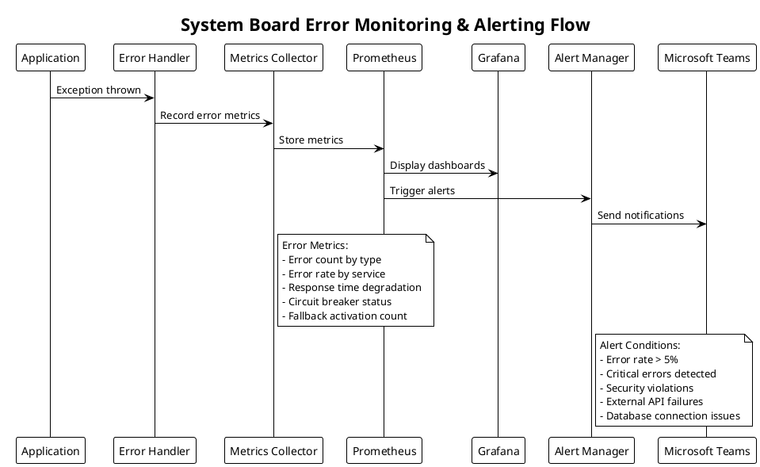

# System Board 例外処理・エラーハンドリング設計

**Phase**: Phase 2フォローアップ - 例外処理・エラーハンドリング設計  
**作成日**: 2025年9月16日  
**主担当**: Backend System Architect  
**対象**: Phase 2で特定されたCommands & Actorsに基づく例外処理設計

---

## 1. 設計概要

### 1.1 設計目標

System Boardの例外処理・エラーハンドリング設計は以下の要件を満たします：

- **堅牢性**: システム障害時でも業務継続性を確保
- **可観測性**: エラー発生時の迅速な問題特定と対応
- **セキュリティ**: セキュリティ関連エラーの適切な処理と監査
- **コンプライアンス**: 製造業5年間監査ログ保持要件への対応
- **ユーザビリティ**: 適切なエラーメッセージとユーザー体験

### 1.2 対象コマンド

Phase 2で特定された以下のコマンド群を対象とします：

- **User Commands (24個)**: RegisterSystem, ApplySecurityPatch, ViewDashboard等
- **System Commands (12個)**: ScanVulnerabilities, UpdateCVEDatabase等
- **External Commands (6個)**: ProcessRepositoryUpdate, HandleDependencyChange等
- **Fallback Commands (7個)**: ActivateFallbackMode, NotifyAPIFailure等

### 1.3 技術基盤

- **NestJS + TypeScript**: 型安全な例外処理
- **Hexagonal Architecture**: ドメイン例外とインフラ例外の分離
- **CQRS + Event Sourcing**: コマンド実行時の一貫性保証
- **OAuth2.0 + JWT**: 認証・認可関連エラーハンドリング

---

## 2. Exception Hierarchy

### 2.1 System Board例外クラス階層

```typescript
// Base Exception Classes
export abstract class SystemBoardException extends Error {
  abstract readonly code: string;
  abstract readonly severity: ErrorSeverity;
  abstract readonly context: ErrorContext;
  readonly timestamp: Date = new Date();
  readonly correlationId: string = generateCorrelationId();

  constructor(
    message: string,
    public readonly cause?: Error,
    public readonly metadata?: Record<string, unknown>
  ) {
    super(message);
    this.name = this.constructor.name;
  }

  abstract toAuditLog(): AuditLogEntry;
}

// Domain Exception Categories
export abstract class DomainException extends SystemBoardException {
  readonly context = ErrorContext.DOMAIN;
}

export abstract class ApplicationException extends SystemBoardException {
  readonly context = ErrorContext.APPLICATION;
}

export abstract class InfrastructureException extends SystemBoardException {
  readonly context = ErrorContext.INFRASTRUCTURE;
}

export abstract class SecurityException extends SystemBoardException {
  readonly context = ErrorContext.SECURITY;
  readonly severity = ErrorSeverity.HIGH;
}

// Specific Domain Exceptions
export class SystemManagementException extends DomainException {
  readonly code = 'SYS_MGMT_ERROR';
  readonly severity = ErrorSeverity.MEDIUM;
}

export class VulnerabilityManagementException extends DomainException {
  readonly code = 'VULN_MGMT_ERROR';
  readonly severity = ErrorSeverity.HIGH;
}

export class TaskManagementException extends DomainException {
  readonly code = 'TASK_MGMT_ERROR';
  readonly severity = ErrorSeverity.MEDIUM;
}

export class RelationshipManagementException extends DomainException {
  readonly code = 'REL_MGMT_ERROR';
  readonly severity = ErrorSeverity.MEDIUM;
}

// Application Layer Exceptions
export class CommandValidationException extends ApplicationException {
  readonly code = 'CMD_VALIDATION_ERROR';
  readonly severity = ErrorSeverity.LOW;
}

export class CommandExecutionException extends ApplicationException {
  readonly code = 'CMD_EXECUTION_ERROR';
  readonly severity = ErrorSeverity.MEDIUM;
}

export class QueryExecutionException extends ApplicationException {
  readonly code = 'QUERY_EXECUTION_ERROR';
  readonly severity = ErrorSeverity.LOW;
}

// Infrastructure Exceptions
export class ExternalApiException extends InfrastructureException {
  readonly code = 'EXTERNAL_API_ERROR';
  readonly severity = ErrorSeverity.MEDIUM;

  constructor(
    message: string,
    public readonly apiName: string,
    public readonly statusCode?: number,
    cause?: Error
  ) {
    super(message, cause, { apiName, statusCode });
  }
}

export class DatabaseException extends InfrastructureException {
  readonly code = 'DATABASE_ERROR';
  readonly severity = ErrorSeverity.HIGH;
}

export class EventStoreException extends InfrastructureException {
  readonly code = 'EVENT_STORE_ERROR';
  readonly severity = ErrorSeverity.HIGH;
}

export class CacheException extends InfrastructureException {
  readonly code = 'CACHE_ERROR';
  readonly severity = ErrorSeverity.LOW;
}

// Security Exceptions
export class AuthenticationException extends SecurityException {
  readonly code = 'AUTH_ERROR';
}

export class AuthorizationException extends SecurityException {
  readonly code = 'AUTHZ_ERROR';
}

export class SecurityPolicyViolationException extends SecurityException {
  readonly code = 'SECURITY_POLICY_VIOLATION';
}

export class AuditTrailException extends SecurityException {
  readonly code = 'AUDIT_TRAIL_ERROR';
}

// Enums and Types
export enum ErrorSeverity {
  LOW = 'LOW',
  MEDIUM = 'MEDIUM',
  HIGH = 'HIGH',
  CRITICAL = 'CRITICAL'
}

export enum ErrorContext {
  DOMAIN = 'DOMAIN',
  APPLICATION = 'APPLICATION',
  INFRASTRUCTURE = 'INFRASTRUCTURE',
  SECURITY = 'SECURITY'
}

export interface AuditLogEntry {
  timestamp: Date;
  correlationId: string;
  errorCode: string;
  severity: ErrorSeverity;
  context: ErrorContext;
  message: string;
  userId?: string;
  sessionId?: string;
  commandName?: string;
  metadata?: Record<string, unknown>;
}
```

### 2.2 特化例外クラス

```typescript
// Command-Specific Exceptions
export class SystemRegistrationException extends SystemManagementException {
  constructor(systemId: string, reason: string, cause?: Error) {
    super(`System registration failed for ${systemId}: ${reason}`, cause, { systemId });
  }

  toAuditLog(): AuditLogEntry {
    return {
      timestamp: this.timestamp,
      correlationId: this.correlationId,
      errorCode: this.code,
      severity: this.severity,
      context: this.context,
      message: this.message,
      metadata: { ...this.metadata, action: 'SYSTEM_REGISTRATION' }
    };
  }
}

export class VulnerabilityDetectionException extends VulnerabilityManagementException {
  constructor(packageId: string, cveId?: string, cause?: Error) {
    super(`Vulnerability detection failed for package ${packageId}`, cause, { packageId, cveId });
  }

  toAuditLog(): AuditLogEntry {
    return {
      timestamp: this.timestamp,
      correlationId: this.correlationId,
      errorCode: this.code,
      severity: this.severity,
      context: this.context,
      message: this.message,
      metadata: { ...this.metadata, action: 'VULNERABILITY_DETECTION' }
    };
  }
}

export class SecurityPatchApplicationException extends VulnerabilityManagementException {
  constructor(systemId: string, patchId: string, reason: string, cause?: Error) {
    super(`Security patch application failed: ${reason}`, cause, { systemId, patchId });
  }

  toAuditLog(): AuditLogEntry {
    return {
      timestamp: this.timestamp,
      correlationId: this.correlationId,
      errorCode: this.code,
      severity: ErrorSeverity.HIGH,
      context: this.context,
      message: this.message,
      metadata: { ...this.metadata, action: 'SECURITY_PATCH_APPLICATION' }
    };
  }
}

// External Integration Exceptions
export class GitHubApiException extends ExternalApiException {
  constructor(endpoint: string, statusCode: number, message: string, cause?: Error) {
    super(`GitHub API error at ${endpoint}: ${message}`, 'GitHub', statusCode, cause);
  }
}

export class NvdApiException extends ExternalApiException {
  constructor(cveId: string, statusCode: number, message: string, cause?: Error) {
    super(`NVD API error for CVE ${cveId}: ${message}`, 'NVD', statusCode, cause);
  }
}

export class EndOfLifeApiException extends ExternalApiException {
  constructor(product: string, message: string, cause?: Error) {
    super(`EndOfLife API error for ${product}: ${message}`, 'EndOfLife', undefined, cause);
  }
}
```

---

## 3. Error Handling Patterns

### 3.1 Command Handler Error Handling Pattern

```typescript
@CommandHandler(RegisterSystemCommand)
export class RegisterSystemHandler implements ICommandHandler<RegisterSystemCommand> {
  constructor(
    private readonly systemRepository: SystemRepository,
    private readonly auditLogger: AuditLogger,
    private readonly eventBus: EventBus
  ) {}

  async execute(command: RegisterSystemCommand): Promise<void> {
    const correlationId = generateCorrelationId();
    
    try {
      // 1. Command Validation
      await this.validateCommand(command);
      
      // 2. Business Logic Execution
      const system = System.create(command.systemData);
      await this.systemRepository.save(system);
      
      // 3. Event Publication
      const event = new SystemRegisteredEvent(system.id, system.getData());
      await this.eventBus.publish(event);
      
      // 4. Success Audit Log
      await this.auditLogger.logSuccess({
        correlationId,
        action: 'SYSTEM_REGISTRATION',
        userId: command.userId,
        systemId: system.id.value
      });
      
    } catch (error) {
      // Error Handling Chain
      const handledException = this.handleError(error, command, correlationId);
      
      // Audit Logging
      await this.auditLogger.logError(handledException.toAuditLog());
      
      // Compensation if needed
      await this.performCompensation(command, handledException);
      
      // Re-throw handled exception
      throw handledException;
    }
  }

  private handleError(
    error: unknown, 
    command: RegisterSystemCommand, 
    correlationId: string
  ): SystemBoardException {
    if (error instanceof SystemBoardException) {
      return error;
    }

    // Map known errors to domain exceptions
    if (error instanceof ValidationError) {
      return new CommandValidationException(
        `Command validation failed: ${error.message}`,
        error,
        { commandType: 'RegisterSystemCommand', correlationId }
      );
    }

    if (error instanceof DatabaseError) {
      return new DatabaseException(
        `Database operation failed during system registration`,
        error,
        { systemId: command.systemData.id, correlationId }
      );
    }

    // Unknown errors
    return new CommandExecutionException(
      `Unexpected error during system registration: ${error}`,
      error instanceof Error ? error : new Error(String(error)),
      { commandType: 'RegisterSystemCommand', correlationId }
    );
  }

  private async performCompensation(
    command: RegisterSystemCommand,
    error: SystemBoardException
  ): Promise<void> {
    // Implement compensation logic based on error type
    if (error instanceof DatabaseException) {
      // Database rollback is handled by transaction
      return;
    }

    if (error instanceof EventStoreException) {
      // Attempt to clean up any partial state
      try {
        await this.systemRepository.delete(new SystemId(command.systemData.id));
      } catch (compensationError) {
        // Log compensation failure but don't throw
        console.error('Compensation failed:', compensationError);
      }
    }
  }

  private async validateCommand(command: RegisterSystemCommand): Promise<void> {
    // Validate business rules
    const existingSystem = await this.systemRepository.findById(
      new SystemId(command.systemData.id)
    );
    
    if (existingSystem) {
      throw new SystemRegistrationException(
        command.systemData.id,
        'System with this ID already exists'
      );
    }

    // Validate system data structure
    if (!command.systemData.name || command.systemData.name.trim().length === 0) {
      throw new CommandValidationException(
        'System name is required',
        undefined,
        { field: 'name', value: command.systemData.name }
      );
    }
  }
}
```

### 3.2 Query Handler Error Handling Pattern

```typescript
@QueryHandler(GetSystemDashboardQuery)
export class GetSystemDashboardHandler implements IQueryHandler<GetSystemDashboardQuery> {
  constructor(
    private readonly systemReadModel: SystemReadModelRepository,
    private readonly vulnerabilityReadModel: VulnerabilityReadModelRepository,
    private readonly cacheService: CacheService
  ) {}

  async execute(query: GetSystemDashboardQuery): Promise<SystemDashboardData> {
    try {
      // 1. Try cache first
      const cachedData = await this.tryGetFromCache(query.userId);
      if (cachedData) {
        return cachedData;
      }

      // 2. Fetch from read models with timeout
      const dashboardData = await Promise.race([
        this.fetchDashboardData(query),
        this.createTimeoutPromise(5000) // 5 second timeout
      ]);

      // 3. Cache the result
      await this.trySetCache(query.userId, dashboardData);

      return dashboardData;

    } catch (error) {
      const handledException = this.handleQueryError(error, query);
      
      // For queries, we might return partial data instead of throwing
      if (handledException instanceof CacheException) {
        // Continue without cache
        return await this.fetchDashboardData(query);
      }

      if (handledException instanceof DatabaseException) {
        // Return minimal dashboard with error indication
        return this.createErrorDashboard(handledException);
      }

      throw handledException;
    }
  }

  private async tryGetFromCache(userId: string): Promise<SystemDashboardData | null> {
    try {
      return await this.cacheService.get(`dashboard:${userId}`);
    } catch (error) {
      // Cache errors are non-critical for queries
      console.warn('Cache read failed:', error);
      return null;
    }
  }

  private async trySetCache(userId: string, data: SystemDashboardData): Promise<void> {
    try {
      await this.cacheService.set(`dashboard:${userId}`, data, 300); // 5 minutes
    } catch (error) {
      // Cache errors are non-critical
      console.warn('Cache write failed:', error);
    }
  }

  private createErrorDashboard(error: SystemBoardException): SystemDashboardData {
    return {
      systems: [],
      vulnerabilities: [],
      tasks: [],
      alerts: [{
        type: 'error',
        message: 'Some dashboard data may be unavailable due to system issues',
        severity: error.severity
      }]
    };
  }

  private createTimeoutPromise(ms: number): Promise<never> {
    return new Promise((_, reject) => {
      setTimeout(() => reject(new QueryExecutionException(
        `Query timeout after ${ms}ms`,
        undefined,
        { timeout: ms }
      )), ms);
    });
  }
}
```

---

## 4. Retry Mechanisms & Circuit Breaker

### 4.1 External API Retry Strategy

```typescript
export interface RetryPolicy {
  maxAttempts: number;
  baseDelayMs: number;
  maxDelayMs: number;
  backoffMultiplier: number;
  retryableErrors: Array<new (...args: any[]) => Error>;
}

export class ExternalApiClient {
  private readonly retryPolicies: Map<string, RetryPolicy> = new Map([
    ['github', {
      maxAttempts: 3,
      baseDelayMs: 1000,
      maxDelayMs: 10000,
      backoffMultiplier: 2,
      retryableErrors: [GitHubApiException]
    }],
    ['nvd', {
      maxAttempts: 5,
      baseDelayMs: 2000,
      maxDelayMs: 30000,
      backoffMultiplier: 2,
      retryableErrors: [NvdApiException]
    }],
    ['endoflife', {
      maxAttempts: 2,
      baseDelayMs: 1000,
      maxDelayMs: 5000,
      backoffMultiplier: 1.5,
      retryableErrors: [EndOfLifeApiException]
    }]
  ]);

  private readonly circuitBreakers: Map<string, CircuitBreaker> = new Map();

  constructor() {
    // Initialize circuit breakers
    this.circuitBreakers.set('github', new CircuitBreaker({
      failureThreshold: 5,
      recoveryTimeoutMs: 60000,
      monitoringPeriodMs: 10000
    }));
    
    this.circuitBreakers.set('nvd', new CircuitBreaker({
      failureThreshold: 3,
      recoveryTimeoutMs: 120000,
      monitoringPeriodMs: 15000
    }));
  }

  async executeWithRetry<T>(
    apiName: string,
    operation: () => Promise<T>,
    context?: Record<string, unknown>
  ): Promise<T> {
    const policy = this.retryPolicies.get(apiName);
    const circuitBreaker = this.circuitBreakers.get(apiName);

    if (!policy) {
      throw new ExternalApiException(`No retry policy defined for API: ${apiName}`, apiName);
    }

    // Check circuit breaker
    if (circuitBreaker && circuitBreaker.isOpen()) {
      throw new ExternalApiException(
        `Circuit breaker is OPEN for API: ${apiName}`,
        apiName,
        undefined,
        undefined
      );
    }

    let lastError: Error;
    
    for (let attempt = 1; attempt <= policy.maxAttempts; attempt++) {
      try {
        const result = await operation();
        
        // Success - reset circuit breaker
        circuitBreaker?.recordSuccess();
        
        return result;
        
      } catch (error) {
        lastError = error instanceof Error ? error : new Error(String(error));
        
        // Record failure in circuit breaker
        circuitBreaker?.recordFailure();
        
        // Check if error is retryable
        const isRetryable = policy.retryableErrors.some(errorType => 
          error instanceof errorType || 
          (error as any)?.code === 'ECONNRESET' ||
          (error as any)?.code === 'ETIMEDOUT'
        );

        if (!isRetryable || attempt === policy.maxAttempts) {
          break;
        }

        // Calculate delay with exponential backoff
        const delay = Math.min(
          policy.baseDelayMs * Math.pow(policy.backoffMultiplier, attempt - 1),
          policy.maxDelayMs
        );

        console.warn(`API call failed (attempt ${attempt}/${policy.maxAttempts}), retrying in ${delay}ms:`, {
          apiName,
          error: error.message,
          context
        });

        await this.delay(delay);
      }
    }

    // All retries exhausted
    throw new ExternalApiException(
      `API call failed after ${policy.maxAttempts} attempts: ${lastError.message}`,
      apiName,
      undefined,
      lastError
    );
  }

  private delay(ms: number): Promise<void> {
    return new Promise(resolve => setTimeout(resolve, ms));
  }
}

export class CircuitBreaker {
  private state: CircuitBreakerState = CircuitBreakerState.CLOSED;
  private failureCount = 0;
  private lastFailureTime?: Date;
  private successCount = 0;

  constructor(private readonly config: CircuitBreakerConfig) {}

  isOpen(): boolean {
    return this.state === CircuitBreakerState.OPEN;
  }

  recordSuccess(): void {
    this.failureCount = 0;
    this.successCount++;
    
    if (this.state === CircuitBreakerState.HALF_OPEN) {
      this.state = CircuitBreakerState.CLOSED;
    }
  }

  recordFailure(): void {
    this.failureCount++;
    this.lastFailureTime = new Date();
    
    if (this.failureCount >= this.config.failureThreshold) {
      this.state = CircuitBreakerState.OPEN;
    }
  }

  checkState(): void {
    if (this.state === CircuitBreakerState.OPEN && this.lastFailureTime) {
      const timeSinceLastFailure = Date.now() - this.lastFailureTime.getTime();
      
      if (timeSinceLastFailure >= this.config.recoveryTimeoutMs) {
        this.state = CircuitBreakerState.HALF_OPEN;
        this.failureCount = 0;
      }
    }
  }
}

enum CircuitBreakerState {
  CLOSED = 'CLOSED',
  OPEN = 'OPEN',
  HALF_OPEN = 'HALF_OPEN'
}

interface CircuitBreakerConfig {
  failureThreshold: number;
  recoveryTimeoutMs: number;
  monitoringPeriodMs: number;
}
```

### 4.2 Integration Gateway Error Handling

```typescript
@Injectable()
export class IntegrationGatewayService {
  constructor(
    private readonly apiClient: ExternalApiClient,
    private readonly eventBus: EventBus,
    private readonly fallbackService: FallbackService
  ) {}

  async synchronizeWithGitHub(repositoryUrl: string): Promise<void> {
    try {
      await this.apiClient.executeWithRetry('github', async () => {
        const repoData = await this.fetchGitHubRepository(repositoryUrl);
        const dependencies = await this.fetchDependencies(repositoryUrl);
        
        await this.eventBus.publish(new GitHubRepositoryDataReceived({
          repositoryUrl,
          data: repoData,
          dependencies
        }));
      }, { repositoryUrl });

    } catch (error) {
      if (error instanceof ExternalApiException) {
        // Activate fallback mode
        await this.fallbackService.activateGitHubFallback(repositoryUrl, error);
        
        await this.eventBus.publish(new FallbackModeActivated({
          service: 'GitHub',
          reason: error.message,
          fallbackStrategy: 'MANUAL_INPUT'
        }));
      } else {
        throw error;
      }
    }
  }

  async fetchCVEUpdates(since?: Date): Promise<void> {
    try {
      await this.apiClient.executeWithRetry('nvd', async () => {
        const cveData = await this.fetchNVDData(since);
        
        for (const cve of cveData) {
          await this.eventBus.publish(new CVEInformationReceived(cve));
        }
      }, { since });

    } catch (error) {
      if (error instanceof ExternalApiException) {
        // For CVE updates, we can use cached data temporarily
        await this.fallbackService.useCachedCVEData();
        
        await this.eventBus.publish(new ExternalAPIConnectionFailed({
          api: 'NVD',
          error: error.message,
          fallbackActivated: true
        }));
      } else {
        throw error;
      }
    }
  }
}
```

---

## 5. Fallback Strategies

### 5.1 System Failure Fallback Architecture

```plantuml
@startuml FallbackArchitecture
!theme plain
title "System Board Fallback Strategies"

package "Primary Services" as PS #LightGreen {
  [GitHub API] as GitHub
  [NVD API] as NVD
  [EndOfLife API] as EOL
  [EventStore DB] as EventStore
  [PostgreSQL] as Postgres
}

package "Fallback Services" as FS #LightYellow {
  [Manual Input UI] as Manual
  [Cached CVE Data] as Cache
  [Local EOL Database] as LocalEOL
  [Backup EventStore] as BackupES
  [Read-Only Mode] as ReadOnly
}

package "Fallback Controller" as FC #LightBlue {
  [Fallback Orchestrator] as Orchestrator
  [Health Monitor] as Monitor
  [Recovery Manager] as Recovery
}

GitHub -x-> Manual : API failure
NVD -x-> Cache : Rate limit exceeded
EOL -x-> LocalEOL : Service unavailable
EventStore -x-> BackupES : Primary down
Postgres -x-> ReadOnly : Database issues

Monitor --> Orchestrator : Health status
Orchestrator --> Recovery : Initiate recovery
Recovery --> PS : Restore services

note right of FS
  Fallback Triggers:
  - API Rate Limits
  - Network Timeouts
  - Service Unavailable
  - Authentication Failures
  - Data Corruption
end note

@enduml
```

### 5.2 Fallback Service Implementation

```typescript
@Injectable()
export class FallbackService {
  private readonly fallbackStrategies: Map<string, FallbackStrategy> = new Map();
  
  constructor(
    private readonly cacheService: CacheService,
    private readonly notificationService: NotificationService,
    private readonly auditLogger: AuditLogger
  ) {
    this.initializeFallbackStrategies();
  }

  private initializeFallbackStrategies(): void {
    this.fallbackStrategies.set('github', new GitHubFallbackStrategy());
    this.fallbackStrategies.set('nvd', new NVDFallbackStrategy());
    this.fallbackStrategies.set('endoflife', new EndOfLifeFallbackStrategy());
    this.fallbackStrategies.set('database', new DatabaseFallbackStrategy());
    this.fallbackStrategies.set('eventstore', new EventStoreFallbackStrategy());
  }

  async activateGitHubFallback(repositoryUrl: string, error: ExternalApiException): Promise<void> {
    const strategy = this.fallbackStrategies.get('github');
    
    await strategy.activate({
      repositoryUrl,
      error: error.message,
      timestamp: new Date()
    });

    // Notify administrators
    await this.notificationService.sendAlert({
      type: 'FALLBACK_ACTIVATED',
      service: 'GitHub API',
      severity: 'MEDIUM',
      message: `GitHub API fallback activated for ${repositoryUrl}. Manual dependency input required.`,
      metadata: { repositoryUrl, error: error.message }
    });

    // Audit log
    await this.auditLogger.logEvent({
      action: 'FALLBACK_ACTIVATED',
      service: 'GitHub',
      reason: error.message,
      severity: ErrorSeverity.MEDIUM
    });
  }

  async useCachedCVEData(): Promise<void> {
    const strategy = this.fallbackStrategies.get('nvd');
    
    const cachedData = await this.cacheService.get('nvd:cve_data');
    if (!cachedData) {
      throw new NvdApiException(
        'unknown',
        0,
        'No cached CVE data available for fallback'
      );
    }

    await strategy.activate({
      dataSource: 'CACHE',
      lastUpdate: cachedData.timestamp,
      recordCount: cachedData.records.length
    });

    // Use cached data with warning
    await this.notificationService.sendAlert({
      type: 'FALLBACK_DATA_USED',
      service: 'NVD API',
      severity: 'LOW',
      message: `Using cached CVE data. Last update: ${cachedData.timestamp}`,
      metadata: { recordCount: cachedData.records.length }
    });
  }

  async activateDatabaseReadOnlyMode(error: DatabaseException): Promise<void> {
    const strategy = this.fallbackStrategies.get('database');
    
    await strategy.activate({
      mode: 'READ_ONLY',
      error: error.message,
      timestamp: new Date()
    });

    // Critical notification
    await this.notificationService.sendAlert({
      type: 'DATABASE_READONLY_MODE',
      service: 'PostgreSQL',
      severity: 'HIGH',
      message: 'Database write operations disabled. System in read-only mode.',
      metadata: { error: error.message }
    });

    // High severity audit log
    await this.auditLogger.logEvent({
      action: 'DATABASE_READONLY_ACTIVATED',
      reason: error.message,
      severity: ErrorSeverity.HIGH
    });
  }

  async checkRecoveryConditions(): Promise<Map<string, boolean>> {
    const recoveryStatus = new Map<string, boolean>();

    for (const [serviceName, strategy] of this.fallbackStrategies) {
      const canRecover = await strategy.checkRecoveryConditions();
      recoveryStatus.set(serviceName, canRecover);

      if (canRecover) {
        await this.attemptRecovery(serviceName, strategy);
      }
    }

    return recoveryStatus;
  }

  private async attemptRecovery(serviceName: string, strategy: FallbackStrategy): Promise<void> {
    try {
      await strategy.recover();
      
      await this.notificationService.sendAlert({
        type: 'SERVICE_RECOVERED',
        service: serviceName,
        severity: 'LOW',
        message: `${serviceName} service has recovered from fallback mode.`
      });

      await this.auditLogger.logEvent({
        action: 'SERVICE_RECOVERED',
        service: serviceName,
        severity: ErrorSeverity.LOW
      });

    } catch (recoveryError) {
      console.error(`Recovery failed for ${serviceName}:`, recoveryError);
      
      await this.auditLogger.logEvent({
        action: 'RECOVERY_FAILED',
        service: serviceName,
        reason: recoveryError.message,
        severity: ErrorSeverity.MEDIUM
      });
    }
  }
}

interface FallbackStrategy {
  activate(context: Record<string, unknown>): Promise<void>;
  checkRecoveryConditions(): Promise<boolean>;
  recover(): Promise<void>;
}

class GitHubFallbackStrategy implements FallbackStrategy {
  async activate(context: Record<string, unknown>): Promise<void> {
    // Enable manual dependency input UI
    // Store repository URL for manual processing
    console.log('GitHub fallback activated:', context);
  }

  async checkRecoveryConditions(): Promise<boolean> {
    // Test GitHub API availability
    try {
      const response = await fetch('https://api.github.com/rate_limit');
      return response.ok;
    } catch {
      return false;
    }
  }

  async recover(): Promise<void> {
    // Re-enable automatic GitHub synchronization
    console.log('GitHub service recovered');
  }
}

class NVDFallbackStrategy implements FallbackStrategy {
  async activate(context: Record<string, unknown>): Promise<void> {
    // Switch to cached CVE data
    console.log('NVD fallback activated:', context);
  }

  async checkRecoveryConditions(): Promise<boolean> {
    // Test NVD API availability
    try {
      const response = await fetch('https://services.nvd.nist.gov/rest/json/cves/2.0');
      return response.ok;
    } catch {
      return false;
    }
  }

  async recover(): Promise<void> {
    // Resume live CVE data fetching
    console.log('NVD service recovered');
  }
}
```

---

## 6. Audit Trail & Security Error Handling

### 6.1 Security-Enhanced Audit Logging

```typescript
@Injectable()
export class SecurityAuditLogger {
  constructor(
    private readonly auditRepository: AuditRepository,
    private readonly encryptionService: EncryptionService,
    private readonly notificationService: NotificationService
  ) {}

  async logSecurityEvent(event: SecurityAuditEvent): Promise<void> {
    try {
      // Encrypt sensitive data
      const encryptedEvent = await this.encryptSensitiveData(event);
      
      // Store with 5-year retention
      await this.auditRepository.store({
        ...encryptedEvent,
        retention: AuditRetention.FIVE_YEARS,
        compliance: ComplianceStandard.MANUFACTURING
      });

      // Immediate security alert for high-severity events
      if (event.severity === ErrorSeverity.HIGH || event.severity === ErrorSeverity.CRITICAL) {
        await this.sendSecurityAlert(event);
      }

    } catch (auditError) {
      // Audit failures are critical - use backup logging
      await this.backupAuditLog(event, auditError);
      
      throw new AuditTrailException(
        `Failed to log security event: ${auditError.message}`,
        auditError,
        { originalEvent: event }
      );
    }
  }

  async logAuthenticationFailure(failure: AuthenticationFailure): Promise<void> {
    const event: SecurityAuditEvent = {
      type: 'AUTHENTICATION_FAILURE',
      timestamp: new Date(),
      severity: ErrorSeverity.MEDIUM,
      userId: failure.userId,
      ipAddress: failure.ipAddress,
      userAgent: failure.userAgent,
      reason: failure.reason,
      metadata: {
        attemptNumber: failure.attemptNumber,
        sessionId: failure.sessionId
      }
    };

    await this.logSecurityEvent(event);

    // Check for brute force patterns
    await this.checkBruteForcePattern(failure.userId, failure.ipAddress);
  }

  async logAuthorizationViolation(violation: AuthorizationViolation): Promise<void> {
    const event: SecurityAuditEvent = {
      type: 'AUTHORIZATION_VIOLATION',
      timestamp: new Date(),
      severity: ErrorSeverity.HIGH,
      userId: violation.userId,
      requestedResource: violation.resource,
      requiredPermission: violation.permission,
      userRoles: violation.userRoles,
      metadata: {
        commandName: violation.commandName,
        sessionId: violation.sessionId
      }
    };

    await this.logSecurityEvent(event);

    // Immediate security notification
    await this.notificationService.sendSecurityAlert({
      type: 'UNAUTHORIZED_ACCESS_ATTEMPT',
      userId: violation.userId,
      resource: violation.resource,
      severity: 'HIGH'
    });
  }

  async logSecurityPolicyViolation(violation: SecurityPolicyViolation): Promise<void> {
    const event: SecurityAuditEvent = {
      type: 'SECURITY_POLICY_VIOLATION',
      timestamp: new Date(),
      severity: ErrorSeverity.CRITICAL,
      userId: violation.userId,
      policyName: violation.policyName,
      violationType: violation.violationType,
      metadata: {
        attemptedAction: violation.action,
        policyDetails: violation.policyDetails
      }
    };

    await this.logSecurityEvent(event);

    // Critical security notification
    await this.notificationService.sendCriticalSecurityAlert({
      type: 'SECURITY_POLICY_VIOLATION',
      userId: violation.userId,
      policy: violation.policyName,
      action: violation.action
    });
  }

  private async encryptSensitiveData(event: SecurityAuditEvent): Promise<SecurityAuditEvent> {
    const sensitiveFields = ['ipAddress', 'userAgent', 'metadata'];
    const encrypted = { ...event };

    for (const field of sensitiveFields) {
      if (encrypted[field]) {
        encrypted[`${field}_encrypted`] = await this.encryptionService.encrypt(
          JSON.stringify(encrypted[field])
        );
        delete encrypted[field];
      }
    }

    return encrypted;
  }

  private async checkBruteForcePattern(userId: string, ipAddress: string): Promise<void> {
    const recentFailures = await this.auditRepository.getRecentFailures(userId, ipAddress, 3600000); // 1 hour

    if (recentFailures.length >= 5) {
      await this.notificationService.sendSecurityAlert({
        type: 'BRUTE_FORCE_DETECTED',
        userId,
        ipAddress,
        attemptCount: recentFailures.length,
        severity: 'CRITICAL'
      });

      // Trigger account lockout
      await this.triggerAccountLockout(userId, 'BRUTE_FORCE_PROTECTION');
    }
  }

  private async triggerAccountLockout(userId: string, reason: string): Promise<void> {
    // Implementation for account lockout
    console.log(`Account locked: ${userId}, reason: ${reason}`);
  }

  private async sendSecurityAlert(event: SecurityAuditEvent): Promise<void> {
    await this.notificationService.sendSecurityAlert({
      type: event.type,
      severity: event.severity,
      timestamp: event.timestamp,
      details: event
    });
  }

  private async backupAuditLog(event: SecurityAuditEvent, error: Error): Promise<void> {
    // Write to backup audit log (file system, external service, etc.)
    console.error('Primary audit logging failed, using backup:', { event, error });
  }
}

interface SecurityAuditEvent {
  type: string;
  timestamp: Date;
  severity: ErrorSeverity;
  userId?: string;
  sessionId?: string;
  ipAddress?: string;
  userAgent?: string;
  requestedResource?: string;
  requiredPermission?: string;
  userRoles?: string[];
  policyName?: string;
  violationType?: string;
  reason?: string;
  metadata?: Record<string, unknown>;
}

interface AuthenticationFailure {
  userId: string;
  ipAddress: string;
  userAgent: string;
  reason: string;
  attemptNumber: number;
  sessionId: string;
}

interface AuthorizationViolation {
  userId: string;
  resource: string;
  permission: string;
  userRoles: string[];
  commandName: string;
  sessionId: string;
}

interface SecurityPolicyViolation {
  userId: string;
  policyName: string;
  violationType: string;
  action: string;
  policyDetails: Record<string, unknown>;
}

enum AuditRetention {
  ONE_YEAR = '1_YEAR',
  FIVE_YEARS = '5_YEARS',
  INDEFINITE = 'INDEFINITE'
}

enum ComplianceStandard {
  MANUFACTURING = 'MANUFACTURING',
  SOX = 'SOX',
  GDPR = 'GDPR'
}
```

### 6.2 Command Security Validation

```typescript
@Injectable()
export class CommandSecurityValidator {
  constructor(
    private readonly authService: AuthService,
    private readonly auditLogger: SecurityAuditLogger,
    private readonly policyEngine: SecurityPolicyEngine
  ) {}

  async validateCommandExecution<T extends Command>(
    command: T,
    context: SecurityContext
  ): Promise<CommandValidationResult> {
    try {
      // 1. Authentication validation
      await this.validateAuthentication(context);

      // 2. Authorization validation
      await this.validateAuthorization(command, context);

      // 3. Security policy validation
      await this.validateSecurityPolicy(command, context);

      // 4. Rate limiting validation
      await this.validateRateLimit(command, context);

      return { isValid: true };

    } catch (error) {
      if (error instanceof AuthenticationException) {
        await this.auditLogger.logAuthenticationFailure({
          userId: context.userId || 'unknown',
          ipAddress: context.ipAddress,
          userAgent: context.userAgent,
          reason: error.message,
          attemptNumber: context.attemptNumber || 1,
          sessionId: context.sessionId
        });
      }

      if (error instanceof AuthorizationException) {
        await this.auditLogger.logAuthorizationViolation({
          userId: context.userId,
          resource: command.constructor.name,
          permission: this.getRequiredPermission(command),
          userRoles: context.userRoles,
          commandName: command.constructor.name,
          sessionId: context.sessionId
        });
      }

      if (error instanceof SecurityPolicyViolationException) {
        await this.auditLogger.logSecurityPolicyViolation({
          userId: context.userId,
          policyName: error.metadata?.policyName as string,
          violationType: error.metadata?.violationType as string,
          action: command.constructor.name,
          policyDetails: error.metadata || {}
        });
      }

      return { isValid: false, error };
    }
  }

  private async validateAuthentication(context: SecurityContext): Promise<void> {
    if (!context.jwtToken) {
      throw new AuthenticationException('JWT token is required');
    }

    const tokenValidation = await this.authService.validateToken(context.jwtToken);
    if (!tokenValidation.isValid) {
      throw new AuthenticationException(`Invalid JWT token: ${tokenValidation.reason}`);
    }

    // Check token expiration
    if (tokenValidation.expiresAt < new Date()) {
      throw new AuthenticationException('JWT token has expired');
    }

    // Check session validity
    const sessionValid = await this.authService.validateSession(context.sessionId);
    if (!sessionValid) {
      throw new AuthenticationException('Invalid or expired session');
    }
  }

  private async validateAuthorization<T extends Command>(
    command: T,
    context: SecurityContext
  ): Promise<void> {
    const requiredPermission = this.getRequiredPermission(command);
    const hasPermission = await this.authService.checkPermission(
      context.userId,
      requiredPermission
    );

    if (!hasPermission) {
      throw new AuthorizationException(
        `User ${context.userId} lacks permission ${requiredPermission} for command ${command.constructor.name}`
      );
    }

    // Check MFA requirement for high-risk commands
    if (this.isHighRiskCommand(command) && !context.mfaVerified) {
      throw new AuthorizationException(
        `MFA verification required for command ${command.constructor.name}`
      );
    }
  }

  private async validateSecurityPolicy<T extends Command>(
    command: T,
    context: SecurityContext
  ): Promise<void> {
    const policyViolations = await this.policyEngine.checkPolicy(command, context);
    
    if (policyViolations.length > 0) {
      const violation = policyViolations[0];
      throw new SecurityPolicyViolationException(
        `Security policy violation: ${violation.description}`,
        undefined,
        {
          policyName: violation.policyName,
          violationType: violation.type,
          details: violation.details
        }
      );
    }
  }

  private async validateRateLimit<T extends Command>(
    command: T,
    context: SecurityContext
  ): Promise<void> {
    const rateLimitExceeded = await this.authService.checkRateLimit(
      context.userId,
      command.constructor.name
    );

    if (rateLimitExceeded) {
      throw new SecurityPolicyViolationException(
        `Rate limit exceeded for command ${command.constructor.name}`,
        undefined,
        {
          policyName: 'RATE_LIMITING',
          violationType: 'RATE_LIMIT_EXCEEDED',
          userId: context.userId,
          commandType: command.constructor.name
        }
      );
    }
  }

  private getRequiredPermission<T extends Command>(command: T): string {
    // Map commands to required permissions based on Phase 2 RBAC matrix
    const permissionMap = new Map([
      ['RegisterSystemCommand', 'SYSTEM_REGISTER'],
      ['ApplySecurityPatchCommand', 'SECURITY_PATCH_APPLY'],
      ['EscalateTaskCommand', 'TASK_ESCALATE'],
      ['ApproveMigrationPlanCommand', 'MITIGATION_APPROVE'],
      ['ApproveRiskAcceptanceCommand', 'RISK_APPROVE'],
      ['GenerateComplianceReportCommand', 'REPORT_GENERATE'],
      ['ViewAuditLogCommand', 'AUDIT_VIEW']
    ]);

    return permissionMap.get(command.constructor.name) || 'UNKNOWN_PERMISSION';
  }

  private isHighRiskCommand<T extends Command>(command: T): boolean {
    const highRiskCommands = [
      'ApproveRiskAcceptanceCommand',
      'DecommissionSystemCommand',
      'ApproveCapitalInvestmentCommand',
      'OverrideSecurityPolicyCommand'
    ];

    return highRiskCommands.includes(command.constructor.name);
  }
}

interface SecurityContext {
  userId: string;
  sessionId: string;
  jwtToken: string;
  userRoles: string[];
  ipAddress: string;
  userAgent: string;
  mfaVerified: boolean;
  attemptNumber?: number;
}

interface CommandValidationResult {
  isValid: boolean;
  error?: SecurityException;
}
```

---

## 7. Error Monitoring & Alerting

### 7.1 Comprehensive Error Monitoring



### 7.2 Error Metrics Collection

```typescript
@Injectable()
export class ErrorMetricsCollector {
  private readonly errorCounter = new prometheus.Counter({
    name: 'system_board_errors_total',
    help: 'Total number of errors by type and context',
    labelNames: ['error_type', 'error_context', 'severity', 'command_type']
  });

  private readonly errorRateGauge = new prometheus.Gauge({
    name: 'system_board_error_rate',
    help: 'Current error rate percentage',
    labelNames: ['service', 'context']
  });

  private readonly fallbackActivationCounter = new prometheus.Counter({
    name: 'system_board_fallback_activations_total',
    help: 'Total number of fallback activations',
    labelNames: ['service', 'reason']
  });

  private readonly securityViolationCounter = new prometheus.Counter({
    name: 'system_board_security_violations_total',
    help: 'Total number of security violations',
    labelNames: ['violation_type', 'user_role']
  });

  recordError(error: SystemBoardException, commandType?: string): void {
    this.errorCounter.inc({
      error_type: error.constructor.name,
      error_context: error.context,
      severity: error.severity,
      command_type: commandType || 'unknown'
    });

    // Update error rate
    this.updateErrorRate(error.context);

    // Special handling for security errors
    if (error instanceof SecurityException) {
      this.recordSecurityViolation(error);
    }
  }

  recordFallbackActivation(service: string, reason: string): void {
    this.fallbackActivationCounter.inc({
      service,
      reason
    });
  }

  private updateErrorRate(context: string): void {
    // Calculate error rate based on recent metrics
    const errorRate = this.calculateErrorRate(context);
    this.errorRateGauge.set({ service: 'system_board', context }, errorRate);
  }

  private calculateErrorRate(context: string): number {
    // Implementation to calculate error rate from recent metrics
    // This would typically query the metrics backend
    return 0; // Placeholder
  }

  private recordSecurityViolation(error: SecurityException): void {
    let violationType = 'unknown';
    let userRole = 'unknown';

    if (error instanceof AuthenticationException) {
      violationType = 'authentication_failure';
    } else if (error instanceof AuthorizationException) {
      violationType = 'authorization_violation';
    } else if (error instanceof SecurityPolicyViolationException) {
      violationType = 'policy_violation';
    }

    // Extract user role from error metadata if available
    if (error.metadata?.userRole) {
      userRole = error.metadata.userRole as string;
    }

    this.securityViolationCounter.inc({
      violation_type: violationType,
      user_role: userRole
    });
  }
}
```

---

## 8. Implementation Roadmap

### 8.1 Phase 3実装優先順位

1. **基本例外階層の実装** (優先度: 高)
   - SystemBoardException基底クラス
   - ドメイン固有例外クラス
   - インフラ例外クラス

2. **コマンドハンドラーエラーパターンの実装** (優先度: 高)
   - RegisterSystemCommandHandler
   - ApplySecurityPatchCommandHandler
   - エラーハンドリングテンプレート

3. **外部API例外処理の実装** (優先度: 中)
   - ExternalApiClient with retry logic
   - Circuit Breaker implementation
   - Fallback strategies

4. **セキュリティ監査ログの実装** (優先度: 高)
   - SecurityAuditLogger
   - 暗号化機能
   - 5年間保持機能

5. **監視・アラート機能の実装** (優先度: 中)
   - Prometheus metrics
   - Microsoft Teams通知
   - ダッシュボード

### 8.2 テスト戦略

```typescript
// Exception handling test examples
describe('SystemRegistrationHandler Error Handling', () => {
  it('should handle system duplication error', async () => {
    // Arrange
    const existingSystem = createMockSystem();
    jest.spyOn(systemRepository, 'findById').mockResolvedValue(existingSystem);

    // Act & Assert
    await expect(handler.execute(registerCommand))
      .rejects.toThrow(SystemRegistrationException);
  });

  it('should perform compensation on database error', async () => {
    // Arrange
    jest.spyOn(systemRepository, 'save').mockRejectedValue(new DatabaseError());
    const compensationSpy = jest.spyOn(handler, 'performCompensation');

    // Act
    try {
      await handler.execute(registerCommand);
    } catch (error) {
      // Assert
      expect(compensationSpy).toHaveBeenCalled();
      expect(error).toBeInstanceOf(DatabaseException);
    }
  });

  it('should log audit trail on error', async () => {
    // Arrange
    jest.spyOn(systemRepository, 'save').mockRejectedValue(new Error('Unexpected'));
    const auditSpy = jest.spyOn(auditLogger, 'logError');

    // Act
    try {
      await handler.execute(registerCommand);
    } catch (error) {
      // Assert
      expect(auditSpy).toHaveBeenCalledWith(
        expect.objectContaining({
          action: 'SYSTEM_REGISTRATION',
          severity: ErrorSeverity.MEDIUM
        })
      );
    }
  });
});

describe('Circuit Breaker', () => {
  it('should open circuit after failure threshold', async () => {
    // Arrange
    const circuitBreaker = new CircuitBreaker({
      failureThreshold: 3,
      recoveryTimeoutMs: 60000,
      monitoringPeriodMs: 10000
    });

    // Act
    for (let i = 0; i < 3; i++) {
      circuitBreaker.recordFailure();
    }

    // Assert
    expect(circuitBreaker.isOpen()).toBe(true);
  });

  it('should transition to half-open after recovery timeout', async () => {
    // Test circuit breaker recovery logic
  });
});
```

---

## 9. まとめ

### 9.1 設計成果物

本設計では以下の成果物を提供しました：

1. **例外クラス階層**: System Board固有の構造化された例外処理
2. **エラーハンドリングパターン**: コマンド・クエリ実行時の堅牢なエラー処理
3. **リトライ・Circuit Breaker**: 外部API連携の信頼性向上
4. **フォールバック戦略**: システム障害時の業務継続性確保
5. **セキュリティ監査**: 5年間保持要件を満たす監査ログ
6. **監視・アラート**: プロアクティブな問題検知と通知

### 9.2 Phase 3実装への準備完了

本設計はPhase 3「ビジネスルール・ポリシー実装」での実装準備が完了しています：

- **型安全性**: TypeScriptによる型安全な例外処理
- **アーキテクチャ整合性**: Hexagonal Architectureとの適合
- **セキュリティ要件**: 製造業コンプライアンス要件への対応
- **運用要件**: 監視・アラート・監査ログの包括的な設計

---

**設計完了日**: 2025年9月16日  
**次期アクション**: Phase 3でのビジネスルール実装時に本例外処理設計を適用  
**文書バージョン**: v1.0  
**レビュー要求**: Software Architecture Advisor, Cybersecurity Advisor
