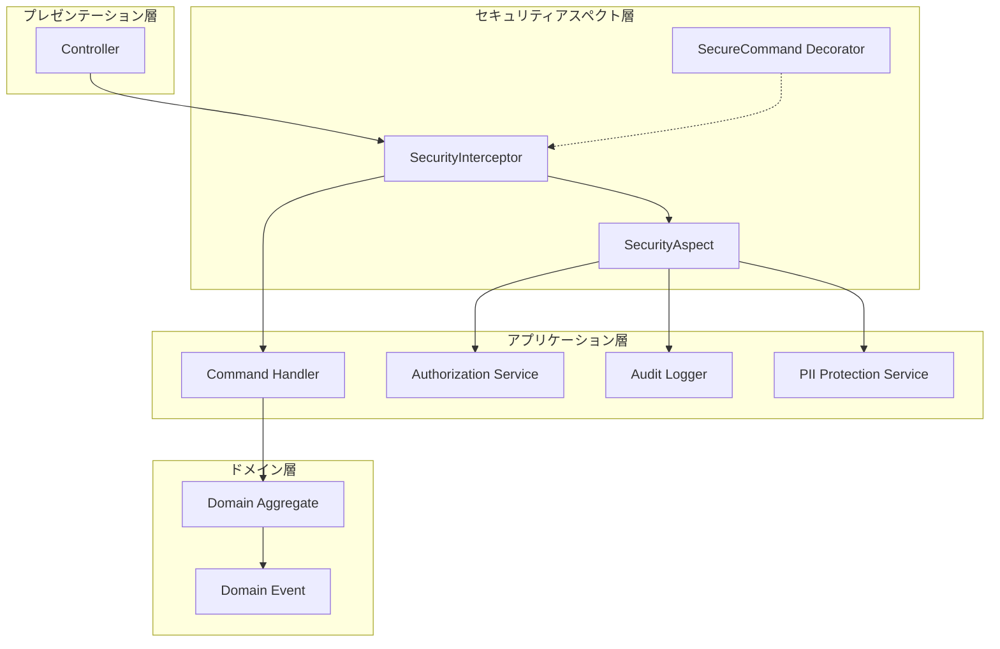
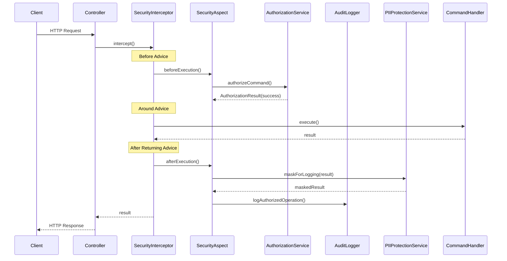
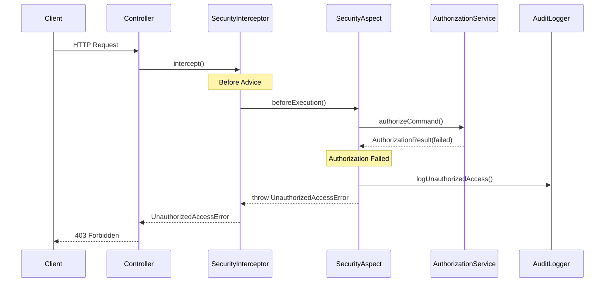
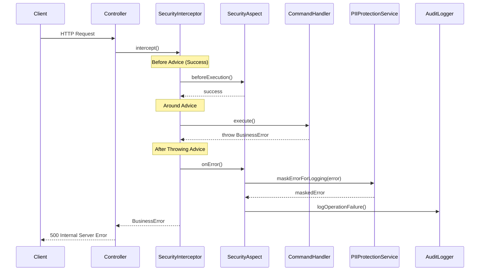

# セキュリティアスペクト指向プログラミング（AOP）設計書

**作成日**: 2025-09-28
**更新日**: 2025-09-28
**アーキテクチャパターン**: アスペクト指向プログラミング + セキュリティ横断的関心事

## 1. 概要

System Boardにおけるセキュリティ横断的関心事をアスペクト指向プログラミング（AOP）により自動化し、コードの重複排除と記述漏れ防止を実現する設計。

### 1.1 核心原則

- **横断的関心事の分離**: セキュリティロジックをビジネスロジックから完全分離
- **宣言的セキュリティ**: デコレーターによるセキュリティポリシー宣言
- **自動適用**: インターセプターによる透明なセキュリティ処理織り込み
- **DRY原則**: セキュリティコードの重複排除
- **関心事の統一**: 認可・監査・PII保護の一元管理

## 2. アーキテクチャ設計

### 2.1 AOPアーキテクチャ概要



### 2.2 セキュリティポイントカット定義

**ポイントカット**: セキュリティが適用されるメソッド実行ポイント

- **対象**: `@SecureCommand`デコレーターが付与されたコマンドハンドラー
- **実行タイミング**: メソッド実行前後・例外発生時
- **適用範囲**: システム管理・脆弱性管理・タスク管理・関係管理の全コンテキスト

```typescript
// ポイントカット定義
interface SecurityPointcut {
  target: CommandHandler;
  method: string;
  securityMetadata: SecurityMetadata;
  executionContext: ExecutionContext;
}

// アドバイス実行順序
enum AdviceOrder {
  BEFORE_AUTHORIZATION = 1,    // 認可チェック
  AROUND_EXECUTION = 2,        // 実行ラップ
  AFTER_SUCCESS = 3,          // 成功監査
  AFTER_THROWING = 4          // エラー監査
}
```

## 3. セキュリティアスペクト実装

### 3.1 SecurityAspect（セキュリティアスペクト）

**責務**: 横断的セキュリティ関心事の統合実行

```typescript
@Injectable()
export class SecurityAspect {
  constructor(
    private readonly authorizationService: SystemAuthorizationService,
    private readonly auditLogger: SecurityAuditLogger,
    private readonly piiProtectionService: PIIProtectionService,
    private readonly logger: Logger
  ) {}

  // Before Advice: 認可チェック
  async beforeExecution<T extends SecureCommand>(
    command: T,
    context: ExecutionContext
  ): Promise<void> {
    const startTime = Date.now();

    try {
      // 1. セキュリティメタデータ取得
      const securityMetadata = command.getSecurityMetadata();

      // 2. 認可チェック実行
      const authResult = await this.authorizationService.authorizeCommand(securityMetadata);

      if (!authResult.isAuthorized()) {
        // 3. 不正アクセス監査ログ
        await this.auditLogger.logUnauthorizedAccess({
          command: context.getClass().name,
          method: context.getHandler().name,
          reason: authResult.getReason(),
          userContext: command.userContext,
          securityClassification: command.securityClassification,
          attemptTimestamp: new Date(),
          authorizationDuration: Date.now() - startTime
        });

        throw new UnauthorizedAccessError(authResult.getReason());
      }

      // 4. 認可成功ログ（デバッグレベル）
      this.logger.debug('Authorization successful', {
        command: context.getClass().name,
        method: context.getHandler().name,
        userId: command.userContext.userId,
        duration: Date.now() - startTime
      });

    } catch (error) {
      this.logger.error('Authorization failed', {
        command: context.getClass().name,
        method: context.getHandler().name,
        error: error.message,
        duration: Date.now() - startTime
      });
      throw error;
    }
  }

  // After Returning Advice: 成功監査ログ
  async afterExecution<T extends SecureCommand>(
    command: T,
    result: any,
    context: ExecutionContext,
    executionTime: number
  ): Promise<void> {
    try {
      // 1. PII保護済み結果データ作成
      const maskedResult = await this.piiProtectionService.maskForLogging(result);

      // 2. 成功監査ログ記録
      await this.auditLogger.logAuthorizedOperation({
        command: context.getClass().name,
        method: context.getHandler().name,
        result: maskedResult,
        userContext: command.userContext,
        executionTime,
        successTimestamp: new Date()
      });

    } catch (error) {
      // 監査ログ失敗は業務処理に影響させない
      this.logger.error('Success audit logging failed', {
        command: context.getClass().name,
        method: context.getHandler().name,
        error: error.message
      });
    }
  }

  // After Throwing Advice: エラー監査ログ
  async onError<T extends SecureCommand>(
    command: T,
    error: Error,
    context: ExecutionContext,
    executionTime: number
  ): Promise<void> {
    try {
      // 1. PII保護済みエラーデータ作成
      const maskedError = await this.piiProtectionService.maskErrorForLogging(error);

      // 2. エラー監査ログ記録
      await this.auditLogger.logOperationFailure({
        command: context.getClass().name,
        method: context.getHandler().name,
        error: maskedError,
        userContext: command.userContext,
        executionTime,
        failureTimestamp: new Date(),
        errorType: error.constructor.name
      });

    } catch (auditError) {
      // 監査ログ失敗は業務処理に影響させない
      this.logger.error('Error audit logging failed', {
        command: context.getClass().name,
        method: context.getHandler().name,
        originalError: error.message,
        auditError: auditError.message
      });
    }
  }
}
```

### 3.2 SecurityInterceptor（セキュリティインターセプター）

**責務**: NestJSインターセプターによるAOP実現

```typescript
@Injectable()
export class SecurityInterceptor implements NestInterceptor {
  constructor(
    private readonly securityAspect: SecurityAspect,
    private readonly reflector: Reflector,
    private readonly logger: Logger
  ) {}

  async intercept(
    context: ExecutionContext,
    next: CallHandler
  ): Promise<Observable<any>> {
    // 1. セキュリティメタデータ取得
    const securityMetadata = this.reflector.get<SecurityMetadata>(
      SECURITY_METADATA_KEY,
      context.getHandler()
    );

    // セキュリティメタデータがない場合はバイパス
    if (!securityMetadata) {
      return next.handle();
    }

    const startTime = Date.now();
    const request = this.getRequest(context);
    const command = this.extractCommand(request);

    // セキュアコマンドインターフェース確認
    if (!this.isSecureCommand(command)) {
      this.logger.warn('Command does not implement SecureCommand interface', {
        command: command?.constructor?.name || 'Unknown',
        handler: context.getHandler().name
      });
      return next.handle();
    }

    try {
      // Before Advice: 認可チェック
      await this.securityAspect.beforeExecution(command, context);

      // Around Advice: 実行監視
      return next.handle().pipe(
        tap(async (result) => {
          // After Returning Advice: 成功監査ログ
          const executionTime = Date.now() - startTime;
          await this.securityAspect.afterExecution(
            command,
            result,
            context,
            executionTime
          );
        }),
        catchError(async (error) => {
          // After Throwing Advice: エラー監査ログ
          const executionTime = Date.now() - startTime;
          await this.securityAspect.onError(
            command,
            error,
            context,
            executionTime
          );
          throw error;
        })
      );

    } catch (error) {
      // Before Advice でのエラー処理
      const executionTime = Date.now() - startTime;
      await this.securityAspect.onError(command, error, context, executionTime);
      throw error;
    }
  }

  private getRequest(context: ExecutionContext): any {
    switch (context.getType()) {
      case 'http':
        return context.switchToHttp().getRequest();
      case 'rpc':
        return context.switchToRpc().getContext();
      default:
        return context.getArgs()[0];
    }
  }

  private extractCommand(request: any): any {
    // HTTP Request からコマンド抽出
    return request.body || request.data || request;
  }

  private isSecureCommand(command: any): command is SecureCommand {
    return (
      command &&
      typeof command.getSecurityMetadata === 'function' &&
      command.userContext &&
      command.securityClassification !== undefined
    );
  }
}
```

## 4. デコレーターベース宣言的セキュリティ

### 4.1 @SecureCommand デコレーター

**責務**: セキュリティ要件の宣言的記述

```typescript
// セキュリティメタデータキー
export const SECURITY_METADATA_KEY = 'security';

// セキュリティレベル定義
export enum SecurityLevel {
  PUBLIC = 'PUBLIC',
  INTERNAL = 'INTERNAL',
  CONFIDENTIAL = 'CONFIDENTIAL',
  RESTRICTED = 'RESTRICTED'
}

// 監査レベル定義
export enum AuditLevel {
  NONE = 'NONE',
  BASIC = 'BASIC',
  STANDARD = 'STANDARD',
  DETAILED = 'DETAILED',
  COMPREHENSIVE = 'COMPREHENSIVE'
}

// セキュリティメタデータ
export interface SecurityMetadata {
  minimumClassification: SecurityClassification;
  minimumRole: UserRole;
  auditLevel: AuditLevel;
  requiresAuthorization: boolean;
  requiresEncryption?: boolean;
  requiresSessionValidation?: boolean;
  rateLimitConfig?: RateLimitConfig;
  conditions?: SecurityCondition[];
}

// セキュリティ条件
export interface SecurityCondition {
  condition: (command: SecureCommand) => boolean;
  message: string;
}

// レート制限設定
export interface RateLimitConfig {
  maxRequests: number;
  windowMs: number;
  keyGenerator?: (command: SecureCommand) => string;
}

// デコレーター実装
export function SecureCommand(
  minimumClassification: SecurityClassification = SecurityClassification.INTERNAL,
  minimumRole: UserRole = UserRole.OPERATOR,
  options: Partial<SecurityMetadata> = {}
): MethodDecorator {
  return SetMetadata(SECURITY_METADATA_KEY, {
    minimumClassification,
    minimumRole,
    auditLevel: AuditLevel.STANDARD,
    requiresAuthorization: true,
    requiresEncryption: false,
    requiresSessionValidation: true,
    ...options
  });
}

// 特殊用途デコレーター
export function PublicCommand(): MethodDecorator {
  return SecureCommand(SecurityClassification.PUBLIC, UserRole.ANONYMOUS, {
    requiresAuthorization: false,
    auditLevel: AuditLevel.BASIC
  });
}

export function HighSecurityCommand(
  minimumRole: UserRole = UserRole.ADMINISTRATOR
): MethodDecorator {
  return SecureCommand(SecurityClassification.RESTRICTED, minimumRole, {
    auditLevel: AuditLevel.COMPREHENSIVE,
    requiresEncryption: true
  });
}

export function ConditionalSecurityCommand(
  conditions: SecurityCondition[]
): MethodDecorator {
  return SecureCommand(SecurityClassification.INTERNAL, UserRole.OPERATOR, {
    conditions
  });
}
```

### 4.2 使用例

```typescript
// 基本的なセキュアコマンド
@CommandHandler(RegisterSystemCommand)
@SecureCommand(SecurityClassification.INTERNAL, UserRole.OPERATOR)
export class RegisterSystemHandler {
  async execute(command: RegisterSystemCommand): Promise<SystemId> {
    // ビジネスロジックのみ
  }
}

// 高セキュリティコマンド
@CommandHandler(UpdateSecurityClassificationCommand)
@HighSecurityCommand(UserRole.SECURITY_OFFICER)
export class UpdateSecurityClassificationHandler {
  async execute(command: UpdateSecurityClassificationCommand): Promise<void> {
    // 高度なセキュリティが必要な操作
  }
}

// パブリックコマンド
@CommandHandler(GetSystemStatisticsQuery)
@PublicCommand()
export class GetSystemStatisticsHandler {
  async execute(query: GetSystemStatisticsQuery): Promise<SystemStatistics> {
    // パブリックアクセス可能な操作
  }
}

// 条件付きセキュリティ
@CommandHandler(UpdateSystemConfigurationCommand)
@ConditionalSecurityCommand([
  {
    condition: (cmd) => cmd.securityClassification !== SecurityClassification.PUBLIC,
    message: 'Non-public systems require enhanced security'
  }
])
export class UpdateSystemConfigurationHandler {
  async execute(command: UpdateSystemConfigurationCommand): Promise<void> {
    // 条件に基づくセキュリティ適用
  }
}
```

## 5. セキュリティタイミング図

### 5.1 正常フロー



### 5.2 認可失敗フロー



### 5.3 実行時エラーフロー



## 6. セキュリティサービス詳細

### 6.1 認可チェック（実行前）

**タイミング**: コマンド実行前（Before Advice）
**責務**: ユーザーの権限とセキュリティ分類の適合性検証

```typescript
export interface AuthorizationMatrix {
  check(
    userRole: UserRole,
    targetClassification: SecurityClassification,
    requiredAction: SystemAction
  ): Promise<boolean>;

  checkFieldAccess(
    userRole: UserRole,
    targetClassification: SecurityClassification,
    fieldLevel: SecurityLevel
  ): Promise<boolean>;
}

// 権限マトリックス実装例
const AUTHORIZATION_MATRIX = {
  [UserRole.ANONYMOUS]: {
    [SecurityClassification.PUBLIC]: [SystemAction.READ],
  },
  [UserRole.OPERATOR]: {
    [SecurityClassification.PUBLIC]: [SystemAction.READ, SystemAction.CREATE],
    [SecurityClassification.INTERNAL]: [SystemAction.READ, SystemAction.UPDATE],
  },
  [UserRole.ADMINISTRATOR]: {
    [SecurityClassification.PUBLIC]: ALL_ACTIONS,
    [SecurityClassification.INTERNAL]: ALL_ACTIONS,
    [SecurityClassification.CONFIDENTIAL]: [SystemAction.READ, SystemAction.UPDATE],
  },
  [UserRole.SECURITY_OFFICER]: {
    [SecurityClassification.PUBLIC]: ALL_ACTIONS,
    [SecurityClassification.INTERNAL]: ALL_ACTIONS,
    [SecurityClassification.CONFIDENTIAL]: ALL_ACTIONS,
    [SecurityClassification.RESTRICTED]: ALL_ACTIONS,
  }
};
```

### 6.2 監査ログ（成功時・失敗時）

**タイミング**: コマンド実行後・例外発生時
**責務**: ISO 27001、NIST準拠の監査証跡記録

```typescript
// 監査ログエントリ構造
export interface AuditLogEntry {
  eventType: AuditEventType;
  timestamp: string;
  command: string;
  method: string;
  userId: string;
  userRole: UserRole;
  sourceIp: string;
  sessionId: string;
  result?: any;
  error?: any;
  executionTime: number;
  complianceFrameworks: string[];
  auditLevel: AuditLevel;
  correlationId: string;
}

// 監査イベントタイプ
export enum AuditEventType {
  OPERATION_AUTHORIZED = 'OPERATION_AUTHORIZED',
  OPERATION_FAILURE = 'OPERATION_FAILURE',
  UNAUTHORIZED_ACCESS_ATTEMPT = 'UNAUTHORIZED_ACCESS_ATTEMPT',
  SESSION_STARTED = 'SESSION_STARTED',
  SESSION_ENDED = 'SESSION_ENDED',
  CONFIGURATION_CHANGED = 'CONFIGURATION_CHANGED',
  DATA_EXPORT = 'DATA_EXPORT',
  PRIVILEGE_ESCALATION = 'PRIVILEGE_ESCALATION'
}
```

### 6.3 PII保護（ログ出力時・エラー処理時）

**タイミング**: ログ・監査記録時
**責務**: 個人識別情報の自動検出・マスキング

```typescript
export interface PIIDetector {
  maskSensitiveData(data: any): Promise<any>;
  detectPIIFields(data: any): string[];
  getMaskingStrategy(fieldType: PIIFieldType): MaskingStrategy;
}

// PII フィールドタイプ
export enum PIIFieldType {
  EMAIL = 'EMAIL',
  PHONE = 'PHONE',
  SSN = 'SSN',
  CREDIT_CARD = 'CREDIT_CARD',
  IP_ADDRESS = 'IP_ADDRESS',
  USER_ID = 'USER_ID',
  PASSWORD = 'PASSWORD',
  API_KEY = 'API_KEY',
  PERSONAL_NAME = 'PERSONAL_NAME'
}

// マスキング戦略
export enum MaskingStrategy {
  FULL_MASK = 'FULL_MASK',           // ****
  PARTIAL_MASK = 'PARTIAL_MASK',     // jo***@example.com
  HASH = 'HASH',                     // SHA-256ハッシュ
  ENCRYPT = 'ENCRYPT',               // 暗号化
  REMOVE = 'REMOVE',                 // フィールド削除
  TOKENIZE = 'TOKENIZE'              // トークン化
}

// PII マスキング実装例
const PII_MASKING_RULES = {
  [PIIFieldType.EMAIL]: MaskingStrategy.PARTIAL_MASK,
  [PIIFieldType.PHONE]: MaskingStrategy.PARTIAL_MASK,
  [PIIFieldType.PASSWORD]: MaskingStrategy.FULL_MASK,
  [PIIFieldType.API_KEY]: MaskingStrategy.HASH,
  [PIIFieldType.IP_ADDRESS]: MaskingStrategy.PARTIAL_MASK,
  [PIIFieldType.PERSONAL_NAME]: MaskingStrategy.PARTIAL_MASK
};
```

## 7. モジュール設定

### 7.1 SecurityModule

```typescript
@Module({
  providers: [
    // Core Security Services
    SecurityAspect,
    SystemAuthorizationService,
    SecurityAuditLogger,
    PIIProtectionService,

    // Security Infrastructure
    AuthorizationMatrix,
    PIIDetector,
    EncryptionService,
    AuditStorage,
    ComplianceReporter,
    SecurityIncidentManager,

    // Global Interceptor
    {
      provide: APP_INTERCEPTOR,
      useClass: SecurityInterceptor,
    },

    // Performance Optimization
    {
      provide: SystemAuthorizationService,
      useClass: CachedAuthorizationService,
    },
  ],
  exports: [
    SecurityAspect,
    SystemAuthorizationService,
    SecurityAuditLogger,
    PIIProtectionService,
  ],
})
export class SecurityModule {}
```

### 7.2 アプリケーションモジュール統合

```typescript
@Module({
  imports: [
    SecurityModule,
    // 他のモジュール
  ],
  providers: [
    // コマンドハンドラー（セキュリティは自動適用）
    RegisterSystemHandler,
    UpdateSystemConfigurationHandler,
    DecommissionSystemHandler,
  ],
})
export class SystemManagementModule {}
```

## 8. パフォーマンス最適化

### 8.1 認可結果キャッシュ

```typescript
@Injectable()
export class CachedAuthorizationService extends SystemAuthorizationService {
  constructor(
    @Inject(CACHE_MANAGER) private cacheManager: Cache,
    authorizationMatrix: AuthorizationMatrix,
    rolePermissionService: RolePermissionService
  ) {
    super(authorizationMatrix, rolePermissionService);
  }

  @Cacheable('authorization', 300) // 5分キャッシュ
  async authorizeCommand(metadata: SecurityCommandMetadata): Promise<AuthorizationResult> {
    return super.authorizeCommand(metadata);
  }

  @CacheEvict('authorization')
  async invalidateUserCache(userId: string): Promise<void> {
    // ユーザー権限変更時のキャッシュ無効化
  }
}
```

### 8.2 非同期監査ログ

```typescript
@Injectable()
export class AsyncSecurityAuditLogger extends SecurityAuditLogger {
  private auditQueue = new BullQueue<AuditLogEntry>('audit-queue');

  async logAuthorizedOperation(audit: OperationAudit): Promise<void> {
    // 非同期キューに追加（レスポンス時間に影響させない）
    await this.auditQueue.add('log-operation', audit, {
      delay: 0,
      attempts: 3,
      backoff: 'exponential'
    });
  }

  @Process('log-operation')
  async processAuditLog(job: Job<OperationAudit>): Promise<void> {
    return super.logAuthorizedOperation(job.data);
  }
}
```

## 9. テスト戦略

### 9.1 セキュリティアスペクトのテスト

```typescript
describe('SecurityAspect', () => {
  let securityAspect: SecurityAspect;
  let authorizationService: jest.Mocked<SystemAuthorizationService>;
  let auditLogger: jest.Mocked<SecurityAuditLogger>;

  beforeEach(() => {
    // モックセットアップ
  });

  describe('beforeExecution', () => {
    it('should authorize valid command', async () => {
      // 認可成功テスト
    });

    it('should throw UnauthorizedAccessError for invalid command', async () => {
      // 認可失敗テスト
    });

    it('should log unauthorized access attempt', async () => {
      // 不正アクセス監査ログテスト
    });
  });

  describe('afterExecution', () => {
    it('should log successful operation with masked data', async () => {
      // 成功監査ログテスト
    });
  });

  describe('onError', () => {
    it('should log operation failure with masked error', async () => {
      // エラー監査ログテスト
    });
  });
});
```

### 9.2 インテグレーションテスト

```typescript
describe('Security AOP Integration', () => {
  let app: INestApplication;

  beforeAll(async () => {
    const module = await Test.createTestingModule({
      imports: [SecurityModule, SystemManagementModule],
    }).compile();

    app = module.createNestApplication();
    await app.init();
  });

  it('should automatically apply security to @SecureCommand handlers', async () => {
    // AOPセキュリティ統合テスト
  });

  it('should bypass security for public commands', async () => {
    // パブリックコマンドテスト
  });
});
```

## 10. 運用・監視

### 10.1 セキュリティメトリクス

- **認可失敗率**: 全リクエストに対する認可失敗の割合
- **監査ログ記録率**: 監査対象操作の記録完了率
- **PII検出率**: ログ内PII自動検出・マスキング率
- **セキュリティレスポンス時間**: セキュリティ処理の実行時間
- **権限エスカレーション検出**: 不正な権限昇格試行の検出

### 10.2 アラート設定

```typescript
// セキュリティアラート設定
export const SECURITY_ALERTS = {
  HIGH_AUTHORIZATION_FAILURE_RATE: {
    threshold: 0.1, // 10%以上の認可失敗
    window: '5m',
    action: 'IMMEDIATE_ALERT'
  },
  PRIVILEGE_ESCALATION_ATTEMPT: {
    threshold: 1, // 1回でも検出
    window: '1m',
    action: 'SECURITY_INCIDENT'
  },
  AUDIT_LOG_FAILURE: {
    threshold: 0.05, // 5%以上の監査ログ失敗
    window: '10m',
    action: 'COMPLIANCE_ALERT'
  }
};
```

## 11. 利点と制約

### 11.1 利点

1. **DRY原則**: セキュリティロジックの重複排除
2. **関心事の分離**: ビジネスロジックとセキュリティの明確な分離
3. **記述漏れ防止**: 自動適用による人為的ミスの排除
4. **保守性向上**: セキュリティポリシーの一元管理
5. **テスタビリティ**: ビジネスロジックの単体テスト簡素化
6. **可読性向上**: コマンドハンドラーの意図明確化
7. **一貫性**: 全コンテキストでの統一されたセキュリティ適用

### 11.2 制約・考慮事項

1. **パフォーマンス**: インターセプターによるオーバーヘッド
2. **デバッグ複雑性**: AOPによる実行フローの見えにくさ
3. **学習コストー**: AOP概念の理解が必要
4. **フレームワーク依存**: NestJS特有の実装
5. **実行時エラー**: デコレーター設定ミスによる実行時例外

### 11.3 ベストプラクティス

1. **メタデータ検証**: デコレーター設定の静的解析
2. **パフォーマンス監視**: セキュリティ処理時間の継続監視
3. **段階的適用**: 既存コードへの段階的AOP導入
4. **ドキュメント化**: セキュリティポリシーの明文化
5. **定期レビュー**: セキュリティメタデータの定期見直し

---

この設計により、System Boardの全コンテキストで一貫したセキュリティが自動適用され、開発効率と安全性の両立を実現する。
