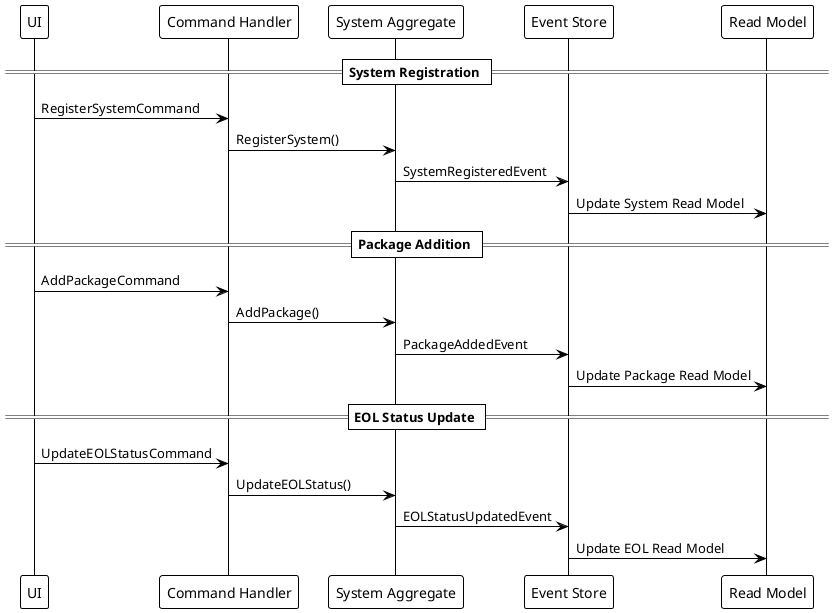
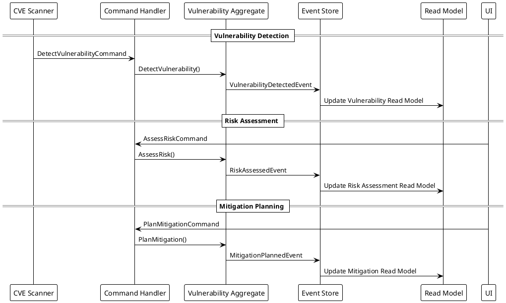
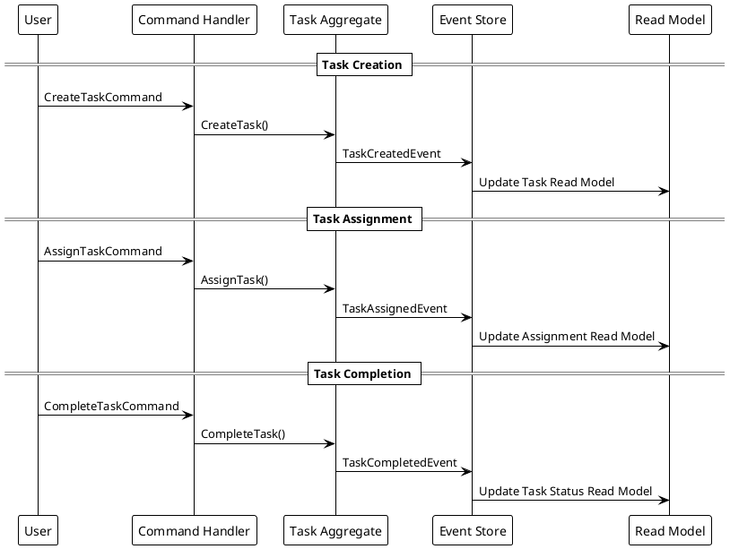
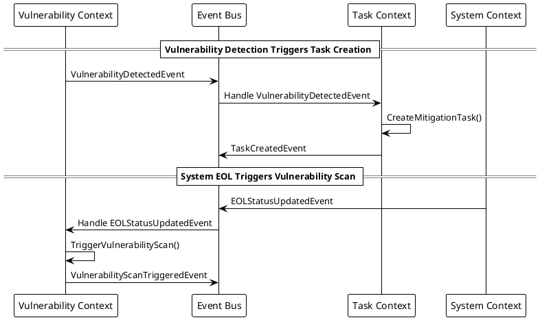
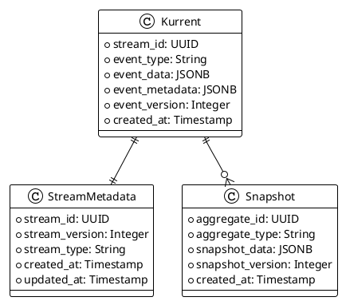
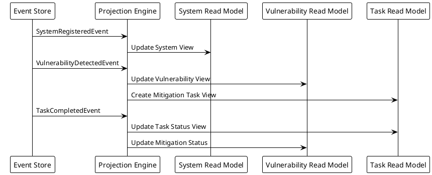
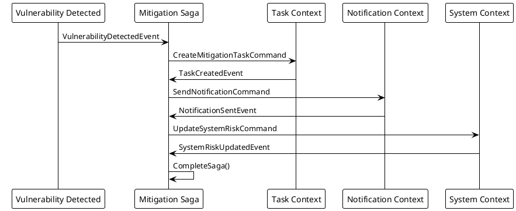

# Event Sourcing Design

このドキュメントはSystem Boardプロジェクトのイベントソーシング設計をPlantUMLで視覚化します。

## Overview

System Boardでは以下のBounded Contextでイベントソーシングを実装します：

- **System Management Context**: システム・パッケージの管理
- **Vulnerability Management Context**: 脆弱性・評価の管理
- **Task Management Context**: タスク・ワークフローの管理
- **Relationship Management Context**: 依存関係の管理

## System Management Context Events

## Vulnerability Management Context Events

## Task Management Context Events

## Cross-Context Event Flow

## Event Store Schema

## Read Model Projections

## Saga Orchestration Pattern

