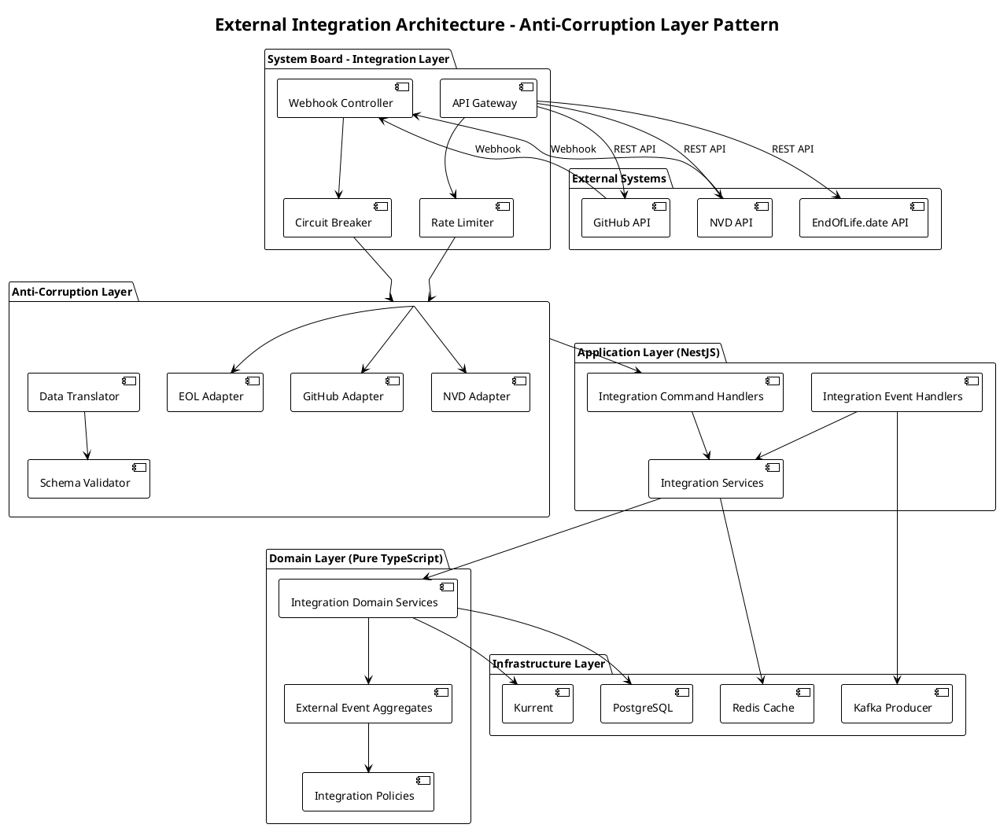
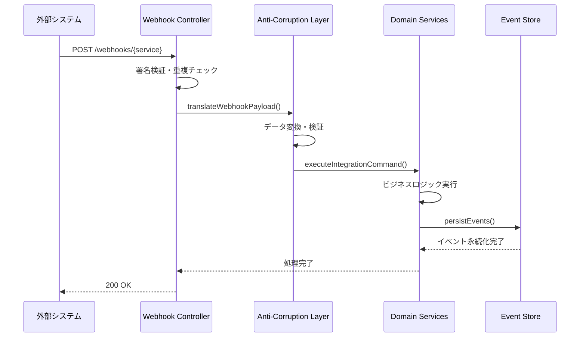
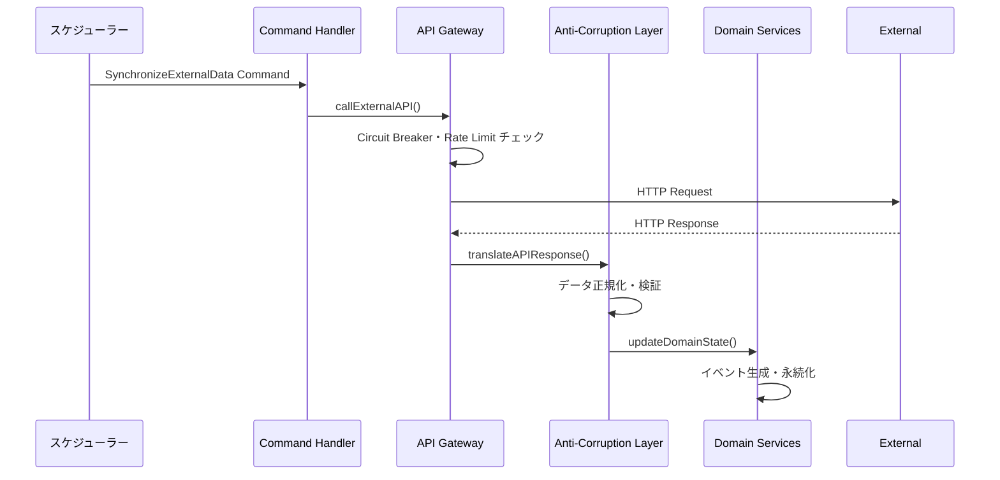

# 外部システム連携アーキテクチャ設計書

## 概要

System Boardにおける外部システム連携のアーキテクチャ設計を、Anti-Corruption Layer パターンを中心とした技術実装観点で詳述します。製造業セキュリティ要件とEvent Sourcingアーキテクチャの制約下での実装方針を定義します。

## アーキテクチャ全体図



## 1. Anti-Corruption Layer 詳細設計

### 1.1 層間責任分離

#### External Boundary Layer

**責任**: 外部システムとの物理的接続管理

- Webhook受信エンドポイント
- API呼び出し実行
- 認証・レート制限
- Circuit Breaker実装

```typescript
interface ExternalBoundaryInterface {
  receiveWebhook(source: ExternalSource, payload: unknown): Promise<void>;
  callExternalAPI<T>(request: ExternalAPIRequest): Promise<T>;
  validateConnection(source: ExternalSource): Promise<boolean>;
}
```

#### Anti-Corruption Layer

**責任**: 外部データの内部形式変換と検証

- 外部スキーマ → 内部スキーマ変換
- データ検証・サニタイゼーション
- ビジネスルール適用
- セキュリティポリシー実装

```typescript
interface AntiCorruptionInterface {
  translateData<TExternal, TInternal>(
    source: ExternalSource,
    externalData: TExternal,
    schema: DataSchema<TInternal>
  ): Promise<TInternal>;

  validateData<T>(data: T, rules: ValidationRule[]): Promise<ValidationResult>;
  sanitizeData<T>(data: T, policies: SecurityPolicy[]): Promise<T>;
}
```

#### Domain Boundary Layer

**責任**: 純粋なビジネスロジック実行

- ドメインイベント生成
- ビジネス制約チェック
- アグリゲート状態管理
- ドメインポリシー実行

```typescript
interface DomainBoundaryInterface {
  executeIntegrationCommand<T extends IntegrationCommand>(
    command: T
  ): Promise<DomainEvent[]>;

  applyBusinessRules<T>(
    context: IntegrationContext,
    data: T
  ): Promise<BusinessRuleResult>;
}
```

### 1.2 データフロー設計

#### Webhook データフロー



#### Pull API データフロー



## 2. 技術実装詳細

### 2.1 Circuit Breaker Pattern Implementation

```typescript
interface CircuitBreakerConfig {
  service: ExternalService;
  failureThreshold: number;    // 連続失敗閾値
  recoveryTimeout: number;     // 復旧タイムアウト (ms)
  healthCheckInterval: number; // ヘルスチェック間隔 (ms)
  fallbackStrategy: FallbackStrategy;
}

enum CircuitBreakerState {
  CLOSED = 'CLOSED',       // 正常動作
  OPEN = 'OPEN',           // 障害検知・呼び出し遮断
  HALF_OPEN = 'HALF_OPEN'  // 復旧試行中
}

class CircuitBreaker {
  private state: CircuitBreakerState = CircuitBreakerState.CLOSED;
  private failureCount = 0;
  private lastFailureTime?: Date;
  private nextRetryTime?: Date;

  async execute<T>(operation: () => Promise<T>): Promise<T> {
    if (this.state === CircuitBreakerState.OPEN) {
      if (this.shouldAttemptReset()) {
        this.state = CircuitBreakerState.HALF_OPEN;
      } else {
        throw new CircuitBreakerOpenError('Circuit breaker is OPEN');
      }
    }

    try {
      const result = await operation();
      this.onSuccess();
      return result;
    } catch (error) {
      this.onFailure();
      throw error;
    }
  }

  private onSuccess(): void {
    this.failureCount = 0;
    this.state = CircuitBreakerState.CLOSED;
    this.lastFailureTime = undefined;
  }

  private onFailure(): void {
    this.failureCount++;
    this.lastFailureTime = new Date();

    if (this.failureCount >= this.config.failureThreshold) {
      this.state = CircuitBreakerState.OPEN;
      this.nextRetryTime = new Date(
        Date.now() + this.config.recoveryTimeout
      );
    }
  }
}
```

### 2.2 Rate Limiting Implementation

```typescript
interface RateLimitConfig {
  service: ExternalService;
  requestsPerMinute: number;
  burstLimit: number;
  windowSizeMs: number;
}

class SlidingWindowRateLimiter {
  private readonly windows = new Map<string, TimeWindow>();

  async checkLimit(
    service: ExternalService,
    identifier: string
  ): Promise<RateLimitResult> {
    const key = `${service}:${identifier}`;
    const window = this.getOrCreateWindow(key);

    const now = Date.now();
    const config = this.getConfig(service);

    // 古いリクエストを削除
    window.removeExpiredRequests(now - config.windowSizeMs);

    // 現在のリクエスト数チェック
    if (window.getRequestCount() >= config.requestsPerMinute) {
      return {
        allowed: false,
        resetTime: window.getOldestRequestTime() + config.windowSizeMs,
        remainingRequests: 0
      };
    }

    // リクエスト記録
    window.addRequest(now);

    return {
      allowed: true,
      resetTime: now + config.windowSizeMs,
      remainingRequests: config.requestsPerMinute - window.getRequestCount()
    };
  }
}
```

### 2.3 Data Translation Service

```typescript
interface DataTranslationRule {
  sourcePath: string;
  targetPath: string;
  transformer?: DataTransformer;
  validator?: FieldValidator;
  required: boolean;
}

interface DataTransformer {
  transform(value: any, context: TransformationContext): any;
}

class GitHubToInternalTranslator {
  private readonly rules: Map<string, DataTranslationRule[]> = new Map();

  constructor() {
    this.initializeTranslationRules();
  }

  async translateSecurityAdvisory(
    githubAdvisory: GitHubSecurityAdvisory
  ): Promise<InternalVulnerability> {
    const rules = this.rules.get('security_advisory');
    const result: Partial<InternalVulnerability> = {};

    for (const rule of rules) {
      const sourceValue = this.extractValue(githubAdvisory, rule.sourcePath);

      if (!sourceValue && rule.required) {
        throw new TranslationError(`Required field missing: ${rule.sourcePath}`);
      }

      if (sourceValue) {
        let transformedValue = sourceValue;

        if (rule.transformer) {
          transformedValue = await rule.transformer.transform(
            sourceValue,
            { source: 'github', target: 'internal' }
          );
        }

        if (rule.validator) {
          const validation = await rule.validator.validate(transformedValue);
          if (!validation.isValid) {
            throw new ValidationError(validation.errors);
          }
        }

        this.setValue(result, rule.targetPath, transformedValue);
      }
    }

    return result as InternalVulnerability;
  }

  private initializeTranslationRules(): void {
    this.rules.set('security_advisory', [
      {
        sourcePath: 'ghsa_id',
        targetPath: 'externalId',
        required: true
      },
      {
        sourcePath: 'summary',
        targetPath: 'title',
        transformer: new TextSanitizer(),
        required: true
      },
      {
        sourcePath: 'severity',
        targetPath: 'severity',
        transformer: new SeverityMapper(),
        validator: new SeverityValidator(),
        required: true
      },
      {
        sourcePath: 'vulnerabilities[].package.name',
        targetPath: 'affectedPackages[].name',
        transformer: new PackageNameNormalizer(),
        required: true
      }
    ]);
  }
}
```

### 2.4 Security & Compliance Implementation

```typescript
interface SecurityPolicy {
  name: string;
  description: string;
  rules: SecurityRule[];
}

interface SecurityRule {
  field: string;
  action: 'MASK' | 'REMOVE' | 'ENCRYPT' | 'VALIDATE';
  pattern?: RegExp;
  replacement?: string;
}

class DataSanitizationService {
  private readonly policies = new Map<string, SecurityPolicy>();

  constructor() {
    this.initializeSecurityPolicies();
  }

  async sanitize(
    data: any,
    context: SanitizationContext
  ): Promise<SanitizedData> {
    const policy = this.policies.get(context.dataType);
    if (!policy) {
      throw new SecurityPolicyError(`No policy found for ${context.dataType}`);
    }

    const sanitized = JSON.parse(JSON.stringify(data)); // Deep copy
    const violations: SecurityViolation[] = [];

    for (const rule of policy.rules) {
      try {
        await this.applySecurityRule(sanitized, rule);
      } catch (error) {
        violations.push({
          rule: rule.field,
          violation: error.message,
          severity: 'HIGH'
        });
      }
    }

    return {
      data: sanitized,
      violations,
      complianceStatus: violations.length === 0 ? 'COMPLIANT' : 'VIOLATION'
    };
  }

  private async applySecurityRule(data: any, rule: SecurityRule): Promise<void> {
    const fieldValue = this.extractNestedField(data, rule.field);

    if (!fieldValue) return;

    switch (rule.action) {
      case 'MASK':
        this.setNestedField(data, rule.field, this.maskValue(fieldValue));
        break;

      case 'REMOVE':
        this.removeNestedField(data, rule.field);
        break;

      case 'ENCRYPT':
        const encrypted = await this.encryptValue(fieldValue);
        this.setNestedField(data, rule.field, encrypted);
        break;

      case 'VALIDATE':
        if (rule.pattern && !rule.pattern.test(fieldValue)) {
          throw new SecurityValidationError(
            `Field ${rule.field} violates security pattern`
          );
        }
        break;
    }
  }

  private initializeSecurityPolicies(): void {
    // 製造業セキュリティ要件に基づくポリシー定義
    this.policies.set('github_webhook', {
      name: 'GitHub Webhook Security Policy',
      description: 'Sanitization rules for GitHub webhook payloads',
      rules: [
        {
          field: 'repository.clone_url',
          action: 'MASK',
          pattern: /https:\/\/github\.com\/[^\/]+\/[^\/]+\.git/
        },
        {
          field: 'pusher.email',
          action: 'REMOVE'  // PII除去
        },
        {
          field: 'commits[].author.email',
          action: 'MASK',
          replacement: '***@***.***'
        }
      ]
    });

    this.policies.set('nvd_cve', {
      name: 'NVD CVE Security Policy',
      description: 'Sanitization rules for NVD CVE data',
      rules: [
        {
          field: 'references[].url',
          action: 'VALIDATE',
          pattern: /^https:\/\// // HTTPS URLのみ許可
        }
      ]
    });
  }
}
```

## 3. Event Sourcing統合

### 3.1 Integration Event Aggregates

```typescript
class ExternalIntegrationAggregate extends AggregateRoot {
  private integrationId: IntegrationId;
  private externalService: ExternalService;
  private lastSyncTimestamp: Date;
  private connectionStatus: ConnectionStatus;
  private rateLimitStatus: RateLimitStatus;
  private circuitBreakerState: CircuitBreakerState;

  static create(command: CreateIntegrationCommand): ExternalIntegrationAggregate {
    const aggregate = new ExternalIntegrationAggregate();

    const event = new IntegrationCreatedEvent({
      integrationId: command.integrationId,
      externalService: command.externalService,
      configuration: command.configuration,
      createdAt: new Date()
    });

    aggregate.apply(event);
    return aggregate;
  }

  executeWebhookCommand(command: WebhookReceivedCommand): void {
    // ビジネスルール検証
    this.validateWebhookProcessing(command);

    // Domain Event生成
    const event = new WebhookProcessedEvent({
      integrationId: this.integrationId,
      webhookId: command.webhookId,
      eventType: command.eventType,
      processedAt: new Date(),
      resultingActions: this.determineResultingActions(command)
    });

    this.apply(event);
  }

  executeAPICallCommand(command: ExternalAPICallCommand): void {
    // Rate Limiting チェック
    if (this.rateLimitStatus.isExceeded()) {
      throw new RateLimitExceededError('API rate limit exceeded');
    }

    // Circuit Breaker チェック
    if (this.circuitBreakerState === CircuitBreakerState.OPEN) {
      throw new CircuitBreakerOpenError('Circuit breaker is open');
    }

    const event = new ExternalAPICallExecutedEvent({
      integrationId: this.integrationId,
      apiCall: command.apiCall,
      executedAt: new Date()
    });

    this.apply(event);
  }

  // Event Handlers
  private onIntegrationCreated(event: IntegrationCreatedEvent): void {
    this.integrationId = event.integrationId;
    this.externalService = event.externalService;
    this.connectionStatus = ConnectionStatus.ACTIVE;
  }

  private onWebhookProcessed(event: WebhookProcessedEvent): void {
    this.lastSyncTimestamp = event.processedAt;
    // 統計情報更新など
  }
}
```

### 3.2 Integration Saga Implementation

```typescript
@Saga()
export class VulnerabilityDetectionSaga {
  @SagaStart()
  async onGitHubSecurityAdvisoryReceived(
    event: GitHubSecurityAdvisoryReceivedEvent
  ): Promise<void> {
    // 1. 影響システム特定
    const command = new IdentifyAffectedSystemsCommand({
      advisoryId: event.advisoryId,
      affectedPackages: event.affectedPackages,
      correlationId: event.correlationId
    });

    await this.commandBus.execute(command);
  }

  @SagaOrchestrationStep()
  async onAffectedSystemsIdentified(
    event: AffectedSystemsIdentifiedEvent
  ): Promise<void> {
    // 2. 脆弱性レコード作成
    if (event.affectedSystems.length > 0) {
      const command = new CreateVulnerabilityRecordCommand({
        sourceEvent: event,
        affectedSystems: event.affectedSystems,
        correlationId: event.correlationId
      });

      await this.commandBus.execute(command);
    }
  }

  @SagaOrchestrationStep()
  async onVulnerabilityRecordCreated(
    event: VulnerabilityRecordCreatedEvent
  ): Promise<void> {
    // 3. 緊急度評価
    const command = new AssessVulnerabilityUrgencyCommand({
      vulnerabilityId: event.vulnerabilityId,
      cvssScore: event.cvssScore,
      affectedSystemCount: event.affectedSystems.length,
      correlationId: event.correlationId
    });

    await this.commandBus.execute(command);
  }

  @SagaOrchestrationStep()
  async onUrgencyAssessed(
    event: VulnerabilityUrgencyAssessedEvent
  ): Promise<void> {
    // 4. 高緊急度の場合は自動タスク生成
    if (event.urgencyLevel === 'CRITICAL' || event.urgencyLevel === 'HIGH') {
      const command = new CreateUrgentMitigationTaskCommand({
        vulnerabilityId: event.vulnerabilityId,
        urgencyLevel: event.urgencyLevel,
        dueDate: this.calculateDueDate(event.urgencyLevel),
        correlationId: event.correlationId
      });

      await this.commandBus.execute(command);
    }
  }

  @SagaCompensation()
  async compensateVulnerabilityDetection(
    event: VulnerabilityDetectionFailedEvent
  ): Promise<void> {
    // 補償処理: 失敗した脆弱性検出の手動対応要求
    const command = new RequestManualVulnerabilityReviewCommand({
      failedDetectionId: event.detectionId,
      failureReason: event.reason,
      correlationId: event.correlationId
    });

    await this.commandBus.execute(command);
  }
}
```

## 4. 運用・監視設計

### 4.1 Health Check Implementation

```typescript
@Injectable()
export class IntegrationHealthCheckService {
  constructor(
    private readonly githubAdapter: GitHubAdapter,
    private readonly nvdAdapter: NVDAdapter,
    private readonly eolAdapter: EOLAdapter,
    private readonly circuitBreakerService: CircuitBreakerService
  ) {}

  async checkHealth(): Promise<IntegrationHealthStatus> {
    const healthChecks = await Promise.allSettled([
      this.checkGitHubHealth(),
      this.checkNVDHealth(),
      this.checkEOLHealth()
    ]);

    return {
      overall: this.calculateOverallHealth(healthChecks),
      services: {
        github: this.extractHealthResult(healthChecks[0]),
        nvd: this.extractHealthResult(healthChecks[1]),
        eol: this.extractHealthResult(healthChecks[2])
      },
      timestamp: new Date()
    };
  }

  private async checkGitHubHealth(): Promise<ServiceHealthResult> {
    const breakerState = this.circuitBreakerService.getState('GITHUB_API');

    if (breakerState === CircuitBreakerState.OPEN) {
      return {
        status: 'UNHEALTHY',
        message: 'Circuit breaker is OPEN',
        responseTime: null
      };
    }

    try {
      const startTime = Date.now();
      await this.githubAdapter.checkConnection();
      const responseTime = Date.now() - startTime;

      return {
        status: responseTime < 5000 ? 'HEALTHY' : 'DEGRADED',
        message: `Response time: ${responseTime}ms`,
        responseTime
      };
    } catch (error) {
      return {
        status: 'UNHEALTHY',
        message: error.message,
        responseTime: null
      };
    }
  }
}
```

### 4.2 Metrics & Observability

```typescript
interface IntegrationMetrics {
  // API呼び出し統計
  apiCallCount: Record<ExternalService, number>;
  apiCallSuccessRate: Record<ExternalService, number>;
  apiCallLatency: Record<ExternalService, LatencyStats>;

  // Webhook統計
  webhookCount: Record<ExternalService, number>;
  webhookProcessingTime: Record<ExternalService, LatencyStats>;
  webhookErrorRate: Record<ExternalService, number>;

  // Rate Limiting統計
  rateLimitHits: Record<ExternalService, number>;
  rateLimitResets: Record<ExternalService, Date>;

  // Circuit Breaker統計
  circuitBreakerState: Record<ExternalService, CircuitBreakerState>;
  circuitBreakerTrips: Record<ExternalService, number>;
}

@Injectable()
export class IntegrationMetricsCollector {
  constructor(
    private readonly prometheusRegistry: PrometheusRegistry,
    private readonly logger: Logger
  ) {}

  recordAPICall(
    service: ExternalService,
    duration: number,
    success: boolean
  ): void {
    // Prometheus metrics
    this.prometheusRegistry
      .getCounter('external_api_calls_total')
      .labels({ service, success: success.toString() })
      .inc();

    this.prometheusRegistry
      .getHistogram('external_api_call_duration_seconds')
      .labels({ service })
      .observe(duration / 1000);

    // Structured logging
    this.logger.info('External API call completed', {
      service,
      duration,
      success,
      timestamp: new Date().toISOString()
    });
  }

  recordCircuitBreakerStateChange(
    service: ExternalService,
    previousState: CircuitBreakerState,
    newState: CircuitBreakerState
  ): void {
    this.prometheusRegistry
      .getGauge('circuit_breaker_state')
      .labels({ service })
      .set(this.stateToNumber(newState));

    if (newState === CircuitBreakerState.OPEN) {
      this.prometheusRegistry
        .getCounter('circuit_breaker_trips_total')
        .labels({ service })
        .inc();
    }
  }
}
```

## 5. セキュリティ・コンプライアンス実装

### 5.1 Audit Trail Implementation

```typescript
interface IntegrationAuditEvent {
  eventId: string;
  timestamp: Date;
  service: ExternalService;
  operation: string;
  userId?: string;
  requestData: any;
  responseData?: any;
  duration: number;
  success: boolean;
  errorMessage?: string;
  complianceFlags: ComplianceFlag[];
}

@Injectable()
export class IntegrationAuditService {
  constructor(
    private readonly auditRepository: AuditRepository,
    private readonly encryptionService: EncryptionService
  ) {}

  async recordIntegrationEvent(
    event: IntegrationAuditEvent
  ): Promise<void> {
    // 機密データの暗号化
    const encryptedEvent = await this.encryptSensitiveData(event);

    // コンプライアンス検証
    const complianceResult = await this.validateCompliance(encryptedEvent);

    // 監査ログ永続化
    await this.auditRepository.save({
      ...encryptedEvent,
      complianceStatus: complianceResult.status,
      retentionPolicy: this.calculateRetentionPolicy(event.service)
    });
  }

  private async encryptSensitiveData(
    event: IntegrationAuditEvent
  ): Promise<IntegrationAuditEvent> {
    const sensitiveFields = ['requestData', 'responseData'];
    const encrypted = { ...event };

    for (const field of sensitiveFields) {
      if (encrypted[field]) {
        encrypted[field] = await this.encryptionService.encrypt(
          JSON.stringify(encrypted[field])
        );
      }
    }

    return encrypted;
  }

  private calculateRetentionPolicy(service: ExternalService): RetentionPolicy {
    // 製造業コンプライアンス要件: 最低5年保持
    return {
      retentionYears: 5,
      archiveAfterMonths: 12,
      encryptionRequired: true
    };
  }
}
```

### 5.2 Data Privacy Implementation

```typescript
interface PrivacyPolicy {
  dataType: string;
  personalDataFields: string[];
  processingLegalBasis: string;
  retentionPeriod: number;
  encryptionRequired: boolean;
  consentRequired: boolean;
}

@Injectable()
export class DataPrivacyService {
  private readonly privacyPolicies = new Map<string, PrivacyPolicy>();

  constructor() {
    this.initializePrivacyPolicies();
  }

  async processPersonalData(
    dataType: string,
    data: any,
    context: ProcessingContext
  ): Promise<ProcessedData> {
    const policy = this.privacyPolicies.get(dataType);
    if (!policy) {
      throw new PrivacyPolicyError(`No privacy policy for ${dataType}`);
    }

    // 個人データの特定
    const personalData = this.extractPersonalData(data, policy.personalDataFields);

    // 法的根拠の確認
    await this.validateLegalBasis(policy.processingLegalBasis, context);

    // 暗号化処理
    if (policy.encryptionRequired) {
      personalData.encrypted = await this.encryptPersonalData(personalData.fields);
    }

    // 処理記録
    await this.recordProcessingActivity({
      dataType,
      personalDataFields: personalData.fields.map(f => f.name),
      legalBasis: policy.processingLegalBasis,
      timestamp: new Date()
    });

    return {
      processedData: data,
      personalDataHandling: personalData,
      retentionPolicy: policy
    };
  }

  private initializePrivacyPolicies(): void {
    this.privacyPolicies.set('github_webhook', {
      dataType: 'github_webhook',
      personalDataFields: ['pusher.email', 'commits[].author.email'],
      processingLegalBasis: 'legitimate_interest',
      retentionPeriod: 365, // days
      encryptionRequired: true,
      consentRequired: false
    });
  }
}
```

## 6. 実装ロードマップ

### Phase 1: 基盤実装 (Week 1-2)

**目標**: 基本的な外部システム連携機能

1. **Week 1**:
   - API Gateway基盤構築
   - 基本Circuit Breaker実装
   - GitHub Webhook受信機能

2. **Week 2**:
   - Anti-Corruption Layer基盤
   - データ変換サービス
   - 基本セキュリティポリシー

### Phase 2: 高度機能実装 (Week 3-4)

**目標**: 運用レベルの信頼性確保

1. **Week 3**:
   - NVD API連携実装
   - Rate Limiting実装
   - Idempotency保証

2. **Week 4**:
   - EOL API連携実装
   - Saga実装
   - Error Recovery機能

### Phase 3: 運用最適化 (Week 5-6)

**目標**: Production Ready品質

1. **Week 5**:
   - 監視・メトリクス実装
   - Health Check実装
   - Performance最適化

2. **Week 6**:
   - セキュリティ強化
   - コンプライアンス対応
   - 運用ドキュメント整備

---

## 7. 品質保証・テスト戦略

### 7.1 Test Pyramid

```typescript
// Unit Tests: ビジネスロジック単体テスト
describe('GitHubDataTranslator', () => {
  it('should translate security advisory correctly', async () => {
    const translator = new GitHubDataTranslator();
    const githubData = createMockGitHubAdvisory();

    const result = await translator.translateSecurityAdvisory(githubData);

    expect(result.severity).toBe('HIGH');
    expect(result.affectedPackages).toHaveLength(2);
  });
});

// Integration Tests: API境界テスト
describe('GitHub Integration', () => {
  it('should process webhook end-to-end', async () => {
    const app = await createTestApp();
    const mockWebhook = createMockWebhookPayload();

    const response = await request(app.getHttpServer())
      .post('/webhooks/github')
      .send(mockWebhook)
      .expect(200);

    // Event Store検証
    const events = await eventStore.getEvents(response.correlationId);
    expect(events).toContainEventType('GitHubSecurityAdvisoryReceived');
  });
});

// Contract Tests: 外部API仕様変更検知
describe('GitHub API Contract', () => {
  it('should match GitHub API response format', async () => {
    const mockServer = nock('https://api.github.com')
      .get('/repos/owner/repo/security-advisories')
      .reply(200, githubApiResponseSchema);

    const result = await githubAdapter.fetchSecurityAdvisories('owner/repo');

    expect(result).toMatchSchema(internalVulnerabilitySchema);
  });
});
```

### 7.2 Security Testing

```typescript
// セキュリティテスト
describe('Security Validation', () => {
  it('should reject invalid webhook signatures', async () => {
    const invalidSignature = 'invalid-signature';

    await expect(
      webhookValidator.validateSignature(payload, invalidSignature)
    ).rejects.toThrow(WebhookValidationError);
  });

  it('should sanitize PII from webhook data', async () => {
    const webhookWithPII = createWebhookWithPII();

    const sanitized = await dataSanitizer.sanitize(webhookWithPII);

    expect(sanitized.data.pusher.email).toBe('[REDACTED]');
  });
});
```

---

**設計責任者**: Software Architect
**実装期間**: 6週間
**品質ゲート**: セキュリティレビュー、パフォーマンステスト、コンプライアンス検証
**成功基準**: 99%稼働率、平均応答時間<2秒、セキュリティ違反0件
