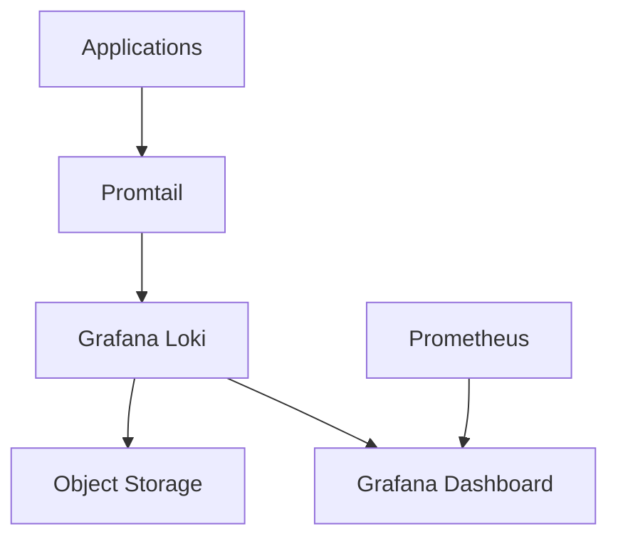

# Grafana Loki環境構築手順書

## 概要

Grafana Lokiは、System BoardプロジェクトでELK Stackに代わって採用されたログ集約・分析ソリューションです。本手順書では、Docker Composeを使用したGrafana Loki環境の構築方法を説明します。

## 前提条件

- Docker Engine 20.10+
- Docker Compose 2.0+
- pnpm >=10.15.1
- Node.js >=24.0.0

## アーキテクチャ構成



## 1. Docker Compose設定追加

既存の`docker-compose.dev.yaml`にGrafana Lokiスタックを追加します：

### 1.1 Lokiサービス追加

```yaml
  loki:
    image: grafana/loki:3.1.0
    container_name: system-board-loki
    ports:
      - "3100:3100"
    command: -config.file=/etc/loki/local-config.yaml
    volumes:
      - ./config/loki:/etc/loki
      - loki_data:/loki
    environment:
      - LOKI_AUTH_ENABLED=false
    healthcheck:
      test: ["CMD-SHELL", "wget --quiet --tries=1 --spider http://localhost:3100/ready || exit 1"]
      interval: 10s
      timeout: 5s
      retries: 5
    networks:
      - system-board

  promtail:
    image: grafana/promtail:3.1.0
    container_name: system-board-promtail
    volumes:
      - ./config/promtail:/etc/promtail
      - /var/log:/var/log:ro
      - /var/lib/docker/containers:/var/lib/docker/containers:ro
    command: -config.file=/etc/promtail/config.yml
    depends_on:
      - loki
    networks:
      - system-board

  grafana:
    image: grafana/grafana:11.2.0
    container_name: system-board-grafana
    ports:
      - "3000:3000"
    environment:
      - GF_SECURITY_ADMIN_USER=${GRAFANA_ADMIN_USER:-admin}
      - GF_SECURITY_ADMIN_PASSWORD=${GRAFANA_ADMIN_PASSWORD:-admin}
      - GF_INSTALL_PLUGINS=grafana-clock-panel
    volumes:
      - ./config/grafana:/etc/grafana/provisioning
      - grafana_data:/var/lib/grafana
    depends_on:
      - loki
    networks:
      - system-board

volumes:
  loki_data:
  grafana_data:
  # 既存のvolumesに追加

networks:
  system-board:
    driver: bridge
```

### 1.2 環境変数設定

`.env`ファイルに以下を追加：

```bash
# Grafana Loki Configuration
GRAFANA_ADMIN_USER=admin
GRAFANA_ADMIN_PASSWORD=system-board-grafana-2025
LOKI_RETENTION_PERIOD=720h  # 30日間
```

## 2. 設定ファイル作成

### 2.1 Loki設定ファイル

`config/loki/local-config.yaml`を作成：

```yaml
auth_enabled: false

server:
  http_listen_port: 3100
  grpc_listen_port: 9096

common:
  instance_addr: 127.0.0.1
  path_prefix: /loki
  storage:
    filesystem:
      chunks_directory: /loki/chunks
      rules_directory: /loki/rules
  replication_factor: 1
  ring:
    kvstore:
      store: inmemory

query_range:
  results_cache:
    cache:
      embedded_cache:
        enabled: true
        max_size_mb: 100

schema_config:
  configs:
    - from: 2020-10-24
      store: tsdb
      object_store: filesystem
      schema: v13
      index:
        prefix: index_
        period: 24h

ruler:
  alertmanager_url: http://localhost:9093

limits_config:
  retention_period: 720h  # 30日間保持
  enforce_metric_name: false
  reject_old_samples: true
  reject_old_samples_max_age: 168h
  max_query_length: 721h
  ingestion_rate_mb: 16
  ingestion_burst_size_mb: 32

# セキュリティ設定（機密データマスキング）
analytics:
  reporting_enabled: false

frontend:
  max_outstanding_per_tenant: 256
```

### 2.2 Promtail設定ファイル

`config/promtail/config.yml`を作成：

```yaml
server:
  http_listen_port: 9080
  grpc_listen_port: 0

positions:
  filename: /tmp/positions.yaml

clients:
  - url: http://loki:3100/loki/api/v1/push

scrape_configs:
  # Docker containers logs
  - job_name: containers
    static_configs:
      - targets:
          - localhost
        labels:
          job: containerlogs
          __path__: /var/lib/docker/containers/*/*-json.log

    pipeline_stages:
      # JSONパース
      - json:
          expressions:
            output: log
            stream: stream
            attrs:

      # 機密データマスキング
      - regex:
          expression: '(?i)(password|token|key|secret)["\s]*[:=]["\s]*([^\s"]+)'
          replace: '${1}="[REDACTED]"'

      # IPアドレスマスキング（内部IP除く）
      - regex:
          expression: '(?:[0-9]{1,3}\.){3}[0-9]{1,3}'
          replace: '[IP_REDACTED]'

      # メールアドレスマスキング
      - regex:
          expression: '[a-zA-Z0-9._%+-]+@[a-zA-Z0-9.-]+\.[a-zA-Z]{2,}'
          replace: '[EMAIL_REDACTED]'

      # 出力設定
      - output:
          source: output

      # ラベル付与
      - labels:
          stream:

  # System Board Application logs
  - job_name: system-board-app
    static_configs:
      - targets:
          - localhost
        labels:
          job: system-board
          service: application
          __path__: /var/log/system-board/*.log

    pipeline_stages:
      # 機密データマスキング
      - regex:
          expression: '(?i)(cvss|cve-[0-9]{4}-[0-9]+|vulnerability)'
          replace: '${1}'  # 脆弱性情報は保持

      - regex:
          expression: '(?i)(internal|confidential|secret).*'
          replace: '[CONFIDENTIAL_LOG_REDACTED]'

  # System logs
  - job_name: system
    static_configs:
      - targets:
          - localhost
        labels:
          job: syslog
          __path__: /var/log/syslog
```

### 2.3 Grafana プロビジョニング設定

`config/grafana/datasources/loki.yaml`を作成：

```yaml
apiVersion: 1

datasources:
  - name: Loki
    type: loki
    access: proxy
    url: http://loki:3100
    basicAuth: false
    isDefault: true
    editable: true
    jsonData:
      maxLines: 1000
      timeout: 60s
      httpHeaderName1: 'X-Scope-OrgID'
    secureJsonData:
      httpHeaderValue1: 'tenant1'
```

`config/grafana/dashboards/system-board-logs.json`を作成：

```json
{
  "dashboard": {
    "id": null,
    "title": "System Board Logs",
    "tags": ["system-board", "logs"],
    "timezone": "Asia/Tokyo",
    "panels": [
      {
        "id": 1,
        "title": "Log Volume",
        "type": "graph",
        "targets": [
          {
            "expr": "sum(rate({job=\"system-board\"}[5m])) by (level)",
            "legendFormat": "{{level}}"
          }
        ],
        "gridPos": {"h": 8, "w": 24, "x": 0, "y": 0}
      },
      {
        "id": 2,
        "title": "Recent Logs",
        "type": "logs",
        "targets": [
          {
            "expr": "{job=\"system-board\"} |= \"\"",
            "maxLines": 1000
          }
        ],
        "gridPos": {"h": 16, "w": 24, "x": 0, "y": 8}
      }
    ],
    "time": {
      "from": "now-1h",
      "to": "now"
    },
    "refresh": "5s"
  }
}
```

## 3. セキュリティ設定

### 3.1 ネットワークセキュリティ

```yaml
# docker-compose.dev.yamlのnetworks設定
networks:
  system-board:
    driver: bridge
    ipam:
      config:
        - subnet: 172.20.0.0/16
          gateway: 172.20.0.1
```

### 3.2 データ保護設定

`config/loki/rules.yaml`を作成：

```yaml
groups:
  - name: security_alerts
    rules:
      - alert: SensitiveDataDetected
        expr: increase({job="system-board"} |~ "(?i)(password|token|key|secret)" [5m]) > 0
        for: 0m
        labels:
          severity: critical
          category: security
        annotations:
          summary: "機密データがログに含まれている可能性があります"
          description: "Job {{ $labels.job }} で機密データらしきパターンが検出されました"

      - alert: HighErrorRate
        expr: rate({job="system-board"} |= "ERROR" [5m]) > 0.1
        for: 2m
        labels:
          severity: warning
        annotations:
          summary: "エラーレートが高くなっています"
          description: "過去5分間でエラーレートが 10% を超えました"
```

## 4. 起動・確認手順

### 4.1 環境起動

```bash
# 設定ディレクトリ作成
mkdir -p config/{loki,promtail,grafana/{datasources,dashboards}}

# Docker Compose起動
docker-compose -f docker-compose.dev.yaml up -d loki promtail grafana

# サービス状態確認
docker-compose -f docker-compose.dev.yaml ps
```

### 4.2 動作確認

```bash
# Loki API確認
curl -G -s "http://localhost:3100/ready" | jq

# メトリクス確認
curl -G -s "http://localhost:3100/metrics" | head -20

# ログクエリテスト
curl -G -s "http://localhost:3100/loki/api/v1/query" \
  --data-urlencode 'query={job="system-board"}' | jq
```

### 4.3 Grafana接続確認

1. ブラウザで `http://localhost:3000` にアクセス
2. admin/admin でログイン
3. Data Sources > Loki の接続確認
4. Explore でログクエリテスト

## 5. 運用・メンテナンス

### 5.1 ログローテーション

```bash
# 定期実行スクリプト（cron設定）
#!/bin/bash
# /usr/local/bin/loki-maintenance.sh

LOG_DIR="/var/log/system-board"
RETENTION_DAYS=30

# 古いログファイル削除
find $LOG_DIR -name "*.log" -mtime +$RETENTION_DAYS -delete

# Lokiデータベース最適化
curl -X POST "http://localhost:3100/loki/api/v1/delete" \
  -H "Content-Type: application/json" \
  -d '{"query":"{job=\"system-board\"}", "start":"'$(date -d "-${RETENTION_DAYS} days" +%s)'000000000"}'
```

### 5.2 バックアップスクリプト

```bash
#!/bin/bash
# config/scripts/loki-backup.sh

BACKUP_DIR="/backup/loki"
DATE=$(date +%Y%m%d_%H%M%S)

# Lokiデータディレクトリバックアップ
docker run --rm -v system-board_loki_data:/data \
  -v $BACKUP_DIR:/backup alpine \
  tar czf /backup/loki_data_$DATE.tar.gz -C /data .

# 設定ファイルバックアップ
tar czf $BACKUP_DIR/loki_config_$DATE.tar.gz config/loki config/promtail

# 古いバックアップ削除（7日以上）
find $BACKUP_DIR -name "*.tar.gz" -mtime +7 -delete
```

### 5.3 モニタリング設定

`config/prometheus/loki-monitoring.yml`：

```yaml
- job_name: 'loki'
  static_configs:
    - targets: ['loki:3100']
  metrics_path: /metrics

- job_name: 'promtail'
  static_configs:
    - targets: ['promtail:9080']
  metrics_path: /metrics
```

## 6. トラブルシューティング

### 6.1 よくある問題

**問題**: Lokiが起動しない

```bash
# 解決策
docker logs system-board-loki
# 設定ファイルの構文確認
docker run --rm -v $(pwd)/config/loki:/etc/loki grafana/loki:3.1.0 \
  -config.file=/etc/loki/local-config.yaml -verify-config
```

**問題**: ログが表示されない

```bash
# Promtailログ確認
docker logs system-board-promtail

# 接続確認
curl "http://localhost:3100/loki/api/v1/label"
```

### 6.2 パフォーマンスチューニング

メモリ使用量最適化：

```yaml
# config/loki/local-config.yaml
limits_config:
  split_queries_by_interval: 15m
  max_query_parallelism: 32
  max_concurrent_tail_requests: 10
```

## 7. セキュリティベストプラクティス

1. **機密データマスキング**: Promtailパイプラインで自動マスキング
2. **アクセス制御**: 本番環境では認証有効化必須
3. **データ暗号化**: 保存時・転送時暗号化
4. **監査ログ**: 全アクセスをログ記録
5. **バックアップ暗号化**: バックアップデータは暗号化保存

## 参考リンク

- [Grafana Loki公式ドキュメント](https://grafana.com/docs/loki/)
- [Promtail設定リファレンス](https://grafana.com/docs/loki/latest/clients/promtail/)
- [System Board セキュリティ要件](./docs/security/security-implementation-spec.md)
