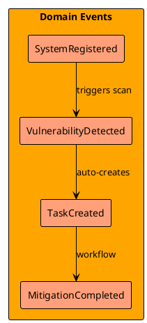
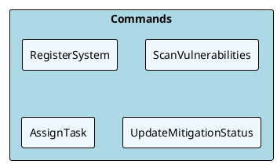
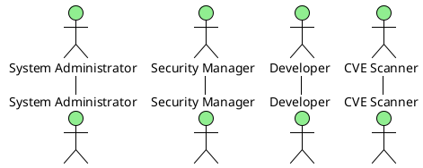
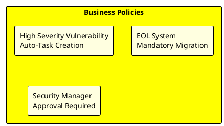
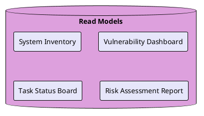

# Event Storming Method

このドキュメントはSystem BoardプロジェクトにおけるPlantUMLを使用したイベントストーミングの手順とガイドラインを定義します。

## Overview

イベントストーミングは、ドメインエキスパートと開発者が協力してビジネスプロセスを理解し、システムの境界を明確にするワークショップ手法です。従来は物理的な付箋紙を使用しますが、本プロジェクトではPlantUMLを使用してデジタル化します。

## 参画エージェント

### 必須参画エージェント

| エージェント | 役割 | 責任 |
|------------|------|------|
| **Requirements Analyst** | ファシリテーター | ワークショップ進行、要件整理、ステークホルダー視点の提供 |
| **Software Architecture Advisor** | 技術リード | システム境界定義、アーキテクチャ観点からの助言 |
| **Backend System Architect** | 実装検討 | 技術的実現可能性、システム設計への落とし込み |
| **UX Design Optimizer** | ユーザー体験 | エンドユーザー視点、業務フロー最適化 |

### 支援エージェント

| エージェント | 役割 | 参画タイミング |
|------------|------|----------------|
| **Database Architect Consultant** | データ設計 | Phase 4: Aggregates & Bounded Context定義時 |
| **Cybersecurity Advisor** | セキュリティ検討 | Phase 2-4: リスクイベント特定・セキュリティ要件定義時 |
| **QA Testing Specialist** | 品質保証 | Phase 3: Policy & Business Rules定義時 |
| **DevOps Pipeline Optimizer** | 運用観点 | Phase 2-3: システムイベント・自動化検討時 |

## Event Storming フェーズ

### Phase 1: Domain Events Discovery

**目的**: ビジネスドメインで発生する重要なイベントを特定

**手順**:

1. ドメインエキスパート（Requirements Analyst）がビジネスで起こる出来事を洗い出し
2. 過去形の動詞でイベント名を定義（例：「SystemRegistered」「VulnerabilityDetected」）
3. 時系列でイベントを並べる

**成果物**: Domain Events List（PlantUML mindmap形式）

### Phase 2: Commands & Actors Discovery

**目的**: イベントを引き起こすコマンドとアクターを特定

**手順**:

1. 各イベントに対して「何が」「誰が」トリガーするかを分析
2. 外部システム、ユーザー、時間ベースのトリガーを区別
3. コマンドは命令形で命名（例：「RegisterSystem」「DetectVulnerability」）

**成果物**: Commands & Actors Diagram（PlantUMLユースケース図形式）

### Phase 3: Policies & Business Rules Discovery

**目的**: ビジネスルールとポリシーを特定

**手順**:

1. 「～の時は、必ず～する」というルールを抽出
2. 例外処理、エラーハンドリングのルールを定義
3. 自動化できるポリシーと人間の判断が必要なポリシーを区別

**成果物**: Business Rules Matrix（Markdownテーブル + PlantUMLアクティビティ図）

### Phase 4: Aggregates & Bounded Context Discovery

**目的**: データの境界とサービスの境界を定義

**手順**:

1. 関連するイベント・コマンド・データをグループ化
2. 各グループの責任範囲を明確化
3. Context間の連携方法を定義

**成果物**: Bounded Context Map（PlantUMLコンポーネント図形式）

## PlantUML記法標準

### Domain Events (オレンジ色)

### Commands (青色)

### Actors (緑色)

### Policies (黄色)

### Read Models (紫色)

## ワークショップ実施手順

### 事前準備

1. **共有メモリファイル**（`.claude/agents/share.md`）で現在のプロジェクト状況を全エージェントが確認
2. **Requirements Analyst**がビジネス要件ドキュメントを準備
3. **Software Architecture Advisor**が技術制約を整理

### セッション実施（各Phase毎）

1. **キックオフ**（5分）
   - Phase目標の確認
   - 前Phaseの成果物レビュー

2. **ブレインストーミング**（20分）
   - 担当エージェントが要素を洗い出し
   - PlantUMLコードで即座に可視化

3. **グルーピング・整理**（15分）
   - 重複排除、関連性整理
   - 時系列・優先度の調整

4. **レビュー・合意**（10分）
   - 全エージェントでの内容確認
   - 次Phaseへの引き継ぎ事項確認

### 成果物管理

- 各Phaseの成果物は`docs/event-storming/`配下のMarkdownファイルに保存
- PlantUMLコードは`plantuml`コードブロック内に記述
- GitHub上で直接PlantUML図が確認可能

## Quality Gates

各Phaseで以下の品質基準をクリアする必要があります：

### Phase 1: Domain Events

- [ ] 全ての重要ビジネスイベントが過去形で命名されている
- [ ] イベント間の時系列関係が明確である
- [ ] 各Bounded Contextの主要イベントが特定されている

### Phase 2: Commands & Actors

- [ ] 全てのイベントにトリガーとなるコマンドが定義されている
- [ ] アクターが適切に分類されている（人間/システム/外部）
- [ ] 権限・認証要件が考慮されている

### Phase 3: Policies & Business Rules

- [ ] ビジネスルールが「If-Then」形式で明確に記述されている
- [ ] 例外処理・エラーケースが考慮されている
- [ ] 自動化可能性が評価されている

### Phase 4: Aggregates & Bounded Context

- [ ] データの責任境界が明確である
- [ ] Context間の連携方法が定義されている
- [ ] 技術的実現可能性が確認されている

## 継続的改善

Event Stormingは一回限りの活動ではなく、以下のタイミングで継続的に見直しを行います：

- **Sprint Review後**: 新たな要件・課題の発見時
- **アーキテクチャ変更時**: 技術的制約の変更時
- **ビジネス要件変更時**: ステークホルダーからの新要求時

各エージェントは担当領域の変更を検知した際に、該当するEvent Stormingドキュメントの更新を提案する責任があります。
