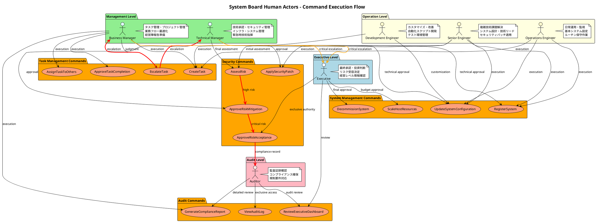
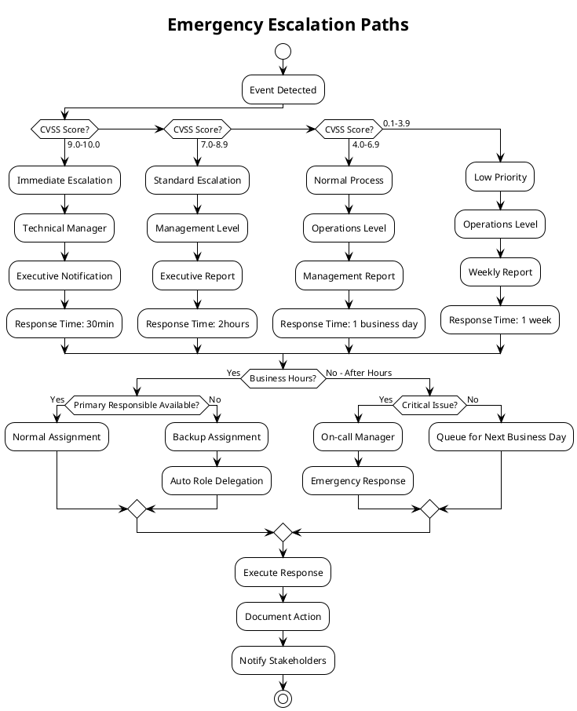
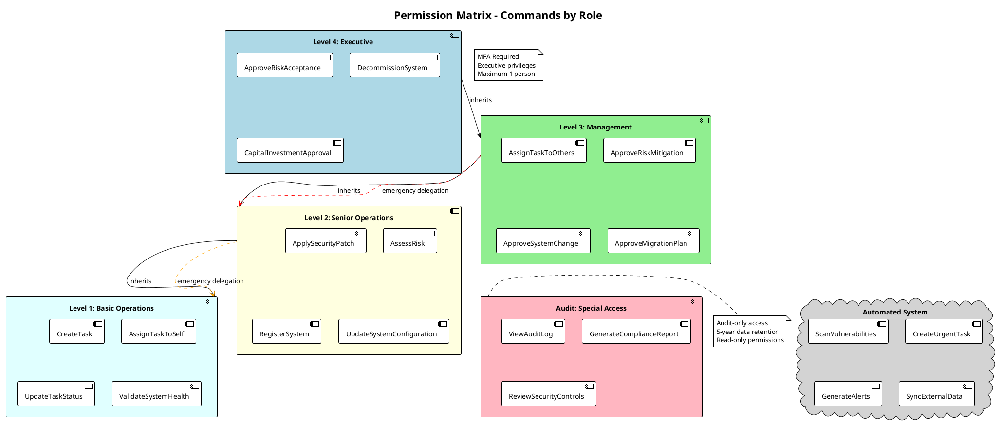
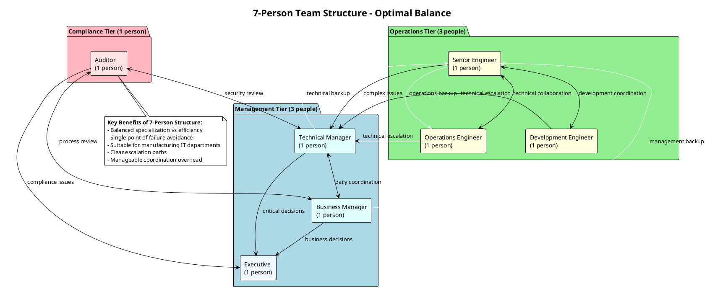
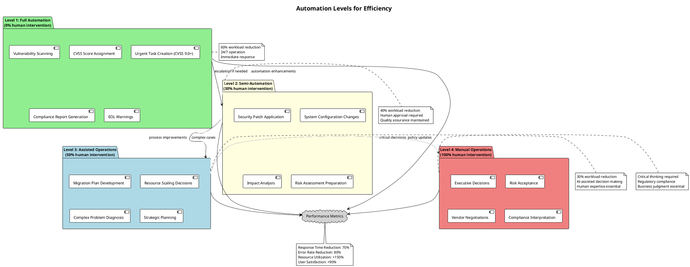

# Human Actors詳細分析 - 視覚的サマリー

**作成日**: 2025年9月15日
**対象**: Command Discovery成果に基づくHuman Actors分析結果
**目的**: 製造業5-10名体制での効率的責任分担の可視化

---

## 組織構成とコマンド実行フロー

---

## エスカレーション経路の詳細フロー

---

## 権限レベルとコマンド実行マトリックス

---

## 7名体制での効率的分担モデル

### ワークロード分担・責任詳細

| 役割 | 技術作業割合 | 管理・業務割合 | 主要責任 |
|------|-------------|---------------|----------|
| **Executive** | 10% | 90% | • 最終承認・投資判断 • リスク受容決定 • 経営レベル情報確認 |
| **Technical Manager** | 70% | 30% | • セキュリティ管理 • インフラ監督 • 技術承認 |
| **Business Manager** | 20% | 80% | • タスク管理 • プロジェクト調整 • ビジネス報告 |
| **Senior Engineer** | 90% | 10% | • 複雑技術課題解決 • システム設計 • 技術リーダーシップ |
| **Operations Engineer** | 95% | 5% | • 日常運用・監視 • ルーチン保守 • システムモニタリング |
| **Development Engineer** | 95% | 5% | • 自動化開発 • カスタマイズ • テスト環境管理 |
| **Auditor** | 5% | 95% | • 監査証跡確認 • コンプライアンス検証 • 規制対応 |

### 効率化のポイント

- **技術専門性の最大活用**: Engineers（90-95%技術）→ 深い技術問題解決
- **管理効率の最適化**: Managers（20-70%技術）→ 技術理解を持った意思決定
- **経営判断の迅速化**: Executive（10%技術）→ ビジネス観点での最終決定
- **監査独立性の確保**: Auditor（5%技術）→ 客観的なコンプライアンス確認

---

## 自動化による効率化レベル

---

**作成者**: UX Design Optimizer
**完成日**: 2025年9月15日
**対象プロジェクト**: System Board Human Actors分析
**参照**: `/docs/event-storming/human-actors-responsibility-matrix.md`
