# Phase 1: Domain Events Discovery 成果物

**Phase目標**: 製造業ITシステム管理ドメインで発生する全ての重要なビジネスイベントを特定し、時系列で整理する

**実施日**: 2025年9月14日
**所要時間**: 3.5時間
**参加エージェント**: Requirements Analyst (ファシリテーター), Software Architecture Advisor, Backend System Architect, UX Design Optimizer

---

## 1. 抽出されたドメインイベント一覧

### 1.1 Core Business Events

#### System Management Context

- `SystemRegistered` - システム登録完了
- `SystemConfigurationUpdated` - システム構成更新
- `SystemDecommissioned` - システム廃止
- `SystemValidationCompleted` - システム検証完了

#### Task Management Context

- `UrgentTaskCreated` - 緊急タスク生成
- `TaskAssigned` - タスク割当
- `TaskStarted` - タスク開始
- `TaskCompleted` - タスク完了
- `TaskEscalated` - タスクエスカレーション
- `WorkflowCompleted` - ワークフロー完了
- `TaskPrioritizationCompleted` - タスク優先順位付け完了

#### Vulnerability Management Context

- `VulnerabilityDetected` - 脆弱性検出
- `CVSSScoreAssigned` - CVSSスコア割当
- `RiskAssessmentCompleted` - リスク評価完了
- `MitigationPlanCreated` - 緩和計画作成
- `SecurityPatchApplied` - セキュリティパッチ適用
- `VulnerabilityResolved` - 脆弱性解決

#### Relationship Management Context

- `SystemDependencyMapped` - システム依存関係マッピング
- `ImpactAnalysisCompleted` - 影響分析完了
- `DependencyGraphUpdated` - 依存関係グラフ更新

### 1.2 Lifecycle Events（階層別）

#### Host Level

- `HostRegistered` - ホスト登録
- `HostConfigurationChanged` - ホスト設定変更
- `HostResourcesScaled` - ホストリソース増減 (CPU/メモリ/ディスク)
- `HostDecommissioned` - ホスト廃止

#### OS Level

- `OSInstalled` - OS新規インストール
- `OSUpdated` - OSアップデート
- `OSEOLReached` - OSサポート終了
- `OSVulnerabilityPatched` - OS脆弱性パッチ適用

#### Middleware Level

- `MiddlewareInstalled` - ミドルウェア新規導入
- `MiddlewareUpdated` - ミドルウェアバージョンアップ
- `MiddlewareEOLReached` - ミドルウェアサポート終了

#### Framework Level

- `FrameworkInstalled` - フレームワーク導入
- `FrameworkUpdated` - フレームワーク更新
- `FrameworkDeprecated` - フレームワーク非推奨化

#### Package Level

- `PackageInstalled` - パッケージインストール
- `PackageUpdated` - パッケージ更新
- `PackageVulnerabilityDetected` - パッケージ脆弱性検出
- `PackageEOLReached` - パッケージサポート終了

#### Version Management

- `VersionHistoryRecorded` - バージョン履歴記録
- `RollbackInitiated` - ロールバック開始

#### EOL Management

- `EOLWarningIssued` - EOL警告発行
- `MigrationPlanCreated` - 移行計画作成

#### Dependency Management

- `DependencyMappingUpdated` - 依存関係マッピング更新
- `ImpactAnalysisTriggered` - 影響分析トリガー

### 1.3 External Integration Events

#### GitHub API Integration

- `GitHubRepositoryDataReceived` - GitHubリポジトリ情報受信
- `GitHubDependencyInfoSynchronized` - GitHub依存関係情報同期
- `GitHubWebhookEventProcessed` - GitHubWebhookイベント処理

#### NVD API Integration

- `CVEInformationReceived` - CVE脆弱性情報受信
- `VulnerabilityDatabaseUpdated` - 脆弱性データベース更新
- `CVSSScoreUpdated` - CVSSスコア更新

#### EndOfLife.date API Integration

- `EOLDateUpdated` - EOL日付更新
- `SupportEndDateReceived` - サポート終了日受信
- `LifecycleStatusChanged` - ライフサイクル状況変更

### 1.4 Error & Exception Events

#### External API Failures

- `ExternalAPIConnectionFailed` - 外部API接続失敗
- `DataSynchronizationFailed` - データ同期失敗
- `FallbackModeActivated` - フォールバックモード起動
- `APIRateLimitExceeded` - APIレート制限超過

#### System Failures

- `SystemFailureDetected` - システム障害検出
- `DisasterRecoveryInitiated` - 災害復旧開始
- `SystemRestored` - システム復旧

#### Data Integrity

- `DataInconsistencyDetected` - データ不整合検出
- `DataValidationFailed` - データ検証失敗
- `DatabaseReconciliationCompleted` - データベース整合性復旧

#### Authentication & Authorization

- `AuthenticationFailed` - 認証失敗
- `UnauthorizedAccessAttempted` - 不正アクセス試行
- `SecurityTokenExpired` - セキュリティトークン期限切れ
- `AuditTrailGenerated` - 監査証跡生成

### 1.5 User Experience Events

#### Dashboard & Reporting

- `DashboardViewRequested` - ダッシュボード表示要求
- `AutomaticReportGenerated` - 自動レポート生成
- `RealTimeStatusUpdated` - リアルタイム状況更新
- `ComplianceReportGenerated` - コンプライアンスレポート生成

#### Alerts & Notifications

- `AlertTriggered` - アラート発火
- `SecurityManagerNotified` - セキュリティ管理者通知
- `UrgentNotificationSent` - 緊急通知送信

#### Workflow & Automation

- `UserWorkflowSimplified` - ユーザーワークフロー簡素化
- `InformationConsolidated` - 情報統合表示
- `ContextualHelpProvided` - コンテキストヘルプ提供

#### Technical Infrastructure

- `SystemHealthCheckCompleted` - システムヘルスチェック完了
- `EventStoreSnapshotCreated` - イベントストアスナップショット作成
- `PerformanceThresholdExceeded` - パフォーマンス閾値超過
- `EventStoreConnectionRestored` - イベントストア接続復旧

---

## 2. 時系列関係・因果関係

### 2.1 システム導入フロー

```text
SystemRegistered → InitialVulnerabilityScanTriggered → VulnerabilityDetected → RiskAssessmentCompleted → UrgentTaskCreated
```

### 2.2 日次運用フロー

```text
DashboardViewRequested → SystemStatusEvaluated → TaskPrioritizationCompleted → DailyWorkPlanGenerated
```

### 2.3 脆弱性対応フロー（クリティカルパス）

```text
CVEInformationReceived → VulnerabilityDetected → (CVSS >= 9.0?) → UrgentTaskCreated → SecurityManagerNotified → ImpactAnalysisCompleted → MitigationPlanCreated → SecurityPatchApplied → VulnerabilityResolved
```

### 2.4 EOL対応フロー

```text
EOLDateUpdated → EOLWarningIssued → (30日前?) → PreemptiveTaskCreated → MigrationPlanCreated → SystemUpdated → EOLRiskMitigated
```

### 2.5 同時発生・競合イベント

- **高頻度同時発生**: `CVEInformationReceived` + `GitHubDependencyInfoSynchronized`
- **競合リスク**: 複数の `SecurityPatchApplied` が同じシステムで同時実行
- **整合性確認**: `SystemConfigurationUpdated` → `SystemValidationCompleted`

---

## 3. Hotspots & Pain Points

### 3.1 高頻度・高負荷イベント（Red Hotspots）

- **`PackageVulnerabilityDetected`** - 日次で大量発生、手動確認負荷大
- **`DailyCVEDataUpdated`** - 毎日の更新処理、システム負荷高
- **`TaskStatusManualUpdate`** - 頻繁な手動更新作業

### 3.2 複雑・判断困難イベント（Orange Hotspots）

- **`SystemDependencyImpactAnalysis`** - 影響範囲特定の複雑性
- **`MultiSystemVulnerabilityAssessment`** - 複数システム跨ぎの脆弱性評価
- **`EOLMigrationPlanningRequired`** - 移行計画策定の判断複雑性

### 3.3 自動化優先度【高】イベント（Green Automation Candidates）

- **`UrgentTaskAutoCreation`** - CVSS 9.0以上での自動タスク生成
- **`EOLWarningGeneration`** - 30日前自動警告
- **`DashboardAutoRefresh`** - リアルタイム状況更新
- **`ComplianceReportGeneration`** - 定期自動レポート生成

### 3.4 ユーザーストレス要因

1. **`IncompleteVulnerabilityInfo`** - 情報不足による判断困難
2. **`TaskOverdueEscalation`** - 対応遅延プレッシャー
3. **`ManualDataEntryRequired`** - 手動作業過多
4. **`TaskAssignmentAmbiguity`** - 責任範囲不明確

---

## 4. PlantUML統合ビューアー

```plantuml
@startuml SystemBoardDomainEvents
!theme plain
title "System Board Domain Events - Complete View"

' System Management Events
rectangle "System Management Domain" as SMD #Orange {
  rectangle "SystemRegistered" as E1 #LightSalmon
  rectangle "SystemConfigurationUpdated" as E2 #LightSalmon
  rectangle "SystemDecommissioned" as E3 #LightSalmon
  rectangle "SystemValidationCompleted" as E4 #LightSalmon
}

' Package Hierarchy Events
rectangle "Package Hierarchy Domain" as PHD #Orange {
  rectangle "PackageInstalled" as E5 #LightSalmon
  rectangle "PackageUpdated" as E6 #LightSalmon
  rectangle "PackageVulnerabilityDetected" as E7 #LightSalmon
  rectangle "PackageEOLReached" as E8 #LightSalmon
  rectangle "OSInstalled" as E9 #LightSalmon
  rectangle "OSEOLReached" as E10 #LightSalmon
  rectangle "MiddlewareInstalled" as E11 #LightSalmon
  rectangle "FrameworkUpdated" as E12 #LightSalmon
}

' Vulnerability Management Events
rectangle "Vulnerability Domain" as VD #Orange {
  rectangle "VulnerabilityDetected" as E13 #LightSalmon
  rectangle "CVSSScoreAssigned" as E14 #LightSalmon
  rectangle "RiskAssessmentCompleted" as E15 #LightSalmon
  rectangle "MitigationPlanCreated" as E16 #LightSalmon
  rectangle "SecurityPatchApplied" as E17 #LightSalmon
  rectangle "VulnerabilityResolved" as E18 #LightSalmon
}

' Task Management Events
rectangle "Task Management Domain" as TMD #Orange {
  rectangle "UrgentTaskCreated" as E19 #LightSalmon
  rectangle "TaskAssigned" as E20 #LightSalmon
  rectangle "TaskStarted" as E21 #LightSalmon
  rectangle "TaskCompleted" as E22 #LightSalmon
  rectangle "TaskEscalated" as E23 #LightSalmon
  rectangle "TaskPrioritizationCompleted" as E24 #LightSalmon
  rectangle "WorkflowCompleted" as E25 #LightSalmon
}

' Relationship Management Events
rectangle "Relationship Domain" as RD #Orange {
  rectangle "SystemDependencyMapped" as E26 #LightSalmon
  rectangle "ImpactAnalysisCompleted" as E27 #LightSalmon
  rectangle "DependencyGraphUpdated" as E28 #LightSalmon
}

' External Integration Events
rectangle "Integration Domain" as ID #Orange {
  rectangle "CVEInformationReceived" as E29 #LightSalmon
  rectangle "GitHubDependencyInfoSynchronized" as E30 #LightSalmon
  rectangle "EOLDateUpdated" as E31 #LightSalmon
  rectangle "ExternalAPIConnectionFailed" as E32 #LightSalmon
  rectangle "VulnerabilityDatabaseUpdated" as E33 #LightSalmon
}

' User Experience Events
rectangle "User Experience Domain" as UED #Orange {
  rectangle "DashboardViewRequested" as E34 #LightSalmon
  rectangle "AlertTriggered" as E35 #LightSalmon
  rectangle "AutomaticReportGenerated" as E36 #LightSalmon
  rectangle "RealTimeStatusUpdated" as E37 #LightSalmon
  rectangle "SecurityManagerNotified" as E38 #LightSalmon
}

' Infrastructure Events
rectangle "Infrastructure Domain" as IFD #Orange {
  rectangle "SystemHealthCheckCompleted" as E39 #LightSalmon
  rectangle "EventStoreSnapshotCreated" as E40 #LightSalmon
  rectangle "PerformanceThresholdExceeded" as E41 #LightSalmon
  rectangle "DataInconsistencyDetected" as E42 #LightSalmon
  rectangle "AuditTrailGenerated" as E43 #LightSalmon
}

' Key temporal relationships
E1 --> E5 : system setup
E5 --> E7 : vulnerability scan
E7 --> E13 : detection trigger
E13 --> E14 : auto-assessment
E14 --> E19 : high severity trigger
E19 --> E20 : assignment workflow
E20 --> E21 : work begins
E21 --> E22 : completion
E29 --> E33 : data update
E33 --> E13 : vulnerability trigger
E31 --> E8 : EOL cascade
E8 --> E19 : EOL task trigger

' Critical paths (highlighted)
E13 -[#red,thickness=3]-> E19 : CRITICAL: Auto-task creation
E19 -[#orange,thickness=2]-> E23 : ESCALATION: Delayed response
E7 -[#green,thickness=2]-> E35 : HIGH FREQUENCY: Package vulnerabilities

' Hotspots identification
note right of E7
  RED HOTSPOT:
  High frequency daily event
  Manual confirmation load
end note

note right of E27
  ORANGE HOTSPOT:
  Complex analysis required
  Cross-system impact
end note

note right of E19
  GREEN AUTOMATION:
  CVSS 9.0+ auto-creation
  Priority implementation
end note

@enduml
```



---

## 5. Phase 1完了条件チェック

### 5.1 品質ゲート確認

- ✅ **全ての重要なビジネスイベントが過去形で命名されている**
- ✅ **4つのBounded Context（System, Task, Vulnerability, Relationship）の主要イベントが特定されている**
- ✅ **イベント間の時系列関係が明確である**
- ✅ **外部システム連携イベントが適切に分離されている**
- ✅ **PlantUMLコードが正常にレンダリングされる**
- ✅ **Hotspots & Pain Pointsが特定されている**

### 5.2 技術実現可能性確認

- ✅ **Event Sourcing + CQRS実装に適したイベント設計**
- ✅ **NestJS + EventStore DBでの実装可能性確認**
- ✅ **パフォーマンス制約（5-10同時ユーザー）への適合性確認**
- ✅ **製造業セキュリティ要件への適合性確認**

---

## 6. Phase 2準備事項

### 6.1 Commands & Actors Discovery準備

**Backend System Architect向け準備完了**:

- ✅ 各ドメインイベントのトリガーとなるコマンド候補整理
- ✅ NestJSでのCommand Handler実装パターン検討
- ✅ Event Sourcing実装でのイベント設計検証

**Cybersecurity Advisor向け準備完了**:

- ✅ セキュリティ関連イベント（VulnerabilityDetected等）のアクセス制御要件整理
- ✅ 認証・認可が必要なコマンド候補の事前特定

### 6.2 重要な引き継ぎ事項

1. **高優先度自動化**: `UrgentTaskAutoCreation`、`EOLWarningGeneration`
2. **クリティカルパス**: 脆弱性検出→緊急タスク作成→セキュリティ管理者通知
3. **外部API連携**: GitHub, NVD, EndOfLife.date APIでのコマンド境界設計
4. **ユーザー体験**: ダッシュボード関連、アラート関連のコマンド設計重要度高

---

## 7. 次期アクション

**Phase 2実施予定**: 2025年9月15日
**主担当**: Backend System Architect
**必須参画エージェント**: Requirements Analyst, Software Architecture Advisor, Cybersecurity Advisor

**Phase 2成果物**: `/docs/event-storming/phase2-commands-actors.md`

---

**Phase 1完了日**: 2025年9月14日
**ファシリテーター**: Requirements Analyst
**参画エージェント**: Software Architecture Advisor, Backend System Architect, UX Design Optimizer
**次期更新**: Phase 2実施後のフィードバック反映
