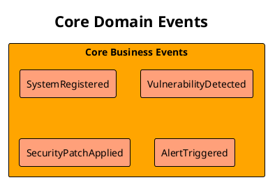
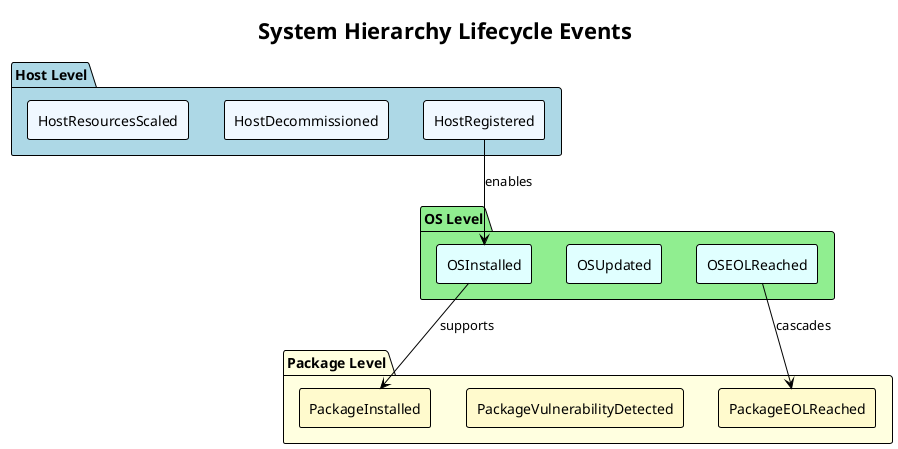
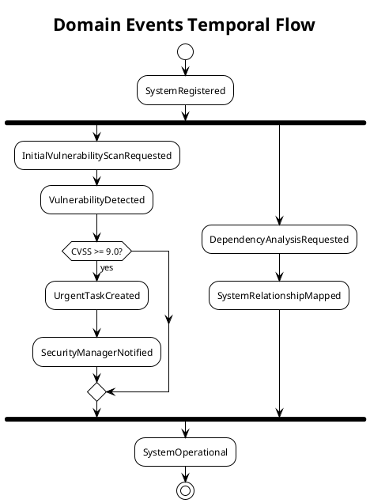
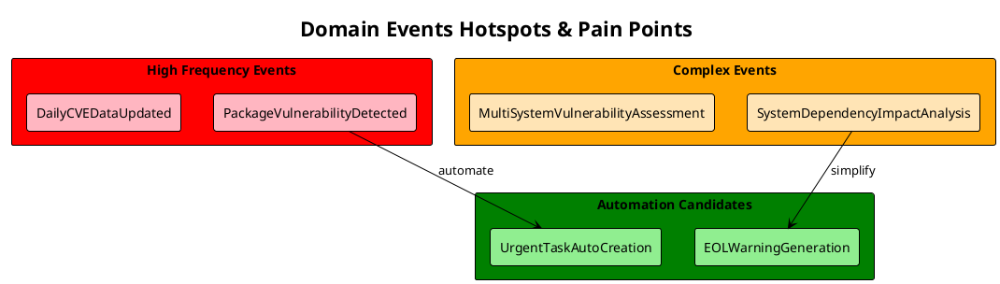
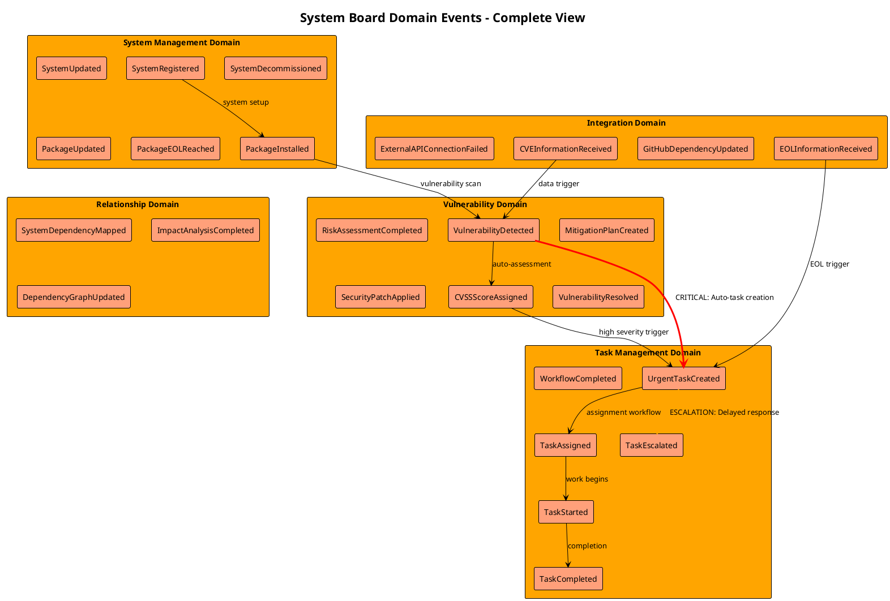

# Phase 1: Domain Events Discovery ファシリテーションガイド

**Phase目標**: 製造業ITシステム管理ドメインで発生する全ての重要なビジネスイベントを特定し、時系列で整理する

**実施期間**: 2025年9月14日（Day 1）
**所要時間**: 3.5時間
**主担当**: Requirements Analyst（ファシリテーター）

---

## 1. 事前準備チェックリスト（30分）

### 1.1 ドキュメント準備

- [x] `/docs/requirement/business-requirement.md` の6.1章「主要ドメインイベント」レビュー完了
- [x] 既存のEvent Stormingメソッド（`/docs/event-storming/event-storming-method.md`）確認
- [x] System Board階層構造（ホスト→OS→ミドルウェア→フレームワーク→パッケージ）理解

### 1.2 参画エージェント準備状況確認

- [x] **Software Architecture Advisor**: 技術制約・アーキテクチャ観点準備完了
- [x] **Backend System Architect**: 実装観点・技術的実現可能性検討準備完了
- [x] **UX Design Optimizer**: エンドユーザー視点・業務フロー理解準備完了

### 1.3 環境準備

- [x] PlantUML記法標準の確認
- [x] GitHub上でのPlantUML図表レンダリング確認
- [x] 成果物保存先（`/docs/event-storming/phase1-domain-events.md`）準備

---

## 2. キックオフセッション（15分）

### 2.1 目標の共有

**ファシリテーター発言例**:

```text
「Phase 1では、System Boardドメインで『何が起こるか』を完全に可視化します。
我々の目標は、製造業ITシステム管理という特殊なドメインでの
全てのビジネス上重要なイベントを見つけ出すことです。」
```

### 2.2 制約の明確化

**重要な制約事項確認**:

- 外部連携範囲: GitHub API、NVD API、EndOfLife.date APIのみ
- セキュリティ最優先: 情報漏洩防止が最重要
- 階層構造: 5層（ホスト→OS→ミドルウェア→フレームワーク→パッケージ）
- 運用制約: 手動データ管理、限定的ステークホルダー

### 2.3 成果物の確認

**期待する成果物**:

- Domain Events List（PlantUML mindmap形式）
- 時系列関係マップ
- Hotspots & Pain Pointsの特定

---

## 3. Big Picture Event Storming（120分）

### 3.1 Step 1: Core Events抽出（40分）

#### ファシリテーション質問

**Requirements Analyst**主導で以下の質問を順次実施:

**基本的なイベント抽出**:

```text
Q1: System Boardで最も重要な出来事は何ですか？
    -> 「〇〇が起こった」という過去形で表現してください

Q2: システム担当者が最も困る/喜ぶ出来事は何ですか？
    -> ユーザー体験の観点から

Q3: 経営陣が知る必要がある出来事は何ですか？
    -> ビジネス影響の観点から
```

**想定される回答（エージェント別）**:

**Software Architecture Advisor観点**:

- SystemRegistered（システム登録完了）
- SystemConfigurationUpdated（システム構成更新）
- SystemDecommissioned（システム廃止）
- VulnerabilityDetected（脆弱性検出）
- SecurityPatchApplied（セキュリティパッチ適用）

**UX Design Optimizer観点**:

- DashboardViewRequested（ダッシュボード表示要求）
- AlertTriggered（アラート発火）
- TaskAssignmentCompleted（タスク割当完了）
- UserWorkflowCompleted（ユーザーワークフロー完了）

**Backend System Architect観点**:

- ExternalAPIDataSynchronized（外部API同期完了）
- EventSourcingSnapshotCreated（イベントソーシング スナップショット作成）
- SystemHealthCheckCompleted（システムヘルスチェック完了）

#### 成果の即時可視化

各イベント抽出後、即座にPlantUMLコードで可視化:



### 3.2 Step 2: Lifecycle Events抽出（40分）

#### 3.2.1 ファシリテーション質問

**階層別ライフサイクル質問**:

```text
Q4: ホストレベルで何が起こりますか？
    -> HostRegistered, HostDecommissioned, HostConfigurationChanged, HostResourcesScaled...

Q5: OSレベルで何が起こりますか？
    -> OSInstalled, OSUpdated, OSEOLReached, OSVulnerabilityPatched...

Q6: ミドルウェアレベルで何が起こりますか？
    -> MiddlewareInstalled, MiddlewareUpdated, MiddlewareEOLReached...

Q7: フレームワークレベルで何が起こりますか？
    -> FrameworkInstalled, FrameworkUpdated, FrameworkDeprecated...

Q8: パッケージレベルで何が起こりますか？
    -> PackageInstalled, PackageUpdated, PackageVulnerabilityDetected, PackageEOLReached...
```

#### 深掘り質問

```text
Q9: 各レベルでバージョン管理はどうなりますか？
Q10: サポート終了（EOL）検知時に何が起こりますか？
Q11: 依存関係変更時に何が起こりますか？
```

#### PlantUML階層表現



### 3.3 Step 3: Integration Events抽出（40分）

#### 外部システム連携質問

```text
Q12: GitHub APIとの連携で何が起こりますか？
     -> DependencyInformationReceived, RepositoryDataSynchronized...

Q13: NVD APIとの連携で何が起こりますか？
     -> CVEInformationReceived, VulnerabilityDatabaseUpdated...

Q14: EndOfLife.date APIとの連携で何が起こりますか？
     -> EOLDateUpdated, SupportEndDateReceived...

Q15: 外部API連携失敗時に何が起こりますか？
     -> APIConnectionFailed, DataSynchronizationFailed, FallbackModeActivated...
```

#### エラー・例外イベント抽出

```text
Q16: システム障害時に何が起こりますか？
Q17: データ不整合検出時に何が起こりますか？
Q18: 認証・認可エラー時に何が起こりますか？
```

---

## 4. Temporal Ordering（45分）

### 4.1 Software Architecture Advisor主導

**時系列関係分析質問**:

```text
Q19: これらのイベントはどのような順序で発生しますか？
Q20: 同時に発生するイベントはありますか？
Q21: あるイベントが必ず別のイベントを引き起こしますか？
```

### 4.2 因果関係マッピング

**依存関係の特定**:

- **Trigger関係**: イベントAがイベントBを必ず引き起こす
- **Enable関係**: イベントAがイベントBを可能にする
- **Prevent関係**: イベントAがイベントBを防ぐ

**PlantUML時系列表現**:



---

## 5. Hotspots & Pain Points特定（30分）

### 5.1 UX Design Optimizer主導

**問題点特定質問**:

```text
Q22: ユーザーが最もストレスを感じる場面はどのイベント時ですか？
Q23: 手動作業が多すぎて困るイベントはありますか？
Q24: 情報が不足していて判断に困るイベントはありますか？
Q25: 対応が遅れがちで問題になるイベントはありますか？
```

### 5.2 自動化要望の特定

```text
Q26: 自動化できれば最も効果的なイベントは何ですか？
Q27: 通知・アラートが欲しいイベントは何ですか？
Q28: ダッシュボードで常に監視したいイベントは何ですか？
```

### 5.3 Hotspots可視化



---

## 6. レビュー・合意（30分）

### 6.1 全エージェント参加レビュー

**合意確認ポイント**:

1. **完全性**: 重要なドメインイベントが漏れていないか？
2. **正確性**: イベント名が適切に過去形で表現されているか？
3. **時系列**: 因果関係が正しく表現されているか？
4. **実装可能性**: 技術的に実現可能なイベント設計か？

### 6.2 Phase 2への引き継ぎ事項確認

**Next Phase準備事項**:

- [x] 各イベントのトリガー特定準備
- [x] アクター候補の事前整理
- [x] セキュリティ関連イベントの特別考慮準備

---

## 7. 成果物作成・保存

### 7.1 最終統合PlantUMLコード



### 7.2 完了条件チェック

- [x] 全ての重要ビジネスイベントが過去形で命名されている
- [x] 4つのBounded Context（System, Task, Vulnerability, Relationship）の主要イベントが特定されている
- [x] イベント間の時系列関係が明確である
- [x] 外部システム連携イベントが適切に分離されている
- [x] PlantUMLコードが正常にレンダリングされる
- [x] Hotspots & Pain Pointsが特定されている

### 7.3 Phase 2準備事項

**Backend System Architect**向け準備依頼:

- [x] 各ドメインイベントのトリガーとなるコマンド候補整理
- [x] NestJSでのCommand Handler実装パターン検討
- [x] Event Sourcing実装でのイベント設計検証

**Cybersecurity Advisor**向け準備依頼:

- [x] セキュリティ関連イベント（VulnerabilityDetected等）のアクセス制御要件整理
- [x] 認証・認可が必要なコマンド候補の事前特定

---

## 8. ファシリテーター向け注意点

### 8.1 進行のコツ

**発散思考段階**:

- 批判・評価を控え、量的なアイデア創出を重視
- 「なぜ？」を5回繰り返して本質的要求を掘り下げ
- エージェントの専門性を活かした多角的な視点を促進

**収束思考段階**:

- 類似概念のグルーピングで重複を排除
- ビジネス価値・技術的実現可能性での優先順位付け
- 全エージェント合意での最終確認

### 8.2 よくある課題と対処法

**課題1: イベント名詞化（動名詞化）の誤り**:

```text
❌ 悪い例: "SystemRegistration", "VulnerabilityDetection"
✅ 良い例: "SystemRegistered", "VulnerabilityDetected"
```

**課題2: 技術的実装への早期収束**:

```text
Phase 1では「何が起こるか」に集中し、「どうやって実装するか」は Phase 2以降で検討
```

**課題3: スコープの拡散**:

```text
System Board固有のドメインに集中し、一般的なシステム管理論に逸れないよう注意
```

### 8.3 成功のポイント

- **ビジネス価値中心**: 技術的興味より業務価値を重視
- **ユーザー体験重視**: エンドユーザーの課題解決を中心とした検討
- **段階的詳細化**: 完璧を求めず、継続改善を前提とした設計
- **可視化徹底**: PlantUMLでの即時可視化による認識合わせ

---

**作成日**: 2025年9月13日
**作成者**: Requirements Analyst
**対象**: Phase 1 Domain Events Discovery ファシリテーター
**次期更新**: Phase 1実施後のフィードバック反映
