# Phase 2: Commands & Actors Discovery 成果物

**Phase目標**: Phase 1で特定したドメインイベントを引き起こすコマンドとアクターを特定し、責任範囲を明確化する

**実施日**: 2025年9月15日
**所要時間**: 3.5時間
**主担当**: Backend System Architect
**参加エージェント**: Requirements Analyst, UX Design Optimizer, Software Architecture Advisor, Cybersecurity Advisor

---

## 1. Command Discovery 成果

### 1.1 User Commands（ユーザー実行コマンド）

#### システム担当者 Commands

**システム管理**:

- `RegisterSystem` → `SystemRegistered`
- `UpdateSystemConfiguration` → `SystemConfigurationUpdated`
- `ScaleHostResources` → `HostResourcesScaled`

**パッケージ・脆弱性管理**:

- `RegisterPackageVulnerability` → `VulnerabilityDetected`
- `StartVulnerabilityTask` → `TaskStarted`
- `ApplySecurityPatch` → `SecurityPatchApplied`
- `CompleteTask` → `TaskCompleted`

**日常確認**:

- `ViewDashboard` → `DashboardViewRequested`
- `CheckUrgentTasks` → `RealTimeStatusUpdated`

#### 情報システム管理者 Commands

**承認系**:

- `ApproveMigrationPlan` → `MitigationPlanCreated`
- `ApproveSystemDecommission` → `SystemDecommissioned`
- `EscalateTask` → `TaskEscalated`

**管理・分析**:

- `AnalyzeSystemDependencies` → `ImpactAnalysisCompleted`
- `GenerateComplianceReport` → `AutomaticReportGenerated`
- `ReviewRiskAssessment` → `RiskAssessmentCompleted`

#### 経営陣 Commands

**戦略的意思決定**:

- `ApproveEmergencyResponse` → `UrgentTaskCreated`
- `AuthorizeSystemInvestment` → `SystemRegistered`
- `ApproveSecurityPolicy` → `AuditTrailGenerated`

**監査・報告受領**:

- `ReviewExecutiveDashboard` → `ComplianceReportGenerated`
- `AcknowledgeSecurityIncident` → `SecurityManagerNotified`

### 1.2 System Commands（システム自動実行コマンド）

#### 定期実行コマンド

- `ScanVulnerabilities` → `VulnerabilityDetected` (日次02:00)
- `UpdateCVEDatabase` → `VulnerabilityDatabaseUpdated` (日次02:30)
- `CheckSystemHealth` → `SystemHealthCheckCompleted` (5分間隔)
- `GenerateDailyReport` → `AutomaticReportGenerated` (日次05:00)

#### Event-Driven コマンド

- `ProcessVulnerabilityDetection` → `RiskAssessmentCompleted`
- `CreateUrgentTask` → `UrgentTaskCreated` (CVSS 9.0以上)
- `TriggerSecurityAlert` → `AlertTriggered`
- `UpdateRiskAssessment` → `RiskAssessmentCompleted`

#### Integration コマンド

- `SynchronizeWithGitHub` → `GitHubDependencyInfoSynchronized`
- `FetchCVEUpdates` → `CVEInformationReceived`
- `RetrieveEOLInformation` → `EOLDateUpdated`

### 1.3 External Commands（外部システム起因コマンド）

#### Webhook系コマンド

- `ProcessRepositoryUpdate` → `GitHubRepositoryDataReceived`
- `HandleDependencyChange` → `DependencyGraphUpdated`
- `ProcessSecurityAdvisory` → `CVEInformationReceived`

#### Fallback系コマンド

- `ActivateFallbackMode` → `FallbackModeActivated`
- `NotifyAPIFailure` → `ExternalAPIConnectionFailed`
- `SwitchToManualMode` → `DataSynchronizationFailed`

---

## 2. Actor Identification 成果

### 2.1 Human Actors

#### Primary Actors（直接ユーザー）

**System Administrator（システム担当者）**:

- **責任範囲**: 日常運用・保守、脆弱性対応、タスク実行
- **実行可能Commands**: RegisterSystem, ApplySecurityPatch, ViewDashboard
- **勤務形態**: 平日8:00-17:00、オンコール週次ローテーション

**Security Manager（情報システム管理者）**:

- **責任範囲**: 管理・意思決定、タスク割当・承認、リスク評価
- **実行可能Commands**: EscalateTask, ApproveRiskMitigation, GenerateComplianceReport
- **勤務形態**: 平日8:00-17:00、緊急時24時間対応

**Executive（経営陣）**:

- **責任範囲**: 最終承認、投資判断、状況把握
- **実行可能Commands**: ApproveCapitalInvestment, ApproveRiskAcceptance
- **関与形態**: 週次報告、緊急時承認

#### Secondary Actors（間接関係者）

**Auditor（監査部門）**:

- **責任範囲**: 監査・コンプライアンス、証跡確認、規制対応
- **実行可能Commands**: ViewAuditLog, GenerateComplianceReport
- **関与形態**: 四半期監査、年次監査、規制対応時

### 2.2 System Actors

#### CVE Scanner Actor

- **役割**: 定期脆弱性スキャン、CVSS評価、自動リスク判定
- **動作トリガー**: 日次スケジュール、新規CVE情報受信
- **実装**: NestJS Scheduled Tasks + EventStore DB

#### Task Engine Actor

- **役割**: 自動タスク生成、ワークフロー制御、エスカレーション
- **動作トリガー**: 脆弱性検出、期限超過、EOL警告
- **実装**: Saga Orchestration Pattern + Bull Queue

#### Notification System Actor

- **役割**: Microsoft Teams通知、Email送信、アラート管理
- **動作トリガー**: 緊急タスク生成、期限超過、システム障害
- **実装**: Microsoft Graph API + Redis Queue

#### Monitoring Agent Actor

- **役割**: システム監視、ヘルスチェック、障害検知
- **動作トリガー**: 5分間隔、閾値超過、異常検知
- **実装**: Prometheus + Grafana + EventStore

#### Integration Gateway Actor

- **役割**: 外部API連携制御、データ変換、エラー処理
- **動作トリガー**: 定期同期、Webhook受信、手動実行
- **実装**: Anti-Corruption Layer + Circuit Breaker

### 2.3 External Actors

#### GitHub API Actor

- **提供データ**: リポジトリ情報、依存関係データ、Security Advisory
- **更新頻度**: Webhook（リアルタイム）+ 日次フルスキャン
- **Rate Limit**: 5,000 requests/hour
- **セキュリティ**: HMAC-SHA256 署名検証

#### NVD API Actor

- **提供データ**: CVE脆弱性情報、CVSSスコア、影響製品リスト
- **更新頻度**: 日次更新（毎日02:00）
- **Rate Limit**: 2,000 requests/30分
- **セキュリティ**: TLS1.3通信、データ検証

#### EndOfLife.date API Actor

- **提供データ**: 製品ライフサイクル、サポート終了日
- **更新頻度**: 週次更新（毎週月曜01:00）
- **Rate Limit**: 制限なし（適切なキャッシュ戦略）
- **セキュリティ**: HTTPS通信、データサニタイズ

---

## 3. Permission & Authorization Design

### 3.1 RBAC Permission Matrix

| Command Category | System Admin | Security Manager | Executive | Auditor |
|------------------|--------------|------------------|-----------|---------|
| **システム管理** |||||
| RegisterSystem | ✅ | ✅ | ✅ | ❌ |
| UpdateSystemConfiguration | ✅ | ✅ | ✅ | ❌ |
| ScaleHostResources | ✅ | ✅ | ✅ | ❌ |
| DecommissionSystem | ❌ | ✅ | ✅ | ❌ |
| **タスク管理** |||||
| StartVulnerabilityTask | ✅ | ✅ | ✅ | ❌ |
| CompleteTask | ✅ | ✅ | ✅ | ❌ |
| EscalateTask | ❌ | ✅ | ✅ | ❌ |
| **セキュリティ** |||||
| ApplySecurityPatch | ✅ | ✅ | ✅ | ❌ |
| ApproveMigrationPlan | ❌ | ✅ | ✅ | ❌ |
| ApproveRiskAcceptance | ❌ | ❌ | ✅ | ❌ |
| **監査・報告** |||||
| GenerateComplianceReport | ❌ | ✅ | ✅ | ✅ |
| ViewAuditLog | ❌ | ✅ | ✅ | ✅ |
| ReviewExecutiveDashboard | ❌ | ❌ | ✅ | ✅ |

### 3.2 OAuth2.0 + JWT 認証設計

#### 認証フロー

1. **Auth0 OAuth2.0による初期認証**
2. **JWT トークン発行**（8時間有効）
3. **リフレッシュトークンによる自動更新**
4. **高リスクコマンドでのMFA要求**

#### MFA必須コマンド

- `ApproveRiskAcceptance`（リスク受容承認）
- `DecommissionSystem`（システム廃止）
- `ApproveCapitalInvestment`（投資承認）
- `OverrideSecurityPolicy`（セキュリティポリシー変更）

#### セッション管理

- **一般権限**: 8時間（2時間非活動でタイムアウト）
- **管理権限**: 4時間（30分非活動でタイムアウト）
- **高リスク権限**: 1時間（15分非活動でタイムアウト）

### 3.3 監査ログ要件

#### 記録対象

- 全てのUser Commands
- 重要なSystem Commands（緊急タスク生成、セキュリティパッチ適用等）
- 認証・認可の成功・失敗

#### ログ項目

- ユーザーID、タイムスタンプ、コマンド名
- パラメータ、実行結果、IPアドレス
- セッションID、権限レベル

#### 保持期間

5年間（製造業コンプライアンス要件）

---

## 4. Command Validation Rules

### 4.1 事前条件検証

#### システム状態チェック

- `RegisterSystem`: 同一システムIDの重複登録チェック
- `UpdateSystemConfiguration`: システム稼働状態の確認
- `ApplySecurityPatch`: 依存関係のあるシステムの事前確認

#### 権限・認証チェック

- JWT トークン有効性検証
- 役割ベース権限確認
- MFA要求コマンドでの多要素認証確認

#### リソース可用性チェック

- `ScaleHostResources`: リソース上限・予算制約確認
- `DecommissionSystem`: 依存システムへの影響確認

#### 同時実行制限

- システム更新系コマンドの排他制御
- 同一システムでの複数パッチ適用防止
- 重要システムでの変更作業の直列化

### 4.2 事後条件検証

#### システム整合性確認

- コマンド実行後のシステム状態検証
- Event Sourcing でのイベント発行確認
- Read Model との整合性確認

#### 通知・アラート確認

- 緊急度の高いコマンド実行時のMicrosoft Teams通知送信確認
- 監査ログの正常記録確認

#### 補償処理（エラー時）

- コマンド失敗時の状態ロールバック
- 部分実行時の整合性復旧
- エラー通知とエスカレーション

---

## 5. PlantUML 統合図

```plantuml
@startuml SystemBoardCommandsActors
!theme plain
title "System Board Commands & Actors - Complete View"

' Human Actors
package "Human Actors" as HA #LightGreen {
  actor "System Administrator" as Admin
  actor "Security Manager" as SecMgr
  actor "Executive" as Exec
  actor "Auditor" as Auditor
}

' System Actors
package "System Actors" as SA #LightBlue {
  actor "CVE Scanner" as Scanner
  actor "Task Engine" as TaskEngine
  actor "Notification System" as NotifySystem
  actor "Monitoring Agent" as Monitor
  actor "Integration Gateway" as Gateway
}

' External Actors
package "External Actors" as EA #LightCyan {
  actor "GitHub API" as GitHub
  actor "NVD API" as NVD
  actor "EndOfLife API" as EOL
}

' System Management Commands
package "System Management Commands" as SMC #LightYellow {
  usecase "RegisterSystem" as UC1
  usecase "UpdateSystemConfiguration" as UC2
  usecase "ScaleHostResources" as UC2b
  usecase "DecommissionSystem" as UC3
}

' Task Management Commands
package "Task Management Commands" as TMC #LightYellow {
  usecase "StartVulnerabilityTask" as UC5
  usecase "CompleteTask" as UC6
  usecase "EscalateTask" as UC7
  usecase "CreateUrgentTask" as UC8
}

' Security Commands
package "Security Commands" as SC #LightYellow {
  usecase "ApplySecurityPatch" as UC9
  usecase "ApproveMigrationPlan" as UC10
  usecase "ApproveRiskAcceptance" as UC11
  usecase "ScanVulnerabilities" as UC12
}

' Integration Commands
package "Integration Commands" as IC #LightYellow {
  usecase "SynchronizeWithGitHub" as UC13
  usecase "FetchCVEUpdates" as UC14
  usecase "RetrieveEOLInformation" as UC15
  usecase "ProcessRepositoryUpdate" as UC16
}

' Monitoring & Reporting Commands
package "Monitoring Commands" as MC #LightYellow {
  usecase "ViewDashboard" as UC17
  usecase "GenerateComplianceReport" as UC18
  usecase "CheckSystemHealth" as UC19
  usecase "ViewAuditLog" as UC20
}

' Human Actor-Command Relationships
Admin --> UC1 : registers systems
Admin --> UC5 : starts tasks
Admin --> UC9 : applies patches
Admin --> UC17 : daily dashboard

SecMgr --> UC7 : escalates tasks
SecMgr --> UC10 : approves plans
SecMgr --> UC18 : generates reports
SecMgr --> UC20 : reviews audit

Exec --> UC3 : authorizes decommission
Exec --> UC11 : final approval
Exec --> UC18 : executive reports

Auditor --> UC18 : compliance reports
Auditor --> UC20 : audit review

' System Actor-Command Relationships
Scanner --> UC12 : automated scanning
Scanner --> UC14 : CVE processing

TaskEngine --> UC8 : auto task creation
TaskEngine --> UC7 : escalation logic

NotifySystem --> UC8 : notifications
NotifySystem --> UC7 : alerts

Monitor --> UC19 : health monitoring
Monitor --> UC17 : dashboard updates

Gateway --> UC13 : GitHub sync
Gateway --> UC14 : NVD sync
Gateway --> UC15 : EOL sync
Gateway --> UC16 : webhook processing

' External Actor-Command Relationships
GitHub --> UC16 : webhook triggers
GitHub --> UC13 : repository data

NVD --> UC14 : CVE data updates
NVD --> UC12 : vulnerability info

EOL --> UC15 : lifecycle updates

' Critical Security Commands (highlighted)
UC11 -[#red,thickness=3]-> UC9 : MFA required
UC8 -[#orange,thickness=2]-> SecMgr : auto escalation
UC12 -[#green,thickness=2]-> UC8 : CVSS 9.0+ trigger

note right of SC
  High Security Commands
  - MFA Required
  - Full Audit Trail
  - Manager Approval
end note

note right of IC
  External Integration
  - API Rate Limiting
  - Fallback Mechanisms
  - Anti-Corruption Layer
end note

note right of HA
  Human Actors
  - OAuth2.0 + JWT
  - Role-Based Access Control
  - Session Management
end note

@enduml
```

---

## 6. Phase 2完了条件チェック

### 6.1 品質ゲート確認

- ✅ **全てのドメインイベントにトリガーとなるコマンドが定義されている**
- ✅ **アクターが適切に分類されている（人間/システム/外部）**
- ✅ **権限・認証要件が各コマンドに定義されている**
- ✅ **セキュリティ関連コマンドが適切に特定・保護されている**
- ✅ **コマンド実行の事前条件・事後条件が明確化されている**
- ✅ **RBAC権限マトリックスが作成されている**

### 6.2 技術実現可能性確認

- ✅ **NestJS + TypeScriptでの実装が技術的に可能**
- ✅ **OAuth2.0 + JWT + MFAの実装が現実的**
- ✅ **Event Sourcing Commandハンドラー設計が適切**
- ✅ **製造業セキュリティ要件への適合性確認**

---

## 7. Phase 3準備事項

### 7.1 ビジネスルール・ポリシーの詳細化準備

**参照ドキュメント**:

- `/docs/requirement/business-requirement.md` 6.3章「重要なビジネスルール」
- CVSS 9.0以上3日以内対応ルール
- EOL30日前事前対応ルールの具体化
- システム間依存関係での影響範囲分析必須ルール

### 7.2 自動化可能コマンドの特定

**Phase 1 Hotspotsからの優先実装**:

- `CreateUrgentTaskAutomatically` (CVSS 9.0以上)
- `IssueEOLWarning` (30日前自動警告)
- `UpdateRiskAssessmentAutomatically` (スコア変更時)

### 7.3 例外処理・エラーハンドリング設計

**外部API連携エラー**:

- Circuit Breaker パターンでの障害分離
- Fallback機能での業務継続性確保

**データ整合性エラー**:

- Event Sourcing でのイベント再生
- 補償トランザクションでの整合性回復

---

## 8. 次期アクション

**Phase 3実施予定**: 2025年9月16日
**主担当**: QA Testing Specialist（テスト可能なルール設計）
**支援**: DevOps Pipeline Optimizer（自動化ポリシー設計）
**必須参画エージェント**: Requirements Analyst, Software Architecture Advisor

**Phase 3成果物**: `/docs/event-storming/phase3-policies-rules.md`

---

**Phase 2完了日**: 2025年9月15日
**主担当**: Backend System Architect
**ファシリテーター**: Requirements Analyst
**参画エージェント**: UX Design Optimizer, Software Architecture Advisor, Cybersecurity Advisor
**次期更新**: Phase 3実施後のフィードバック反映
