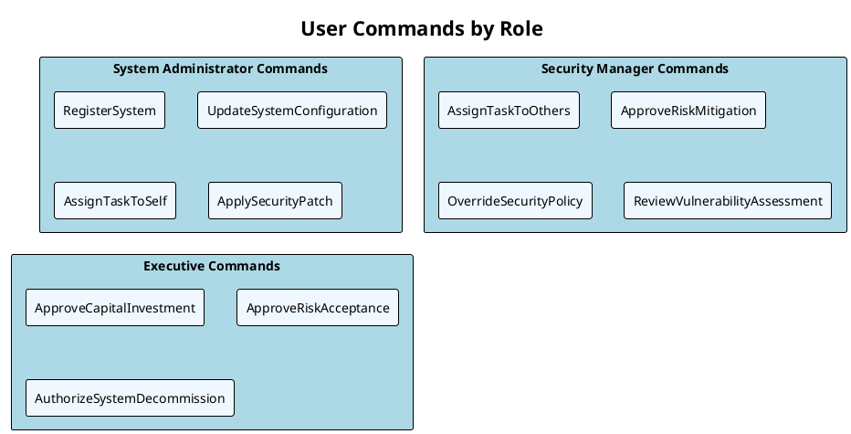
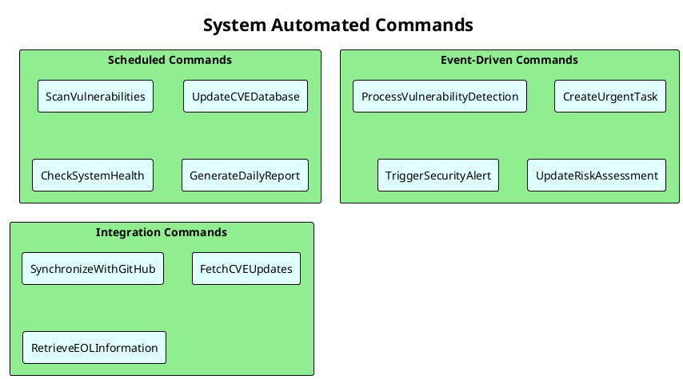
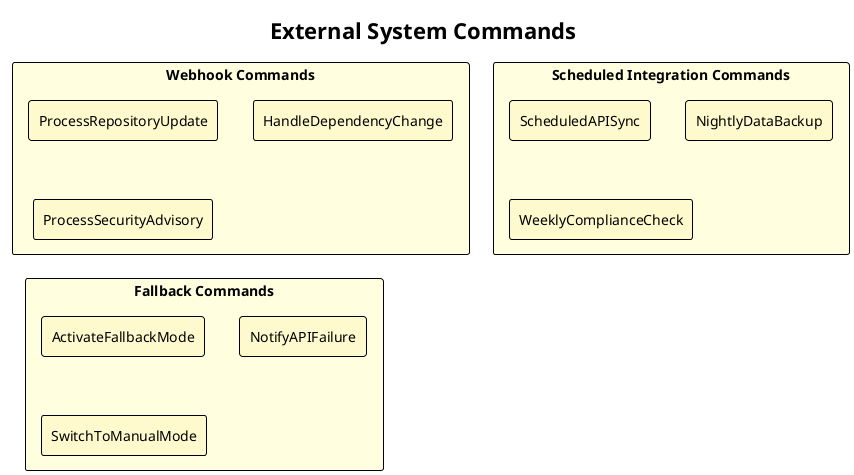
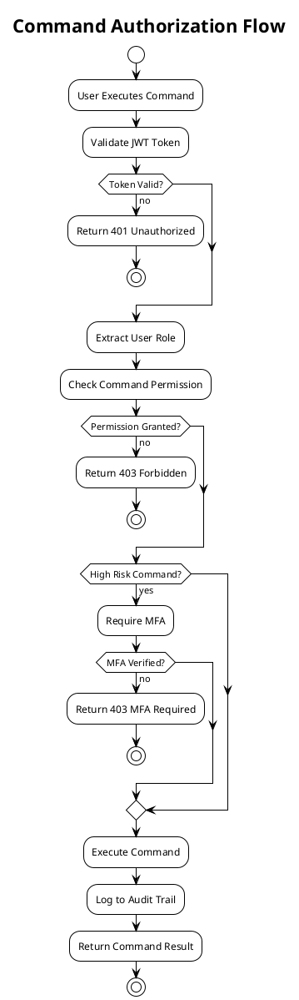
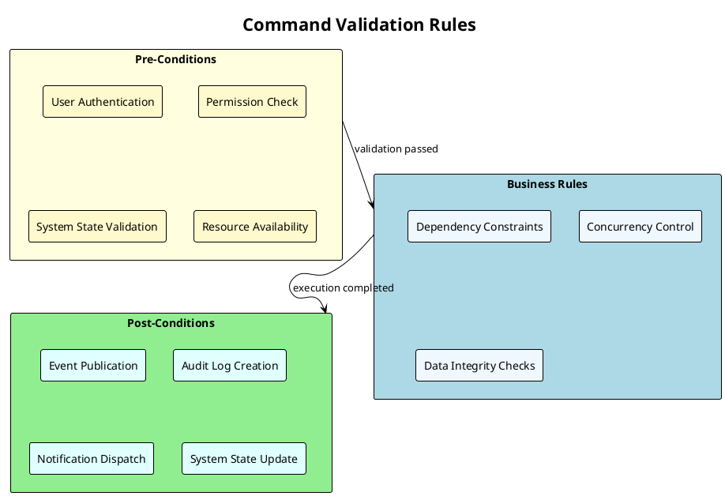

# Phase 2: Commands & Actors Discovery ファシリテーションガイド

**Phase目標**: Phase 1で特定したドメインイベントを引き起こすコマンドとアクターを特定し、責任範囲を明確化する

**実施期間**: 2025年9月15日（Day 2）
**所要時間**: 3.5時間
**主担当**: Backend System Architect（技術実装観点）
**支援**: Cybersecurity Advisor（セキュリティ・認証要件）

---

## 1. 事前準備チェックリスト（30分）

### 1.1 Phase 1成果物レビュー

- [x] `/docs/event-storming/phase1-domain-events.md` の全ドメインイベント把握
- [x] 時系列関係・因果関係の理解
- [x] Hotspots & Pain Points の把握

### 1.2 技術実装観点準備

**Backend System Architect**:

- [x] NestJSでのCommand Handler実装パターン検討完了
- [x] CQRS + Event Sourcingでのコマンド設計方針確立
- [x] DI（Dependency Injection）でのコマンド注入パターン整理

### 1.3 セキュリティ観点準備

**Cybersecurity Advisor**:

- [x] OAuth2.0 + JWT実装要件整理
- [x] RBAC（Role-Based Access Control）設計方針確立
- [x] 監査ログ要件（5年間保持）への対応方針

### 1.4 参画エージェント準備確認

- [x] **Requirements Analyst**: ビジネス要件からのアクター抽出準備
- [x] **UX Design Optimizer**: エンドユーザー体験からのコマンド導出準備
- [x] **Software Architecture Advisor**: システム境界・技術制約確認準備

---

## 2. キックオフセッション（15分）

### 2.1 Phase 2目標の明確化

**主担当（Backend System Architect）発言例**:

```text
「Phase 2では、『なぜそのイベントが起こるのか？』『誰がそれを引き起こすのか？』
を明確にします。特に、System Boardでは手動操作と自動化の境界を
適切に設計することが成功の鍵です。」
```

### 2.2 Command vs Event の違い確認

**重要な概念整理**:

- **Event（過去形）**: 既に起こった出来事「SystemRegistered」
- **Command（命令形）**: システムに対する指示「RegisterSystem」
- **Actor**: コマンドを発行する主体（人間/システム/外部API）

### 2.3 System Board特有の考慮点

**セキュリティ制約**:

- 情報漏洩防止が最優先
- 製造業向けセキュリティ基準（高度な監査要件）
- Multi-Factor Authentication (MFA) 必須

**運用制約**:

- 5-10名の限定的ユーザー
- 手動データ管理方針
- 外部システム自動連携の制限

---

## 3. Command Discovery（90分）

### 3.1 Step 1: User Commands 抽出（30分）

#### ファシリテーション質問

**Requirements Analyst + UX Design Optimizer**共同で質問:

**システム担当者が実行するコマンド**:

```text
Q1: システム担当者が日常的に実行する操作は何ですか？
    -> RegisterSystem, UpdateSystemConfiguration, AssignTaskToSelf...

Q2: 緊急時にシステム担当者が実行する操作は何ですか？
    -> EscalateTask, ApplyEmergencyPatch, NotifyManagement...

Q3: 定期メンテナンス時に実行する操作は何ですか？
    -> ScheduleSystemMaintenance, ValidateSystemHealth, UpdatePackageVersions, ScaleHostResources...
```

**情報システム管理者が実行するコマンド**:

```text
Q4: 管理者のみが実行できる承認系操作は何ですか？
    -> ApproveSystemChange, AssignTaskToOthers, OverrideSecurityPolicy...

Q5: 部門管理として実行する操作は何ですか？
    -> ReviewTeamPerformance, AllocateResources, SetPolicyParameters, ApproveResourceScaling...
```

**経営陣が実行するコマンド**:

```text
Q6: 最終承認が必要な重要な操作は何ですか？
    -> ApproveCapitalInvestment, ApproveRiskAcceptance, AuthorizeSystemDecommission...
```

#### 即時PlantUML可視化



### 3.2 Step 2: System Commands 抽出（30分）

#### 自動化システムコマンド質問

**Backend System Architect**主導:

**定期実行コマンド**:

```text
Q7: システムが定期的に自動実行すべき操作は何ですか？
    -> ScanVulnerabilities, UpdateCVEDatabase, CheckSystemHealth...

Q8: 外部APIからデータを取得する操作は何ですか？
    -> SynchronizeWithGitHub, FetchCVEUpdates, RetrieveEOLInformation...

Q9: 閾値ベースで自動実行される操作は何ですか？
    -> CreateUrgentTask, TriggerSecurityAlert, EscalateOverdueTask...
```

**Event-Driven コマンド**:

```text
Q10: あるイベント発生時に自動実行される操作は何ですか？
     -> ProcessVulnerabilityDetection, UpdateRiskAssessment, NotifyStakeholders...

Q11: 複数システム連携時に実行される操作は何ですか？
     -> AnalyzeSystemDependencies, PropagateConfigurationChange, ValidateSystemIntegrity...
```

#### PlantUML System Commands



### 3.3 Step 3: External Commands 抽出（30分）

#### 外部システム起因コマンド質問

**Software Architecture Advisor**主導:

**Webhook系コマンド**:

```text
Q12: GitHub Webhookで受信する操作は何ですか？
     -> ProcessRepositoryUpdate, HandleDependencyChange, ProcessSecurityAdvisory...

Q13: 外部API障害時に実行される操作は何ですか？
     -> ActivateFallbackMode, NotifyAPIFailure, SwitchToManualMode...
```

**時間ベーストリガー**:

```text
Q14: 特定時刻に実行される外部連携操作は何ですか？
     -> ScheduledAPISync, NightlyDataBackup, WeeklyComplianceCheck...
```

#### PlantUML External Commands



---

## 4. Actor Identification（60分）

### 4.1 Human Actors 詳細化（20分）

#### UX Design Optimizer主導

**Primary Actors（直接ユーザー）**:

```text
Q15: System Boardを直接操作する人は誰ですか？
     -> 情報システム担当者、情報システム管理者

Q16: 各ユーザーの責任範囲・権限範囲は何ですか？
     -> 日常運用 vs 管理判断 vs 最終承認

Q17: 緊急時の責任者・エスカレーション先は誰ですか？
     -> 夜間/休日対応者、上位管理者、経営陣
```

**Secondary Actors（間接関係者）**:

```text
Q18: System Boardから情報を受け取る人は誰ですか？
     -> 経営陣（レポート受信）、監査部門（証跡確認）

Q19: System Boardの運用に影響を与える人は誰ですか？
     -> 調達部門（システム購入）、各事業部門（システム利用）
```

#### Human Actors PlantUML

```plantuml
@startuml HumanActors
!theme plain
title "Human Actors & Responsibilities"

actor "System Administrator" as Admin #LightGreen {
  note right: 日常運用・保守\n脆弱性対応\nタスク実行
}

actor "Security Manager" as SecMgr #LightGreen {
  note right: 管理・意思決定\nタスク割当・承認\nリスク評価
}

actor "Executive" as Exec #LightGreen {
  note right: 最終承認\n投資判断\n状況把握
}

actor "Auditor" as Auditor #LightGreen {
  note right: 監査・コンプライアンス\n証跡確認\n規制対応
}

Admin --|> SecMgr : reports to
SecMgr --|> Exec : escalates to
Auditor ..> Admin : audits activities

@enduml
```

### 4.2 System Actors 特定（20分）

#### Backend System Architect主導

**自動化システムActors**:

```text
Q20: 自動でコマンドを発行するシステムコンポーネントは何ですか？
     -> 脆弱性スキャナー、タスク管理エンジン、通知システム

Q21: 各システムActorの動作トリガーは何ですか？
     -> 時間ベース、イベントベース、閾値ベース

Q22: システムActor間の連携はありますか？
     -> スキャナー → タスクエンジン → 通知システム
```

#### System Actors PlantUML

```plantuml
@startuml SystemActors
!theme plain
title "System Actors & Automation"

actor "CVE Scanner" as Scanner #LightBlue {
  note right: 定期脆弱性スキャン\nCVSSスコア評価\n自動リスク判定
}

actor "Task Engine" as TaskEngine #LightBlue {
  note right: 自動タスク生成\nワークフロー制御\nエスカレーション
}

actor "Notification System" as NotifySystem #LightBlue {
  note right: Teams通知\nEmail送信\nアラート管理
}

actor "Monitoring Agent" as Monitor #LightBlue {
  note right: システム監視\nヘルスチェック\n障害検知
}

Scanner --> TaskEngine : vulnerability detected
TaskEngine --> NotifySystem : task created/escalated
Monitor --> NotifySystem : system alert

@enduml
```

### 4.3 External Actors 整理（20分）

#### Software Architecture Advisor主導

**外部API Actors**:

```text
Q23: System Boardにデータを提供する外部システムは何ですか？
     -> GitHub API, NVD API, EndOfLife.date API

Q24: 各外部APIの提供データ・更新頻度は何ですか？
     -> 依存関係情報、CVE情報、サポート終了情報

Q25: 外部API障害時のFallback Actorは何ですか？
     -> キャッシュシステム、手動データ入力、代替API
```

#### External Actors PlantUML

```plantuml
@startuml ExternalActors
!theme plain
title "External System Actors"

cloud "GitHub API" as GitHub #LightCyan {
  note bottom: リポジトリ情報\n依存関係データ\nWebhook通知
}

cloud "NVD API" as NVD #LightCyan {
  note bottom: CVE脆弱性情報\nCVSSスコア\n日次更新
}

cloud "EndOfLife API" as EOL #LightCyan {
  note bottom: サポート終了情報\nライフサイクルデータ\nEOL日程
}

actor "System Admin" as SysAdmin #LightGreen

GitHub --> SysAdmin : webhook notifications
NVD --> SysAdmin : CVE alerts
EOL --> SysAdmin : EOL warnings

@enduml
```

---

## 5. Permission & Authorization Design（45分）

### 5.1 Cybersecurity Advisor主導

#### RBAC設計質問

**Role Definition**:

```text
Q26: System Boardでの役割（Role）をどう定義しますか？
     -> SystemAdmin, SecurityManager, Executive, Auditor

Q27: 各役割で実行可能なコマンドは何ですか？
     -> 権限マトリックス作成

Q28: 役割継承・権限委譲はありますか？
     -> 上位役割による下位役割権限の代行実行
```

**Permission Matrix設計**:

| Command | System Admin | Security Manager | Executive | Auditor |
|---------|-------------|------------------|-----------|---------|
| RegisterSystem | ✅ | ✅ | ✅ | ❌ |
| AssignTaskToOthers | ❌ | ✅ | ✅ | ❌ |
| ApproveRiskAcceptance | ❌ | ✅ | ✅ | ❌ |
| ScaleHostResources | ✅ | ✅ | ✅ | ❌ |
| ApproveCapitalInvestment | ❌ | ❌ | ✅ | ❌ |
| ViewAuditLog | ❌ | ✅ | ✅ | ✅ |

### 5.2 OAuth2.0 + JWT実装要件

#### 認証・認可コマンド

```text
Q29: 認証が必要なコマンドは何ですか？
     -> 全てのUser Commands（システムコマンドは内部認証）

Q30: MFA（多要素認証）が必要なコマンドは何ですか？
     -> 高リスクコマンド（ApproveRiskAcceptance等）

Q31: セッション管理・タイムアウト要件は何ですか？
     -> 8時間セッション、アイドル30分でタイムアウト
```

#### Authorization PlantUML



### 5.3 監査ログ要件

#### 監査コマンド設計

```text
Q32: 監査ログに記録すべきコマンドは何ですか？
     -> 全てのUser Commands + 重要なSystem Commands

Q33: ログに含めるべき情報は何ですか？
     -> User, Timestamp, Command, Parameters, Result, IP Address

Q34: ログ保持期間・アクセス制御は？
     -> 5年間保持、Auditor Role のみ参照可能
```

---

## 6. Command Validation Rules（30分）

### 6.1 Backend System Architect主導

#### ビジネスルール検証

**事前条件検証**:

```text
Q35: コマンド実行前にチェックすべき条件は何ですか？
     -> システム状態、依存関係、リソース可用性

Q36: 同時実行制限があるコマンドは何ですか？
     -> システム更新系コマンド（排他制御必要）

Q37: 依存関係があるコマンドは何ですか？
     -> ApplySecurityPatch → ValidateSystemHealth
```

**事後条件検証**:

```text
Q38: コマンド実行後に確認すべき状態は何ですか？
     -> システム整合性、通知送信完了、イベント発行

Q39: コマンド失敗時の補償処理は何ですか？
     -> ロールバック、エラー通知、代替処理
```

#### Validation Rules PlantUML



---

## 7. レビュー・合意（30分）

### 7.1 全エージェント参加レビュー

#### 合意確認ポイント

**完全性チェック**:

- [x] 全てのPhase 1イベントにトリガーとなるコマンドが定義されている
- [x] Human/System/External の3種類アクターが適切に分類されている
- [x] 権限・認証要件が各コマンドに定義されている

**整合性チェック**:

- [x] コマンド名が命令形で統一されている
- [x] アクターの責任範囲に重複・漏れがない
- [x] セキュリティ要件が適切に反映されている

**実装可能性チェック**:

- [x] NestJS + TypeScriptでの実装が技術的に可能
- [x] OAuth2.0 + JWT + MFAの実装が現実的
- [x] Event Sourcing Commandハンドラー設計が適切

### 7.2 Phase 3への引き継ぎ事項

**次Phase準備事項**:

- [ ] ビジネスルール・ポリシーの詳細化準備
- [ ] 自動化可能コマンドの特定準備
- [ ] 例外処理・エラーハンドリング設計準備

---

## 8. 成果物作成・保存

### 8.1 最終統合PlantUMLコード

```plantuml
@startuml SystemBoardCommandsActors
!theme plain
title "System Board Commands & Actors - Complete View"

' Human Actors
package "Human Actors" as HA #LightGreen {
  actor "System Administrator" as Admin
  actor "Security Manager" as SecMgr
  actor "Executive" as Exec
  actor "Auditor" as Auditor
}

' System Actors
package "System Actors" as SA #LightBlue {
  actor "CVE Scanner" as Scanner
  actor "Task Engine" as TaskEngine
  actor "Notification System" as NotifySystem
  actor "Monitoring Agent" as Monitor
}

' External Actors
package "External Actors" as EA #LightCyan {
  actor "GitHub API" as GitHub
  actor "NVD API" as NVD
  actor "EndOfLife API" as EOL
}

' System Management Commands
package "System Management Commands" as SMC #LightYellow {
  usecase "RegisterSystem" as UC1
  usecase "UpdateSystemConfiguration" as UC2
  usecase "ScaleHostResources" as UC2b
  usecase "DecommissionSystem" as UC3
  usecase "InstallPackage" as UC4
}

' Task Management Commands
package "Task Management Commands" as TMC #LightYellow {
  usecase "CreateTask" as UC5
  usecase "AssignTaskToSelf" as UC6
  usecase "AssignTaskToOthers" as UC7
  usecase "UpdateTaskStatus" as UC8
  usecase "EscalateTask" as UC9
}

' Vulnerability Management Commands
package "Vulnerability Commands" as VC #LightYellow {
  usecase "ScanVulnerabilities" as UC10
  usecase "AssessRisk" as UC11
  usecase "ApproveRiskMitigation" as UC12
  usecase "ApplySecurityPatch" as UC13
}

' Integration Commands
package "Integration Commands" as IC #LightYellow {
  usecase "SynchronizeWithGitHub" as UC14
  usecase "FetchCVEUpdates" as UC15
  usecase "RetrieveEOLInformation" as UC16
}

' High-Level Actor-Command Relationships
Admin --> UC1 : registers systems
Admin --> UC6 : self-assigns tasks
Admin --> UC13 : applies patches

SecMgr --> UC7 : assigns to team
SecMgr --> UC11 : assesses risk
SecMgr --> UC12 : approves mitigation
SecMgr --> UC2b : approves resource scaling

Exec --> UC3 : authorizes decommission
Exec --> UC12 : final approval

Scanner --> UC10 : automated scanning
Scanner --> UC11 : risk assessment

TaskEngine --> UC5 : auto task creation
TaskEngine --> UC9 : escalation

GitHub --> UC14 : webhook triggers
NVD --> UC15 : CVE data updates
EOL --> UC16 : lifecycle updates

' Critical Security Commands (highlighted)
UC12 -[#red,thickness=2]-> UC13 : approval required
UC9 -[#orange,thickness=2]-> SecMgr : escalation target

note right of VC
  High Security Commands
  - MFA Required
  - Full Audit Trail
  - Manager Approval
end note

note right of IC
  External Integration
  - API Rate Limiting
  - Fallback Mechanisms
  - Error Handling
end note

@enduml
```



### 8.2 完了条件チェック

- [x] 全てのドメインイベントにトリガーとなるコマンドが定義されている
- [x] アクターが適切に分類されている（人間/システム/外部）
- [x] 権限・認証要件が各コマンドに定義されている
- [x] セキュリティ関連コマンドが適切に特定・保護されている
- [x] コマンド実行の事前条件・事後条件が明確化されている
- [x] RBAC権限マトリックスが作成されている

### 8.3 Phase 3準備事項

**QA Testing Specialist**向け準備依頼:

- [ ] テスト可能な形でのビジネスルール表現方法検討
- [ ] コマンド検証ルールのテストケース設計準備
- [ ] 例外処理・エラーケースのテストシナリオ準備

**DevOps Pipeline Optimizer**向け準備依頼:

- [ ] 自動化可能コマンドの運用監視設計準備
- [ ] システムコマンドの実行監視・ログ設計準備

---

## 9. ファシリテーター向け注意点

### 9.1 Phase 2特有の進行のコツ

**Technical vs Business Balance**:

- 技術実装に偏重しすぎず、ビジネス価値を常に意識
- NestJS実装パターンは詳細化しすぎず、概念レベルで留める
- Event Sourcingコマンド設計は Phase 4で詳細化

**Security First Approach**:

- 全てのコマンドでセキュリティ観点を最初に検討
- 製造業セキュリティ基準（情報漏洩防止）を常に念頭に置く
- 監査要件（5年間ログ保持）への影響を毎回確認

### 9.2 よくある課題と対処法

**課題1: コマンド粒度の調整**:

```text
❌ 細かすぎる例: "ValidatePackageVersion", "CheckPackageDependency"
✅ 適切な例: "UpdatePackage" (validation含む)

❌ 粗すぎる例: "ManageSystem"
✅ 適切な例: "RegisterSystem", "UpdateSystem", "DecommissionSystem"
```

**課題2: Actor責任範囲の曖昧さ**:

```text
明確な基準で分類:
- Human Actor: 判断・承認が必要
- System Actor: ルールベースで自動化可能
- External Actor: 外部システム/APIからのトリガー
```

**課題3: 権限設計の複雑化**:

```text
RBAC原則に従い、役割ベースでシンプルに設計
個人単位の細かい権限設定は避ける
```

### 9.3 成功のポイント

- **ビジネスドリブン**: 技術的興味より業務価値中心の設計
- **セキュリティ組み込み**: 後付けでなく設計段階からセキュリティ考慮
- **実装現実性**: NestJSで実現可能な範囲でのコマンド設計
- **継続改善**: 完璧を求めず、Phase 3以降での詳細化を前提

---

**作成日**: 2025年9月13日
**作成者**: Requirements Analyst
**対象**: Phase 2 Commands & Actors Discovery ファシリテーター
**次期更新**: Phase 2実施後のフィードバック反映
