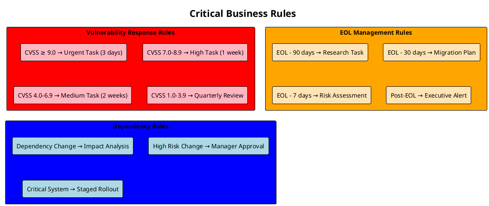
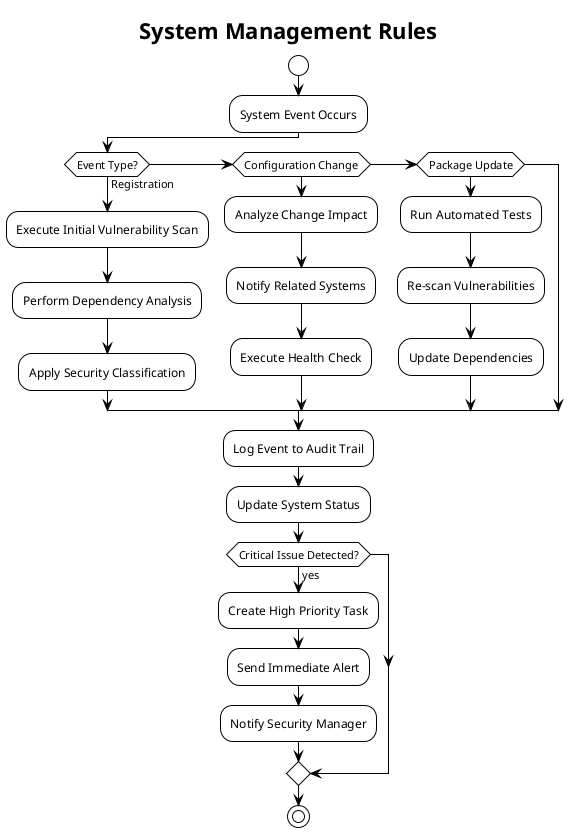
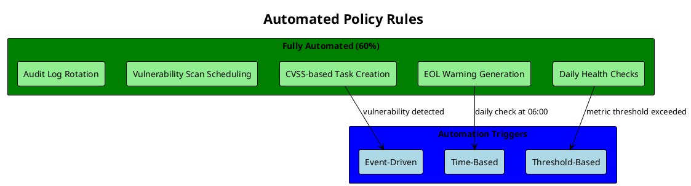
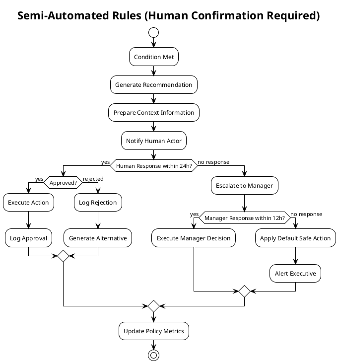
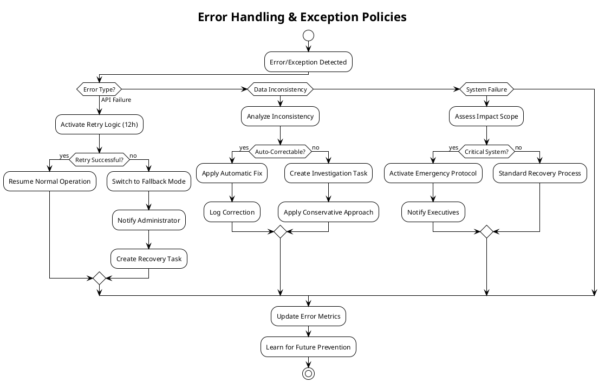

# Phase 3: Policies & Business Rules Discovery ファシリテーションガイド

**Phase目標**: システムのビジネスルールとポリシーを特定し、自動化できるルールと人間の判断が必要なルールを区別する

**実施期間**: 2025年9月16日（Day 3）
**所要時間**: 3.5時間
**主担当**: QA Testing Specialist（テスト可能ルール設計）
**支援**: DevOps Pipeline Optimizer（自動化ポリシー）

---

## 1. 事前準備チェックリスト（30分）

### 1.1 Phase 1-2成果物レビュー

- [x] Phase 1: 全ドメインイベントとHotspots把握
- [x] Phase 2: Commands & Actors、権限マトリックス理解
- [x] ビジネス要件書 6.3章「重要なビジネスルール」レビュー完了

### 1.2 テスト観点準備

**QA Testing Specialist**:

- [x] テスト可能な形でのルール表現方法確立
- [x] 境界値分析・同値分割法でのルール検証方法準備
- [x] 例外処理・エラーケースのテストシナリオテンプレート準備

### 1.3 自動化観点準備

**DevOps Pipeline Optimizer**:

- [x] 自動化可能ポリシーの判定基準確立
- [x] CI/CD パイプラインでの自動検証方法検討
- [x] 運用監視での自動アクション設計方針確立

### 1.4 参画エージェント準備確認

- [x] **Requirements Analyst**: 製造業特有のコンプライアンス要件把握
- [x] **Cybersecurity Advisor**: セキュリティポリシー・規制要件整理
- [x] **Backend System Architect**: ポリシーエンジン実装方式検討
- [x] **Software Architecture Advisor**: ルール外部設定化方針確立

---

## 2. キックオフセッション（15分）

### 2.1 Phase 3目標の明確化

**主担当（QA Testing Specialist）発言例**:

```text
「Phase 3では、『いつ、何を、どのように自動化するか』を明確にします。
特に重要なのは、テスト可能で、運用で確実に動作するルールを設計することです。
曖昧なルールは実装時に必ず問題になります。」
```

### 2.2 Business Rules vs Policies の区別

**概念整理**:

- **Business Rules**: 業務上絶対に守られるべき制約「CVSS 9.0以上は3日以内対応必須」
- **Policies**: 運用方針・ガイドライン「毎日9:00にダッシュボード確認」
- **Constraints**: 技術的・物理的制約「同時ユーザー数10名まで」

### 2.3 System Board特有の重要ポリシー

**製造業セキュリティ要件**:

- 情報漏洩防止が最優先（全ポリシーの上位制約）
- 監査証跡5年間保持必須
- 変更管理の厳格な統制

**運用効率化要件**:

- 手動作業の最小化
- 対応漏れの完全防止
- エスカレーション経路の明確化

---

## 3. Critical Business Rules Discovery（90分）

### 3.1 Step 1: 緊急対応ルール詳細化（30分）

#### ファシリテーション質問

**Requirements Analyst + Cybersecurity Advisor**共同で質問:

**脆弱性対応ルール**:

```text
Q1: CVSS 9.0以上の脆弱性が検出されたら何をしますか？
    -> 自動でUrgent Taskを生成、Teams通知、3日以内対応必須

Q2: CVSS 7.0-8.9の脆弱性では何をしますか？
    -> High Priority Task生成、1週間以内対応

Q3: CVSS 4.0-6.9の中程度脆弱性では何をしますか？
    -> Medium Priority Task、2週間以内対応

Q4: CVSS 1.0-3.9の低重要度では何をしますか？
    -> 四半期レビュー時に対応検討
```

**EOL（End of Life）対応ルール**:

```text
Q5: パッケージのEOL日程が判明したら何をしますか？
    -> EOL-90日: 代替候補調査Task生成
    -> EOL-30日: 移行計画Task生成（緊急扱い）
    -> EOL-7日: システム停止リスク評価Task生成

Q6: EOL日を過ぎたパッケージが検出されたら？
    -> 即座に最高優先度Task生成、経営陣通知
```

**システム間依存関係ルール**:

```text
Q7: 依存関係があるシステムで変更が発生したら？
    -> 影響範囲自動分析、関連システムのヘルスチェック実行

Q8: 依存関係の変更でリスクが高いと判定されたら？
    -> Security Manager承認必須、段階的適用
```

#### PlantUML Business Rules



### 3.2 Step 2: システム管理ルール（30分）

#### システム運用ルール質問

**Backend System Architect + DevOps Pipeline Optimizer**共同で質問:

**システム登録・更新ルール**:

```text
Q9: 新しいシステムが登録されたら何をしますか？
    -> 初回脆弱性スキャン実行、依存関係分析、セキュリティ分類

Q10: システム構成が変更されたら何をしますか？
     -> 変更影響分析、関連システム通知、ヘルスチェック実行

Q11: パッケージが更新されたら何をしますか？
     -> 自動テスト実行、脆弱性再スキャン、依存関係更新

Q11a: ホストリソースが変更されたら何をしますか？
      -> パフォーマンス検証、容量計画更新、依存システム影響確認、コスト計算
```

**システム監視・ヘルスチェックルール**:

```text
Q12: システムヘルスチェックはいつ実行しますか？
     -> 毎日6:00自動実行、システム変更後、手動要求時

Q13: ヘルスチェック失敗時は何をしますか？
     -> 重要度に応じて即座にアラート、復旧Task生成

Q14: 複数システムで同時障害が発生したら？
     -> 障害連携分析、根本原因調査Task、エスカレーション
```

**バックアップ・データ保護ルール**:

```text
Q15: システムデータのバックアップはいつ取りますか？
     -> 毎日1:00自動実行、重要変更前の手動バックアップ

Q16: データ復旧が必要になったら？
     -> Executive承認必須、完全性検証、監査ログ記録
```

#### PlantUML System Management Rules



### 3.3 Step 3: コンプライアンス・監査ルール（30分）

#### コンプライアンス要件質問

**Requirements Analyst + Cybersecurity Advisor**主導:

**監査ログ・証跡管理ルール**:

```text
Q17: どの操作を監査ログに記録しますか？
     -> 全User Commands、重要System Commands、認証イベント

Q18: ログに記録する情報は何ですか？
     -> User ID、Timestamp、Command、Parameters、Result、IP Address、Session ID

Q19: ログの保存期間・アクセス制御は？
     -> 5年間保持、Auditor Roleのみ参照可能、改ざん防止
```

**承認・エスカレーションルール**:

```text
Q20: Security Manager承認が必要な操作は何ですか？
     -> 高リスク脆弱性対応、システム構成重要変更、ポリシー変更

Q21: Executive承認が必要な操作は何ですか？
     -> 投資を伴うシステム変更、リスク受容、システム停止

Q22: エスカレーションのタイムアウトは？
     -> 24時間以内に応答なし → 上位者自動エスカレーション
```

**データ保護・機密性ルール**:

```text
Q23: 機密情報へのアクセス制御は？
     -> Need-to-know原則、ロールベース、アクセスログ記録

Q24: データの暗号化要件は？
     -> 保存時暗号化（TDE）、通信時暗号化（TLS1.3）、キー管理

Q25: 外部データ転送の制限は？
     -> 日本国内限定、暗号化必須、承認プロセス
```

---

## 4. Automated vs Manual Policy Classification（60分）

### 4.1 完全自動化可能ルール（20分）

#### DevOps Pipeline Optimizer主導

**自動化判定基準**:

```text
✅ 完全自動化可能（60%）:
- 明確な閾値がある（CVSS >= 9.0）
- 外部データベースで検証可能（CVE DB、EOL DB）
- 人間の判断が不要
- エラー時の影響が限定的
```

**自動化対象ルール例**:

```text
Q26: 完全自動化できるルールは何ですか？
     -> CVSS基準Task生成、EOL警告生成、定期ヘルスチェック

Q27: 自動化の実行タイミングは？
     -> イベント駆動（脆弱性検出時）、時間駆動（毎日6:00）

Q28: 自動化失敗時の対応は？
     -> フォールバック処理、管理者通知、手動モード切替
```

#### PlantUML Automation Rules



### 4.2 半自動化（人間確認必要）ルール（20分）

#### QA Testing Specialist主導

**半自動化判定基準**:

```text
⚠️ 半自動化（人間確認必要）（30%）:
- 複雑な判断が必要
- ビジネス影響が大きい
- 法的・規制リスクがある
- コスト・投資判断を含む
```

**半自動化対象ルール例**:

```text
Q29: 人間確認が必要なルールは何ですか？
     -> 高重大度脆弱性の対応方針、複雑なシステム変更、緊急時判断

Q30: 確認プロセスのタイムアウトは？
     -> 24時間以内確認、タイムアウト時は上位エスカレーション

Q31: 確認時に提示する情報は？
     -> リスク評価、影響範囲、推奨アクション、過去事例
```

#### Semi-Automated Rules PlantUML



### 4.3 手動対応必須ルール（20分）

#### Requirements Analyst主導

**手動対応判定基準**:

```text
🔴 手動対応必須（10%）:
- 経営判断が必要
- 法的責任を伴う
- 高額投資を要する
- 前例のない複雑な状況
```

**手動対応対象ルール例**:

```text
Q32: 手動対応が必須のルールは何ですか？
     -> 投資判断、法的対応、システム全停止判断

Q33: 手動対応時の支援情報は？
     -> 過去事例、専門家意見、リスク分析、代替案評価

Q34: 手動判断の記録・学習は？
     -> 判断理由記録、将来の半自動化候補として蓄積
```

---

## 5. Exception Handling & Error Policies（45分）

### 5.1 外部API連携失敗ポリシー（15分）

#### Software Architecture Advisor主導

**API障害対応ルール**:

```text
Q35: GitHub API接続失敗時の対応は？
     -> 12時間リトライ、失敗時はキャッシュデータ使用、手動更新モード

Q36: NVD API障害時の脆弱性情報は？
     -> 代替データソース検索、48時間以内に手動確認、リスク保守的評価

Q37: EndOfLife.date API障害時は？
     -> 保守的にEOL日程前倒し評価、手動調査Task生成
```

### 5.2 データ不整合検出ポリシー（15分）

#### Backend System Architect主導

**データ整合性ルール**:

```text
Q38: システム情報と実際の構成が異なる場合は？
     -> 自動修正可能性評価、不可能時は管理者Task生成

Q39: 脆弱性情報の重複・矛盾が検出されたら？
     -> 最新情報優先、管理者確認Task、重複排除処理

Q40: 依存関係グラフの循環参照検出時は？
     -> アラート生成、手動解決Task、一時的回避処理
```

### 5.3 システム障害時業務継続ポリシー（15分）

#### 5.3.1 DevOps Pipeline Optimizer主導

**障害時継続ポリシー**:

```text
Q41: System Board自体が障害した場合の対応は？
     -> 緊急連絡網発動、手動運用モード、復旧優先度設定

Q42: 部分的機能障害時の対応は？
     -> 影響機能特定、代替手順提示、復旧予定通知

Q43: データベース障害時のポリシーは？
     -> 読み取り専用モード、最新バックアップからの復旧、データ損失評価
```

#### Error Handling PlantUML



---

## 6. Policy Implementation Design（30分）

### 6.1 ポリシーエンジン設計（15分）

#### 6.1.1 Software Architecture Advisor主導

**ポリシーエンジンアーキテクチャ**:

```text
Q44: ポリシールールをどこで管理しますか？
     -> 外部設定ファイル（JSON/YAML）、データベース、管理画面

Q45: ルール変更時の影響範囲は？
     -> 設定リロード（無停止）、段階的適用、A/Bテスト

Q46: ポリシー実行の監視・ログは？
     -> 実行結果記録、パフォーマンス監視、異常検知
```

**ポリシーエンジン実装パターン**:

```typescript
interface PolicyRule {
  id: string;
  name: string;
  condition: string; // 条件式
  actions: PolicyAction[]; // 実行アクション
  priority: number; // 優先度
  enabled: boolean; // 有効/無効
}

interface PolicyAction {
  type: 'CREATE_TASK' | 'SEND_NOTIFICATION' | 'UPDATE_STATUS';
  parameters: Record<string, any>;
  requiresApproval: boolean;
}
```

### 6.2 ルール外部設定化（15分）

#### 6.2.1 DevOps Pipeline Optimizer主導

**設定管理ルール**:

```text
Q47: ポリシールールの変更プロセスは？
     -> Security Manager承認、テスト環境検証、段階的本番適用

Q48: ルール設定のバックアップ・履歴は？
     -> Git管理、変更履歴記録、ロールバック機能

Q49: 緊急時のルール変更は？
     -> 緊急変更権限（Executive）、事後承認プロセス、監査記録
```

---

## 7. レビュー・合意（30分）

### 7.1 全エージェント参加レビュー

#### 合意確認ポイント

**ルール完全性チェック**:

- [x] ビジネスルールが「If-Then」形式で明確に記述されている
- [x] 例外処理・エラーケースが考慮されている
- [x] 自動化可能性が3段階（自動/半自動/手動）に評価されている

**テスタビリティチェック**:

- [x] 各ルールが境界値・同値分割でテスト可能
- [x] 例外ケースのテストシナリオが明確
- [x] ポリシー実行結果の検証方法が定義されている

**実装可能性チェック**:

- [x] NestJSでのポリシーエンジン実装が現実的
- [x] 外部設定でのルール管理が技術的に可能
- [x] パフォーマンス影響が許容範囲内

### 7.2 Phase 4への引き継ぎ事項

**次Phase準備事項**:

- [x] ポリシー実行に必要なAggregateデータ特定
- [x] Context間でのポリシー連携設計
- [x] Event Sourcingでのポリシー変更イベント設計

---

## 8. 成果物作成・保存

### 8.1 Business Rules Matrix

| Rule Category | Rule | Automation Level | Trigger | Action | Approval Required |
|---------------|------|------------------|---------|--------|-------------------|
| Vulnerability | CVSS ≥ 9.0 | Fully Auto | CVE Detection | Create Urgent Task + Teams Alert | No |
| Vulnerability | CVSS 7.0-8.9 | Fully Auto | CVE Detection | Create High Priority Task | No |
| EOL | EOL - 30 days | Fully Auto | Daily Check | Create Migration Task | No |
| EOL | Post-EOL Detected | Semi-Auto | Scan Result | Executive Alert + Risk Assessment | Yes |
| System Change | High Risk Change | Semi-Auto | Config Update | Security Manager Approval Required | Yes |
| Investment | Budget > $10K | Manual | Cost Analysis | Executive Decision Required | Yes |

### 8.2 最終統合PlantUMLコード

```plantuml
@startuml SystemBoardPoliciesComplete
!theme plain
title "System Board Business Policies & Rules - Complete View"

rectangle "Automated Policies (60%)" as AP #Green {
  rectangle "CVSS ≥ 9.0 → Urgent Task (3 days)" as AP1 #LightGreen
  rectangle "EOL - 30 days → Migration Task" as AP2 #LightGreen
  rectangle "Daily Health Check → Status Update" as AP3 #LightGreen
  rectangle "API Failure → Fallback Mode" as AP4 #LightGreen
}

rectangle "Semi-Automated Policies (30%)" as SAP #Yellow {
  rectangle "High Risk Change → Manager Approval" as SAP1 #LightYellow
  rectangle "Security Incident → Response Team Alert" as SAP2 #LightYellow
  rectangle "System Dependency Change → Impact Analysis" as SAP3 #LightYellow
  rectangle "Compliance Violation → Legal Review" as SAP4 #LightYellow
}

rectangle "Manual Policies (10%)" as MP #Red {
  rectangle "Capital Investment → Executive Decision" as MP1 #LightPink
  rectangle "Legal Compliance → Legal Team" as MP2 #LightPink
  rectangle "Strategic System Change → Board Approval" as MP3 #LightPink
}

' Policy execution flow
start
:Event/Condition Detected;

if (Policy Type?) then (Automated)
  :Execute Immediate Action;
  :Log Execution Result;
  :Monitor Success Rate;
elseif (Semi-Automated)
  :Generate Recommendation;
  :Notify Human Actor;
  :Wait for Approval (24h timeout);
  if (Approved?) then (yes)
    :Execute Approved Action;
  else (timeout)
    :Escalate to Manager;
  endif
else (Manual)
  :Prepare Decision Package;
  :Present to Decision Maker;
  :Document Decision Rationale;
  :Execute Decided Action;
endif

:Update Policy Metrics;
:Learn for Future Optimization;
stop

' Critical paths highlighted
AP1 -[#red,thickness=3]-> start : CRITICAL: 3-day deadline
SAP1 -[#orange,thickness=2]-> start : HIGH IMPACT: System changes

note right of AP
  Fully Automated
  - Clear thresholds
  - Low risk impact
  - High frequency
  - Measurable outcomes
end note

note right of SAP
  Human Confirmation
  - Complex judgment
  - Business impact
  - Regulatory risk
  - Cost implications
end note

note right of MP
  Manual Decision
  - Strategic impact
  - Legal responsibility
  - High investment
  - Precedent setting
end note

@enduml
```

### 8.3 完了条件チェック

- [x] ビジネスルールが「If-Then」形式で明確に記述されている
- [x] 例外処理・エラーケースが考慮されている
- [x] 自動化可能性が評価され、3段階（自動/半自動/手動）に分類されている
- [x] テスト可能な形でポリシーが表現されている
- [x] 外部設定化・変更管理プロセスが設計されている
- [x] エラーハンドリング・障害時ポリシーが明確化されている

---

## 9. ファシリテーター向け注意点

### 9.1 Phase 3特有の進行のコツ

**具体性の重視**:

- 曖昧なルール「適切に対応する」ではなく「3日以内に対応完了」
- 測定可能な基準「高リスク」ではなく「CVSS ≥ 9.0」
- テスト可能な条件設定

**実装現実性の確保**:

- NestJSで実装可能なポリシーエンジン設計
- パフォーマンス影響を考慮した自動化範囲
- 運用負荷を考慮したルール設計

### 9.2 よくある課題と対処法

**課題1: ルールの粒度調整**:

```text
❌ 粗すぎる例: "脆弱性に対応する"
✅ 適切な例: "CVSS ≥ 9.0の脆弱性は3日以内に対応完了"

❌ 細かすぎる例: "CVSS 9.0, 9.1, 9.2... それぞれで個別ルール"
✅ 適切な例: "CVSS ≥ 9.0で統一ルール"
```

**課題2: 自動化レベルの判断迷い**:

```text
判断基準を明確化:
- 完全自動化: 明確な閾値 + 低リスク + 高頻度
- 半自動化: 複雑判断 + 中リスク + 中頻度
- 手動: 戦略判断 + 高リスク + 低頻度
```

**課題3: 例外処理の網羅性**:

```text
FMEA（Failure Mode and Effects Analysis）手法活用:
- 何が失敗する可能性があるか？
- 失敗時の影響は？
- 検出方法は？
- 対処方法は？
```

### 9.3 成功のポイント

- **測定可能性**: 全てのルールが定量的に測定可能
- **テスタビリティ**: QAチームがテストケース作成可能
- **運用可能性**: DevOpsチームが監視・運用可能
- **継続改善**: ルール実行結果から継続的にルール改善

---

**作成日**: 2025年9月13日
**作成者**: Requirements Analyst
**対象**: Phase 3 Policies & Business Rules Discovery ファシリテーター
**次期更新**: Phase 3実施後のフィードバック反映
