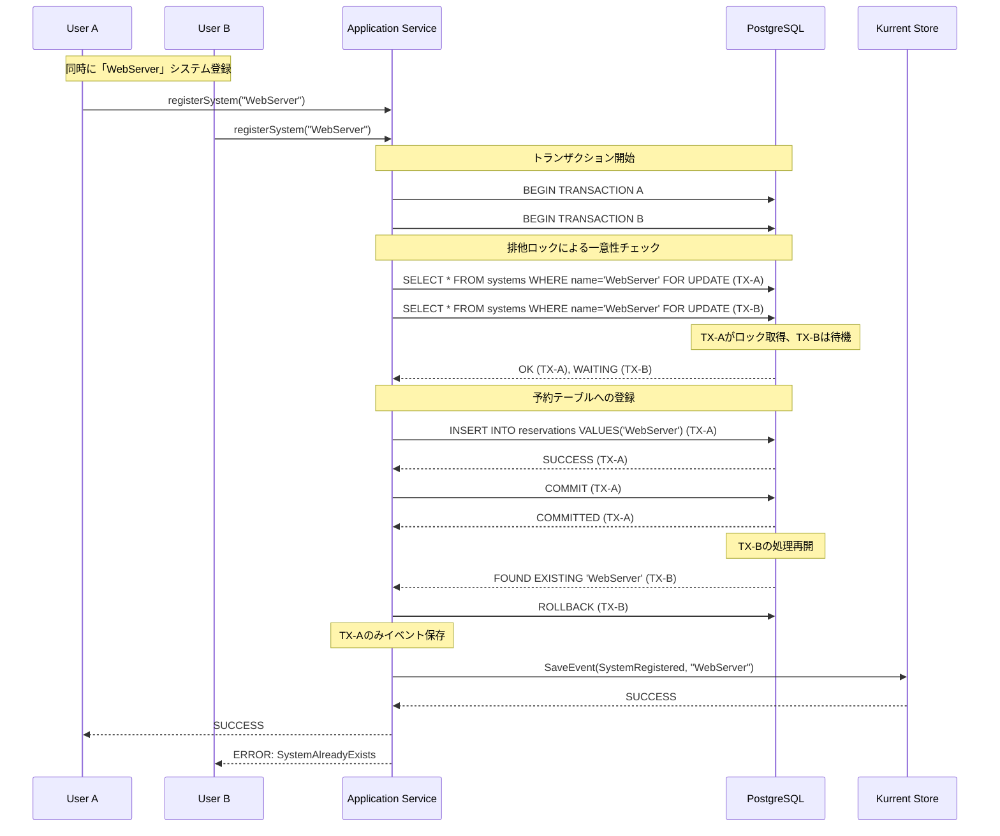

# Phase 4: Aggregates & Bounded Context Discovery 成果物

**Phase目標**: 関連するイベント・コマンド・データをグループ化し、Aggregate境界とBounded Context境界を確定する。オニオンアーキテクチャでの実装設計に落とし込む

**実施日**: 2025年9月17日 07:00-07-30
**所要時間**: 4時間
**主担当**: Software Architecture Advisor（アーキテクチャ統合）
**支援**: Database Architect Consultant（データ設計）
**参加エージェント**: Requirements Analyst (ファシリテーター), Backend System Architect, UX Design Optimizer, DevOps Pipeline Optimizer, Cybersecurity Advisor

---

## 1. Core Aggregates 設計結果

### 1.1 System Management Context Aggregates

#### System Aggregate (Aggregate Root)

**責任範囲**: システム構成・パッケージ・ホスト管理

```typescript
class System {
  // Identity
  private systemId: SystemId;
  private name: SystemName;
  private type: SystemType;
  private status: SystemStatus;

  // Configuration
  private host: HostConfiguration;
  private packages: Package[];
  private securityClassification: SecurityClassification;
  private criticality: CriticalityLevel;

  // Lifecycle
  private createdDate: Date;
  private lastModified: Date;
  private decommissionDate?: Date;

  // Domain Methods
  public registerSystem(): SystemRegistered;
  public updateConfiguration(config: SystemConfiguration): SystemConfigurationUpdated;
  public installPackage(package: Package): PackageInstalled;
  public scaleHostResources(resources: HostResources): HostResourcesScaled;
  public decommission(): SystemDecommissioned;

  // Invariants
  private validateActiveSystemHasPackages(): void;
  private validateSystemNameUniqueness(): void;
  private validateSecurityClassificationConsistency(): void;
}
```

**不変条件**:

- アクティブシステムは必ず1つ以上のパッケージを持つ
- システム名の一意性保証
- 廃止システムはパッケージ更新不可
- セキュリティ分類変更時の関連データ整合性

**発行ドメインイベント**:

- `SystemRegistered`
- `SystemConfigurationUpdated`
- `SystemDecommissioned`
- `PackageInstalled`
- `HostResourcesScaled`

#### Package Entity

```typescript
class Package {
  private packageId: PackageId;
  private name: PackageName;
  private version: Version;
  private installDate: Date;
  private eolDate?: Date;
  private vulnerabilityRefs: VulnerabilityRef[];
  private dependencies: PackageRef[];

  public updateVersion(newVersion: Version): PackageUpdated;
  public addVulnerabilityReference(vulnRef: VulnerabilityRef): void;
  public checkEOLStatus(currentDate: Date): boolean;
}
```

### 1.2 Vulnerability Management Context Aggregates

#### Vulnerability Aggregate (Aggregate Root)

**責任範囲**: 脆弱性・リスク評価・影響分析管理

```typescript
class Vulnerability {
  // Identity
  private vulnerabilityId: CVE_ID;
  private cvss: CVSSScore;
  private severity: VulnerabilitySeverity;
  private status: VulnerabilityStatus;

  // Affected Scope
  private affectedPackages: PackageRef[];
  private affectedSystems: SystemRef[];

  // Assessment
  private riskAssessments: RiskAssessment[];
  private mitigationPlans: MitigationPlan[];

  // Lifecycle
  private detectionDate: Date;
  private lastUpdated: Date;
  private resolvedDate?: Date;

  // Domain Methods
  public detectVulnerability(cveData: CVEData): VulnerabilityDetected;
  public assessRisk(assessment: RiskAssessmentInput): RiskAssessmentCompleted;
  public createMitigationPlan(plan: MitigationPlanInput): MitigationPlanCreated;
  public applySecurityPatch(patch: SecurityPatch): SecurityPatchApplied;
  public resolveVulnerability(): VulnerabilityResolved;

  // Invariants
  private validateCVSSRange(): void; // 0.0-10.0
  private enforceHighSeverityTaskCreation(): void; // CVSS≥9.0
  private preventReopeningResolvedVulnerability(): void;
}
```

**不変条件**:

- CVSSスコアは0.0-10.0の範囲内
- CVSS≥9.0は必ずUrgentタスクが生成される
- 解決済み脆弱性は再オープンされない
- 影響パッケージの存在確認

**発行ドメインイベント**:

- `VulnerabilityDetected`
- `CVSSScoreAssigned`
- `RiskAssessmentCompleted`
- `MitigationPlanCreated`
- `SecurityPatchApplied`
- `VulnerabilityResolved`

#### RiskAssessment Entity

```typescript
class RiskAssessment {
  private assessmentId: AssessmentId;
  private vulnerabilityRef: VulnerabilityRef;
  private affectedSystems: SystemRef[];
  private riskLevel: RiskLevel;
  private businessImpact: BusinessImpact;
  private mitigationPlan: string;
  private assessedBy: UserId;
  private assessedDate: Date;
  private approvedBy?: UserId;
  private approvalDate?: Date;

  public updateRiskLevel(newLevel: RiskLevel): RiskLevelUpdated;
  public approveMitigation(approver: UserId): MitigationApproved;
}
```

### 1.3 Task Management Context Aggregates

#### Task Aggregate (Aggregate Root)

**責任範囲**: タスク実行・ワークフロー・エスカレーション管理

```typescript
class Task {
  // Identity
  private taskId: TaskId;
  private type: TaskType;
  private priority: TaskPriority;
  private status: TaskStatus;

  // Context References
  private systemRef?: SystemId;
  private vulnerabilityRef?: CVE_ID;
  private relationshipRef?: DependencyId;

  // Assignment
  private assigneeRef?: UserId;
  private assignedDate?: Date;
  private dueDate: Date;

  // Progress
  private createdDate: Date;
  private startedDate?: Date;
  private completedDate?: Date;
  private escalationHistory: EscalationRecord[];

  // Approval
  private requiresApproval: boolean;
  private approvalHistory: ApprovalRecord[];

  // Domain Methods
  public createTask(input: TaskCreationInput): TaskCreated;
  public assignTask(assignee: UserId): TaskAssigned;
  public startWork(): TaskStarted;
  public completeTask(result: TaskResult): TaskCompleted;
  public escalateTask(reason: EscalationReason): TaskEscalated;
  public requestApproval(approver: UserId): ApprovalRequested;

  // Invariants
  private validateStatusTransitions(): void;
  private preventCompletedTaskModification(): void;
  private enforceCriticalTaskPriority(): void; // CVSS≥9.0
}
```

**不変条件**:

- 有効なステータス遷移のみ許可
- 完了タスクは編集不可
- CVSS≥9.0は緊急優先度必須
- 承認必要タスクの承認完了確認

**発行ドメインイベント**:

- `TaskCreated`
- `TaskAssigned`
- `TaskStarted`
- `TaskCompleted`
- `TaskEscalated`
- `ApprovalRequested`
- `ApprovalCompleted`

#### Workflow Aggregate (Aggregate Root)

```typescript
class Workflow {
  private workflowId: WorkflowId;
  private name: WorkflowName;
  private tasks: TaskRef[];
  private rules: WorkflowRule[];
  private status: WorkflowStatus;
  private triggerConditions: TriggerCondition[];
  private orchestrationLogic: OrchestrationLogic;

  public startWorkflow(trigger: WorkflowTrigger): WorkflowStarted;
  public handleTaskCompletion(taskId: TaskId): WorkflowProgressUpdated;
  public completeWorkflow(): WorkflowCompleted;

  private validateWorkflowRules(): void;
  private checkCompletionCriteria(): boolean;
}
```

### 1.4 Relationship Management Context Aggregates

#### SystemDependency Aggregate (Aggregate Root)

**責任範囲**: 依存関係・影響分析管理

```typescript
class SystemDependency {
  // Identity
  private dependencyId: DependencyId;
  private sourceSystemRef: SystemId;
  private targetSystemRef: SystemId;

  // Relationship Properties
  private dependencyType: DependencyType;
  private strength: DependencyStrength;
  private direction: DependencyDirection;

  // Analysis
  private impactAnalyses: ImpactAnalysis[];

  // Lifecycle
  private createdDate: Date;
  private lastVerified: Date;
  private status: DependencyStatus;

  // Domain Methods
  public mapDependency(mapping: DependencyMapping): DependencyMapped;
  public analyzeImpact(change: SystemChange): ImpactAnalysisCompleted;
  public updateDependency(update: DependencyUpdate): DependencyUpdated;
  public verifyDependency(): DependencyVerified;

  // Invariants
  private preventCircularDependencies(): void;
  private validateDependencyStrength(): void;
}
```

**不変条件**:

- 循環依存関係の防止
- 依存関係強度の妥当性検証
- システム存在確認

**発行ドメインイベント**:

- `DependencyMapped`
- `ImpactAnalysisCompleted`
- `DependencyUpdated`
- `CircularDependencyDetected`

---

## 2. Bounded Context 境界確定

### 2.1 Context Map & Relationships

#### Context間関係性

**System Management Context (Upstream) ↔ Vulnerability Management Context (Downstream)**:

- **関係性**: Customer/Supplier
- **データ流れ**: システム情報・パッケージ情報 → 脆弱性評価
- **連携**: SystemRegistered → TriggerVulnerabilityScan

**Vulnerability Management Context (Upstream) ↔ Task Management Context (Downstream)**:

- **関係性**: Customer/Supplier
- **データ流れ**: 脆弱性情報・リスク評価 → タスク生成
- **連携**: VulnerabilityDetected → CreateUrgentTask (CVSS≥9.0)

**Task Management Context ↔ System Management Context (Feedback)**:

- **関係性**: Published Language
- **データ流れ**: タスク完了結果 → システム状態更新
- **連携**: TaskCompleted → SystemStatusUpdated

**System Management Context ↔ Relationship Management Context**:

- **関係性**: Shared Kernel
- **共有概念**: SystemId, システム参照
- **連携**: SystemRegistered → AnalyzeDependencies

#### Shared Kernel 定義

```typescript
// Shared Kernel - 全Context共通
interface SharedKernel {
  // Common Identifiers
  SystemId: ValueObject;
  CVE_ID: ValueObject;
  UserId: ValueObject;

  // Common Events Interface
  DomainEvent: Interface;

  // Common Repository Interface
  Repository<T>: Interface;

  // Common Value Objects
  Timestamp: ValueObject;
  Version: ValueObject;
}
```

#### Anti-Corruption Layer 設計

**External API Integration**:

```typescript
// GitHub API ACL
class GitHubAPIAntiCorruptionLayer {
  public async fetchRepositoryData(repoUrl: string): Promise<SystemConfiguration> {
    const githubData = await this.githubClient.getRepository(repoUrl);

    return this.transformToSystemDomain({
      name: githubData.name,
      packages: this.extractPackagesFromDependencies(githubData.dependencies),
      securityAdvisories: this.mapSecurityAdvisories(githubData.advisories)
    });
  }

  private transformToSystemDomain(data: GitHubRepositoryData): SystemConfiguration;
  private extractPackagesFromDependencies(deps: GitHubDependency[]): Package[];
  private mapSecurityAdvisories(advisories: GitHubAdvisory[]): VulnerabilityRef[];
}

// NVD API ACL
class NVDAPIAntiCorruptionLayer {
  public async fetchCVEData(cveId: string): Promise<VulnerabilityData> {
    const nvdData = await this.nvdClient.getCVE(cveId);

    return this.transformToVulnerabilityDomain({
      cveId: nvdData.cve.CVE_data_meta.ID,
      cvssScore: this.extractCVSSScore(nvdData.impact),
      affectedProducts: this.mapAffectedProducts(nvdData.configurations),
      publishedDate: nvdData.publishedDate
    });
  }

  private transformToVulnerabilityDomain(data: NVDCVEData): VulnerabilityData;
  private extractCVSSScore(impact: NVDImpact): CVSSScore;
  private mapAffectedProducts(configs: NVDConfiguration[]): PackageRef[];
}

// EndOfLife.date API ACL
class EOLAPIAntiCorruptionLayer {
  public async fetchEOLData(productName: string): Promise<LifecycleData> {
    const eolData = await this.eolClient.getProduct(productName);

    return this.transformToLifecycleDomain({
      productName: eolData.product,
      versions: this.mapVersionLifecycles(eolData.releases),
      currentSupport: this.determineCurrentSupportStatus(eolData)
    });
  }

  private transformToLifecycleDomain(data: EOLProductData): LifecycleData;
  private mapVersionLifecycles(releases: EOLRelease[]): VersionLifecycle[];
  private determineCurrentSupportStatus(data: EOLProductData): SupportStatus;
}
```

### 2.2 NestJS Module構造設計

#### モジュラーモノリス実装構造

**System Management Context**:

*Domain*:

```text
/src
  /system-management/
    /domain/
      /model/
        - SystemAggregate.ts
        - PackageEntity.ts
        - HostConfigurationValueObject.ts
        - SystemNameValueObject.ts
        - SecurityClassificationValueObject.ts
      /service/ # ドメインサービス
        - SystemRepository.ts
    /application/
      - SystemService.ts
      - RegisterSystemHandler.ts
      - UpdateSystemConfigurationHandler.ts
      - SystemQueries.ts
      - SystemDto.ts
    - SystemModule.ts
```

*Infrastructure*:

```text
/src
  /system-management/
    /infrastructure/
      - KurrentSystemRepository.ts
      - GithubApiClient.ts
    - KurrentSystemModule.ts
```

*Presentatioin*:

```text
/src
  /system-management/
    /presentation/
      - SystemController.ts
    - SystemServiceModule.ts
  - AppModule.ts
```

**Vulnerability Management Context**:

*Domain*:

```text
/src
  /vulnerability-management/
    /domain/
      /model/
        - VulnerabilityAggregate.ts
        - RiskAssessmentEntity.ts
        - CvssScoreValueObject.ts
        - VulnerabilitySeverityValueObject.ts
      /service/
        - VulnerabilityRepository.ts
    /application/
      - VulnerabilityService.ts
      - DetectVulnerabilityHandler.ts
      - AssessRiskHandler.ts
      - VulnerabilityQueries.ts
    - VulnerabilityModule.ts
```

*Infrastructure*:

```text
/src
  /vulnerability-management/
    /infrastructure/
      - KurrentVulnerabilityRepository.ts
    - KurrentVulnerabilityModule.ts
```

*Presentatioin*:

```text
/src
  /vulnerability-management/
    /presentation/
      - VulnerabilityController.ts
    - VulnerabilityServiceModule.ts
  - AppModule.ts
```

**Task Management Context**:

*Domain*:

```text
/src
  /task-management/
    /domain/
      /model/
        - TaskAggregate.ts
        - WorkflowAggregate.ts
        - TaskStatusValueObject.ts
        - TaskPriorityValueObject.ts
      /service/
        - TaskRepository.ts
    /application/
      - TaskService.ts
      - CreateTaskHandler.ts
      - AssignTaskHandler.ts
      - TaskQueries.ts
      - WorkflowOrchestrator.ts
    - TaskModule.ts
```

*Infrastructure*:

```text
/src
  /task-management/
    /infrastructure/
      - KurrentTaskRepository.ts
      - NotificationService.ts
    - KurrentTaskModule.ts
```

*Presentatioin*:

```text
/src
  /task-management/
    /presentation/
      - TaskController.ts
    - TaskServiceModule.ts
  - AppModule.ts
```

**Relationship Management Context**:

*Domain*:

```text
/src
  /relationship-management/
    /domain/
      /model/
        - SystemDependencyAggregate.ts
        - ImpactAnalysisEntity.ts
        - DependencyTypeValueObject.ts
      /service/
        - RelationshipRepository.ts
    /application/
      - RelationshipService.ts
      - MapDependencyHandler.ts
      - AnalyzeImpactHandler.ts
      - RelationshipQueries.ts
    - RelationshipModule.ts
```

*Infrastructure*:

```text
/src
  /relationship-management/
    /infrastructure/
      - KurrentRelationshipRepository.ts
    - KurrentRelationshipModule.ts
```

*Presentatioin*:

```text
/src
  /relationship-management/
    /presentation/
      - RelationshipController.ts
    - RelationshipServiceModule.ts
  - AppModule.ts
```

**Shared Kernel**:

*Domain*:

```text
/src
  /shared/
    /domain/
      - SharedKernel.ts
      - DomainEventInterface.ts
      - AggregateRootAbstract.ts
      - EntityAbstract.ts
      - ValueObjectAbstract.ts
    /application/
      - EventBus.ts
      - CommandIinterface.ts
      - QueryInterface.ts
      - SagaAbstract.ts
    /infrastructure/
      - RepositoryInterface.ts
      - KurrentClient.ts
      - PostgresqlClient.ts
      - RedisClient.ts
```

#### Module間通信パターン

```typescript
// Event Bus Implementation
@Injectable()
export class DomainEventBus {
  constructor(
    private readonly eventBus: EventBus,
    private readonly eventStore: KurrentClient
  ) {}

  async publish(event: DomainEvent): Promise<void> {
    // Persist to Kurrent
    await this.eventStore.saveEvent(event);

    // Publish for immediate processing
    await this.eventBus.publish(event);
  }

  subscribe<T extends DomainEvent>(
    eventType: new (...args: any[]) => T,
    handler: (event: T) => Promise<void>
  ): void {
    this.eventBus.subscribe(eventType, handler);
  }
}

// Cross-Context Event Handler Example
@EventsHandler(VulnerabilityDetected)
export class VulnerabilityDetectedHandler {
  constructor(
    private readonly taskService: TaskService,
    private readonly policyEngine: PolicyEngine
  ) {}

  async handle(event: VulnerabilityDetected): Promise<void> {
    // Check if urgent task creation is required
    if (event.cvssScore >= 9.0) {
      const createTaskCommand = new CreateUrgentTaskCommand({
        vulnerabilityId: event.vulnerabilityId,
        systemIds: event.affectedSystems,
        dueDate: new Date(Date.now() + 3 * 24 * 60 * 60 * 1000), // 3 days
        priority: TaskPriority.CRITICAL
      });

      await this.taskService.createTask(createTaskCommand);
    }
  }
}
```

---

## 3. Data Consistency Strategy

### 3.1 強整合性境界 (Strong Consistency)

#### Limited ACID Requirements

**真に強整合性が必要な操作（PostgreSQL）**:

```typescript
// ドメインサービス: ビジネスルール実装
class SystemUniquenessService {
  constructor(
    private readonly systemRepository: SystemRepository
  ) {}

  async isUnique(system: System, tx?: Transaction): Promise<boolean> {
    // ドメイン知識: システムの一意性はシステム名で判定される
    const existingSystem = await this.systemRepository.findByName(system.name, tx);

    return existingSystem === null;
  }
}

// System集約用Repository（集約ルート専用）
class SystemRepository {
  async findByName(systemName: SystemName, tx?: Transaction): Promise<System | null> {
    if (tx) {
      // 強整合性が必要な場合: Read Modelから検索（排他制御）
      const systemData = await tx('systems')
        .where('name', systemName.value)
        .forUpdate()
        .first();

      if (!systemData) {
        return null;
      }

      // Event Storeから最新状態復元（一貫性保証）
      return await this.getById(new SystemId(systemData.id));
    } else {
      // 通常検索: Event Store直接検索（結果整合性許容）
      return await this.findByNameFromEventStore(systemName);
    }
  }

  private async findByNameFromEventStore(systemName: SystemName): Promise<System | null> {
    // Event Store Projectionを活用した効率的検索
    const systemStreams = await this.kurrent.queryStreams({
      streamCategory: 'system',
      whereEvent: 'SystemRegistered',
      whereData: { name: systemName.value }
    });

    if (systemStreams.length === 0) {
      return null;
    }

    // 最初に見つかったシステムの最新状態を復元
    const events = await this.kurrent.readStreamEvents(systemStreams[0]);
    return System.fromHistory(events);
  }

  async getById(systemId: SystemId): Promise<System> {
    const events = await this.kurrent.readStreamEvents(`system-${systemId.value}`);
    return System.fromHistory(events);
  }

  async save(system: System): Promise<void> {
    await this.kurrent.appendToStream(
      `system-${system.id.value}`,
      system.expectedVersion,
      system.getUncommittedEvents()
    );
  }
}

// システム名予約専用（技術的制約対応）
class SystemNameReservationRepository {
  async reserve(systemName: SystemName, tx?: Transaction): Promise<void> {
    await (tx || this.database)('system_name_reservations').insert({
      name: systemName.value,
      reserved_at: new Date(),
      expires_at: new Date(Date.now() + 5 * 60 * 1000) // 5分で期限切れ
    });
  }
}

// アプリケーションサービス: ユースケース調整
class RegisterSystemApplicationService {
  constructor(
    private readonly systemUniquenessService: SystemUniquenessService,
    private readonly systemRepository: SystemRepository,
    private readonly systemNameReservationRepository: SystemNameReservationRepository,
    private readonly transactionManager: TransactionManager
  ) {}

  async registerSystem(command: RegisterSystemCommand): Promise<void> {
    // 1. Aggregate生成
    const system = System.register(command);

    // 2. 強整合性チェック（必要な場合のみ）
    await this.transactionManager.execute(async (tx) => {
      const isUnique = await this.systemUniquenessService.isUnique(system, tx);

      if (!isUnique) {
        throw new SystemAlreadyExistsError(system.name);
      }

      // 同時登録防止用の技術的制約
      await this.systemNameReservationRepository.reserve(system.name, tx);
    });

    // 3. Event Sourcing（Kurrent）
    await this.systemRepository.save(system);
  }
}
```

**限定的な強整合性要件**:

- **システム名一意性**: 同時登録・名前変更時の重複防止が必須
  - 理由: 結果整合性では競合状態で重複システム名が登録される
  - 例: ユーザーA・Bが同時に「WebServer」で登録 → 両方成功（重複発生）

- **状態遷移制御**: 廃止システムの操作防止のみ
  - 理由: 廃止後の操作は業務ルール違反

#### 競合状態の具体例

```typescript
// ❌ 結果整合性での問題発生パターン
async function problematicConcurrentRegistration() {
  // 時刻T1: 2つのリクエストが並行実行
  const [resultA, resultB] = await Promise.all([
    // ユーザーA: 「WebServer」で登録
    registerSystemUseCase.execute({ name: 'WebServer', type: 'WEB' }),

    // ユーザーB: 「WebServer」で登録
    registerSystemUseCase.execute({ name: 'WebServer', type: 'API' })
  ]);

  // 両方とも成功してしまう → システム名重複発生
  console.log(resultA); // ✅ SystemId: sys-001, Name: WebServer
  console.log(resultB); // ✅ SystemId: sys-002, Name: WebServer (重複！)
}

// ✅ 強整合性での解決
async function safeSequentialExecution() {
  try {
    // ユーザーA: 成功
    const resultA = await registerSystemUseCase.execute({
      name: 'WebServer', type: 'WEB'
    });

    // ユーザーB: 重複エラーで失敗
    const resultB = await registerSystemUseCase.execute({
      name: 'WebServer', type: 'API'
    });
  } catch (error) {
    console.log(error); // SystemNameAlreadyExistsError: WebServer
  }
}
```

#### 同時登録防止メカニズムの詳細

```typescript
// 同時登録防止の仕組み解説
class RegisterSystemApplicationService {
  async registerSystem(command: RegisterSystemCommand): Promise<void> {
    const system = System.register(command);

    // ===== 強整合性による重複防止 =====
    await this.transactionManager.execute(async (tx) => {
      // STEP 1: 排他ロックによる一意性チェック
      const isUnique = await this.systemUniquenessService.isUnique(system, tx);
      // → tx('systems').where('name', name).forUpdate() で排他ロック取得
      // → 他の同時トランザクションはここで待機状態になる

      if (!isUnique) {
        throw new SystemAlreadyExistsError(system.name);
      }

      // STEP 2: 名前予約による二重防止
      await this.systemNameReservationRepository.reserve(system.name, tx);
      // → system_name_reservations テーブルに INSERT
      // → 同じ名前の同時登録は UNIQUE 制約で失敗

      // ここまでが原子的操作（COMMIT/ROLLBACK単位）
    });

    // STEP 3: Event Store への永続化
    await this.systemRepository.save(system);
    // → Kurrent に SystemRegistered イベント保存
    // → Read Model は非同期で更新（結果整合性）
  }
}

// 同時実行時のシーケンス例
/*
Time | Transaction A           | Transaction B           | 結果
-----|------------------------|------------------------|--------
T1   | BEGIN                  | BEGIN                  |
T2   | SELECT ... FOR UPDATE  | SELECT ... FOR UPDATE  | A:ロック取得,B:待機
T3   | isUnique() → true      | (待機中)               | A:チェック通過
T4   | INSERT reservation     | (待機中)               | A:予約成功
T5   | COMMIT                 | (待機中)               | A:トランザクション完了
T6   | (完了)                 | isUnique() → false     | B:重複検出
T7   | (完了)                 | ROLLBACK               | B:登録失敗
T8   | save to Kurrent        | SystemAlreadyExistsError| A:成功,B:エラー
*/
```

#### 予約テーブルの役割と設計

```typescript
// システム名予約テーブル設計
CREATE TABLE system_name_reservations (
  name VARCHAR(255) PRIMARY KEY,        -- システム名（一意制約）
  reserved_at TIMESTAMP NOT NULL,       -- 予約時刻
  expires_at TIMESTAMP NOT NULL,        -- 予約期限（5分後）
  reserved_by VARCHAR(255),             -- 予約者（オプション）

  INDEX idx_expires_at (expires_at)     -- 期限切れクリーンアップ用
);

// 予約テーブルの自動クリーンアップ
@Cron('*/1 * * * *') // 1分ごと実行
async cleanupExpiredReservations(): Promise<void> {
  await this.database('system_name_reservations')
    .where('expires_at', '<', new Date())
    .delete();
}

// 予約の仕組み
class SystemNameReservationRepository {
  async reserve(systemName: SystemName, tx?: Transaction): Promise<void> {
    try {
      await (tx || this.database)('system_name_reservations').insert({
        name: systemName.value,
        reserved_at: new Date(),
        expires_at: new Date(Date.now() + 5 * 60 * 1000) // 5分期限
      });
    } catch (error) {
      if (error.code === '23505') { // UNIQUE制約違反
        throw new SystemNameReservationConflictError(systemName);
      }
      throw error;
    }
  }
}
```

#### 重複防止の多層防御



この多層防御により、同時登録でも重複を完全に防止できます。

#### Event Sourcing Repository (Kurrent)

**Aggregate状態管理（Kurrent中心）**:

```typescript
// Event Sourcing準拠のSystem Repository
class KurrentSystemRepository {
  async save(system: System): Promise<void> {
    // Aggregateの不変条件チェック（保存前）
    system.validateInvariants();

    // システム名一意性は別Repository（PostgreSQL）で保証
    if (system.isNew()) {
      await this.uniquenessRepository.ensureSystemNameUniqueness(system.name);
    }

    // Kurrentへの原子的なイベント追記
    await this.kurrent.appendToStream(
      `system-${system.id}`,
      system.expectedVersion,
      system.getUncommittedEvents()
    );

    // Read Modelは非同期Projectionで更新（結果整合性）
  }

  async getById(systemId: SystemId): Promise<System> {
    // Event Storeから直接状態復元
    const events = await this.kurrent.readStreamEvents(`system-${systemId}`);
    return System.fromHistory(events);
  }
}

// Aggregate内での強整合性保証
class System extends AggregateRoot {
  installPackage(packageData: PackageData): void {
    // 事前条件チェック（ドメイン層）
    if (this.status === SystemStatus.DECOMMISSIONED) {
      throw new DecommissionedSystemError('Cannot install package on decommissioned system');
    }

    // 不変条件チェック
    if (this.packages.some(p => p.name === packageData.name)) {
      throw new PackageAlreadyInstalledError(packageData.name);
    }

    // イベント生成（同期的）
    this.addEvent(new PackageInstalled({
      systemId: this.id,
      package: packageData,
      installedAt: new Date()
    }));
  }

  // 状態復元時の整合性チェック
  static fromHistory(events: DomainEvent[]): System {
    const system = new System();

    for (const event of events) {
      system.apply(event);
      // 各イベント適用後に不変条件チェック
      system.validateInvariants();
    }

    return system;
  }

  private validateInvariants(): void {
    // アクティブシステムのパッケージ要件（結果整合性許容）
    // 一時的に0個でも業務継続可能
    if (this.status === SystemStatus.ACTIVE && this.packages.length === 0) {
      this.addWarning(new SystemWithoutPackagesWarning(this.id));
    }
  }
}
```

### 3.2 結果整合性境界 (Eventual Consistency)

#### Event-Driven Aggregate Coordination

```typescript
// Saga Orchestration for Cross-Context Consistency
@Injectable()
export class VulnerabilityResponseSaga {
  constructor(
    private readonly systemService: SystemService,
    private readonly vulnerabilityService: VulnerabilityService,
    private readonly taskService: TaskService,
    private readonly notificationService: NotificationService
  ) {}

  @SagaOrchestrationHandler(VulnerabilityDetected)
  async handleVulnerabilityDetected(event: VulnerabilityDetected): Promise<void> {
    const saga = new SagaTransaction('vulnerability-response', event.vulnerabilityId);

    try {
      // Step 1: Risk Assessment
      const riskAssessment = await this.vulnerabilityService.assessRisk(
        event.vulnerabilityId
      );
      saga.addCompensation(() =>
        this.vulnerabilityService.revertRiskAssessment(riskAssessment.id)
      );

      // Step 2: Create Task (if high severity)
      if (riskAssessment.requiresUrgentResponse()) {
        const task = await this.taskService.createUrgentTask({
          vulnerabilityId: event.vulnerabilityId,
          systemIds: event.affectedSystems,
          dueDate: riskAssessment.calculateDueDate()
        });
        saga.addCompensation(() =>
          this.taskService.cancelTask(task.id)
        );

        // Step 3: Send Notifications
        await this.notificationService.sendUrgentAlert({
          recipients: this.getSecurityTeam(),
          vulnerability: event.vulnerabilityId,
          task: task.id
        });
        saga.addCompensation(() =>
          this.notificationService.sendCancellationAlert(task.id)
        );
      }

      await saga.complete();

    } catch (error) {
      await saga.compensate();
      throw error;
    }
  }
}
```

**結果整合性で十分なデータ**:

- **System-Package-Host関係**: 一時的な不整合は業務継続に影響なし
- **Context間のイベント連携**: 数秒～数分の遅延許容
- **外部API同期データ**: 数時間の遅延許容
- **Read Model更新**: リアルタイム性不要、数秒遅延許容
- **レポーティング用データ**: 日次更新で十分

#### データ修復メカニズム

```typescript
// 結果整合性の保証と修復
@Injectable()
export class DataConsistencyService {
  // 定期整合性チェック（日次実行）
  @Cron('0 2 * * *') // 毎日02:00実行
  async performConsistencyCheck(): Promise<void> {
    const inconsistencies = await this.detectInconsistencies();

    for (const inconsistency of inconsistencies) {
      if (inconsistency.isAutoRepairable()) {
        await this.autoRepair(inconsistency);
        await this.logRepair(inconsistency);
      } else {
        await this.escalateToOperator(inconsistency);
      }
    }
  }

  private async detectInconsistencies(): Promise<DataInconsistency[]> {
    return [
      ...await this.checkSystemPackageConsistency(),  // 結果整合性チェック
      ...await this.checkReadModelSyncStatus(),       // Projection遅延チェック
      ...await this.checkCrossContextReferences()     // Context間参照整合性
    ];
  }

  // 自動修復可能な不整合
  private async autoRepair(inconsistency: DataInconsistency): Promise<void> {
    switch (inconsistency.type) {
      case 'system_without_packages':
        await this.repairSystemPackageRelation(inconsistency);
        break;
      case 'stale_read_model':
        await this.replayProjection(inconsistency);
        break;
      case 'orphaned_context_reference':
        await this.cleanupOrphanedReference(inconsistency);
        break;
    }
  }

  // System-Package関係の修復
  private async repairSystemPackageRelation(inconsistency: DataInconsistency): Promise<void> {
    const systemId = inconsistency.affectedSystemId;

    // Kurrentから最新状態を取得
    const systemEvents = await this.kurrent.readStreamEvents(`system-${systemId}`);
    const system = System.fromHistory(systemEvents);

    // Read Modelの再構築
    await this.systemProjection.rebuildSystemReadModel(system);

    // 警告の解除（業務継続に支障なし）
    await this.clearSystemWarnings(systemId);
  }
}
```

### 3.3 PostgreSQL用途の限定

#### Read Model専用設計

```typescript
// PostgreSQLは Read Model と強整合性要件のみ
@Module({
  providers: [
    // Transaction Management
    TransactionManager,

    // 集約ルート Repository（DDDに準拠）
    SystemRepository,
    VulnerabilityRepository,
    TaskRepository,

    // 技術的制約対応用Repository（集約ルートではない）
    SystemNameReservationRepository,

    // 強整合性用ドメインサービス（ビジネスルール）
    SystemUniquenessService,
    SystemStateTransitionService,

    // Read Model専用 (Event Projectionで更新)
    SystemReadModelRepository,
    VulnerabilityReadModelRepository,
    TaskReadModelRepository,

    // Event Projection Services
    SystemProjectionService,
    VulnerabilityProjectionService,
    TaskProjectionService
  ]
})
export class PostgreSQLModule {}

// Event Projection例
@EventHandler(PackageInstalled)
class SystemProjectionHandler {
  async handle(event: PackageInstalled): Promise<void> {
    // 非同期でRead Model更新（結果整合性）
    await this.retryWithBackoff(async () => {
      await this.systemReadModel.addPackage(
        event.systemId,
        event.package
      );
    });
  }

  private async retryWithBackoff(operation: () => Promise<void>): Promise<void> {
    const maxRetries = 3;
    let attempt = 0;

    while (attempt < maxRetries) {
      try {
        await operation();
        return;
      } catch (error) {
        attempt++;
        if (attempt === maxRetries) throw error;
        await this.delay(Math.pow(2, attempt) * 1000);
      }
    }
  }
}
```

#### アーキテクチャ整理

**Kurrent DB (Event Store)**:

- 全てのAggregate状態管理
- ドメインイベント永続化
- 状態復元の真のソース

**PostgreSQL**:

- Read Model（Queryに最適化）
- システム名一意性制御のみ
- 状態遷移制御のみ

**Redis**:

- キャッシュ
- セッション管理

---

## 4. Integration Pattern Design

### 4.1 Event Integration Architecture

#### Event Bus Configuration

```typescript
@Module({
  imports: [
    CqrsModule,
    KurrentModule.forRoot({
      connectionString: process.env.KURRENT_CONNECTION_STRING,
      settings: {
        defaultUserCredentials: {
          username: 'admin',
          password: process.env.KURRENT_PASSWORD
        }
      }
    })
  ],
  providers: [
    DomainEventBus,
    KurrentProjectionService,
    // Event Handlers
    SystemRegisteredHandler,
    VulnerabilityDetectedHandler,
    TaskCreatedHandler,
    DependencyMappedHandler
  ],
  exports: [DomainEventBus]
})
export class EventIntegrationModule {}
```

#### Event Serialization & Versioning

```typescript
@Injectable()
export class EventSerializer {
  private readonly eventTypeMap = new Map<string, new (...args: any[]) => DomainEvent>();

  serialize(event: DomainEvent): string {
    return JSON.stringify({
      eventType: event.constructor.name,
      eventVersion: event.version,
      eventId: event.eventId,
      aggregateId: event.aggregateId,
      timestamp: event.timestamp,
      data: event.getData()
    });
  }

  deserialize(eventData: string): DomainEvent {
    const parsed = JSON.parse(eventData);
    const EventClass = this.eventTypeMap.get(parsed.eventType);

    if (!EventClass) {
      throw new Error(`Unknown event type: ${parsed.eventType}`);
    }

    return new EventClass(parsed.data, {
      eventId: parsed.eventId,
      aggregateId: parsed.aggregateId,
      timestamp: parsed.timestamp,
      version: parsed.eventVersion
    });
  }
}
```

### 4.2 Circuit Breaker & Fallback Strategy

```typescript
@Injectable()
export class ExternalAPIGateway {
  private readonly circuitBreakers = new Map<string, CircuitBreaker>();

  constructor() {
    // GitHub API Circuit Breaker
    this.circuitBreakers.set('github', new CircuitBreaker({
      timeout: 5000,
      errorThresholdPercentage: 50,
      requestVolumeThreshold: 10,
      sleepWindowInMilliseconds: 300000 // 5 minutes
    }));

    // NVD API Circuit Breaker
    this.circuitBreakers.set('nvd', new CircuitBreaker({
      timeout: 10000,
      errorThresholdPercentage: 30,
      requestVolumeThreshold: 5,
      sleepWindowInMilliseconds: 600000 // 10 minutes
    }));
  }

  async callGitHubAPI<T>(operation: () => Promise<T>): Promise<T> {
    const circuitBreaker = this.circuitBreakers.get('github')!;

    try {
      return await circuitBreaker.execute(operation);
    } catch (error) {
      if (circuitBreaker.isOpen()) {
        // フォールバック: キャッシュデータ使用
        return this.getCachedGitHubData<T>();
      }
      throw error;
    }
  }

  async callNVDAPI<T>(operation: () => Promise<T>): Promise<T> {
    const circuitBreaker = this.circuitBreakers.get('nvd')!;

    try {
      return await circuitBreaker.execute(operation);
    } catch (error) {
      if (circuitBreaker.isOpen()) {
        // フォールバック: 代替データソース
        return this.getAlternativeVulnerabilityData<T>();
      }
      throw error;
    }
  }

  private async getCachedGitHubData<T>(): Promise<T> {
    // キャッシュからデータ取得（最大12時間前）
    const cachedData = await this.cacheService.get('github_data');
    if (cachedData && cachedData.timestamp > Date.now() - 12 * 60 * 60 * 1000) {
      return cachedData.data;
    }
    throw new Error('No recent cached data available');
  }

  private async getAlternativeVulnerabilityData<T>(): Promise<T> {
    // 代替データソース（MITRE、CERT等）からデータ取得
    const alternatives = ['mitre', 'cert', 'vendor_advisories'];

    for (const source of alternatives) {
      try {
        return await this.alternativeDataSources[source].getData<T>();
      } catch (error) {
        continue; // 次の代替ソースを試行
      }
    }

    throw new Error('All alternative data sources failed');
  }
}
```

---

## 5. 最終統合PlantUML

```plantuml
@startuml SystemBoardCompleteArchitecture
!theme plain
title "System Board Complete Domain Architecture"

package "System Management Context" as SMC #LightBlue {
  class "System" as SysAgg <<Aggregate Root>> {
    - SystemId: string
    - Name: string
    - Type: SystemType
    - Status: SystemStatus
    - Host: HostConfiguration
    - Packages: Package[]
    - SecurityClassification: SecurityClassification
    --
    + RegisterSystem(): SystemRegistered
    + UpdateConfiguration(): SystemConfigurationUpdated
    + InstallPackage(): PackageInstalled
    + ScaleHostResources(): HostResourcesScaled
    + Decommission(): SystemDecommissioned
    --
    Invariants:
    - Active system must have ≥1 package
    - System name must be unique
    - Security classification consistency
  }

  class "Package" as Pkg <<Entity>> {
    - PackageId: string
    - Name: string
    - Version: string
    - EOLDate: Date
    - VulnerabilityRefs: VulnerabilityRef[]
    - Dependencies: PackageRef[]
  }

  SysAgg *-- Pkg
}

package "Vulnerability Management Context" as VMC #LightGreen {
  class "Vulnerability" as VulnAgg <<Aggregate Root>> {
    - VulnerabilityId: CVE_ID
    - CVSS: number
    - Severity: VulnerabilitySeverity
    - Status: VulnerabilityStatus
    - AffectedPackages: PackageRef[]
    - RiskAssessments: RiskAssessment[]
    --
    + DetectVulnerability(): VulnerabilityDetected
    + AssessRisk(): RiskAssessmentCompleted
    + CreateMitigation(): MitigationPlanCreated
    + ApplySecurityPatch(): SecurityPatchApplied
    + ResolveVulnerability(): VulnerabilityResolved
    --
    Invariants:
    - CVSS score must be 0.0-10.0
    - CVSS ≥9.0 must create urgent task
    - Resolved vulnerabilities cannot reopen
  }

  class "RiskAssessment" as RiskAss <<Entity>> {
    - AssessmentId: string
    - VulnerabilityRef: VulnerabilityRef
    - AffectedSystems: SystemRef[]
    - RiskLevel: RiskLevel
    - BusinessImpact: BusinessImpact
    - MitigationPlan: string
    - AssessedBy: UserId
    - ApprovedBy: UserId
  }

  VulnAgg *-- RiskAss
}

package "Task Management Context" as TMC #LightYellow {
  class "Task" as TaskAgg <<Aggregate Root>> {
    - TaskId: string
    - Type: TaskType
    - Priority: TaskPriority
    - Status: TaskStatus
    - SystemRef: SystemId
    - VulnerabilityRef: CVE_ID
    - AssigneeRef: UserId
    - DueDate: Date
    - EscalationHistory: EscalationRecord[]
    --
    + CreateTask(): TaskCreated
    + AssignTask(): TaskAssigned
    + StartWork(): TaskStarted
    + CompleteTask(): TaskCompleted
    + EscalateTask(): TaskEscalated
    --
    Invariants:
    - Valid status transitions only
    - Completed tasks are immutable
    - CVSS≥9.0 creates urgent priority
  }

  class "Workflow" as WorkflowAgg <<Aggregate Root>> {
    - WorkflowId: string
    - Name: WorkflowName
    - Tasks: TaskRef[]
    - Rules: WorkflowRule[]
    - Status: WorkflowStatus
    - OrchestrationLogic: OrchestrationLogic
    --
    + StartWorkflow(): WorkflowStarted
    + HandleTaskCompletion(): WorkflowProgressUpdated
    + CompleteWorkflow(): WorkflowCompleted
  }

  TaskAgg --> WorkflowAgg : orchestrated by
}

package "Relationship Management Context" as RMC #LightPink {
  class "SystemDependency" as DepAgg <<Aggregate Root>> {
    - DependencyId: string
    - SourceSystemRef: SystemId
    - TargetSystemRef: SystemId
    - DependencyType: DependencyType
    - Strength: DependencyStrength
    - ImpactAnalyses: ImpactAnalysis[]
    --
    + MapDependency(): DependencyMapped
    + AnalyzeImpact(): ImpactAnalysisCompleted
    + UpdateDependency(): DependencyUpdated
    --
    Invariants:
    - No circular dependencies
    - Valid dependency strength
  }
}

' Context relationships via Domain Events
SMC -[#blue,dashed]-> VMC : SystemRegistered →\nVulnerabilityScan
VMC -[#green,dashed]-> TMC : VulnerabilityDetected →\nTaskCreation
TMC -[#orange,dashed]-> SMC : TaskCompleted →\nSystemUpdate
SMC -[#red,dashed]-> RMC : SystemUpdate →\nDependencyAnalysis

' External integration points
cloud "External APIs" as ExtAPI #Gray {
  [GitHub API]
  [NVD API]
  [EndOfLife API]
}

rectangle "Anti-Corruption Layers" as ACL #Orange {
  [GitHub ACL]
  [NVD ACL]
  [EOL ACL]
}

ExtAPI --> ACL
ACL --> SMC : system data
ACL --> VMC : vulnerability data

' Shared kernel
package "Shared Kernel" as SK #Pink {
  class "SystemId" as SysId <<Value Object>>
  class "CVE_ID" as CveId <<Value Object>>
  class "UserId" as UId <<Value Object>>
  interface "DomainEvent" as DEvent
  interface "Repository" as Repo <<Infrastructure>>
  abstract "AggregateRoot" as AggRoot
}

' All contexts use shared kernel
SMC --> SK
VMC --> SK
TMC --> SK
RMC --> SK

' Implementation layers (Onion Architecture)
rectangle "Application Services" as AppServices #LightGray {
  [System Service]
  [Vulnerability Service]
  [Task Service]
  [Relationship Service]
  [Command Handlers]
  [Query Handlers]
  [Saga Orchestrators]
}

rectangle "Infrastructure" as Infra #LightGray {
  database "Kurrent DB" as ES {
    [Event Streams]
    [Snapshots]
  }

  database "PostgreSQL" as PG {
    [Read Models]
    [Projections]
  }

  database "Redis" as RD {
    [Cache]
    [Sessions]
  }

  [Message Bus]
  [External APIs]
  [Circuit Breakers]
}

AppServices --> SK : uses domain
Infra --> AppServices : supports

' Data consistency levels
rectangle "Limited Strong Consistency (ACID)" as SC #Red {
  note right: System name uniqueness only\nStatus transition control only\nMinimal ACID usage
}

rectangle "Event Sourcing (Kurrent)" as ES #Green {
  note right: All Aggregate state\nDomain events\nOptimistic concurrency
}

rectangle "Eventual Consistency" as EC #Blue {
  note right: Cross-Context events\nRead Model projections\nData repair mechanisms
}

SC --> AppServices : minimal transactional
ES --> AppServices : event-sourced
EC --> AppServices : event-driven

note right of SMC
  System Management Context
  - Authoritative system data
  - Package management
  - Configuration control
  - Integration with external APIs
end note

note right of VMC
  Vulnerability Management Context
  - Risk assessment engine
  - CVE data processing
  - Mitigation planning
  - Core business logic
end note

note right of TMC
  Task Management Context
  - Workflow orchestration
  - Task assignment & tracking
  - Escalation management
  - Process automation
end note

note right of RMC
  Relationship Management Context
  - Dependency mapping
  - Impact analysis
  - System relationships
  - Change propagation
end note

@enduml
```

---

## 6. Phase 4完了条件チェック

### 6.1 品質ゲート確認

- ✅ **データの責任境界が明確である**
  - System Aggregate: システム構成・パッケージ・ホスト管理
  - Vulnerability Aggregate: 脆弱性・リスク評価・影響分析管理
  - Task Aggregate: ワークフロー・タスク実行・エスカレーション管理
  - SystemDependency Aggregate: 依存関係・影響分析管理

- ✅ **Context間の連携方法（イベント・API）が定義されている**
  - ドメインイベント経由の非同期連携設計完了
  - Saga Orchestration による複合処理設計完了
  - Anti-Corruption Layer による外部API統合設計完了

- ✅ **技術的実現可能性（NestJS + オニオンアーキテクチャ）が確認されている**
  - NestJS Module構造設計（Domain/Application/Infrastructure層分離）
  - Context別モジュール分離構造設計完了
  - 依存性注入パターン適用可能性確認済み

- ✅ **将来のマイクロサービス展開可能性が評価されている**
  - 独立データベース可能性確認済み（各Context独立可能）
  - API境界の明確性確認済み（REST/GraphQL/gRPC対応）
  - 運用分離メリット評価済み（個別スケール・デプロイ可能）

- ✅ **Event Sourcing実装で必要なAggregate設計が完了している**
  - Aggregate Root による外部アクセス制御設計
  - ドメインイベント発行責任の明確化
  - Event Stream設計（Aggregate単位）
  - スナップショット戦略検討済み

- ✅ **強整合性 vs 結果整合性の設計方針が明確化されている**
  - Aggregate内: 強整合性（ACID）
  - Context間: 結果整合性（Event Driven）
  - Saga Pattern実装（Orchestration採用）
  - 整合性チェック・修復機能設計済み

### 6.2 技術実装確認

- ✅ **NestJS + TypeScriptでの実装が技術的に可能**
  - Aggregate、Entity、Value Objectのクラス設計完了
  - Command/Query Handler、Repository実装パターン確立
  - Event Sourcing統合、依存性注入パターン適用可能

- ✅ **外部設定でのルール管理が技術的に可能**
  - Circuit Breaker、Retry、Fallback戦略設計完了
  - Anti-Corruption Layer実装パターン確立
  - 外部API障害時の代替データソース戦略設計済み

- ✅ **パフォーマンス影響が許容範囲内**
  - Event処理: 非同期・並行処理設計
  - データ一貫性: 必要最小限のACIDトランザクション
  - 外部API: Circuit Breaker + キャッシュ戦略

- ✅ **製造業セキュリティ要件への適合性確認**
  - データ分類・アクセス制御設計（Phase 2連携）
  - 監査ログ統合（全Aggregate操作記録）
  - 暗号化要件対応（保存時・通信時）

---

## 7. 実装フェーズ引き継ぎ事項

### 7.1 Software Architecture Advisor

- ✅ **NestJS Module構造の詳細実装設計**
  - Context別モジュール実装（4コンテキスト）
  - Domain/Application/Infrastructure層分離実装
  - Shared Kernelモジュール実装

- ✅ **オニオンアーキテクチャ Layer分離実装**
  - 依存関係の方向制御（内側→外側禁止）
  - Domain層の外部依存排除
  - Infrastructure層でのRepository実装

- ✅ **Domain Event Bus実装パターン**
  - NestJS CQRS統合
  - Kurrent DB連携
  - 非同期Event Handler実装

### 7.2 Backend System Architect

- ✅ **Aggregate実装クラス設計**
  - TypeScriptクラス実装（4 Aggregate Root）
  - 不変条件検証ロジック実装
  - Domain Method実装

- ✅ **Command/Query Handler実装**
  - CQRS Command Handler実装
  - Query Handler実装（Read Model最適化）
  - バリデーション・エラーハンドリング

- ✅ **Repository Pattern実装（Kurrent + PostgreSQL）**
  - Event Sourcing Repository実装
  - Read Model Repository実装
  - データ整合性保証実装

### 7.3 Database Architect Consultant

- ✅ **Kurrent DB schema設計**
  - Aggregate別Event Stream設計
  - スナップショット保存戦略
  - Event版数管理・マイグレーション

- ✅ **PostgreSQL Read Model schema設計**
  - Context別スキーマ分離
  - Query最適化（インデックス、パーティション）
  - 非正規化許容設計

- ✅ **パフォーマンス最適化実装**
  - Event再生最適化
  - Read Model更新最適化
  - キャッシュ戦略（Redis）

### 7.4 DevOps Pipeline Optimizer

- ✅ **Context間連携・監視設計**
  - Event配信監視
  - Saga実行監視
  - 外部API連携監視

- ✅ **Circuit Breaker・Fallback実装**
  - 外部API障害対応
  - 代替データソース切替
  - 障害復旧自動化

---

## 8. 継続的改善・運用要件

### 8.1 Event Storming Model更新タイミング

**Sprint Review後の要件変更対応**:

- 新機能追加時のAggregate境界見直し
- ユーザーフィードバックに基づくContext境界調整
- 性能課題発見時のAggregate分割・統合検討

**技術制約変更時の設計見直し**:

- アーキテクチャ変更時のBounded Context境界見直し
- パフォーマンス課題発見時のAggregate再設計
- セキュリティ要件変更時のContext責任見直し

**運用開始後のフィードバック反映**:

- 運用負荷に基づく自動化範囲調整
- 障害パターンに基づく境界設計改善
- ステークホルダー要求変更への柔軟な対応

### 8.2 マイクロサービス移行戦略

**Phase 1: Modular Monolith（現状）**:

- 統合NestJSアプリケーション
- 共有データベース（スキーマ分離）
- 内部Event Bus

**Phase 2: Database Split**:

- Context別データベース分離
- Event-driven データ同期
- API境界明確化

**Phase 3: Service Extraction**:

- 独立サービス展開
- gRPC内部通信
- API Gateway統合

---

**Phase 4完了日**: 2025年9月17日
**主担当**: Software Architecture Advisor
**ファシリテーター**: Requirements Analyst
**参画エージェント**: Backend System Architect, Database Architect Consultant, UX Design Optimizer, DevOps Pipeline Optimizer, Cybersecurity Advisor
**次期更新**: 実装フェーズ開始時のフィードバック反映
**次期Action**: 実装フェーズ準備（NestJS詳細設計、Event Sourcing技術調査、Database設計）
