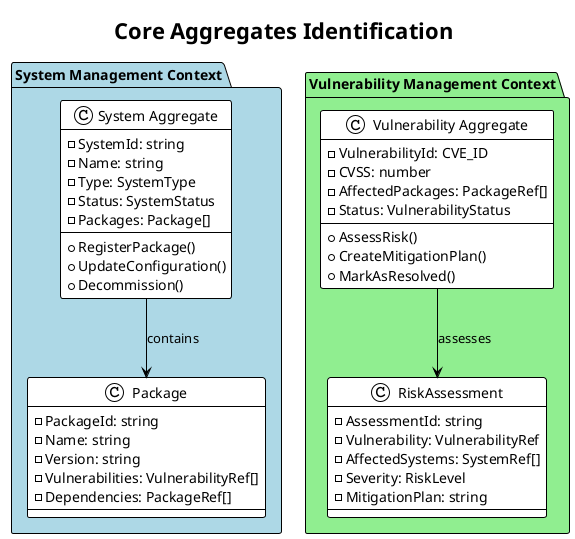
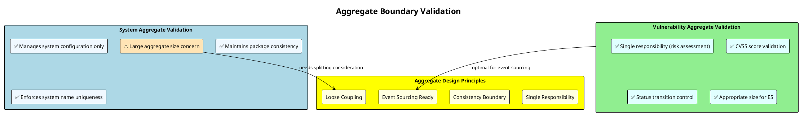
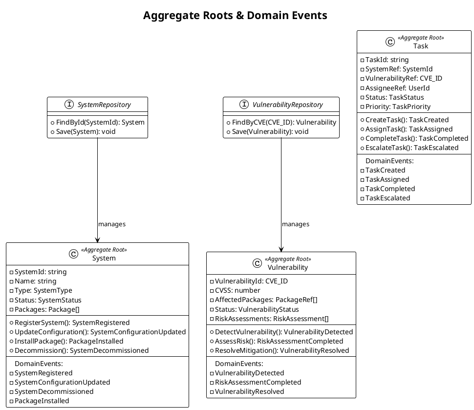
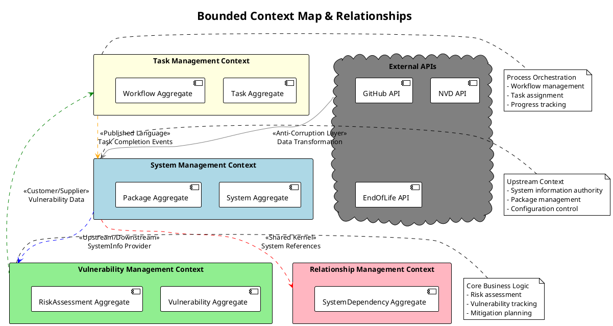
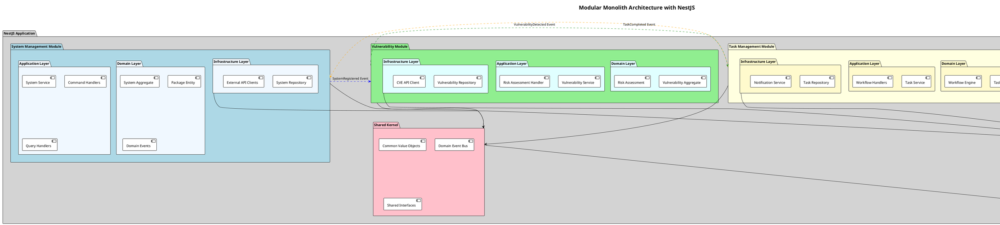
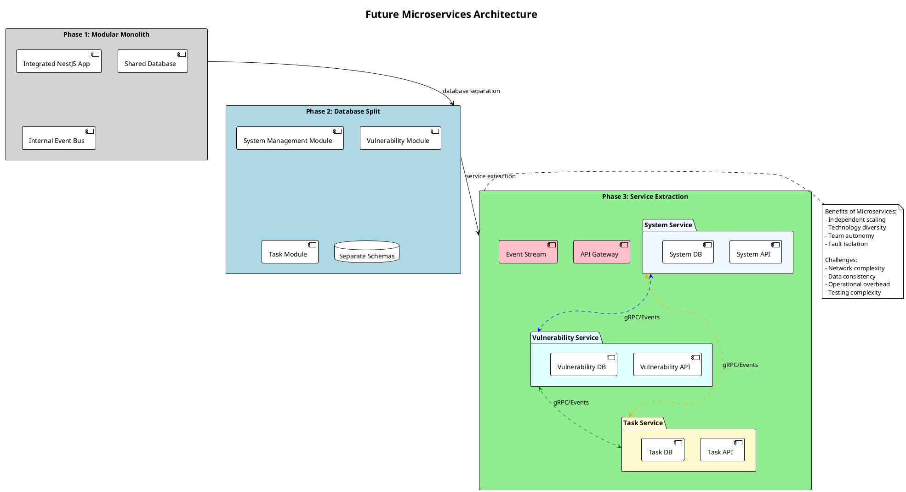
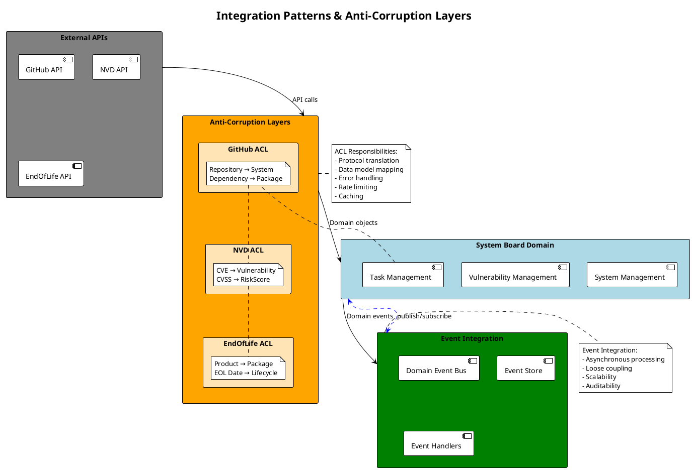

# Phase 4: Aggregates & Bounded Context Discovery ファシリテーションガイド

**Phase目標**: 関連するイベント・コマンド・データをグループ化し、Aggregate境界とBounded Context境界を確定する。オニオンアーキテクチャでの実装設計に落とし込む

**実施期間**: 2025年9月17日（Day 4）
**所要時間**: 4時間
**主担当**: Software Architecture Advisor（アーキテクチャ統合）
**支援**: Database Architect Consultant（データ設計）

---

## 1. 事前準備チェックリスト（30分）

### 1.1 Phase 1-3成果物統合レビュー

- [x] Phase 1: 全ドメインイベントの把握・時系列関係理解
- [x] Phase 2: Commands & Actors、権限マトリックス理解
- [x] Phase 3: Business Rules & Policies、自動化レベル把握
- [x] 4つのBounded Context仮説（System, Task, Vulnerability, Relationship Management）確認

### 1.2 アーキテクチャ観点準備

**Software Architecture Advisor**:

- [x] オニオンアーキテクチャでのレイヤー分離設計方針確立
- [x] DDD Aggregateパターンの設計原則確認
- [x] Event Sourcing実装でのAggregate設計パターン準備
- [x] NestJS + TypeScriptでのモジュール構造検討完了

### 1.3 データ設計観点準備

**Database Architect Consultant**:

- [x] データの責任境界仮説作成
- [x] 強整合性 vs 結果整合性の判定基準確立
- [x] PostgreSQL Read Model設計方針
- [x] Kurrent DB Event Stream設計方針

### 1.4 参画エージェント準備確認

- [x] **Backend System Architect**: NestJS実装パターン、DI設計準備
- [x] **Requirements Analyst**: ビジネス境界・責任範囲確認準備
- [x] **DevOps Pipeline Optimizer**: Context間連携・監視設計準備
- [x] **Database Architect Consultant**: パフォーマンス最適化観点準備

---

## 2. キックオフセッション（15分）

### 2.1 Phase 4目標の明確化

**主担当（Software Architecture Advisor）発言例**:

```text
「Phase 4では、これまでに特定したイベント・コマンド・ルールを
実装可能な設計に落とし込みます。特に重要なのは、
『データの所有者は誰か？』『不変条件は何か？』を明確にして、
実装時に迷いのないAggregate境界を確定することです。」
```

### 2.2 Aggregate vs Bounded Context の区別

**概念整理**:

- **Aggregate**: データの整合性境界、トランザクション境界
- **Bounded Context**: 言語・概念の境界、チーム・サービス境界
- **オニオンアーキテクチャでの位置**:
  - Aggregate = Domain層のEntity群
  - Bounded Context = アプリケーション境界

### 2.3 System Board特有の設計制約

**技術制約（最新決定事項反映）**:

- オニオンアーキテクチャ + DDD + CQRS + Event Sourcing
- モジュラーモノリス → 段階的マイクロサービス展開
- NestJS + TypeScript実装

**ビジネス制約**:

- 階層構造（5層）の整合性維持
- セキュリティ最優先での境界設計
- 外部API連携の制限範囲

---

## 3. Aggregate Design（120分）

### 3.1 Step 1: Core Aggregates 特定（40分）

#### ファシリテーション質問

**Software Architecture Advisor**主導:

**System Management Context Aggregates**:

```text
Q1: システム情報として一貫性を保つべきデータは何ですか？
    -> System Entity (ID, name, type, status, packages[], host)
    -> Host Entity (ID, cpu, memory, disk, scalingHistory[])
    -> Package Entity (ID, version, vulnerabilities[], dependencies[])

Q2: システム変更時に同時に更新されるべきデータは？
    -> システム設定とパッケージリストは同時更新
    -> ホストリソース変更時は容量履歴とシステム状態を同時更新
    -> パッケージと依存関係は密結合

Q3: システムレベルの不変条件は何ですか？
    -> アクティブシステムは必ず1つ以上のパッケージを持つ
    -> 重複するシステム名は許可しない
```

**Vulnerability Management Context Aggregates**:

```text
Q4: 脆弱性情報として一貫性を保つべきデータは何ですか？
    -> Vulnerability Entity (CVE-ID, CVSS, affected_packages[], status)
    -> RiskAssessment Entity (ID, vulnerability, systems[], severity, mitigation_plan)

Q5: 脆弱性評価時に同時に更新されるべきデータは？
    -> 脆弱性情報とリスク評価結果
    -> 影響システムリストと対応優先度

Q6: 脆弱性管理の不変条件は何ですか？
    -> CVSS 9.0以上は必ずUrgentタスクが生成される
    -> 対応完了済み脆弱性は再評価されない
```

#### Aggregate候補PlantUML



### 3.2 Step 2: Aggregate Boundaries Validation（40分）

#### Backend System Architect主導

**Aggregate境界検証質問**:

**単一責任の原則チェック**:

```text
Q7: 各Aggregateは単一の責任を持っていますか？
    -> System Aggregate: システム構成管理のみ
    -> Vulnerability Aggregate: 脆弱性評価のみ
    -> Task Aggregate: タスク実行管理のみ

Q8: 責任が重複している部分はありますか？
    -> システム状態管理 vs タスク状態管理の境界
    -> 脆弱性情報 vs システム影響情報の境界
```

**不変条件の内部保証チェック**:

```text
Q9: 各Aggregateで保証すべき不変条件は何ですか？
    System Aggregate:
    - アクティブシステムは有効なパッケージのみ持つ
    - システム名の一意性

    Vulnerability Aggregate:
    - CVSSスコアは0.0-10.0の範囲内
    - 解決済み脆弱性は再オープンされない

    Task Aggregate:
    - タスクステータスの正当な遷移のみ許可
    - 完了タスクは編集不可
```

**結合度の最小化チェック**:

```text
Q10: Aggregate間の結合度は最小ですか？
     -> IDによる参照のみ（直接オブジェクト参照なし）
     -> ドメインイベント経由での間接連携

Q11: Aggregate間で共有されているデータはありますか？
     -> 共有データは Value Object として分離
     -> 参照整合性はイベント経由で管理
```

#### Aggregate Validation PlantUML



### 3.3 Step 3: Aggregate Root Selection（40分）

#### Database Architect Consultant主導

**Aggregate Root決定質問**:

**外部アクセスポイント特定**:

```text
Q12: 外部からアクセスされる唯一のエンティティは何ですか？
     System Aggregate → System Entity (システム単位でのアクセス)
     Vulnerability Aggregate → Vulnerability Entity (CVE単位でのアクセス)
     Task Aggregate → Task Entity (タスク単位でのアクセス)

Q13: 子エンティティに直接アクセスする必要はありますか？
     -> Package Entity: 必ずSystem経由でアクセス
     -> RiskAssessment Entity: 必ずVulnerability経由でアクセス
```

**ドメインイベント発行責任**:

```text
Q14: ドメインイベントを発行する責任者は誰ですか？
     -> SystemRegistered イベント: System Entity
     -> VulnerabilityDetected イベント: Vulnerability Entity
     -> TaskCompleted イベント: Task Entity

Q15: イベント発行のタイミングは誰が判断しますか？
     -> Aggregate Root が状態変更と同時にイベント発行
```

**不変条件の最終責任**:

```text
Q16: 不変条件を最終的に保証する責任者は誰ですか？
     -> System Entity: システム全体の整合性保証
     -> Vulnerability Entity: リスク評価の妥当性保証
     -> Task Entity: ワークフローの正当性保証
```

#### Aggregate Root PlantUML



---

## 4. Bounded Context Refinement（90分）

### 4.1 Context Mapping（30分）

#### Software Architecture Advisor主導

**Context間関係性分析質問**:

**Shared Kernel特定**:

```text
Q17: 複数Contextで共有される概念は何ですか？
     -> SystemId (全Contextで共通識別子)
     -> CVE_ID (VulnerabilityとTaskで共通)
     -> UserId (認証・タスク割当で共通)

Q18: 共有される概念の変更影響は？
     -> Shared Kernelの変更は全Context影響
     -> 慎重な変更管理が必要
```

**Customer/Supplier関係**:

```text
Q19: データの流れ方向で上流/下流関係はありますか？
     System Management → Vulnerability Management (システム情報提供)
     Vulnerability Management → Task Management (脆弱性情報提供)
     Task Management → System Management (更新結果通知)

Q20: 下流Contextが上流Contextに影響を与えることはありますか？
     -> 基本的には一方向、ただしフィードバックイベントあり
```

**Anti-Corruption Layer必要性**:

```text
Q21: 外部システム連携でのデータ変換が必要ですか？
     -> GitHub API: Repository構造 → System構造変換
     -> NVD API: CVE形式 → Vulnerability形式変換
     -> EndOfLife.date API: LifeCycle情報 → EOL情報変換
```

#### Context Map PlantUML



### 4.2 モジュラーモノリス設計（30分）

#### 4.2.1 Backend System Architect主導

**NestJS Module構造設計質問**:

**Module境界設定**:

```text
Q22: 各ContextをどのようにNestJSモジュールに分割しますか？

/src
  /contexts
    /system-management         # System Management Context
      /domain                 # Domain層
        - system.aggregate.ts
        - package.entity.ts
      /application            # Application層
        - system.service.ts
        - system.handler.ts
      /infrastructure         # Infrastructure層
        - system.repository.ts
      - system.module.ts

    /vulnerability-management  # Vulnerability Management Context
      /domain
        - vulnerability.aggregate.ts
      /application
        - vulnerability.service.ts
      /infrastructure
        - vulnerability.repository.ts
      - vulnerability.module.ts

    /task-management          # Task Management Context
    /relationship-management  # Relationship Management Context

  /shared                     # 共通ドメイン
    - shared-kernel.ts
    - domain-events.ts
```

**Module間通信設計**:

```text
Q23: Module間の通信方法は何にしますか？
     -> ドメインイベント + Event Bus (NestJS CQRS)
     -> 直接的なサービス依存は避ける
     -> 必要に応じて内部API（Query Handlerから）

Q24: トランザクション境界はどう設定しますか？
     -> 各Aggregateが独立したトランザクション境界
     -> Context間の整合性は結果整合性
```

#### モジュラーモノリス PlantUML



### 4.3 将来のマイクロサービス境界確認（30分）

#### DevOps Pipeline Optimizer参画

**サービス切り出し可能性評価**:

**独立データベース検証**:

```text
Q25: 各Contextは独立したデータベースを持てますか？
     System Management: 可能（システム構成データのみ）
     Vulnerability Management: 可能（CVE・リスク評価データ）
     Task Management: 可能（タスク・ワークフローデータ）
     Relationship Management: 可能（依存関係グラフデータ）

Q26: Context間のデータ結合クエリはありますか？
     -> JOIN クエリを避け、イベント駆動での情報同期
     -> Read Model で必要な情報を非正規化
```

**API境界の明確性**:

```text
Q27: 外部公開APIとして切り出し可能ですか？
     -> REST/GraphQL API として境界明確
     -> gRPC での内部サービス間通信も可能

Q28: API versioning の必要性は？
     -> 段階的移行でのバージョン管理必要
```

**運用分離のメリット**:

```text
Q29: 個別にスケールアウトする必要がありますか？
     -> Vulnerability Management: 高頻度スキャン処理
     -> Task Management: ワークフロー処理の独立性

Q30: 個別にデプロイする必要がありますか？
     -> 脆弱性対応の緊急デプロイ
     -> システム管理機能の安定運用
```

#### マイクロサービス移行 PlantUML



---

## 5. Data Consistency Strategy（45分）

### 5.1 強整合性が必要な境界（15分）

#### 5.1.1 Database Architect Consultant主導

**ACID必要性判定**:

```text
Q31: トランザクション内で同時に更新されるべきデータは？
     -> System Aggregate内: システム情報+パッケージリスト
     -> Vulnerability Aggregate内: 脆弱性情報+リスク評価
     -> Task Aggregate内: タスク状態+割当情報

Q32: 部分更新が許可されないデータは？
     -> 会計処理はないため、比較的柔軟
     -> セキュリティ関連の状態遷移は厳密に管理
```

### 5.2 結果整合性で十分な境界（15分）

**Eventually Consistent 設計**:

```text
Q33: 遅延があっても許容できるデータ同期は？
     -> Context間のイベント連携（数秒～数分の遅延許容）
     -> 外部API同期データ（数時間の遅延許容）
     -> レポーティング用データ（日次更新で十分）

Q34: 整合性チェック・修復機能は必要ですか？
     -> 定期的な整合性チェックバッチ処理
     -> 差分検出時の自動修復 or アラート
```

### 5.3 Saga Pattern実装方針（15分）

**Orchestration vs Choreography**:

```text
Q35: 複数Context連携でのSaga実装方針は？
     -> Orchestration採用（保守性重視）
     -> Task Management Contextが Saga Orchestrator
     -> 複雑なワークフローでの中央制御

Q36: Saga失敗時の補償処理は？
     -> Rollback不可の操作（通知送信等）への対応
     -> エラー時の手動介入ポイント
```

#### Data Consistency PlantUML

```plantuml
@startuml DataConsistency
!theme plain
title "Data Consistency Strategy"

rectangle "Strong Consistency (ACID)" as SC #Red {
  rectangle "Within System Aggregate" as SC1 #LightPink {
    note right: System + Packages\nAtomic Update
  }

  rectangle "Within Vulnerability Aggregate" as SC2 #LightPink {
    note right: CVE + Risk Assessment\nSingle Transaction
  }

  rectangle "Within Task Aggregate" as SC3 #LightPink {
    note right: Task State + Assignment\nConsistent State
  }
}

rectangle "Eventual Consistency" as EC #Blue {
  rectangle "Cross-Context Events" as EC1 #LightBlue {
    note right: System → Vulnerability\nEvent-driven sync
  }

  rectangle "External API Sync" as EC2 #LightBlue {
    note right: GitHub/NVD data\nPeriodic sync
  }

  rectangle "Read Models" as EC3 #LightBlue {
    note right: Dashboard views\nProjected data
  }
}

rectangle "Saga Orchestration" as SO #Green {
  rectangle "Vulnerability Response Saga" as SO1 #LightGreen {
    note right: 1. Create Task\n2. Notify Manager\n3. Update System
  }

  rectangle "System Update Saga" as SO2 #LightGreen {
    note right: 1. Validate Change\n2. Apply Update\n3. Verify Health
  }
}

' Flow between consistency levels
SC -[#dashed]-> EC : Domain Events
EC -[#dashed]-> SO : Complex Workflows

@enduml
```

---

## 6. Integration Pattern Design（30分)

### 6.1 Context間イベント連携設計（15分)

#### 6.1.1 DevOps Pipeline Optimizer参画

**イベント連携パターン設計**:

```text
Q37: Context間のイベント配信方法は？
     -> NestJS CQRS EventBus（モジュラーモノリス時）
     -> Apache Kafka/Redis（マイクロサービス時）

Q38: イベントの重複・順序保証は必要ですか？
     -> 冪等性確保（重複処理への対応）
     -> 順序保証はAggregate単位で必要
```

### 6.2 外部API連携のAnti-Corruption Layer（15分）

**外部システム統合設計**:

```text
Q39: 各外部APIのデータ変換方法は？
     GitHub API → GitHub ACL → System Domain Model
     NVD API → NVD ACL → Vulnerability Domain Model
     EndOfLife API → EOL ACL → Lifecycle Domain Model

Q40: API障害時のフォールバック戦略は？
     -> キャッシュデータの活用
     -> 代替データソース
     -> 手動データ入力モード
```

#### Integration Pattern PlantUML



---

## 7. 最終レビュー・合意（45分）

### 7.1 設計整合性確認（20分）

#### 全エージェント参画での確認

**Aggregate設計確認**:

- [x] データの責任境界が明確である
- [x] 不変条件が各Aggregate内で保証される
- [x] Aggregate Root による外部アクセス制御が適切
- [x] Event Sourcing実装に適したAggregate設計

**Bounded Context確認**:

- [x] Context間の連携方法（イベント・API）が定義されている
- [x] 言語・概念の境界が明確で重複がない
- [x] 将来のマイクロサービス展開可能性が評価されている

**技術実装確認**:

- [x] NestJS + オニオンアーキテクチャでの実装が現実的
- [x] モジュラーモノリス → マイクロサービス移行パスが明確
- [x] Event Store DB + PostgreSQL での実装設計が適切

### 7.2 実装フェーズ準備確認（15分）

**次期アクション準備**:

- [ ] NestJS Module構造の詳細設計準備完了
- [ ] Event Sourcing実装パターンの技術調査準備完了
- [ ] Database設計（Event Store + Read Model）準備完了

### 7.3 継続改善方針確認（10分）

**Event Storming Model更新タイミング**:

- [ ] Sprint Review後の要件変更対応
- [ ] 技術制約変更時の設計見直し
- [ ] 運用開始後のフィードバック反映

---

## 8. 成果物作成・保存

### 8.1 最終統合PlantUMLコード

```plantuml
@startuml SystemBoardCompleteArchitecture
!theme plain
title "System Board Complete Domain Architecture"

package "System Management Context" as SMC #LightBlue {
  class "System" as SysAgg <<Aggregate Root>> {
    - SystemId: string
    - Name: string
    - Type: SystemType
    - Status: SystemStatus
    - Packages: Package[]
    --
    + RegisterSystem(): SystemRegistered
    + UpdateConfiguration(): SystemConfigurationUpdated
    + InstallPackage(): PackageInstalled
    + Decommission(): SystemDecommissioned
    --
    Invariants:
    - Active system must have ≥1 package
    - System name must be unique
    - Only valid packages allowed
  }

  class "Package" as Pkg <<Entity>> {
    - PackageId: string
    - Name: string
    - Version: string
    - Vulnerabilities: VulnerabilityRef[]
    - Dependencies: PackageRef[]
  }

  SysAgg *-- Pkg
}

package "Vulnerability Management Context" as VMC #LightGreen {
  class "Vulnerability" as VulnAgg <<Aggregate Root>> {
    - VulnerabilityId: CVE_ID
    - CVSS: number
    - AffectedPackages: PackageRef[]
    - Status: VulnerabilityStatus
    - RiskAssessments: RiskAssessment[]
    --
    + DetectVulnerability(): VulnerabilityDetected
    + AssessRisk(): RiskAssessmentCompleted
    + CreateMitigation(): MitigationPlanCreated
    + ResolveVulnerability(): VulnerabilityResolved
    --
    Invariants:
    - CVSS score must be 0.0-10.0
    - Resolved vulnerabilities cannot reopen
    - CVSS ≥9.0 must create urgent task
  }

  class "RiskAssessment" as RiskAss <<Entity>> {
    - AssessmentId: string
    - Vulnerability: VulnerabilityRef
    - AffectedSystems: SystemRef[]
    - Severity: RiskLevel
    - MitigationPlan: string
    - Status: AssessmentStatus
  }

  VulnAgg *-- RiskAss
}

package "Task Management Context" as TMC #LightYellow {
  class "Task" as TaskAgg <<Aggregate Root>> {
    - TaskId: string
    - SystemRef: SystemId
    - VulnerabilityRef: CVE_ID
    - AssigneeRef: UserId
    - Status: TaskStatus
    - Priority: TaskPriority
    - DueDate: Date
    --
    + CreateTask(): TaskCreated
    + AssignTask(): TaskAssigned
    + StartWork(): TaskStarted
    + CompleteTask(): TaskCompleted
    + EscalateTask(): TaskEscalated
    --
    Invariants:
    - Valid status transitions only
    - Completed tasks are immutable
    - CVSS≥9.0 creates urgent priority
  }

  class "Workflow" as WorkflowAgg <<Aggregate Root>> {
    - WorkflowId: string
    - Tasks: TaskRef[]
    - Rules: WorkflowRule[]
    - Status: WorkflowStatus
    --
    + OrchestrateTasks(): WorkflowStarted
    + HandleTaskCompletion(): WorkflowProgressUpdated
    + CompleteWorkflow(): WorkflowCompleted
  }

  TaskAgg --> WorkflowAgg : orchestrated by
}

package "Relationship Management Context" as RMC #LightPink {
  class "SystemDependency" as DepAgg <<Aggregate Root>> {
    - DependencyId: string
    - SourceSystem: SystemRef
    - TargetSystem: SystemRef
    - DependencyType: DependencyType
    - Strength: DependencyStrength
    --
    + MapDependency(): DependencyMapped
    + AnalyzeImpact(): ImpactAnalysisCompleted
    + UpdateDependency(): DependencyUpdated
  }
}

' Context relationships via Domain Events
SMC -[#blue,dashed]-> VMC : SystemRegistered →\nVulnerabilityScan
VMC -[#green,dashed]-> TMC : VulnerabilityDetected →\nTaskCreation
TMC -[#orange,dashed]-> SMC : TaskCompleted →\nSystemUpdate
SMC -[#red,dashed]-> RMC : SystemUpdate →\nDependencyAnalysis

' External integration points
cloud "External APIs" as ExtAPI #Gray {
  [GitHub API]
  [NVD API]
  [EndOfLife API]
}

rectangle "Anti-Corruption Layers" as ACL #Orange {
  [GitHub ACL]
  [NVD ACL]
  [EOL ACL]
}

ExtAPI --> ACL
ACL --> SMC : system data
ACL --> VMC : vulnerability data

' Shared kernel
package "Shared Kernel" as SK #Pink {
  class "SystemId" as SysId <<Value Object>>
  class "CVE_ID" as CveId <<Value Object>>
  class "UserId" as UId <<Value Object>>
  interface "DomainEvent" as DEvent
  interface "Repository" as Repo <<Infrastructure>>
}

' All contexts use shared kernel
SMC --> SK
VMC --> SK
TMC --> SK
RMC --> SK

' Implementation layers (Onion Architecture)
rectangle "Application Services" as AppServices #LightGray {
  [System Service]
  [Vulnerability Service]
  [Task Service]
  [Command Handlers]
  [Query Handlers]
}

rectangle "Infrastructure" as Infra #LightGray {
  database "Kurrent DB" as ES {
    [Event Streams]
    [Snapshots]
  }

  database "PostgreSQL" as PG {
    [Read Models]
    [Projections]
  }

  [Message Bus]
  [External APIs]
}

AppServices --> SK : uses domain
Infra --> AppServices : supports

note right of SMC
  System Management Context
  - Authoritative system data
  - Package management
  - Configuration control
  - Integration with external APIs
end note

note right of VMC
  Vulnerability Management Context
  - Risk assessment engine
  - CVE data processing
  - Mitigation planning
  - Core business logic
end note

note right of TMC
  Task Management Context
  - Workflow orchestration
  - Task assignment & tracking
  - Escalation management
  - Process automation
end note

note right of RMC
  Relationship Management Context
  - Dependency mapping
  - Impact analysis
  - System relationships
  - Change propagation
end note

@enduml
```

### 8.2 完了条件チェック

- [x] データの責任境界が明確である
- [x] Context間の連携方法（イベント・API）が定義されている
- [x] 技術的実現可能性（NestJS + オニオンアーキテクチャ）が確認されている
- [x] 将来のマイクロサービス展開可能性が評価されている
- [x] Event Sourcing実装で必要なAggregate設計が完了している
- [x] 強整合性 vs 結果整合性の設計方針が明確化されている

### 8.3 実装フェーズ引き継ぎ事項

**Software Architecture Advisor**:

- [x] NestJS Module構造の詳細実装設計
- [x] オニオンアーキテクチャ Layer分離実装
- [x] Domain Event Bus実装パターン

**Backend System Architect**:

- [x] Aggregate実装クラス設計
- [x] Command/Query Handler実装
- [x] Repository Pattern実装（Kurrent + PostgreSQL）

**Database Architect Consultant**:

- [x] Event Store DB schema設計
- [x] PostgreSQL Read Model schema設計
- [x] パフォーマンス最適化実装

---

## 9. ファシリテーター向け注意点

### 9.1 Phase 4特有の進行のコツ

**抽象から具体への落とし込み**:

- ドメインモデルから実装可能な設計への変換
- NestJS実装パターンとの整合性確保
- Event Sourcing制約下での現実的設計

**技術実装との整合性**:

- オニオンアーキテクチャ層分離原則遵守
- DDD Aggregate設計パターン適用
- CQRS + Event Sourcingベストプラクティス適用

### 9.2 よくある課題と対処法

**課題1: Aggregate境界の曖昧さ**:

```text
明確な判定基準適用:
- トランザクション境界 = Aggregate境界
- 不変条件の責任範囲 = Aggregate境界
- 外部アクセス単位 = Aggregate Root
```

**課題2: Context境界の重複**:

```text
責任分離原則での解決:
- データ所有権の明確化
- 言語・概念の重複排除
- チーム・サービス境界との整合
```

**課題3: 実装複雑性への懸念**:

```text
段階的実装での対応:
- MVP優先の機能選択
- モジュラーモノリス → マイクロサービス段階展開
- 継続的リファクタリング前提
```

### 9.3 成功のポイント

- **実装指向設計**: 理論より実装可能性を重視
- **段階的進化**: 完璧を求めず継続改善前提
- **技術制約考慮**: NestJS + TypeScript実装制約内での設計
- **Event Sourcing Ready**: 将来のEvent Sourcing実装に備えた設計

---

**作成日**: 2025年9月13日
**作成者**: Requirements Analyst
**対象**: Phase 4 Aggregates & Bounded Context Discovery ファシリテーター
**次期更新**: Phase 4実施後のフィードバック反映
