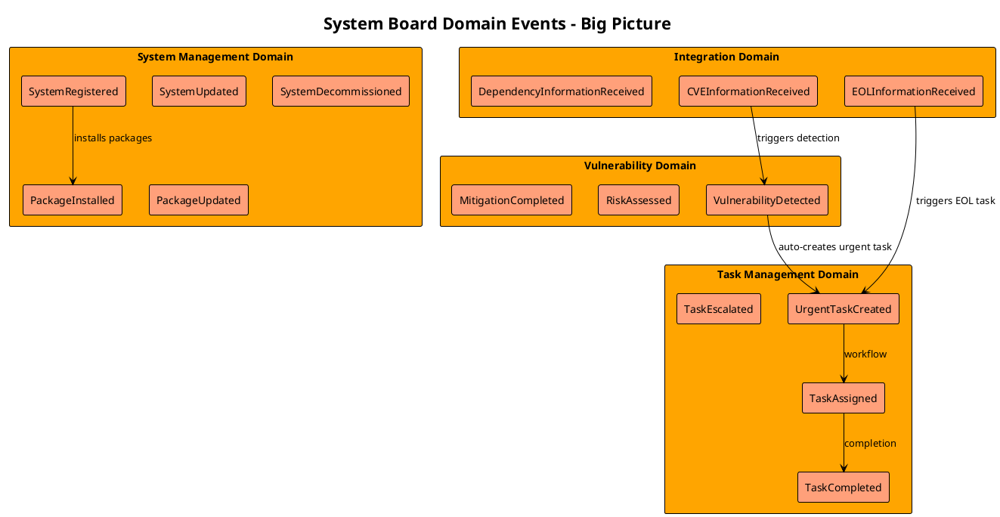
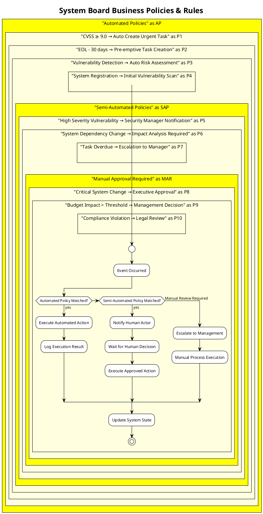
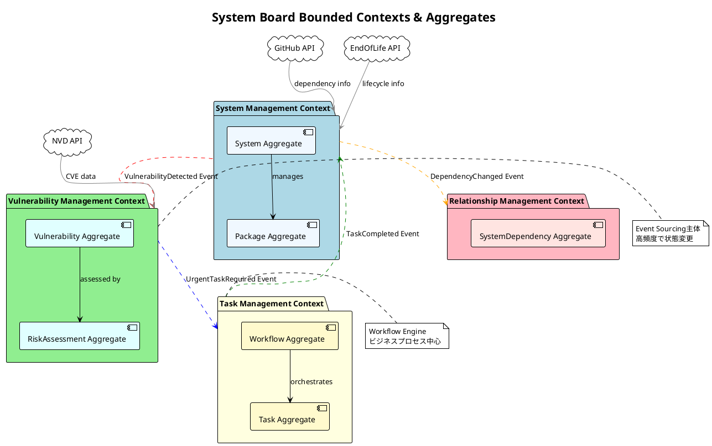

# System Board Event Stormingワークショップ進行計画書

**バージョン**: 1.0
**作成日**: 2025年9月13日
**作成者**: 要件分析エージェント
**対象プロジェクト**: System Board - IT管理システム

---

## 1. ワークショップ概要

### 1.1 目的

System Boardプロジェクトにおけるドメイン知識の共有と技術実装の境界を明確化し、オニオンアーキテクチャ + DDD + CQRS + Event Sourcingの設計基盤を確立する。

### 1.2 期間・構成

- **総所要時間**: 4日間（各Phase 1日、各Phase 3-4時間）
- **実施間隔**: 2025-09-14より毎日実施。2025-09-17完了予定
- **形式**: AI主導Event Storming（PlantUML可視化）
- **成果物**: 段階的に蓄積されるドメイン設計ドキュメント

### 1.3 System Board特有の考慮点

ITシステム管理ドメインの特殊性を踏まえた設計要件：

- **階層構造管理**: ホスト→OS→ミドルウェア→フレームワーク→パッケージの5層構造
- **セキュリティ最優先**: 情報漏洩防止を最重要視する製造業要件
- **関係性の複雑性**: システム間依存関係のグラフ構造と影響範囲分析
- **ライフサイクル管理**: EOL・脆弱性の継続的追跡管理
- **外部連携制約**: GitHub、NVD、EndOfLife.date API以外の自動連携は行わない

---

## 2. 技術制約の反映

### 2.1 アーキテクチャ制約

最新の技術決定事項（2025年9月13日会議決定）を反映：

**採用技術**:

- **アーキテクチャ**: オニオンアーキテクチャ（ヘキサゴナルから変更）
- **実装戦略**: モジュラーモノリス → 段階的マイクロサービス展開
- **バックエンド**: NestJS + TypeScript
- **データ**: PostgreSQL + Kurrent DB + Redis
- **監視**: Prometheus + Grafana + Loki（ELKから変更）

### 2.2 Bounded Context境界（事前想定）

4つの主要境界を前提としてEvent Stormingを進行：

1. **System Management Context**: システム・パッケージ管理
2. **Task Management Context**: タスク・ワークフロー管理
3. **Vulnerability Management Context**: 脆弱性・評価管理
4. **Relationship Management Context**: 依存関係・影響範囲管理

### 2.3 Event Sourcing考慮事項

- **イベント粒度**: ドメインイベントは業務的意味を持つ単位
- **コマンド設計**: 不変条件と業務ルールを含んだ検証
- **読み取りモデル**: CQRS Query側でのUI最適化された投影

---

## 3. 参画エージェント・役割分担

### 3.1 必須参画エージェント（全Phase）

| エージェント | 主要責任 | 具体的役割 |
|------------|----------|-----------|
| **Requirements Analyst** | ファシリテーター、ドメインエキスパート代行 | ワークショップ進行、ビジネス要件からのイベント抽出、ステークホルダー視点提供 |
| **Software Architecture Advisor** | 技術リード、アーキテクチャ統合 | システム境界定義、オニオンアーキテクチャ適用、技術制約チェック |
| **Backend System Architect** | 実装検討、技術的実現可能性 | NestJS実装観点、Event Sourcing設計、パフォーマンス考慮 |
| **UX Design Optimizer** | ユーザー体験、業務フロー最適化 | エンドユーザー視点での業務効率化、UIからの逆算設計 |

### 3.2 Phase別支援エージェント

| Phase | 参画エージェント | 参画理由 |
|-------|----------------|----------|
| **Phase 2**: Commands & Actors | Cybersecurity Advisor | セキュリティ関連コマンドの特定、認証・認可要件 |
| **Phase 3**: Policies & Business Rules | QA Testing Specialist | テスト可能な業務ルール定義、例外処理設計 |
| **Phase 3**: Policies & Business Rules | DevOps Pipeline Optimizer | 自動化可能ポリシーの特定、運用監視要件 |
| **Phase 4**: Aggregates & Bounded Context | Database Architect Consultant | データ境界設計、パフォーマンス最適化 |

---

## 4. フェーズ別詳細計画

## Phase 1: Domain Events Discovery（第1日）

### 4.1 Phase目標

製造業ITシステム管理ドメインで発生する**全ての重要なビジネスイベント**を特定し、時系列で整理する。

### 4.2 事前準備（30分）

**Required Analyst**:

1. ビジネス要件ドキュメント（business-requirement.md）の6.1章を元にした主要イベント候補リスト作成
2. System Board階層構造（ホスト→OS→ミドルウェア→フレームワーク→パッケージ）での各レベルイベントの洗い出し

### 4.3 実施手順（3.5時間）

#### 4.3.1 キックオフ（15分）

- **目標共有**: 「System Boardドメインで何が起こるか」の完全な可視化
- **制約確認**: 外部連携範囲（GitHub/NVD/EndOfLife.date API）の明確化

#### 4.3.2 Big Picture Event Storming（120分）

**ファシリテーター（Requirements Analyst）主導**:

**Step 1: Core Events抽出（40分）**:

```text
「System Boardで最も重要な出来事は何ですか？」
- システム登録時、脆弱性発見時、EOL検知時...
- 外部API連携時のイベント
- ユーザーアクション結果のイベント
```

**Step 2: Lifecycle Events抽出（40分）**:

```text
「各システム構成要素のライフサイクルで何が起こりますか？」
- ホストレベル: HostRegistered, HostDecommissioned
- OSレベル: OSInstalled, OSUpdated, OSEOLReached
- パッケージレベル: PackageInstalled, VulnerabilityDetected
```

**Step 3: Integration Events抽出（40分）**:

```text
「外部システムとの連携で何が起こりますか？」
- GitHub API: DependencyInformationReceived
- NVD API: CVEInformationReceived
- EndOfLife API: EOLDateUpdated
```

#### 4.3.3 Temporal Ordering（45分）

**Software Architecture Advisor**主導で時系列整理:

- 依存関係の時系列マップ作成
- 同時発生イベントの特定
- 因果関係の明確化

#### 4.3.4 Hotspots & Pain Points特定（30分）

**UX Design Optimizer**主導:

- ユーザー体験上の課題イベント特定
- 複雑な業務フローの可視化
- 自動化が期待されるイベント特定

#### 4.3.5 レビュー・合意（30分）

全エージェントでの内容確認と合意形成

### 4.4 成果物

**ファイル**: `/docs/event-storming/phase1-domain-events.md`

**PlantUML形式**:



### 4.5 完了条件・品質ゲート

- [ ] 全ての主要ビジネスイベントが過去形で命名されている
- [ ] 4つのBounded Context（System, Task, Vulnerability, Relationship）の主要イベントが特定されている
- [ ] イベント間の時系列関係が明確である
- [ ] 外部システム連携イベントが適切に分離されている
- [ ] PlantUMLコードが正常にレンダリングされる

---

## Phase 2: Commands & Actors Discovery（第2日）

### 4.6 Phase目標

Phase 1で特定したドメインイベントを引き起こす**コマンド**と**アクター**を特定し、責任範囲を明確化する。

### 4.7 事前準備（30分）

**Backend System Architect**:

1. Phase 1成果物レビュー
2. NestJSでのコマンドハンドラー実装パターン検討
3. 認証・認可が必要なコマンドの事前特定

### 4.8 実施手順（3.5時間）

#### 4.8.1 キックオフ（15分）

- Phase 1成果物レビュー
- 「イベントの原因は何か？」の焦点共有

#### 4.8.2 Command Discovery（90分）

**Requirements Analyst**主導:

**Step 1: User Commands（30分）**:

```text
「システム担当者・管理者が実行するアクション」
- RegisterSystem, UpdateSystemConfiguration
- AssignTask, UpdateTaskStatus
- AssessRisk, ApproveMitigation
```

**Step 2: System Commands（30分）**:

```text
「システムが自動実行するアクション」
- ScanVulnerabilities, UpdateEOLStatus
- CreateUrgentTask, EscalateTask
- SynchronizeWithExternalAPI
```

**Step 3: External Commands（30分）**:

```text
「外部システムからトリガーされるアクション」
- ReceiveCVEUpdate, ProcessDependencyChange
- TriggerScheduledScan, ProcessWebhookEvent
```

#### 4.8.3 Actor Identification（60分）

**UX Design Optimizer + Cybersecurity Advisor**共同主導:

**Human Actors**:

- 情報システム担当者（日常運用）
- 情報システム管理者（意思決定・承認）
- 経営陣（状況把握・最終承認）

**System Actors**:

- 脆弱性スキャナー（CVE情報取得・分析）
- タスク管理エンジン（自動タスク生成・エスカレーション）
- 通知システム（Microsoft Teams連携）

**External Actors**:

- GitHub API
- NVD (National Vulnerability Database)
- EndOfLife.date API

#### 4.8.4 Permission & Authorization Design（45分）

**Cybersecurity Advisor**主導:

- Role-Based Access Control (RBAC)設計
- OAuth2.0 + JWT実装要件
- 監査ログ要件の整理

#### 4.8.5 Command Validation Rules（30分）

**Backend System Architect**主導:

- 各コマンドの事前条件・事後条件
- ビジネスルール検証ポイント
- エラーハンドリング方針

#### 4.8.6 レビュー・合意（30分）

### 4.9 成果物

**ファイル**: `/docs/event-storming/phase2-commands-actors.md`

**PlantUMLユースケース図形式**:

```plantuml
@startuml SystemBoardCommandsActors
!theme plain
title "System Board Commands & Actors"

' Human Actors
actor "System Administrator" as Admin #LightGreen
actor "Security Manager" as SecMgr #LightGreen
actor "Executive" as Exec #LightGreen

' System Actors
actor "CVE Scanner" as Scanner #LightGreen
actor "Task Engine" as TaskEngine #LightGreen
actor "Notification System" as NotifySystem #LightGreen

' External Actors
actor "GitHub API" as GitHub #LightGreen
actor "NVD API" as NVD #LightGreen
actor "EndOfLife API" as EOL #LightGreen

' Commands grouped by context
rectangle "System Management Commands" as SMC #LightBlue {
  usecase "RegisterSystem" as UC1 #AliceBlue
  usecase "UpdateSystemConfiguration" as UC2 #AliceBlue
  usecase "DecommissionSystem" as UC3 #AliceBlue
}

rectangle "Task Management Commands" as TMC #LightBlue {
  usecase "CreateTask" as UC4 #AliceBlue
  usecase "AssignTask" as UC5 #AliceBlue
  usecase "UpdateTaskStatus" as UC6 #AliceBlue
  usecase "EscalateTask" as UC7 #AliceBlue
}

rectangle "Vulnerability Commands" as VC #LightBlue {
  usecase "ScanVulnerabilities" as UC8 #AliceBlue
  usecase "AssessRisk" as UC9 #AliceBlue
  usecase "ApproveMitigation" as UC10 #AliceBlue
}

' Actor-Command relationships
Admin --> UC1
Admin --> UC2
Admin --> UC6
SecMgr --> UC5
SecMgr --> UC9
SecMgr --> UC10
Exec --> UC10 : critical approvals

Scanner --> UC8
TaskEngine --> UC4
TaskEngine --> UC7
GitHub --> UC2 : dependency updates
NVD --> UC8 : CVE data
EOL --> UC4 : EOL notifications

@enduml
```



### 4.10 完了条件・品質ゲート

- [ ] 全てのドメインイベントにトリガーとなるコマンドが定義されている
- [ ] アクターが適切に分類されている（人間/システム/外部）
- [ ] 権限・認証要件が各コマンドに定義されている
- [ ] セキュリティ関連コマンドが適切に特定・保護されている

---

## Phase 3: Policies & Business Rules Discovery（第3日）

### 4.11 Phase目標

システムの**ビジネスルール**と**ポリシー**を特定し、自動化できるルールと人間の判断が必要なルールを区別する。

### 4.12 事前準備（30分）

**QA Testing Specialist + DevOps Pipeline Optimizer**:

1. Phase 2成果物レビュー
2. テスト可能な形でのルール表現方法検討
3. 自動化候補ポリシーの事前特定

### 4.13 実施手順（3.5時間）

#### 4.13.1 キックオフ（15分）

- 「いつ、何を、どのように自動化するか」の焦点共有

#### 4.13.2 Critical Business Rules Discovery（90分）

**Requirements Analyst**主導、ビジネス要件書の6.3章を詳細化:

**Step 1: 緊急対応ルール（30分）**:

```text
- CVSS 9.0以上の脆弱性 → 3日以内の対応必須
- EOL30日前 → 事前対応タスク自動生成
- 高重大度脆弱性 → Microsoft Teams即時通知
```

**Step 2: システム管理ルール（30分）**:

```text
- システム間依存関係有り → 影響範囲分析必須実施
- パッケージ更新 → 単体テスト実行必須
- システム登録 → 初回脆弱性スキャン自動実行
```

**Step 3: コンプライアンス・監査ルール（30分）**:

```text
- 全操作 → 監査ログ記録、5年間保持必須
- 機密レベル変更 → セキュリティ管理者承認必須
- 外部API連携エラー → 24時間以内復旧アクション
```

#### 4.13.3 Automated vs Manual Policy Classification（60分）

**DevOps Pipeline Optimizer**主導:

**完全自動化可能（60%）**:

- 脆弱性スキャン結果の重要度判定
- EOL日程に基づくタスク自動生成
- 定期的なシステム状態チェック

**半自動化（人間確認必要）（30%）**:

- 高重大度脆弱性の対応方針決定
- システム間依存関係の影響範囲評価
- 緊急時のエスカレーション判断

**手動対応必須（10%）**:

- 経営判断を要する投資決定
- 複雑なシステム構成変更の承認
- 法的・規制要件への対応方針

#### 4.13.4 Exception Handling & Error Policies（45分）

**QA Testing Specialist**主導:

```text
「外部API連携失敗時の対応ポリシー」
「データ不整合検出時の復旧手順」
「システム障害時の業務継続ポリシー」
```

#### 4.13.5 Policy Implementation Design（30分）

**Software Architecture Advisor**主導:

- ポリシーエンジンの実装方針
- ルールの外部設定化方針
- ポリシー変更時の影響最小化

#### 4.13.6 レビュー・合意（30分）

### 4.14 成果物

**ファイル**: `/docs/event-storming/phase3-policies-rules.md`

**Business Rules Matrix + PlantUMLアクティビティ図**:



### 4.15 完了条件・品質ゲート

- [ ] ビジネスルールが「If-Then」形式で明確に記述されている
- [ ] 例外処理・エラーケースが考慮されている
- [ ] 自動化可能性が評価され、3段階（自動/半自動/手動）に分類されている
- [ ] テスト可能な形でポリシーが表現されている

---

## Phase 4: Aggregates & Bounded Context Discovery（第4日）

### 4.16 Phase目標

関連するイベント・コマンド・データをグループ化し、**Aggregate境界**と**Bounded Context境界**を確定する。オニオンアーキテクチャでの実装設計に落とし込む。

### 4.17 事前準備（30分）

**Software Architecture Advisor + Database Architect Consultant**:

1. Phase 1-3成果物の統合レビュー
2. データの責任境界仮説作成
3. NestJS + オニオンアーキテクチャでのモジュール構造検討

### 4.18 実施手順（4時間）

#### 4.18.1 キックオフ（15分）

- 4つのContext境界仮説の確認
- 「データの所有者は誰か」の焦点共有

#### 4.18.2 Aggregate Design（120分）

**Software Architecture Advisor**主導:

**Step 1: Core Aggregates特定（40分）**:

```text
System Management Context:
- System Aggregate (SystemId, configuration, packages[])
- Package Aggregate (PackageId, version, vulnerabilities[])

Vulnerability Management Context:
- Vulnerability Aggregate (VulnerabilityId, severity, systems[])
- RiskAssessment Aggregate (AssessmentId, vulnerability, mitigation)

Task Management Context:
- Task Aggregate (TaskId, system, assignee, status)
- Workflow Aggregate (WorkflowId, tasks[], rules[])

Relationship Management Context:
- SystemDependency Aggregate (DependencyId, source, target, type)
```

**Step 2: Aggregate Boundaries Validation（40分）**:

```text
各Aggregateで以下をチェック:
- 単一の責任を持っているか？
- 不変条件を内部で保証できるか？
- 他のAggregateとの結合度は最小か？
- Event Sourcingでの再生が可能か？
```

**Step 3: Aggregate Root Selection（40分）**:

```text
各AggregateでRoot Entityを特定:
- 外部からのアクセスポイント
- ドメインイベント発行責任
- 不変条件の最終責任者
```

#### 4.18.3 Bounded Context Refinement（90分）

**Backend System Architect**主導:

**Step 1: Context Mapping（30分）**:

```text
Context間の関係性を以下で分類:
- Shared Kernel: 共通ドメイン概念
- Customer/Supplier: 上流/下游関係
- Anti-Corruption Layer: 外部システム連携層
```

**Step 2: モジュラーモノリス設計（30分）**:

```text
NestJSでの実装構造:
/src
  /contexts
    /system-management (SystemModule)
    /vulnerability-management (VulnerabilityModule)
    /task-management (TaskModule)
    /relationship-management (RelationshipModule)
  /shared (共通ドメイン)
```

**Step 3: 将来のマイクロサービス境界確認（30分）**:

```text
各ContextのService切り出し可能性:
- 独立したデータベース持ち可能か
- API境界が明確か
- 運用上分離するメリットがあるか
```

#### 4.18.4 Data Consistency Strategy（45分）

**Database Architect Consultant**主導:

**強整合性が必要な境界**:

- System Aggregate内でのpackage整合性
- Task Aggregate内での状態遷移整合性

**結果整合性で十分な境界**:

- Context間のイベント連携
- 外部システム連携のデータ同期

#### 4.18.5 Integration Pattern Design（30分）

**DevOps Pipeline Optimizer**参画:

- Context間のイベント連携設計
- 外部API連携のAnti-Corruption Layer設計
- 監視・ロギングの設計方針

#### 4.18.6 最終レビュー・合意（45分）

全エージェント参画での設計確認と合意形成

### 4.19 成果物

**ファイル**: `/docs/event-storming/phase4-aggregates-contexts.md`

**PlantUMLコンポーネント図形式**:



### 4.20 完了条件・品質ゲート

- [ ] データの責任境界が明確である
- [ ] Context間の連携方法（イベント・API）が定義されている
- [ ] 技術的実現可能性（NestJS + オニオンアーキテクチャ）が確認されている
- [ ] 将来のマイクロサービス展開可能性が評価されている
- [ ] Event Sourcing実装で必要なAggregate設計が完了している

---

## 5. ファシリテーション戦略

### 5.1 AI主導Event Stormingの特徴

**従来の物理ワークショップとの違い**:

- 付箋紙 → PlantUMLコード即時生成
- 物理的制約なし → 無制限な情報整理
- 手書きメモ → 構造化されたMarkdownドキュメント
- 会議室 → 非同期でのコラボレーション可能

### 5.2 各Phase共通の進行技法

#### 5.2.1 Divergent Thinking（発散思考）段階

- **ブレインストーミング優先**: 批判・評価を行わず、量的発想を重視
- **「なぜ？」を5回**: 根本原因・本質的要求の掘り下げ
- **異なる視点の強制**: 各エージェントの専門性を活かした多角的検討

#### 5.2.2 Convergent Thinking（収束思考）段階

- **グルーピング**: 類似概念のまとめ、重複排除
- **優先順位付け**: ビジネス価値・技術的実現可能性での重要度評価
- **合意形成**: 全エージェント視点での最終確認

### 5.3 PlantUML即時可視化戦略

各Phaseで以下の可視化ルール適用:

**色分け標準**:

- オレンジ系: Domain Events（ビジネスで起こる出来事）
- 青系: Commands（システムへの指示・操作）
- 緑系: Actors（人間・システム・外部API）
- 黄系: Policies/Rules（ビジネスルール・制約）
- 紫系: Read Models（Query側データ表現）

**図表の即座更新**:

- ワークショップ中にリアルタイムでPlantUMLコード更新
- GitHubでの図表レンダリング確認
- 誤解・不整合の即座修正

### 5.4 品質保証戦略

#### 5.4.1 各Phase終了時のQuality Gate

- 完了条件の全項目チェック
- 次Phaseへの引き継ぎ事項整理
- 懸念事項・リスクの明確化

#### 5.4.2 継続的改善

- 各Phaseでの学習内容を次Phaseに反映
- ステークホルダー要求変更への柔軟な対応
- 技術的制約変更時のドキュメント更新

---

## 6. 成果物統合・次期アクション

### 6.1 Event Storming完了後の統合成果物

**統合ドキュメント**: `/docs/event-storming/complete-domain-model.md`

- 4 Phase全ての成果を統合したドメインモデル
- オニオンアーキテクチャでの実装指針
- Event Sourcing実装のためのイベント・コマンド・Aggregate設計

### 6.2 実装フェーズへの引き継ぎ

**Software Architecture Advisor**:

- [ ] NestJS実装構造の詳細設計
- [ ] Event Sourcing実装パターンの技術調査
- [ ] モジュラーモノリスでのDI設計

**Backend System Architect**:

- [ ] Aggregate実装クラス設計
- [ ] Command/Query Handler実装方針
- [ ] Repository Pattern実装設計

**Database Architect Consultant**:

- [ ] Kurrent DB設計・構築
- [ ] Read Model Database設計
- [ ] パフォーマンス最適化方針

### 6.3 継続的改善・見直しタイミング

**Sprint Review後**:

- 新たな要求・課題発見時のEvent Stormingモデル更新
- ユーザーフィードバックを踏まえたイベント・ルール見直し

**アーキテクチャ変更時**:

- 技術的制約変更時のBounded Context境界見直し
- パフォーマンス課題発見時のAggregate再設計

**ビジネス要求変更時**:

- ステークホルダーからの新要求時のドメインイベント追加
- 規制・法的要件変更時のポリシー・ルール更新

---

## 7. リスク管理・想定課題

### 7.1 高リスク項目

| リスク | 影響度 | 発生確率 | 対応策 |
|--------|--------|----------|--------|
| **ドメイン知識の不足** | 高 | 中 | ビジネス要件書の詳細化、外部専門家コンサルテーション |
| **Context境界設計の誤り** | 高 | 中 | 段階的実装での検証、継続的な境界見直し |
| **Event Sourcing設計の複雑性** | 中 | 高 | シンプルなイベント設計、段階的な機能追加 |
| **PlantUML可視化の限界** | 低 | 中 | 複数図表での補完、テキスト説明の併用 |

### 7.2 対応戦略

**複雑性管理**:

- 各Phaseでのスコープ限定、MVP優先の検討
- 「完璧を求めず、継続的改善」の方針徹底

**品質保証**:

- 各Phase完了時の必須チェックリスト適用
- 他エージェント視点での相互レビュー実施

**知識共有**:

- 共有メモリファイルでの知識蓄積
- Event Stormingドキュメントでの設計決定理由明記

---

## 8. 承認・次期計画

### 8.1 本計画書の承認

| 役職 | エージェント名 | 承認日 |
|------|----------------|--------|
| プロダクトマネージャー | Requirements Analyst | 2025年9月13日 |
| 技術リード | Software Architecture Advisor |  |
| 実装責任者 | Backend System Architect |  |

### 8.2 実施スケジュール

| Day | Phase | 主担当 | 期間 |
|------|-------|--------|------|
| Day 1 | Phase 1: Domain Events Discovery | Requirements Analyst | 2025年9月14日 |
| Day 2 | Phase 2: Commands & Actors Discovery | Backend System Architect | 2025年9月15日 |
| Day 3 | Phase 3: Policies & Business Rules Discovery | QA Testing Specialist | 2025年9月16日 |
| Day 4 | Phase 4: Aggregates & Bounded Context Discovery | Software Architecture Advisor | 2025年9月17日 |

### 8.3 成功指標

**品質指標**:

- 各Phase完了条件100%達成
- PlantUML図表の正常レンダリング100%
- 全エージェントの設計合意100%

**実装連携指標**:

- Event Storming → 実装設計への引き継ぎ完了率100%
- 設計ドキュメント活用率（実装フェーズでの参照頻度）90%以上

---

**文書管理**:

- 最新版保管場所: `/workspaces/system-board/docs/event-storming/workshop-plan.md`
- 更新履歴: Git版数管理
- 関連文書: Event Stormingメソッド、各Phase成果物

---

**本計画書作成**: 2025年9月13日
**作成者**: Requirements Analyst
**プロジェクト**: System Board Event Stormingワークショップ
