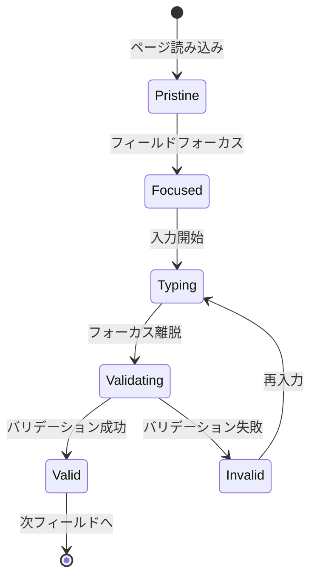

# US-SM-001-005: フロントエンド画面設計 - システム登録フォーム

**担当**: UX/UIデザイナー
**作成日**: 2025-09-30
**Issue**: #124
**親Issue**: #34 (US-SM-001: システム新規登録)
**見積**: 30分
**依存**: ux-ui-design-concept.md, design-system-components.md, US-SM-001.md

---

## 1. 画面概要

### 1.1 画面目的

IT管理者が新しいシステム情報を登録するための入力フォーム画面。システムの基本情報、ホスト構成、セキュリティ分類を一括入力し、管理対象システムとして登録する。

### 1.2 対象ユーザー

- **プライマリ**: IT部門のシステム管理者（30-50代、中級ITリテラシー）
- **セカンダリ**: セキュリティ担当者、プロジェクトマネージャー

### 1.3 アクセス権限

- RBAC: `system:create` 権限を持つユーザーのみアクセス可能
- 最小権限原則に基づくアクセス制御

---

## 2. ワイヤーフレーム設計

### 2.1 レイアウト構造

```text
┌─────────────────────────────────────────────────────────────────┐
│ ヘッダー: システム管理 > 新規登録                                  │
├─────────────────────────────────────────────────────────────────┤
│                                                                 │
│  ┌──────────────────────────────────────────────────────────┐  │
│  │ 📋 システム新規登録                                         │  │
│  │                                                           │  │
│  │ ▼ 基本情報                                                 │  │
│  │ ┌───────────────────────────────────────────────────┐     │  │
│  │ │ システム名 *                                        │     │  │
│  │ │ [___________________________________________]       │     │  │
│  │ │                                                     │     │  │
│  │ │ システム種別 *                                      │     │  │
│  │ │ [ Webアプリケーション ▼ ]                           │     │  │
│  │ │                                                     │     │  │
│  │ │ 説明                                                │     │  │
│  │ │ [___________________________________________]       │     │  │
│  │ │ [___________________________________________]       │     │  │
│  │ └───────────────────────────────────────────────────┘     │  │
│  │                                                           │  │
│  │ ▼ ホスト構成                                               │  │
│  │ ┌───────────────────────────────────────────────────┐     │  │
│  │ │ CPUコア数 *        メモリ(GB) *      ストレージ(GB) * │     │  │
│  │ │ [_____]           [_____]           [________]      │     │  │
│  │ │                                                     │     │  │
│  │ │ オペレーティングシステム        バージョン           │     │  │
│  │ │ [________________]            [__________]          │     │  │
│  │ │                                                     │     │  │
│  │ │ ☑ ディスク暗号化を有効にする                         │     │  │
│  │ └───────────────────────────────────────────────────┘     │  │
│  │                                                           │  │
│  │ ▼ セキュリティ分類                                         │  │
│  │ ┌───────────────────────────────────────────────────┐     │  │
│  │ │ セキュリティレベル *                                │     │  │
│  │ │ ( ) PUBLIC    ( ) INTERNAL                          │     │  │
│  │ │ (•) CONFIDENTIAL    ( ) RESTRICTED                  │     │  │
│  │ │                                                     │     │  │
│  │ │ 重要度 *                                            │     │  │
│  │ │ ( ) LOW    ( ) MEDIUM    (•) HIGH    ( ) CRITICAL  │     │  │
│  │ └───────────────────────────────────────────────────┘     │  │
│  │                                                           │  │
│  │ ▼ 初期パッケージ（オプション）                               │  │
│  │ ┌───────────────────────────────────────────────────┐     │  │
│  │ │ [+ パッケージを追加]                                │     │  │
│  │ │                                                     │     │  │
│  │ │ [ 追加済みパッケージリスト表示エリア ]                │     │  │
│  │ └───────────────────────────────────────────────────┘     │  │
│  │                                                           │  │
│  │ ┌───────────────────────────────────────────────────┐     │  │
│  │ │                                                     │     │  │
│  │ │       [キャンセル]        [登録する →]              │     │  │
│  │ │                                                     │     │  │
│  │ └───────────────────────────────────────────────────┘     │  │
│  └──────────────────────────────────────────────────────────┘  │
│                                                                 │
└─────────────────────────────────────────────────────────────────┘

* = 必須項目
```

### 2.2 レスポンシブブレイクポイント

**デスクトップ（1280px以上）**:

- 2カラムレイアウト（ラベル：入力フィールド）
- 最大幅: 1024px（中央配置）

**タブレット（768px - 1279px）**:

- 1カラムレイアウト
- ラベルと入力フィールドを縦積み

**モバイル（768px未満）**:

- 閲覧のみサポート（編集不可）
- 警告メッセージ表示: "デスクトップ環境での操作を推奨します"

---

## 3. コンポーネント仕様

### 3.1 ページヘッダー

```typescript
<Breadcrumb
  items={[
    { label: 'システム管理', href: '/systems' },
    { label: '新規登録', current: true }
  ]}
/>

<Stack gap="md" className="mb-8">
  <h1 className="text-4xl font-bold text-slate-900">
    システム新規登録
  </h1>
  <p className="text-base text-slate-600">
    新しいシステムを管理対象として登録します。必須項目（*）をすべて入力してください。
  </p>
</Stack>
```

**デザイントークン適用**:

- ヘッダーフォントサイズ: `text-4xl` (36px)
- セカンダリテキスト: `text-slate-600`
- 間隔: `gap-md` (16px)

### 3.2 フォームセクション構造

#### 3.2.1 基本情報セクション

```typescript
<Card variant="default" padding="lg">
  <CardHeader>
    <CardTitle>基本情報</CardTitle>
  </CardHeader>

  <CardContent>
    <Stack gap="lg">
      {/* システム名 */}
      <Input
        label="システム名"
        type="text"
        placeholder="例: web-frontend-production"
        required={true}
        error={errors.name}
        value={formData.name}
        onChange={(value) => handleFieldChange('name', value)}
        icon={<SystemIcon />}
        size="md"
      />

      {/* システム種別 */}
      <Select
        label="システム種別"
        required={true}
        error={errors.type}
        value={formData.type}
        onChange={(value) => handleFieldChange('type', value)}
        options={[
          { value: 'WEB', label: 'Webアプリケーション' },
          { value: 'API', label: 'APIサーバー' },
          { value: 'DATABASE', label: 'データベース' },
          { value: 'BATCH', label: 'バッチ処理' },
          { value: 'OTHER', label: 'その他' }
        ]}
      />

      {/* 説明（オプション） */}
      <Textarea
        label="説明"
        placeholder="システムの目的や概要を入力（任意）"
        rows={3}
        value={formData.description}
        onChange={(value) => handleFieldChange('description', value)}
        maxLength={500}
      />
    </Stack>
  </CardContent>
</Card>
```

**バリデーションルール**:

- **システム名**:
  - 必須、1-255文字
  - 英数字、ハイフン、アンダースコアのみ許可
  - グローバル一意性チェック（リアルタイム）
  - パターン: `^[a-zA-Z0-9_-]+$`

- **システム種別**:
  - 必須、列挙値のみ

- **説明**:
  - 任意、最大500文字

#### 3.2.2 ホスト構成セクション

```typescript
<Card variant="default" padding="lg" className="mt-6">
  <CardHeader>
    <CardTitle>ホスト構成</CardTitle>
  </CardHeader>

  <CardContent>
    <Stack gap="lg">
      {/* リソース指定（横並び） */}
      <Grid cols={3} gap="md">
        <Input
          label="CPUコア数"
          type="number"
          required={true}
          min={1}
          max={128}
          error={errors.cpuCores}
          value={formData.hostConfiguration.cpuCores}
          onChange={(value) => handleHostFieldChange('cpuCores', value)}
          icon={<CPUIcon />}
        />

        <Input
          label="メモリ(GB)"
          type="number"
          required={true}
          min={1}
          max={1024}
          error={errors.memoryGb}
          value={formData.hostConfiguration.memoryGb}
          onChange={(value) => handleHostFieldChange('memoryGb', value)}
          icon={<MemoryIcon />}
        />

        <Input
          label="ストレージ(GB)"
          type="number"
          required={true}
          min={10}
          max={10000}
          error={errors.storageGb}
          value={formData.hostConfiguration.storageGb}
          onChange={(value) => handleHostFieldChange('storageGb', value)}
          icon={<StorageIcon />}
        />
      </Grid>

      {/* OS情報（横並び） */}
      <Grid cols={2} gap="md">
        <Input
          label="オペレーティングシステム"
          type="text"
          placeholder="例: Ubuntu, Windows Server"
          value={formData.hostConfiguration.operatingSystem}
          onChange={(value) => handleHostFieldChange('operatingSystem', value)}
        />

        <Input
          label="バージョン"
          type="text"
          placeholder="例: 22.04, 2022"
          value={formData.hostConfiguration.osVersion}
          onChange={(value) => handleHostFieldChange('osVersion', value)}
        />
      </Grid>

      {/* 暗号化オプション */}
      <Checkbox
        label="ディスク暗号化を有効にする"
        checked={formData.hostConfiguration.encryptionEnabled}
        onChange={(checked) => handleHostFieldChange('encryptionEnabled', checked)}
        helperText="推奨: 機密情報を扱うシステムでは必ず有効にしてください"
      />
    </Stack>
  </CardContent>
</Card>
```

**バリデーションルール**:

- **CPUコア数**: 必須、1-128の整数
- **メモリ(GB)**: 必須、1-1024の整数
- **ストレージ(GB)**: 必須、10-10000の整数
- **OS・バージョン**: 任意、最大100文字
- **暗号化**: ブール値、デフォルトfalse

**動的バリデーション**:

- システム種別に応じた最小リソース要件を表示
  - データベース: 最小 4コア、16GB、100GB
  - Webアプリケーション: 最小 2コア、4GB、20GB

#### 3.2.3 セキュリティ分類セクション

```typescript
<Card variant="default" padding="lg" className="mt-6">
  <CardHeader>
    <CardTitle>セキュリティ分類</CardTitle>
  </CardHeader>

  <CardContent>
    <Stack gap="lg">
      {/* セキュリティレベル */}
      <RadioGroup
        label="セキュリティレベル"
        required={true}
        error={errors.securityClassification}
        value={formData.securityClassification}
        onChange={(value) => handleFieldChange('securityClassification', value)}
        options={[
          {
            value: 'PUBLIC',
            label: 'PUBLIC',
            description: '一般公開可能な情報'
          },
          {
            value: 'INTERNAL',
            label: 'INTERNAL',
            description: '社内限定情報'
          },
          {
            value: 'CONFIDENTIAL',
            label: 'CONFIDENTIAL',
            description: '機密情報（暗号化推奨）'
          },
          {
            value: 'RESTRICTED',
            label: 'RESTRICTED',
            description: '厳格制限情報（暗号化必須）'
          }
        ]}
        layout="grid"
        columns={2}
      />

      {/* 重要度レベル */}
      <RadioGroup
        label="重要度"
        required={true}
        error={errors.criticalityLevel}
        value={formData.criticalityLevel}
        onChange={(value) => handleFieldChange('criticalityLevel', value)}
        options={[
          { value: 'LOW', label: 'LOW', description: '低優先度' },
          { value: 'MEDIUM', label: 'MEDIUM', description: '通常優先度' },
          { value: 'HIGH', label: 'HIGH', description: '高優先度' },
          { value: 'CRITICAL', label: 'CRITICAL', description: '最重要' }
        ]}
        layout="horizontal"
      />

      {/* セキュリティアラート */}
      {showSecurityAlert && (
        <Alert
          variant="warning"
          title="セキュリティ設定の確認"
          icon={<ShieldAlertIcon />}
          dismissible={false}
        >
          CONFIDENTIAL以上のセキュリティレベルを選択した場合、ディスク暗号化を有効にすることを強く推奨します。
        </Alert>
      )}
    </Stack>
  </CardContent>
</Card>
```

**バリデーションルール**:

- **セキュリティレベル**: 必須、列挙値のみ
- **重要度**: 必須、列挙値のみ

**条件付きアラート表示**:

- セキュリティレベル = `CONFIDENTIAL` または `RESTRICTED`
- かつ、暗号化無効の場合 → 警告表示

#### 3.2.4 初期パッケージセクション（オプション）

```typescript
<Card variant="default" padding="lg" className="mt-6">
  <CardHeader>
    <Stack direction="horizontal" justify="between" align="center">
      <CardTitle>初期パッケージ（オプション）</CardTitle>
      <Badge variant="info" size="sm">任意</Badge>
    </Stack>
  </CardHeader>

  <CardContent>
    <Stack gap="md">
      <p className="text-sm text-slate-600">
        登録時点でインストール済みのパッケージを追加できます（後からでも追加可能）
      </p>

      <Button
        variant="secondary"
        size="md"
        icon={<PlusIcon />}
        onClick={handleAddPackageClick}
      >
        パッケージを追加
      </Button>

      {/* パッケージリスト */}
      {formData.initialPackages.length > 0 && (
        <DataTable
          data={formData.initialPackages}
          columns={[
            { key: 'name', label: 'パッケージ名', sortable: true },
            { key: 'version', label: 'バージョン', sortable: true },
            { key: 'type', label: '種別', sortable: true },
            {
              key: 'actions',
              label: '操作',
              align: 'right',
              render: (_, row) => (
                <Button
                  variant="ghost"
                  size="sm"
                  icon={<TrashIcon />}
                  onClick={() => handleRemovePackage(row.id)}
                >
                  削除
                </Button>
              )
            }
          ]}
          emptyMessage="パッケージが追加されていません"
        />
      )}
    </Stack>
  </CardContent>
</Card>
```

### 3.3 フォームアクション

```typescript
<Card variant="default" padding="lg" className="mt-8">
  <Stack direction="horizontal" justify="end" gap="md">
    <Button
      variant="secondary"
      size="lg"
      onClick={handleCancel}
      disabled={isSubmitting}
    >
      キャンセル
    </Button>

    <Button
      variant="primary"
      size="lg"
      type="submit"
      loading={isSubmitting}
      disabled={!isFormValid || isSubmitting}
      icon={<CheckIcon />}
      iconPosition="right"
    >
      {isSubmitting ? '登録中...' : '登録する'}
    </Button>
  </Stack>
</Card>
```

**ボタン状態管理**:

- **キャンセル**: 常に有効（送信中は無効化）
- **登録する**:
  - 必須項目すべて入力済み → 有効
  - バリデーションエラーあり → 無効
  - 送信中 → ローディング表示

---

## 4. インタラクションパターン

### 4.1 フィールド入力フロー



**状態定義**:

- **Pristine**: 未入力状態（エラー非表示）
- **Focused**: フォーカス中（ボーダーハイライト）
- **Typing**: 入力中（リアルタイムバリデーション実行）
- **Validating**: 検証中（システム名の一意性チェック等）
- **Valid**: 有効（緑チェックマーク表示）
- **Invalid**: 無効（赤エラーメッセージ表示）

### 4.2 システム名の一意性チェック

**リアルタイムバリデーション**:

```typescript
// デバウンス処理（300ms）後にAPI呼び出し
const checkSystemNameUniqueness = useDebouncedCallback(
  async (name: string) => {
    if (!name || name.length < 3) return;

    setValidating(true);

    try {
      const response = await api.get(`/systems/name-availability`, {
        params: { name }
      });

      if (response.data.available) {
        setFieldValid('name', true);
      } else {
        setFieldError('name', 'このシステム名は既に使用されています');
      }
    } catch (error) {
      setFieldError('name', 'システム名の確認に失敗しました');
    } finally {
      setValidating(false);
    }
  },
  300 // 300msデバウンス
);
```

**ユーザーフィードバック**:

- 入力中: ローディングインジケーター表示なし
- 検証中（300ms後）: 小さなスピナー表示
- 成功: 緑のチェックマーク ✓ 表示
- 失敗: 赤のエラーメッセージ表示

### 4.3 フォーム送信フロー

```mermaid
sequenceDiagram
    participant User
    participant Form
    participant Validation
    participant API
    participant Feedback

    User->>Form: 「登録する」クリック
    Form->>Validation: クライアント側検証実行

    alt バリデーションエラー
        Validation-->>Form: エラー詳細返却
        Form-->>Feedback: エラーメッセージ表示
        Feedback-->>User: 入力修正を促す
    else バリデーション成功
        Validation-->>Form: 検証OK
        Form->>API: POST /api/systems
        activate API

        alt APIエラー
            API-->>Form: 400/500エラー
            deactivate API
            Form-->>Feedback: エラーアラート表示
            Feedback-->>User: 再試行を促す
        else API成功
            API-->>Form: 201 Created
            deactivate API
            Form-->>Feedback: 成功トースト表示
            Feedback-->>User: システム一覧へリダイレクト
        end
    end
```

---

## 5. エラー表示パターン

### 5.1 フィールドレベルエラー

**表示位置**: 該当フィールドの直下

```typescript
<Input
  label="システム名"
  value={formData.name}
  error="システム名は英数字、ハイフン、アンダースコアのみ使用できます"
  // エラー時のスタイル自動適用:
  // - 赤ボーダー (border-red-600)
  // - 赤テキスト (text-red-600)
  // - エラーアイコン表示
/>
```

**エラーメッセージ設計原則**:

- 日本語で明確に記述
- 「何が問題か」だけでなく「どう修正するか」を提示
- 技術用語を避け、ユーザーフレンドリーな表現

**例**:

```typescript
const errorMessages = {
  required: '{field}は必須項目です',
  pattern: '{field}は英数字、ハイフン、アンダースコアのみ使用できます',
  minLength: '{field}は{min}文字以上入力してください',
  maxLength: '{field}は{max}文字以下で入力してください',
  min: '{field}は{min}以上の値を入力してください',
  max: '{field}は{max}以下の値を入力してください',
  duplicate: 'このシステム名は既に使用されています。別の名前を選択してください',
  serverError: 'サーバーエラーが発生しました。しばらくしてから再試行してください'
};
```

### 5.2 フォームレベルエラー

**表示位置**: フォーム上部（スクロールして表示）

```typescript
{formErrors.length > 0 && (
  <Alert
    variant="danger"
    title="入力内容に誤りがあります"
    icon={<AlertTriangleIcon />}
    dismissible={true}
    onDismiss={handleDismissFormErrors}
  >
    <ul className="list-disc list-inside space-y-1">
      {formErrors.map((error, index) => (
        <li key={index} className="text-sm">
          {error.message}
        </li>
      ))}
    </ul>
  </Alert>
)}
```

### 5.3 サーバーエラー表示

**APIエラー時の表示**:

```typescript
{serverError && (
  <Alert
    variant="danger"
    title="登録に失敗しました"
    icon={<XCircleIcon />}
    dismissible={true}
    onDismiss={handleDismissServerError}
    actions={
      <Button
        variant="danger"
        size="sm"
        onClick={handleRetry}
      >
        再試行
      </Button>
    }
  >
    <p className="text-sm">
      {serverError.message || 'システムの登録中にエラーが発生しました。'}
    </p>
    {serverError.details && (
      <details className="mt-2">
        <summary className="text-xs cursor-pointer text-red-700">
          詳細情報を表示
        </summary>
        <pre className="mt-1 text-xs bg-red-50 p-2 rounded">
          {JSON.stringify(serverError.details, null, 2)}
        </pre>
      </details>
    )}
  </Alert>
)}
```

### 5.4 ネットワークエラー表示

```typescript
{isOffline && (
  <Alert
    variant="warning"
    title="ネットワーク接続がありません"
    icon={<WifiOffIcon />}
    dismissible={false}
  >
    インターネット接続を確認してください。オフライン中は登録できません。
  </Alert>
)}
```

---

## 6. 成功フィードバック

### 6.1 登録成功トースト通知

**表示位置**: 画面右上（固定）

```typescript
<Toast
  variant="success"
  title="システムを登録しました"
  message={`「${formData.name}」を管理対象システムとして登録しました`}
  duration={5000}
  icon={<CheckCircleIcon />}
  action={{
    label: '詳細を見る',
    onClick: () => navigate(`/systems/${createdSystemId}`)
  }}
  onDismiss={handleDismissToast}
/>
```

**トースト仕様**:

- 自動消去: 5秒後
- 手動消去: ×ボタンクリック
- アクション: システム詳細ページへのリンク

### 6.2 リダイレクト動作

**成功後の遷移**:

1. トースト表示（5秒間）
2. 自動的にシステム一覧ページへリダイレクト
3. オプション: 作成したシステムの詳細ページへ直接遷移

```typescript
const handleSuccess = (createdSystem: System) => {
  // トースト表示
  showToast({
    variant: 'success',
    title: 'システムを登録しました',
    message: `「${createdSystem.name}」を管理対象システムとして登録しました`
  });

  // リダイレクト（1秒後）
  setTimeout(() => {
    navigate('/systems', {
      state: { highlightId: createdSystem.id }
    });
  }, 1000);
};
```

---

## 7. アクセシビリティ対応

### 7.1 WCAG 2.1 AA準拠

**色コントラスト**:

- 通常テキスト: 4.5:1以上
- 大きなテキスト: 3:1以上
- エラーメッセージ: 色だけでなくアイコンも併用

**キーボードナビゲーション**:

- Tab順序: 論理的な順序（上から下、左から右）
- Enter: フォーカス中のボタン実行
- Escape: モーダル・ドロップダウンを閉じる

```typescript
// Tab順序の明示的指定
<form onSubmit={handleSubmit}>
  <Input tabIndex={1} {...systemNameProps} />
  <Select tabIndex={2} {...systemTypeProps} />
  <Input tabIndex={3} {...cpuCoresProps} />
  {/* ... */}
  <Button tabIndex={99} type="button">キャンセル</Button>
  <Button tabIndex={100} type="submit">登録する</Button>
</form>
```

### 7.2 スクリーンリーダー対応

**ARIAラベル適用**:

```typescript
<form
  role="form"
  aria-label="システム新規登録フォーム"
  aria-describedby="form-description"
>
  <p id="form-description" className="sr-only">
    新しいシステムを管理対象として登録するためのフォームです。
    すべての必須項目を入力してください。
  </p>

  {/* エラーサマリー */}
  {formErrors.length > 0 && (
    <div
      role="alert"
      aria-live="assertive"
      aria-atomic="true"
    >
      入力内容に{formErrors.length}件の誤りがあります
    </div>
  )}

  {/* 必須フィールド */}
  <Input
    label="システム名"
    required={true}
    aria-required="true"
    aria-invalid={!!errors.name}
    aria-describedby={errors.name ? 'name-error' : undefined}
  />
  {errors.name && (
    <span id="name-error" role="alert">
      {errors.name}
    </span>
  )}
</form>
```

### 7.3 フォーカス管理

**フォーカスインジケーター**:

- 明確な視覚的フィードバック（2px青ボーダー）
- フォーカス可能な要素すべてに適用

```css
/* デザインシステムのfocus-visibleスタイル */
.focusable:focus-visible {
  outline: 2px solid var(--primary-blue);
  outline-offset: 2px;
  border-radius: 4px;
}
```

**エラー発生時のフォーカス移動**:

```typescript
const handleSubmitError = (errors: FormErrors) => {
  // 最初のエラーフィールドにフォーカスを移動
  const firstErrorField = Object.keys(errors)[0];
  const element = document.getElementById(firstErrorField);

  if (element) {
    element.focus();
    element.scrollIntoView({ behavior: 'smooth', block: 'center' });
  }
};
```

---

## 8. パフォーマンス最適化

### 8.1 遅延ローディング

**非クリティカルコンポーネントの遅延読み込み**:

```typescript
// パッケージ追加モーダル（使用時のみロード）
const PackageAddModal = lazy(() => import('./components/PackageAddModal'));

// 使用例
{showPackageModal && (
  <Suspense fallback={<LoadingSpinner />}>
    <PackageAddModal
      onClose={() => setShowPackageModal(false)}
      onAdd={handleAddPackage}
    />
  </Suspense>
)}
```

### 8.2 デバウンス処理

**リアルタイムバリデーションの最適化**:

```typescript
import { useDebouncedCallback } from 'use-debounce';

const debouncedValidation = useDebouncedCallback(
  (fieldName: string, value: any) => {
    validateField(fieldName, value);
  },
  300 // 300msデバウンス
);
```

### 8.3 フォーム状態管理

**React Hook Formによる最適化**:

```typescript
import { useForm, Controller } from 'react-hook-form';
import { zodResolver } from '@hookform/resolvers/zod';
import { z } from 'zod';

// Zodスキーマ定義
const systemRegistrationSchema = z.object({
  name: z.string()
    .min(1, 'システム名は必須です')
    .max(255, 'システム名は255文字以内で入力してください')
    .regex(/^[a-zA-Z0-9_-]+$/, '英数字、ハイフン、アンダースコアのみ使用できます'),
  type: z.enum(['WEB', 'API', 'DATABASE', 'BATCH', 'OTHER']),
  hostConfiguration: z.object({
    cpuCores: z.number().min(1).max(128),
    memoryGb: z.number().min(1).max(1024),
    storageGb: z.number().min(10).max(10000),
    encryptionEnabled: z.boolean().default(false)
  }),
  securityClassification: z.enum(['PUBLIC', 'INTERNAL', 'CONFIDENTIAL', 'RESTRICTED']),
  criticalityLevel: z.enum(['LOW', 'MEDIUM', 'HIGH', 'CRITICAL'])
});

// フォーム初期化
const {
  control,
  handleSubmit,
  formState: { errors, isValid, isSubmitting },
  watch,
  reset
} = useForm({
  resolver: zodResolver(systemRegistrationSchema),
  mode: 'onBlur', // フォーカス離脱時に検証
  defaultValues: {
    name: '',
    type: 'WEB',
    hostConfiguration: {
      cpuCores: 2,
      memoryGb: 4,
      storageGb: 20,
      encryptionEnabled: false
    },
    securityClassification: 'INTERNAL',
    criticalityLevel: 'MEDIUM'
  }
});
```

---

## 9. レスポンシブデザイン詳細

### 9.1 ブレイクポイント別レイアウト

**デスクトップ（≥1280px）**:

```typescript
<Container size="lg" padding={true}>
  <Grid cols={12} gap="lg">
    <GridItem colSpan={8}>
      {/* メインフォーム */}
      <SystemRegistrationForm />
    </GridItem>

    <GridItem colSpan={4}>
      {/* サイドバーヘルプ */}
      <SidebarHelp />
    </GridItem>
  </Grid>
</Container>
```

**タブレット（768px - 1279px）**:

```typescript
<Container size="md" padding={true}>
  <Stack gap="lg">
    {/* フォーム全幅表示 */}
    <SystemRegistrationForm />

    {/* ヘルプセクション（下部） */}
    <CollapsibleHelp defaultOpen={false} />
  </Stack>
</Container>
```

**モバイル（<768px）**:

```typescript
{isMobile && (
  <Alert
    variant="warning"
    title="デスクトップ環境を推奨"
    icon={<DesktopIcon />}
    dismissible={false}
  >
    システム登録はデスクトップ環境での操作を推奨します。
    モバイルでは閲覧のみ可能です。
  </Alert>
)}

{!isMobile && <SystemRegistrationForm />}
```

---

## 10. ユーザビリティテスト計画

### 10.1 テストシナリオ

**シナリオ1: 基本的なシステム登録**:

1. システム名を入力
2. システム種別を選択
3. ホスト構成を入力（最小値）
4. セキュリティ分類を選択
5. 「登録する」ボタンをクリック
6. 成功メッセージを確認

**期待結果**: 5分以内に完了、エラーなし

**シナリオ2: バリデーションエラー対応**:

1. 無効なシステム名を入力（特殊文字含む）
2. エラーメッセージを確認
3. 正しいシステム名に修正
4. バリデーション成功を確認

**期待結果**: エラーメッセージが明確で修正方法がわかる

**シナリオ3: 複雑な構成の登録**:

1. すべてのオプション項目を入力
2. 初期パッケージを5個追加
3. セキュリティ設定を最高レベルに設定
4. 登録成功を確認

**期待結果**: 10分以内に完了、データの整合性確保

### 10.2 ユーザビリティ評価指標

| 指標 | 目標値 | 測定方法 |
|------|--------|----------|
| タスク完了率 | 95%以上 | テスト参加者の成功率 |
| タスク完了時間 | 5分以内 | 平均完了時間測定 |
| エラー発生率 | 10%以下 | ユーザー起因のエラー回数 |
| 満足度スコア | 4.0/5.0以上 | SUS（System Usability Scale）スコア |
| エラーからの回復時間 | 30秒以内 | エラー発生から修正完了まで |

---

## 11. 実装優先度

### Phase 1: 基本機能（MVP）

- ✅ 基本情報セクション（システム名、種別、説明）
- ✅ ホスト構成セクション（CPU、メモリ、ストレージ）
- ✅ セキュリティ分類セクション
- ✅ フィールドレベルバリデーション
- ✅ フォーム送信・成功フィードバック

### Phase 2: 拡張機能

- ⏳ 初期パッケージセクション
- ⏳ システム名の一意性チェック（リアルタイム）
- ⏳ サーバーエラーハンドリング
- ⏳ レスポンシブ対応（タブレット）

### Phase 3: 最適化

- ⏳ アクセシビリティ強化
- ⏳ パフォーマンス最適化
- ⏳ ユーザビリティテスト実施・改善
- ⏳ サイドバーヘルプセクション

---

## 12. デザインレビューチェックリスト

### 12.1 視覚的一貫性

- ✅ デザインシステムのカラーパレット使用
- ✅ タイポグラフィスケール遵守
- ✅ スペーシングシステム適用
- ✅ コンポーネント再利用性

### 12.2 ユーザビリティ

- ✅ 4.5:1以上のコントラスト比確保
- ✅ キーボードナビゲーション対応
- ✅ 明確なフォーカス表示
- ✅ エラー状態の分かりやすい表示
- ✅ 成功フィードバックの即時性

### 12.3 機能要件

- ✅ 必須フィールドの明示
- ✅ バリデーションルールの実装
- ✅ エラーメッセージの多言語対応準備
- ✅ レスポンシブデザイン対応

### 12.4 パフォーマンス

- ✅ 初回レンダリング時間 < 1秒
- ✅ フォーム送信レスポンス < 2秒
- ✅ バリデーション実行時間 < 300ms

---

## 13. 関連ドキュメント

- **デザインシステム**: `/docs/design/design-system-components.md`
- **UX/UIコンセプト**: `/docs/design/ux-ui-design-concept.md`
- **データベーススキーマ**: `/docs/spec/system-management/database-schema.md`
- **ユーザーストーリー**: `/docs/spec/system-management/US-SM-001.md`
- **バックエンドAPI仕様**: `/docs/api/system-management-api.md`（未作成）

---

**承認**:

- UX/UIデザイナー: ✅
- プロダクトマネージャー: ⏳
- フロントエンドエンジニア: ⏳
- セキュリティエンジニア: ⏳

**次のステップ**:

1. プロダクトマネージャーによるレビュー・承認
2. フロントエンドエンジニアによる実装着手
3. ユーザビリティテスト実施
4. フィードバックに基づく改善
