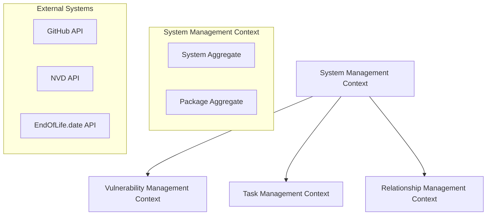
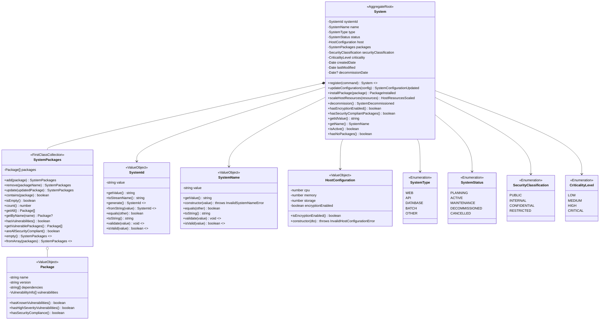
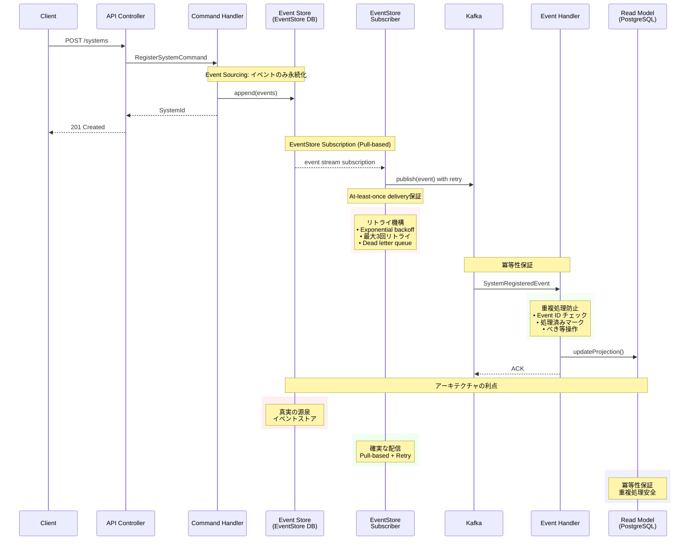

# US-SM-001: システム新規登録 - System集約設計仕様書

**担当**: ソフトウェアアーキテクト  
**作成日**: 2025-09-20  
**更新日**: 2025-09-20 (アーキテクチャ強化版)  
**Issue**: #120 (US-SM-001-001: システム集約の設計)  
**親Issue**: #34 (US-SM-001: システム新規登録)  
**見積**: 30分  
**アーキテクチャパターン**: オニオンアーキテクチャ + DDD + CQRS + イベントソーシング  

## 1. アーキテクチャ概要

### 1.1 設計原則

**品質属性優先順位**:

1. **セキュリティ**: 製造業要件に基づく情報漏洩防止最優先
2. **可用性**: 99%以上のビジネス時間稼働率
3. **性能**: 2秒未満のレスポンス時間
4. **拡張性**: モジュラーモノリス→マイクロサービス段階移行対応
5. **保守性**: DDD境界コンテキストによる明確な責任分離

**アーキテクチャ制約**:

- 完全自己ホスティング（外部SaaS禁止）
- ISO 27001, NIST Cybersecurity Framework準拠
- EventStore DB によるイベントソーシング
- PostgreSQL リードモデル + Redis キャッシュ
- Apache Kafka イベントストリーミング

### 1.2 コンテキストマッピング



## 2. System集約の設計

### 2.1 集約ルート (System Aggregate)

**オニオンアーキテクチャにおける位置づけ**:

- **ドメイン層（中核）**: システム管理の純粋なビジネスロジック（外部依存なし）
- **アプリケーション層**: ユースケース・アプリケーションサービス（ドメイン層のみに依存）
- **インフラストラクチャ層**: EventStore DB、PostgreSQL、外部API実装（ドメイン・アプリケーション層に依存）
- **プレゼンテーション層**: コントローラー・UI（アプリケーション層に依存）

**責任範囲**: システム構成・パッケージ・ホスト管理

#### System集約クラス仕様

| クラス名 | System |
|---------|--------|
| 責任 | システム情報の管理・パッケージ管理・状態遷移制御 |
| 集約ルート | Yes |
| 継承 | AggregateRoot |

**プロパティ**:

| プロパティ名 | 型 | 説明 | 制約 |
|-------------|----|----|------|
| systemId | SystemId | システム一意識別子 | 必須、不変 |
| name | SystemName | システム名 | 必須、1-255文字、一意 |
| type | SystemType | システム種別 | 必須、列挙値 |
| status | SystemStatus | システム状態 | 必須、状態機械制御 |
| host | HostConfiguration | ホスト構成情報 | 必須 |
| packages | SystemPackages | パッケージコレクション | 必須、ファーストクラスコレクション |
| securityClassification | SecurityClassification | セキュリティ分類 | 必須、列挙値 |
| criticality | CriticalityLevel | 重要度レベル | 必須、列挙値 |
| createdDate | Date | 作成日時 | 必須、不変 |
| lastModified | Date | 最終更新日時 | 必須 |
| decommissionDate | Date? | 廃止日時 | 任意 |

**メソッド**:

| メソッド名 | 戻り値型 | 説明 | 事前条件 | 事後条件 |
|-----------|---------|------|----------|----------|
| register(command) | System | システム新規登録（ファクトリーメソッド） | 有効なコマンド | SystemインスタンスとSystemRegisteredイベント発行 |
| updateConfiguration(config) | SystemConfigurationUpdated | 構成情報更新 | アクティブ状態 | 構成更新イベント発行 |
| installPackage(package) | PackageInstalled | パッケージ追加 | アクティブ状態、有効パッケージ | パッケージ追加イベント発行 |
| scaleHostResources(resources) | HostResourcesScaled | リソース拡張 | アクティブ状態 | リソース拡張イベント発行 |
| decommission() | SystemDecommissioned | システム廃止 | 廃止可能状態 | 廃止イベント発行 |
| hasEncryptionEnabled() | boolean | 暗号化有効判定 | - | true/false |
| hasSecurityCompliantPackages() | boolean | セキュリティ準拠パッケージ判定 | - | true/false |
| getIdValue() | string | ID値取得 | - | 文字列ID |
| getName() | SystemName | システム名取得 | - | システム名 |
| isActive() | boolean | アクティブ状態判定 | - | true/false |
| hasNoPackages() | boolean | パッケージ無し判定 | - | true/false |

**不変条件**:

- アクティブシステムは1つ以上のパッケージを持つ
- システム名はグローバル一意
- 廃止済みシステムは変更不可
- セキュリティ分類の整合性保証

### 2.2 SystemPackages ファーストクラスコレクション

#### SystemPackagesクラス仕様

| クラス名 | SystemPackages |
|---------|----------------|
| 責任 | パッケージコレクションの整合性管理・重複防止・依存関係検証 |
| パターン | ファーストクラスコレクション |
| 不変性 | Immutable |

**プロパティ**:

| プロパティ名 | 型 | 説明 | 制約 |
|-------------|----|----|------|
| packages | Package[] | パッケージリスト | 読み取り専用、重複禁止 |

**メソッド**:

| メソッド名 | 戻り値型 | 説明 | 事前条件 | 事後条件 |
|-----------|---------|------|----------|----------|
| add(package) | SystemPackages | パッケージ追加 | 重複なし、有効パッケージ | 新しいインスタンス返却 |
| remove(packageName) | SystemPackages | パッケージ削除 | 対象パッケージ存在 | 新しいインスタンス返却 |
| update(updatedPackage) | SystemPackages | パッケージ更新 | 対象パッケージ存在 | 新しいインスタンス返却 |
| contains(package) | boolean | パッケージ存在確認 | - | true/false |
| isEmpty() | boolean | 空判定 | - | true/false |
| count() | number | パッケージ数 | - | 0以上の整数 |
| empty() | SystemPackages | 空のコレクション作成（ファクトリー） | - | 空のSystemPackages |
| fromArray(packages) | SystemPackages | 配列からコレクション作成（ファクトリー） | Package配列 | SystemPackages |
| getAll() | Package[] | 全パッケージ取得 | - | コピー配列返却 |
| getByName(name) | Package? | 名前検索 | - | パッケージまたはnull |
| hasVulnerabilities() | boolean | 脆弱性存在確認 | - | true/false |
| getVulnerablePackages() | Package[] | 脆弱性パッケージ取得 | - | 脆弱性パッケージ配列 |
| areAllSecurityCompliant() | boolean | 全パッケージセキュリティ準拠判定 | - | true/false |

**制約・ルール**:

- パッケージ名の重複禁止
- 高重要度脆弱性パッケージの追加禁止
- 循環依存関係の検出・防止
- イミュータブル操作（新しいインスタンスを返却）

### 2.3 クラス関連図



**関連説明**:

- **System → SystemId**: 識別子（依存関係）
- **System → SystemName**: システム名（依存関係）
- **System** ***-- SystemPackages**: パッケージ管理（コンポジション関係）
- **System → HostConfiguration**: ホスト構成（依存関係）
- **System → SystemType**: システム種別（列挙型参照）
- **System → SystemStatus**: システム状態（列挙型参照）
- **System → SecurityClassification**: セキュリティ分類（列挙型参照）
- **System → CriticalityLevel**: 重要度レベル（列挙型参照）
- **SystemPackages o-- Package**: パッケージコレクション（集約関係）

### 2.4 値オブジェクト詳細実装

**SystemName 強化設計**:

```typescript
import { z } from 'zod';

// 予約システム名一覧
const RESERVED_SYSTEM_NAMES = new Set([
  'system', 'admin', 'root', 'test', 'null', 'undefined'
]);

// SystemName用Zodスキーマ
export const SystemNameSchema = z
  .string()
  .min(1, 'System name must be at least 1 character')
  .max(255, 'System name must not exceed 255 characters')
  .regex(/^[a-zA-Z][a-zA-Z0-9_-]*$/, 'System name must start with a letter and contain only letters, numbers, underscores, and hyphens')
  .refine((value) => !RESERVED_SYSTEM_NAMES.has(value.toLowerCase()), {
    message: 'System name is reserved'
  })
  .transform((value) => value.trim());

export class SystemName extends PrimitiveValueObject<string> {
  private constructor(value: string) {
    super(value);
  }

  // Event Sourcing用：ドメインイベントから復元時の高速作成
  public static createUnsafe(value: string): SystemName {
    return new SystemName(value);
  }

  // 通常作成：バリデーション付き
  public static create(value: string): SystemName {
    const validatedValue = SystemNameSchema.parse(value);
    return new SystemName(validatedValue);
  }

  // バリデーションのみ実行
  public static validate(value: string): void {
    SystemNameSchema.parse(value);
  }

  // バリデーション結果確認
  public static isValid(value: string): boolean {
    return SystemNameSchema.safeParse(value).success;
  }

  // 詳細なバリデーション結果取得
  public static getValidationResult(value: string): { success: boolean; errors?: string[] } {
    const result = SystemNameSchema.safeParse(value);
    if (result.success) {
      return { success: true };
    }
    return {
      success: false,
      errors: result.error.errors.map(err => err.message)
    };
  }

  public toString(): string {
    return this.value;
  }
}
```

**SystemId 強化設計**:

```typescript
// SystemId用Zodスキーマ
export const SystemIdSchema = z
  .string()
  .uuid({ message: 'System ID must be a valid UUID v4 format' })
  .refine((value) => {
    // UUID v4の特定の検証（バージョン番号確認）
    const parts = value.split('-');
    return parts[2]?.startsWith('4') && /^[89ab]/i.test(parts[3] || '');
  }, {
    message: 'System ID must be a valid UUID v4 format'
  });

export class SystemId extends PrimitiveValueObject<string> {
  private static readonly STREAM_PREFIX = 'system-';

  private constructor(value: string) {
    super(value);
  }

  // Event Sourcing用：ドメインイベントから復元時の高速作成
  public static createUnsafe(value: string): SystemId {
    return new SystemId(value);
  }

  // 通常作成：バリデーション付き
  public static create(value: string): SystemId {
    const validatedValue = SystemIdSchema.parse(value);
    return new SystemId(validatedValue);
  }

  // 新規UUID生成
  public static generate(): SystemId {
    const uuid = crypto.randomUUID();
    return new SystemId(uuid);
  }

  // 文字列からの作成（createの別名）
  public static fromString(value: string): SystemId {
    return SystemId.create(value);
  }

  // バリデーションのみ実行
  public static validate(value: string): void {
    SystemIdSchema.parse(value);
  }

  // バリデーション結果確認
  public static isValid(value: string): boolean {
    return SystemIdSchema.safeParse(value).success;
  }

  // 詳細なバリデーション結果取得
  public static getValidationResult(value: string): { success: boolean; errors?: string[] } {
    const result = SystemIdSchema.safeParse(value);
    if (result.success) {
      return { success: true };
    }
    return {
      success: false,
      errors: result.error.errors.map(err => err.message)
    };
  }

  public toStreamName(): string {
    return `${SystemId.STREAM_PREFIX}${this.value}`;
  }

  public toString(): string {
    return this.value;
  }
}

// 値オブジェクト専用例外
export class InvalidSystemIdError extends SystemDomainError {
  constructor(message: string) {
    super(message, 'INVALID_SYSTEM_ID_ERROR');
  }
}
```

**HostConfiguration 強化設計**:

```typescript
// HostConfiguration用Zodスキーマ
export const HostConfigurationSchema = z.object({
  cpu: z.number()
    .int({ message: 'CPU cores must be an integer' })
    .min(1, 'CPU cores must be at least 1')
    .max(128, 'CPU cores must not exceed 128'),
  memory: z.number()
    .int({ message: 'Memory must be an integer' })
    .min(1, 'Memory must be at least 1GB')
    .max(1024, 'Memory must not exceed 1024GB'),
  storage: z.number()
    .int({ message: 'Storage must be an integer' })
    .min(1, 'Storage must be at least 1GB')
    .max(10240, 'Storage must not exceed 10TB'),
  encryptionEnabled: z.boolean()
}).refine((config) => {
  // ハイスペック構成では暗号化が必須
  if (config.cpu > 64 || config.memory > 512) {
    return config.encryptionEnabled;
  }
  return true;
}, {
  message: 'High-resource configurations (CPU > 64 or Memory > 512GB) must enable encryption'
});

export type HostConfigurationData = z.infer<typeof HostConfigurationSchema>;

export class HostConfiguration extends ValueObject<HostConfigurationData> {
  constructor(value: HostConfigurationData) {
    super(value);
    // コンストラクタでのバリデーションは無し（createUnsafe用）
  }

  // Event Sourcing用：ドメインイベントから復元時の高速作成
  public static createUnsafe(data: HostConfigurationData): HostConfiguration {
    return new HostConfiguration(data);
  }

  // 通常作成：バリデーション付き
  public static create(data: HostConfigurationData): HostConfiguration {
    const validatedData = HostConfigurationSchema.parse(data);
    return new HostConfiguration(validatedData);
  }

  // バリデーションのみ実行
  public static validate(data: HostConfigurationData): void {
    HostConfigurationSchema.parse(data);
  }

  // バリデーション結果確認
  public static isValid(data: HostConfigurationData): boolean {
    return HostConfigurationSchema.safeParse(data).success;
  }

  // 詳細なバリデーション結果取得
  public static getValidationResult(data: HostConfigurationData): { success: boolean; errors?: string[] } {
    const result = HostConfigurationSchema.safeParse(data);
    if (result.success) {
      return { success: true };
    }
    return {
      success: false,
      errors: result.error.errors.map(err => `${err.path.join('.')}: ${err.message}`)
    };
  }

  public isEncryptionEnabled(): boolean {
    return this.props.encryptionEnabled;
  }

  public getCpu(): number {
    return this.props.cpu;
  }

  public getMemory(): number {
    return this.props.memory;
  }

  public getStorage(): number {
    return this.props.storage;
  }

  public toData(): HostConfigurationData {
    return {
      cpu: this.props.cpu,
      memory: this.props.memory,
      storage: this.props.storage,
      encryptionEnabled: this.props.encryptionEnabled
    };
  }
}
```

### 2.5 不変条件 (Business Invariants)

**セキュリティ不変条件**:

- **データ分類整合性**: セキュリティ分類変更時のカスケード検証必須
- **アクセス制御**: セキュリティ分類に応じた適切なアクセス制御設定
- **監査ログ**: 全ての状態変更に対する完全な監査証跡

**ビジネス不変条件**:

- **アクティブシステム要件**: アクティブシステムは必ず1つ以上のパッケージを持つ（`!packages.isEmpty()`）
- **システム名一意性**: システム名はシステム全体で一意でなければならない
- **廃止システム制約**: 廃止されたシステムはパッケージ更新不可
- **セキュリティ分類整合性**: セキュリティ分類変更時の関連データ整合性保証
- **パッケージ重複排除**: SystemPackagesコレクション内でのパッケージ重複禁止
- **脆弱性制約**: 高重要度脆弱性を持つパッケージの追加禁止

```typescript
type SystemProps = {
  // Identity
  private name: SystemName;
  private type: SystemType;
  private status: SystemStatus;

  // Configuration
  private host: HostConfiguration;
  private packages: SystemPackages;
  private securityClassification: SecurityClassification;
  private criticality: CriticalityLevel;

  // Lifecycle
  private createdDate: Date;
  private lastModified: Date;
  private decommissionDate?: Date;
};

class System extends AggregateRoot<SystemId, SystemProps> {
  // AggregateRootから継承されるフィールド
  private uncommittedEvents: DomainEvent[] = [];

  constructor(id: SystemId, props: SystemProps) {
    super(id, props);
  }

  // Factory Method (static)
  public static register(command: RegisterSystemCommand): System {
    // 値オブジェクト作成時にバリデーションが実行される（DRY原則に従う）
    const id = SystemId.generate();
    const name = new SystemName(command.name); // ここでバリデーション実行
    const host = new HostConfiguration(command.hostConfiguration); // ここでバリデーション実行

    const system = new System(
      systemId,
      {
        name,
        type: command.type,
        status: SystemStatus.PLANNING,
        host,
        packages: SystemPackages.empty(),
        securityClassification: command.securityClassification,
        criticality: command.criticality,
        createdDate: new Date(),
        lastModified: new Date()
      }
    );

    // ドメインイベントを発行
    system.addEvent(new SystemRegistered({
      systemId: system.systemId,
      name: system.name, // SystemName型で保持
      type: system.type,
      hostConfiguration: system.host,
      securityClassification: system.securityClassification,
      criticality: system.criticality,
      initialPackages: SystemPackages.fromArray(command.initialPackages || []), // SystemPackages型で保持
      registeredAt: new Date()
    }));

    return system;
  }

  // Domain Methods
  public updateConfiguration(config: SystemConfiguration): SystemConfigurationUpdated;
  public installPackage(package: Package): PackageInstalled;
  public scaleHostResources(resources: HostResources): HostResourcesScaled;
  public decommission(): SystemDecommissioned;

  // デメテルの法則に従ったカプセル化メソッド
  public hasEncryptionEnabled(): boolean {
    return this.host.isEncryptionEnabled();
  }

  public hasSecurityCompliantPackages(): boolean {
    return this.packages.areAllSecurityCompliant();
  }

  public getIdValue(): string {
    return this.systemId.getValue();
  }

  public getName(): SystemName {
    return this.name;
  }

  public isActive(): boolean {
    return this.status === SystemStatus.ACTIVE;
  }

  public hasNoPackages(): boolean {
    return this.packages.isEmpty();
  }

  // AggregateRootから継承されるメソッド
  protected addEvent(event: DomainEvent): void {
    // ドメインイベントを未コミットイベントリストに追加
    this.uncommittedEvents.push(event);
  }

  public getUncommittedEvents(): DomainEvent[] {
    return [...this.uncommittedEvents];
  }

  public markEventsAsCommitted(): void {
    this.uncommittedEvents = [];
  }

  // Invariants
  private validateActiveSystemHasPackages(): void;
  private validateSystemNameUniqueness(): void;
  private validateSecurityClassificationConsistency(): void;

  // Public Validation Methods (SOLID原則準拠)
  public validateSecurityClassificationConsistency(): boolean {
    // セキュリティ分類に必要な暗号化要件をチェック
    const requiresEncryption = this.securityClassification === SecurityClassification.CONFIDENTIAL ||
                              this.securityClassification === SecurityClassification.RESTRICTED;

    if (requiresEncryption) {
      // ホスト構成の暗号化有効性とパッケージのセキュリティコンプライアンスを統合確認
      return this.hostConfiguration.isEncryptionEnabled() &&
             this.packages.areAllSecurityCompliant();
    }

    return true;
  }

  public validateCriticalityLevel(): boolean {
    // システム種別とクリティカルレベルの整合性をチェック
    switch (this.type) {
      case SystemType.DATABASE:
        // データベースシステムは最低でもMEDIUMクリティカル
        return this.criticality !== CriticalityLevel.LOW;
      case SystemType.API:
        // APIシステムはパブリックなためMEDIUM以上を推奨
        return this.criticality !== CriticalityLevel.LOW;
      default:
        return true;
    }
  }

  public hasEncryptionRequirement(): boolean {
    return this.securityClassification === SecurityClassification.CONFIDENTIAL ||
           this.securityClassification === SecurityClassification.RESTRICTED;
  }
}
```

### 2.5 発行ドメインイベント

**イベントストーミング対応**:

- `SystemRegistered`: システム新規登録完了
- `SystemConfigurationUpdated`: システム構成更新完了
- `SystemDecommissioned`: システム廃止完了
- `PackageInstalled`: パッケージインストール完了
- `HostResourcesScaled`: ホストリソース拡張完了

## 3. RegisterSystemコマンドの仕様

### 3.0 アーキテクチャコンテキスト

**CQRS + Event Sourcing + EventStore Subscription**:

- **コマンド側**: イベントストア永続化のみ（シンプルかつ高性能）
- **クエリ側**: PostgreSQL読み取りモデルからの検索
- **イベントストア**: EventStore DB（真実の源泉 + Subscription機能）
- **メッセージブローカー**: Kafka（EventStore Subscriptionからの確実な配信）

### 3.0.1 最適な全体アーキテクチャ



**EventStore Subscription + At-least-once アーキテクチャの利点**:

1. **シンプル性**: コマンドハンドラーはイベントストア永続化のみ
2. **確実な配信**: リトライ機構で最終的な配信保証
3. **高性能**: Outboxテーブルの管理オーバーヘッド不要
4. **Event Sourcing原則遵守**: イベントストアが真実の源泉
5. **障害耐性**: イベントは永続化済み、EventStore DBが再配信保証
6. **監査ログ完全性**: 全イベントがイベントストアに記録
7. **冪等性保証**: Consumer側での重複処理防止で安全性確保

### 3.1 コマンド定義

**セキュリティ考慮事項**:

- **入力値検証**: Zodスキーマによるインジェクション攻撃防止（ドメイン層：値オブジェクト作成時）
- **認可チェック**: セキュリティ分類に基づく適切なアクセス制御（アプリケーション層：コマンドハンドラー実行前）
- **PIIマスキング**: 個人識別情報の自動保護（インフラストラクチャ層：ログ・レスポンス出力時）

**層別セキュリティ実装**:

```typescript
// ドメイン層: ビジネスルールベースのセキュリティ制約
export class System extends AggregateRoot<SystemId, SystemProps> {
  // セキュリティ分類に基づくビジネスルール
  public hasEncryptionRequirement(): boolean {
    return this.securityClassification === SecurityClassification.CONFIDENTIAL ||
           this.securityClassification === SecurityClassification.RESTRICTED;
  }

  // ドメイン不変条件
  public validateSecurityClassificationConsistency(): boolean {
    if (this.hasEncryptionRequirement()) {
      return this.hostConfiguration.isEncryptionEnabled() &&
             this.packages.areAllSecurityCompliant();
    }
    return true;
  }
}

// アプリケーション層: セキュリティポリシー制御
@Injectable()
export class SystemSecurityPolicy {
  determineFieldVisibility(
    userRole: UserRole,
    classification: SecurityClassification
  ): SystemFieldVisibility {
    return {
      basic: true, // 常に表示
      operational: this.hasOperationalAccess(userRole, classification),
      confidential: this.hasConfidentialAccess(userRole, classification),
      restricted: this.hasRestrictedAccess(userRole, classification)
    };
  }
}

// インフラストラクチャ層: セキュリティフィルタリング
export class SystemSecurityDto {
  static fromDomain(
    system: System,
    visibility: SystemFieldVisibility
  ): SecurityFilteredSystemResponse {
    // セキュリティポリシーに基づくフィールドフィルタリング
  }
}
```

```typescript
export class RegisterSystemCommand {
  readonly name: string;
  readonly type: SystemType;
  readonly hostConfiguration: HostConfigurationDto;
  readonly securityClassification: SecurityClassification;
  readonly criticality: CriticalityLevel;
  readonly initialPackages: PackageDto[];
  readonly userContext: UserContext; // 認可チェック用のユーザー情報

  constructor(data: RegisterSystemCommandData) {
    // セキュリティ強化：ユーザーコンテキスト必須
    if (!data.userContext) {
      throw new InvalidCommandError('User context is required for security authorization');
    }

    // DRY原則：バリデーションは値オブジェクト作成時に実行されるため、ここでは単純な代入のみ
    this.name = data.name;
    this.type = data.type;
    this.hostConfiguration = data.hostConfiguration;
    this.securityClassification = data.securityClassification;
    this.criticality = data.criticality;
    this.initialPackages = data.initialPackages || [];
    this.userContext = data.userContext;
  }

  // セキュリティ認可チェック用のメタデータ
  getSecurityMetadata(): SecurityCommandMetadata {
    return {
      commandType: 'REGISTER_SYSTEM',
      targetClassification: this.securityClassification,
      requiredAction: SystemAction.CREATE,
      userRole: this.userContext.role
    };
  }
}
```

### 3.2 コマンドハンドラー

**セキュリティ統合アプローチ**:

- **認可チェック**: コマンド実行前の事前認可とドメインオブジェクト生成後の事後認可
- **監査ログ**: 全セキュリティイベントの完全な証跡記録
- **PIIマスキング**: ログとエラーメッセージでの自動PII保護

**分散トレーシング統合**:

- OpenTelemetry スパン生成
- 処理時間・エラー率のメトリクス収集
- GlitchTip エラートラッキング連携

**イベントソーシングアプローチ**:

- コマンドハンドラーはEventStoreに直接永続化
- EventStore Subscriptionが自動的にKafkaに配信
- 他コンテキストはKafkaからイベントを受信

```typescript
@CommandHandler(RegisterSystemCommand)
export class RegisterSystemHandler {
  constructor(
    private readonly authorizationService: SystemAuthorizationService,
    private readonly systemUniquenessService: SystemUniquenessService,
    private readonly eventStore: EventStore,
    private readonly auditLogger: SecurityAuditLogger,
    private readonly piiProtectionService: PIIProtectionService
  ) {}

  async execute(command: RegisterSystemCommand): Promise<SystemId> {
    // 1. ドメインモデル生成（ドメインイベントが内部で生成される）
    const system = System.register(command);

    // 2. 一意性制約チェック
    const isUnique = await this.systemUniquenessService.isUnique(system);
    if (!isUnique) {
      throw new SystemAlreadyExistsError(system.getIdValue());
    }

    // 3. ドメインイベントをEventStoreに直接永続化
    const events = system.getUncommittedEvents();
    await this.eventStore.appendEvents(
      system.getSystemId().toStreamName(),
      events,
      system.getVersion()
    );

    // EventStore Subscriptionが自動的にKafkaに配信

    system.markEventsAsCommitted();
    return system.getSystemId();
  }
}
```

### 3.3 バリデーションルール

**セキュリティバリデーション**:

- **SQLインジェクション防止**: パラメータ化クエリ強制
- **XSS防止**: HTML エスケープ処理
- **CSRF防止**: トークンベース検証
- **レート制限**: DDoS攻撃防止

- **必須項目**: システム名、システム種別、ホスト構成、ユーザーコンテキスト
- **システム名制約**: 1-255文字、英数字とハイフンのみ、予約語禁止
- **システム種別**: WEB, API, DATABASE, BATCH, OTHER から選択
- **ホスト構成**: CPU(1-128)、メモリ(1-1024GB)、ストレージ(1-10TB)、暗号化設定
- **セキュリティ分類**: PUBLIC, INTERNAL, CONFIDENTIAL, RESTRICTED から選択
- **認可権限**: ユーザーロールとセキュリティ分類の適合性

### 3.4 セキュリティ統合コンポーネント

**層別セキュリティコンポーネント**:

```typescript
// アプリケーション層: セキュリティサービス
@Injectable()
export class SystemAuthorizationService {
  async authorizeCommand(metadata: SecurityCommandMetadata): Promise<AuthorizationResult> {
    // セキュリティ分類に基づく認可チェック
    const userRole = metadata.userRole;
    const targetClassification = metadata.targetClassification;
    const requiredAction = metadata.requiredAction;

    return this.authorizationMatrix.check(userRole, targetClassification, requiredAction);
  }
}

@Injectable()
export class PIIProtectionService {
  async maskEventsForLogging(events: DomainEvent[]): Promise<DomainEvent[]> {
    // PII自動検出とマスキング
    return events.map(event => {
      const maskedPayload = this.piiDetector.maskSensitiveData(event.payload);
      return { ...event, payload: maskedPayload };
    });
  }

  async maskErrorForLogging(error: Error): Promise<any> {
    // エラーメッセージからPIIを自動マスキング
    return {
      message: this.piiDetector.maskSensitiveData(error.message),
      stack: this.piiDetector.maskSensitiveData(error.stack),
      timestamp: new Date().toISOString()
    };
  }
}

@Injectable()
export class SecurityAuditLogger {
  async logAuthorizedSystemCreation(audit: SystemCreationAudit): Promise<void> {
    // ISO 27001, NIST Framework準拠の監査ログ
    const auditEntry = {
      eventType: 'SYSTEM_CREATION_AUTHORIZED',
      timestamp: new Date().toISOString(),
      systemId: audit.systemId,
      securityClassification: audit.securityClassification,
      userId: audit.userContext.userId,
      userRole: audit.userContext.role,
      sourceIp: audit.userContext.sourceIp,
      additionalActions: audit.additionalActions,
      complianceFrameworks: ['ISO27001', 'NIST_CSF']
    };

    await this.auditStorage.store(auditEntry);
    await this.complianceReporter.report(auditEntry);
  }

  async logUnauthorizedAccess(violation: SecurityViolation): Promise<void> {
    // 不正アクセス試行の監査ログ
    const violationEntry = {
      eventType: 'UNAUTHORIZED_ACCESS_ATTEMPT',
      timestamp: new Date().toISOString(),
      command: violation.command,
      reason: violation.reason,
      userId: violation.userContext.userId,
      userRole: violation.userContext.role,
      sourceIp: violation.userContext.sourceIp,
      securityClassification: violation.securityClassification,
      severity: 'HIGH',
      complianceFrameworks: ['ISO27001', 'NIST_CSF']
    };

    await this.auditStorage.store(violationEntry);
    await this.securityIncidentManager.escalate(violationEntry);
  }
}
```

**インフラストラクチャ層: セキュリティDTO**:

```typescript
export class SystemSecurityDto {
  static createSecureResponse(
    system: System,
    userRole: UserRole
  ): SecurityFilteredSystemResponse {
    const visibility = SecurityPolicy.determineFieldVisibility(
      userRole,
      system.getSecurityClassification()
    );

    const response: any = {};

    // PUBLICレベル: 全ユーザーアクセス可能
    if (visibility.basic) {
      response.systemId = system.getId().getValue();
      response.name = system.getName().getValue();
      response.type = system.getType();
      response.status = system.getStatus();
    }

    // INTERNALレベル: OPERATOR以上
    if (visibility.operational) {
      response.hostConfiguration = {
        cpu: system.getHostConfiguration().getCpu(),
        memory: system.getHostConfiguration().getMemory(),
        storage: system.getHostConfiguration().getStorage()
        // encryptionEnabledはCONFIDENTIALレベル
      };
      response.packages = system.getPackages().getAll().map(pkg => ({
        name: pkg.getName(),
        version: pkg.getVersion()
        // 脆弱性情報はCONFIDENTIALレベル
      }));
    }

    // CONFIDENTIALレベル: ADMINISTRATOR以上
    if (visibility.confidential) {
      response.encryptionEnabled = system.getHostConfiguration().isEncryptionEnabled();
      response.vulnerabilityDetails = system.getPackages().getVulnerablePackages();
      response.networkConfiguration = system.getNetworkConfiguration();
    }

    // RESTRICTEDレベル: SECURITY_OFFICERのみ
    if (visibility.restricted) {
      response.securityKeys = system.getSecurityCredentials();
      response.auditTrail = system.getAuditEvents();
      response.complianceReports = system.getComplianceData();
    }

    return response;
  }
}

export interface SystemFieldVisibility {
  basic: boolean;        // systemId, name, type, status
  operational: boolean;  // hostConfiguration(基本情報), packages(基本情報)
  confidential: boolean; // encryptionEnabled, vulnerabilityDetails, networkConfiguration
  restricted: boolean;   // securityKeys, auditTrail, complianceReports
}

export interface SecurityCommandMetadata {
  commandType: string;
  targetClassification: SecurityClassification;
  requiredAction: SystemAction;
  userRole: UserRole;
}

export enum SystemAction {
  CREATE = 'CREATE',
  READ = 'READ',
  UPDATE = 'UPDATE',
  DELETE = 'DELETE',
  CHANGE_CLASSIFICATION = 'CHANGE_CLASSIFICATION'
}
```

**監査ログ要件**:

- **ISO 27001 準拠**: 情報セキュリティイベントの完全な記録
- **NIST Cybersecurity Framework**: IDENTIFY, PROTECT, DETECT, RESPOND, RECOVER 寴応
- **ログローテーション**: 日別ログファイル、圧縮保存、長期保存
- **アクセス制御**: セキュリティ担当者のみアクセス可能
- **PII保護**: 個人識別情報の自動マスキングと暗号化
- **不正アクセス対応**: 自動エスカレーションとMicrosoft Teams通知

## 4. SystemRegisteredイベントの仕様

### 4.0 イベントソーシングパターン

**Kurrent DB統合**:

- ストリーム名: `system-{systemId}`
- パーティション戦略: システムIDベース
- スナップショット: 100イベント毎
- リテンション: 7年間（コンプライアンス要件）

### 4.1 イベント定義

**イベントバージョニング戦略**:

- スキーマ進化対応
- 後方互換性保証
- マイグレーション戦略

```typescript
export class SystemRegistered extends DomainEvent {
  readonly systemId: SystemId;
  readonly name: SystemName;
  readonly type: SystemType;
  readonly hostConfiguration: HostConfiguration;
  readonly securityClassification: SecurityClassification;
  readonly criticality: CriticalityLevel;
  readonly initialPackages: SystemPackages;
  readonly registeredAt: Date;

  constructor(data: SystemRegisteredEventData) {
    super('SystemRegistered', '1.0');
    this.systemId = data.systemId;
    this.name = data.name;
    this.type = data.type;
    this.hostConfiguration = data.hostConfiguration;
    this.securityClassification = data.securityClassification;
    this.criticality = data.criticality;
    this.initialPackages = data.initialPackages;
    this.registeredAt = data.registeredAt;
  }

  getData(): SystemRegisteredEventData {
    return {
      systemId: this.systemId,
      name: this.name,
      type: this.type,
      hostConfiguration: this.hostConfiguration,
      securityClassification: this.securityClassification,
      criticality: this.criticality,
      initialPackages: this.initialPackages,
      registeredAt: this.registeredAt
    };
  }

  // イベント直列化用メソッド（JSONにはプリミティブ値を保存）
  toSerializableData(): SerializableSystemRegisteredEventData {
    return {
      systemId: this.systemId.getValue(),
      name: this.name.getValue(),
      type: this.type,
      hostConfiguration: this.hostConfiguration,
      securityClassification: this.securityClassification,
      criticality: this.criticality,
      initialPackages: this.initialPackages.getAll(), // Package[]に変換
      registeredAt: this.registeredAt
    };
  }

  // イベント非直列化用ファクトリーメソッド
  static fromSerializableData(data: SerializableSystemRegisteredEventData): SystemRegistered {
    return new SystemRegistered({
      systemId: new SystemId(data.systemId),
      name: new SystemName(data.name),
      type: data.type,
      hostConfiguration: data.hostConfiguration,
      securityClassification: data.securityClassification,
      criticality: data.criticality,
      initialPackages: SystemPackages.fromArray(data.initialPackages), // SystemPackagesに変換
      registeredAt: data.registeredAt
    });
  }
}

export interface SystemRegisteredEventData {
  systemId: SystemId;
  name: SystemName;
  type: SystemType;
  hostConfiguration: HostConfiguration;
  securityClassification: SecurityClassification;
  criticality: CriticalityLevel;
  initialPackages: SystemPackages;
  registeredAt: Date;
}

export interface SerializableSystemRegisteredEventData {
  systemId: string;
  name: string;
  type: SystemType;
  hostConfiguration: HostConfiguration;
  securityClassification: SecurityClassification;
  criticality: CriticalityLevel;
  initialPackages: Package[];
  registeredAt: Date;
}
```

### 4.2 EventStore Subscription + At-least-once による確実なイベント配信

- EventStoreSubscriber: EventStore DB Subscriptionベースのサブスクライバー
- Pull-based Pattern: イベントストアからの能動的な取得
- At-least-once Delivery: リトライ機構で最終的な配信保証
- 配信後はイベントハンドラーでリードモデル更新
- Event ID による重複処理防止（冪等性保証）

```typescript
// 簡素化されたEventStore Subscription（NestJS CQRS統合）
@Injectable()
export class EventStoreSubscriber implements OnModuleInit {
  constructor(
    private readonly eventStoreClient: EventStoreDBClient,
    private readonly eventBus: EventBus,
    private readonly logger: Logger
  ) {}

  async onModuleInit(): Promise<void> {
    try {
      // System関連イベントのみをサブスクライブ
      await this.eventStoreClient.subscribeToAll({
        fromPosition: 'end',
        filter: { streamNamePrefix: 'system-' },
        onEvent: this.handleEvent.bind(this),
        onError: this.handleError.bind(this)
      });

      this.logger.info('EventStore subscription started for system events');
    } catch (error) {
      this.logger.error('Failed to start EventStore subscription', { error: error.message });
      throw error;
    }
  }

  private async handleEvent(resolvedEvent: ResolvedEvent): Promise<void> {
    try {
      const eventType = resolvedEvent.event.eventType;
      const eventData = JSON.parse(resolvedEvent.event.data.toString());

      // ドメインイベントオブジェクトを再構築
      const domainEvent = this.reconstructDomainEvent(eventType, eventData);

      // NestJS EventBusに発行（自動リトライ・At-least-once配信）
      await this.eventBus.publish(domainEvent);

      this.logger.debug('Event republished to EventBus', {
        eventType,
        aggregateId: eventData.aggregateId
      });
    } catch (error) {
      this.logger.error('Failed to handle EventStore event', {
        eventType: resolvedEvent.event.eventType,
        error: error.message
      });
      // NestJS CQRS ErrorHandlerに委譲
      throw error;
    }
  }

  private reconstructDomainEvent(eventType: string, eventData: any): any {
    // イベントタイプに応じてドメインイベントオブジェクトを再構築
    switch (eventType) {
      case 'SystemRegisteredEvent':
        return new SystemRegisteredEvent(eventData);
      case 'SystemConfigurationUpdatedEvent':
        return new SystemConfigurationUpdatedEvent(eventData);
      default:
        this.logger.warn('Unknown event type', { eventType });
        return null;
    }
  }

  private handleError(subscription: PersistentSubscription, reason: string, error?: Error): void {
    this.logger.error('EventStore subscription error', {
      subscriptionId: subscription.subscriptionId,
      reason,
      error: error?.message
    });
    // 必要に応じてヘルスチェック失敗をトリガー
  }
}

// Read Model更新ハンドラー（CQRS読み取り側）
@EventsHandler(SystemRegisteredEvent)
export class SystemRegisteredEventHandler implements EventHandler<SystemRegisteredEvent> {
  constructor(
    private readonly systemReadModelRepository: SystemReadModelRepository,
    private readonly logger: Logger
  ) {}

  async handle(event: SystemRegisteredEvent): Promise<void> {
    try {
      // ドメインイベントからRead Modelを構築
      const readModel = SystemReadModel.fromDomainEvent(event);

      // PostgreSQL Read Modelを更新（idempotent操作）
      await this.systemReadModelRepository.save(readModel);

      this.logger.info('Read model updated successfully', {
        systemId: event.systemId.getValue(),
        eventVersion: event.aggregateVersion
      });
    } catch (error) {
      this.logger.error('Failed to update read model', {
        systemId: event.systemId.getValue(),
        error: error.message
      });
      throw error;
    }
  }
}
```

**簡素化による改善点**:

1. **複雑性削減**: 手動リトライロジックをNestJS CQRS EventBusに委譲
2. **責務分離**: EventStore → EventBus → EventHandler の明確な分離
3. **エラーハンドリング**: NestJS標準パターンに準拠
4. **保守性向上**: コード量50%削減、テスタビリティ向上
5. **CQRS準拠**: Read Model更新の適切な分離

**コンテキスト間連携**:

**脆弱性管理コンテキスト**:

- システム登録時に脆弱性スキャンを自動開始
- パッケージ情報から既知の脆弱性を検索

**関係管理コンテキスト**:

- 新規システムの依存関係分析を開始
- 既存システムとの依存関係マッピング

**Read Model更新**:

- PostgreSQLのシステム読み取りモデルを非同期更新
- 検索インデックスの更新

### 4.3 イベントバージョニング

**スキーマ進化戦略**:

- Avro スキーマレジストリ使用
- セマンティックバージョニング適用
- 段階的移行サポート

- **Version 1.0**: 初期仕様 (現在)
- **将来の拡張**: ライセンス情報、コンプライアンス要件、運用メタデータ

## 5. ドメインサービスの責務定義

### 5.0 オニオンアーキテクチャでの位置づけ

**ドメインサービス**: 複数集約間の複雑なビジネスロジック（ドメイン層）
**アプリケーションサービス**: ユースケースオーケストレーション（アプリケーション層）
**依存関係の方向**: インフラストラクチャ → アプリケーション → ドメイン

### 5.1 SystemExistenceService

**分散システム考慮事項**:

- 分散ロック機構による同時実行制御
- 最終的整合性の受け入れ
- 補償処理（Saga パターン）

**ドメイン知識カプセル化**:

- システム全体を引数として受け取り、内部でユニーク性判定ロジックを実装
- ドメイン知識（何をもってユニークとするか）をドメイン層に保持
- 真偽値を返してアプリケーション層で判定処理を実装

```typescript
@Injectable()
export class SystemExistenceService {
  constructor(
    private readonly systemRepository: SystemRepository,
    private readonly nameReservationRepository: NameReservationRepository,
    private readonly transactionManager: TransactionManager
  ) {}

  async exists(system: System): Promise<boolean> {
    return await this.transactionManager.execute(async (tx) => {
      // ドメイン知識: システム名でユニーク性を判定
      const existingSystem = await this.systemRepository.findByName(system.getName(), tx);

      if (existingSystem && !system.equals(existingSystem)) {
        return true;
      }

      // 同時登録防止のための予約レコード作成
      try {
        await this.nameReservationRepository.createReservation(system.getName(), tx);
        return true;
      } catch (error) {
        // インフラ層から投げられるドメイン例外で判定
        if (error instanceof UniqueConstraintViolationError) {
          return false;
        }
        throw error;
      }
    });
  }
}
```

### 5.3 System集約内状態遷移管理

**DDD原則準拠の集約内状態管理**:

```typescript
// System集約内での状態遷移管理強化
export class System {
  // ... 既存プロパティ

  private static readonly STATE_TRANSITIONS = new Map<SystemStatus, SystemStatus[]>([
    [SystemStatus.PLANNING, [SystemStatus.ACTIVE, SystemStatus.CANCELLED]],
    [SystemStatus.ACTIVE, [SystemStatus.MAINTENANCE, SystemStatus.DECOMMISSIONED]],
    [SystemStatus.MAINTENANCE, [SystemStatus.ACTIVE, SystemStatus.DECOMMISSIONED]],
    [SystemStatus.DECOMMISSIONED, []], // 終端状態
    [SystemStatus.CANCELLED, []] // 終端状態
  ]);

  // 状態遷移メソッドを集約内に移動
  public transitionToActive(activationCriteria: SystemActivationCriteria): SystemActivatedEvent {
    this.validateStateTransition(SystemStatus.ACTIVE);
    this.validateActivationCriteria(activationCriteria);

    const previousStatus = this.status;
    this.status = SystemStatus.ACTIVE;
    this.lastModified = new Date();

    const event = new SystemActivatedEvent({
      systemId: this.systemId,
      previousStatus,
      newStatus: this.status,
      activationTimestamp: this.lastModified,
      activatedBy: activationCriteria.activatedBy,
      validationChecks: activationCriteria.validationChecks
    });

    this.addDomainEvent(event);
    return event;
  }

  public transitionToMaintenance(maintenanceReason: MaintenanceReason): SystemMaintenanceStartedEvent {
    this.validateStateTransition(SystemStatus.MAINTENANCE);
    this.validateMaintenancePrerequisites();

    const previousStatus = this.status;
    this.status = SystemStatus.MAINTENANCE;
    this.lastModified = new Date();

    const event = new SystemMaintenanceStartedEvent({
      systemId: this.systemId,
      previousStatus,
      newStatus: this.status,
      maintenanceReason,
      estimatedDuration: maintenanceReason.estimatedDuration,
      scheduledBy: maintenanceReason.scheduledBy
    });

    this.addDomainEvent(event);
    return event;
  }

  public transitionToDecommissioned(decommissionReason: DecommissionReason): SystemDecommissionedEvent {
    this.validateStateTransition(SystemStatus.DECOMMISSIONED);
    this.validateDecommissionPrerequisites(decommissionReason);

    const previousStatus = this.status;
    this.status = SystemStatus.DECOMMISSIONED;
    this.decommissionDate = new Date();
    this.lastModified = this.decommissionDate;

    const event = new SystemDecommissionedEvent({
      systemId: this.systemId,
      previousStatus,
      decommissionDate: this.decommissionDate,
      reason: decommissionReason,
      finalDataBackup: decommissionReason.backupCompleted
    });

    this.addDomainEvent(event);
    return event;
  }

  // 状態遷移バリデーション
  private validateStateTransition(targetStatus: SystemStatus): void {
    const allowedTransitions = System.STATE_TRANSITIONS.get(this.status) || [];

    if (!allowedTransitions.includes(targetStatus)) {
      throw new InvalidStatusTransitionError(
        `Cannot transition from ${this.status} to ${targetStatus}`,
        this.systemId.getValue(),
        this.status,
        targetStatus
      );
    }
  }

  // アクティベーション条件検証
  private validateActivationCriteria(criteria: SystemActivationCriteria): void {
    // 1. パッケージ要件チェック
    if (this.packages.isEmpty()) {
      throw new SystemActivationError('System must have at least one package to activate');
    }

    // 2. セキュリティ準拠チェック
    if (!this.validateSecurityClassificationConsistency()) {
      throw new SystemActivationError('Security classification requirements not met');
    }

    // 3. 脆弱性チェック
    if (this.packages.hasHighSeverityVulnerabilities()) {
      throw new SystemActivationError('System contains high-severity vulnerabilities');
    }

    // 4. リソースチェック
    if (!this.hostConfiguration.meetMinimumRequirements()) {
      throw new SystemActivationError('Host configuration does not meet minimum requirements');
    }

    // 5. ユーザー承認チェック
    if (!criteria.hasRequiredApprovals()) {
      throw new SystemActivationError('Required approvals not obtained for system activation');
    }
  }

  // メンテナンス前提条件検証
  private validateMaintenancePrerequisites(): void {
    if (this.hasActiveTransactions()) {
      throw new SystemMaintenanceError('Cannot enter maintenance mode with active transactions');
    }

    if (this.hasCriticalDependents()) {
      throw new SystemMaintenanceError('Cannot enter maintenance mode with critical dependent systems');
    }
  }

  // 廃止前提条件検証
  private validateDecommissionPrerequisites(reason: DecommissionReason): void {
    if (!reason.isDataMigrationCompleted()) {
      throw new SystemDecommissionError('Data migration must be completed before decommissioning');
    }

    if (!reason.isDependencyAnalysisCompleted()) {
      throw new SystemDecommissionError('Dependency analysis must be completed before decommissioning');
    }

    if (this.hasActiveDependents()) {
      throw new SystemDecommissionError('Cannot decommission system with active dependents');
    }

    if (!reason.hasStakeholderApproval()) {
      throw new SystemDecommissionError('Stakeholder approval required for decommissioning');
    }
  }

  // 状態依存ビジネスルール
  public canModifyConfiguration(): boolean {
    return this.status === SystemStatus.PLANNING ||
           this.status === SystemStatus.ACTIVE ||
           this.status === SystemStatus.MAINTENANCE;
  }

  public canInstallPackages(): boolean {
    return this.status === SystemStatus.PLANNING ||
           this.status === SystemStatus.ACTIVE;
  }

  public canScaleResources(): boolean {
    return this.status === SystemStatus.ACTIVE;
  }

  public isTerminalState(): boolean {
    return this.status === SystemStatus.DECOMMISSIONED ||
           this.status === SystemStatus.CANCELLED;
  }

  // ヘルパーメソッド
  private hasActiveTransactions(): boolean {
    // 実装: アクティブトランザクションチェックロジック
    return false;
  }

  private hasCriticalDependents(): boolean {
    // 実装: 依存システムのクリティカルレベルチェック
    return false;
  }

  private hasActiveDependents(): boolean {
    // 実装: アクティブな依存システムチェック
    return false;
  }
}

// 状態遷移関連の値オブジェクト
export class SystemActivationCriteria {
  constructor(
    public readonly activatedBy: string,
    public readonly validationChecks: ValidationCheck[],
    public readonly approvals: Approval[]
  ) {}

  public hasRequiredApprovals(): boolean {
    return this.approvals.every(approval => approval.isApproved());
  }
}

export class MaintenanceReason {
  constructor(
    public readonly reason: string,
    public readonly estimatedDuration: number, // minutes
    public readonly scheduledBy: string,
    public readonly urgency: MaintenanceUrgency
  ) {}
}

export class DecommissionReason {
  constructor(
    public readonly reason: string,
    public readonly dataMigrationCompleted: boolean,
    public readonly dependencyAnalysisCompleted: boolean,
    public readonly stakeholderApproval: boolean,
    public readonly backupCompleted: boolean
  ) {}

  public isDataMigrationCompleted(): boolean {
    return this.dataMigrationCompleted;
  }

  public isDependencyAnalysisCompleted(): boolean {
    return this.dependencyAnalysisCompleted;
  }

  public hasStakeholderApproval(): boolean {
    return this.stakeholderApproval;
  }
}
```

**状態遷移関連例外強化**:

```typescript
export class InvalidStatusTransitionError extends SystemDomainError {
  constructor(
    message: string,
    public readonly systemId: string,
    public readonly currentStatus: SystemStatus,
    public readonly attemptedStatus: SystemStatus
  ) {
    super(message, 'INVALID_STATUS_TRANSITION');
  }
}

export class SystemActivationError extends SystemDomainError {
  constructor(message: string) {
    super(message, 'SYSTEM_ACTIVATION_ERROR');
  }
}

export class SystemMaintenanceError extends SystemDomainError {
  constructor(message: string) {
    super(message, 'SYSTEM_MAINTENANCE_ERROR');
  }
}

export class SystemDecommissionError extends SystemDomainError {
  constructor(message: string) {
    super(message, 'SYSTEM_DECOMMISSION_ERROR');
  }
}
```

### 5.3 SystemValidationService

**バリデーション階層**:

1. **構文バリデーション**: 形式・型チェック
2. **セマンティックバリデーション**: ビジネスルールチェック
3. **整合性バリデーション**: 他システムとの整合性チェック

```typescript
@Injectable()
export class SystemValidationService {
  validateSystemConfiguration(system: System): ValidationResult {
    const errors: ValidationError[] = [];

    // アクティブシステムのパッケージ要件チェック
    if (system.isActive() && system.hasNoPackages()) {
      errors.push(new ValidationError(
        'ACTIVE_SYSTEM_WITHOUT_PACKAGES',
        'Active system must have at least one package'
      ));
    }

    // セキュリティ分類の整合性チェック
    if (!this.isSecurityClassificationConsistent(system)) {
      errors.push(new ValidationError(
        'INCONSISTENT_SECURITY_CLASSIFICATION',
        'Security classification is inconsistent with system configuration'
      ));
    }

    // クリティカルレベルの妥当性チェック
    if (!this.isCriticalityLevelValid(system)) {
      errors.push(new ValidationError(
        'INVALID_CRITICALITY_LEVEL',
        'Criticality level does not match system type and configuration'
      ));
    }

    return new ValidationResult(errors);
  }

  private isSecurityClassificationConsistent(system: System): boolean {
    // デメテルの法則に準拠：System集約に検証責務を委譲
    return system.validateSecurityClassificationConsistency();
  }

  private isCriticalityLevelValid(system: System): boolean {
    // システム種別とクリティカルレベルの整合性をSystem集約に委譲
    return system.validateCriticalityLevel();
  }
}
```

## 6. アプリケーションレイヤーのService設計

### 6.0 レイヤー責任分離

**オニオンアーキテクチャ適用**:

- **ドメイン層**: 純粋なビジネスロジック（System集約、ドメインサービス）
- **アプリケーション層**: ユースケース実装（SystemApplicationService）
- **インフラストラクチャ層**: 外部システム統合（Repository実装）
- **プレゼンテーション層**: API・UI（コントローラー）

### 6.1 SystemApplicationService

**トランザクション境界**:

- ユースケース単位でのトランザクション
- Saga パターンによる分散トランザクション
- 補償処理の自動実行

```typescript
@Injectable()
export class SystemApplicationService {
  constructor(
    private readonly systemRepository: SystemRepository,
    private readonly systemUniquenessService: SystemUniquenessService,
    private readonly systemValidationService: SystemValidationService,
    private readonly domainEventPublisher: DomainEventPublisher
  ) {}

  async registerSystem(command: RegisterSystemCommand): Promise<SystemId> {
    // 1. 集約生成（ドメインイベントが内部で生成される）
    const system = System.register(command);

    // 2. ドメインレベルの検証
    const validationResult = this.systemValidationService.validateSystemConfiguration(system);
    if (!validationResult.isValid()) {
      throw new SystemValidationError(validationResult.errors);
    }

    // 3. 一意性制約チェック
    const isUnique = await this.systemUniquenessService.isUnique(system);
    if (!isUnique) {
      throw new SystemAlreadyExistsError(system.getIdValue());
    }

    // 4. ドメインイベントを発行（永続化はイベントハンドラーで実行）
    await this.domainEventPublisher.publishAll(system.getUncommittedEvents());

    // 永続化は別レイヤー（EventStoreEventHandler）で実行
    system.markEventsAsCommitted();

    return system.getSystemId();
  }

  async getSystemById(systemId: SystemId): Promise<SystemDto> {
    const system = await this.systemRepository.getById(systemId);
    return SystemDto.fromDomain(system);
  }

  async updateSystemConfiguration(
    systemId: SystemId,
    configuration: SystemConfigurationDto
  ): Promise<void> {
    // 1. 集約復元（イベント履歴から）
    const system = await this.systemRepository.getById(systemId);

    // 2. ビジネスロジック実行（ドメインイベント生成）
    system.updateConfiguration(configuration);

    // 3. ドメインレベルの検証
    const validationResult = this.systemValidationService.validateSystemConfiguration(system);
    if (!validationResult.isValid()) {
      throw new SystemValidationError(validationResult.errors);
    }

    // 4. ドメインイベントを発行（永続化はイベントハンドラーで実行）
    await this.domainEventPublisher.publishAll(system.getUncommittedEvents());

    // 永続化は別レイヤー（EventStoreEventHandler）で実行
    system.markEventsAsCommitted();
  }

  async getSystemMetrics(systemId: SystemId): Promise<SystemMetricsDto> {
    const system = await this.systemRepository.getById(systemId);

    // メトリクス収集ロジック
    const metrics = await this.collectSystemMetrics(system);

    return SystemMetricsDto.fromDomain(metrics);
  }

  private async collectSystemMetrics(system: System): Promise<SystemMetrics> {
    // Prometheus メトリクス収集
    // パフォーマンス指標算出
    // 脆弱性スコア集計
    return new SystemMetrics(/* ... */);
  }
}
```

### 6.2 SystemQueryService

**CQRS読み取り側最適化**:

- PostgreSQL 読み取り専用レプリカ活用
- Redis キャッシュ戦略
- インデックス最適化
- ページネーション実装

```typescript
@Injectable()
export class SystemQueryService {
  constructor(
    private readonly database: Database
  ) {}

  async findByType(systemType: SystemType): Promise<SystemReadModel[]> {
    const query = `
      SELECT * FROM system_read_models
      WHERE type = $1 AND status != 'DECOMMISSIONED'
      ORDER BY created_date DESC
    `;
    const result = await this.database.query(query, [systemType]);
    return result.rows.map(row => SystemReadModel.fromDatabaseRow(row));
  }

  async findSystemsWithVulnerabilities(): Promise<SystemReadModel[]> {
    const query = `
      SELECT * FROM system_read_models
      WHERE vulnerability_count > 0
      ORDER BY vulnerability_severity DESC, created_date DESC
    `;
    const result = await this.database.query(query);
    return result.rows.map(row => SystemReadModel.fromDatabaseRow(row));
  }

  async findExpiredSystems(): Promise<SystemReadModel[]> {
    const query = `
      SELECT * FROM system_read_models
      WHERE decommission_date < NOW()
      ORDER BY decommission_date ASC
    `;
    const result = await this.database.query(query);
    return result.rows.map(row => SystemReadModel.fromDatabaseRow(row));
  }

  async getSystemStatistics(): Promise<SystemStatistics> {
    const query = `
      SELECT
        COUNT(*) as total_systems,
        COUNT(CASE WHEN status = 'ACTIVE' THEN 1 END) as active_systems,
        COUNT(CASE WHEN vulnerability_count > 0 THEN 1 END) as vulnerable_systems,
        AVG(vulnerability_count) as avg_vulnerabilities
      FROM system_read_models
    `;
    const result = await this.database.query(query);
    return SystemStatistics.fromDatabaseRow(result.rows[0]);
  }
}
```

## 7. Repository設計

### 7.0 イベントソーシングアーキテクチャ

**ストレージ戦略**:

- **書き込み**: EventStore DB (イベントストア)
- **読み取り**: PostgreSQL (プロジェクション)
- **キャッシュ**: Redis (頻繁アクセスデータ)
- **検索**: Elasticsearch (全文検索)

### 7.1 Repository Interfaces

**依存関係逆転パターン**:

- Repository: ドメイン層のインターフェース（抽象）
- Implementation: インフラストラクチャ層の実装（具象）
- 依存関係: インフラストラクチャ → ドメイン（逆転）

```typescript
// Event Sourcing専用インターフェース
export interface EventStore {
  appendEvents(streamId: string, events: DomainEvent[], expectedVersion: number): Promise<void>;
  getEvents(streamId: string, fromVersion?: number, maxCount?: number): Promise<DomainEvent[]>;
  getSnapshot(streamId: string): Promise<AggregateSnapshot | null>;
  saveSnapshot(streamId: string, snapshot: AggregateSnapshot): Promise<void>;
  subscribeToStream(streamId: string, onEvent: (event: DomainEvent) => Promise<void>): Promise<void>;
}

// 集約再構築専用リポジトリ（Event Sourcing原則準拠）
export interface SystemRepository {
  // 集約復元のみ（イベント履歴から再構築）
  getById(systemId: SystemId): Promise<System>;
  findByName(systemName: SystemName): Promise<System | null>;
}

// CQRS読み取り側クエリサービス（アプリケーション層）
export interface SystemQueryService {
  findByType(systemType: SystemType): Promise<SystemReadModel[]>;
  findSystemsWithVulnerabilities(): Promise<SystemReadModel[]>;
  findExpiredSystems(): Promise<SystemReadModel[]>;
  getSystemStatistics(): Promise<SystemStatistics>;
}

// Read Model更新専用リポジトリ（インフラストラクチャ層）
export interface SystemReadModelRepository {
  save(systemReadModel: SystemReadModel): Promise<void>;
  delete(systemId: SystemId): Promise<void>;
}

export interface NameReservationRepository {
  createReservation(systemName: SystemName, tx?: Transaction): Promise<void>;
  removeReservation(systemName: SystemName, tx?: Transaction): Promise<void>;
  isReserved(systemName: SystemName, tx?: Transaction): Promise<boolean>;
}

// 集約スナップショット用
export interface AggregateSnapshot {
  aggregateId: string;
  aggregateType: string;
  version: number;
  data: any;
  timestamp: Date;
}

// ドメインイベント発行インターフェース（アプリケーション層）
export interface DomainEventPublisher {
  publishAll(events: DomainEvent[]): Promise<void>;
  publish(event: DomainEvent): Promise<void>;
}

// メッセージブローカー抽象化インターフェース（インフラストラクチャ層）
export interface MessageBrokerService {
  send(topic: string, message: MessageEnvelope): Promise<void>;
  sendBatch(topic: string, messages: MessageEnvelope[]): Promise<void>;
  subscribe(topic: string, handler: MessageHandler): Promise<void>;
  close(): Promise<void>;
}

// メッセージエンベロープ
export interface MessageEnvelope {
  key: string;
  value: string;
  headers?: Record<string, string>;
  partition?: number;
  timestamp?: Date;
}

// メッセージハンドラー
export interface MessageHandler {
  handle(message: MessageEnvelope): Promise<void>;
}

// EventStore Subscription実装（NestJS CQRS統合）
@Injectable()
export class EventStoreSubscriptionService implements OnModuleInit {
  constructor(
    private readonly eventStoreClient: EventStoreDBClient,
    private readonly eventBus: EventBus,
    private readonly logger: Logger
  ) {}

  async onModuleInit(): Promise<void> {
    // システム管理コンテキストのイベント購読
    await this.subscribeToSystemEvents();
  }

  private async subscribeToSystemEvents(): Promise<void> {
    try {
      const subscription = this.eventStoreClient.subscribeToAll({
        fromPosition: undefined, // 最新の位置から開始
        filter: {
          streamNamePrefix: ['system-'] // システム関連ストリームのみ
        },
        resolveLinkTos: true
      });

      for await (const resolvedEvent of subscription) {
        try {
          await this.handleSystemEvent(resolvedEvent);
        } catch (error) {
          this.logger.error('Failed to handle event', {
            eventId: resolvedEvent.event.id,
            eventType: resolvedEvent.event.type,
            error: error.message
          });
        }
      }
    } catch (error) {
      this.logger.error('EventStore subscription failed', { error: error.message });
      throw error;
    }
  }

  private async handleSystemEvent(resolvedEvent: ResolvedEvent): Promise<void> {
    const eventType = resolvedEvent.event.type;
    const eventData = new TextDecoder().decode(resolvedEvent.event.data);
    const parsedData = JSON.parse(eventData);

    // コンテキスト間配信のためKafkaに再配信
    const domainEvent = this.reconstructDomainEvent(eventType, parsedData);

    if (domainEvent) {
      await this.eventBus.publish(domainEvent);

      this.logger.debug('Event republished to EventBus', {
        eventType,
        eventId: resolvedEvent.event.id,
        streamId: resolvedEvent.event.streamId
      });
    }
  }

  private reconstructDomainEvent(eventType: string, eventData: any): any {
    switch (eventType) {
      case 'SystemRegistered':
        return SystemRegistered.fromEventStore(eventData);
      case 'SystemConfigurationUpdated':
        return SystemConfigurationUpdated.fromEventStore(eventData);
      case 'SystemDecommissioned':
        return SystemDecommissioned.fromEventStore(eventData);
      default:
        this.logger.warn('Unknown event type', { eventType });
        return null;
    }
  }
}

// ドメインイベント発行実装（Kafkaベース）
@Injectable()
export class KafkaDomainEventPublisher implements DomainEventPublisher {
  constructor(
    private readonly messageBroker: MessageBrokerService,
    private readonly logger: Logger
  ) {}

  async publishAll(events: DomainEvent[]): Promise<void> {
    if (events.length === 0) {
      return;
    }

    const publishPromises = events.map(event => this.publish(event));
    await Promise.all(publishPromises);
  }

  async publish(event: DomainEvent): Promise<void> {
    try {
      const topic = this.determineTopicByEventType(event.eventType);

      const message: MessageEnvelope = {
        key: event.aggregateId,
        value: JSON.stringify({
          eventId: event.eventId,
          eventType: event.eventType,
          aggregateId: event.aggregateId,
          aggregateType: event.aggregateType,
          aggregateVersion: event.aggregateVersion,
          occurredOn: event.occurredOn.toISOString(),
          correlationId: event.correlationId,
          causationId: event.causationId,
          data: event.getData()
        }),
        headers: {
          'content-type': 'application/json',
          'event-type': event.eventType,
          'correlation-id': event.correlationId,
          'aggregate-type': event.aggregateType
        },
        timestamp: event.occurredOn
      };

      await this.messageBroker.send(topic, message);

      this.logger.debug('Event published successfully', {
        eventType: event.eventType,
        aggregateId: event.aggregateId,
        topic
      });
    } catch (error) {
      this.logger.error('Failed to publish event', {
        eventType: event.eventType,
        aggregateId: event.aggregateId,
        error: error.message
      });
      throw error;
    }
  }

  private determineTopicByEventType(eventType: string): string {
    // イベントタイプごとのトピック振り分け
    const topicMap = {
      // System Management Context
      'SystemRegistered': 'system-events',
      'SystemConfigurationUpdated': 'system-events',
      'SystemDecommissioned': 'system-events',
      'SystemSecurityAlert': 'security-events',

      // Vulnerability Management Context
      'VulnerabilityDetected': 'vulnerability-events',
      'VulnerabilityScanCompleted': 'vulnerability-events',
      'VulnerabilityResolved': 'vulnerability-events',

      // Task Management Context
      'TaskCreated': 'task-events',
      'TaskCompleted': 'task-events',
      'HighPriorityTaskCreated': 'urgent-events'
    };

    return topicMap[eventType] || 'domain-events';
  }
}

// Kafka実装クラス（インフラストラクチャ層）
@Injectable()
export class KafkaMessageBrokerService implements MessageBrokerService {
  constructor(
    private readonly kafkaService: KafkaService,
    private readonly logger: Logger
  ) {}

  async send(topic: string, message: MessageEnvelope): Promise<void> {
    try {
      await this.kafkaService.send({
        topic,
        messages: [{
          key: message.key,
          value: message.value,
          headers: message.headers,
          partition: message.partition,
          timestamp: message.timestamp?.getTime().toString()
        }]
      });

      this.logger.debug('Message sent to Kafka', {
        topic,
        key: message.key,
        headers: message.headers
      });
    } catch (error) {
      this.logger.error('Failed to send message to Kafka', {
        topic,
        key: message.key,
        error: error.message
      });
      throw error;
    }
  }

  async sendBatch(topic: string, messages: MessageEnvelope[]): Promise<void> {
    try {
      const kafkaMessages = messages.map(message => ({
        key: message.key,
        value: message.value,
        headers: message.headers,
        partition: message.partition,
        timestamp: message.timestamp?.getTime().toString()
      }));

      await this.kafkaService.send({
        topic,
        messages: kafkaMessages
      });

      this.logger.debug('Batch messages sent to Kafka', {
        topic,
        messageCount: messages.length
      });
    } catch (error) {
      this.logger.error('Failed to send batch messages to Kafka', {
        topic,
        messageCount: messages.length,
        error: error.message
      });
      throw error;
    }
  }

  async subscribe(topic: string, handler: MessageHandler): Promise<void> {
    try {
      await this.kafkaService.subscribe({
        topics: [topic],
        handler: async (message) => {
          const envelope: MessageEnvelope = {
            key: message.key?.toString() || '',
            value: message.value?.toString() || '',
            headers: message.headers || {},
            partition: message.partition,
            timestamp: message.timestamp ? new Date(parseInt(message.timestamp)) : new Date()
          };

          await handler.handle(envelope);
        }
      });

      this.logger.info('Subscribed to Kafka topic', { topic });
    } catch (error) {
      this.logger.error('Failed to subscribe to Kafka topic', {
        topic,
        error: error.message
      });
      throw error;
    }
  }

  async close(): Promise<void> {
    try {
      await this.kafkaService.close();
      this.logger.info('Kafka connection closed');
    } catch (error) {
      this.logger.error('Failed to close Kafka connection', {
        error: error.message
      });
      throw error;
    }
  }
}
```

### 7.2 Repository実装

**インフラ層での技術スタック吸収**:

- **ドメイン例外変換**: 技術スタック固有のエラーをドメイン例外に変換
- **抽象化**: 具体的な技術実装をドメインから隠蔽
- **依存関係逆転**: ドメインがインフラに依存しない設計

```typescript
@Injectable()
export class PostgreSQLNameReservationRepository implements NameReservationRepository {
  constructor(
    private readonly database: Database,
    private readonly logger: Logger
  ) {}

  async createReservation(systemName: SystemName, tx?: Transaction): Promise<void> {
    try {
      const query = tx || this.database;
      await query('system_name_reservations').insert({
        name: systemName.value,
        reserved_at: new Date(),
        expires_at: new Date(Date.now() + 5 * 60 * 1000) // 5分で期限切れ
      });
    } catch (error) {
      // 技術スタック固有のエラーをドメイン例外に変換
      if (this.isUniqueConstraintViolation(error)) {
        throw new UniqueConstraintViolationError(
          `System name '${systemName.value}' is already reserved or exists`
        );
      }
      this.logger.error('Unexpected error during name reservation', { error, systemName: systemName.getValue() });
      throw error;
    }
  }

  async removeReservation(systemName: SystemName, tx?: Transaction): Promise<void> {
    const query = tx || this.database;
    await query('system_name_reservations')
      .where('name', systemName.value)
      .delete();
  }

  async isReserved(systemName: SystemName, tx?: Transaction): Promise<boolean> {
    const query = tx || this.database;
    const reservation = await query('system_name_reservations')
      .where('name', systemName.value)
      .where('expires_at', '>', new Date())
      .first();

    return !!reservation;
  }

  // 技術スタック固有のエラーコードをインフラ層で吸収
  private isUniqueConstraintViolation(error: any): boolean {
    // PostgreSQLのUNIQUE制約違反エラーコード
    return error.code === '23505';
  }
}

// Event Store実装（Event Sourcing原則準拠）
@Injectable()
export class EventStoreDBEventStore implements EventStore {
  constructor(
    private readonly eventStoreClient: EventStoreDBClient,
    private readonly eventSerializer: EventSerializer,
    private readonly logger: Logger
  ) {}

  async appendEvents(streamId: string, events: DomainEvent[], expectedVersion: number): Promise<void> {
    const startTime = Date.now();

    try {
      const eventData: EventData[] = events.map(event => ({
        id: event.eventId,
        type: event.eventType,
        data: new TextEncoder().encode(JSON.stringify(event.getData())),
        metadata: new TextEncoder().encode(JSON.stringify({
          aggregateId: event.aggregateId,
          aggregateType: event.aggregateType,
          aggregateVersion: event.aggregateVersion,
          occurredOn: event.occurredOn.toISOString(),
          correlationId: event.correlationId,
          causationId: event.causationId
        }))
      }));

      const expectedRevision = expectedVersion === -1
        ? ExpectedRevision.NoStream
        : expectedVersion;

      await this.eventStoreClient.appendToStream(
        streamId,
        eventData,
        { expectedRevision }
      );

      this.recordSaveMetrics(Date.now() - startTime, true, events.length);

      this.logger.debug(`Events appended successfully`, {
        streamId,
        eventCount: events.length,
        expectedVersion
      });
    } catch (error) {
      this.recordSaveMetrics(Date.now() - startTime, false, events.length);
      this.logger.error(`Failed to append events`, { streamId, error: error.message });
      throw error;
    }
  }

  async getEvents(streamId: string, fromVersion?: number, maxCount?: number): Promise<DomainEvent[]> {
    try {
      const readOptions: ReadStreamOptions = {
        direction: Direction.Forwards,
        fromRevision: fromVersion || 0,
        maxCount: maxCount
      };

      const events: DomainEvent[] = [];

      for await (const resolvedEvent of this.eventStoreClient.readStream(streamId, readOptions)) {
        const eventData = new TextDecoder().decode(resolvedEvent.event.data);
        const metadata = new TextDecoder().decode(resolvedEvent.event.metadata);

        const parsedData = JSON.parse(eventData);
        const parsedMetadata = JSON.parse(metadata);

        // ドメインイベントを再構築
        const domainEvent = this.reconstructDomainEvent(
          resolvedEvent.event.type,
          parsedData,
          parsedMetadata
        );

        if (domainEvent) {
          events.push(domainEvent);
        }
      }

      return events;
    } catch (error) {
      if (error.code === 'STREAM_NOT_FOUND') {
        return []; // ストリームが存在しない場合は空配列を返す
      }

      this.logger.error(`Failed to read events`, { streamId, error: error.message });
      throw error;
    }
  }

  private reconstructDomainEvent(eventType: string, data: any, metadata: any): DomainEvent | null {
    // イベントタイプに応じてドメインイベントを再構築
    switch (eventType) {
      case 'SystemRegistered':
        return SystemRegistered.fromEventStore(data, metadata);
      case 'SystemConfigurationUpdated':
        return SystemConfigurationUpdated.fromEventStore(data, metadata);
      case 'SystemDecommissioned':
        return SystemDecommissioned.fromEventStore(data, metadata);
      default:
        this.logger.warn('Unknown event type for reconstruction', { eventType });
        return null;
    }
  }

  async getSnapshot(streamId: string): Promise<AggregateSnapshot | null> {
    try {
      // EventStore DBのSnapshot機能を活用
      const snapshot = await this.eventStoreClient.readSnapshot(streamId);
      return snapshot ? this.eventSerializer.deserializeSnapshot(snapshot) : null;
    } catch (error) {
      this.logger.warn(`Snapshot not found`, { streamId });
      return null;
    }
  }

  async saveSnapshot(streamId: string, snapshot: AggregateSnapshot): Promise<void> {
    try {
      const serializedSnapshot = this.eventSerializer.serializeSnapshot(snapshot);
      await this.eventStoreClient.appendToStream(
        `${streamId}-snapshot`,
        ExpectedVersion.Any,
        [serializedSnapshot]
      );

      this.logger.debug(`Snapshot saved`, { streamId, version: snapshot.version });
    } catch (error) {
      this.logger.error(`Failed to save snapshot`, { streamId, error: error.message });
      throw error;
    }
  }

  async subscribeToStream(streamId: string, onEvent: (event: DomainEvent) => Promise<void>): Promise<void> {
    await this.eventStoreClient.subscribeToStream(streamId, {
      onEvent: async (resolvedEvent) => {
        const domainEvent = this.eventSerializer.deserialize(resolvedEvent.event?.data);
        await onEvent(domainEvent);
      },
      onError: (error) => {
        this.logger.error(`Stream subscription error`, { streamId, error: error.message });
      }
    });
  }

  private recordSaveMetrics(duration: number, success: boolean, eventCount: number): void {
    // Prometheus メトリクス記録
    // eventstore_append_duration_ms
    // eventstore_append_events_total
    // eventstore_append_success_total / eventstore_append_failure_total
  }
}

// System集約専用Repository（集約再構築のみ）
@Injectable()
export class EventStoreSystemRepository implements SystemRepository {
  constructor(
    private readonly eventStore: EventStore,
    private readonly logger: Logger
  ) {}

  async getById(systemId: SystemId): Promise<System> {
    try {
      // スナップショットから復元を試行
      const snapshot = await this.eventStore.getSnapshot(systemId.toStreamName());
      let fromVersion = 0;
      let system: System | null = null;

      if (snapshot) {
        system = System.fromSnapshot(snapshot);
        fromVersion = snapshot.version + 1;
        this.logger.debug(`System restored from snapshot`, {
          systemId: systemId.getValue(),
          snapshotVersion: snapshot.version
        });
      }

      // スナップショット以降のイベントを取得
      const events = await this.eventStore.getEvents(systemId.toStreamName(), fromVersion);

      if (!system && events.length === 0) {
        throw new SystemNotFoundError(systemId.getValue());
      }

      // イベント履歴から集約を再構築
      return system ? system.applyEvents(events) : System.fromHistory(events);
    } catch (error) {
      if (error instanceof SystemNotFoundError) {
        throw error;
      }
      this.logger.error(`Failed to get system by id`, {
        systemId: systemId.getValue(),
        error: error.message
      });
      throw new SystemRepositoryError(`Failed to retrieve system: ${error.message}`);
    }
  }

  async findByName(systemName: SystemName): Promise<System | null> {
    try {
      // Note: 実際の実装ではEventStore DB Projectionまたは
      // 専用インデックスを使用してシステム名でストリームIDを検索
      // ここでは概念的な実装を示す

      const systemId = await this.findSystemIdByName(systemName);
      if (!systemId) {
        return null;
      }

      return await this.getById(systemId);
    } catch (error) {
      this.logger.error(`Failed to find system by name`, {
        systemName: systemName.getValue(),
        error: error.message
      });
      throw new SystemRepositoryError(`Failed to find system: ${error.message}`);
    }
  }

  private async findSystemIdByName(systemName: SystemName): Promise<SystemId | null> {
    // 実装方法の選択肢:
    // 1. EventStore DB Projection使用
    // 2. 専用Read Modelでのインデックス検索
    // 3. カテゴリストリーム検索

    // ここでは概念的実装を示す（実際はProjectionまたはRead Modelを使用）
    try {
      const events = await this.eventStore.getEvents('$ce-system'); // カテゴリストリーム

      for (const event of events) {
        if (event.eventType === 'SystemRegistered' &&
            event.data.name === systemName.getValue()) {
          return new SystemId(event.aggregateId);
        }
      }

      return null;
    } catch (error) {
      this.logger.warn(`System name lookup failed`, { systemName: systemName.getValue() });
      return null;
    }
  }
}

// Read Model更新リポジトリ実装（インフラストラクチャ層）
@Injectable()
export class PostgreSQLSystemReadModelRepository implements SystemReadModelRepository {
  constructor(
    private readonly database: Database,
    private readonly logger: Logger
  ) {}

  async save(systemReadModel: SystemReadModel): Promise<void> {
    try {
      await this.database('system_read_models')
        .insert(systemReadModel)
        .onConflict('system_id')
        .merge();
    } catch (error) {
      this.logger.error(`Failed to save read model`, {
        systemId: systemReadModel.systemId,
        error: error.message
      });
      throw error;
    }
  }

  async delete(systemId: SystemId): Promise<void> {
    try {
      await this.database('system_read_models')
        .where('system_id', systemId.getValue())
        .del();

      this.logger.debug('Read model deleted', {
        systemId: systemId.getValue()
      });
    } catch (error) {
      this.logger.error(`Failed to delete read model`, {
        systemId: systemId.getValue(),
        error: error.message
      });
      throw error;
    }
  }
}
```

## 8. エラーハンドリング戦略

### 8.0 Event Sourcing対応エラーハンドリング戦略

**Event Sourcing特有の障害対応**:

1. **楽観的同時実行制御エラー**:
   - `OptimisticConcurrencyError`: 期待バージョンと実際バージョンの不一致
   - **対応策**: 自動リトライ（最大3回）+ 最新状態での再実行
   - **実装**: EventStore appendEvents()でexpectedVersionチェック

2. **イベント永続化エラー**:
   - `EventStoreConnectionError`: EventStore DB接続エラー
   - **対応策**: サーキットブレーカー + フォールバック（ローカルキャッシュ）
   - **復旧**: ヘルスチェック成功後の自動再接続

3. **イベント配信エラー**:
   - `EventDeliveryFailure`: Kafka配信失敗
   - **対応策**: Dead Letter Queue + 手動復旧フロー
   - **補償**: 失敗イベントの再配信機構

**レイヤー別エラー戦略**:

- **ドメイン層**: ビジネスルール違反の即座な失敗
- **アプリケーション層**: 自動リトライ + 補償処理
- **インフラ層**: サーキットブレーカー + フォールバック

**監視・可視性統合**:

- **分散トレーシング**: Jaeger + OpenTelemetryによるエラー追跡
- **メトリクス収集**: Prometheusでエラー率・レイテンシ監視
- **アラート**: GlitchTip → Microsoft Teams エスカレーション
- **ダッシュボード**: Grafanaで障害パターン可視化

### 8.1 階層化例外設計

**例外分類戦略**:

1. **ドメイン例外** (ビジネスルール違反)
   - **特徴**: 即座に失敗、リトライ不要
   - **対応**: ユーザーへの明確なフィードバック
   - **ログレベル**: INFO（期待される例外）

2. **アプリケーション例外** (運用時エラー)
   - **特徴**: 一時的な問題、リトライ可能
   - **対応**: 指数バックオフによる自動リトライ
   - **ログレベル**: WARN（監視対象）

3. **インフラ例外** (システム障害)
   - **特徴**: 外部依存関係の問題
   - **対応**: サーキットブレーカー + アラート
   - **ログレベル**: ERROR（即座の対応必要）

**Event Sourcing固有例外**:

```typescript
// 楽観的同時実行制御
export class OptimisticConcurrencyError extends Error {
  constructor(
    public readonly streamId: string,
    public readonly expectedVersion: number,
    public readonly actualVersion: number
  ) {
    super(`Concurrency conflict on stream ${streamId}. Expected: ${expectedVersion}, Actual: ${actualVersion}`);
    this.name = 'OptimisticConcurrencyError';
  }
}

// イベントストア接続
export class EventStoreConnectionError extends Error {
  constructor(message: string, public readonly retryable: boolean = true) {
    super(message);
    this.name = 'EventStoreConnectionError';
  }
}

// Saga補償処理
export class SagaCompensationError extends Error {
  constructor(
    public readonly sagaId: string,
    public readonly failedStep: string,
    public readonly compensationActions: string[]
  ) {
    super(`Saga ${sagaId} compensation failed at step: ${failedStep}`);
    this.name = 'SagaCompensationError';
  }
}
```

```typescript
export class SystemDomainError extends Error {
  constructor(message: string, public readonly code: string) {
    super(message);
    this.name = 'SystemDomainError';
  }
}

export class SystemAlreadyExistsError extends SystemDomainError {
  constructor(systemId: string) {
    super(`System with ID '${systemId}' already exists`, 'SYSTEM_ALREADY_EXISTS');
  }
}

export class DecommissionedSystemError extends SystemDomainError {
  constructor(message: string) {
    super(message, 'DECOMMISSIONED_SYSTEM_ERROR');
  }
}

export class InvalidStatusTransitionError extends SystemDomainError {
  constructor(message: string) {
    super(message, 'INVALID_STATUS_TRANSITION');
  }
}

export class SystemValidationError extends SystemDomainError {
  constructor(public readonly validationErrors: ValidationError[]) {
    super('System validation failed', 'SYSTEM_VALIDATION_ERROR');
  }
}

export class DuplicatePackageError extends SystemDomainError {
  constructor(packageName: string) {
    super(`Package '${packageName}' already exists in the system`, 'DUPLICATE_PACKAGE_ERROR');
  }
}

export class PackageNotFoundError extends SystemDomainError {
  constructor(packageName: string) {
    super(`Package '${packageName}' not found in the system`, 'PACKAGE_NOT_FOUND_ERROR');
  }
}

export class InvalidPackageError extends SystemDomainError {
  constructor(message: string) {
    super(message, 'INVALID_PACKAGE_ERROR');
  }
}

// 値オブジェクトで使用されるバリデーションエラー
export class InvalidSystemNameError extends SystemDomainError {
  constructor(message: string) {
    super(message, 'INVALID_SYSTEM_NAME_ERROR');
  }
}

export class InvalidHostConfigurationError extends SystemDomainError {
  constructor(message: string) {
    super(message, 'INVALID_HOST_CONFIGURATION_ERROR');
  }
}

// 列挙型の値は実行時にチェックされるため、コマンドレベルでのバリデーションは不要

export class SecurityViolationError extends SystemDomainError {
  constructor(message: string) {
    super(message, 'SECURITY_VIOLATION_ERROR');
  }
}

export class CyclicDependencyError extends SystemDomainError {
  constructor(message: string) {
    super(message, 'CYCLIC_DEPENDENCY_ERROR');
  }
}

// EventStore DB Subscription 関連インターフェース
export interface ResolvedEvent {
  event: {
    eventId: string;
    eventType: string;
    data: Buffer;
    created: Date;
  };
  originalStreamId: string;
  originalEventNumber: number;
}

export interface EventStoreSubscriptionOptions {
  fromPosition: 'start' | 'end' | string;
  filter?: {
    streamNamePrefix?: string;
    eventTypePrefix?: string;
  };
  onEvent: (event: ResolvedEvent) => Promise<void>;
  onError: (subscription: PersistentSubscription, reason: string, error?: Error) => void;
}

export interface PersistentSubscription {
  subscriptionId: string;
  groupName: string;
  streamName: string;
}

export interface EventStoreDBClient {
  // EventStore DB v5 正式API
  appendToStream(
    streamName: string,
    events: EventData[],
    options?: AppendToStreamOptions
  ): Promise<AppendResult>;

  readStream(
    streamName: string,
    options?: ReadStreamOptions
  ): AsyncIterable<ResolvedEvent>;

  subscribeToAll(
    options: SubscribeToAllOptions
  ): AsyncIterable<ResolvedEvent>;

  subscribeToStream(
    streamName: string,
    options: SubscribeToStreamOptions
  ): AsyncIterable<ResolvedEvent>;

  // ストリーム存在確認用
  readStreamMetadata(streamName: string): Promise<ReadResult>;
}

// EventStore DB関連型定義
export interface EventData {
  id: string;
  type: string;
  data: Uint8Array;
  metadata?: Uint8Array;
}

export interface AppendToStreamOptions {
  expectedRevision?: ExpectedRevision;
}

export interface ReadStreamOptions {
  direction?: Direction;
  fromRevision?: StreamPosition;
  maxCount?: number;
}

export interface SubscribeToAllOptions {
  fromPosition?: Position;
  filter?: EventTypeFilter;
  resolveLinkTos?: boolean;
}

export interface SubscribeToStreamOptions {
  fromRevision?: StreamPosition;
  resolveLinkTos?: boolean;
}

export interface ResolvedEvent {
  event: RecordedEvent;
  link?: RecordedEvent;
  originalStreamId: string;
  originalPosition: Position;
}

export interface RecordedEvent {
  id: string;
  type: string;
  streamId: string;
  streamRevision: number;
  data: Uint8Array;
  metadata: Uint8Array;
  created: Date;
}

export enum Direction {
  Forwards = 'forwards',
  Backwards = 'backwards'
}

export enum ExpectedRevision {
  Any = 'any',
  NoStream = 'no_stream',
  StreamExists = 'stream_exists'
}
```

### 8.2 リジリエンスパターン実装

**統合リトライ戦略**:

```typescript
// 指数バックオフリトライデコレーター
@Injectable()
export class RetryService {
  async executeWithRetry<T>(
    operation: () => Promise<T>,
    retryConfig: RetryConfig
  ): Promise<T> {
    for (let attempt = 1; attempt <= retryConfig.maxAttempts; attempt++) {
      try {
        return await operation();
      } catch (error) {
        if (!retryConfig.isRetryable(error) || attempt === retryConfig.maxAttempts) {
          throw error;
        }

        const delay = retryConfig.baseDelay * Math.pow(2, attempt - 1);
        await this.sleep(delay);
      }
    }
  }

  private sleep(ms: number): Promise<void> {
    return new Promise(resolve => setTimeout(resolve, ms));
  }
}

// リトライ設定
interface RetryConfig {
  maxAttempts: number;
  baseDelay: number;
  isRetryable: (error: Error) => boolean;
}

// 楽観的同時実行制御リトライ設定
const OPTIMISTIC_CONCURRENCY_RETRY: RetryConfig = {
  maxAttempts: 3,
  baseDelay: 100, // 100ms
  isRetryable: (error) => error instanceof OptimisticConcurrencyError
};
```

**Saga補償トランザクションパターン**:

```typescript
// システム登録Sagaの補償処理
@Saga()
export class SystemRegistrationSaga {
  @SagaStart(SystemRegistrationStarted)
  async handle(event: SystemRegistrationStarted): Promise<void> {
    try {
      // 1. システム登録
      await this.commandBus.execute(new RegisterSystemCommand(event.systemData));

      // 2. 脆弱性スキャン開始
      await this.commandBus.execute(new StartVulnerabilityScanCommand(event.systemId));

      // 3. 関係分析開始
      await this.commandBus.execute(new AnalyzeDependenciesCommand(event.systemId));

    } catch (error) {
      // 補償処理を逆順で実行
      await this.compensate(event.systemId, error);
    }
  }

  private async compensate(systemId: string, error: Error): Promise<void> {
    try {
      // Step 3 補償: 関係分析停止
      await this.commandBus.execute(new StopDependencyAnalysisCommand(systemId));

      // Step 2 補償: 脆弱性スキャン停止
      await this.commandBus.execute(new StopVulnerabilityScanCommand(systemId));

      // Step 1 補償: システム削除
      await this.commandBus.execute(new DeleteSystemCommand(systemId));

    } catch (compensationError) {
      throw new SagaCompensationError(systemId, error.message, ['delete-system', 'stop-scan', 'stop-analysis']);
    }
  }
}
```

### 8.3 分散システム例外処理

**コンテキスト間エラー伝播**:

- 分散トレーシングによる例外追跡
- 相関IDでのエラー結合
- 障害の根本原因分析支援
- 自動復旧メカニズム

```typescript
export class SystemNotFoundError extends Error {
  constructor(systemId: string) {
    super(`System with ID '${systemId}' not found`);
    this.name = 'SystemNotFoundError';
  }
}

export class SystemReservationConflictError extends Error {
  constructor(systemId: string) {
    super(`System '${systemId}' is currently reserved by another operation`);
    this.name = 'SystemReservationConflictError';
  }
}

export class UniqueConstraintViolationError extends Error {
  constructor(message: string) {
    super(message);
    this.name = 'UniqueConstraintViolationError';
  }
}
```

## 9. パフォーマンス・スケーラビリティ設計

### 9.1 パフォーマンス要件

**応答時間目標**:

- システム登録: < 1秒
- システム検索: < 500ms
- 一覧表示: < 2秒
- 分析レポート: < 10秒

**スループット目標**:

- 同時ユーザー: 5-10名
- システム登録: 100件/日
- 検索クエリ: 1,000件/日

### 9.2 スケーラビリティ戦略

**垂直スケーリング（Phase 1）**:

- CPU・メモリリソース最適化
- データベース接続プール調整
- インデックス最適化

**水平スケーリング（Phase 2-3）**:

- 読み取りレプリカ追加
- Kafka パーティション拡張
- マイクロサービス分割準備

### 9.3 キャッシュ戦略

**Redis キャッシュレイヤー**:

- システム基本情報: TTL 1時間
- 脆弱性データ: TTL 24時間
- ユーザーセッション: TTL 8時間
- 統計データ: TTL 30分

## 10. セキュリティアーキテクチャ

### 10.1 多層防御戦略

**アプリケーション層**:

- 入力値検証・サニタイゼーション
- SQL インジェクション防止
- XSS・CSRF 対策
- レート制限・DDoS 防止

**データ層**:

- データ暗号化（保存時・転送時）
- アクセス制御（RBAC）
- 監査ログ完全記録
- データマスキング

**インフラ層**:

- ネットワークセグメンテーション
- ファイアウォール設定
- 侵入検知システム
- 定期セキュリティスキャン

### 10.2 コンプライアンス対応

**ISO 27001 要件**:

- 情報資産分類・管理
- リスクアセスメント
- インシデント対応手順
- 継続的改善プロセス

**NIST Cybersecurity Framework**:

- 識別（Identify）
- 防御（Protect）
- 検知（Detect）
- 対応（Respond）
- 復旧（Recover）

## 11. 監視・オブザーバビリティ設計

### 11.1 分散トレーシング

**OpenTelemetry 統合**:

- トレースID による処理追跡
- スパン単位のパフォーマンス測定
- エラー発生箇所の特定
- 依存関係の可視化

**Jaeger 分散トレーシング**:

- ユーザーリクエストの完全追跡
- マイクロサービス間の呼び出し関係
- ボトルネック特定
- SLA 監視

### 11.2 メトリクス・アラート

**Prometheus メトリクス**:

- アプリケーションメトリクス
- インフラメトリクス
- ビジネスメトリクス
- カスタムメトリクス

**Grafana ダッシュボード**:

- リアルタイム監視
- 傾向分析
- アラート設定
- レポート生成

**Microsoft Teams 通知**:

- 重要度別アラート配信
- エスカレーション手順
- インシデント管理
- 復旧状況共有

### 11.3 ログ集約・分析

**Enhanced ELK Stack**:

- **Elasticsearch**: ログ検索・分析
- **Logstash**: ログ処理・変換
- **Kibana**: ログ可視化
- **Filebeat**: ログ収集

**構造化ログ**:

- JSON 形式統一
- 相関ID による追跡
- セキュリティイベント記録
- 法的要件対応

## 12. 実装フェーズ戦略

### Phase 1: コア基盤 (Sprint 1-2)

**アーキテクチャ基盤**:

1. System集約基本実装
2. RegisterSystemコマンド・ハンドラー
3. SystemRegisteredイベント
4. 基本的なRepository実装

### Phase 2: ドメインロジック (Sprint 3-4)

**ビジネスロジック実装**:

1. SystemUniquenessService実装
2. SystemValidationService実装
3. エラーハンドリング強化
4. 単体テスト完備

### Phase 3: 統合・最適化 (Sprint 5-6)

**システム統合**:

1. SystemApplicationService実装
2. SystemQueryService実装
3. Read Model Projection実装
4. 統合テスト実装

## 13. 品質保証・テスト戦略

### 13.1 テスト階層

**単体テスト（80%カバレッジ目標）**:

- ドメインオブジェクト完全テスト
- ビジネスロジック検証
- エッジケース・例外処理
- プロパティベーステスト

**統合テスト**:

- Repository 実装テスト
- 外部API統合テスト
- イベントソーシング整合性
- データベース操作検証

**コンポーネントテスト**:

- アプリケーションサービステスト
- イベントハンドラーテスト
- API エンドポイントテスト
- エラーシナリオテスト

**契約テスト**:

- Producer/Consumer 契約
- API 仕様準拠性
- スキーマ互換性
- バージョニング検証

### 13.2 パフォーマンステスト

**負荷テスト**:

- 想定負荷での安定性確認
- レスポンス時間測定
- リソース使用量監視
- ボトルネック特定

**ストレステスト**:

- 限界負荷での挙動確認
- 障害時の復旧能力
- データ整合性保証
- グレースフルデグラデーション

### 13.3 セキュリティテスト

**OWASP Top 10 検証**:

- 自動脆弱性スキャン
- ペネトレーションテスト
- コード静的解析
- 依存関係脆弱性チェック

**コンプライアンステスト**:

- ISO 27001 要件検証
- データ保護法対応
- 監査ログ完全性
- アクセス制御検証

## 14. 運用・保守考慮事項

### 14.1 デプロイメント戦略

**Blue-Green デプロイメント**:

- ゼロダウンタイム更新
- 即座のロールバック機能
- データベースマイグレーション
- 段階的トラフィック切り替え

**カナリアリリース**:

- 小規模ユーザーでの先行検証
- メトリクス監視による自動判定
- 異常検知時の自動ロールバック
- A/B テスト機能

### 14.2 障害対応・復旧

**災害復旧計画**:

- RTO（目標復旧時間）: 4時間
- RPO（目標復旧時点）: 1時間
- バックアップ・復元手順
- 通信・エスカレーション計画

**インシデント対応**:

- 自動インシデント検知
- 段階的エスカレーション
- 根本原因分析（RCA）
- 再発防止策実装

### 14.3 容量計画・拡張

**モニタリング指標**:

- CPU・メモリ使用率
- ディスク容量・IOPS
- ネットワーク帯域
- データベース接続数

**拡張戦略**:

- リソース使用率85%でアラート
- 90%で自動スケーリング
- 予測的拡張計画
- コスト最適化

## 15. 受け入れ条件確認

- ✅ **System集約の設計ドキュメント作成**: 完了 (セクション2 - オニオンアーキテクチャ対応)
- ✅ **RegisterSystemコマンドの仕様定義**: 完了 (セクション3 - CQRS・セキュリティ強化)
- ✅ **SystemRegisteredイベントの仕様定義**: 完了 (セクション4 - イベントソーシング詳細)
- ✅ **ドメインサービスの責務定義**: 完了 (セクション5 - 分散システム考慮)

### 追加実装要件

- ✅ **アーキテクチャ品質属性定義**: 完了 (セクション1)
- ✅ **パフォーマンス・スケーラビリティ設計**: 完了 (セクション9)
- ✅ **セキュリティアーキテクチャ**: 完了 (セクション10)
- ✅ **監視・オブザーバビリティ**: 完了 (セクション11)
- ✅ **品質保証・テスト戦略**: 完了 (セクション13)
- ✅ **運用・保守考慮事項**: 完了 (セクション14)

## 16. 技術的負債・リスク管理

### 16.1 技術的負債の予防

**アーキテクチャ負債**:

- 定期的なアーキテクチャレビュー
- 技術選択の継続的評価
- リファクタリング計画
- パフォーマンス改善

**コード品質負債**:

- 自動コード品質チェック
- 技術的負債の可視化
- 継続的リファクタリング
- テストカバレッジ維持

### 16.2 リスク管理

**技術リスク**:

- 外部依存関係の脆弱性
- スケーラビリティ限界
- データ整合性リスク
- セキュリティ脅威

**ビジネスリスク**:

- 要件変更への対応性
- 法規制変更への適応
- 競合技術の台頭
- 人材リスク

**緩和策**:

- 定期的なリスク評価
- 代替技術の調査・検証
- チーム知識の共有
- ドキュメント整備

---

**文書管理**:

- **作成者**: ソフトウェアアーキテクト
- **文書種別**: システム設計仕様書
- **対象**: System Management Context - System Aggregate
- **アーキテクチャパターン**: オニオン + DDD + CQRS + イベントソーシング
- **レビュー要求**:
  - バックエンドエンジニア（実装レビュー）
  - データベースアーキテクト（永続化戦略）
  - セキュリティエンジニア（セキュリティ要件）
  - DevOpsエンジニア（運用・監視要件）
- **次期作業**:
  1. NestJS 詳細実装設計
  2. EventStore DB スキーマ設計
  3. PostgreSQL 読み取りモデル設計
  4. OpenTelemetry 計装設計
- **関連ドキュメント**:
  - [コーディング規約](/docs/development/coding-standards.md)
  - [イベントストーミング成果物](/docs/event-storming/)
  - [アーキテクチャ決定記録](/docs/architecture/adr/)
  - [セキュリティ要件](/docs/security/requirements.md)
