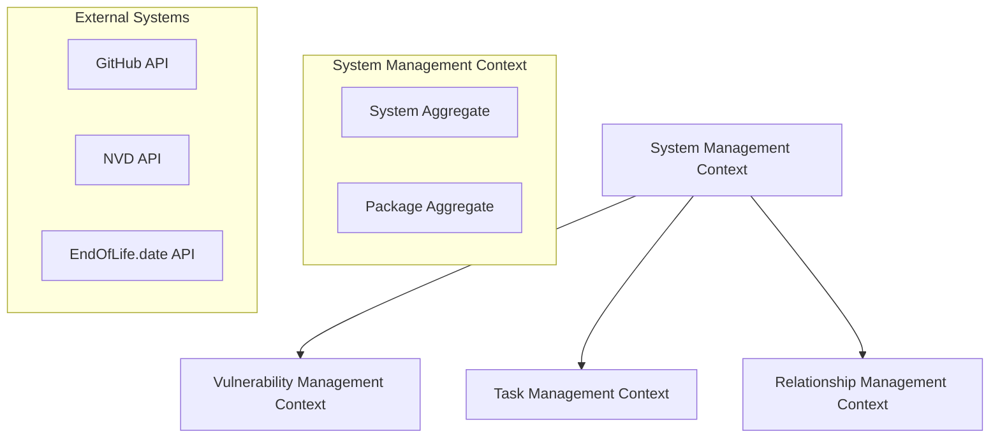
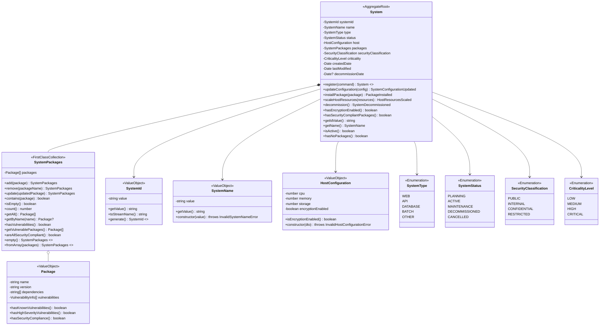
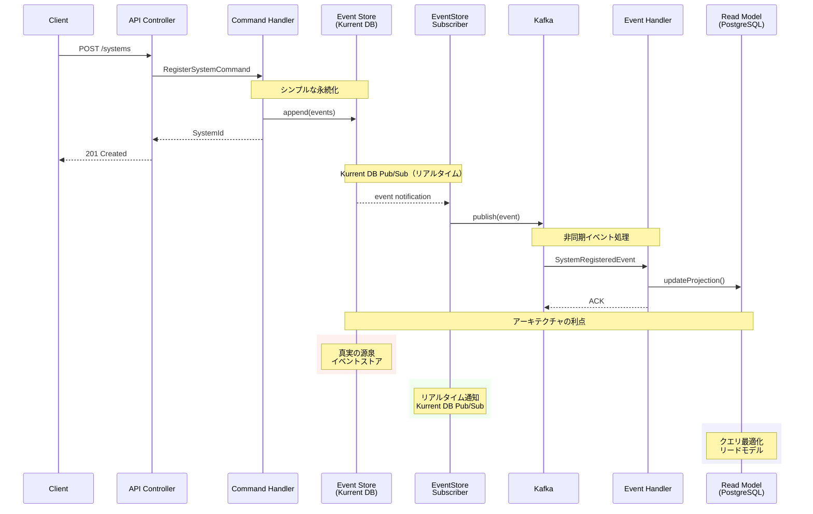

# US-SM-001: システム新規登録 - System集約設計仕様書

**担当**: ソフトウェアアーキテクト
**作成日**: 2025-09-20
**更新日**: 2025-09-20 (アーキテクチャ強化版)
**Issue**: #120 (US-SM-001-001: システム集約の設計)
**親Issue**: #34 (US-SM-001: システム新規登録)
**見積**: 30分
**アーキテクチャパターン**: オニオンアーキテクチャ + DDD + CQRS + イベントソーシング

## 1. アーキテクチャ概要

### 1.1 設計原則

**品質属性優先順位**:

1. **セキュリティ**: 製造業要件に基づく情報漏洩防止最優先
2. **可用性**: 99%以上のビジネス時間稼働率
3. **性能**: 2秒未満のレスポンス時間
4. **拡張性**: モジュラーモノリス→マイクロサービス段階移行対応
5. **保守性**: DDD境界コンテキストによる明確な責任分離

**アーキテクチャ制約**:

- 完全自己ホスティング（外部SaaS禁止）
- ISO 27001, NIST Cybersecurity Framework準拠
- Kurrent DB (EventStore DB) によるイベントソーシング
- PostgreSQL リードモデル + Redis キャッシュ
- Apache Kafka イベントストリーミング

### 1.2 コンテキストマッピング



## 2. System集約の設計

### 2.1 集約ルート (System Aggregate)

**オニオンアーキテクチャにおける位置づけ**:

- **ドメイン層（中核）**: システム管理の純粋なビジネスロジック（外部依存なし）
- **アプリケーション層**: ユースケース・アプリケーションサービス（ドメイン層のみに依存）
- **インフラストラクチャ層**: Kurrent DB、PostgreSQL、外部API実装（ドメイン・アプリケーション層に依存）
- **プレゼンテーション層**: コントローラー・UI（アプリケーション層に依存）

**責任範囲**: システム構成・パッケージ・ホスト管理

#### System集約クラス仕様

| クラス名 | System |
|---------|--------|
| 責任 | システム情報の管理・パッケージ管理・状態遷移制御 |
| 集約ルート | Yes |
| 継承 | AggregateRoot |

**プロパティ**:

| プロパティ名 | 型 | 説明 | 制約 |
|-------------|----|----|------|
| systemId | SystemId | システム一意識別子 | 必須、不変 |
| name | SystemName | システム名 | 必須、1-255文字、一意 |
| type | SystemType | システム種別 | 必須、列挙値 |
| status | SystemStatus | システム状態 | 必須、状態機械制御 |
| host | HostConfiguration | ホスト構成情報 | 必須 |
| packages | SystemPackages | パッケージコレクション | 必須、ファーストクラスコレクション |
| securityClassification | SecurityClassification | セキュリティ分類 | 必須、列挙値 |
| criticality | CriticalityLevel | 重要度レベル | 必須、列挙値 |
| createdDate | Date | 作成日時 | 必須、不変 |
| lastModified | Date | 最終更新日時 | 必須 |
| decommissionDate | Date? | 廃止日時 | 任意 |

**メソッド**:

| メソッド名 | 戻り値型 | 説明 | 事前条件 | 事後条件 |
|-----------|---------|------|----------|----------|
| register(command) | System | システム新規登録（ファクトリーメソッド） | 有効なコマンド | SystemインスタンスとSystemRegisteredイベント発行 |
| updateConfiguration(config) | SystemConfigurationUpdated | 構成情報更新 | アクティブ状態 | 構成更新イベント発行 |
| installPackage(package) | PackageInstalled | パッケージ追加 | アクティブ状態、有効パッケージ | パッケージ追加イベント発行 |
| scaleHostResources(resources) | HostResourcesScaled | リソース拡張 | アクティブ状態 | リソース拡張イベント発行 |
| decommission() | SystemDecommissioned | システム廃止 | 廃止可能状態 | 廃止イベント発行 |
| hasEncryptionEnabled() | boolean | 暗号化有効判定 | - | true/false |
| hasSecurityCompliantPackages() | boolean | セキュリティ準拠パッケージ判定 | - | true/false |
| getIdValue() | string | ID値取得 | - | 文字列ID |
| getName() | SystemName | システム名取得 | - | システム名 |
| isActive() | boolean | アクティブ状態判定 | - | true/false |
| hasNoPackages() | boolean | パッケージ無し判定 | - | true/false |

**不変条件**:

- アクティブシステムは1つ以上のパッケージを持つ
- システム名はグローバル一意
- 廃止済みシステムは変更不可
- セキュリティ分類の整合性保証

### 2.2 SystemPackages ファーストクラスコレクション

#### SystemPackagesクラス仕様

| クラス名 | SystemPackages |
|---------|----------------|
| 責任 | パッケージコレクションの整合性管理・重複防止・依存関係検証 |
| パターン | ファーストクラスコレクション |
| 不変性 | Immutable |

**プロパティ**:

| プロパティ名 | 型 | 説明 | 制約 |
|-------------|----|----|------|
| packages | Package[] | パッケージリスト | 読み取り専用、重複禁止 |

**メソッド**:

| メソッド名 | 戻り値型 | 説明 | 事前条件 | 事後条件 |
|-----------|---------|------|----------|----------|
| add(package) | SystemPackages | パッケージ追加 | 重複なし、有効パッケージ | 新しいインスタンス返却 |
| remove(packageName) | SystemPackages | パッケージ削除 | 対象パッケージ存在 | 新しいインスタンス返却 |
| update(updatedPackage) | SystemPackages | パッケージ更新 | 対象パッケージ存在 | 新しいインスタンス返却 |
| contains(package) | boolean | パッケージ存在確認 | - | true/false |
| isEmpty() | boolean | 空判定 | - | true/false |
| count() | number | パッケージ数 | - | 0以上の整数 |
| empty() | SystemPackages | 空のコレクション作成（ファクトリー） | - | 空のSystemPackages |
| fromArray(packages) | SystemPackages | 配列からコレクション作成（ファクトリー） | Package配列 | SystemPackages |
| getAll() | Package[] | 全パッケージ取得 | - | コピー配列返却 |
| getByName(name) | Package? | 名前検索 | - | パッケージまたはnull |
| hasVulnerabilities() | boolean | 脆弱性存在確認 | - | true/false |
| getVulnerablePackages() | Package[] | 脆弱性パッケージ取得 | - | 脆弱性パッケージ配列 |
| areAllSecurityCompliant() | boolean | 全パッケージセキュリティ準拠判定 | - | true/false |

**制約・ルール**:

- パッケージ名の重複禁止
- 高重要度脆弱性パッケージの追加禁止
- 循環依存関係の検出・防止
- イミュータブル操作（新しいインスタンスを返却）

### 2.3 クラス関連図



**関連説明**:

- **System → SystemId**: 識別子（依存関係）
- **System → SystemName**: システム名（依存関係）
- **System** ***-- SystemPackages**: パッケージ管理（コンポジション関係）
- **System → HostConfiguration**: ホスト構成（依存関係）
- **System → SystemType**: システム種別（列挙型参照）
- **System → SystemStatus**: システム状態（列挙型参照）
- **System → SecurityClassification**: セキュリティ分類（列挙型参照）
- **System → CriticalityLevel**: 重要度レベル（列挙型参照）
- **SystemPackages o-- Package**: パッケージコレクション（集約関係）

### 2.4 不変条件 (Business Invariants)

**セキュリティ不変条件**:

- **データ分類整合性**: セキュリティ分類変更時のカスケード検証必須
- **アクセス制御**: セキュリティ分類に応じた適切なアクセス制御設定
- **監査ログ**: 全ての状態変更に対する完全な監査証跡

**ビジネス不変条件**:

- **アクティブシステム要件**: アクティブシステムは必ず1つ以上のパッケージを持つ（`!packages.isEmpty()`）
- **システム名一意性**: システム名はシステム全体で一意でなければならない
- **廃止システム制約**: 廃止されたシステムはパッケージ更新不可
- **セキュリティ分類整合性**: セキュリティ分類変更時の関連データ整合性保証
- **パッケージ重複排除**: SystemPackagesコレクション内でのパッケージ重複禁止
- **脆弱性制約**: 高重要度脆弱性を持つパッケージの追加禁止

```typescript
class System extends AggregateRoot {
  // Identity
  private systemId: SystemId;
  private name: SystemName;
  private type: SystemType;
  private status: SystemStatus;

  // Configuration
  private host: HostConfiguration;
  private packages: SystemPackages;
  private securityClassification: SecurityClassification;
  private criticality: CriticalityLevel;

  // Lifecycle
  private createdDate: Date;
  private lastModified: Date;
  private decommissionDate?: Date;

  // AggregateRootから継承されるフィールド
  private uncommittedEvents: DomainEvent[] = [];

  constructor(
    systemId: SystemId,
    name: SystemName,
    type: SystemType,
    status: SystemStatus,
    host: HostConfiguration,
    packages: SystemPackages,
    securityClassification: SecurityClassification,
    criticality: CriticalityLevel,
    createdDate: Date,
    lastModified: Date,
    decommissionDate?: Date
  ) {
    super();
    this.systemId = systemId;
    this.name = name;
    this.type = type;
    this.status = status;
    this.host = host;
    this.packages = packages;
    this.securityClassification = securityClassification;
    this.criticality = criticality;
    this.createdDate = createdDate;
    this.lastModified = lastModified;
    this.decommissionDate = decommissionDate;
  }

  // Factory Method (static)
  public static register(command: RegisterSystemCommand): System {
    // 値オブジェクト作成時にバリデーションが実行される（DRY原則に従う）
    const systemId = SystemId.generate();
    const systemName = new SystemName(command.name); // ここでバリデーション実行
    const hostConfig = new HostConfiguration(command.hostConfiguration); // ここでバリデーション実行

    const system = new System(
      systemId,
      systemName,
      command.type,
      SystemStatus.PLANNING,
      hostConfig,
      SystemPackages.empty(),
      command.securityClassification,
      command.criticality,
      new Date(),
      new Date()
    );

    // ドメインイベントを発行
    system.addEvent(new SystemRegistered({
      systemId: system.systemId,
      name: system.name, // SystemName型で保持
      type: system.type,
      hostConfiguration: system.host,
      securityClassification: system.securityClassification,
      criticality: system.criticality,
      initialPackages: SystemPackages.fromArray(command.initialPackages || []), // SystemPackages型で保持
      registeredAt: new Date()
    }));

    return system;
  }

  // Domain Methods
  public updateConfiguration(config: SystemConfiguration): SystemConfigurationUpdated;
  public installPackage(package: Package): PackageInstalled;
  public scaleHostResources(resources: HostResources): HostResourcesScaled;
  public decommission(): SystemDecommissioned;

  // デメテルの法則に従ったカプセル化メソッド
  public hasEncryptionEnabled(): boolean {
    return this.host.isEncryptionEnabled();
  }

  public hasSecurityCompliantPackages(): boolean {
    return this.packages.areAllSecurityCompliant();
  }

  public getIdValue(): string {
    return this.systemId.getValue();
  }

  public getName(): SystemName {
    return this.name;
  }

  public isActive(): boolean {
    return this.status === SystemStatus.ACTIVE;
  }

  public hasNoPackages(): boolean {
    return this.packages.isEmpty();
  }

  // AggregateRootから継承されるメソッド
  protected addEvent(event: DomainEvent): void {
    // ドメインイベントを未コミットイベントリストに追加
    this.uncommittedEvents.push(event);
  }

  public getUncommittedEvents(): DomainEvent[] {
    return [...this.uncommittedEvents];
  }

  public markEventsAsCommitted(): void {
    this.uncommittedEvents = [];
  }

  // Invariants
  private validateActiveSystemHasPackages(): void;
  private validateSystemNameUniqueness(): void;
  private validateSecurityClassificationConsistency(): void;
}
```

### 2.5 発行ドメインイベント

**イベントストーミング対応**:

- `SystemRegistered`: システム新規登録完了
- `SystemConfigurationUpdated`: システム構成更新完了
- `SystemDecommissioned`: システム廃止完了
- `PackageInstalled`: パッケージインストール完了
- `HostResourcesScaled`: ホストリソース拡張完了

## 3. RegisterSystemコマンドの仕様

### 3.0 アーキテクチャコンテキスト

**CQRS + Event Sourcing + Kurrent DB Pub/Sub**:

- **コマンド側**: イベントストア永続化のみ（シンプルかつ高性能）
- **クエリ側**: PostgreSQL読み取りモデルからの検索
- **イベントストア**: Kurrent DB（真実の源泉 + Pub/Sub機能）
- **メッセージブローカー**: Kafka（Kurrent DB Pub/Subからのリアルタイム配信）

### 3.0.1 最適な全体アーキテクチャ



**Kurrent DB Pub/Subアーキテクチャの利点**:

1. **シンプル性**: コマンドハンドラーはイベントストア永続化のみ
2. **リアルタイム性**: ポーリング不要で低レイテンシ配信
3. **高性能**: Outboxテーブルやバックグラウンド処理不要
4. **Event Sourcing原則遵守**: イベントストアが真実の源泉
5. **障害耐性**: イベントは永続化済み、Kurrent DBが再配信保証
6. **監査ログ完全性**: 全イベントがイベントストアに記録
7. **運用の簡単さ**: Outboxテーブルの管理やポーリングジョブ不要

### 3.1 コマンド定義

**セキュリティ考慮事項**:

- 入力値検証によるインジェクション攻撃防止
- セキュリティ分類に基づく認可チェック
- PII（個人識別情報）マスキング対応

```typescript
export class RegisterSystemCommand {
  readonly name: string;
  readonly type: SystemType;
  readonly hostConfiguration: HostConfigurationDto;
  readonly securityClassification: SecurityClassification;
  readonly criticality: CriticalityLevel;
  readonly initialPackages: PackageDto[];

  constructor(data: RegisterSystemCommandData) {
    // DRY原則：バリデーションは値オブジェクト作成時に実行されるため、ここでは単純な代入のみ
    this.name = data.name;
    this.type = data.type;
    this.hostConfiguration = data.hostConfiguration;
    this.securityClassification = data.securityClassification;
    this.criticality = data.criticality;
    this.initialPackages = data.initialPackages || [];
  }
}
```

### 3.2 コマンドハンドラー

**分散トレーシング統合**:

- OpenTelemetry スパン生成
- 処理時間・エラー率のメトリクス収集
- GlitchTip エラートラッキング連携

**イベントソーシングアプローチ**:

- コマンドハンドラーは集約の永続化は行わない
- ドメインイベントをイベントバス（Kafka）に送信のみ
- イベントハンドラーで永続化処理を実行

```typescript
@CommandHandler(RegisterSystemCommand)
export class RegisterSystemHandler {
  constructor(
    private readonly systemUniquenessService: SystemUniquenessService,
    private readonly eventBus: DomainEventBus
  ) {}

  async execute(command: RegisterSystemCommand): Promise<SystemId> {
    // 1. ドメインモデル生成（ドメインイベントが内部で生成される）
    const system = System.register(command);

    // 2. 一意性制約チェック
    const isUnique = await this.systemUniquenessService.isUnique(system);
    if (!isUnique) {
      throw new SystemAlreadyExistsError(system.getIdValue());
    }

    // 3. ドメインイベントをイベントバス（Kafka）に送信
    await this.eventBus.publishAll(system.getUncommittedEvents());

    // 永続化はイベントハンドラーで実行

    return system.id;
  }
}
```

### 3.3 バリデーションルール

**セキュリティバリデーション**:

- **SQLインジェクション防止**: パラメータ化クエリ強制
- **XSS防止**: HTML エスケープ処理
- **CSRF防止**: トークンベース検証
- **レート制限**: DDoS攻撃防止

- **必須項目**: システム名、システム種別、ホスト構成
- **システム名制約**: 1-255文字、英数字とハイフンのみ
- **システム種別**: WEB, API, DATABASE, BATCH, OTHER から選択
- **ホスト構成**: CPU、メモリ、ストレージの仕様必須
- **セキュリティ分類**: PUBLIC, INTERNAL, CONFIDENTIAL, RESTRICTED から選択

## 4. SystemRegisteredイベントの仕様

### 4.0 イベントソーシングパターン

**Kurrent DB統合**:

- ストリーム名: `system-{systemId}`
- パーティション戦略: システムIDベース
- スナップショット: 100イベント毎
- リテンション: 7年間（コンプライアンス要件）

### 4.1 イベント定義

**イベントバージョニング戦略**:

- スキーマ進化対応
- 後方互換性保証
- マイグレーション戦略

```typescript
export class SystemRegistered extends DomainEvent {
  readonly systemId: SystemId;
  readonly name: SystemName;
  readonly type: SystemType;
  readonly hostConfiguration: HostConfiguration;
  readonly securityClassification: SecurityClassification;
  readonly criticality: CriticalityLevel;
  readonly initialPackages: SystemPackages;
  readonly registeredAt: Date;

  constructor(data: SystemRegisteredEventData) {
    super('SystemRegistered', '1.0');
    this.systemId = data.systemId;
    this.name = data.name;
    this.type = data.type;
    this.hostConfiguration = data.hostConfiguration;
    this.securityClassification = data.securityClassification;
    this.criticality = data.criticality;
    this.initialPackages = data.initialPackages;
    this.registeredAt = data.registeredAt;
  }

  getData(): SystemRegisteredEventData {
    return {
      systemId: this.systemId,
      name: this.name,
      type: this.type,
      hostConfiguration: this.hostConfiguration,
      securityClassification: this.securityClassification,
      criticality: this.criticality,
      initialPackages: this.initialPackages,
      registeredAt: this.registeredAt
    };
  }

  // イベント直列化用メソッド（JSONにはプリミティブ値を保存）
  toSerializableData(): SerializableSystemRegisteredEventData {
    return {
      systemId: this.systemId.getValue(),
      name: this.name.getValue(),
      type: this.type,
      hostConfiguration: this.hostConfiguration,
      securityClassification: this.securityClassification,
      criticality: this.criticality,
      initialPackages: this.initialPackages.getAll(), // Package[]に変換
      registeredAt: this.registeredAt
    };
  }

  // イベント非直列化用ファクトリーメソッド
  static fromSerializableData(data: SerializableSystemRegisteredEventData): SystemRegistered {
    return new SystemRegistered({
      systemId: new SystemId(data.systemId),
      name: new SystemName(data.name),
      type: data.type,
      hostConfiguration: data.hostConfiguration,
      securityClassification: data.securityClassification,
      criticality: data.criticality,
      initialPackages: SystemPackages.fromArray(data.initialPackages), // SystemPackagesに変換
      registeredAt: data.registeredAt
    });
  }
}

export interface SystemRegisteredEventData {
  systemId: SystemId;
  name: SystemName;
  type: SystemType;
  hostConfiguration: HostConfiguration;
  securityClassification: SecurityClassification;
  criticality: CriticalityLevel;
  initialPackages: SystemPackages;
  registeredAt: Date;
}

export interface SerializableSystemRegisteredEventData {
  systemId: string;
  name: string;
  type: SystemType;
  hostConfiguration: HostConfiguration;
  securityClassification: SecurityClassification;
  criticality: CriticalityLevel;
  initialPackages: Package[];
  registeredAt: Date;
}
```

### 4.2 Kurrent DB Pub/Sub によるリアルタイムイベント配信

- EventStoreSubscriber: Kurrent DB Pub/Subサブスクライバー
- リアルタイム通知: イベント永続化と同時に処理
- プッシュ型配信: ポーリング不要の効率的な配信
- 配信後はイベントハンドラーでリードモデル更新
- Idempotency Key による重複処理防止

```typescript
// Kurrent DB Pub/Subサブスクライバー（OutboxProcessorの代替）
@Injectable()
export class EventStoreSubscriber {
  constructor(
    private readonly kurrentClient: KurrentClient,
    private readonly kafkaProducer: KafkaProducer,
    private readonly logger: Logger
  ) {}

  async onModuleInit(): Promise<void> {
    // 全イベントストリームをサブスクライブ
    await this.kurrentClient.subscribeToAll({
      fromPosition: 'end', // 新規イベントのみ
      filter: {
        streamNamePrefix: 'system-' // System関連イベントのみ
      },
      onEvent: this.handleEvent.bind(this),
      onError: this.handleError.bind(this)
    });

    this.logger.info('EventStore subscription started');
  }

  private async handleEvent(resolvedEvent: ResolvedEvent): Promise<void> {
    try {
      const eventType = resolvedEvent.event.eventType;
      const eventData = JSON.parse(resolvedEvent.event.data.toString());
      const eventId = resolvedEvent.event.eventId;

      // Kafkaにリアルタイム配信
      await this.kafkaProducer.send({
        topic: 'system-events',
        messages: [{
          key: eventData.systemId,
          value: JSON.stringify({
            eventId,
            eventType,
            eventData,
            timestamp: resolvedEvent.event.created
          }),
          headers: {
            eventType,
            aggregateId: eventData.systemId
          }
        }]
      });

      this.logger.debug(`Event forwarded to Kafka`, {
        eventId,
        eventType,
        aggregateId: eventData.systemId
      });
    } catch (error) {
      this.logger.error(`Failed to forward event to Kafka`, {
        eventId: resolvedEvent.event.eventId,
        error: error.message
      });
      // エラー時はサブスクリプションを継続（イベントはスキップ）
    }
  }

  private handleError(subscription: PersistentSubscription, reason: string, error?: Error): void {
    this.logger.error(`EventStore subscription error`, {
      subscriptionId: subscription.subscriptionId,
      reason,
      error: error?.message
    });
  }
}

// Infrastructure Layer - Event Handler（Kafkaから受信後のリードモデル更新）
@EventsHandler(SystemRegisteredEvent)
export class SystemRegisteredEventHandler {
  constructor(
    private readonly systemRepository: SystemRepository,
    private readonly logger: Logger
  ) {}

  async handle(event: SystemRegisteredEvent): Promise<void> {
    try {
      // リードモデル（PostgreSQL）を更新
      await this.systemRepository.save(
        System.fromEvent(event)
      );

      this.logger.info(`Read model updated successfully`, {
        systemId: event.systemId.getValue()
      });
    } catch (error) {
      this.logger.error(`Failed to update read model`, {
        systemId: event.systemId.getValue(),
        error: error.message
      });
      throw error; // Dead Letter Queueへ
    }
  }
}
```

**コンテキスト間連携**:

**脆弱性管理コンテキスト**:

- システム登録時に脆弱性スキャンを自動開始
- パッケージ情報から既知の脆弱性を検索

**関係管理コンテキスト**:

- 新規システムの依存関係分析を開始
- 既存システムとの依存関係マッピング

**Read Model更新**:

- PostgreSQLのシステム読み取りモデルを非同期更新
- 検索インデックスの更新

### 4.3 イベントバージョニング

**スキーマ進化戦略**:

- Avro スキーマレジストリ使用
- セマンティックバージョニング適用
- 段階的移行サポート

- **Version 1.0**: 初期仕様 (現在)
- **将来の拡張**: ライセンス情報、コンプライアンス要件、運用メタデータ

## 5. ドメインサービスの責務定義

### 5.0 オニオンアーキテクチャでの位置づけ

**ドメインサービス**: 複数集約間の複雑なビジネスロジック（ドメイン層）
**アプリケーションサービス**: ユースケースオーケストレーション（アプリケーション層）
**依存関係の方向**: インフラストラクチャ → アプリケーション → ドメイン

### 5.1 SystemUniquenessService

**分散システム考慮事項**:

- 分散ロック機構による同時実行制御
- 最終的整合性の受け入れ
- 補償処理（Saga パターン）

**ドメイン知識カプセル化**:

- システム全体を引数として受け取り、内部でユニーク性判定ロジックを実装
- ドメイン知識（何をもってユニークとするか）をドメイン層に保持
- 真偽値を返してアプリケーション層で判定処理を実装

```typescript
@Injectable()
export class SystemUniquenessService {
  constructor(
    private readonly systemRepository: SystemRepository,
    private readonly nameReservationRepository: NameReservationRepository,
    private readonly transactionManager: TransactionManager
  ) {}

  async isUnique(system: System): Promise<boolean> {
    return await this.transactionManager.execute(async (tx) => {
      // ドメイン知識: システム名でユニーク性を判定
      const existingSystem = await this.systemRepository.findByName(system.getName(), tx);

      if (existingSystem) {
        return false;
      }

      // 同時登録防止のための予約レコード作成
      try {
        await this.nameReservationRepository.createReservation(system.getName(), tx);
        return true;
      } catch (error) {
        // インフラ層から投げられるドメイン例外で判定
        if (error instanceof UniqueConstraintViolationError) {
          return false;
        }
        throw error;
      }
    });
  }
}
```

### 5.2 SystemStateTransitionService

**状態機械パターン**:

- 有限状態オートマトン実装
- 状態遷移の監査ログ
- 無効遷移時の自動復旧

```typescript
@Injectable()
export class SystemStateTransitionService {
  private readonly validTransitions = new Map<SystemStatus, SystemStatus[]>([
    [SystemStatus.PLANNING, [SystemStatus.ACTIVE, SystemStatus.CANCELLED]],
    [SystemStatus.ACTIVE, [SystemStatus.MAINTENANCE, SystemStatus.DECOMMISSIONED]],
    [SystemStatus.MAINTENANCE, [SystemStatus.ACTIVE, SystemStatus.DECOMMISSIONED]],
    [SystemStatus.DECOMMISSIONED, []], // 終端状態
    [SystemStatus.CANCELLED, []] // 終端状態
  ]);

  validateTransition(currentStatus: SystemStatus, newStatus: SystemStatus): void {
    const allowedTransitions = this.validTransitions.get(currentStatus) || [];

    if (!allowedTransitions.includes(newStatus)) {
      throw new InvalidStatusTransitionError(
        `Cannot transition from ${currentStatus} to ${newStatus}`
      );
    }
  }

  canModifySystem(status: SystemStatus): boolean {
    return status === SystemStatus.PLANNING ||
           status === SystemStatus.ACTIVE ||
           status === SystemStatus.MAINTENANCE;
  }
}
```

### 5.3 SystemValidationService

**バリデーション階層**:

1. **構文バリデーション**: 形式・型チェック
2. **セマンティックバリデーション**: ビジネスルールチェック
3. **整合性バリデーション**: 他システムとの整合性チェック

```typescript
@Injectable()
export class SystemValidationService {
  validateSystemConfiguration(system: System): ValidationResult {
    const errors: ValidationError[] = [];

    // アクティブシステムのパッケージ要件チェック
    if (system.isActive() && system.hasNoPackages()) {
      errors.push(new ValidationError(
        'ACTIVE_SYSTEM_WITHOUT_PACKAGES',
        'Active system must have at least one package'
      ));
    }

    // セキュリティ分類の整合性チェック
    if (!this.isSecurityClassificationConsistent(system)) {
      errors.push(new ValidationError(
        'INCONSISTENT_SECURITY_CLASSIFICATION',
        'Security classification is inconsistent with system configuration'
      ));
    }

    // クリティカルレベルの妥当性チェック
    if (!this.isCriticalityLevelValid(system)) {
      errors.push(new ValidationError(
        'INVALID_CRITICALITY_LEVEL',
        'Criticality level does not match system type and configuration'
      ));
    }

    return new ValidationResult(errors);
  }

  private isSecurityClassificationConsistent(system: System): boolean {
    // セキュリティ分類とホスト構成、パッケージ要件の整合性チェック
    const hasEncryptionRequirement = system.securityClassification === SecurityClassification.CONFIDENTIAL ||
                                    system.securityClassification === SecurityClassification.RESTRICTED;

    if (hasEncryptionRequirement) {
      // デメテルの法則に従い、Systemオブジェクトに検証メソッドを委譲
      return system.hasEncryptionEnabled() &&
             system.hasSecurityCompliantPackages();
    }

    return true;
  }

  private isCriticalityLevelValid(system: System): boolean {
    // システム種別とクリティカルレベルの整合性チェック
    if (system.type === SystemType.DATABASE && system.criticality === CriticalityLevel.LOW) {
      return false; // データベースシステムは最低でもMEDIUMクリティカル
    }

    return true;
  }
}
```

## 6. アプリケーションレイヤーのService設計

### 6.0 レイヤー責任分離

**オニオンアーキテクチャ適用**:

- **ドメイン層**: 純粋なビジネスロジック（System集約、ドメインサービス）
- **アプリケーション層**: ユースケース実装（SystemApplicationService）
- **インフラストラクチャ層**: 外部システム統合（Repository実装）
- **プレゼンテーション層**: API・UI（コントローラー）

### 6.1 SystemApplicationService

**トランザクション境界**:

- ユースケース単位でのトランザクション
- Saga パターンによる分散トランザクション
- 補償処理の自動実行

```typescript
@Injectable()
export class SystemApplicationService {
  constructor(
    private readonly systemRepository: SystemRepository,
    private readonly systemUniquenessService: SystemUniquenessService,
    private readonly systemValidationService: SystemValidationService,
    private readonly eventStore: IEventStore
  ) {}

  async registerSystem(command: RegisterSystemCommand): Promise<SystemId> {
    // 1. 集約生成
    const system = System.register(command);

    // 2. ドメインレベルの検証
    const validationResult = this.systemValidationService.validateSystemConfiguration(system);
    if (!validationResult.isValid()) {
      throw new SystemValidationError(validationResult.errors);
    }

    // 3. 一意性制約チェック
    const isUnique = await this.systemUniquenessService.isUnique(system);
    if (!isUnique) {
      throw new SystemAlreadyExistsError(system.getIdValue());
    }

    // 4. イベントストアに永続化（Kurrent DB Pub/Subが自動配信）
    await this.eventStore.append(
      system.getIdValue(),
      system.getUncommittedEvents()
    );

    return system.id;
  }

  async getSystemById(systemId: SystemId): Promise<SystemDto> {
    const system = await this.systemRepository.getById(systemId);
    return SystemDto.fromDomain(system);
  }

  async updateSystemConfiguration(
    systemId: SystemId,
    configuration: SystemConfigurationDto
  ): Promise<void> {
    const system = await this.systemRepository.getById(systemId);

    system.updateConfiguration(configuration);

    const validationResult = this.systemValidationService.validateSystemConfiguration(system);
    if (!validationResult.isValid()) {
      throw new SystemValidationError(validationResult.errors);
    }

    // イベントストアに永続化（Kurrent DB Pub/Subが自動配信）
    await this.eventStore.append(
      system.getIdValue(),
      system.getUncommittedEvents()
    );
  }

  async getSystemMetrics(systemId: SystemId): Promise<SystemMetricsDto> {
    const system = await this.systemRepository.getById(systemId);

    // メトリクス収集ロジック
    const metrics = await this.collectSystemMetrics(system);

    return SystemMetricsDto.fromDomain(metrics);
  }

  private async collectSystemMetrics(system: System): Promise<SystemMetrics> {
    // Prometheus メトリクス収集
    // パフォーマンス指標算出
    // 脆弱性スコア集計
    return new SystemMetrics(/* ... */);
  }
}
```

### 6.2 SystemQueryService

**CQRS読み取り側最適化**:

- PostgreSQL 読み取り専用レプリカ活用
- Redis キャッシュ戦略
- インデックス最適化
- ページネーション実装

```typescript
@Injectable()
export class SystemQueryService {
  constructor(
    private readonly systemReadModelRepository: SystemReadModelRepository
  ) {}

  async findSystemsByType(systemType: SystemType): Promise<SystemSummaryDto[]> {
    const systems = await this.systemReadModelRepository.findByType(systemType);
    return systems.map(SystemSummaryDto.fromReadModel);
  }

  async findSystemsWithVulnerabilities(): Promise<SystemVulnerabilityDto[]> {
    const systems = await this.systemReadModelRepository.findSystemsWithVulnerabilities();
    return systems.map(SystemVulnerabilityDto.fromReadModel);
  }

  async findExpiredSystems(): Promise<SystemSummaryDto[]> {
    const systems = await this.systemReadModelRepository.findExpiredSystems();
    return systems.map(SystemSummaryDto.fromReadModel);
  }

  async getSystemStatistics(): Promise<SystemStatisticsDto> {
    const stats = await this.systemReadModelRepository.getSystemStatistics();
    return SystemStatisticsDto.fromReadModel(stats);
  }
}
```

## 7. Repository設計

### 7.0 イベントソーシングアーキテクチャ

**ストレージ戦略**:

- **書き込み**: Kurrent DB (イベントストア)
- **読み取り**: PostgreSQL (プロジェクション)
- **キャッシュ**: Redis (頻繁アクセスデータ)
- **検索**: Elasticsearch (全文検索)

### 7.1 Repository Interfaces

**依存関係逆転パターン**:

- Repository: ドメイン層のインターフェース（抽象）
- Implementation: インフラストラクチャ層の実装（具象）
- 依存関係: インフラストラクチャ → ドメイン（逆転）

```typescript
export interface SystemRepository {
  save(system: System): Promise<void>;
  getById(systemId: SystemId): Promise<System>;
  findByName(systemName: SystemName, tx?: Transaction): Promise<System | null>;
  exists(systemId: SystemId): Promise<boolean>;
}

export interface NameReservationRepository {
  createReservation(systemName: SystemName, tx?: Transaction): Promise<void>;
  removeReservation(systemName: SystemName, tx?: Transaction): Promise<void>;
  isReserved(systemName: SystemName, tx?: Transaction): Promise<boolean>;
}
```

### 7.2 Repository実装

**インフラ層での技術スタック吸収**:

- **ドメイン例外変換**: 技術スタック固有のエラーをドメイン例外に変換
- **抽象化**: 具体的な技術実装をドメインから隠蔽
- **依存関係逆転**: ドメインがインフラに依存しない設計

```typescript
@Injectable()
export class PostgreSQLNameReservationRepository implements NameReservationRepository {
  constructor(
    private readonly database: Database,
    private readonly logger: Logger
  ) {}

  async createReservation(systemName: SystemName, tx?: Transaction): Promise<void> {
    try {
      const query = tx || this.database;
      await query('system_name_reservations').insert({
        name: systemName.value,
        reserved_at: new Date(),
        expires_at: new Date(Date.now() + 5 * 60 * 1000) // 5分で期限切れ
      });
    } catch (error) {
      // 技術スタック固有のエラーをドメイン例外に変換
      if (this.isUniqueConstraintViolation(error)) {
        throw new UniqueConstraintViolationError(
          `System name '${systemName.value}' is already reserved or exists`
        );
      }
      this.logger.error('Unexpected error during name reservation', { error, systemName: systemName.getValue() });
      throw error;
    }
  }

  async removeReservation(systemName: SystemName, tx?: Transaction): Promise<void> {
    const query = tx || this.database;
    await query('system_name_reservations')
      .where('name', systemName.value)
      .delete();
  }

  async isReserved(systemName: SystemName, tx?: Transaction): Promise<boolean> {
    const query = tx || this.database;
    const reservation = await query('system_name_reservations')
      .where('name', systemName.value)
      .where('expires_at', '>', new Date())
      .first();

    return !!reservation;
  }

  // 技術スタック固有のエラーコードをインフラ層で吸収
  private isUniqueConstraintViolation(error: any): boolean {
    // PostgreSQLのUNIQUE制約違反エラーコード
    return error.code === '23505';
  }
}

@Injectable()
export class KurrentSystemRepository implements SystemRepository {
  constructor(
    private readonly kurrent: KurrentClient,
    private readonly eventSerializer: EventSerializer
  ) {}

  // イベントハンドラーから呼び出される永続化メソッド
  async saveEvent(systemId: SystemId, event: DomainEvent): Promise<void> {
    const startTime = Date.now();

    try {
      const serializedEvent = this.eventSerializer.serialize(event);

      await this.kurrent.appendToStream(
        systemId.toStreamName(),
        ExpectedVersion.Any,
        [serializedEvent]
      );

      // メトリクス記録
      this.recordSaveMetrics(Date.now() - startTime, true);
    } catch (error) {
      this.recordSaveMetrics(Date.now() - startTime, false);
      throw error;
    }
  }

  // リードモデル用の保存メソッド
  async save(system: System): Promise<void> {
    // PostgreSQLリードモデルへの保存
    // 主にクエリ最適化とイベント再生時の復元用
  }

  async getById(systemId: SystemId): Promise<System> {
    const streamEvents = await this.kurrent.readStreamEvents(systemId.toStreamName());

    if (streamEvents.length === 0) {
      throw new SystemNotFoundError(systemId.value);
    }

    const domainEvents = streamEvents.map(event =>
      this.eventSerializer.deserialize(event.getData())
    );

    return System.fromHistory(domainEvents);
  }

  async findByName(systemName: SystemName, tx?: Transaction): Promise<System | null> {
    // Kurrent Projectionを活用した効率的検索
    const systemStreams = await this.kurrent.queryStreams({
      streamCategory: 'system',
      whereEvent: 'SystemRegistered',
      whereData: { name: systemName.value }
    });

    if (systemStreams.length === 0) {
      return null;
    }

    // 最初に見つかったシステムの最新状態を復元
    const events = await this.kurrent.readStreamEvents(systemStreams[0]);
    const domainEvents = events.map(event =>
      this.eventSerializer.deserialize(event.data)
    );

    return System.fromHistory(domainEvents);
  }

  async exists(systemId: SystemId): Promise<boolean> {
    try {
      await this.getById(systemId);
      return true;
    } catch (error) {
      if (error instanceof SystemNotFoundError) {
        return false;
      }
      throw error;
    }
  }

  private recordSaveMetrics(duration: number, success: boolean): void {
    // Prometheus メトリクス記録
    // system_save_duration_ms
    // system_save_success_total / system_save_failure_total
  }
}
```

## 8. エラーハンドリング戦略

### 8.0 回復力のあるシステム設計

**障害対応パターン**:

- **サーキットブレーカー**: 外部API呼び出し保護
- **リトライ機構**: 指数バックオフによる再試行
- **タイムアウト**: 適切なタイムアウト設定
- **フォールバック**: 代替処理パス

**監視・アラート統合**:

- GlitchTip による自動エラー通知
- Microsoft Teams エスカレーション
- Grafana ダッシュボード可視化

### 8.1 ドメイン例外

**例外階層設計**:

- ビジネス例外 vs システム例外の明確な分離
- 復旧可能性による分類
- 多言語対応メッセージ

```typescript
export class SystemDomainError extends Error {
  constructor(message: string, public readonly code: string) {
    super(message);
    this.name = 'SystemDomainError';
  }
}

export class SystemAlreadyExistsError extends SystemDomainError {
  constructor(systemId: string) {
    super(`System with ID '${systemId}' already exists`, 'SYSTEM_ALREADY_EXISTS');
  }
}

export class DecommissionedSystemError extends SystemDomainError {
  constructor(message: string) {
    super(message, 'DECOMMISSIONED_SYSTEM_ERROR');
  }
}

export class InvalidStatusTransitionError extends SystemDomainError {
  constructor(message: string) {
    super(message, 'INVALID_STATUS_TRANSITION');
  }
}

export class SystemValidationError extends SystemDomainError {
  constructor(public readonly validationErrors: ValidationError[]) {
    super('System validation failed', 'SYSTEM_VALIDATION_ERROR');
  }
}

export class DuplicatePackageError extends SystemDomainError {
  constructor(packageName: string) {
    super(`Package '${packageName}' already exists in the system`, 'DUPLICATE_PACKAGE_ERROR');
  }
}

export class PackageNotFoundError extends SystemDomainError {
  constructor(packageName: string) {
    super(`Package '${packageName}' not found in the system`, 'PACKAGE_NOT_FOUND_ERROR');
  }
}

export class InvalidPackageError extends SystemDomainError {
  constructor(message: string) {
    super(message, 'INVALID_PACKAGE_ERROR');
  }
}

// 値オブジェクトで使用されるバリデーションエラー
export class InvalidSystemNameError extends SystemDomainError {
  constructor(message: string) {
    super(message, 'INVALID_SYSTEM_NAME_ERROR');
  }
}

export class InvalidHostConfigurationError extends SystemDomainError {
  constructor(message: string) {
    super(message, 'INVALID_HOST_CONFIGURATION_ERROR');
  }
}

// 列挙型の値は実行時にチェックされるため、コマンドレベルでのバリデーションは不要

export class SecurityViolationError extends SystemDomainError {
  constructor(message: string) {
    super(message, 'SECURITY_VIOLATION_ERROR');
  }
}

export class CyclicDependencyError extends SystemDomainError {
  constructor(message: string) {
    super(message, 'CYCLIC_DEPENDENCY_ERROR');
  }
}

// Kurrent DB Pub/Sub関連インターフェース
export interface ResolvedEvent {
  event: {
    eventId: string;
    eventType: string;
    data: Buffer;
    created: Date;
  };
  originalStreamId: string;
  originalEventNumber: number;
}

export interface KurrentSubscriptionOptions {
  fromPosition: 'start' | 'end' | string;
  filter?: {
    streamNamePrefix?: string;
    eventTypePrefix?: string;
  };
  onEvent: (event: ResolvedEvent) => Promise<void>;
  onError: (subscription: PersistentSubscription, reason: string, error?: Error) => void;
}

export interface PersistentSubscription {
  subscriptionId: string;
  groupName: string;
  streamName: string;
}

export interface KurrentClient {
  subscribeToAll(options: KurrentSubscriptionOptions): Promise<PersistentSubscription>;
  append(streamName: string, events: DomainEvent[]): Promise<void>;
  readStreamEvents(streamName: string): Promise<ResolvedEvent[]>;
}
```

### 8.2 アプリケーション例外

**分散システム例外処理**:

- 分散トレーシングによる例外追跡
- 障害の根本原因分析支援
- 自動復旧メカニズム

```typescript
export class SystemNotFoundError extends Error {
  constructor(systemId: string) {
    super(`System with ID '${systemId}' not found`);
    this.name = 'SystemNotFoundError';
  }
}

export class SystemReservationConflictError extends Error {
  constructor(systemId: string) {
    super(`System '${systemId}' is currently reserved by another operation`);
    this.name = 'SystemReservationConflictError';
  }
}

export class UniqueConstraintViolationError extends Error {
  constructor(message: string) {
    super(message);
    this.name = 'UniqueConstraintViolationError';
  }
}
```

## 9. パフォーマンス・スケーラビリティ設計

### 9.1 パフォーマンス要件

**応答時間目標**:

- システム登録: < 1秒
- システム検索: < 500ms
- 一覧表示: < 2秒
- 分析レポート: < 10秒

**スループット目標**:

- 同時ユーザー: 5-10名
- システム登録: 100件/日
- 検索クエリ: 1,000件/日

### 9.2 スケーラビリティ戦略

**垂直スケーリング（Phase 1）**:

- CPU・メモリリソース最適化
- データベース接続プール調整
- インデックス最適化

**水平スケーリング（Phase 2-3）**:

- 読み取りレプリカ追加
- Kafka パーティション拡張
- マイクロサービス分割準備

### 9.3 キャッシュ戦略

**Redis キャッシュレイヤー**:

- システム基本情報: TTL 1時間
- 脆弱性データ: TTL 24時間
- ユーザーセッション: TTL 8時間
- 統計データ: TTL 30分

## 10. セキュリティアーキテクチャ

### 10.1 多層防御戦略

**アプリケーション層**:

- 入力値検証・サニタイゼーション
- SQL インジェクション防止
- XSS・CSRF 対策
- レート制限・DDoS 防止

**データ層**:

- データ暗号化（保存時・転送時）
- アクセス制御（RBAC）
- 監査ログ完全記録
- データマスキング

**インフラ層**:

- ネットワークセグメンテーション
- ファイアウォール設定
- 侵入検知システム
- 定期セキュリティスキャン

### 10.2 コンプライアンス対応

**ISO 27001 要件**:

- 情報資産分類・管理
- リスクアセスメント
- インシデント対応手順
- 継続的改善プロセス

**NIST Cybersecurity Framework**:

- 識別（Identify）
- 防御（Protect）
- 検知（Detect）
- 対応（Respond）
- 復旧（Recover）

## 11. 監視・オブザーバビリティ設計

### 11.1 分散トレーシング

**OpenTelemetry 統合**:

- トレースID による処理追跡
- スパン単位のパフォーマンス測定
- エラー発生箇所の特定
- 依存関係の可視化

**Jaeger 分散トレーシング**:

- ユーザーリクエストの完全追跡
- マイクロサービス間の呼び出し関係
- ボトルネック特定
- SLA 監視

### 11.2 メトリクス・アラート

**Prometheus メトリクス**:

- アプリケーションメトリクス
- インフラメトリクス
- ビジネスメトリクス
- カスタムメトリクス

**Grafana ダッシュボード**:

- リアルタイム監視
- 傾向分析
- アラート設定
- レポート生成

**Microsoft Teams 通知**:

- 重要度別アラート配信
- エスカレーション手順
- インシデント管理
- 復旧状況共有

### 11.3 ログ集約・分析

**Enhanced ELK Stack**:

- **Elasticsearch**: ログ検索・分析
- **Logstash**: ログ処理・変換
- **Kibana**: ログ可視化
- **Filebeat**: ログ収集

**構造化ログ**:

- JSON 形式統一
- 相関ID による追跡
- セキュリティイベント記録
- 法的要件対応

## 12. 実装フェーズ戦略

### Phase 1: コア基盤 (Sprint 1-2)

**アーキテクチャ基盤**:

1. System集約基本実装
2. RegisterSystemコマンド・ハンドラー
3. SystemRegisteredイベント
4. 基本的なRepository実装

### Phase 2: ドメインロジック (Sprint 3-4)

**ビジネスロジック実装**:

1. SystemUniquenessService実装
2. SystemValidationService実装
3. エラーハンドリング強化
4. 単体テスト完備

### Phase 3: 統合・最適化 (Sprint 5-6)

**システム統合**:

1. SystemApplicationService実装
2. SystemQueryService実装
3. Read Model Projection実装
4. 統合テスト実装

## 13. 品質保証・テスト戦略

### 13.1 テスト階層

**単体テスト（80%カバレッジ目標）**:

- ドメインオブジェクト完全テスト
- ビジネスロジック検証
- エッジケース・例外処理
- プロパティベーステスト

**統合テスト**:

- Repository 実装テスト
- 外部API統合テスト
- イベントソーシング整合性
- データベース操作検証

**コンポーネントテスト**:

- アプリケーションサービステスト
- イベントハンドラーテスト
- API エンドポイントテスト
- エラーシナリオテスト

**契約テスト**:

- Producer/Consumer 契約
- API 仕様準拠性
- スキーマ互換性
- バージョニング検証

### 13.2 パフォーマンステスト

**負荷テスト**:

- 想定負荷での安定性確認
- レスポンス時間測定
- リソース使用量監視
- ボトルネック特定

**ストレステスト**:

- 限界負荷での挙動確認
- 障害時の復旧能力
- データ整合性保証
- グレースフルデグラデーション

### 13.3 セキュリティテスト

**OWASP Top 10 検証**:

- 自動脆弱性スキャン
- ペネトレーションテスト
- コード静的解析
- 依存関係脆弱性チェック

**コンプライアンステスト**:

- ISO 27001 要件検証
- データ保護法対応
- 監査ログ完全性
- アクセス制御検証

## 14. 運用・保守考慮事項

### 14.1 デプロイメント戦略

**Blue-Green デプロイメント**:

- ゼロダウンタイム更新
- 即座のロールバック機能
- データベースマイグレーション
- 段階的トラフィック切り替え

**カナリアリリース**:

- 小規模ユーザーでの先行検証
- メトリクス監視による自動判定
- 異常検知時の自動ロールバック
- A/B テスト機能

### 14.2 障害対応・復旧

**災害復旧計画**:

- RTO（目標復旧時間）: 4時間
- RPO（目標復旧時点）: 1時間
- バックアップ・復元手順
- 通信・エスカレーション計画

**インシデント対応**:

- 自動インシデント検知
- 段階的エスカレーション
- 根本原因分析（RCA）
- 再発防止策実装

### 14.3 容量計画・拡張

**モニタリング指標**:

- CPU・メモリ使用率
- ディスク容量・IOPS
- ネットワーク帯域
- データベース接続数

**拡張戦略**:

- リソース使用率85%でアラート
- 90%で自動スケーリング
- 予測的拡張計画
- コスト最適化

## 15. 受け入れ条件確認

- ✅ **System集約の設計ドキュメント作成**: 完了 (セクション2 - オニオンアーキテクチャ対応)
- ✅ **RegisterSystemコマンドの仕様定義**: 完了 (セクション3 - CQRS・セキュリティ強化)
- ✅ **SystemRegisteredイベントの仕様定義**: 完了 (セクション4 - イベントソーシング詳細)
- ✅ **ドメインサービスの責務定義**: 完了 (セクション5 - 分散システム考慮)

### 追加実装要件

- ✅ **アーキテクチャ品質属性定義**: 完了 (セクション1)
- ✅ **パフォーマンス・スケーラビリティ設計**: 完了 (セクション9)
- ✅ **セキュリティアーキテクチャ**: 完了 (セクション10)
- ✅ **監視・オブザーバビリティ**: 完了 (セクション11)
- ✅ **品質保証・テスト戦略**: 完了 (セクション13)
- ✅ **運用・保守考慮事項**: 完了 (セクション14)

## 16. 技術的負債・リスク管理

### 16.1 技術的負債の予防

**アーキテクチャ負債**:

- 定期的なアーキテクチャレビュー
- 技術選択の継続的評価
- リファクタリング計画
- パフォーマンス改善

**コード品質負債**:

- 自動コード品質チェック
- 技術的負債の可視化
- 継続的リファクタリング
- テストカバレッジ維持

### 16.2 リスク管理

**技術リスク**:

- 外部依存関係の脆弱性
- スケーラビリティ限界
- データ整合性リスク
- セキュリティ脅威

**ビジネスリスク**:

- 要件変更への対応性
- 法規制変更への適応
- 競合技術の台頭
- 人材リスク

**緩和策**:

- 定期的なリスク評価
- 代替技術の調査・検証
- チーム知識の共有
- ドキュメント整備

---

**文書管理**:

- **作成者**: ソフトウェアアーキテクト
- **文書種別**: システム設計仕様書
- **対象**: System Management Context - System Aggregate
- **アーキテクチャパターン**: オニオン + DDD + CQRS + イベントソーシング
- **レビュー要求**:
  - バックエンドエンジニア（実装レビュー）
  - データベースアーキテクト（永続化戦略）
  - セキュリティエンジニア（セキュリティ要件）
  - DevOpsエンジニア（運用・監視要件）
- **次期作業**:
  1. NestJS 詳細実装設計
  2. Kurrent DB スキーマ設計
  3. PostgreSQL 読み取りモデル設計
  4. OpenTelemetry 計装設計
- **関連ドキュメント**:
  - [コーディング規約](/docs/development/coding-standards.md)
  - [イベントストーミング成果物](/docs/event-storming/)
  - [アーキテクチャ決定記録](/docs/architecture/adr/)
  - [セキュリティ要件](/docs/security/requirements.md)
