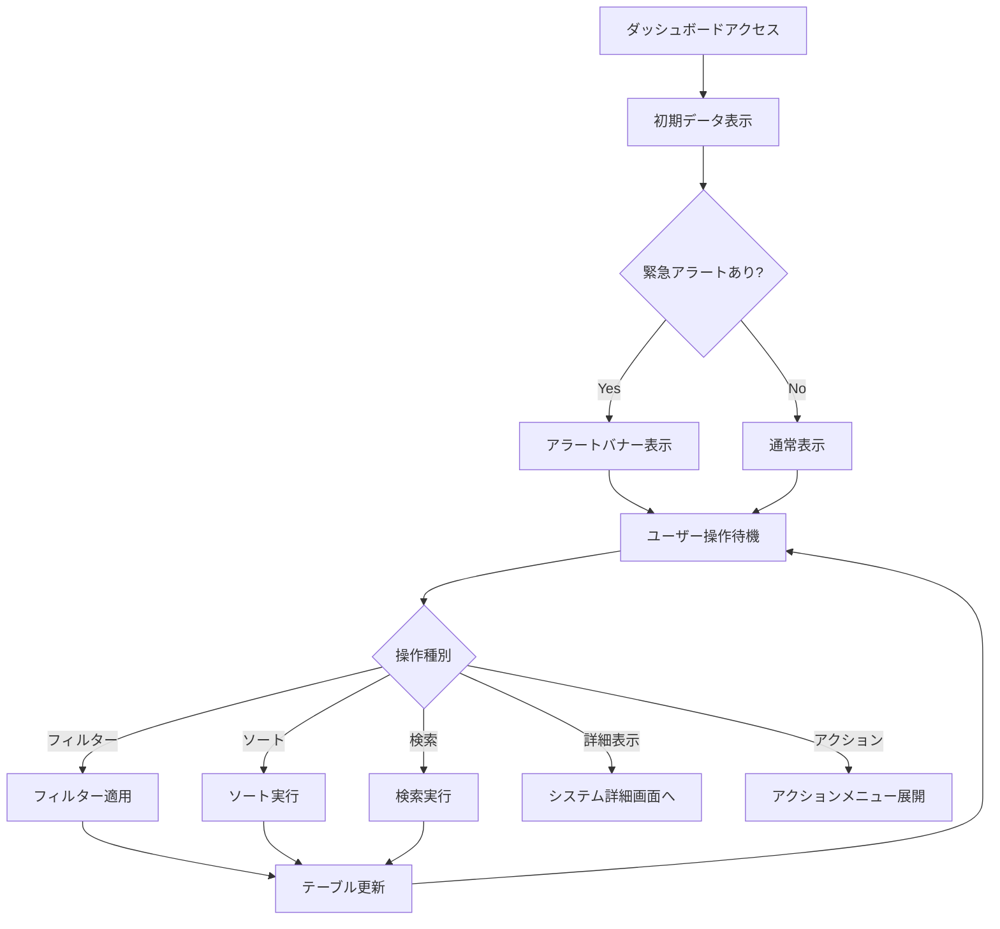
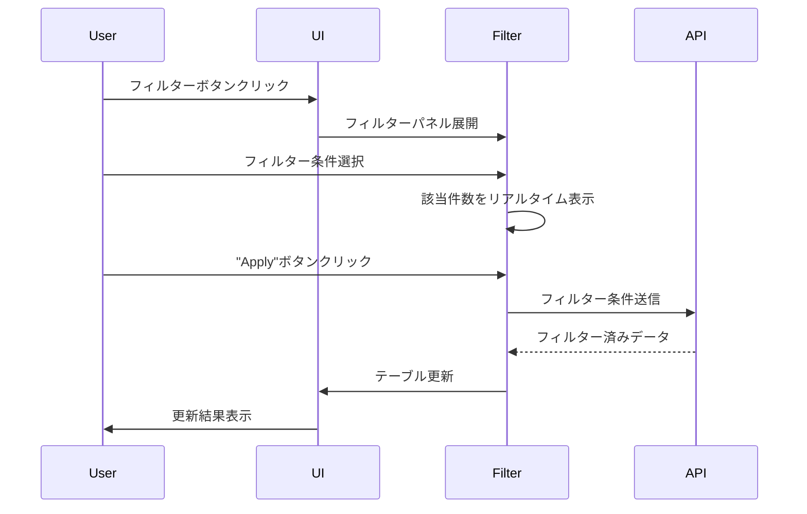

# US-SM-006-005: ダッシュボードUI/UX設計仕様書

**担当**: UX/UIデザイナー
**作成日**: 2025-09-30
**Issue**: #174 (US-SM-006-005: ダッシュボードUI/UX設計)
**親Issue**: US-SM-006 (ダッシュボード表示)
**関連設計**: US-SM-006-001 (ダッシュボード機能のドメイン設計), US-SM-006-004 (ダッシュボードデータベース設計)

## 1. 設計概要

### 1.1 設計目的

本設計書は、製造業向けセキュリティリスク管理システムにおけるダッシュボード画面のUI/UX設計を定義します。ダッシュボードは、システム全体の健全性、脆弱性リスク、EOL警告、タスクステータスを一目で把握できる管理者向けの中心的なインターフェースです。

### 1.2 設計原則

#### ユーザー中心設計

- **ターゲットユーザー**: システム管理者、セキュリティ担当者、IT運用担当者
- **ユーザー特性**: 技術的な知識があり、迅速な意思決定が必要
- **使用コンテキスト**: 日常的な監視、緊急時の対応、定期レビュー

#### 情報デザイン原則

1. **視覚的階層性**: 重要度に応じた情報の配置とサイズ
2. **認知負荷の最小化**: 必要な情報のみを適切なタイミングで提示
3. **アクショナブル**: 表示された情報から直接アクションが取れる
4. **一貫性**: プロジェクト全体のデザインシステムに準拠

#### パフォーマンス要件

- **初期表示**: 2秒未満
- **フィルタ/ソート操作**: 500ms未満
- **リアルタイム更新**: 30秒間隔の自動リフレッシュ
- **同時ユーザー**: 5-10人を想定

### 1.3 デザイン成果物

1. ダッシュボードレイアウト設計
2. 情報配置とビジュアル階層
3. システム状況の視覚的表現
4. 緊急対応システムのハイライト表示
5. フィルタリング・ソート機能のUI設計
6. レスポンシブデザイン対応

## 2. ダッシュボードレイアウト設計

### 2.1 全体構成

ダッシュボードは3層構造で設計します：

```text
┌─────────────────────────────────────────────────────────────────┐
│ Header: グローバルナビゲーション、ユーザー情報、通知           │
├─────────────────────────────────────────────────────────────────┤
│ Dashboard Header: タイトル、リフレッシュ、フィルター、ビュー切替│
├─────────────────────────────────────────────────────────────────┤
│ Layer 1: 統計サマリーカード (4カラムグリッド)                  │
├─────────────────────────────────────────────────────────────────┤
│ Layer 2: 重要アラート・緊急対応エリア (2カラムグリッド)        │
├─────────────────────────────────────────────────────────────────┤
│ Layer 3: システム一覧テーブル (フル幅)                         │
└─────────────────────────────────────────────────────────────────┘
```

### 2.2 レイアウトグリッドシステム

#### デスクトップ (1280px以上)

- **コンテナ幅**: 最大1440px (中央寄せ)
- **グリッド**: 12カラムグリッド
- **ガター**: 24px
- **マージン**: 左右32px

#### タブレット (768px - 1279px)

- **コンテナ幅**: 100% - 32px margin
- **グリッド**: 8カラムグリッド
- **ガター**: 16px
- **マージン**: 左右16px

#### モバイル (767px以下)

- **コンテナ幅**: 100% - 16px margin
- **グリッド**: 4カラムグリッド (カードスタック表示)
- **ガター**: 12px
- **マージン**: 左右16px

### 2.3 Layer 1: 統計サマリーカード

4つの主要メトリクスをカード形式で配置します。

#### 配置構成 (デスクトップ)

```text
┌──────────────┬──────────────┬──────────────┬──────────────┐
│ Card 1:      │ Card 2:      │ Card 3:      │ Card 4:      │
│ 総システム数 │ 脆弱性統計   │ EOL警告      │ タスク統計   │
│              │              │              │              │
│ [数値]       │ [数値]       │ [数値]       │ [数値]       │
│ [サブ情報]   │ [サブ情報]   │ [サブ情報]   │ [サブ情報]   │
│ [トレンド]   │ [トレンド]   │ [トレンド]   │ [トレンド]   │
└──────────────┴──────────────┴──────────────┴──────────────┘
```

#### カード仕様

**サイズ**:

- 高さ: 160px固定
- 幅: 12カラムの3カラム分 (25%ずつ)

**内容構成**:

1. **タイトル**: 14px, Medium, Gray-700
2. **主要数値**: 36px, Bold, 状態に応じた色
3. **サブ情報**: 12px, Regular, Gray-600 (2行まで)
4. **トレンドインジケーター**: アイコン + パーセンテージ (前週比など)

**カード別詳細**:

##### Card 1: 総システム数

```text
┌─────────────────────────┐
│ 総システム数            │
│                         │
│      127               │ ← 大きな数値 (Blue-600)
│                         │
│ Active: 105             │ ← サブ情報
│ Maintenance: 15         │
│ Inactive: 7             │
│                         │
│ ↑ 2.4% from last week  │ ← トレンド (Green/Red)
└─────────────────────────┘
```

##### Card 2: 脆弱性統計

```text
┌─────────────────────────┐
│ 脆弱性アラート          │
│                         │
│      23                │ ← Critical数 (Red-600)
│                         │
│ Critical: 23            │
│ High: 45                │
│ Total Affected: 38      │
│                         │
│ ⚠ +3 new this week     │ ← トレンド (Red/Yellow)
└─────────────────────────┘
```

##### Card 3: EOL警告

```text
┌─────────────────────────┐
│ EOL警告                 │
│                         │
│      12                │ ← 警告数 (Orange-600)
│                         │
│ Within 30 days: 5       │
│ Within 90 days: 7       │
│ Systems affected: 12    │
│                         │
│ ⚠ Urgent action needed │ ← 状態表示
└─────────────────────────┘
```

##### Card 4: タスク統計

```text
┌─────────────────────────┐
│ タスク進捗              │
│                         │
│      8                 │ ← Overdue数 (Red-600)
│                         │
│ Overdue: 8              │
│ Urgent: 15              │
│ Open: 47                │
│                         │
│ ⬇ -5 completed today   │ ← トレンド (Green)
└─────────────────────────┘
```

### 2.4 Layer 2: 重要アラート・緊急対応エリア

クリティカルな情報を2カラムで配置します。

```text
┌──────────────────────────────┬──────────────────────────────┐
│ Left Panel:                  │ Right Panel:                 │
│ 緊急対応が必要なシステム     │ 最近検出された脆弱性         │
│                              │                              │
│ [システムリスト (5件)]       │ [脆弱性リスト (5件)]         │
│ - CVSS 9.0+ 脆弱性           │ - 検出日時降順               │
│ - EOL 30日以内               │ - CVSS 7.0以上のみ表示       │
│ - 期限切れタスク             │                              │
│                              │                              │
│ [View All →]                 │ [View All →]                 │
└──────────────────────────────┴──────────────────────────────┘
```

#### 左パネル: 緊急対応が必要なシステム

**表示条件** (優先度順):

1. CVSS 9.0以上の脆弱性を持つシステム
2. EOL まで30日以内のシステム
3. 期限切れタスクを持つシステム

**リストアイテム構成**:

```text
┌────────────────────────────────────────────────────────┐
│ [危険度アイコン] システム名                          │
│ システムタイプ | Critical                              │
│                                                        │
│ ⚠ CVSS 9.8 vulnerability detected                     │ ← 主要アラート
│ 📦 3 packages reaching EOL in 15 days                 │ ← セカンダリ情報
│                                                        │
│ [View Details] [Take Action]                          │ ← アクションボタン
└────────────────────────────────────────────────────────┘
```

#### 右パネル: 最近検出された脆弱性

**表示条件**:

- 過去7日以内に検出
- CVSS 7.0以上
- 最新5件を表示

**リストアイテム構成**:

```text
┌────────────────────────────────────────────────────────┐
│ [重要度バッジ] CVE-2025-1234                          │
│ CVSS 9.8 | Critical                                    │
│                                                        │
│ Affected: 3 systems                                    │
│ Detected: 2 hours ago                                  │
│                                                        │
│ [View Details] [Create Task]                          │
└────────────────────────────────────────────────────────┘
```

### 2.5 Layer 3: システム一覧テーブル

フル幅のデータテーブルで全システムを表示します。

#### テーブル構造

```text
┌──────┬──────────────┬────────┬──────────┬────────┬────────┬────────┬──────────┐
│ 状態 │ システム名   │ タイプ │ 重要度   │ 脆弱性 │ EOL    │ タスク │ アクション│
├──────┼──────────────┼────────┼──────────┼────────┼────────┼────────┼──────────┤
│ [●]  │ Prod-Web-01  │ Web    │ Critical │  3/0   │ 45日   │ 2/0    │ [...]    │
│      │ 本番Webサーバ│ Server │ [RED]    │ [RED]  │ [OK]   │ [OK]   │          │
├──────┼──────────────┼────────┼──────────┼────────┼────────┼────────┼──────────┤
│ [●]  │ DB-Master-01 │ Database│ Critical│  0/0   │ 15日   │ 1/1    │ [...]    │
│      │ マスターDB   │        │ [RED]    │ [OK]   │ [WARN] │ [WARN] │          │
└──────┴──────────────┴────────┴──────────┴────────┴────────┴────────┴──────────┘
```

#### カラム定義

| カラム名 | 幅 | 内容 | ソート | フィルター |
|---------|-----|------|--------|-----------|
| 状態 | 60px | ステータスインジケーター | ○ | ○ |
| システム名 | 可変 (25%) | 名前 + サブテキスト | ○ | 検索 |
| タイプ | 120px | システムタイプ | ○ | ○ |
| 重要度 | 100px | Criticalityバッジ | ○ | ○ |
| 脆弱性 | 120px | Critical/High数 | ○ | ○ |
| EOL | 100px | 最短EOL残日数 | ○ | ○ |
| タスク | 120px | Urgent/Overdue数 | ○ | ○ |
| アクション | 80px | メニューボタン | - | - |

#### セル内容の詳細設計

##### 状態カラム

```text
┌────────┐
│   ●    │ ← ステータス色
│ Active │ ← ツールチップ
└────────┘

色の定義:
- 緑 (Green-500): Active - 正常稼働中
- 黄 (Yellow-500): Maintenance - メンテナンス中
- 灰 (Gray-400): Inactive - 停止中
- 赤 (Red-500): Critical - 緊急対応必要
```

##### 脆弱性カラム

```text
┌─────────────┐
│  3  /  5    │ ← Critical / High 数
│ [RED] [ORG] │ ← 色付きバッジ
│             │
│ 12 total    │ ← ツールチップ: 総脆弱性数
└─────────────┘

表示ロジック:
- Critical > 0: 赤背景、太字
- High > 0: オレンジ背景
- 0/0: グレーテキスト
```

##### EOLカラム

```text
┌─────────────┐
│   15 days   │ ← 最短EOL残日数
│   [⚠]      │ ← 警告アイコン
│             │
│ 3 packages  │ ← ツールチップ: 対象パッケージ数
└─────────────┘

色の定義:
- < 30日: 赤 (Red-600) + 警告アイコン
- 30-90日: オレンジ (Orange-600)
- > 90日: グリーン (Green-600)
- 警告なし: グレー (Gray-600)
```

##### タスクカラム

```text
┌─────────────┐
│  1  /  2    │ ← Overdue / Urgent 数
│ [RED] [YEL] │ ← 色付きバッジ
│             │
│ 8 open      │ ← ツールチップ: オープンタスク数
└─────────────┘

表示ロジック:
- Overdue > 0: 赤背景、太字
- Urgent > 0: 黄背景
- 0/0: グレーテキスト
```

## 3. 視覚的表現設計

### 3.1 カラーシステム

#### 状態色の定義

```typescript
// 重要度レベル (Criticality)
const CRITICALITY_COLORS = {
  CRITICAL: {
    bg: '#FEE2E2',      // Red-100
    text: '#991B1B',    // Red-800
    border: '#DC2626',  // Red-600
  },
  HIGH: {
    bg: '#FEF3C7',      // Yellow-100
    text: '#92400E',    // Yellow-800
    border: '#F59E0B',  // Yellow-600
  },
  MEDIUM: {
    bg: '#DBEAFE',      // Blue-100
    text: '#1E40AF',    // Blue-800
    border: '#3B82F6',  // Blue-600
  },
  LOW: {
    bg: '#F3F4F6',      // Gray-100
    text: '#374151',    // Gray-700
    border: '#9CA3AF',  // Gray-400
  },
};

// ステータス色 (System Status)
const STATUS_COLORS = {
  ACTIVE: {
    indicator: '#10B981',   // Green-500
    bg: '#D1FAE5',          // Green-100
    text: '#065F46',        // Green-800
  },
  MAINTENANCE: {
    indicator: '#F59E0B',   // Yellow-500
    bg: '#FEF3C7',          // Yellow-100
    text: '#92400E',        // Yellow-800
  },
  INACTIVE: {
    indicator: '#9CA3AF',   // Gray-400
    bg: '#F3F4F6',          // Gray-100
    text: '#374151',        // Gray-700
  },
  CRITICAL_ALERT: {
    indicator: '#EF4444',   // Red-500
    bg: '#FEE2E2',          // Red-100
    text: '#991B1B',        // Red-800
  },
};

// 脆弱性レベル色 (Vulnerability Severity)
const VULNERABILITY_COLORS = {
  CRITICAL: '#DC2626',  // Red-600 (CVSS 9.0-10.0)
  HIGH: '#F59E0B',      // Orange-600 (CVSS 7.0-8.9)
  MEDIUM: '#3B82F6',    // Blue-600 (CVSS 4.0-6.9)
  LOW: '#6B7280',       // Gray-600 (CVSS 0.1-3.9)
  NONE: '#E5E7EB',      // Gray-200
};

// EOL警告色
const EOL_COLORS = {
  CRITICAL: '#DC2626',  // < 30日
  WARNING: '#F59E0B',   // 30-90日
  OK: '#10B981',        // > 90日
  NONE: '#9CA3AF',      // 警告なし
};
```

#### ベースカラーパレット

```typescript
// カラーパレット定義 (docs/design/ux-ui-design-concept.md準拠)
const COLORS = {
  // Primary (Blue) - Tailwind blue
  primary: {
    50: '#eff6ff',   // blue-50
    100: '#dbeafe',  // blue-100
    500: '#3b82f6',  // blue-500
    600: '#2563eb',  // blue-600
    700: '#1d4ed8',  // blue-700
    800: '#1e40af',  // blue-800
    900: '#1e3a8a',  // blue-900
  },

  // Success (Green) - Tailwind green
  success: {
    50: '#f0fdf4',   // green-50
    100: '#dcfce7',  // green-100
    500: '#22c55e',  // green-500
    600: '#16a34a',  // green-600
    700: '#15803d',  // green-700
  },

  // Warning (Amber) - Tailwind amber
  warning: {
    50: '#fffbeb',   // amber-50
    100: '#fef3c7',  // amber-100
    500: '#f59e0b',  // amber-500
    600: '#d97706',  // amber-600
    700: '#b45309',  // amber-700
  },

  // Danger (Red) - Tailwind red
  danger: {
    50: '#fef2f2',   // red-50
    100: '#fee2e2',  // red-100
    500: '#ef4444',  // red-500
    600: '#dc2626',  // red-600
    700: '#b91c1c',  // red-700
  },

  // Neutral (Slate) - Tailwind slate
  neutral: {
    50: '#f8fafc',   // slate-50
    100: '#f1f5f9',  // slate-100
    200: '#e2e8f0',  // slate-200
    300: '#cbd5e1',  // slate-300
    400: '#94a3b8',  // slate-400
    600: '#475569',  // slate-600
    700: '#334155',  // slate-700
    900: '#0f172a',  // slate-900
  },
};
```

### 3.2 タイポグラフィ

#### フォントファミリー (docs/design/ux-ui-design-concept.md準拠)

```css
/* プライマリフォント：可読性重視 */
font-family: 'Noto Sans JP', 'Hiragino Kaku Gothic ProN', 'Yu Gothic', 'Meiryo', sans-serif;

/* モノスペースフォント：システムID、コード表示 */
--font-mono: 'JetBrains Mono', 'Consolas', 'Monaco', monospace;

/* 数値フォント：スコア、メトリクス表示 */
--font-numeric: 'Inter', 'Roboto', sans-serif;
```

#### 文字サイズスケール (Tailwind CSS準拠)

```typescript
// フォントサイズマッピング (Tailwind CSS)
const FONT_SIZES = {
  // ヘッダー (Tailwind text-* classes)
  'display-xl': 'text-4xl',     // 36px (2.25rem): h1 ページタイトル
  'display-lg': 'text-3xl',     // 30px (1.875rem): h2 セクションタイトル
  'display-md': 'text-2xl',     // 24px (1.5rem): h3 サブセクション
  'display-sm': 'text-xl',      // 20px (1.25rem): h4 カードタイトル

  // ボディ
  'body-lg': 'text-lg',         // 18px (1.125rem): 大きめボディテキスト
  'body-base': 'text-base',     // 16px (1rem): 標準ボディテキスト
  'body-sm': 'text-sm',         // 14px (0.875rem): 小さめテキスト
  'caption': 'text-xs',         // 12px (0.75rem): キャプション、ラベル

  // 特殊用途
  'score-xl': 'text-5xl',       // 48px (3rem): CVSSスコア大表示
  'metric-lg': 'text-3xl',      // 32px (2rem): メトリクス表示
};

const FONT_WEIGHTS = {
  regular: 400,
  medium: 500,
  semibold: 600,
  bold: 700,
};

// 実際のピクセル値対応表
const PIXEL_SIZES = {
  h1: '36px',   // text-4xl
  h2: '30px',   // text-3xl
  h3: '24px',   // text-2xl
  h4: '20px',   // text-xl
  body: '16px', // text-base
  small: '14px', // text-sm
  xs: '12px',   // text-xs
};
```

### 3.3 アイコンシステム

#### アイコンライブラリ

- **ベースライブラリ**: Heroicons v2 (Outline/Solid)
- **サイズ**: 16px, 20px, 24px, 32px

#### 主要アイコン定義

```typescript
const ICONS = {
  // ステータス
  active: 'CheckCircleIcon',
  maintenance: 'WrenchScrewdriverIcon',
  inactive: 'MinusCircleIcon',
  critical: 'ExclamationTriangleIcon',

  // アクション
  refresh: 'ArrowPathIcon',
  filter: 'FunnelIcon',
  sort: 'BarsArrowUpIcon',
  search: 'MagnifyingGlassIcon',
  moreActions: 'EllipsisVerticalIcon',

  // データタイプ
  vulnerability: 'ShieldExclamationIcon',
  eol: 'CalendarDaysIcon',
  task: 'ClipboardDocumentCheckIcon',
  package: 'CubeIcon',

  // トレンド
  trendUp: 'ArrowTrendingUpIcon',
  trendDown: 'ArrowTrendingDownIcon',
  trendFlat: 'MinusIcon',
};
```

### 3.4 コンポーネントスタイル

#### カードコンポーネント

```css
.metric-card {
  background: white;
  border-radius: 12px;
  border: 1px solid #E5E7EB;
  padding: 24px;
  box-shadow: 0 1px 3px 0 rgba(0, 0, 0, 0.1);
  transition: box-shadow 0.2s ease;
}

.metric-card:hover {
  box-shadow: 0 4px 6px -1px rgba(0, 0, 0, 0.1);
}

.metric-card__title {
  font-size: 14px;
  font-weight: 500;
  color: #374151;
  margin-bottom: 12px;
}

.metric-card__value {
  font-size: 36px;
  font-weight: 700;
  line-height: 1;
  margin-bottom: 16px;
}

.metric-card__subtext {
  font-size: 12px;
  color: #6B7280;
  line-height: 1.5;
}
```

#### バッジコンポーネント

```css
.badge {
  display: inline-flex;
  align-items: center;
  padding: 4px 12px;
  border-radius: 16px;
  font-size: 12px;
  font-weight: 600;
  line-height: 1;
}

.badge--critical {
  background-color: #FEE2E2;
  color: #991B1B;
}

.badge--high {
  background-color: #FEF3C7;
  color: #92400E;
}

.badge--medium {
  background-color: #DBEAFE;
  color: #1E40AF;
}

.badge--low {
  background-color: #F3F4F6;
  color: #374151;
}
```

#### テーブルスタイル

```css
.data-table {
  width: 100%;
  border-collapse: separate;
  border-spacing: 0;
  background: white;
  border-radius: 12px;
  border: 1px solid #E5E7EB;
  overflow: hidden;
}

.data-table__header {
  background-color: #F9FAFB;
  border-bottom: 1px solid #E5E7EB;
}

.data-table__header-cell {
  padding: 12px 16px;
  text-align: left;
  font-size: 12px;
  font-weight: 600;
  color: #374151;
  text-transform: uppercase;
  letter-spacing: 0.05em;
}

.data-table__row {
  border-bottom: 1px solid #F3F4F6;
  transition: background-color 0.15s ease;
}

.data-table__row:hover {
  background-color: #F9FAFB;
}

.data-table__cell {
  padding: 16px;
  font-size: 14px;
  color: #111827;
  vertical-align: middle;
}
```

## 4. 緊急対応システムのハイライト表示

### 4.1 緊急度の定義

システムの緊急度を3段階で分類します：

#### Level 1: CRITICAL (最優先対応)

**条件** (いずれか1つに該当):

- CVSS 9.0以上の脆弱性を持つ
- EOLまで7日以内
- 重要度CRITICALかつ期限切れタスクあり

**視覚的表現**:

- 背景色: Red-50 (#FEF2F2)
- 左ボーダー: Red-600 (4px太線)
- アイコン: 赤い警告アイコン (振動アニメーション)
- テキスト: Red-900

#### Level 2: HIGH (早期対応推奨)

**条件** (いずれか1つに該当):

- CVSS 7.0-8.9の脆弱性を持つ
- EOLまで30日以内
- 緊急タスクあり

**視覚的表現**:

- 背景色: Orange-50 (#FFF7ED)
- 左ボーダー: Orange-500 (3px)
- アイコン: オレンジの警告アイコン
- テキスト: Orange-900

#### Level 3: MEDIUM (通常監視)

**条件**:

- 上記以外の注意が必要なシステム

**視覚的表現**:

- 背景色: 白
- 左ボーダー: Blue-400 (2px)
- アイコン: 青い情報アイコン
- テキスト: Gray-900

### 4.2 ハイライト表示の実装

#### テーブル行のハイライト

```css
/* CRITICAL Level */
.table-row--critical {
  background-color: #FEF2F2;
  border-left: 4px solid #DC2626;
  position: relative;
}

.table-row--critical::before {
  content: '';
  position: absolute;
  left: 0;
  top: 0;
  bottom: 0;
  width: 4px;
  background: linear-gradient(
    180deg,
    #DC2626 0%,
    #EF4444 100%
  );
  animation: pulse-critical 2s ease-in-out infinite;
}

@keyframes pulse-critical {
  0%, 100% { opacity: 1; }
  50% { opacity: 0.7; }
}

/* HIGH Level */
.table-row--high {
  background-color: #FFF7ED;
  border-left: 3px solid #F59E0B;
}

/* MEDIUM Level */
.table-row--medium {
  border-left: 2px solid #60A5FA;
}
```

#### カードハイライト

```css
.alert-card--critical {
  border: 2px solid #DC2626;
  box-shadow: 0 4px 6px -1px rgba(220, 38, 38, 0.2);
}

.alert-card--critical .alert-card__icon {
  animation: shake 0.5s ease-in-out infinite;
}

@keyframes shake {
  0%, 100% { transform: translateX(0); }
  25% { transform: translateX(-4px); }
  75% { transform: translateX(4px); }
}
```

### 4.3 緊急アラートバナー

画面最上部にシステム全体の緊急アラートを表示します。

```text
┌─────────────────────────────────────────────────────────────┐
│ [⚠] 3 systems require immediate attention                   │
│                                                     [View →] │
└─────────────────────────────────────────────────────────────┘
```

**表示条件**:

- CRITICALレベルのシステムが1つ以上存在する

**バナースタイル**:

```css
.alert-banner {
  background: linear-gradient(
    135deg,
    #FEE2E2 0%,
    #FCA5A5 100%
  );
  border: 1px solid #DC2626;
  border-radius: 8px;
  padding: 16px 24px;
  margin-bottom: 24px;
  display: flex;
  align-items: center;
  justify-content: space-between;
}

.alert-banner__icon {
  color: #991B1B;
  font-size: 24px;
  margin-right: 12px;
  animation: pulse 2s ease-in-out infinite;
}
```

## 5. フィルタリング・ソート機能のUI設計

### 5.1 フィルターパネル

ダッシュボードヘッダー内に折りたたみ可能なフィルターパネルを配置します。

#### レイアウト

```text
┌─────────────────────────────────────────────────────────────┐
│ Dashboard Header                                            │
├─────────────────────────────────────────────────────────────┤
│ [🔍 Search] [🔽 Filters] [↻ Refresh] [⚙ View Options]      │
├─────────────────────────────────────────────────────────────┤
│ [Filters Panel - Collapsed by default]                     │
│                                                             │
│ Status:        [All ▼] [Active] [Maintenance] [Inactive]   │
│ Criticality:   [All ▼] [Critical] [High] [Medium] [Low]    │
│ Vulnerability: [ ] Has vulnerabilities  [ ] Critical only   │
│ EOL Warning:   [ ] Show EOL warnings    [ ] < 30 days only  │
│ Tasks:         [ ] Has open tasks       [ ] Has overdue     │
│                                                             │
│ [Clear All]                              [Apply Filters]    │
└─────────────────────────────────────────────────────────────┘
```

#### フィルター項目定義

```typescript
interface DashboardFilters {
  // テキスト検索
  searchQuery?: string;

  // システム属性
  systemStatus?: SystemStatus[];      // ACTIVE, MAINTENANCE, INACTIVE
  systemType?: SystemType[];          // WEB_SERVER, DATABASE, etc.
  criticality?: CriticalityLevel[];   // CRITICAL, HIGH, MEDIUM, LOW
  securityClassification?: SecurityClassification[];

  // 脆弱性フィルター
  hasVulnerabilities?: boolean;
  criticalVulnerabilitiesOnly?: boolean;
  cvssScoreMin?: number;              // 0.0 - 10.0

  // EOLフィルター
  hasEOLWarnings?: boolean;
  eolWithin30Days?: boolean;
  eolWithin90Days?: boolean;

  // タスクフィルター
  hasOpenTasks?: boolean;
  hasOverdueTasks?: boolean;
  hasUrgentTasks?: boolean;
}
```

#### フィルターUI コンポーネント

```typescript
// Multi-select dropdown
<FilterDropdown
  label="Status"
  options={[
    { value: 'ACTIVE', label: 'Active', count: 105 },
    { value: 'MAINTENANCE', label: 'Maintenance', count: 15 },
    { value: 'INACTIVE', label: 'Inactive', count: 7 },
  ]}
  selected={selectedStatuses}
  onChange={handleStatusChange}
/>

// Checkbox filter
<FilterCheckbox
  label="Has vulnerabilities"
  checked={filters.hasVulnerabilities}
  onChange={handleVulnerabilityFilter}
  badge={23} // 該当件数
/>

// Range filter
<FilterRange
  label="CVSS Score"
  min={0}
  max={10}
  step={0.1}
  value={filters.cvssScoreMin}
  onChange={handleCVSSFilter}
/>
```

### 5.2 検索機能

#### 検索ボックス

```text
┌──────────────────────────────────────┐
│ 🔍 Search systems...                │
│                                      │
│ [Dropdown: Recent Searches]         │
└──────────────────────────────────────┘
```

**機能**:

- システム名での部分一致検索
- システムタイプでの検索
- システムIDでの検索
- リアルタイム検索 (300msデバウンス)
- 最近の検索履歴 (5件)

**実装詳細**:

```typescript
const SearchBox: React.FC = () => {
  const [query, setQuery] = useState('');
  const debouncedSearch = useDebounce(query, 300);

  useEffect(() => {
    if (debouncedSearch) {
      performSearch(debouncedSearch);
    }
  }, [debouncedSearch]);

  return (
    <div className="search-box">
      <MagnifyingGlassIcon className="search-box__icon" />
      <input
        type="text"
        placeholder="Search systems..."
        value={query}
        onChange={(e) => setQuery(e.target.value)}
        className="search-box__input"
      />
      {query && (
        <XMarkIcon
          className="search-box__clear"
          onClick={() => setQuery('')}
        />
      )}
    </div>
  );
};
```

### 5.3 ソート機能

#### ソート可能カラム

テーブルヘッダーをクリックでソート方向を切り替えます。

```text
┌────────────────────────────────────────────┐
│ System Name ↑  | Type | Criticality ↓ ... │ ← ソートインジケーター
└────────────────────────────────────────────┘
```

**ソート状態**:

1. 未ソート (デフォルト)
2. 昇順 (↑)
3. 降順 (↓)

**デフォルトソート**:

- 第1ソート: 緊急度 (降順)
- 第2ソート: 更新日時 (降順)

#### ソート項目定義

```typescript
type SortableColumn =
  | 'systemName'
  | 'systemType'
  | 'criticality'
  | 'vulnerabilityCount'
  | 'eolDaysRemaining'
  | 'openTaskCount'
  | 'lastUpdated';

interface SortOptions {
  column: SortableColumn;
  direction: 'asc' | 'desc';
}
```

#### ソートUI実装

```typescript
const SortableHeader: React.FC<{
  column: SortableColumn;
  label: string;
  currentSort: SortOptions;
  onSort: (column: SortableColumn) => void;
}> = ({ column, label, currentSort, onSort }) => {
  const isActive = currentSort.column === column;
  const direction = isActive ? currentSort.direction : null;

  return (
    <th
      className="sortable-header"
      onClick={() => onSort(column)}
    >
      <div className="sortable-header__content">
        <span>{label}</span>
        {isActive && (
          <span className="sortable-header__icon">
            {direction === 'asc' ? (
              <ChevronUpIcon />
            ) : (
              <ChevronDownIcon />
            )}
          </span>
        )}
      </div>
    </th>
  );
};
```

### 5.4 クイックフィルター

よく使用するフィルターをワンクリックで適用できるプリセットを提供します。

```text
┌─────────────────────────────────────────────────────────────┐
│ Quick Filters:                                              │
│ [All Systems] [Critical] [Has Vulnerabilities] [EOL Soon]  │
└─────────────────────────────────────────────────────────────┘
```

**プリセット定義**:

```typescript
const QUICK_FILTERS = {
  all: {
    label: 'All Systems',
    filters: {},
  },
  critical: {
    label: 'Critical Systems',
    filters: {
      criticality: ['CRITICAL'],
    },
  },
  vulnerabilities: {
    label: 'Has Vulnerabilities',
    filters: {
      hasVulnerabilities: true,
    },
  },
  eolSoon: {
    label: 'EOL Soon',
    filters: {
      eolWithin30Days: true,
    },
  },
  needsAttention: {
    label: 'Needs Attention',
    filters: {
      criticalVulnerabilitiesOnly: true,
      hasOverdueTasks: true,
    },
  },
};
```

### 5.5 フィルター状態の表示

適用中のフィルターをバッジ形式で表示します。

```text
┌─────────────────────────────────────────────────────────────┐
│ Active Filters:                                             │
│ [Criticality: Critical ✕] [Has vulnerabilities ✕]          │
│                                      [Clear All Filters]    │
└─────────────────────────────────────────────────────────────┘
```

**実装**:

```typescript
const ActiveFilters: React.FC<{
  filters: DashboardFilters;
  onRemoveFilter: (key: string) => void;
  onClearAll: () => void;
}> = ({ filters, onRemoveFilter, onClearAll }) => {
  const activeFilters = Object.entries(filters).filter(
    ([_, value]) => value !== undefined && value !== null
  );

  if (activeFilters.length === 0) return null;

  return (
    <div className="active-filters">
      <span className="active-filters__label">Active Filters:</span>
      {activeFilters.map(([key, value]) => (
        <Badge
          key={key}
          label={formatFilterLabel(key, value)}
          onRemove={() => onRemoveFilter(key)}
        />
      ))}
      <button
        className="active-filters__clear"
        onClick={onClearAll}
      >
        Clear All
      </button>
    </div>
  );
};
```

## 6. インタラクション設計

### 6.1 ユーザーフロー

#### メインフロー



#### フィルター操作フロー



### 6.2 ホバー・フォーカス効果

#### カードホバー

```css
.metric-card {
  transition:
    transform 0.2s ease,
    box-shadow 0.2s ease;
}

.metric-card:hover {
  transform: translateY(-4px);
  box-shadow: 0 10px 15px -3px rgba(0, 0, 0, 0.1);
}
```

#### テーブル行ホバー

```css
.table-row {
  transition: background-color 0.15s ease;
}

.table-row:hover {
  background-color: #F9FAFB;
  cursor: pointer;
}

.table-row:hover .action-button {
  opacity: 1;
  pointer-events: auto;
}
```

#### ボタンホバー

```css
.button {
  transition:
    background-color 0.2s ease,
    transform 0.1s ease;
}

.button:hover {
  background-color: #2563EB;
  transform: scale(1.02);
}

.button:active {
  transform: scale(0.98);
}
```

### 6.3 ローディング状態

#### スケルトンスクリーン

初期ロード時はスケルトンスクリーンを表示します。

```text
┌─────────────────────────────────────────────────────┐
│ ┌───────────┐ ┌───────────┐ ┌───────────┐ ┌───────┐ │
│ │░░░░░░░░░░░│ │░░░░░░░░░░░│ │░░░░░░░░░░░│ │░░░░░░░│ │ ← スケルトン
│ │░░░░░░░░░░░│ │░░░░░░░░░░░│ │░░░░░░░░░░░│ │░░░░░░░│ │   カード
│ └───────────┘ └───────────┘ └───────────┘ └───────┘ │
│                                                     │
│ ┌─────────────────────────────────────────────────┐ │
│ │░░░░░░░░░░░░░░░░░░░░░░░░░░░░░░░░░░░░░░░░░░░░░░░│ │ ← スケルトン
│ │░░░░░░░░░░░░░░░░░░░░░░░░░░░░░░░░░░░░░░░░░░░░░░░│ │   テーブル
│ └─────────────────────────────────────────────────┘ │
└─────────────────────────────────────────────────────┘
```

**実装**:

```css
@keyframes skeleton-loading {
  0% { background-position: -200% 0; }
  100% { background-position: 200% 0; }
}

.skeleton {
  background: linear-gradient(
    90deg,
    #F3F4F6 0%,
    #E5E7EB 50%,
    #F3F4F6 100%
  );
  background-size: 200% 100%;
  animation: skeleton-loading 1.5s ease-in-out infinite;
}
```

#### インラインローディング

フィルター適用時やデータ更新時は、テーブル上部にローディングバーを表示します。

```text
┌─────────────────────────────────────────────────────┐
│ [━━━━━━━━━━━━━━━━━━━━━━━━━━━━━░░░░░░░] Loading...  │ ← プログレスバー
├─────────────────────────────────────────────────────┤
│ [テーブル内容は薄く表示]                            │
└─────────────────────────────────────────────────────┘
```

#### リフレッシュアニメーション

リフレッシュボタンクリック時にアイコンを回転させます。

```css
.refresh-button.loading .icon {
  animation: spin 1s linear infinite;
}

@keyframes spin {
  from { transform: rotate(0deg); }
  to { transform: rotate(360deg); }
}
```

### 6.4 エラーハンドリング

#### エラー表示パターン

**パターン1: インライン通知**:

```text
┌─────────────────────────────────────────────────────┐
│ ⚠ Failed to load dashboard data.                    │
│   [Retry]                              [Dismiss]    │
└─────────────────────────────────────────────────────┘
```

**パターン2: フォールバックUI**:

```text
┌─────────────────────────────────────────────────────┐
│              🔌                                      │
│        Connection Lost                              │
│                                                     │
│  Unable to fetch dashboard data.                    │
│  Please check your connection and try again.        │
│                                                     │
│              [Retry]                                │
└─────────────────────────────────────────────────────┘
```

**パターン3: トースト通知**:

```text
┌─────────────────────────────────┐
│ ✓ Dashboard updated             │ ← 右上に表示
│                         [✕]     │   3秒後自動消去
└─────────────────────────────────┘
```

## 7. レスポンシブデザイン

### 7.1 ブレークポイント定義

```typescript
const BREAKPOINTS = {
  mobile: '0px',      // 0 - 767px
  tablet: '768px',    // 768px - 1279px
  desktop: '1280px',  // 1280px - 1919px
  wide: '1920px',     // 1920px +
};
```

### 7.2 デスクトップ (1280px以上)

前述のレイアウトをそのまま使用します。

- 4カラムグリッドの統計カード
- 2カラムの重要アラートエリア
- フル幅テーブル (全カラム表示)

### 7.3 タブレット (768px - 1279px)

#### 統計カード

```text
┌──────────────┬──────────────┐
│ Card 1       │ Card 2       │
├──────────────┼──────────────┤
│ Card 3       │ Card 4       │
└──────────────┴──────────────┘
```

- 2カラムグリッドに変更
- カード高さは同じ (160px)

#### 重要アラートエリア

縦積みに変更:

```text
┌──────────────────────────────┐
│ 緊急対応が必要なシステム     │
└──────────────────────────────┘
┌──────────────────────────────┐
│ 最近検出された脆弱性         │
└──────────────────────────────┘
```

#### テーブル

一部カラムを非表示:

| 表示 | カラム |
|------|-------|
| ○ | 状態 |
| ○ | システム名 |
| ○ | 重要度 |
| ○ | 脆弱性 |
| ✕ | タイプ (非表示) |
| ✕ | EOL (非表示) |
| ✕ | タスク (非表示) |
| ○ | アクション |

非表示情報は行をタップして展開表示:

```text
┌────────────────────────────────────┐
│ [●] Prod-Web-01  | Critical  | 3/0 │ ← タップで展開
└────────────────────────────────────┘
┌────────────────────────────────────┐
│ ▼ Prod-Web-01                      │
│   Type: Web Server                 │
│   EOL: 45 days                     │
│   Tasks: 2 open, 0 overdue         │
│   [View Details] [Take Action]     │
└────────────────────────────────────┘
```

### 7.4 モバイル (767px以下)

#### 7.4.1 統計カード

縦積みに変更:

```text
┌──────────────────────────────┐
│ Card 1: 総システム数         │
└──────────────────────────────┘
┌──────────────────────────────┐
│ Card 2: 脆弱性統計           │
└──────────────────────────────┘
┌──────────────────────────────┐
│ Card 3: EOL警告              │
└──────────────────────────────┘
┌──────────────────────────────┐
│ Card 4: タスク統計           │
└──────────────────────────────┘
```

- 1カラムレイアウト
- カード高さ: 自動 (コンテンツに応じて)

#### 7.4.2 重要アラートエリア

同様に縦積み。

#### テーブル → カードリスト

テーブル表示をカードリスト表示に変更:

```text
┌─────────────────────────────────────────┐
│ [●] Prod-Web-01                         │
│ Web Server | Critical                   │
│                                         │
│ ⚠ 3 Critical vulnerabilities            │
│ 📅 EOL in 45 days                       │
│ ✓ 2 open tasks                          │
│                                         │
│ [View Details]                          │
└─────────────────────────────────────────┘
┌─────────────────────────────────────────┐
│ [●] DB-Master-01                        │
│ Database | Critical                     │
│                                         │
│ ⚠ EOL in 15 days                        │
│ ⚠ 1 overdue task                        │
│                                         │
│ [View Details]                          │
└─────────────────────────────────────────┘
```

#### フィルターパネル

フルスクリーンモーダルに変更:

```typescript
<Modal isOpen={isFilterOpen} onClose={closeFilter}>
  <ModalHeader>
    <h2>Filters</h2>
    <button onClick={closeFilter}>✕</button>
  </ModalHeader>
  <ModalBody>
    {/* フィルター項目 */}
  </ModalBody>
  <ModalFooter>
    <button onClick={clearFilters}>Clear All</button>
    <button onClick={applyFilters}>Apply Filters</button>
  </ModalFooter>
</Modal>
```

## 8. セキュリティ設計

### 9.1 設計方針

製造業向けセキュリティリスク管理システムとして、**情報漏洩防止を最優先**とし、ISO 27001、NIST Cybersecurity Framework準拠を実現します。

#### セキュリティ要件

1. **機密性**: ユーザーのクリアランスレベルに応じたデータアクセス制御
2. **完全性**: 監査証跡の記録と改ざん防止
3. **可用性**: 認証失敗時の適切なフォールバック
4. **説明責任**: すべてのユーザーアクションを監査ログに記録

### 9.2 RBAC (Role-Based Access Control) 設計

#### 8.2.1 ロール定義

| ロールID | ロール名 | 説明 | 対象ユーザー |
|---------|---------|------|-------------|
| `ROLE_ADMIN` | システム管理者 | 全機能へのフルアクセス | ITインフラ管理者 |
| `ROLE_SECURITY_MANAGER` | セキュリティマネージャー | 脆弱性・EOL情報の閲覧・管理 | セキュリティチーム責任者 |
| `ROLE_SECURITY_ANALYST` | セキュリティアナリスト | 脆弱性・EOL情報の閲覧 | セキュリティ担当者 |
| `ROLE_SYSTEM_OPERATOR` | システムオペレーター | システム情報の閲覧とタスク管理 | 運用担当者 |
| `ROLE_VIEWER` | 閲覧者 | 限定された情報の閲覧のみ | 関係者、監査人 |

#### 8.2.2 権限マトリクス

| 機能 | Admin | Security Manager | Security Analyst | System Operator | Viewer |
|-----|-------|------------------|------------------|-----------------|--------|
| **ダッシュボード閲覧** | ✅ | ✅ | ✅ | ✅ | ✅ (制限付き) |
| **統計サマリーカード** | | | | | |
| - 総システム数 | ✅ | ✅ | ✅ | ✅ | ✅ |
| - 脆弱性統計 | ✅ | ✅ | ✅ | ❌ | ❌ |
| - EOL警告統計 | ✅ | ✅ | ✅ | ✅ | ❌ |
| - タスク統計 | ✅ | ✅ | ✅ | ✅ | ❌ |
| **システム一覧** | | | | | |
| - システム基本情報 | ✅ | ✅ | ✅ | ✅ | ✅ (PUBLIC のみ) |
| - 脆弱性詳細 (CVE ID) | ✅ | ✅ | ✅ | ❌ | ❌ |
| - CVSS スコア | ✅ | ✅ | ✅ | ❌ | ❌ |
| - EOL 詳細 | ✅ | ✅ | ✅ | ✅ | ❌ |
| - タスク情報 | ✅ | ✅ | ✅ | ✅ | ❌ |
| **フィルタリング・ソート** | ✅ | ✅ | ✅ | ✅ | ✅ (制限付き) |
| **システム詳細閲覧** | ✅ | ✅ | ✅ | ✅ | ❌ |
| **データエクスポート** | ✅ | ✅ | ❌ | ❌ | ❌ |
| **リアルタイム更新** | ✅ | ✅ | ✅ | ✅ | ❌ |

#### 8.2.3 UI制御ロジック

```typescript
/**
 * ロールベースのUI要素表示制御
 */
interface UserRole {
  id: string;
  name: string;
  permissions: Permission[];
}

interface Permission {
  resource: string;    // 例: 'dashboard.vulnerabilities'
  action: 'read' | 'write' | 'delete';
  conditions?: Record<string, any>; // 条件付きアクセス
}

class RBACService {
  /**
   * ユーザーが指定リソースへのアクセス権を持つか確認
   */
  canAccess(user: User, resource: string, action: string): boolean {
    return user.roles.some(role =>
      role.permissions.some(permission =>
        permission.resource === resource &&
        permission.action === action &&
        this.evaluateConditions(permission.conditions, user)
      )
    );
  }

  /**
   * 条件付きアクセス制御の評価
   */
  private evaluateConditions(
    conditions: Record<string, any> | undefined,
    user: User
  ): boolean {
    if (!conditions) return true;

    // セキュリティ分類レベルのチェック
    if (conditions.maxSecurityLevel) {
      return user.clearanceLevel >= conditions.maxSecurityLevel;
    }

    return true;
  }
}

/**
 * React コンポーネントでの使用例
 */
function DashboardSummaryCards({ user }: { user: User }) {
  const rbac = useRBAC();

  return (
    <div className="grid grid-cols-4 gap-6">
      {/* すべてのロールに表示 */}
      <SummaryCard title="総システム数" value={stats.totalSystems} />

      {/* ROLE_SECURITY_ANALYST 以上に表示 */}
      {rbac.canAccess(user, 'dashboard.vulnerabilities', 'read') && (
        <SummaryCard
          title="脆弱性統計"
          value={stats.totalVulnerabilities}
          critical={stats.criticalVulnerabilities}
        />
      )}

      {/* ROLE_SYSTEM_OPERATOR 以上に表示 */}
      {rbac.canAccess(user, 'dashboard.eol', 'read') && (
        <SummaryCard title="EOL警告" value={stats.systemsWithEOLWarnings} />
      )}

      {/* ROLE_SYSTEM_OPERATOR 以上に表示 */}
      {rbac.canAccess(user, 'dashboard.tasks', 'read') && (
        <SummaryCard title="タスク統計" value={stats.totalOpenTasks} />
      )}
    </div>
  );
}

/**
 * テーブル行でのロール別情報開示制御
 */
function SystemTableRow({ system, user }: { system: SystemSummary; user: User }) {
  const rbac = useRBAC();

  return (
    <tr>
      <td>{system.systemName}</td>
      <td>{system.systemType}</td>

      {/* 脆弱性情報: ROLE_SECURITY_ANALYST 以上 */}
      {rbac.canAccess(user, 'dashboard.vulnerabilities', 'read') ? (
        <td>
          <VulnerabilityBadge count={system.vulnerabilityCount} />
        </td>
      ) : (
        <td>
          <span className="text-gray-400">非表示</span>
        </td>
      )}

      {/* CVSS スコア: ROLE_SECURITY_ANALYST 以上 */}
      {rbac.canAccess(user, 'dashboard.vulnerabilities', 'read') ? (
        <td>
          <CVSSScoreBadge score={system.maxCVSSScore} />
        </td>
      ) : (
        <td>
          <span className="text-gray-400">N/A</span>
        </td>
      )}
    </tr>
  );
}
```

### 9.3 セキュリティ分類制御

#### 8.3.1 セキュリティ分類レベル

| 分類レベル | コード | 説明 | 表示制御 |
|-----------|--------|------|----------|
| 最高機密 | `TOP_SECRET` | 組織の中核機密情報 | クリアランスレベル 4 以上 |
| 機密 | `SECRET` | 重要な機密情報 | クリアランスレベル 3 以上 |
| 社外秘 | `CONFIDENTIAL` | 社内限定情報 | クリアランスレベル 2 以上 |
| 公開 | `PUBLIC` | 一般公開可能情報 | 全ユーザー |

#### 8.3.2 ユーザークリアランスレベル

| クリアランスレベル | 対象ロール | アクセス可能な分類 |
|------------------|-----------|-------------------|
| Level 4 | ROLE_ADMIN | TOP_SECRET, SECRET, CONFIDENTIAL, PUBLIC |
| Level 3 | ROLE_SECURITY_MANAGER | SECRET, CONFIDENTIAL, PUBLIC |
| Level 2 | ROLE_SECURITY_ANALYST, ROLE_SYSTEM_OPERATOR | CONFIDENTIAL, PUBLIC |
| Level 1 | ROLE_VIEWER | PUBLIC のみ |

#### 8.3.3 データフィルタリングロジック

```typescript
/**
 * セキュリティ分類に基づくデータフィルタリング
 */
interface SecurityClassification {
  level: 'TOP_SECRET' | 'SECRET' | 'CONFIDENTIAL' | 'PUBLIC';
  clearanceRequired: number; // 1-4
}

interface User {
  id: string;
  clearanceLevel: number; // 1-4
  roles: UserRole[];
}

class SecurityClassificationService {
  /**
   * ユーザーのクリアランスレベルに基づいてシステムをフィルタリング
   */
  filterBySecurityClassification(
    systems: SystemSummary[],
    user: User
  ): SystemSummary[] {
    return systems.filter(system => {
      const requiredLevel = this.getRequiredClearanceLevel(
        system.securityClassification
      );
      return user.clearanceLevel >= requiredLevel;
    });
  }

  /**
   * セキュリティ分類から必要なクリアランスレベルを取得
   */
  private getRequiredClearanceLevel(
    classification: SecurityClassification['level']
  ): number {
    const levelMap: Record<SecurityClassification['level'], number> = {
      TOP_SECRET: 4,
      SECRET: 3,
      CONFIDENTIAL: 2,
      PUBLIC: 1,
    };
    return levelMap[classification];
  }

  /**
   * システムがユーザーに表示可能か判定
   */
  canViewSystem(system: SystemSummary, user: User): boolean {
    const requiredLevel = this.getRequiredClearanceLevel(
      system.securityClassification
    );
    return user.clearanceLevel >= requiredLevel;
  }
}

/**
 * React コンポーネントでの使用例
 */
function DashboardSystemTable({ systems, user }: Props) {
  const securityService = useSecurityClassification();

  // クリアランスレベルでフィルタリング
  const visibleSystems = useMemo(
    () => securityService.filterBySecurityClassification(systems, user),
    [systems, user]
  );

  return (
    <Table>
      <TableHeader>
        <TableRow>
          <TableHead>システム名</TableHead>
          <TableHead>セキュリティ分類</TableHead>
          <TableHead>ステータス</TableHead>
        </TableRow>
      </TableHeader>
      <TableBody>
        {visibleSystems.map(system => (
          <TableRow key={system.systemId}>
            <TableCell>{system.systemName}</TableCell>
            <TableCell>
              <SecurityClassificationBadge
                level={system.securityClassification}
              />
            </TableCell>
            <TableCell>
              <StatusBadge status={system.status} />
            </TableCell>
          </TableRow>
        ))}
      </TableBody>
    </Table>
  );
}
```

#### 8.3.4 セキュリティ分類バッジの視覚的デザイン

```typescript
/**
 * セキュリティ分類バッジコンポーネント
 */
interface SecurityClassificationBadgeProps {
  level: 'TOP_SECRET' | 'SECRET' | 'CONFIDENTIAL' | 'PUBLIC';
  size?: 'sm' | 'md' | 'lg';
}

function SecurityClassificationBadge({
  level,
  size = 'md',
}: SecurityClassificationBadgeProps) {
  const config = {
    TOP_SECRET: {
      label: '最高機密',
      icon: <ShieldExclamationIcon />,
      bgColor: 'bg-red-100',
      textColor: 'text-red-800',
      borderColor: 'border-red-300',
    },
    SECRET: {
      label: '機密',
      icon: <ShieldCheckIcon />,
      bgColor: 'bg-orange-100',
      textColor: 'text-orange-800',
      borderColor: 'border-orange-300',
    },
    CONFIDENTIAL: {
      label: '社外秘',
      icon: <LockClosedIcon />,
      bgColor: 'bg-yellow-100',
      textColor: 'text-yellow-800',
      borderColor: 'border-yellow-300',
    },
    PUBLIC: {
      label: '公開',
      icon: <GlobeAltIcon />,
      bgColor: 'bg-gray-100',
      textColor: 'text-gray-800',
      borderColor: 'border-gray-300',
    },
  };

  const { label, icon, bgColor, textColor, borderColor } = config[level];

  return (
    <span
      className={`
        inline-flex items-center gap-1 px-2 py-1 rounded-md border
        ${bgColor} ${textColor} ${borderColor}
        font-medium text-${size === 'sm' ? 'xs' : size === 'lg' ? 'base' : 'sm'}
      `}
      aria-label={`セキュリティ分類: ${label}`}
    >
      {icon}
      {label}
    </span>
  );
}
```

### 9.4 認証・認可UI設計

#### 8.4.1 セッション管理

```typescript
/**
 * セッションタイムアウト管理
 */
interface SessionConfig {
  timeoutMinutes: number; // 例: 30分
  warningMinutes: number; // 例: 5分前に警告
}

class SessionManager {
  private sessionTimeout: number;
  private warningTimeout: number;
  private lastActivity: Date;

  constructor(config: SessionConfig) {
    this.sessionTimeout = config.timeoutMinutes * 60 * 1000;
    this.warningTimeout = config.warningMinutes * 60 * 1000;
    this.lastActivity = new Date();
    this.startMonitoring();
  }

  /**
   * ユーザーアクティビティを記録
   */
  recordActivity(): void {
    this.lastActivity = new Date();
  }

  /**
   * セッション監視の開始
   */
  private startMonitoring(): void {
    // 警告タイムアウト
    setTimeout(() => {
      this.showSessionWarning();
    }, this.sessionTimeout - this.warningTimeout);

    // セッションタイムアウト
    setTimeout(() => {
      this.handleSessionTimeout();
    }, this.sessionTimeout);
  }

  /**
   * セッションタイムアウト警告の表示
   */
  private showSessionWarning(): void {
    // モーダル表示（次のセクションで詳細）
    const remainingMinutes = this.warningTimeout / 60 / 1000;
    showModal({
      type: 'warning',
      title: 'セッションタイムアウト警告',
      message: `${remainingMinutes}分後にセッションが切れます。操作を続けますか？`,
      actions: [
        { label: '継続', onClick: () => this.extendSession() },
        { label: 'ログアウト', onClick: () => this.logout() },
      ],
    });
  }

  /**
   * セッションの延長
   */
  private extendSession(): void {
    // APIを呼び出してセッションを延長
    api.post('/auth/extend-session').then(() => {
      this.lastActivity = new Date();
      this.startMonitoring(); // タイマーリセット
    });
  }

  /**
   * セッションタイムアウト処理
   */
  private handleSessionTimeout(): void {
    showModal({
      type: 'error',
      title: 'セッションタイムアウト',
      message: 'セッションが切れました。再度ログインしてください。',
      actions: [{ label: 'ログイン画面へ', onClick: () => this.logout() }],
    });
  }

  /**
   * ログアウト処理
   */
  private logout(): void {
    // セッションクリアとログイン画面へリダイレクト
    sessionStorage.clear();
    window.location.href = '/login';
  }
}

/**
 * 自動リフレッシュ時のセッション検証
 */
async function refreshDashboardData(): Promise<void> {
  try {
    // セッション有効性チェック
    const sessionValid = await api.get('/auth/validate-session');

    if (!sessionValid) {
      sessionManager.handleSessionTimeout();
      return;
    }

    // データ取得
    const data = await api.get('/dashboard/data');
    updateDashboard(data);

    // アクティビティ記録
    sessionManager.recordActivity();
  } catch (error) {
    if (error.response?.status === 401) {
      // 認証エラー: セッション切れ
      sessionManager.handleSessionTimeout();
    } else {
      // その他のエラー
      handleError(error);
    }
  }
}

// 30秒ごとの自動リフレッシュ（セッション検証付き）
setInterval(refreshDashboardData, 30000);
```

#### 8.4.2 セッションタイムアウト警告UI

```typescript
/**
 * セッションタイムアウト警告モーダル
 */
function SessionTimeoutWarningModal({
  remainingSeconds,
  onExtend,
  onLogout,
}: {
  remainingSeconds: number;
  onExtend: () => void;
  onLogout: () => void;
}) {
  const [countdown, setCountdown] = useState(remainingSeconds);

  useEffect(() => {
    const timer = setInterval(() => {
      setCountdown(prev => {
        if (prev <= 1) {
          clearInterval(timer);
          onLogout();
          return 0;
        }
        return prev - 1;
      });
    }, 1000);

    return () => clearInterval(timer);
  }, [onLogout]);

  const minutes = Math.floor(countdown / 60);
  const seconds = countdown % 60;

  return (
    <Modal open={true} onClose={onExtend}>
      <ModalContent>
        <div className="flex items-center gap-3 mb-4">
          <ClockIcon className="w-8 h-8 text-yellow-600" />
          <ModalTitle>セッションタイムアウト警告</ModalTitle>
        </div>

        <ModalBody>
          <p className="text-gray-700">
            <strong className="text-2xl text-yellow-600">
              {minutes}:{seconds.toString().padStart(2, '0')}
            </strong>{' '}
            後にセッションが切れます。
          </p>
          <p className="mt-2 text-sm text-gray-600">
            操作を続ける場合は「継続」ボタンをクリックしてください。
          </p>
        </ModalBody>

        <ModalFooter>
          <Button variant="secondary" onClick={onLogout}>
            ログアウト
          </Button>
          <Button variant="primary" onClick={onExtend}>
            継続する
          </Button>
        </ModalFooter>
      </ModalContent>
    </Modal>
  );
}
```

#### 8.4.3 再認証フロー

```typescript
/**
 * 機密操作時の再認証要求
 */
interface ReauthenticationRequirement {
  action: string; // 例: 'export_data', 'view_top_secret_system'
  requiresReauth: boolean;
  message: string;
}

const REAUTH_REQUIRED_ACTIONS: ReauthenticationRequirement[] = [
  {
    action: 'export_data',
    requiresReauth: true,
    message: 'データエクスポートには再認証が必要です。',
  },
  {
    action: 'view_top_secret_system',
    requiresReauth: true,
    message: '最高機密システムの閲覧には再認証が必要です。',
  },
];

async function performSensitiveAction(
  action: string,
  callback: () => Promise<void>
): Promise<void> {
  const requirement = REAUTH_REQUIRED_ACTIONS.find(r => r.action === action);

  if (requirement?.requiresReauth) {
    // 再認証モーダル表示
    const reauthResult = await showReauthenticationModal(requirement.message);

    if (reauthResult.success) {
      // 再認証成功: アクション実行
      await callback();
    } else {
      // 再認証失敗
      showError('認証に失敗しました。もう一度お試しください。');
    }
  } else {
    // 再認証不要: 直接実行
    await callback();
  }
}

/**
 * 再認証モーダルコンポーネント
 */
function ReauthenticationModal({
  message,
  onSubmit,
  onCancel,
}: {
  message: string;
  onSubmit: (password: string) => Promise<boolean>;
  onCancel: () => void;
}) {
  const [password, setPassword] = useState('');
  const [error, setError] = useState('');
  const [loading, setLoading] = useState(false);

  const handleSubmit = async (e: React.FormEvent) => {
    e.preventDefault();
    setLoading(true);
    setError('');

    const success = await onSubmit(password);

    if (!success) {
      setError('パスワードが正しくありません。');
      setPassword('');
    }

    setLoading(false);
  };

  return (
    <Modal open={true} onClose={onCancel}>
      <ModalContent>
        <div className="flex items-center gap-3 mb-4">
          <ShieldCheckIcon className="w-8 h-8 text-blue-600" />
          <ModalTitle>再認証が必要です</ModalTitle>
        </div>

        <ModalBody>
          <p className="text-gray-700 mb-4">{message}</p>

          <form onSubmit={handleSubmit}>
            <label htmlFor="reauth-password" className="block text-sm font-medium mb-2">
              パスワード
            </label>
            <input
              type="password"
              id="reauth-password"
              value={password}
              onChange={e => setPassword(e.target.value)}
              className="w-full px-3 py-2 border border-gray-300 rounded-md"
              required
              autoFocus
            />

            {error && (
              <p className="mt-2 text-sm text-red-600" role="alert">
                {error}
              </p>
            )}
          </form>
        </ModalBody>

        <ModalFooter>
          <Button variant="secondary" onClick={onCancel} disabled={loading}>
            キャンセル
          </Button>
          <Button
            variant="primary"
            onClick={handleSubmit}
            disabled={loading || !password}
          >
            {loading ? '認証中...' : '認証する'}
          </Button>
        </ModalFooter>
      </ModalContent>
    </Modal>
  );
}
```

### 9.5 監査ログ設計

#### 8.5.1 監査ログ対象操作

| 操作カテゴリ | 操作 | ログレベル | 記録内容 |
|-------------|------|-----------|---------|
| **認証** | ログイン成功 | INFO | ユーザーID、IPアドレス、タイムスタンプ |
| | ログイン失敗 | WARNING | ユーザーID、IPアドレス、失敗理由 |
| | ログアウト | INFO | ユーザーID、セッション時間 |
| | セッション延長 | INFO | ユーザーID、延長回数 |
| | セッションタイムアウト | INFO | ユーザーID、タイムアウト時刻 |
| **ダッシュボード** | ダッシュボード閲覧 | INFO | ユーザーID、閲覧時刻 |
| | フィルター適用 | INFO | ユーザーID、フィルター条件 |
| | ソート適用 | INFO | ユーザーID、ソート条件 |
| | データエクスポート | WARNING | ユーザーID、エクスポート件数、形式 |
| **システム詳細** | システム詳細閲覧 | INFO | ユーザーID、システムID、セキュリティ分類 |
| | TOP_SECRET閲覧 | WARNING | ユーザーID、システムID、クリアランスレベル |
| | 脆弱性詳細閲覧 | INFO | ユーザーID、CVE ID、システムID |
| **不正アクセス** | 権限不足アクセス | WARNING | ユーザーID、要求リソース、ロール |
| | クリアランス不足 | WARNING | ユーザーID、要求分類、クリアランスレベル |
| | 無効なセッション | ERROR | ユーザーID、アクセス試行時刻 |

#### 8.5.2 監査ログフォーマット

```typescript
/**
 * 監査ログエントリ
 */
interface AuditLogEntry {
  id: string; // UUID
  timestamp: Date;
  userId: string;
  userRole: string[];
  action: string; // 例: 'dashboard.view', 'system.export'
  resource: string; // 例: 'system:abc-123'
  result: 'success' | 'failure' | 'denied';
  ipAddress: string;
  userAgent: string;
  sessionId: string;
  details?: Record<string, any>; // 追加情報
  securityClassification?: SecurityClassification['level'];
}

/**
 * 監査ログ記録サービス
 */
class AuditLogService {
  /**
   * 監査ログを記録
   */
  async log(entry: Omit<AuditLogEntry, 'id' | 'timestamp'>): Promise<void> {
    const logEntry: AuditLogEntry = {
      id: generateUUID(),
      timestamp: new Date(),
      ...entry,
    };

    // バックエンドAPIに送信
    await api.post('/audit/log', logEntry);

    // ローカルにも記録（オフライン対応）
    this.logToLocalStorage(logEntry);
  }

  /**
   * ローカルストレージに記録（オフライン対応）
   */
  private logToLocalStorage(entry: AuditLogEntry): void {
    const logs = JSON.parse(localStorage.getItem('audit_logs') || '[]');
    logs.push(entry);

    // 最大100件まで保持
    if (logs.length > 100) {
      logs.shift();
    }

    localStorage.setItem('audit_logs', JSON.stringify(logs));
  }
}

/**
 * React コンポーネントでの使用例
 */
function DashboardPage() {
  const auditLog = useAuditLog();
  const user = useUser();

  useEffect(() => {
    // ダッシュボード閲覧をログ記録
    auditLog.log({
      userId: user.id,
      userRole: user.roles.map(r => r.name),
      action: 'dashboard.view',
      resource: 'dashboard',
      result: 'success',
      ipAddress: user.ipAddress,
      userAgent: navigator.userAgent,
      sessionId: user.sessionId,
    });
  }, []);

  return <div>...</div>;
}

/**
 * フィルター適用時の監査ログ
 */
function handleFilterApply(filters: DashboardFilters) {
  auditLog.log({
    userId: user.id,
    userRole: user.roles.map(r => r.name),
    action: 'dashboard.filter',
    resource: 'dashboard',
    result: 'success',
    ipAddress: user.ipAddress,
    userAgent: navigator.userAgent,
    sessionId: user.sessionId,
    details: {
      filters: {
        status: filters.status,
        criticality: filters.criticality,
        hasVulnerabilities: filters.hasVulnerabilities,
        hasEOLWarnings: filters.hasEOLWarnings,
      },
    },
  });

  // フィルター適用処理
  applyFilters(filters);
}

/**
 * データエクスポート時の監査ログ（WARNING レベル）
 */
async function handleDataExport(format: 'csv' | 'json' | 'excel') {
  // 再認証要求
  await performSensitiveAction('export_data', async () => {
    const exportedData = await exportDashboardData(format);

    auditLog.log({
      userId: user.id,
      userRole: user.roles.map(r => r.name),
      action: 'dashboard.export',
      resource: 'dashboard',
      result: 'success',
      ipAddress: user.ipAddress,
      userAgent: navigator.userAgent,
      sessionId: user.sessionId,
      details: {
        format,
        recordCount: exportedData.length,
        exportSize: new Blob([exportedData]).size,
      },
    });
  });
}

/**
 * 権限不足時の監査ログ（WARNING レベル）
 */
function handleUnauthorizedAccess(resource: string, requiredRole: string) {
  auditLog.log({
    userId: user.id,
    userRole: user.roles.map(r => r.name),
    action: 'access.denied',
    resource,
    result: 'denied',
    ipAddress: user.ipAddress,
    userAgent: navigator.userAgent,
    sessionId: user.sessionId,
    details: {
      requiredRole,
      reason: 'insufficient_permissions',
    },
  });

  // ユーザーにエラー表示
  showError('この操作を実行する権限がありません。');
}
```

#### 8.5.3 監査ログ可視化（管理者向け）

```typescript
/**
 * 監査ログダッシュボード（管理者専用）
 * 注: これは別画面として実装される想定
 */
interface AuditLogDashboard {
  // 監査ログ統計
  stats: {
    totalLogs: number;
    failedLogins: number;
    deniedAccess: number;
    dataExports: number;
  };

  // 最近の監査ログ
  recentLogs: AuditLogEntry[];

  // 異常検知アラート
  alerts: {
    suspiciousActivities: number;
    repeatedFailures: number;
    unusualAccessPatterns: number;
  };
}
```

### 9.6 XSS対策とセキュリティヘッダー

#### 8.6.1 入力検証・サニタイゼーション

```typescript
/**
 * XSS対策: 入力検証・サニタイゼーション
 */
import DOMPurify from 'dompurify';

class InputSanitizer {
  /**
   * HTML文字列のサニタイズ
   */
  sanitizeHTML(input: string): string {
    return DOMPurify.sanitize(input, {
      ALLOWED_TAGS: [], // HTMLタグを一切許可しない
      ALLOWED_ATTR: [],
    });
  }

  /**
   * 検索クエリのサニタイズ
   */
  sanitizeSearchQuery(query: string): string {
    // 特殊文字をエスケープ
    return query
      .replace(/[<>'"]/g, '') // HTML特殊文字を削除
      .replace(/[\\]/g, '') // バックスラッシュを削除
      .trim()
      .substring(0, 255); // 最大255文字
  }

  /**
   * フィルター値のサニタイズ
   */
  sanitizeFilterValue(value: string): string {
    // ホワイトリスト検証
    const allowedPattern = /^[a-zA-Z0-9_\-\s]+$/;

    if (!allowedPattern.test(value)) {
      throw new Error('Invalid filter value');
    }

    return value.trim();
  }
}

/**
 * React コンポーネントでの使用例
 */
function DashboardSearchInput() {
  const [searchQuery, setSearchQuery] = useState('');
  const sanitizer = new InputSanitizer();

  const handleSearch = (e: React.FormEvent) => {
    e.preventDefault();

    // 入力をサニタイズ
    const sanitizedQuery = sanitizer.sanitizeSearchQuery(searchQuery);

    // サニタイズされたクエリで検索
    performSearch(sanitizedQuery);
  };

  return (
    <form onSubmit={handleSearch}>
      <input
        type="text"
        value={searchQuery}
        onChange={e => setSearchQuery(e.target.value)}
        placeholder="システム名で検索..."
        maxLength={255}
      />
      <button type="submit">検索</button>
    </form>
  );
}

/**
 * システム名の安全な表示（XSS対策）
 */
function SystemNameDisplay({ systemName }: { systemName: string }) {
  const sanitizer = new InputSanitizer();

  // サニタイズして表示
  const safeName = sanitizer.sanitizeHTML(systemName);

  return (
    <span className="font-medium text-gray-900">
      {safeName}
    </span>
  );
}
```

#### 8.6.2 Content Security Policy (CSP)

```typescript
/**
 * Next.js の next.config.js での CSP 設定例
 */
const securityHeaders = [
  {
    key: 'Content-Security-Policy',
    value: `
      default-src 'self';
      script-src 'self' 'unsafe-eval' 'unsafe-inline';
      style-src 'self' 'unsafe-inline';
      img-src 'self' data: https:;
      font-src 'self' data:;
      connect-src 'self' https://api.example.com;
      frame-ancestors 'none';
      base-uri 'self';
      form-action 'self';
    `
      .replace(/\s{2,}/g, ' ')
      .trim(),
  },
  {
    key: 'X-Frame-Options',
    value: 'DENY', // クリックジャッキング対策
  },
  {
    key: 'X-Content-Type-Options',
    value: 'nosniff', // MIME スニッフィング対策
  },
  {
    key: 'Referrer-Policy',
    value: 'strict-origin-when-cross-origin',
  },
  {
    key: 'Permissions-Policy',
    value: 'geolocation=(), microphone=(), camera=()',
  },
  {
    key: 'Strict-Transport-Security',
    value: 'max-age=31536000; includeSubDomains', // HTTPS強制
  },
];

module.exports = {
  async headers() {
    return [
      {
        source: '/:path*',
        headers: securityHeaders,
      },
    ];
  },
};
```

#### 8.6.3 セキュアクッキー設定

```typescript
/**
 * セキュアクッキー設定
 */
interface SecureCookieOptions {
  httpOnly: boolean; // JavaScriptからのアクセス防止
  secure: boolean; // HTTPS通信のみ
  sameSite: 'strict' | 'lax' | 'none'; // CSRF対策
  maxAge: number; // 有効期限（秒）
}

function setSecureCookie(
  name: string,
  value: string,
  options: SecureCookieOptions = {
    httpOnly: true,
    secure: true,
    sameSite: 'strict',
    maxAge: 3600, // 1時間
  }
): void {
  document.cookie = `${name}=${value}; HttpOnly=${options.httpOnly}; Secure=${options.secure}; SameSite=${options.sameSite}; Max-Age=${options.maxAge}; Path=/`;
}
```

### 9.7 エラーメッセージの情報漏洩対策

```typescript
/**
 * セキュアなエラーメッセージ表示
 */
interface ErrorMessage {
  userMessage: string; // ユーザー向けメッセージ
  internalMessage: string; // 内部ログ用メッセージ（詳細）
  errorCode: string; // エラーコード
}

class SecureErrorHandler {
  /**
   * エラーメッセージを安全に表示
   */
  handleError(error: Error, context: string): ErrorMessage {
    // 内部詳細ログ（監査ログに記録）
    const internalMessage = `${context}: ${error.message}\nStack: ${error.stack}`;

    auditLog.log({
      action: 'error.occurred',
      resource: context,
      result: 'failure',
      details: { internalMessage },
    });

    // ユーザー向けの一般的なメッセージ
    const userMessage = this.getUserFriendlyMessage(error);

    return {
      userMessage,
      internalMessage,
      errorCode: this.getErrorCode(error),
    };
  }

  /**
   * ユーザー向けの安全なエラーメッセージ
   */
  private getUserFriendlyMessage(error: Error): string {
    // 詳細なエラー情報を隠蔽
    if (error.message.includes('SQL') || error.message.includes('database')) {
      return 'データの取得に失敗しました。しばらく経ってから再度お試しください。';
    }

    if (error.message.includes('401') || error.message.includes('authentication')) {
      return '認証に失敗しました。再度ログインしてください。';
    }

    if (error.message.includes('403') || error.message.includes('authorization')) {
      return 'この操作を実行する権限がありません。';
    }

    // デフォルトメッセージ
    return 'エラーが発生しました。問題が続く場合は管理者にお問い合わせください。';
  }

  /**
   * エラーコードの生成
   */
  private getErrorCode(error: Error): string {
    // ランダムなエラーコード（ログと紐づけ可能）
    return `ERR-${Date.now()}-${Math.random().toString(36).substring(2, 9).toUpperCase()}`;
  }
}

/**
 * エラー表示コンポーネント
 */
function ErrorDisplay({ error }: { error: ErrorMessage }) {
  return (
    <div className="bg-red-50 border border-red-200 rounded-md p-4">
      <div className="flex items-center gap-2 mb-2">
        <ExclamationCircleIcon className="w-5 h-5 text-red-600" />
        <p className="font-medium text-red-800">エラー</p>
      </div>
      <p className="text-sm text-red-700">{error.userMessage}</p>
      <p className="text-xs text-red-600 mt-2">
        エラーコード: <code className="font-mono">{error.errorCode}</code>
      </p>
    </div>
  );
}
```

### 9.8 OWASP Top 10 対策チェックリスト

| OWASP Top 10 | 脅威 | 対策 | 実装箇所 |
|-------------|------|------|---------|
| A01:2021 | Broken Access Control | RBAC実装、セキュリティ分類制御 | 8.2, 8.3 |
| A02:2021 | Cryptographic Failures | HTTPS強制、セキュアクッキー | 8.6.2, 8.6.3 |
| A03:2021 | Injection | 入力検証、パラメータ化クエリ | 8.6.1 |
| A04:2021 | Insecure Design | セキュリティ設計レビュー | このセクション全体 |
| A05:2021 | Security Misconfiguration | セキュリティヘッダー設定 | 8.6.2 |
| A06:2021 | Vulnerable Components | 依存関係の定期監査 | バックエンド側 |
| A07:2021 | Identification and Authentication Failures | セッション管理、再認証 | 8.4 |
| A08:2021 | Software and Data Integrity Failures | 監査ログ、整合性チェック | 8.5 |
| A09:2021 | Security Logging and Monitoring Failures | 包括的な監査ログ | 8.5 |
| A10:2021 | Server-Side Request Forgery (SSRF) | URL検証（該当なし） | - |

---

## 9. アクセシビリティ

### 9.1 キーボードナビゲーション

#### 主要なキーボードショートカット

| キー | アクション |
|------|-----------|
| `/` | 検索ボックスにフォーカス |
| `f` | フィルターパネル開閉 |
| `r` | リフレッシュ |
| `↑` / `↓` | テーブル行の移動 |
| `Enter` | 選択行の詳細表示 |
| `Esc` | モーダル/パネルを閉じる |

#### フォーカス管理

```typescript
const DashboardTable: React.FC = () => {
  const [focusedRow, setFocusedRow] = useState(0);

  useEffect(() => {
    const handleKeyDown = (e: KeyboardEvent) => {
      switch (e.key) {
        case 'ArrowDown':
          e.preventDefault();
          setFocusedRow(prev =>
            Math.min(prev + 1, rows.length - 1)
          );
          break;
        case 'ArrowUp':
          e.preventDefault();
          setFocusedRow(prev => Math.max(prev - 1, 0));
          break;
        case 'Enter':
          navigateToDetail(rows[focusedRow].id);
          break;
      }
    };

    document.addEventListener('keydown', handleKeyDown);
    return () => document.removeEventListener('keydown', handleKeyDown);
  }, [focusedRow, rows]);

  return (
    <table>
      {rows.map((row, index) => (
        <tr
          key={row.id}
          tabIndex={0}
          className={index === focusedRow ? 'focused' : ''}
          ref={index === focusedRow ? focusedRef : null}
        >
          {/* ... */}
        </tr>
      ))}
    </table>
  );
};
```

### 9.2 スクリーンリーダー対応

#### ARIA属性

```html
<!-- 統計カード -->
<div
  className="metric-card"
  role="region"
  aria-labelledby="card-title-vulnerabilities"
>
  <h3 id="card-title-vulnerabilities">脆弱性アラート</h3>
  <p aria-label="Critical vulnerabilities">
    <span className="metric-value" aria-hidden="true">23</span>
    <span className="sr-only">23個のクリティカル脆弱性</span>
  </p>
</div>

<!-- データテーブル -->
<table
  role="table"
  aria-label="システム一覧"
  aria-describedby="table-description"
>
  <caption id="table-description" className="sr-only">
    システムの脆弱性、EOL、タスク情報を含む一覧表
  </caption>
  <thead>
    <tr>
      <th scope="col" aria-sort="ascending">システム名</th>
      <th scope="col">重要度</th>
      {/* ... */}
    </tr>
  </thead>
  <tbody>
    <tr aria-rowindex="1">
      <td role="cell">Prod-Web-01</td>
      <td role="cell">
        <span aria-label="重要度: Critical">Critical</span>
      </td>
      {/* ... */}
    </tr>
  </tbody>
</table>

<!-- ステータスインジケーター -->
<span
  className="status-indicator status-indicator--active"
  role="img"
  aria-label="Active status"
>
  ●
</span>
```

#### スクリーンリーダー専用テキスト

```css
.sr-only {
  position: absolute;
  width: 1px;
  height: 1px;
  padding: 0;
  margin: -1px;
  overflow: hidden;
  clip: rect(0, 0, 0, 0);
  white-space: nowrap;
  border-width: 0;
}
```

### 9.3 色覚特性への配慮

#### 色だけに依存しない表現

脆弱性レベルを色とアイコンで表現:

```html
<!-- 悪い例: 色のみ -->
<span className="badge badge--critical">Critical</span>

<!-- 良い例: 色 + アイコン + テキスト -->
<span className="badge badge--critical">
  <ExclamationTriangleIcon className="badge__icon" />
  <span className="badge__text">Critical</span>
</span>
```

#### コントラスト比の確保

WCAG 2.1 AA基準 (4.5:1) を満たす:

```typescript
// カラーコントラストチェック
const COLOR_CONTRAST = {
  // ✓ Pass: 7.2:1
  criticalText: { fg: '#991B1B', bg: '#FEE2E2' },

  // ✓ Pass: 5.8:1
  highText: { fg: '#92400E', bg: '#FEF3C7' },

  // ✓ Pass: 8.3:1
  normalText: { fg: '#111827', bg: '#FFFFFF' },
};
```

### 9.4 フォーカスインジケーター

明確なフォーカス表示:

```css
*:focus {
  outline: 2px solid #3B82F6;
  outline-offset: 2px;
}

.button:focus-visible {
  outline: 2px solid #3B82F6;
  outline-offset: 2px;
  box-shadow: 0 0 0 4px rgba(59, 130, 246, 0.2);
}

.table-row:focus-visible {
  outline: 2px solid #3B82F6;
  outline-offset: -2px;
  background-color: #EFF6FF;
}
```

## 10. パフォーマンス最適化

### 9.1 仮想スクロール

大量データ表示時は仮想スクロールを使用:

```typescript
import { useVirtualizer } from '@tanstack/react-virtual';

const VirtualizedTable: React.FC<{ data: SystemSummary[] }> = ({ data }) => {
  const parentRef = useRef<HTMLDivElement>(null);

  const virtualizer = useVirtualizer({
    count: data.length,
    getScrollElement: () => parentRef.current,
    estimateSize: () => 60, // 行高さ
    overscan: 10, // 上下に余分にレンダリングする行数
  });

  return (
    <div ref={parentRef} className="table-container">
      <div
        style={{
          height: `${virtualizer.getTotalSize()}px`,
          position: 'relative'
        }}
      >
        {virtualizer.getVirtualItems().map(virtualRow => (
          <div
            key={virtualRow.index}
            style={{
              position: 'absolute',
              top: 0,
              left: 0,
              width: '100%',
              height: `${virtualRow.size}px`,
              transform: `translateY(${virtualRow.start}px)`,
            }}
          >
            <TableRow data={data[virtualRow.index]} />
          </div>
        ))}
      </div>
    </div>
  );
};
```

### 9.2 レンダリング最適化

```typescript
// React.memo でメモ化
const MetricCard = React.memo<MetricCardProps>(({
  title,
  value,
  trend
}) => {
  return (
    <div className="metric-card">
      <h3>{title}</h3>
      <p>{value}</p>
      <span>{trend}</span>
    </div>
  );
});

// useMemo でデータ計算をメモ化
const DashboardTable: React.FC = () => {
  const filteredData = useMemo(() =>
    systems.filter(system =>
      matchesFilters(system, filters)
    ),
    [systems, filters]
  );

  const sortedData = useMemo(() =>
    sortData(filteredData, sortOptions),
    [filteredData, sortOptions]
  );

  return <Table data={sortedData} />;
};
```

### 9.3 画像最適化

```typescript
// アイコンはSVGスプライトを使用
<svg className="icon">
  <use xlinkHref="#icon-vulnerability" />
</svg>

// 遅延ロード

```

### 9.4 バンドルサイズ最適化

```typescript
// 動的インポート
const DetailModal = lazy(() =>
  import('./components/DetailModal')
);

// 条件付きロード
if (showAdvancedFilters) {
  const AdvancedFilters = await import('./AdvancedFilters');
  // ...
}
```

## 11. 実装チェックリスト

### フェーズ1: 基本レイアウト

- [ ] グリッドシステム実装
- [ ] 統計サマリーカード (4種類)
- [ ] 重要アラートエリア (2パネル)
- [ ] システム一覧テーブル
- [ ] ダッシュボードヘッダー

### フェーズ2: 視覚的表現

- [ ] カラーシステム定義
- [ ] タイポグラフィ設定
- [ ] アイコンシステム統合
- [ ] コンポーネントスタイル実装
- [ ] アニメーション実装

### フェーズ3: ハイライト表示

- [ ] 緊急度レベル定義
- [ ] テーブル行ハイライト
- [ ] カードハイライト
- [ ] 緊急アラートバナー
- [ ] 警告アニメーション

### フェーズ4: フィルタリング・ソート

- [ ] フィルターパネルUI
- [ ] 検索ボックス実装
- [ ] ソート機能実装
- [ ] クイックフィルター
- [ ] フィルター状態表示

### フェーズ5: インタラクション

- [ ] ホバー効果
- [ ] フォーカス管理
- [ ] ローディング状態
- [ ] エラーハンドリング
- [ ] キーボードショートカット

### フェーズ6: レスポンシブ対応

- [ ] デスクトップレイアウト
- [ ] タブレットレイアウト
- [ ] モバイルレイアウト
- [ ] カードリスト表示 (モバイル)
- [ ] フィルターモーダル (モバイル)

### フェーズ7: アクセシビリティ

- [ ] ARIA属性追加
- [ ] スクリーンリーダー対応
- [ ] キーボードナビゲーション
- [ ] フォーカスインジケーター
- [ ] カラーコントラスト確認

### フェーズ8: パフォーマンス最適化

- [ ] 仮想スクロール実装
- [ ] レンダリング最適化
- [ ] 画像最適化
- [ ] バンドルサイズ最適化
- [ ] キャッシング戦略

### フェーズ9: テスト

- [ ] ユーザビリティテスト
- [ ] アクセシビリティテスト (WCAG 2.1 AA)
- [ ] パフォーマンステスト (<2秒)
- [ ] レスポンシブテスト (全デバイス)
- [ ] ブラウザ互換性テスト

## 12. デザインシステムとの統合

### 11.1 デザイントークン

```typescript
// design-tokens.ts
export const tokens = {
  colors: {
    primary: COLORS.primary,
    success: COLORS.success,
    warning: COLORS.warning,
    danger: COLORS.danger,
    neutral: COLORS.neutral,
  },
  spacing: {
    xs: '4px',
    sm: '8px',
    md: '16px',
    lg: '24px',
    xl: '32px',
    xxl: '48px',
  },
  borderRadius: {
    sm: '4px',
    md: '8px',
    lg: '12px',
    xl: '16px',
    full: '9999px',
  },
  shadows: {
    sm: '0 1px 2px 0 rgba(0, 0, 0, 0.05)',
    md: '0 4px 6px -1px rgba(0, 0, 0, 0.1)',
    lg: '0 10px 15px -3px rgba(0, 0, 0, 0.1)',
    xl: '0 20px 25px -5px rgba(0, 0, 0, 0.1)',
  },
  typography: FONT_SIZES,
};
```

### 11.2 共通コンポーネント

#### Card

```typescript
interface CardProps {
  title: string;
  children: React.ReactNode;
  variant?: 'default' | 'alert' | 'warning';
}

export const Card: React.FC<CardProps> = ({
  title,
  children,
  variant = 'default'
}) => {
  return (
    <div className={`card card--${variant}`}>
      <h3 className="card__title">{title}</h3>
      <div className="card__content">{children}</div>
    </div>
  );
};
```

#### Badge

```typescript
interface BadgeProps {
  label: string;
  variant: 'critical' | 'high' | 'medium' | 'low';
  icon?: React.ReactNode;
}

export const Badge: React.FC<BadgeProps> = ({
  label,
  variant,
  icon
}) => {
  return (
    <span className={`badge badge--${variant}`}>
      {icon && <span className="badge__icon">{icon}</span>}
      <span className="badge__label">{label}</span>
    </span>
  );
};
```

#### Button

```typescript
interface ButtonProps {
  label: string;
  variant?: 'primary' | 'secondary' | 'danger' | 'ghost';
  size?: 'sm' | 'md' | 'lg';
  icon?: React.ReactNode;
  onClick?: () => void;
}

export const Button: React.FC<ButtonProps> = ({
  label,
  variant = 'primary',
  size = 'md',
  icon,
  onClick,
}) => {
  return (
    <button
      className={`button button--${variant} button--${size}`}
      onClick={onClick}
    >
      {icon && <span className="button__icon">{icon}</span>}
      <span className="button__label">{label}</span>
    </button>
  );
};
```

## 13. 次のステップ

### Phase 1: フロントエンド実装準備

- [ ] デザインシステム構築 (トークン、コンポーネント)
- [ ] Storybookセットアップ
- [ ] コンポーネントライブラリ作成

### Phase 2: ダッシュボード実装

- [ ] レイアウトコンポーネント実装
- [ ] 統計カード実装
- [ ] テーブルコンポーネント実装
- [ ] フィルター・ソート機能実装

### Phase 3: 統合・テスト

- [ ] バックエンドAPI統合
- [ ] リアルタイム更新機能統合
- [ ] E2Eテスト実装
- [ ] パフォーマンステスト

### Phase 4: ブラッシュアップ

- [ ] ユーザビリティテスト実施
- [ ] フィードバック反映
- [ ] アクセシビリティ監査
- [ ] 最終調整

## 14. 関連ドキュメント

- [US-SM-006-001: ダッシュボード機能のドメイン設計](./US-SM-006-dashboard-domain-design.md)
- [US-SM-006-004: ダッシュボードデータベース設計](./US-SM-006-004-dashboard-database-design.md)
- [TypeScript コーディング規約](../../development/coding-standards.md)
- [セキュリティ認可マトリクス](./security-authorization-matrix.md)

---

**承認フロー**:

- [ ] UX/UIデザイナー: 設計完了
- [ ] フロントエンドエンジニア: 実装可能性レビュー
- [ ] アーキテクト: デザインシステム整合性確認
- [ ] プロダクトマネージャー: 最終承認
