# US-SM-006-005: ダッシュボードUI/UX設計仕様書

**担当**: UX/UIデザイナー
**作成日**: 2025-09-30
**Issue**: #174 (US-SM-006-005: ダッシュボードUI/UX設計)
**親Issue**: US-SM-006 (ダッシュボード表示)
**関連設計**: US-SM-006-001 (ダッシュボード機能のドメイン設計), US-SM-006-004 (ダッシュボードデータベース設計)

## 1. 設計概要

### 1.1 設計目的

本設計書は、製造業向けセキュリティリスク管理システムにおけるダッシュボード画面のUI/UX設計を定義します。ダッシュボードは、システム全体の健全性、脆弱性リスク、EOL警告、タスクステータスを一目で把握できる管理者向けの中心的なインターフェースです。

### 1.2 設計原則

#### ユーザー中心設計

- **ターゲットユーザー**: システム管理者、セキュリティ担当者、IT運用担当者
- **ユーザー特性**: 技術的な知識があり、迅速な意思決定が必要
- **使用コンテキスト**: 日常的な監視、緊急時の対応、定期レビュー

#### 情報デザイン原則

1. **視覚的階層性**: 重要度に応じた情報の配置とサイズ
2. **認知負荷の最小化**: 必要な情報のみを適切なタイミングで提示
3. **アクショナブル**: 表示された情報から直接アクションが取れる
4. **一貫性**: プロジェクト全体のデザインシステムに準拠

#### パフォーマンス要件

- **初期表示**: 2秒未満
- **フィルタ/ソート操作**: 500ms未満
- **リアルタイム更新**: 30秒間隔の自動リフレッシュ
- **同時ユーザー**: 5-10人を想定

### 1.3 デザイン成果物

1. ダッシュボードレイアウト設計
2. 情報配置とビジュアル階層
3. システム状況の視覚的表現
4. 緊急対応システムのハイライト表示
5. フィルタリング・ソート機能のUI設計
6. レスポンシブデザイン対応

## 2. ダッシュボードレイアウト設計

### 2.1 全体構成

ダッシュボードは3層構造で設計します：

```
┌─────────────────────────────────────────────────────────────────┐
│ Header: グローバルナビゲーション、ユーザー情報、通知           │
├─────────────────────────────────────────────────────────────────┤
│ Dashboard Header: タイトル、リフレッシュ、フィルター、ビュー切替│
├─────────────────────────────────────────────────────────────────┤
│ Layer 1: 統計サマリーカード (4カラムグリッド)                  │
├─────────────────────────────────────────────────────────────────┤
│ Layer 2: 重要アラート・緊急対応エリア (2カラムグリッド)        │
├─────────────────────────────────────────────────────────────────┤
│ Layer 3: システム一覧テーブル (フル幅)                         │
└─────────────────────────────────────────────────────────────────┘
```

### 2.2 レイアウトグリッドシステム

#### デスクトップ (1280px以上)

- **コンテナ幅**: 最大1440px (中央寄せ)
- **グリッド**: 12カラムグリッド
- **ガター**: 24px
- **マージン**: 左右32px

#### タブレット (768px - 1279px)

- **コンテナ幅**: 100% - 32px margin
- **グリッド**: 8カラムグリッド
- **ガター**: 16px
- **マージン**: 左右16px

#### モバイル (767px以下)

- **コンテナ幅**: 100% - 16px margin
- **グリッド**: 4カラムグリッド (カードスタック表示)
- **ガター**: 12px
- **マージン**: 左右16px

### 2.3 Layer 1: 統計サマリーカード

4つの主要メトリクスをカード形式で配置します。

#### 配置構成 (デスクトップ)

```
┌──────────────┬──────────────┬──────────────┬──────────────┐
│ Card 1:      │ Card 2:      │ Card 3:      │ Card 4:      │
│ 総システム数 │ 脆弱性統計   │ EOL警告      │ タスク統計   │
│              │              │              │              │
│ [数値]       │ [数値]       │ [数値]       │ [数値]       │
│ [サブ情報]   │ [サブ情報]   │ [サブ情報]   │ [サブ情報]   │
│ [トレンド]   │ [トレンド]   │ [トレンド]   │ [トレンド]   │
└──────────────┴──────────────┴──────────────┴──────────────┘
```

#### カード仕様

**サイズ**:
- 高さ: 160px固定
- 幅: 12カラムの3カラム分 (25%ずつ)

**内容構成**:
1. **タイトル**: 14px, Medium, Gray-700
2. **主要数値**: 36px, Bold, 状態に応じた色
3. **サブ情報**: 12px, Regular, Gray-600 (2行まで)
4. **トレンドインジケーター**: アイコン + パーセンテージ (前週比など)

**カード別詳細**:

##### Card 1: 総システム数

```
┌─────────────────────────┐
│ 総システム数            │
│                         │
│      127               │ ← 大きな数値 (Blue-600)
│                         │
│ Active: 105             │ ← サブ情報
│ Maintenance: 15         │
│ Inactive: 7             │
│                         │
│ ↑ 2.4% from last week  │ ← トレンド (Green/Red)
└─────────────────────────┘
```

##### Card 2: 脆弱性統計

```
┌─────────────────────────┐
│ 脆弱性アラート          │
│                         │
│      23                │ ← Critical数 (Red-600)
│                         │
│ Critical: 23            │
│ High: 45                │
│ Total Affected: 38      │
│                         │
│ ⚠ +3 new this week     │ ← トレンド (Red/Yellow)
└─────────────────────────┘
```

##### Card 3: EOL警告

```
┌─────────────────────────┐
│ EOL警告                 │
│                         │
│      12                │ ← 警告数 (Orange-600)
│                         │
│ Within 30 days: 5       │
│ Within 90 days: 7       │
│ Systems affected: 12    │
│                         │
│ ⚠ Urgent action needed │ ← 状態表示
└─────────────────────────┘
```

##### Card 4: タスク統計

```
┌─────────────────────────┐
│ タスク進捗              │
│                         │
│      8                 │ ← Overdue数 (Red-600)
│                         │
│ Overdue: 8              │
│ Urgent: 15              │
│ Open: 47                │
│                         │
│ ⬇ -5 completed today   │ ← トレンド (Green)
└─────────────────────────┘
```

### 2.4 Layer 2: 重要アラート・緊急対応エリア

クリティカルな情報を2カラムで配置します。

```
┌──────────────────────────────┬──────────────────────────────┐
│ Left Panel:                  │ Right Panel:                 │
│ 緊急対応が必要なシステム     │ 最近検出された脆弱性         │
│                              │                              │
│ [システムリスト (5件)]       │ [脆弱性リスト (5件)]         │
│ - CVSS 9.0+ 脆弱性           │ - 検出日時降順               │
│ - EOL 30日以内               │ - CVSS 7.0以上のみ表示       │
│ - 期限切れタスク             │                              │
│                              │                              │
│ [View All →]                 │ [View All →]                 │
└──────────────────────────────┴──────────────────────────────┘
```

#### 左パネル: 緊急対応が必要なシステム

**表示条件** (優先度順):
1. CVSS 9.0以上の脆弱性を持つシステム
2. EOL まで30日以内のシステム
3. 期限切れタスクを持つシステム

**リストアイテム構成**:
```
┌────────────────────────────────────────────────────────┐
│ [危険度アイコン] システム名                          │
│ システムタイプ | Critical                              │
│                                                        │
│ ⚠ CVSS 9.8 vulnerability detected                     │ ← 主要アラート
│ 📦 3 packages reaching EOL in 15 days                 │ ← セカンダリ情報
│                                                        │
│ [View Details] [Take Action]                          │ ← アクションボタン
└────────────────────────────────────────────────────────┘
```

#### 右パネル: 最近検出された脆弱性

**表示条件**:
- 過去7日以内に検出
- CVSS 7.0以上
- 最新5件を表示

**リストアイテム構成**:
```
┌────────────────────────────────────────────────────────┐
│ [重要度バッジ] CVE-2025-1234                          │
│ CVSS 9.8 | Critical                                    │
│                                                        │
│ Affected: 3 systems                                    │
│ Detected: 2 hours ago                                  │
│                                                        │
│ [View Details] [Create Task]                          │
└────────────────────────────────────────────────────────┘
```

### 2.5 Layer 3: システム一覧テーブル

フル幅のデータテーブルで全システムを表示します。

#### テーブル構造

```
┌──────┬──────────────┬────────┬──────────┬────────┬────────┬────────┬──────────┐
│ 状態 │ システム名   │ タイプ │ 重要度   │ 脆弱性 │ EOL    │ タスク │ アクション│
├──────┼──────────────┼────────┼──────────┼────────┼────────┼────────┼──────────┤
│ [●]  │ Prod-Web-01  │ Web    │ Critical │  3/0   │ 45日   │ 2/0    │ [...]    │
│      │ 本番Webサーバ│ Server │ [RED]    │ [RED]  │ [OK]   │ [OK]   │          │
├──────┼──────────────┼────────┼──────────┼────────┼────────┼────────┼──────────┤
│ [●]  │ DB-Master-01 │ Database│ Critical│  0/0   │ 15日   │ 1/1    │ [...]    │
│      │ マスターDB   │        │ [RED]    │ [OK]   │ [WARN] │ [WARN] │          │
└──────┴──────────────┴────────┴──────────┴────────┴────────┴────────┴──────────┘
```

#### カラム定義

| カラム名 | 幅 | 内容 | ソート | フィルター |
|---------|-----|------|--------|-----------|
| 状態 | 60px | ステータスインジケーター | ○ | ○ |
| システム名 | 可変 (25%) | 名前 + サブテキスト | ○ | 検索 |
| タイプ | 120px | システムタイプ | ○ | ○ |
| 重要度 | 100px | Criticalityバッジ | ○ | ○ |
| 脆弱性 | 120px | Critical/High数 | ○ | ○ |
| EOL | 100px | 最短EOL残日数 | ○ | ○ |
| タスク | 120px | Urgent/Overdue数 | ○ | ○ |
| アクション | 80px | メニューボタン | - | - |

#### セル内容の詳細設計

##### 状態カラム

```
┌────────┐
│   ●    │ ← ステータス色
│ Active │ ← ツールチップ
└────────┘

色の定義:
- 緑 (Green-500): Active - 正常稼働中
- 黄 (Yellow-500): Maintenance - メンテナンス中
- 灰 (Gray-400): Inactive - 停止中
- 赤 (Red-500): Critical - 緊急対応必要
```

##### 脆弱性カラム

```
┌─────────────┐
│  3  /  5    │ ← Critical / High 数
│ [RED] [ORG] │ ← 色付きバッジ
│             │
│ 12 total    │ ← ツールチップ: 総脆弱性数
└─────────────┘

表示ロジック:
- Critical > 0: 赤背景、太字
- High > 0: オレンジ背景
- 0/0: グレーテキスト
```

##### EOLカラム

```
┌─────────────┐
│   15 days   │ ← 最短EOL残日数
│   [⚠]      │ ← 警告アイコン
│             │
│ 3 packages  │ ← ツールチップ: 対象パッケージ数
└─────────────┘

色の定義:
- < 30日: 赤 (Red-600) + 警告アイコン
- 30-90日: オレンジ (Orange-600)
- > 90日: グリーン (Green-600)
- 警告なし: グレー (Gray-600)
```

##### タスクカラム

```
┌─────────────┐
│  1  /  2    │ ← Overdue / Urgent 数
│ [RED] [YEL] │ ← 色付きバッジ
│             │
│ 8 open      │ ← ツールチップ: オープンタスク数
└─────────────┘

表示ロジック:
- Overdue > 0: 赤背景、太字
- Urgent > 0: 黄背景
- 0/0: グレーテキスト
```

## 3. 視覚的表現設計

### 3.1 カラーシステム

#### 状態色の定義

```typescript
// 重要度レベル (Criticality)
const CRITICALITY_COLORS = {
  CRITICAL: {
    bg: '#FEE2E2',      // Red-100
    text: '#991B1B',    // Red-800
    border: '#DC2626',  // Red-600
  },
  HIGH: {
    bg: '#FEF3C7',      // Yellow-100
    text: '#92400E',    // Yellow-800
    border: '#F59E0B',  // Yellow-600
  },
  MEDIUM: {
    bg: '#DBEAFE',      // Blue-100
    text: '#1E40AF',    // Blue-800
    border: '#3B82F6',  // Blue-600
  },
  LOW: {
    bg: '#F3F4F6',      // Gray-100
    text: '#374151',    // Gray-700
    border: '#9CA3AF',  // Gray-400
  },
};

// ステータス色 (System Status)
const STATUS_COLORS = {
  ACTIVE: {
    indicator: '#10B981',   // Green-500
    bg: '#D1FAE5',          // Green-100
    text: '#065F46',        // Green-800
  },
  MAINTENANCE: {
    indicator: '#F59E0B',   // Yellow-500
    bg: '#FEF3C7',          // Yellow-100
    text: '#92400E',        // Yellow-800
  },
  INACTIVE: {
    indicator: '#9CA3AF',   // Gray-400
    bg: '#F3F4F6',          // Gray-100
    text: '#374151',        // Gray-700
  },
  CRITICAL_ALERT: {
    indicator: '#EF4444',   // Red-500
    bg: '#FEE2E2',          // Red-100
    text: '#991B1B',        // Red-800
  },
};

// 脆弱性レベル色 (Vulnerability Severity)
const VULNERABILITY_COLORS = {
  CRITICAL: '#DC2626',  // Red-600 (CVSS 9.0-10.0)
  HIGH: '#F59E0B',      // Orange-600 (CVSS 7.0-8.9)
  MEDIUM: '#3B82F6',    // Blue-600 (CVSS 4.0-6.9)
  LOW: '#6B7280',       // Gray-600 (CVSS 0.1-3.9)
  NONE: '#E5E7EB',      // Gray-200
};

// EOL警告色
const EOL_COLORS = {
  CRITICAL: '#DC2626',  // < 30日
  WARNING: '#F59E0B',   // 30-90日
  OK: '#10B981',        // > 90日
  NONE: '#9CA3AF',      // 警告なし
};
```

#### ベースカラーパレット

```typescript
const COLORS = {
  // Primary (Blue)
  primary: {
    50: '#EFF6FF',
    100: '#DBEAFE',
    500: '#3B82F6',
    600: '#2563EB',
    700: '#1D4ED8',
  },

  // Success (Green)
  success: {
    100: '#D1FAE5',
    500: '#10B981',
    600: '#059669',
  },

  // Warning (Yellow/Orange)
  warning: {
    100: '#FEF3C7',
    500: '#F59E0B',
    600: '#D97706',
  },

  // Danger (Red)
  danger: {
    100: '#FEE2E2',
    500: '#EF4444',
    600: '#DC2626',
  },

  // Neutral (Gray)
  neutral: {
    50: '#F9FAFB',
    100: '#F3F4F6',
    200: '#E5E7EB',
    400: '#9CA3AF',
    600: '#4B5563',
    700: '#374151',
    900: '#111827',
  },
};
```

### 3.2 タイポグラフィ

#### フォントファミリー

```css
/* 日本語 + 英数字 */
font-family:
  'Inter',
  'Noto Sans JP',
  -apple-system,
  BlinkMacSystemFont,
  'Segoe UI',
  'Helvetica Neue',
  sans-serif;
```

#### 文字サイズスケール

```typescript
const FONT_SIZES = {
  // 見出し
  h1: '32px',   // ページタイトル
  h2: '24px',   // セクションタイトル
  h3: '20px',   // サブセクション
  h4: '16px',   // カードタイトル

  // 本文
  body: '14px',     // 標準テキスト
  small: '12px',    // サブテキスト、キャプション
  xs: '10px',       // ラベル、バッジ内テキスト

  // 数値表示
  display: '36px',  // 主要メトリクス
  metric: '24px',   // サブメトリクス
};

const FONT_WEIGHTS = {
  regular: 400,
  medium: 500,
  semibold: 600,
  bold: 700,
};
```

### 3.3 アイコンシステム

#### アイコンライブラリ

- **ベースライブラリ**: Heroicons v2 (Outline/Solid)
- **サイズ**: 16px, 20px, 24px, 32px

#### 主要アイコン定義

```typescript
const ICONS = {
  // ステータス
  active: 'CheckCircleIcon',
  maintenance: 'WrenchScrewdriverIcon',
  inactive: 'MinusCircleIcon',
  critical: 'ExclamationTriangleIcon',

  // アクション
  refresh: 'ArrowPathIcon',
  filter: 'FunnelIcon',
  sort: 'BarsArrowUpIcon',
  search: 'MagnifyingGlassIcon',
  moreActions: 'EllipsisVerticalIcon',

  // データタイプ
  vulnerability: 'ShieldExclamationIcon',
  eol: 'CalendarDaysIcon',
  task: 'ClipboardDocumentCheckIcon',
  package: 'CubeIcon',

  // トレンド
  trendUp: 'ArrowTrendingUpIcon',
  trendDown: 'ArrowTrendingDownIcon',
  trendFlat: 'MinusIcon',
};
```

### 3.4 コンポーネントスタイル

#### カードコンポーネント

```css
.metric-card {
  background: white;
  border-radius: 12px;
  border: 1px solid #E5E7EB;
  padding: 24px;
  box-shadow: 0 1px 3px 0 rgba(0, 0, 0, 0.1);
  transition: box-shadow 0.2s ease;
}

.metric-card:hover {
  box-shadow: 0 4px 6px -1px rgba(0, 0, 0, 0.1);
}

.metric-card__title {
  font-size: 14px;
  font-weight: 500;
  color: #374151;
  margin-bottom: 12px;
}

.metric-card__value {
  font-size: 36px;
  font-weight: 700;
  line-height: 1;
  margin-bottom: 16px;
}

.metric-card__subtext {
  font-size: 12px;
  color: #6B7280;
  line-height: 1.5;
}
```

#### バッジコンポーネント

```css
.badge {
  display: inline-flex;
  align-items: center;
  padding: 4px 12px;
  border-radius: 16px;
  font-size: 12px;
  font-weight: 600;
  line-height: 1;
}

.badge--critical {
  background-color: #FEE2E2;
  color: #991B1B;
}

.badge--high {
  background-color: #FEF3C7;
  color: #92400E;
}

.badge--medium {
  background-color: #DBEAFE;
  color: #1E40AF;
}

.badge--low {
  background-color: #F3F4F6;
  color: #374151;
}
```

#### テーブルスタイル

```css
.data-table {
  width: 100%;
  border-collapse: separate;
  border-spacing: 0;
  background: white;
  border-radius: 12px;
  border: 1px solid #E5E7EB;
  overflow: hidden;
}

.data-table__header {
  background-color: #F9FAFB;
  border-bottom: 1px solid #E5E7EB;
}

.data-table__header-cell {
  padding: 12px 16px;
  text-align: left;
  font-size: 12px;
  font-weight: 600;
  color: #374151;
  text-transform: uppercase;
  letter-spacing: 0.05em;
}

.data-table__row {
  border-bottom: 1px solid #F3F4F6;
  transition: background-color 0.15s ease;
}

.data-table__row:hover {
  background-color: #F9FAFB;
}

.data-table__cell {
  padding: 16px;
  font-size: 14px;
  color: #111827;
  vertical-align: middle;
}
```

## 4. 緊急対応システムのハイライト表示

### 4.1 緊急度の定義

システムの緊急度を3段階で分類します：

#### Level 1: CRITICAL (最優先対応)

**条件** (いずれか1つに該当):
- CVSS 9.0以上の脆弱性を持つ
- EOLまで7日以内
- 重要度CRITICALかつ期限切れタスクあり

**視覚的表現**:
- 背景色: Red-50 (#FEF2F2)
- 左ボーダー: Red-600 (4px太線)
- アイコン: 赤い警告アイコン (振動アニメーション)
- テキスト: Red-900

#### Level 2: HIGH (早期対応推奨)

**条件** (いずれか1つに該当):
- CVSS 7.0-8.9の脆弱性を持つ
- EOLまで30日以内
- 緊急タスクあり

**視覚的表現**:
- 背景色: Orange-50 (#FFF7ED)
- 左ボーダー: Orange-500 (3px)
- アイコン: オレンジの警告アイコン
- テキスト: Orange-900

#### Level 3: MEDIUM (通常監視)

**条件**:
- 上記以外の注意が必要なシステム

**視覚的表現**:
- 背景色: 白
- 左ボーダー: Blue-400 (2px)
- アイコン: 青い情報アイコン
- テキスト: Gray-900

### 4.2 ハイライト表示の実装

#### テーブル行のハイライト

```css
/* CRITICAL Level */
.table-row--critical {
  background-color: #FEF2F2;
  border-left: 4px solid #DC2626;
  position: relative;
}

.table-row--critical::before {
  content: '';
  position: absolute;
  left: 0;
  top: 0;
  bottom: 0;
  width: 4px;
  background: linear-gradient(
    180deg,
    #DC2626 0%,
    #EF4444 100%
  );
  animation: pulse-critical 2s ease-in-out infinite;
}

@keyframes pulse-critical {
  0%, 100% { opacity: 1; }
  50% { opacity: 0.7; }
}

/* HIGH Level */
.table-row--high {
  background-color: #FFF7ED;
  border-left: 3px solid #F59E0B;
}

/* MEDIUM Level */
.table-row--medium {
  border-left: 2px solid #60A5FA;
}
```

#### カードハイライト

```css
.alert-card--critical {
  border: 2px solid #DC2626;
  box-shadow: 0 4px 6px -1px rgba(220, 38, 38, 0.2);
}

.alert-card--critical .alert-card__icon {
  animation: shake 0.5s ease-in-out infinite;
}

@keyframes shake {
  0%, 100% { transform: translateX(0); }
  25% { transform: translateX(-4px); }
  75% { transform: translateX(4px); }
}
```

### 4.3 緊急アラートバナー

画面最上部にシステム全体の緊急アラートを表示します。

```
┌─────────────────────────────────────────────────────────────┐
│ [⚠] 3 systems require immediate attention                   │
│                                                     [View →] │
└─────────────────────────────────────────────────────────────┘
```

**表示条件**:
- CRITICALレベルのシステムが1つ以上存在する

**バナースタイル**:
```css
.alert-banner {
  background: linear-gradient(
    135deg,
    #FEE2E2 0%,
    #FCA5A5 100%
  );
  border: 1px solid #DC2626;
  border-radius: 8px;
  padding: 16px 24px;
  margin-bottom: 24px;
  display: flex;
  align-items: center;
  justify-content: space-between;
}

.alert-banner__icon {
  color: #991B1B;
  font-size: 24px;
  margin-right: 12px;
  animation: pulse 2s ease-in-out infinite;
}
```

## 5. フィルタリング・ソート機能のUI設計

### 5.1 フィルターパネル

ダッシュボードヘッダー内に折りたたみ可能なフィルターパネルを配置します。

#### レイアウト

```
┌─────────────────────────────────────────────────────────────┐
│ Dashboard Header                                            │
├─────────────────────────────────────────────────────────────┤
│ [🔍 Search] [🔽 Filters] [↻ Refresh] [⚙ View Options]      │
├─────────────────────────────────────────────────────────────┤
│ [Filters Panel - Collapsed by default]                     │
│                                                             │
│ Status:        [All ▼] [Active] [Maintenance] [Inactive]   │
│ Criticality:   [All ▼] [Critical] [High] [Medium] [Low]    │
│ Vulnerability: [ ] Has vulnerabilities  [ ] Critical only   │
│ EOL Warning:   [ ] Show EOL warnings    [ ] < 30 days only  │
│ Tasks:         [ ] Has open tasks       [ ] Has overdue     │
│                                                             │
│ [Clear All]                              [Apply Filters]    │
└─────────────────────────────────────────────────────────────┘
```

#### フィルター項目定義

```typescript
interface DashboardFilters {
  // テキスト検索
  searchQuery?: string;

  // システム属性
  systemStatus?: SystemStatus[];      // ACTIVE, MAINTENANCE, INACTIVE
  systemType?: SystemType[];          // WEB_SERVER, DATABASE, etc.
  criticality?: CriticalityLevel[];   // CRITICAL, HIGH, MEDIUM, LOW
  securityClassification?: SecurityClassification[];

  // 脆弱性フィルター
  hasVulnerabilities?: boolean;
  criticalVulnerabilitiesOnly?: boolean;
  cvssScoreMin?: number;              // 0.0 - 10.0

  // EOLフィルター
  hasEOLWarnings?: boolean;
  eolWithin30Days?: boolean;
  eolWithin90Days?: boolean;

  // タスクフィルター
  hasOpenTasks?: boolean;
  hasOverdueTasks?: boolean;
  hasUrgentTasks?: boolean;
}
```

#### フィルターUI コンポーネント

```typescript
// Multi-select dropdown
<FilterDropdown
  label="Status"
  options={[
    { value: 'ACTIVE', label: 'Active', count: 105 },
    { value: 'MAINTENANCE', label: 'Maintenance', count: 15 },
    { value: 'INACTIVE', label: 'Inactive', count: 7 },
  ]}
  selected={selectedStatuses}
  onChange={handleStatusChange}
/>

// Checkbox filter
<FilterCheckbox
  label="Has vulnerabilities"
  checked={filters.hasVulnerabilities}
  onChange={handleVulnerabilityFilter}
  badge={23} // 該当件数
/>

// Range filter
<FilterRange
  label="CVSS Score"
  min={0}
  max={10}
  step={0.1}
  value={filters.cvssScoreMin}
  onChange={handleCVSSFilter}
/>
```

### 5.2 検索機能

#### 検索ボックス

```
┌──────────────────────────────────────┐
│ 🔍 Search systems...                │
│                                      │
│ [Dropdown: Recent Searches]         │
└──────────────────────────────────────┘
```

**機能**:
- システム名での部分一致検索
- システムタイプでの検索
- システムIDでの検索
- リアルタイム検索 (300msデバウンス)
- 最近の検索履歴 (5件)

**実装詳細**:
```typescript
const SearchBox: React.FC = () => {
  const [query, setQuery] = useState('');
  const debouncedSearch = useDebounce(query, 300);

  useEffect(() => {
    if (debouncedSearch) {
      performSearch(debouncedSearch);
    }
  }, [debouncedSearch]);

  return (
    <div className="search-box">
      <MagnifyingGlassIcon className="search-box__icon" />
      <input
        type="text"
        placeholder="Search systems..."
        value={query}
        onChange={(e) => setQuery(e.target.value)}
        className="search-box__input"
      />
      {query && (
        <XMarkIcon
          className="search-box__clear"
          onClick={() => setQuery('')}
        />
      )}
    </div>
  );
};
```

### 5.3 ソート機能

#### ソート可能カラム

テーブルヘッダーをクリックでソート方向を切り替えます。

```
┌────────────────────────────────────────────┐
│ System Name ↑  | Type | Criticality ↓ ... │ ← ソートインジケーター
└────────────────────────────────────────────┘
```

**ソート状態**:
1. 未ソート (デフォルト)
2. 昇順 (↑)
3. 降順 (↓)

**デフォルトソート**:
- 第1ソート: 緊急度 (降順)
- 第2ソート: 更新日時 (降順)

#### ソート項目定義

```typescript
type SortableColumn =
  | 'systemName'
  | 'systemType'
  | 'criticality'
  | 'vulnerabilityCount'
  | 'eolDaysRemaining'
  | 'openTaskCount'
  | 'lastUpdated';

interface SortOptions {
  column: SortableColumn;
  direction: 'asc' | 'desc';
}
```

#### ソートUI実装

```typescript
const SortableHeader: React.FC<{
  column: SortableColumn;
  label: string;
  currentSort: SortOptions;
  onSort: (column: SortableColumn) => void;
}> = ({ column, label, currentSort, onSort }) => {
  const isActive = currentSort.column === column;
  const direction = isActive ? currentSort.direction : null;

  return (
    <th
      className="sortable-header"
      onClick={() => onSort(column)}
    >
      <div className="sortable-header__content">
        <span>{label}</span>
        {isActive && (
          <span className="sortable-header__icon">
            {direction === 'asc' ? (
              <ChevronUpIcon />
            ) : (
              <ChevronDownIcon />
            )}
          </span>
        )}
      </div>
    </th>
  );
};
```

### 5.4 クイックフィルター

よく使用するフィルターをワンクリックで適用できるプリセットを提供します。

```
┌─────────────────────────────────────────────────────────────┐
│ Quick Filters:                                              │
│ [All Systems] [Critical] [Has Vulnerabilities] [EOL Soon]  │
└─────────────────────────────────────────────────────────────┘
```

**プリセット定義**:

```typescript
const QUICK_FILTERS = {
  all: {
    label: 'All Systems',
    filters: {},
  },
  critical: {
    label: 'Critical Systems',
    filters: {
      criticality: ['CRITICAL'],
    },
  },
  vulnerabilities: {
    label: 'Has Vulnerabilities',
    filters: {
      hasVulnerabilities: true,
    },
  },
  eolSoon: {
    label: 'EOL Soon',
    filters: {
      eolWithin30Days: true,
    },
  },
  needsAttention: {
    label: 'Needs Attention',
    filters: {
      criticalVulnerabilitiesOnly: true,
      hasOverdueTasks: true,
    },
  },
};
```

### 5.5 フィルター状態の表示

適用中のフィルターをバッジ形式で表示します。

```
┌─────────────────────────────────────────────────────────────┐
│ Active Filters:                                             │
│ [Criticality: Critical ✕] [Has vulnerabilities ✕]          │
│                                      [Clear All Filters]    │
└─────────────────────────────────────────────────────────────┘
```

**実装**:
```typescript
const ActiveFilters: React.FC<{
  filters: DashboardFilters;
  onRemoveFilter: (key: string) => void;
  onClearAll: () => void;
}> = ({ filters, onRemoveFilter, onClearAll }) => {
  const activeFilters = Object.entries(filters).filter(
    ([_, value]) => value !== undefined && value !== null
  );

  if (activeFilters.length === 0) return null;

  return (
    <div className="active-filters">
      <span className="active-filters__label">Active Filters:</span>
      {activeFilters.map(([key, value]) => (
        <Badge
          key={key}
          label={formatFilterLabel(key, value)}
          onRemove={() => onRemoveFilter(key)}
        />
      ))}
      <button
        className="active-filters__clear"
        onClick={onClearAll}
      >
        Clear All
      </button>
    </div>
  );
};
```

## 6. インタラクション設計

### 6.1 ユーザーフロー

#### メインフロー



#### フィルター操作フロー



### 6.2 ホバー・フォーカス効果

#### カードホバー

```css
.metric-card {
  transition:
    transform 0.2s ease,
    box-shadow 0.2s ease;
}

.metric-card:hover {
  transform: translateY(-4px);
  box-shadow: 0 10px 15px -3px rgba(0, 0, 0, 0.1);
}
```

#### テーブル行ホバー

```css
.table-row {
  transition: background-color 0.15s ease;
}

.table-row:hover {
  background-color: #F9FAFB;
  cursor: pointer;
}

.table-row:hover .action-button {
  opacity: 1;
  pointer-events: auto;
}
```

#### ボタンホバー

```css
.button {
  transition:
    background-color 0.2s ease,
    transform 0.1s ease;
}

.button:hover {
  background-color: #2563EB;
  transform: scale(1.02);
}

.button:active {
  transform: scale(0.98);
}
```

### 6.3 ローディング状態

#### スケルトンスクリーン

初期ロード時はスケルトンスクリーンを表示します。

```
┌─────────────────────────────────────────────────────┐
│ ┌───────────┐ ┌───────────┐ ┌───────────┐ ┌───────┐ │
│ │░░░░░░░░░░░│ │░░░░░░░░░░░│ │░░░░░░░░░░░│ │░░░░░░░│ │ ← スケルトン
│ │░░░░░░░░░░░│ │░░░░░░░░░░░│ │░░░░░░░░░░░│ │░░░░░░░│ │   カード
│ └───────────┘ └───────────┘ └───────────┘ └───────┘ │
│                                                     │
│ ┌─────────────────────────────────────────────────┐ │
│ │░░░░░░░░░░░░░░░░░░░░░░░░░░░░░░░░░░░░░░░░░░░░░░░│ │ ← スケルトン
│ │░░░░░░░░░░░░░░░░░░░░░░░░░░░░░░░░░░░░░░░░░░░░░░░│ │   テーブル
│ └─────────────────────────────────────────────────┘ │
└─────────────────────────────────────────────────────┘
```

**実装**:
```css
@keyframes skeleton-loading {
  0% { background-position: -200% 0; }
  100% { background-position: 200% 0; }
}

.skeleton {
  background: linear-gradient(
    90deg,
    #F3F4F6 0%,
    #E5E7EB 50%,
    #F3F4F6 100%
  );
  background-size: 200% 100%;
  animation: skeleton-loading 1.5s ease-in-out infinite;
}
```

#### インラインローディング

フィルター適用時やデータ更新時は、テーブル上部にローディングバーを表示します。

```
┌─────────────────────────────────────────────────────┐
│ [━━━━━━━━━━━━━━━━━━━━━━━━━━━━━░░░░░░░] Loading...  │ ← プログレスバー
├─────────────────────────────────────────────────────┤
│ [テーブル内容は薄く表示]                            │
└─────────────────────────────────────────────────────┘
```

#### リフレッシュアニメーション

リフレッシュボタンクリック時にアイコンを回転させます。

```css
.refresh-button.loading .icon {
  animation: spin 1s linear infinite;
}

@keyframes spin {
  from { transform: rotate(0deg); }
  to { transform: rotate(360deg); }
}
```

### 6.4 エラーハンドリング

#### エラー表示パターン

**パターン1: インライン通知**

```
┌─────────────────────────────────────────────────────┐
│ ⚠ Failed to load dashboard data.                    │
│   [Retry]                              [Dismiss]    │
└─────────────────────────────────────────────────────┘
```

**パターン2: フォールバックUI**

```
┌─────────────────────────────────────────────────────┐
│              🔌                                      │
│        Connection Lost                              │
│                                                     │
│  Unable to fetch dashboard data.                    │
│  Please check your connection and try again.        │
│                                                     │
│              [Retry]                                │
└─────────────────────────────────────────────────────┘
```

**パターン3: トースト通知**

```
┌─────────────────────────────────┐
│ ✓ Dashboard updated             │ ← 右上に表示
│                         [✕]     │   3秒後自動消去
└─────────────────────────────────┘
```

## 7. レスポンシブデザイン

### 7.1 ブレークポイント定義

```typescript
const BREAKPOINTS = {
  mobile: '0px',      // 0 - 767px
  tablet: '768px',    // 768px - 1279px
  desktop: '1280px',  // 1280px - 1919px
  wide: '1920px',     // 1920px +
};
```

### 7.2 デスクトップ (1280px以上)

前述のレイアウトをそのまま使用します。

- 4カラムグリッドの統計カード
- 2カラムの重要アラートエリア
- フル幅テーブル (全カラム表示)

### 7.3 タブレット (768px - 1279px)

#### 統計カード

```
┌──────────────┬──────────────┐
│ Card 1       │ Card 2       │
├──────────────┼──────────────┤
│ Card 3       │ Card 4       │
└──────────────┴──────────────┘
```
- 2カラムグリッドに変更
- カード高さは同じ (160px)

#### 重要アラートエリア

縦積みに変更:

```
┌──────────────────────────────┐
│ 緊急対応が必要なシステム     │
└──────────────────────────────┘
┌──────────────────────────────┐
│ 最近検出された脆弱性         │
└──────────────────────────────┘
```

#### テーブル

一部カラムを非表示:

| 表示 | カラム |
|------|-------|
| ○ | 状態 |
| ○ | システム名 |
| ○ | 重要度 |
| ○ | 脆弱性 |
| ✕ | タイプ (非表示) |
| ✕ | EOL (非表示) |
| ✕ | タスク (非表示) |
| ○ | アクション |

非表示情報は行をタップして展開表示:

```
┌────────────────────────────────────┐
│ [●] Prod-Web-01  | Critical  | 3/0 │ ← タップで展開
└────────────────────────────────────┘
┌────────────────────────────────────┐
│ ▼ Prod-Web-01                      │
│   Type: Web Server                 │
│   EOL: 45 days                     │
│   Tasks: 2 open, 0 overdue         │
│   [View Details] [Take Action]     │
└────────────────────────────────────┘
```

### 7.4 モバイル (767px以下)

#### 統計カード

縦積みに変更:

```
┌──────────────────────────────┐
│ Card 1: 総システム数         │
└──────────────────────────────┘
┌──────────────────────────────┐
│ Card 2: 脆弱性統計           │
└──────────────────────────────┘
┌──────────────────────────────┐
│ Card 3: EOL警告              │
└──────────────────────────────┘
┌──────────────────────────────┐
│ Card 4: タスク統計           │
└──────────────────────────────┘
```

- 1カラムレイアウト
- カード高さ: 自動 (コンテンツに応じて)

#### 重要アラートエリア

同様に縦積み。

#### テーブル → カードリスト

テーブル表示をカードリスト表示に変更:

```
┌─────────────────────────────────────────┐
│ [●] Prod-Web-01                         │
│ Web Server | Critical                   │
│                                         │
│ ⚠ 3 Critical vulnerabilities            │
│ 📅 EOL in 45 days                       │
│ ✓ 2 open tasks                          │
│                                         │
│ [View Details]                          │
└─────────────────────────────────────────┘
┌─────────────────────────────────────────┐
│ [●] DB-Master-01                        │
│ Database | Critical                     │
│                                         │
│ ⚠ EOL in 15 days                        │
│ ⚠ 1 overdue task                        │
│                                         │
│ [View Details]                          │
└─────────────────────────────────────────┘
```

#### フィルターパネル

フルスクリーンモーダルに変更:

```typescript
<Modal isOpen={isFilterOpen} onClose={closeFilter}>
  <ModalHeader>
    <h2>Filters</h2>
    <button onClick={closeFilter}>✕</button>
  </ModalHeader>
  <ModalBody>
    {/* フィルター項目 */}
  </ModalBody>
  <ModalFooter>
    <button onClick={clearFilters}>Clear All</button>
    <button onClick={applyFilters}>Apply Filters</button>
  </ModalFooter>
</Modal>
```

## 8. アクセシビリティ

### 8.1 キーボードナビゲーション

#### 主要なキーボードショートカット

| キー | アクション |
|------|-----------|
| `/` | 検索ボックスにフォーカス |
| `f` | フィルターパネル開閉 |
| `r` | リフレッシュ |
| `↑` / `↓` | テーブル行の移動 |
| `Enter` | 選択行の詳細表示 |
| `Esc` | モーダル/パネルを閉じる |

#### フォーカス管理

```typescript
const DashboardTable: React.FC = () => {
  const [focusedRow, setFocusedRow] = useState(0);

  useEffect(() => {
    const handleKeyDown = (e: KeyboardEvent) => {
      switch (e.key) {
        case 'ArrowDown':
          e.preventDefault();
          setFocusedRow(prev =>
            Math.min(prev + 1, rows.length - 1)
          );
          break;
        case 'ArrowUp':
          e.preventDefault();
          setFocusedRow(prev => Math.max(prev - 1, 0));
          break;
        case 'Enter':
          navigateToDetail(rows[focusedRow].id);
          break;
      }
    };

    document.addEventListener('keydown', handleKeyDown);
    return () => document.removeEventListener('keydown', handleKeyDown);
  }, [focusedRow, rows]);

  return (
    <table>
      {rows.map((row, index) => (
        <tr
          key={row.id}
          tabIndex={0}
          className={index === focusedRow ? 'focused' : ''}
          ref={index === focusedRow ? focusedRef : null}
        >
          {/* ... */}
        </tr>
      ))}
    </table>
  );
};
```

### 8.2 スクリーンリーダー対応

#### ARIA属性

```html
<!-- 統計カード -->
<div
  className="metric-card"
  role="region"
  aria-labelledby="card-title-vulnerabilities"
>
  <h3 id="card-title-vulnerabilities">脆弱性アラート</h3>
  <p aria-label="Critical vulnerabilities">
    <span className="metric-value" aria-hidden="true">23</span>
    <span className="sr-only">23個のクリティカル脆弱性</span>
  </p>
</div>

<!-- データテーブル -->
<table
  role="table"
  aria-label="システム一覧"
  aria-describedby="table-description"
>
  <caption id="table-description" className="sr-only">
    システムの脆弱性、EOL、タスク情報を含む一覧表
  </caption>
  <thead>
    <tr>
      <th scope="col" aria-sort="ascending">システム名</th>
      <th scope="col">重要度</th>
      {/* ... */}
    </tr>
  </thead>
  <tbody>
    <tr aria-rowindex="1">
      <td role="cell">Prod-Web-01</td>
      <td role="cell">
        <span aria-label="重要度: Critical">Critical</span>
      </td>
      {/* ... */}
    </tr>
  </tbody>
</table>

<!-- ステータスインジケーター -->
<span
  className="status-indicator status-indicator--active"
  role="img"
  aria-label="Active status"
>
  ●
</span>
```

#### スクリーンリーダー専用テキスト

```css
.sr-only {
  position: absolute;
  width: 1px;
  height: 1px;
  padding: 0;
  margin: -1px;
  overflow: hidden;
  clip: rect(0, 0, 0, 0);
  white-space: nowrap;
  border-width: 0;
}
```

### 8.3 色覚特性への配慮

#### 色だけに依存しない表現

脆弱性レベルを色とアイコンで表現:

```html
<!-- 悪い例: 色のみ -->
<span className="badge badge--critical">Critical</span>

<!-- 良い例: 色 + アイコン + テキスト -->
<span className="badge badge--critical">
  <ExclamationTriangleIcon className="badge__icon" />
  <span className="badge__text">Critical</span>
</span>
```

#### コントラスト比の確保

WCAG 2.1 AA基準 (4.5:1) を満たす:

```typescript
// カラーコントラストチェック
const COLOR_CONTRAST = {
  // ✓ Pass: 7.2:1
  criticalText: { fg: '#991B1B', bg: '#FEE2E2' },

  // ✓ Pass: 5.8:1
  highText: { fg: '#92400E', bg: '#FEF3C7' },

  // ✓ Pass: 8.3:1
  normalText: { fg: '#111827', bg: '#FFFFFF' },
};
```

### 8.4 フォーカスインジケーター

明確なフォーカス表示:

```css
*:focus {
  outline: 2px solid #3B82F6;
  outline-offset: 2px;
}

.button:focus-visible {
  outline: 2px solid #3B82F6;
  outline-offset: 2px;
  box-shadow: 0 0 0 4px rgba(59, 130, 246, 0.2);
}

.table-row:focus-visible {
  outline: 2px solid #3B82F6;
  outline-offset: -2px;
  background-color: #EFF6FF;
}
```

## 9. パフォーマンス最適化

### 9.1 仮想スクロール

大量データ表示時は仮想スクロールを使用:

```typescript
import { useVirtualizer } from '@tanstack/react-virtual';

const VirtualizedTable: React.FC<{ data: SystemSummary[] }> = ({ data }) => {
  const parentRef = useRef<HTMLDivElement>(null);

  const virtualizer = useVirtualizer({
    count: data.length,
    getScrollElement: () => parentRef.current,
    estimateSize: () => 60, // 行高さ
    overscan: 10, // 上下に余分にレンダリングする行数
  });

  return (
    <div ref={parentRef} className="table-container">
      <div
        style={{
          height: `${virtualizer.getTotalSize()}px`,
          position: 'relative'
        }}
      >
        {virtualizer.getVirtualItems().map(virtualRow => (
          <div
            key={virtualRow.index}
            style={{
              position: 'absolute',
              top: 0,
              left: 0,
              width: '100%',
              height: `${virtualRow.size}px`,
              transform: `translateY(${virtualRow.start}px)`,
            }}
          >
            <TableRow data={data[virtualRow.index]} />
          </div>
        ))}
      </div>
    </div>
  );
};
```

### 9.2 レンダリング最適化

```typescript
// React.memo でメモ化
const MetricCard = React.memo<MetricCardProps>(({
  title,
  value,
  trend
}) => {
  return (
    <div className="metric-card">
      <h3>{title}</h3>
      <p>{value}</p>
      <span>{trend}</span>
    </div>
  );
});

// useMemo でデータ計算をメモ化
const DashboardTable: React.FC = () => {
  const filteredData = useMemo(() =>
    systems.filter(system =>
      matchesFilters(system, filters)
    ),
    [systems, filters]
  );

  const sortedData = useMemo(() =>
    sortData(filteredData, sortOptions),
    [filteredData, sortOptions]
  );

  return <Table data={sortedData} />;
};
```

### 9.3 画像最適化

```typescript
// アイコンはSVGスプライトを使用
<svg className="icon">
  <use xlinkHref="#icon-vulnerability" />
</svg>

// 遅延ロード

```

### 9.4 バンドルサイズ最適化

```typescript
// 動的インポート
const DetailModal = lazy(() =>
  import('./components/DetailModal')
);

// 条件付きロード
if (showAdvancedFilters) {
  const AdvancedFilters = await import('./AdvancedFilters');
  // ...
}
```

## 10. 実装チェックリスト

### フェーズ1: 基本レイアウト

- [ ] グリッドシステム実装
- [ ] 統計サマリーカード (4種類)
- [ ] 重要アラートエリア (2パネル)
- [ ] システム一覧テーブル
- [ ] ダッシュボードヘッダー

### フェーズ2: 視覚的表現

- [ ] カラーシステム定義
- [ ] タイポグラフィ設定
- [ ] アイコンシステム統合
- [ ] コンポーネントスタイル実装
- [ ] アニメーション実装

### フェーズ3: ハイライト表示

- [ ] 緊急度レベル定義
- [ ] テーブル行ハイライト
- [ ] カードハイライト
- [ ] 緊急アラートバナー
- [ ] 警告アニメーション

### フェーズ4: フィルタリング・ソート

- [ ] フィルターパネルUI
- [ ] 検索ボックス実装
- [ ] ソート機能実装
- [ ] クイックフィルター
- [ ] フィルター状態表示

### フェーズ5: インタラクション

- [ ] ホバー効果
- [ ] フォーカス管理
- [ ] ローディング状態
- [ ] エラーハンドリング
- [ ] キーボードショートカット

### フェーズ6: レスポンシブ対応

- [ ] デスクトップレイアウト
- [ ] タブレットレイアウト
- [ ] モバイルレイアウト
- [ ] カードリスト表示 (モバイル)
- [ ] フィルターモーダル (モバイル)

### フェーズ7: アクセシビリティ

- [ ] ARIA属性追加
- [ ] スクリーンリーダー対応
- [ ] キーボードナビゲーション
- [ ] フォーカスインジケーター
- [ ] カラーコントラスト確認

### フェーズ8: パフォーマンス最適化

- [ ] 仮想スクロール実装
- [ ] レンダリング最適化
- [ ] 画像最適化
- [ ] バンドルサイズ最適化
- [ ] キャッシング戦略

### フェーズ9: テスト

- [ ] ユーザビリティテスト
- [ ] アクセシビリティテスト (WCAG 2.1 AA)
- [ ] パフォーマンステスト (<2秒)
- [ ] レスポンシブテスト (全デバイス)
- [ ] ブラウザ互換性テスト

## 11. デザインシステムとの統合

### 11.1 デザイントークン

```typescript
// design-tokens.ts
export const tokens = {
  colors: {
    primary: COLORS.primary,
    success: COLORS.success,
    warning: COLORS.warning,
    danger: COLORS.danger,
    neutral: COLORS.neutral,
  },
  spacing: {
    xs: '4px',
    sm: '8px',
    md: '16px',
    lg: '24px',
    xl: '32px',
    xxl: '48px',
  },
  borderRadius: {
    sm: '4px',
    md: '8px',
    lg: '12px',
    xl: '16px',
    full: '9999px',
  },
  shadows: {
    sm: '0 1px 2px 0 rgba(0, 0, 0, 0.05)',
    md: '0 4px 6px -1px rgba(0, 0, 0, 0.1)',
    lg: '0 10px 15px -3px rgba(0, 0, 0, 0.1)',
    xl: '0 20px 25px -5px rgba(0, 0, 0, 0.1)',
  },
  typography: FONT_SIZES,
};
```

### 11.2 共通コンポーネント

#### Card

```typescript
interface CardProps {
  title: string;
  children: React.ReactNode;
  variant?: 'default' | 'alert' | 'warning';
}

export const Card: React.FC<CardProps> = ({
  title,
  children,
  variant = 'default'
}) => {
  return (
    <div className={`card card--${variant}`}>
      <h3 className="card__title">{title}</h3>
      <div className="card__content">{children}</div>
    </div>
  );
};
```

#### Badge

```typescript
interface BadgeProps {
  label: string;
  variant: 'critical' | 'high' | 'medium' | 'low';
  icon?: React.ReactNode;
}

export const Badge: React.FC<BadgeProps> = ({
  label,
  variant,
  icon
}) => {
  return (
    <span className={`badge badge--${variant}`}>
      {icon && <span className="badge__icon">{icon}</span>}
      <span className="badge__label">{label}</span>
    </span>
  );
};
```

#### Button

```typescript
interface ButtonProps {
  label: string;
  variant?: 'primary' | 'secondary' | 'danger' | 'ghost';
  size?: 'sm' | 'md' | 'lg';
  icon?: React.ReactNode;
  onClick?: () => void;
}

export const Button: React.FC<ButtonProps> = ({
  label,
  variant = 'primary',
  size = 'md',
  icon,
  onClick,
}) => {
  return (
    <button
      className={`button button--${variant} button--${size}`}
      onClick={onClick}
    >
      {icon && <span className="button__icon">{icon}</span>}
      <span className="button__label">{label}</span>
    </button>
  );
};
```

## 12. 次のステップ

### Phase 1: フロントエンド実装準備

- [ ] デザインシステム構築 (トークン、コンポーネント)
- [ ] Storybookセットアップ
- [ ] コンポーネントライブラリ作成

### Phase 2: ダッシュボード実装

- [ ] レイアウトコンポーネント実装
- [ ] 統計カード実装
- [ ] テーブルコンポーネント実装
- [ ] フィルター・ソート機能実装

### Phase 3: 統合・テスト

- [ ] バックエンドAPI統合
- [ ] リアルタイム更新機能統合
- [ ] E2Eテスト実装
- [ ] パフォーマンステスト

### Phase 4: ブラッシュアップ

- [ ] ユーザビリティテスト実施
- [ ] フィードバック反映
- [ ] アクセシビリティ監査
- [ ] 最終調整

## 13. 関連ドキュメント

- [US-SM-006-001: ダッシュボード機能のドメイン設計](./US-SM-006-dashboard-domain-design.md)
- [US-SM-006-004: ダッシュボードデータベース設計](./US-SM-006-004-dashboard-database-design.md)
- [TypeScript コーディング規約](../../development/coding-standards.md)
- [セキュリティ認可マトリクス](./security-authorization-matrix.md)

---

**承認フロー**:

- [ ] UX/UIデザイナー: 設計完了
- [ ] フロントエンドエンジニア: 実装可能性レビュー
- [ ] アーキテクト: デザインシステム整合性確認
- [ ] プロダクトマネージャー: 最終承認