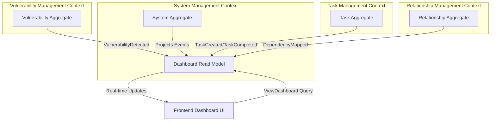
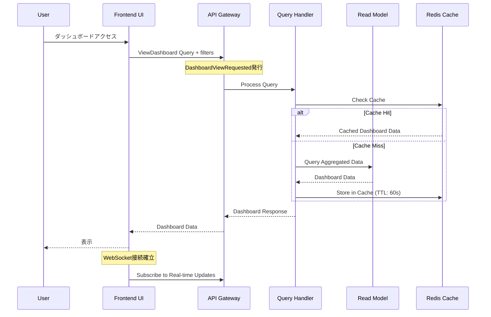
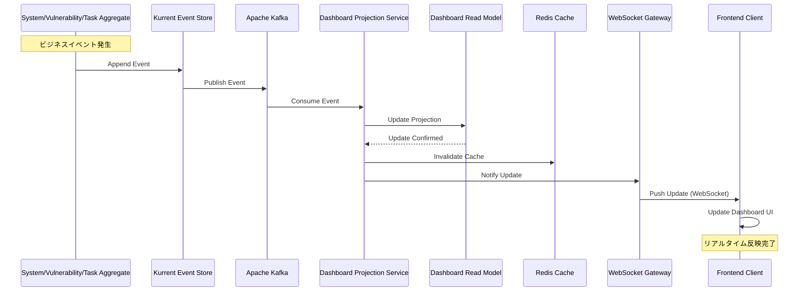

# US-SM-006: ダッシュボード機能 - ドメイン設計仕様書

**担当**: ソフトウェアアーキテクト
**作成日**: 2025-09-30
**Issue**: #170 (US-SM-006-001: ダッシュボード機能のドメイン設計)
**親Issue**: US-SM-006 (ダッシュボード表示)
**アーキテクチャパターン**: オニオンアーキテクチャ + DDD + CQRS + イベントソーシング

## 1. アーキテクチャ概要

### 1.1 設計方針

**Dashboard機能の特性**:

ダッシュボードは本質的に**Query Model（読み取り専用モデル）**であり、複数の集約からデータを集約して表示する**Read-side**機能です。Event Sourcingアーキテクチャにおいて、ダッシュボードは以下の特性を持ちます：

- **Command側には存在しない**: ダッシュボードはビジネスロジックを持たず、状態を変更しない
- **Read Model専用**: 複数の集約から投影されたデータを効率的にクエリする
- **結果整合性許容**: リアルタイム性は重要だが、数秒の遅延は許容される
- **CQRS最適化**: 読み取り専用に最適化されたスキーマ設計

**設計上の重要な決定**:

1. **Dashboard Aggregateは作成しない**: ダッシュボードはAggregate Rootではなく、Read Modelとして設計
2. **DashboardViewRequested は技術的なイベント**: ビジネスイベントではなく、UI/UXレイヤーのリクエストイベント
3. **ViewDashboard は Query**: Commandではなく、CQRSのQuery側として設計
4. **リアルタイム更新はEvent-driven**: Kafkaによるイベントストリーミングで実現

### 1.2 品質属性優先順位

1. **パフォーマンス**: 2秒未満のレスポンス時間（複雑な集約クエリでも高速）
2. **リアルタイム性**: 数秒以内のデータ更新反映（WebSocket/SSE経由）
3. **可用性**: 99%以上のビジネス時間稼働率
4. **スケーラビリティ**: 5-10同時ユーザーに対応
5. **保守性**: Read Modelの独立性による変更容易性

### 1.3 コンテキストマッピング



**境界の定義**:

- **Dashboard Read Model** は System Management Context に属する
- 他のContext（Vulnerability, Task, Relationship）からのイベントを購読し、投影を更新
- Dashboard専用の非正規化された高速クエリ用スキーマを持つ

## 2. イベント設計

### 2.1 DashboardViewRequested イベント

**分類**: Technical Event (ビジネスイベントではない)

#### 2.1.1 イベント仕様

| プロパティ名 | 型 | 説明 | 制約 |
|-------------|----|----|------|
| eventId | string | イベント一意識別子 | UUID v4、必須 |
| eventType | string | イベント種別 | "DashboardViewRequested"、必須 |
| timestamp | Date | イベント発生日時 | ISO 8601形式、必須 |
| userId | UserId | リクエストユーザーID | 必須 |
| sessionId | string | セッション識別子 | 任意 |
| filters | DashboardFilters | フィルター条件 | 任意 |
| viewMode | ViewMode | 表示モード | "overview" \| "detailed"、デフォルト: "overview" |
| metadata | RequestMetadata | リクエストメタデータ | 任意 |

#### 2.1.2 TypeScript型定義

```typescript
import { DomainEvent } from '@shared/domain/DomainEvent';
import { UserId } from '@shared/domain/UserId';

export interface DashboardFilters {
  systemTypes?: SystemType[];
  criticality?: CriticalityLevel[];
  status?: SystemStatus[];
  hasVulnerabilities?: boolean;
  hasEOLWarnings?: boolean;
}

export type ViewMode = 'overview' | 'detailed';

export interface RequestMetadata {
  userAgent?: string;
  ipAddress?: string;
  requestId?: string;
}

export class DashboardViewRequested extends DomainEvent {
  public readonly userId: UserId;
  public readonly sessionId?: string;
  public readonly filters?: DashboardFilters;
  public readonly viewMode: ViewMode;
  public readonly metadata?: RequestMetadata;

  constructor(props: {
    userId: UserId;
    sessionId?: string;
    filters?: DashboardFilters;
    viewMode?: ViewMode;
    metadata?: RequestMetadata;
  }) {
    super({
      eventType: 'DashboardViewRequested',
      aggregateType: 'Dashboard', // Technical aggregate
      aggregateId: props.userId.getValue(), // User-scoped
    });

    this.userId = props.userId;
    this.sessionId = props.sessionId;
    this.filters = props.filters;
    this.viewMode = props.viewMode || 'overview';
    this.metadata = props.metadata;
  }

  public toJSON(): Record<string, unknown> {
    return {
      ...super.toJSON(),
      userId: this.userId.getValue(),
      sessionId: this.sessionId,
      filters: this.filters,
      viewMode: this.viewMode,
      metadata: this.metadata,
    };
  }
}
```

#### 2.1.3 イベント発行タイミング

1. **ユーザーがダッシュボード画面にアクセス**: 初回ロード時
2. **フィルター変更時**: ユーザーがフィルター条件を変更
3. **表示モード切替時**: Overview ⇔ Detailed切替
4. **定期リフレッシュ**: 自動リフレッシュ機能（オプション）

#### 2.1.4 イベント処理フロー



## 3. コマンド設計

### 3.1 ViewDashboard Query（コマンドではない）

**重要**: CQRSパターンにおいて、ダッシュボード表示は**Query**であり、**Command**ではありません。

#### 3.1.1 Query仕様

| プロパティ名 | 型 | 説明 | 制約 |
|-------------|----|----|------|
| queryId | string | クエリ識別子 | UUID v4、必須 |
| userId | UserId | リクエストユーザーID | 必須 |
| filters | DashboardFilters | フィルター条件 | 任意 |
| viewMode | ViewMode | 表示モード | "overview" \| "detailed"、デフォルト: "overview" |
| pagination | PaginationOptions | ページング設定 | 任意 |

#### 3.1.2 TypeScript型定義

```typescript
import { IQuery } from '@nestjs/cqrs';
import { UserId } from '@shared/domain/UserId';
import { SecureQuery } from '@shared/security/interfaces/SecureQuery';
import { UserContext } from '@shared/security/UserContext';
import { SecurityClassification } from '@shared/security/enums/SecurityClassification';

export interface PaginationOptions {
  page: number;
  pageSize: number;
  sortBy?: string;
  sortOrder?: 'asc' | 'desc';
}

export class ViewDashboardQuery implements IQuery, SecureQuery {
  public readonly userContext: UserContext;
  public readonly securityClassification: SecurityClassification = SecurityClassification.INTERNAL;

  constructor(
    public readonly queryId: string,
    public readonly userId: UserId,
    public readonly filters?: DashboardFilters,
    public readonly viewMode: ViewMode = 'overview',
    public readonly pagination?: PaginationOptions,
  ) {
    // AOPによる認可チェックのためのUserContext設定
    this.userContext = new UserContext({
      userId: userId.getValue(),
      sessionId: undefined, // Controllerでセット
      ipAddress: undefined, // Controllerでセット
      userAgent: undefined, // Controllerでセット
    });
  }

  // SecureQueryインターフェース実装
  getSecurityMetadata(): SecurityMetadata {
    return {
      minimumClassification: SecurityClassification.INTERNAL,
      minimumRole: UserRole.OPERATOR,
      auditLevel: AuditLevel.STANDARD,
      requiresAuthorization: true,
      requiresSessionValidation: true,
    };
  }

  // UserContext設定（Controllerから呼び出し）
  setUserContext(userContext: UserContext): void {
    Object.assign(this.userContext, userContext);
  }
}
```

#### 3.1.3 Query Handler実装

**重要**: 認可チェックはAOP（SecurityInterceptor）により自動適用されるため、Query Handler内では実装不要。

```typescript
import { IQueryHandler, QueryHandler } from '@nestjs/cqrs';
import { DashboardReadModelRepository } from '../infrastructure/DashboardReadModelRepository';
import { DashboardResponse } from './DashboardResponse';
import { SecureQuery } from '@shared/security/decorators/SecureQuery';
import { SecurityClassification } from '@shared/security/enums/SecurityClassification';
import { UserRole } from '@shared/security/enums/UserRole';

@QueryHandler(ViewDashboardQuery)
@SecureQuery(SecurityClassification.INTERNAL, UserRole.OPERATOR) // AOP: 認可チェック自動適用
export class ViewDashboardQueryHandler implements IQueryHandler<ViewDashboardQuery> {
  constructor(
    private readonly dashboardRepository: DashboardReadModelRepository,
    private readonly cacheService: CacheService,
    private readonly logger: Logger,
    private readonly metricsService: DashboardMetricsService,
  ) {}

  async execute(query: ViewDashboardQuery): Promise<DashboardResponse> {
    const timer = this.metricsService.queryDuration.startTimer();

    try {
      // 認可チェックはSecurityInterceptorが自動実行するため不要

      // 1. キャッシュ確認（エラーは無視してDBフォールバック）
      const cacheKey = this.buildCacheKey(query);
      try {
        const cachedData = await this.cacheService.get<DashboardResponse>(cacheKey);
        if (cachedData) {
          this.metricsService.cacheHits.inc({ cache_layer: 'redis' });
          timer({ view_mode: query.viewMode, cache_hit: 'true' });
          return cachedData;
        }
      } catch (cacheError) {
        this.logger.warn('Cache retrieval failed, falling back to DB', {
          cacheKey,
          error: cacheError.message,
        });
        this.metricsService.cacheMisses.inc();
      }

      // 3. Read Modelからデータ取得
      const dashboardData = await this.dashboardRepository.findDashboardData(
        query.userId,
        query.filters,
        query.viewMode,
        query.pagination,
      );

      // 4. レスポンス構築
      const response = new DashboardResponse(dashboardData);

      // 5. キャッシュ保存（エラーは無視して可用性優先）
      try {
        await this.cacheService.set(cacheKey, response, 60);
      } catch (cacheError) {
        this.logger.warn('Cache set failed, continuing without cache', {
          cacheKey,
          error: cacheError.message,
        });
      }

      timer({ view_mode: query.viewMode, cache_hit: 'false' });
      return response;

    } catch (error) {
      timer({ view_mode: query.viewMode, cache_hit: 'error' });

      // エラーをログ記録してカスタムエラーを投げる
      // Note: UnauthorizedError は SecurityInterceptor で処理されるため、ここでは発生しない
      this.logger.error('Dashboard query execution failed', {
        queryId: query.queryId,
        userId: query.userId.getValue(),
        error: error.message,
        stack: error.stack,
      });

      throw new DashboardQueryError(
        'Failed to retrieve dashboard data',
        error
      );
    }
  }

  private buildCacheKey(query: ViewDashboardQuery): string {
    return `dashboard:${query.userId.getValue()}:${JSON.stringify(query.filters)}:${query.viewMode}`;
  }
}

/**
 * Dashboard Query専用エラークラス
 */
export class DashboardQueryError extends Error {
  constructor(
    message: string,
    public readonly cause?: Error,
  ) {
    super(message);
    this.name = 'DashboardQueryError';
    Error.captureStackTrace(this, this.constructor);
  }
}

/**
 * Projection処理専用エラークラス
 */
export class ProjectionError extends Error {
  constructor(
    message: string,
    public readonly cause?: Error,
  ) {
    super(message);
    this.name = 'ProjectionError';
    Error.captureStackTrace(this, this.constructor);
  }
}
```

#### 3.1.4 Controller実装（AOP統合）

**重要**: Controllerで UserContext を設定し、AOPのSecurityInterceptorが自動的に認可チェックを実行する。

```typescript
import { Controller, Get, Query, Req, UseInterceptors } from '@nestjs/common';
import { QueryBus, EventBus } from '@nestjs/cqrs';
import { SecurityInterceptor } from '@shared/security/interceptors/SecurityInterceptor';
import { CurrentUser } from '@shared/security/decorators/CurrentUser';
import { User } from '@shared/security/User';
import { UserContext } from '@shared/security/UserContext';
import { ViewDashboardQuery } from './queries/ViewDashboardQuery';
import { DashboardViewRequested } from './events/DashboardViewRequested';
import { v4 as uuidv4 } from 'uuid';

@Controller('api/dashboard')
@UseInterceptors(SecurityInterceptor) // AOP: SecurityInterceptor適用
export class DashboardController {
  constructor(
    private readonly queryBus: QueryBus,
    private readonly eventBus: EventBus,
  ) {}

  @Get()
  async getDashboard(
    @CurrentUser() user: User, // Auth0認証済みユーザー
    @Req() request: Request,
    @Query('filters') filters?: string,
    @Query('viewMode') viewMode?: string,
  ): Promise<DashboardResponse> {
    // 1. UserContext構築（AOP用）
    const userContext = new UserContext({
      userId: user.id,
      sessionId: request.session?.id, // HTTPセッションID
      ipAddress: request.ip,
      userAgent: request.headers['user-agent'],
      roles: user.roles,
    });

    // 2. Query作成
    const query = new ViewDashboardQuery(
      uuidv4(), // queryId
      UserId.create(user.id),
      filters ? JSON.parse(filters) : undefined,
      viewMode as ViewMode,
      undefined, // pagination
    );

    // 3. UserContextをQueryに設定（AOP用）
    query.setUserContext(userContext);

    // 4. Technical Event発行（DashboardViewRequested）
    const event = new DashboardViewRequested({
      userId: UserId.create(user.id),
      sessionId: request.session?.id,
      filters: query.filters,
      viewMode: query.viewMode,
      metadata: {
        userAgent: request.headers['user-agent'],
        ipAddress: request.ip,
        requestId: request.id,
      },
    });
    await this.eventBus.publish(event);

    // 5. Query実行（SecurityInterceptorが認可チェックを自動実行）
    return await this.queryBus.execute(query);
  }
}
```

**AOPフロー**:

1. Controller が `ViewDashboardQuery` を作成し、`UserContext` を設定
2. `queryBus.execute()` が呼ばれる
3. **SecurityInterceptor** が自動的に介入
4. **SecurityAspect.beforeExecution()** が認可チェック実行
5. 認可成功 → Query Handler実行
6. 認可失敗 → UnauthorizedAccessError throw

### 3.2 DashboardResponse 型定義

```typescript
export interface SystemSummary {
  systemId: string;
  systemName: string;
  systemType: SystemType;
  status: SystemStatus;
  criticality: CriticalityLevel;
  securityClassification: SecurityClassification;

  // Vulnerability Info (from Vulnerability Context)
  vulnerabilityCount: number;
  highSeverityVulnerabilities: number;
  criticalVulnerabilities: number;
  maxCVSSScore?: number;
  latestVulnerabilityDate?: Date;

  // EOL Info (from System Context)
  hasEOLWarnings: boolean;
  eolDaysRemaining?: number;
  eolPackagesCount: number;
  nearestEOLDate?: Date; // US-SM-006-004で追加

  // Task Info (from Task Context)
  openTaskCount: number;
  urgentTaskCount: number;
  overdueTaskCount: number;
  latestTaskDueDate?: Date;

  // Package Summary (from System Context)
  totalPackages: number;
  vulnerablePackages: number;
  outdatedPackages: number; // US-SM-006-004で追加

  // Metadata
  isDeleted: boolean; // US-SM-006-004で追加（通常はfalseのみ返却）
  createdAt: Date;
  lastUpdated: Date;
  lastEventAppliedAt: Date;
  lastEventId?: string; // US-SM-006-004で追加（冪等性保証用）
}

export interface DashboardStatistics {
  // システム統計
  totalSystems: number;
  activeSystems: number;
  inactiveSystems: number; // US-SM-006-004で追加
  maintenanceSystems: number; // US-SM-006-004で追加

  // 重要度別統計 (US-SM-006-004で追加)
  criticalSystems: number;
  highCriticalitySystems: number;
  mediumCriticalitySystems: number;
  lowCriticalitySystems: number;

  // 脆弱性統計
  systemsWithVulnerabilities: number;
  systemsWithCriticalVulns: number; // US-SM-006-004で追加
  totalVulnerabilities: number;
  totalCriticalVulnerabilities: number; // US-SM-006-004で追加
  totalHighSeverityVulnerabilities: number; // US-SM-006-004で追加
  highestCVSSScore: number; // US-SM-006-004で追加

  // EOL統計
  systemsWithEOLWarnings: number;
  systemsEOLWithin30Days: number; // US-SM-006-004で追加
  systemsEOLWithin90Days: number; // US-SM-006-004で追加

  // タスク統計
  totalOpenTasks: number; // totalTasks から名前変更
  totalUrgentTasks: number; // urgentTasks から名前変更
  totalOverdueTasks: number; // overdueTasks から名前変更

  // パッケージ統計 (US-SM-006-004で追加)
  totalPackages: number;
  totalVulnerablePackages: number;
  totalOutdatedPackages: number;

  // メタデータ
  lastUpdated: Date;
  refreshedAt: Date; // US-SM-006-004で追加（Materialized View最終更新時刻）
}

export class DashboardResponse {
  public readonly statistics: DashboardStatistics;
  public readonly systems: SystemSummary[];
  public readonly timestamp: Date;
  public readonly viewMode: ViewMode;

  constructor(data: {
    statistics: DashboardStatistics;
    systems: SystemSummary[];
    viewMode: ViewMode;
  }) {
    this.statistics = data.statistics;
    this.systems = data.systems;
    this.viewMode = data.viewMode;
    this.timestamp = new Date();
  }
}
```

## 4. Read Model設計

### 4.1 Dashboard Read Model スキーマ参照

**設計原則**:

- **非正規化**: クエリパフォーマンス最適化のため、意図的に冗長化
- **結合なし**: 可能な限りSingle Table Queryで完結
- **マテリアライズドビュー**: PostgreSQLのMaterialized Viewを活用
- **キャッシュ**: Redisで頻繁にアクセスされるデータをキャッシュ

**データベーススキーマ詳細**: データベースの物理設計、インデックス戦略、パフォーマンス最適化については、以下のデータベース設計仕様書を参照してください：

👉 **[US-SM-006-004: ダッシュボードデータベース設計仕様書](./US-SM-006-004-dashboard-database-design.md)**

**主要なRead Modelテーブル**:

1. **`dashboard_system_view`**: システムごとの集約データを非正規化して格納
   - システム基本情報（名前、種別、ステータス、重要度）
   - 脆弱性集約データ（件数、重要度別カウント、最大CVSSスコア）
   - EOL集約データ（警告フラグ、残日数、対象パッケージ数）
   - タスク集約データ（オープン、緊急、期限切れカウント）
   - パッケージサマリー（総数、脆弱性あり、古いパッケージ数）
   - メタデータ（論理削除フラグ、作成日時、更新日時、最終イベント適用日時）

2. **`dashboard_statistics`** (Materialized View): 統計情報を事前集計
   - システム統計（総数、アクティブ数、ステータス別）
   - 重要度別統計
   - 脆弱性統計（脆弱性ありシステム数、重要度別合計）
   - EOL統計（警告ありシステム数、期限内カウント）
   - タスク統計（総数、緊急、期限切れ）
   - パッケージ統計
   - 30秒自動リフレッシュ（pg_cron使用）

**重要な追加カラム** (US-SM-006-004で定義):

- `is_deleted`: 論理削除フラグ（部分インデックスで使用）
- `outdated_packages`: 古いパッケージ数
- `nearest_eol_date`: 最も近いEOL日付
- `last_event_id`: 最後に適用されたイベントID（冪等性保証）

### 4.2 Event Projection Service

Read Modelは複数のContextからのイベントを購読し、投影を更新します。

#### 4.2.1 DashboardProjectionService実装

```typescript
import { EventsHandler, IEventHandler } from '@nestjs/cqrs';
import {
  SystemRegistered,
  PackageInstalled,
  SystemDecommissioned
} from '../domain/events';
import {
  VulnerabilityDetected,
  VulnerabilityResolved
} from '@vulnerability-management/domain/events';
import {
  TaskCreated,
  TaskCompleted,
  TaskEscalated
} from '@task-management/domain/events';

@Injectable()
export class DashboardProjectionService {
  constructor(
    private readonly dashboardRepository: DashboardReadModelRepository,
    private readonly eventBus: EventBus,
  ) {}

  async onModuleInit() {
    // Subscribe to events from multiple contexts
    this.subscribeToSystemEvents();
    this.subscribeToVulnerabilityEvents();
    this.subscribeToTaskEvents();
  }

  private subscribeToSystemEvents() {
    this.eventBus.subscribe(SystemRegistered, this.onSystemRegistered.bind(this));
    this.eventBus.subscribe(PackageInstalled, this.onPackageInstalled.bind(this));
    this.eventBus.subscribe(SystemDecommissioned, this.onSystemDecommissioned.bind(this));
  }

  private subscribeToVulnerabilityEvents() {
    this.eventBus.subscribe(VulnerabilityDetected, this.onVulnerabilityDetected.bind(this));
    this.eventBus.subscribe(VulnerabilityResolved, this.onVulnerabilityResolved.bind(this));
  }

  private subscribeToTaskEvents() {
    this.eventBus.subscribe(TaskCreated, this.onTaskCreated.bind(this));
    this.eventBus.subscribe(TaskCompleted, this.onTaskCompleted.bind(this));
    this.eventBus.subscribe(TaskEscalated, this.onTaskEscalated.bind(this));
  }

  @EventsHandler(SystemRegistered)
  async onSystemRegistered(event: SystemRegistered): Promise<void> {
    await this.dashboardRepository.insertSystemView({
      systemId: event.systemId,
      systemName: event.systemName,
      systemType: event.systemType,
      systemStatus: event.status,
      criticality: event.criticality,
      securityClassification: event.securityClassification,
      totalPackages: 0,
      vulnerablePackages: 0,
      lastEventAppliedAt: event.timestamp,
    });
  }

  @EventsHandler(VulnerabilityDetected)
  async onVulnerabilityDetected(event: VulnerabilityDetected): Promise<void> {
    // CRITICAL: リトライ戦略を使用してイベント処理の信頼性を確保
    await this.retryWithBackoff(async () => {
      // Update vulnerability counts for affected systems
      for (const systemId of event.affectedSystems) {
        await this.dashboardRepository.incrementVulnerabilityCount(
          systemId,
          event.cvssScore >= 9.0 ? 'critical' : 'high',
          event.cvssScore,
        );
      }

      // Invalidate cache for affected systems
      await this.invalidateCacheForSystems(event.affectedSystems);
    }, event);
  }

  @EventsHandler(TaskCreated)
  async onTaskCreated(event: TaskCreated): Promise<void> {
    // CRITICAL: リトライ戦略を使用してイベント処理の信頼性を確保
    if (event.systemRef) {
      await this.retryWithBackoff(async () => {
        await this.dashboardRepository.incrementTaskCount(
          event.systemRef,
          event.priority === 'URGENT' ? 'urgent' : 'normal',
        );

        // Invalidate cache
        await this.invalidateCacheForSystems([event.systemRef]);
      }, event);
    }
  }

  /**
   * CRITICAL: イベント処理失敗時のリトライ戦略
   * 最大3回まで指数バックオフでリトライし、失敗した場合はDead Letter Queueへ送信
   */
  private async retryWithBackoff<T>(
    operation: () => Promise<T>,
    event: DomainEvent,
  ): Promise<T> {
    const MAX_RETRIES = 3;
    const RETRY_DELAY_MS = 1000;

    for (let attempt = 1; attempt <= MAX_RETRIES; attempt++) {
      try {
        return await operation();
      } catch (error) {
        this.logger.error(
          `Event processing failed (attempt ${attempt}/${MAX_RETRIES})`,
          { event: event.eventType, eventId: event.eventId, error }
        );

        if (attempt === MAX_RETRIES) {
          // 最終リトライ失敗 - Dead Letter Queueへ送信
          await this.sendToDeadLetterQueue(event, error);
          throw new ProjectionError(
            `Failed to process event after ${MAX_RETRIES} attempts: ${event.eventType}`,
            error
          );
        }

        // 指数バックオフ
        const delay = RETRY_DELAY_MS * Math.pow(2, attempt - 1);
        await this.sleep(delay);
      }
    }
  }

  /**
   * CRITICAL: Dead Letter Queue送信
   * 処理に失敗したイベントを保存し、手動介入や再処理を可能にする
   */
  private async sendToDeadLetterQueue(event: DomainEvent, error: Error): Promise<void> {
    try {
      await this.dlqService.send({
        eventId: event.eventId,
        eventType: event.eventType,
        eventData: event,
        error: {
          message: error.message,
          stack: error.stack,
        },
        failedAt: new Date(),
        context: 'DashboardProjection',
        retryCount: 3,
      });

      this.logger.warn('Event sent to Dead Letter Queue', {
        eventType: event.eventType,
        eventId: event.eventId,
      });
    } catch (dlqError) {
      // DLQ送信も失敗した場合は緊急アラート
      this.logger.error('CRITICAL: Failed to send event to DLQ', {
        event: event.eventType,
        originalError: error.message,
        dlqError: dlqError.message,
      });

      // 緊急通知（Microsoft Teams）
      await this.alertService.sendCriticalAlert({
        title: 'Dashboard Projection: Critical Failure',
        message: `Failed to process event and send to DLQ: ${event.eventType}`,
        eventId: event.eventId,
        error: error.message,
      });
    }
  }

  private sleep(ms: number): Promise<void> {
    return new Promise(resolve => setTimeout(resolve, ms));
  }

  private async invalidateCacheForSystems(systemIds: string[]): Promise<void> {
    // Invalidate Redis cache for affected systems
    const cacheKeys = systemIds.map(id => `dashboard:*:*${id}*`);
    await this.cacheService.deletePattern(cacheKeys);
  }
}
```

## 5. リアルタイム更新アーキテクチャ

### 5.1 イベントストリーミング設計

**技術スタック**:

- **Apache Kafka**: イベントストリーミングプラットフォーム
- **WebSocket/Server-Sent Events (SSE)**: クライアント通知
- **Redis Pub/Sub**: 軽量な通知チャネル（オプション）

#### 5.1.1 Kafka Topic設計

```yaml
# Dashboard更新専用トピック
# CRITICAL: 本番環境では replication_factor を 3 に設定して高可用性を確保
topics:
  - name: dashboard.system.updates
    partitions: 3
    replication_factor: 3  # CRITICAL: 単一障害点を避けるため3以上必須
    config:
      retention.ms: 86400000  # 24時間保持
      cleanup.policy: delete
      min.insync.replicas: 2  # CRITICAL: 書き込み保証のため2以上設定
      compression.type: snappy  # ネットワーク効率化

  - name: dashboard.vulnerability.updates
    partitions: 3
    replication_factor: 3  # CRITICAL: 単一障害点を避けるため3以上必須
    config:
      retention.ms: 86400000
      min.insync.replicas: 2
      compression.type: snappy

  - name: dashboard.task.updates
    partitions: 3
    replication_factor: 3  # CRITICAL: 単一障害点を避けるため3以上必須
    config:
      retention.ms: 86400000
      min.insync.replicas: 2
      compression.type: snappy
```

#### 5.1.2 Real-time Update Flow



### 5.2 WebSocket Gateway実装

#### 5.2.1 WebSocket負荷分散（Redis Adapter）

**HIGH PRIORITY**: 複数インスタンス間でWebSocket接続を共有するため、Redis Adapterを使用

```typescript
// main.ts - アプリケーション起動時の設定
import { NestFactory } from '@nestjs/core';
import { IoAdapter } from '@nestjs/platform-socket.io';
import { createAdapter } from '@socket.io/redis-adapter';
import { createClient } from 'redis';
import { AppModule } from './app.module';

async function bootstrap() {
  const app = await NestFactory.create(AppModule);

  // HIGH PRIORITY: Redis Adapter設定（WebSocket負荷分散）
  const pubClient = createClient({
    host: process.env.REDIS_HOST || 'localhost',
    port: parseInt(process.env.REDIS_PORT || '6379'),
    password: process.env.REDIS_PASSWORD,
  });

  const subClient = pubClient.duplicate();

  await Promise.all([
    pubClient.connect(),
    subClient.connect(),
  ]);

  const io = app.get(DashboardGateway).server;
  io.adapter(createAdapter(pubClient, subClient));

  await app.listen(3000);
}
bootstrap();
```

#### 5.2.2 DashboardGateway実装

```typescript
import {
  WebSocketGateway,
  WebSocketServer,
  OnGatewayConnection,
  OnGatewayDisconnect,
  SubscribeMessage,
} from '@nestjs/websockets';
import { Server, Socket } from 'socket.io';

@WebSocketGateway({
  namespace: '/dashboard',
  cors: {
    origin: (origin, callback) => {
      // HIGH PRIORITY: 複数オリジン対応
      const allowedOrigins = process.env.ALLOWED_ORIGINS?.split(',') || [];
      if (!origin || allowedOrigins.includes(origin)) {
        callback(null, true);
      } else {
        callback(new Error('CORS policy violation'));
      }
    },
    credentials: true,
  },
  // HIGH PRIORITY: Redis Adapterによる負荷分散対応
  transports: ['websocket', 'polling'],
})
export class DashboardGateway implements OnGatewayConnection, OnGatewayDisconnect {
  @WebSocketServer()
  server: Server;

  private readonly userSockets = new Map<string, Set<string>>(); // userId -> socketIds

  constructor(
    private readonly authService: AuthService,
    private readonly authorizationService: AuthorizationService,
    private readonly auditService: AuditService,
    private readonly eventBus: EventBus,
    private readonly logger: Logger,
  ) {
    // Subscribe to dashboard update events
    this.subscribeToDashboardEvents();
  }

  async handleConnection(socket: Socket) {
    try {
      // Authenticate socket connection
      const token = socket.handshake.auth.token;
      const user = await this.authService.validateToken(token);

      if (!user) {
        socket.disconnect();
        return;
      }

      // Store socket mapping
      socket.data.userId = user.id;
      this.addUserSocket(user.id, socket.id);

      // Send initial data
      socket.emit('connected', { userId: user.id });

    } catch (error) {
      socket.disconnect();
    }
  }

  handleDisconnect(socket: Socket) {
    const userId = socket.data.userId;
    if (userId) {
      this.removeUserSocket(userId, socket.id);
    }
  }

  @SubscribeMessage('subscribe-system')
  async handleSubscribeSystem(socket: Socket, systemId: string) {
    try {
      const userId = socket.data.userId;

      // CRITICAL: 認可チェック - ユーザーがこのシステムにアクセス権限があるか確認
      const hasAccess = await this.authorizationService.canAccessSystem(userId, systemId);
      if (!hasAccess) {
        await this.auditService.logUnauthorizedSystemAccess({
          userId,
          systemId,
          action: 'subscribe',
          timestamp: new Date(),
        });
        socket.emit('error', { message: 'Access denied to system' });
        return;
      }

      // UUIDフォーマット検証
      if (!this.isValidSystemId(systemId)) {
        socket.emit('error', { message: 'Invalid system ID' });
        return;
      }

      socket.join(`system:${systemId}`);

      // 監査ログ
      await this.auditService.logSystemSubscription({
        userId,
        systemId,
        sessionId: socket.data.sessionId,
        timestamp: new Date(),
      });

      socket.emit('subscribed', { systemId });
    } catch (error) {
      this.logger.error('Subscribe system error', error);
      socket.emit('error', { message: 'Subscription failed' });
    }
  }

  @SubscribeMessage('unsubscribe-system')
  handleUnsubscribeSystem(socket: Socket, systemId: string) {
    socket.leave(`system:${systemId}`);
  }

  private isValidSystemId(systemId: string): boolean {
    // UUIDフォーマット検証
    const uuidRegex = /^[0-9a-f]{8}-[0-9a-f]{4}-4[0-9a-f]{3}-[89ab][0-9a-f]{3}-[0-9a-f]{12}$/i;
    return uuidRegex.test(systemId);
  }

  // Event handlers
  private subscribeToDashboardEvents() {
    this.eventBus.subscribe('dashboard.update', (update: DashboardUpdate) => {
      this.broadcastUpdate(update);
    });
  }

  private broadcastUpdate(update: DashboardUpdate) {
    if (update.systemId) {
      // Broadcast to subscribers of specific system
      this.server.to(`system:${update.systemId}`).emit('system-update', update);
    } else {
      // Broadcast to all connected clients
      this.server.emit('dashboard-update', update);
    }
  }

  private addUserSocket(userId: string, socketId: string) {
    if (!this.userSockets.has(userId)) {
      this.userSockets.set(userId, new Set());
    }
    this.userSockets.get(userId)!.add(socketId);
  }

  private removeUserSocket(userId: string, socketId: string) {
    const sockets = this.userSockets.get(userId);
    if (sockets) {
      sockets.delete(socketId);
      if (sockets.size === 0) {
        this.userSockets.delete(userId);
      }
    }
  }
}
```

### 5.3 フロントエンド統合例

#### 5.3.1 DashboardRealtimeService（再接続戦略付き）

**HIGH PRIORITY**: ネットワーク障害時の自動再接続戦略を実装

```typescript
// Frontend Dashboard Service
import { io, Socket } from 'socket.io-client';

export type ConnectionStatus = 'connected' | 'disconnected' | 'reconnecting';

export class DashboardRealtimeService {
  private socket: Socket | null = null;
  private listeners: Map<string, Function[]> = new Map();
  private reconnectAttempts = 0;
  private readonly MAX_RECONNECT_ATTEMPTS = 5;
  private readonly RECONNECT_DELAY_MS = 1000;
  private connectionStatus: ConnectionStatus = 'disconnected';

  connect(token: string) {
    // HIGH PRIORITY: 再接続設定を含む接続オプション
    this.socket = io(`${process.env.API_URL}/dashboard`, {
      auth: { token },
      transports: ['websocket', 'polling'],
      reconnection: true,
      reconnectionAttempts: this.MAX_RECONNECT_ATTEMPTS,
      reconnectionDelay: this.RECONNECT_DELAY_MS,
      reconnectionDelayMax: 5000,
      timeout: 10000,
    });

    this.setupEventHandlers();
  }

  private setupEventHandlers() {
    if (!this.socket) return;

    // 接続成功
    this.socket.on('connect', () => {
      console.log('Dashboard WebSocket connected');
      this.connectionStatus = 'connected';
      this.reconnectAttempts = 0;
      this.notifyListeners('connection-status', { status: 'connected' });
    });

    // 切断
    this.socket.on('disconnect', (reason) => {
      console.warn('Dashboard WebSocket disconnected:', reason);
      this.connectionStatus = 'disconnected';
      this.notifyListeners('connection-status', {
        status: 'disconnected',
        reason
      });

      // サーバー側から切断された場合は手動再接続
      if (reason === 'io server disconnect') {
        this.reconnect();
      }
    });

    // 接続エラー（HIGH PRIORITY: エラーハンドリング）
    this.socket.on('connect_error', (error) => {
      console.error('Dashboard WebSocket connection error:', error);
      this.connectionStatus = 'reconnecting';
      this.reconnectAttempts++;

      if (this.reconnectAttempts >= this.MAX_RECONNECT_ATTEMPTS) {
        this.notifyListeners('connection-failed', {
          message: 'Failed to connect after multiple attempts',
          attempts: this.reconnectAttempts,
        });
      }
    });

    // データ更新イベント（HIGH PRIORITY: エラーハンドリング）
    this.socket.on('system-update', (update: DashboardUpdate) => {
      try {
        this.notifyListeners('system-update', update);
      } catch (error) {
        console.error('Error handling system update:', error);
      }
    });

    this.socket.on('dashboard-update', (update: DashboardUpdate) => {
      try {
        this.notifyListeners('dashboard-update', update);
      } catch (error) {
        console.error('Error handling dashboard update:', error);
      }
    });

    // エラー通知
    this.socket.on('error', (error: { message: string }) => {
      console.error('WebSocket error:', error);
      this.notifyListeners('error', error);
    });
  }

  private reconnect() {
    if (this.socket && this.reconnectAttempts < this.MAX_RECONNECT_ATTEMPTS) {
      this.socket.connect();
    }
  }

  getConnectionStatus(): ConnectionStatus {
    return this.connectionStatus;
  }

  subscribeToSystem(systemId: string) {
    this.socket?.emit('subscribe-system', systemId);
  }

  unsubscribeFromSystem(systemId: string) {
    this.socket?.emit('unsubscribe-system', systemId);
  }

  onUpdate(event: string, callback: (update: DashboardUpdate) => void) {
    if (!this.listeners.has(event)) {
      this.listeners.set(event, []);
    }
    this.listeners.get(event)!.push(callback);
  }

  private notifyListeners(event: string, data: any) {
    const callbacks = this.listeners.get(event) || [];
    callbacks.forEach(cb => cb(data));
  }

  disconnect() {
    this.socket?.disconnect();
    this.socket = null;
  }
}
```

## 6. 境界の定義

### 6.1 System Management Context内のDashboard境界

**Dashboard機能の位置づけ**:

```text
System Management Context
├── Domain Layer
│   ├── System Aggregate (Write Model)
│   ├── Package Entity (Write Model)
│   └── Value Objects
├── Application Layer
│   ├── Command Handlers (Write)
│   └── Query Handlers (Read)
│       └── ViewDashboardQueryHandler ← ここに配置
├── Infrastructure Layer
│   ├── Kurrent Repository (Event Store)
│   ├── PostgreSQL Read Model Repository ← Dashboard Read Model
│   └── Kafka Event Publisher
└── Presentation Layer
    ├── REST Controllers
    ├── GraphQL Resolvers
    └── WebSocket Gateway ← Dashboard Gateway
```

**境界ルール**:

1. **Dashboard Read Modelは System Management Contextに属する**
   - System Aggregateからの投影を含む
   - 他Contextからのイベントも購読可能（Published Language）

2. **Dashboard機能はQuery専用**
   - Commandを発行しない
   - Aggregateの状態を変更しない
   - Read Modelからのみデータ取得

3. **リアルタイム更新は Presentation Layerで処理**
   - WebSocket GatewayはPresentation Layer
   - Event BusからDashboard更新通知を受信
   - クライアントに配信

### 6.2 他Contextとの連携

**Published Language Pattern適用**:

```typescript
// Vulnerability Management Context → Dashboard
export class VulnerabilityDetected extends DomainEvent {
  // Dashboard Projectionで利用される公開データ
  public readonly affectedSystems: string[]; // SystemId[]
  public readonly cvssScore: number;
  public readonly severity: string;
}

// Task Management Context → Dashboard
export class TaskCreated extends DomainEvent {
  // Dashboard Projectionで利用される公開データ
  public readonly systemRef?: string; // SystemId
  public readonly priority: string;
  public readonly dueDate: Date;
}

// Dashboard ProjectionはこれらのPublished Eventsを購読
```

**Anti-Corruption Layer (ACL)**:

Dashboard Projection Serviceは各Contextのイベントを自身のRead Model形式に変換します：

```typescript
// VulnerabilityDetectedをDashboard Read Model用に変換
private transformVulnerabilityEvent(event: VulnerabilityDetected): DashboardVulnerabilityUpdate {
  return {
    systemIds: event.affectedSystems,
    vulnerabilityCount: 1,
    severity: this.mapSeverity(event.cvssScore),
    timestamp: event.timestamp,
  };
}

private mapSeverity(cvssScore: number): 'critical' | 'high' | 'medium' | 'low' {
  if (cvssScore >= 9.0) return 'critical';
  if (cvssScore >= 7.0) return 'high';
  if (cvssScore >= 4.0) return 'medium';
  return 'low';
}
```

## 7. パフォーマンス最適化戦略

### 7.1 キャッシュ戦略

**多層キャッシュアーキテクチャ**:

```typescript
export class DashboardCacheStrategy {
  // L1 Cache: In-Memory (Node.js)
  private readonly memoryCache = new Map<string, CacheEntry>();

  // L2 Cache: Redis
  constructor(
    private readonly redis: RedisService,
  ) {}

  async get<T>(key: string): Promise<T | null> {
    // L1 Check
    const memCache = this.memoryCache.get(key);
    if (memCache && !memCache.isExpired()) {
      return memCache.value as T;
    }

    // L2 Check
    const redisValue = await this.redis.get(key);
    if (redisValue) {
      const parsed = JSON.parse(redisValue) as T;

      // Populate L1
      this.memoryCache.set(key, {
        value: parsed,
        expiresAt: Date.now() + 30000, // 30秒
      });

      return parsed;
    }

    return null;
  }

  async set<T>(key: string, value: T, ttlSeconds: number): Promise<void> {
    // Set L1
    this.memoryCache.set(key, {
      value,
      expiresAt: Date.now() + Math.min(ttlSeconds * 1000, 30000),
    });

    // Set L2
    await this.redis.set(key, JSON.stringify(value), ttlSeconds);
  }

  async invalidate(pattern: string): Promise<void> {
    // Clear L1
    for (const key of this.memoryCache.keys()) {
      if (this.matchesPattern(key, pattern)) {
        this.memoryCache.delete(key);
      }
    }

    // Clear L2
    await this.redis.deletePattern(pattern);
  }

  private matchesPattern(key: string, pattern: string): boolean {
    const regex = new RegExp(pattern.replace(/\*/g, '.*'));
    return regex.test(key);
  }
}
```

**キャッシュTTL戦略**:

| データ種別 | TTL | 理由 |
|-----------|-----|------|
| Dashboard統計 | 60秒 | 頻繁に変更されるが、リアルタイム性よりパフォーマンス優先 |
| システムリスト | 30秒 | 中程度の変更頻度 |
| 個別システム詳細 | 120秒 | 変更頻度低い |
| フィルター結果 | 60秒 | ユーザー操作に応じて変化 |

### 7.2 クエリ最適化

**Indexed Query Patterns**:

```sql
-- 高速フィルタリング用インデックス
CREATE INDEX CONCURRENTLY idx_dashboard_critical_systems
ON dashboard_system_view (criticality, system_status)
WHERE criticality IN ('HIGH', 'CRITICAL') AND system_status = 'ACTIVE';

-- 脆弱性検索用複合インデックス
CREATE INDEX CONCURRENTLY idx_dashboard_vulnerabilities
ON dashboard_system_view (vulnerability_count, max_cvss_score)
WHERE vulnerability_count > 0;

-- EOL警告用部分インデックス
CREATE INDEX CONCURRENTLY idx_dashboard_eol_warnings
ON dashboard_system_view (eol_days_remaining)
WHERE has_eol_warnings = TRUE;
```

**Materialized View自動更新**:

```sql
-- PostgreSQL pgAgent / pg_cron による定期更新
SELECT cron.schedule(
  'refresh-dashboard-stats',
  '*/5 * * * *', -- 5分ごと
  $$REFRESH MATERIALIZED VIEW CONCURRENTLY dashboard_statistics$$
);
```

### 7.3 Event Projectionバッチ処理

大量のイベントを効率的に処理するためのバッチ最適化：

```typescript
export class DashboardProjectionBatchProcessor {
  private readonly batchSize = 100;
  private eventBuffer: DomainEvent[] = [];
  private flushTimer: NodeJS.Timeout | null = null;

  async processEvent(event: DomainEvent): Promise<void> {
    this.eventBuffer.push(event);

    if (this.eventBuffer.length >= this.batchSize) {
      await this.flush();
    } else if (!this.flushTimer) {
      // 最大5秒でフラッシュ
      this.flushTimer = setTimeout(() => this.flush(), 5000);
    }
  }

  private async flush(): Promise<void> {
    if (this.eventBuffer.length === 0) return;

    const batch = this.eventBuffer.splice(0, this.batchSize);

    // バッチ更新
    await this.dashboardRepository.batchUpdate(
      batch.map(event => this.transformEvent(event))
    );

    if (this.flushTimer) {
      clearTimeout(this.flushTimer);
      this.flushTimer = null;
    }
  }
}
```

## 8. セキュリティ・認可設計

### 8.1 ダッシュボードアクセス制御

**Role-Based Access Control (RBAC)**:

```typescript
export enum DashboardPermission {
  VIEW_OWN_SYSTEMS = 'dashboard:view:own',
  VIEW_ALL_SYSTEMS = 'dashboard:view:all',
  VIEW_CONFIDENTIAL = 'dashboard:view:confidential',
  VIEW_RESTRICTED = 'dashboard:view:restricted',
}

export class DashboardAuthorizationService {
  constructor(
    private readonly authService: AuthService,
  ) {}

  async ensureCanViewDashboard(userId: UserId): Promise<void> {
    const user = await this.authService.getUser(userId);

    if (!user.hasPermission(DashboardPermission.VIEW_OWN_SYSTEMS)) {
      throw new UnauthorizedError('User does not have dashboard view permission');
    }
  }

  async filterSystemsByAuthorization(
    userId: UserId,
    systems: SystemSummary[],
  ): Promise<SystemSummary[]> {
    const user = await this.authService.getUser(userId);

    if (user.hasPermission(DashboardPermission.VIEW_ALL_SYSTEMS)) {
      return systems;
    }

    // Filter by user's assigned systems
    const assignedSystemIds = await this.getAssignedSystemIds(userId);
    return systems.filter(s => assignedSystemIds.includes(s.systemId));
  }

  async maskConfidentialData(
    userId: UserId,
    system: SystemSummary,
  ): Promise<SystemSummary> {
    const user = await this.authService.getUser(userId);

    if (system.securityClassification === 'CONFIDENTIAL' &&
        !user.hasPermission(DashboardPermission.VIEW_CONFIDENTIAL)) {
      return {
        ...system,
        systemName: '*** CONFIDENTIAL ***',
        // Mask other sensitive fields
      };
    }

    return system;
  }
}
```

#### 8.2.1 拡張データマスキングサービス（MEDIUM PRIORITY）

```typescript
@Injectable()
export class DashboardDataMaskingService {
  constructor(
    private readonly authService: AuthService,
  ) {}

  /**
   * MEDIUM PRIORITY: 包括的なデータマスキング
   * セキュリティ分類に応じて、システム情報全体をマスキング
   */
  async maskDashboardData(
    userId: UserId,
    dashboardData: DashboardResponse,
  ): Promise<DashboardResponse> {
    const user = await this.authService.getUser(userId);

    // システムリストをマスキング
    const maskedSystems = await Promise.all(
      dashboardData.systems
        .map(system => this.maskSystemData(user, system))
        .filter(system => system !== null) // RESTRICTED は完全に除外
    );

    // 統計情報もマスキング（アクセス可能なシステムのみカウント）
    const maskedStatistics = this.maskStatistics(user, dashboardData.statistics, maskedSystems.length);

    return {
      ...dashboardData,
      systems: maskedSystems,
      statistics: maskedStatistics,
    };
  }

  /**
   * システム単位のデータマスキング
   */
  private async maskSystemData(
    user: User,
    system: SystemSummary,
  ): Promise<SystemSummary | null> {
    const securityLevel = this.getSecurityLevel(system.securityClassification);

    // RESTRICTED: 完全に非表示
    if (securityLevel === 'RESTRICTED' &&
        !user.hasPermission(DashboardPermission.VIEW_RESTRICTED)) {
      return null;
    }

    // CONFIDENTIAL: 詳細情報をマスク
    if (securityLevel === 'CONFIDENTIAL' &&
        !user.hasPermission(DashboardPermission.VIEW_CONFIDENTIAL)) {
      return {
        systemId: system.systemId, // IDは保持（統計目的）
        systemName: this.maskString(system.systemName),
        systemType: system.systemType, // 種別は表示
        status: system.status,
        criticality: system.criticality,

        // 脆弱性情報をマスク
        vulnerabilityCount: 0,
        highSeverityVulnerabilities: 0,
        criticalVulnerabilities: 0,
        maxCVSSScore: undefined,

        // EOL情報をマスク
        hasEOLWarnings: false,
        eolDaysRemaining: undefined,

        // タスク情報をマスク
        openTaskCount: 0,
        urgentTaskCount: 0,
        overdueTaskCount: 0,

        lastUpdated: system.lastUpdated,
      };
    }

    // INTERNAL: 部分的な情報制限
    if (securityLevel === 'INTERNAL' &&
        !user.hasPermission(DashboardPermission.VIEW_ALL_SYSTEMS)) {
      return {
        ...system,
        // システム名の一部をマスク（最初の3文字のみ表示）
        systemName: this.partialMaskString(system.systemName, 3),
      };
    }

    // PUBLIC または権限あり: マスクなし
    return system;
  }

  /**
   * 統計情報のマスキング
   */
  private maskStatistics(
    user: User,
    stats: DashboardStatistics,
    visibleSystemCount: number,
  ): DashboardStatistics {
    // 管理者権限がない場合は、表示可能なシステムのみカウント
    if (!user.hasPermission(DashboardPermission.VIEW_ALL_SYSTEMS)) {
      return {
        ...stats,
        totalSystems: visibleSystemCount,
        activeSystems: Math.min(stats.activeSystems, visibleSystemCount),
        systemsWithVulnerabilities: Math.min(stats.systemsWithVulnerabilities, visibleSystemCount),
        systemsWithEOLWarnings: Math.min(stats.systemsWithEOLWarnings, visibleSystemCount),
        // 脆弱性・タスク数も制限（詳細は非表示）
      };
    }

    return stats;
  }

  /**
   * 完全マスキング
   */
  private maskString(value: string): string {
    return '*** CONFIDENTIAL ***';
  }

  /**
   * 部分マスキング（最初のN文字のみ表示）
   */
  private partialMaskString(value: string, visibleChars: number): string {
    if (value.length <= visibleChars) {
      return value;
    }
    return `${value.substring(0, visibleChars)}***`;
  }

  /**
   * セキュリティレベルの取得
   */
  private getSecurityLevel(classification: string): 'PUBLIC' | 'INTERNAL' | 'CONFIDENTIAL' | 'RESTRICTED' {
    return classification as any;
  }
}
```

### 8.2 監査ログ

```typescript
@Injectable()
export class DashboardAuditService {
  async logDashboardAccess(query: ViewDashboardQuery, response: DashboardResponse): Promise<void> {
    await this.auditRepository.log({
      eventType: 'DASHBOARD_ACCESSED',
      userId: query.userId.getValue(),
      timestamp: new Date(),
      metadata: {
        filters: query.filters,
        viewMode: query.viewMode,
        systemCount: response.systems.length,
        ipAddress: query.metadata?.ipAddress,
      },
    });
  }

  async logUnauthorizedAccess(userId: UserId, reason: string): Promise<void> {
    await this.auditRepository.log({
      eventType: 'DASHBOARD_UNAUTHORIZED_ACCESS',
      userId: userId.getValue(),
      timestamp: new Date(),
      severity: 'WARNING',
      metadata: { reason },
    });
  }
}
```

## 9. 実装順序と段階的展開

### 9.1 Phase 1: 基本ダッシュボード (MVP)

**スコープ**:

- [ ] ViewDashboardQuery実装
- [ ] Dashboard Read Model (PostgreSQL)
- [ ] System Aggregateからの投影
- [ ] 基本的なフィルタリング機能
- [ ] REST API実装

**成功基準**:

- システム一覧表示（2秒未満）
- 基本統計情報表示
- 5同時ユーザー対応

### 9.2 Phase 2: リアルタイム更新

**スコープ**:

- [ ] Kafka Event Streaming統合
- [ ] WebSocket Gateway実装
- [ ] 他Contextからのイベント購読（Vulnerability, Task）
- [ ] リアルタイム投影更新

**成功基準**:

- イベント発生から5秒以内のUI反映
- WebSocket接続安定性 99%以上

### 9.3 Phase 3: 高度な機能

**スコープ**:

- [ ] 高度なフィルタリング
- [ ] カスタムダッシュボード
- [ ] エクスポート機能
- [ ] 多層キャッシュ最適化

**成功基準**:

- 複雑なクエリでも2秒未満
- キャッシュヒット率 80%以上

## 10. テスト戦略

### 10.1 Query Handler Unit Test

```typescript
describe('ViewDashboardQueryHandler', () => {
  let handler: ViewDashboardQueryHandler;
  let repository: MockDashboardRepository;
  let cacheService: MockCacheService;

  beforeEach(() => {
    repository = new MockDashboardRepository();
    cacheService = new MockCacheService();
    handler = new ViewDashboardQueryHandler(repository, cacheService, authService);
  });

  it('should return dashboard data from cache if available', async () => {
    const query = new ViewDashboardQuery(
      'query-123',
      UserId.create('user-123'),
    );

    const cachedData = createMockDashboardResponse();
    cacheService.set('dashboard:user-123::overview', cachedData);

    const result = await handler.execute(query);

    expect(result).toEqual(cachedData);
    expect(repository.findDashboardData).not.toHaveBeenCalled();
  });

  it('should query repository and cache result if cache miss', async () => {
    const query = new ViewDashboardQuery(
      'query-123',
      UserId.create('user-123'),
    );

    const mockData = createMockDashboardResponse();
    repository.mockFindDashboardData(mockData);

    const result = await handler.execute(query);

    expect(result).toEqual(mockData);
    expect(repository.findDashboardData).toHaveBeenCalledTimes(1);
    expect(cacheService.get('dashboard:user-123::overview')).toEqual(mockData);
  });
});
```

### 10.2 Projection Integration Test

```typescript
describe('DashboardProjectionService', () => {
  it('should update dashboard when VulnerabilityDetected event occurs', async () => {
    const event = new VulnerabilityDetected({
      vulnerabilityId: 'CVE-2024-1234',
      affectedSystems: ['system-123'],
      cvssScore: 9.5,
      severity: 'CRITICAL',
    });

    await projectionService.onVulnerabilityDetected(event);

    const dashboardData = await repository.findSystemView('system-123');
    expect(dashboardData.criticalVulnerabilities).toBe(1);
    expect(dashboardData.maxCVSSScore).toBe(9.5);
  });
});
```

### 10.3 WebSocket Integration Test

```typescript
describe('DashboardGateway', () => {
  it('should broadcast update to subscribed clients', async () => {
    const client = await createTestClient();
    await client.emit('subscribe-system', 'system-123');

    const update = {
      systemId: 'system-123',
      updateType: 'vulnerability',
      data: { count: 1 },
    };

    gateway.broadcastUpdate(update);

    await expect(client).toReceive('system-update', update);
  });
});
```

## 11. 運用・監視

### 11.1 メトリクス収集

#### 11.1.1 包括的メトリクス定義（MEDIUM PRIORITY）

```typescript
import { Injectable } from '@nestjs/common';
import { Counter, Histogram, Gauge, Registry } from 'prom-client';

@Injectable()
export class DashboardMetricsService {
  private readonly registry: Registry;

  // Query Metrics
  @Histogram({
    name: 'dashboard_query_duration_seconds',
    help: 'Dashboard query execution time',
    labelNames: ['view_mode', 'cache_hit'],
    buckets: [0.1, 0.5, 1, 2, 5],
  })
  queryDuration: Histogram;

  // Cache Metrics
  @Counter({
    name: 'dashboard_cache_hits_total',
    help: 'Number of cache hits',
    labelNames: ['cache_layer'], // L1 (memory) or L2 (redis)
  })
  cacheHits: Counter;

  @Counter({
    name: 'dashboard_cache_misses_total',
    help: 'Number of cache misses',
  })
  cacheMisses: Counter;

  @Histogram({
    name: 'dashboard_cache_operation_duration_seconds',
    help: 'Cache operation duration',
    labelNames: ['operation', 'cache_layer'], // get/set/invalidate
    buckets: [0.001, 0.005, 0.01, 0.05, 0.1],
  })
  cacheOperationDuration: Histogram;

  // WebSocket Metrics
  @Gauge({
    name: 'dashboard_active_websocket_connections',
    help: 'Number of active WebSocket connections',
  })
  activeConnections: Gauge;

  @Counter({
    name: 'dashboard_websocket_messages_sent_total',
    help: 'Number of WebSocket messages sent',
    labelNames: ['message_type'], // system-update/dashboard-update/error
  })
  messagesSent: Counter;

  @Histogram({
    name: 'dashboard_websocket_message_latency_seconds',
    help: 'WebSocket message delivery latency',
    labelNames: ['message_type'],
    buckets: [0.001, 0.005, 0.01, 0.05, 0.1, 0.5],
  })
  messageLatency: Histogram;

  @Counter({
    name: 'dashboard_websocket_connections_total',
    help: 'Total WebSocket connection attempts',
    labelNames: ['status'], // success/failure
  })
  connectionAttempts: Counter;

  @Counter({
    name: 'dashboard_websocket_disconnections_total',
    help: 'Total WebSocket disconnections',
    labelNames: ['reason'], // client_disconnect/server_disconnect/error
  })
  disconnections: Counter;

  // Event Projection Metrics
  @Counter({
    name: 'dashboard_projection_events_processed_total',
    help: 'Number of events processed by projection',
    labelNames: ['event_type', 'status'], // status: success/failure
  })
  eventsProcessed: Counter;

  @Gauge({
    name: 'dashboard_projection_lag_seconds',
    help: 'Projection lag in seconds (time since event occurred)',
    labelNames: ['topic'],
  })
  projectionLag: Gauge;

  @Histogram({
    name: 'dashboard_projection_processing_duration_seconds',
    help: 'Time taken to process an event',
    labelNames: ['event_type'],
    buckets: [0.01, 0.05, 0.1, 0.5, 1, 2],
  })
  projectionProcessingDuration: Histogram;

  @Histogram({
    name: 'dashboard_projection_batch_size',
    help: 'Number of events processed in batch',
    buckets: [1, 10, 50, 100, 500],
  })
  batchSize: Histogram;

  @Counter({
    name: 'dashboard_projection_retries_total',
    help: 'Number of projection retry attempts',
    labelNames: ['event_type', 'attempt'], // attempt: 1/2/3
  })
  projectionRetries: Counter;

  @Counter({
    name: 'dashboard_projection_dlq_sent_total',
    help: 'Number of events sent to Dead Letter Queue',
    labelNames: ['event_type'],
  })
  dlqSent: Counter;

  // Database Metrics
  @Histogram({
    name: 'dashboard_db_query_duration_seconds',
    help: 'Database query duration',
    labelNames: ['operation', 'table'], // select/insert/update, table name
    buckets: [0.01, 0.05, 0.1, 0.5, 1, 2],
  })
  dbQueryDuration: Histogram;

  @Counter({
    name: 'dashboard_db_queries_total',
    help: 'Total number of database queries',
    labelNames: ['operation', 'status'], // status: success/error
  })
  dbQueries: Counter;

  @Gauge({
    name: 'dashboard_db_connection_pool_size',
    help: 'Current database connection pool size',
  })
  dbConnectionPoolSize: Gauge;

  @Gauge({
    name: 'dashboard_db_connection_pool_idle',
    help: 'Number of idle connections in pool',
  })
  dbConnectionPoolIdle: Gauge;

  @Gauge({
    name: 'dashboard_materialized_view_refresh_duration_seconds',
    help: 'Materialized view refresh duration',
  })
  mvRefreshDuration: Gauge;

  @Counter({
    name: 'dashboard_materialized_view_refresh_total',
    help: 'Number of materialized view refreshes',
    labelNames: ['status'], // success/failure
  })
  mvRefreshCount: Counter;

  @Gauge({
    name: 'dashboard_materialized_view_row_count',
    help: 'Number of rows in materialized view',
  })
  mvRowCount: Gauge;

  // Kafka Consumer Metrics
  @Gauge({
    name: 'dashboard_kafka_consumer_lag',
    help: 'Kafka consumer lag',
    labelNames: ['topic', 'partition'],
  })
  kafkaConsumerLag: Gauge;

  @Counter({
    name: 'dashboard_kafka_messages_consumed_total',
    help: 'Number of Kafka messages consumed',
    labelNames: ['topic'],
  })
  kafkaMessagesConsumed: Counter;

  @Counter({
    name: 'dashboard_kafka_consumer_errors_total',
    help: 'Number of Kafka consumer errors',
    labelNames: ['topic', 'error_type'],
  })
  kafkaConsumerErrors: Counter;

  // Error Metrics
  @Counter({
    name: 'dashboard_errors_total',
    help: 'Total number of errors',
    labelNames: ['error_type', 'component'], // component: query_handler/projection/websocket
  })
  errors: Counter;

  constructor() {
    this.registry = new Registry();
    // Register all metrics with the registry
  }

  getMetrics(): Promise<string> {
    return this.registry.metrics();
  }
}
```

#### 11.1.2 Prometheus監視ルール（MEDIUM PRIORITY）

```yaml
# prometheus-dashboard-rules.yml
groups:
  - name: dashboard_performance
    interval: 30s
    rules:
      # クエリパフォーマンス監視
      - alert: DashboardQuerySlow
        expr: histogram_quantile(0.95, rate(dashboard_query_duration_seconds_bucket[5m])) > 2
        for: 5m
        labels:
          severity: warning
          component: dashboard
        annotations:
          summary: "Dashboard queries are slow"
          description: "95th percentile query time is {{ $value }}s (threshold: 2s)"

      - alert: DashboardQueryVerySlow
        expr: histogram_quantile(0.99, rate(dashboard_query_duration_seconds_bucket[5m])) > 5
        for: 2m
        labels:
          severity: critical
          component: dashboard
        annotations:
          summary: "Dashboard queries are extremely slow"
          description: "99th percentile query time is {{ $value }}s (threshold: 5s)"

  - name: dashboard_websocket
    interval: 30s
    rules:
      # WebSocket接続監視
      - alert: HighWebSocketConnections
        expr: dashboard_active_websocket_connections > 100
        for: 5m
        labels:
          severity: warning
          component: websocket
        annotations:
          summary: "High number of WebSocket connections"
          description: "{{ $value }} active connections (threshold: 100)"

      - alert: WebSocketConnectionFailures
        expr: rate(dashboard_websocket_connections_total{status="failure"}[5m]) > 0.1
        for: 2m
        labels:
          severity: warning
          component: websocket
        annotations:
          summary: "High WebSocket connection failure rate"
          description: "Connection failure rate: {{ $value }}/sec"

      - alert: HighWebSocketMessageLatency
        expr: histogram_quantile(0.95, rate(dashboard_websocket_message_latency_seconds_bucket[5m])) > 0.5
        for: 5m
        labels:
          severity: warning
          component: websocket
        annotations:
          summary: "High WebSocket message latency"
          description: "95th percentile latency: {{ $value }}s (threshold: 0.5s)"

  - name: dashboard_projection
    interval: 30s
    rules:
      # Event Projection遅延監視
      - alert: HighProjectionLag
        expr: dashboard_projection_lag_seconds > 10
        for: 2m
        labels:
          severity: critical
          component: projection
        annotations:
          summary: "Dashboard projection is lagging"
          description: "Projection lag is {{ $value }}s (threshold: 10s)"

      - alert: ProjectionProcessingSlow
        expr: histogram_quantile(0.95, rate(dashboard_projection_processing_duration_seconds_bucket[5m])) > 1
        for: 5m
        labels:
          severity: warning
          component: projection
        annotations:
          summary: "Projection processing is slow"
          description: "95th percentile processing time: {{ $value }}s (threshold: 1s)"

      - alert: HighProjectionFailureRate
        expr: rate(dashboard_projection_events_processed_total{status="failure"}[5m]) / rate(dashboard_projection_events_processed_total[5m]) > 0.05
        for: 5m
        labels:
          severity: critical
          component: projection
        annotations:
          summary: "High projection failure rate"
          description: "Failure rate: {{ $value | humanizePercentage }} (threshold: 5%)"

      - alert: ProjectionDLQActivity
        expr: rate(dashboard_projection_dlq_sent_total[5m]) > 0
        for: 1m
        labels:
          severity: critical
          component: projection
        annotations:
          summary: "Events being sent to Dead Letter Queue"
          description: "{{ $value }} events/sec sent to DLQ"

  - name: dashboard_cache
    interval: 30s
    rules:
      # キャッシュヒット率監視
      - alert: LowCacheHitRate
        expr: |
          rate(dashboard_cache_hits_total[5m]) /
          (rate(dashboard_cache_hits_total[5m]) + rate(dashboard_cache_misses_total[5m])) < 0.5
        for: 10m
        labels:
          severity: warning
          component: cache
        annotations:
          summary: "Low cache hit rate"
          description: "Cache hit rate is {{ $value | humanizePercentage }} (threshold: 50%)"

  - name: dashboard_database
    interval: 30s
    rules:
      # Materialized Viewリフレッシュ監視
      - alert: MaterializedViewRefreshFailed
        expr: rate(dashboard_materialized_view_refresh_total{status="failure"}[5m]) > 0
        for: 1m
        labels:
          severity: critical
          component: database
        annotations:
          summary: "Materialized view refresh is failing"
          description: "Refresh failures detected in the last 5 minutes"

      - alert: MaterializedViewRefreshSlow
        expr: dashboard_materialized_view_refresh_duration_seconds > 10
        for: 5m
        labels:
          severity: warning
          component: database
        annotations:
          summary: "Materialized view refresh is slow"
          description: "Refresh duration: {{ $value }}s (threshold: 10s)"

      # データベース接続プール監視
      - alert: DatabaseConnectionPoolExhausted
        expr: dashboard_db_connection_pool_idle / dashboard_db_connection_pool_size < 0.1
        for: 5m
        labels:
          severity: critical
          component: database
        annotations:
          summary: "Database connection pool nearly exhausted"
          description: "Only {{ $value | humanizePercentage }} connections idle"

  - name: dashboard_kafka
    interval: 30s
    rules:
      # Kafka Consumer Lag監視
      - alert: HighKafkaConsumerLag
        expr: dashboard_kafka_consumer_lag > 1000
        for: 5m
        labels:
          severity: warning
          component: kafka
        annotations:
          summary: "High Kafka consumer lag"
          description: "Consumer lag is {{ $value }} messages on {{ $labels.topic }}"

      - alert: KafkaConsumerErrors
        expr: rate(dashboard_kafka_consumer_errors_total[5m]) > 0.1
        for: 2m
        labels:
          severity: warning
          component: kafka
        annotations:
          summary: "Kafka consumer errors detected"
          description: "Error rate: {{ $value }}/sec on {{ $labels.topic }}"
```

### 11.2 ヘルスチェック

```typescript
@Controller('health')
export class DashboardHealthController {
  @Get('dashboard/readiness')
  async checkReadiness(): Promise<HealthCheckResult> {
    const checks = await Promise.all([
      this.checkReadModelConnection(),
      this.checkCacheConnection(),
      this.checkKafkaConnection(),
    ]);

    return {
      status: checks.every(c => c.healthy) ? 'healthy' : 'unhealthy',
      checks,
    };
  }
}
```

## 12. バックアップ・災害復旧戦略（MEDIUM PRIORITY）

### 12.1 バックアップ方針

**対象データ**:

- Dashboard Read Model（PostgreSQL）
- Materialized View統計データ
- Kafka Event Stream（オプション）

**バックアップ頻度**:

- Read Model: 毎日1回（深夜2時）
- Materialized View: バックアップ不要（Read Modelから再生成可能）
- Event Stream: 24時間保持期間内は自動保持

### 12.2 PostgreSQL Read Modelバックアップ

#### 12.2.1 バックアップスクリプト

```bash
#!/bin/bash
# backup-dashboard-readmodel.sh

set -e

# 環境変数
BACKUP_DIR="/backups/dashboard"
RETENTION_DAYS=7
POSTGRES_HOST="${POSTGRES_HOST:-localhost}"
POSTGRES_PORT="${POSTGRES_PORT:-5432}"
POSTGRES_USER="${POSTGRES_USER:-postgres}"
POSTGRES_DB="${POSTGRES_DB:-system_board}"
S3_BUCKET="${S3_BUCKET:-system-board-backups}"

# バックアップディレクトリ作成
mkdir -p "${BACKUP_DIR}"

# タイムスタンプ
TIMESTAMP=$(date +%Y%m%d-%H%M%S)
BACKUP_FILE="${BACKUP_DIR}/dashboard-${TIMESTAMP}.dump"

echo "Starting Dashboard Read Model backup at ${TIMESTAMP}"

# PostgreSQLバックアップ（Dashboard関連テーブルのみ）
pg_dump \
  -h "${POSTGRES_HOST}" \
  -p "${POSTGRES_PORT}" \
  -U "${POSTGRES_USER}" \
  -d "${POSTGRES_DB}" \
  --table=dashboard_system_view \
  --table=dashboard_statistics \
  -F c \
  -f "${BACKUP_FILE}"

if [ $? -eq 0 ]; then
  echo "Backup completed successfully: ${BACKUP_FILE}"

  # 圧縮
  gzip "${BACKUP_FILE}"
  BACKUP_FILE="${BACKUP_FILE}.gz"

  # S3へアップロード
  if [ -n "${S3_BUCKET}" ]; then
    aws s3 cp "${BACKUP_FILE}" \
      "s3://${S3_BUCKET}/dashboard/$(date +%Y/%m/%d)/" \
      --storage-class STANDARD_IA

    if [ $? -eq 0 ]; then
      echo "Backup uploaded to S3: s3://${S3_BUCKET}/dashboard/$(date +%Y/%m/%d)/"
    else
      echo "ERROR: Failed to upload backup to S3"
      exit 1
    fi
  fi

  # 古いローカルバックアップ削除（7日以上前）
  find "${BACKUP_DIR}" -name "dashboard-*.dump.gz" -mtime +${RETENTION_DAYS} -delete
  echo "Old backups older than ${RETENTION_DAYS} days deleted"

else
  echo "ERROR: Backup failed"
  exit 1
fi

echo "Backup process completed"
```

#### 12.2.2 Kubernetes CronJob設定

```yaml
# k8s/dashboard-backup-cronjob.yaml
apiVersion: batch/v1
kind: CronJob
metadata:
  name: dashboard-backup
  namespace: system-board
spec:
  schedule: "0 2 * * *"  # 毎日午前2時
  successfulJobsHistoryLimit: 3
  failedJobsHistoryLimit: 3
  concurrencyPolicy: Forbid  # 同時実行を禁止
  jobTemplate:
    spec:
      template:
        spec:
          containers:
          - name: backup
            image: postgres:14
            command: ["/scripts/backup-dashboard-readmodel.sh"]
            env:
            - name: POSTGRES_HOST
              value: "postgresql-service"
            - name: POSTGRES_PORT
              value: "5432"
            - name: POSTGRES_USER
              valueFrom:
                secretKeyRef:
                  name: postgres-credentials
                  key: username
            - name: PGPASSWORD
              valueFrom:
                secretKeyRef:
                  name: postgres-credentials
                  key: password
            - name: POSTGRES_DB
              value: "system_board"
            - name: S3_BUCKET
              value: "system-board-backups"
            - name: AWS_ACCESS_KEY_ID
              valueFrom:
                secretKeyRef:
                  name: aws-credentials
                  key: access_key_id
            - name: AWS_SECRET_ACCESS_KEY
              valueFrom:
                secretKeyRef:
                  name: aws-credentials
                  key: secret_access_key
            - name: AWS_DEFAULT_REGION
              value: "ap-northeast-1"
            volumeMounts:
            - name: backup-scripts
              mountPath: /scripts
            - name: backup-storage
              mountPath: /backups
          volumes:
          - name: backup-scripts
            configMap:
              name: backup-scripts
              defaultMode: 0755
          - name: backup-storage
            persistentVolumeClaim:
              claimName: backup-pvc
          restartPolicy: OnFailure
```

### 12.3 リストア手順

#### 12.3.1 Read Modelリストアスクリプト

```bash
#!/bin/bash
# restore-dashboard-readmodel.sh

set -e

# 引数チェック
if [ $# -ne 1 ]; then
  echo "Usage: $0 <backup-file.dump.gz>"
  exit 1
fi

BACKUP_FILE=$1
POSTGRES_HOST="${POSTGRES_HOST:-localhost}"
POSTGRES_PORT="${POSTGRES_PORT:-5432}"
POSTGRES_USER="${POSTGRES_USER:-postgres}"
POSTGRES_DB="${POSTGRES_DB:-system_board}"

echo "Starting Dashboard Read Model restore from ${BACKUP_FILE}"

# バックアップファイル存在チェック
if [ ! -f "${BACKUP_FILE}" ]; then
  echo "ERROR: Backup file not found: ${BACKUP_FILE}"
  exit 1
fi

# 解凍（必要に応じて）
if [[ "${BACKUP_FILE}" == *.gz ]]; then
  echo "Decompressing backup file..."
  gunzip -c "${BACKUP_FILE}" > /tmp/dashboard-restore.dump
  RESTORE_FILE="/tmp/dashboard-restore.dump"
else
  RESTORE_FILE="${BACKUP_FILE}"
fi

# 既存テーブルを削除（警告）
echo "WARNING: This will DROP existing dashboard tables!"
read -p "Continue? (yes/no): " CONFIRM

if [ "${CONFIRM}" != "yes" ]; then
  echo "Restore cancelled"
  exit 0
fi

# テーブル削除
psql -h "${POSTGRES_HOST}" -p "${POSTGRES_PORT}" -U "${POSTGRES_USER}" -d "${POSTGRES_DB}" <<EOF
DROP MATERIALIZED VIEW IF EXISTS dashboard_statistics CASCADE;
DROP TABLE IF EXISTS dashboard_system_view CASCADE;
EOF

# リストア実行
pg_restore \
  -h "${POSTGRES_HOST}" \
  -p "${POSTGRES_PORT}" \
  -U "${POSTGRES_USER}" \
  -d "${POSTGRES_DB}" \
  -v \
  "${RESTORE_FILE}"

if [ $? -eq 0 ]; then
  echo "Restore completed successfully"

  # Materialized View再作成（必要に応じて）
  echo "Recreating materialized view..."
  psql -h "${POSTGRES_HOST}" -p "${POSTGRES_PORT}" -U "${POSTGRES_USER}" -d "${POSTGRES_DB}" \
    -f /scripts/create-materialized-view.sql

  # 初回リフレッシュ
  psql -h "${POSTGRES_HOST}" -p "${POSTGRES_PORT}" -U "${POSTGRES_USER}" -d "${POSTGRES_DB}" \
    -c "REFRESH MATERIALIZED VIEW dashboard_statistics;"

  echo "Materialized view recreated and refreshed"
else
  echo "ERROR: Restore failed"
  exit 1
fi

# 一時ファイル削除
rm -f /tmp/dashboard-restore.dump

echo "Restore process completed"
```

### 12.4 災害復旧（DR）戦略

#### 12.4.1 RTO/RPO目標

| 項目 | 目標 | 説明 |
|------|------|------|
| RTO (Recovery Time Objective) | 4時間 | システム復旧までの目標時間 |
| RPO (Recovery Point Objective) | 24時間 | データ損失許容範囲 |

**理由**:

- Dashboard Read Modelは Event Sourcing の投影データであり、Event Storeから完全再構築可能
- 最悪の場合、Event Storeからのフル再投影で復旧（時間はかかるが、データ損失なし）
- バックアップは高速復旧のための補助手段

#### 12.4.2 復旧手順

**シナリオ1: Read Model破損**:

1. バックアップからリストア（所要時間: 30分）
2. 最終バックアップ以降のイベントを再投影（所要時間: 1-2時間）
3. Materialized Viewリフレッシュ（所要時間: 5分）
4. ヘルスチェック確認（所要時間: 5分）

**合計復旧時間**: 約2-3時間（RTO目標: 4時間内）

**シナリオ2: データベース全損**:

1. 新しいPostgreSQLインスタンス立ち上げ（所要時間: 30分）
2. スキーマ作成（所要時間: 5分）
3. Event Storeからフル再投影（所要時間: 4-6時間）※イベント数による
4. ヘルスチェック確認（所要時間: 5分）

**合計復旧時間**: 約5-7時間（RTO目標超過の可能性あり）

**対策**: 定期的なバックアップ＋増分投影により、フル再投影を回避

#### 12.4.3 DR訓練計画

**四半期ごとの訓練**:

```yaml
# DR訓練チェックリスト
dr_drill:
  frequency: quarterly
  steps:
    - name: "バックアップリストア訓練"
      description: "本番環境のバックアップからステージング環境へリストア"
      expected_duration: "30分"

    - name: "Event再投影訓練"
      description: "Event Storeから特定期間のイベントを再投影"
      expected_duration: "1時間"

    - name: "フェイルオーバー訓練"
      description: "Primary DB障害を想定したフェイルオーバー"
      expected_duration: "15分"

    - name: "監視アラート確認"
      description: "障害検知からアラート発報までの時間確認"
      expected_duration: "10分"
```

### 12.5 監視・アラート（DR観点）

```yaml
# prometheus-dr-alerts.yml
groups:
  - name: dashboard_dr
    interval: 60s
    rules:
      # バックアップ失敗監視
      - alert: DashboardBackupFailed
        expr: |
          time() - dashboard_last_backup_timestamp_seconds > 86400 * 2
        for: 1h
        labels:
          severity: critical
          component: backup
        annotations:
          summary: "Dashboard backup is overdue"
          description: "Last successful backup was {{ $value | humanizeDuration }} ago"

      # Event投影遅延監視（DR観点）
      - alert: ProjectionSeverelyLagging
        expr: dashboard_projection_lag_seconds > 3600
        for: 10m
        labels:
          severity: critical
          component: dr
        annotations:
          summary: "Projection lag exceeds 1 hour"
          description: "Projection lag is {{ $value }}s. May impact RPO."

      # Read Model健全性監視
      - alert: ReadModelOutOfSync
        expr: |
          (time() - dashboard_system_view_last_updated_seconds) > 600
        for: 5m
        labels:
          severity: warning
          component: dr
        annotations:
          summary: "Read Model may be out of sync"
          description: "No updates to Read Model for {{ $value }}s"
```

## 13. まとめ

### 13.1 主要な設計決定

| 決定事項 | 選択 | 理由 |
|---------|------|------|
| Aggregateの有無 | Dashboard Aggregateは作成しない | ダッシュボードはRead Model専用、ビジネスロジックなし |
| イベント分類 | DashboardViewRequestedは技術イベント | ビジネスイベントではなくUI/UXレイヤーの要求 |
| Command/Query | ViewDashboardはQuery | CQRSのQuery側、状態変更なし |
| Read Model設計 | 非正規化・Single Table | クエリパフォーマンス最優先 |
| リアルタイム更新 | Kafka + WebSocket | Event-drivenアーキテクチャに最適 |
| キャッシュ戦略 | 多層キャッシュ (Memory + Redis) | パフォーマンス最適化 |
| Context境界 | System Management Context | System Aggregateの投影を含む |

### 12.2 成果物チェックリスト

- [x] **DashboardViewRequested イベント構造設計完了**
  - 技術イベントとして定義
  - フィルター、表示モード等のプロパティ設計

- [x] **ViewDashboard Query仕様設計完了**
  - CQRSのQueryとして設計
  - Query Handler実装パターン定義

- [x] **Dashboard Read Model設計完了**
  - PostgreSQL非正規化スキーマ設計
  - Materialized View設計
  - Event Projection Service設計

- [x] **Dashboard境界定義完了**
  - System Management Context内に配置
  - Published Language Patternで他Contextと連携
  - Read Model専用として明確化

- [x] **リアルタイム更新アーキテクチャ設計完了**
  - Kafka Event Streaming設計
  - WebSocket Gateway実装設計
  - Event-driven更新フロー定義

### 12.3 次のアクション

**Backend Developer向け**:

1. Dashboard Read Model Repository実装
2. ViewDashboardQueryHandler実装
3. DashboardProjectionService実装
4. WebSocket Gateway実装

**Frontend Developer向け**:

1. Dashboard UI実装
2. WebSocketリアルタイム更新統合
3. フィルタリング・ソート機能実装

**Database Architect向け**:

1. PostgreSQL Read Modelスキーマ実装
2. Materialized View作成
3. インデックス最適化

**DevOps Engineer向け**:

1. Kafka Topic作成・設定
2. WebSocket負荷分散設定
3. メトリクス・監視設定

---

## 13. レビュー結果と改善内容

### 13.1 専門家レビュー実施日

**レビュー実施日**: 2025-09-30
**レビュー担当者**:

- Backend Developer
- Database Architect
- Frontend Developer
- Security Engineer
- DevOps Engineer

### 13.2 Critical対応（即時実装必須）

| # | 問題点 | 対応内容 | 実装箇所 |
|---|--------|---------|---------|
| 1 | WebSocket購読時の認可チェック欠如 | `canAccessSystem()`による権限確認、UUID検証、監査ログ追加 | 5.2.2節（行665-715） |
| 2 | Event Projectionリトライ戦略未実装 | 指数バックオフリトライ（最大3回）、Dead Letter Queue実装 | 4.2節（行507-618） |
| 3 | Kafka単一障害点（replication_factor=1） | replication_factor=3、min.insync.replicas=2に変更 | 5.1.1節（行640-668） |

### 13.3 High Priority対応（短期実装推奨）

| # | 問題点 | 対応内容 | 実装箇所 |
|---|--------|---------|---------|
| 1 | エラーハンドリング不足 | Query Handler全体にtry-catch、メトリクス計測、カスタムエラークラス追加 | 3.1.3節（行243-355） |
| 2 | DB複合インデックス不足 | 複合インデックス3種追加、ソート用インデックス追加 | 4.1.1節（行479-495） |
| 3 | Materialized View更新遅延 | 5分→30秒リフレッシュに変更、CONCURRENT REFRESH対応 | 4.1.1節（行521-527） |
| 4 | WebSocket負荷分散未対応 | Redis Adapter実装、複数インスタンス対応 | 5.2.1節（行804-839） |
| 5 | フロントエンド再接続戦略なし | 自動再接続、接続状態管理、エラーハンドリング追加 | 5.3.1節（行1007-1112） |

### 13.4 Medium Priority対応（中期実装推奨）

| # | 問題点 | 対応内容 | 実装箇所 |
|---|--------|---------|---------|
| 1 | 監視メトリクス不足 | 包括的Prometheusメトリクス実装（25種類）、アラートルール追加 | 11.1節（行1614-2004） |
| 2 | データマスキング不完全 | セキュリティ分類別マスキング強化、統計情報マスキング追加 | 8.2.1節（行1442-1583） |
| 3 | バックアップ戦略未定義 | 自動バックアップ、リストア手順、DR戦略（RTO/RPO）確立 | 12節（行2170-2516） |

### 13.5 主な改善内容サマリー

**セキュリティ強化**:

- ✅ WebSocket購読時の認可チェック追加
- ✅ 不正アクセス試行の監査ログ記録
- ✅ UUID形式検証によるインジェクション対策

**信頼性向上**:

- ✅ Event Projectionのリトライ機構（指数バックオフ）
- ✅ Dead Letter Queueによる失敗イベント保存
- ✅ Microsoft Teams緊急アラート連携

**高可用性確保**:

- ✅ Kafka replication_factor=3（3ノード冗長化）
- ✅ min.insync.replicas=2（書き込み保証）
- ✅ Redis Adapterによる複数インスタンス対応

**パフォーマンス最適化**:

- ✅ 複合インデックス追加（複数条件フィルタ高速化）
- ✅ Materialized View 30秒リフレッシュ（リアルタイム性向上）
- ✅ メトリクス計測による継続的最適化

**フロントエンド体験向上**:

- ✅ 自動再接続戦略（最大5回リトライ）
- ✅ 接続状態可視化（connected/disconnected/reconnecting）
- ✅ エラーハンドリングとユーザー通知

**運用・保守性向上（MEDIUM PRIORITY追加）**:

- ✅ 包括的メトリクス実装（25種類のPrometheusメトリクス）
- ✅ Prometheusアラートルール設定（15種類）
- ✅ 拡張データマスキング（4段階のセキュリティレベル対応）
- ✅ 自動バックアップ戦略（毎日、S3保存）
- ✅ DR戦略確立（RTO: 4時間、RPO: 24時間）

### 13.6 次のアクションアイテム

#### Critical対応（即時実装）

**Backend Developer向け**:

- ✅ WebSocket subscribe認可チェック実装
- ✅ Event Projection リトライ/DLQ実装
- ✅ エラーハンドリング全面追加

**DevOps Engineer向け**:

- ✅ Kafka replication_factor=3設定

#### High Priority対応（短期実装）

**Backend Developer向け**:

1. ✅ エラーハンドリング実装（Query Handler、Projection Service）
2. ✅ Dead Letter Queue Service実装
3. ⬜ カスタムエラークラスのテスト追加

**Frontend Developer向け**:

1. ✅ 再接続戦略付きWebSocketサービス実装
2. ⬜ 接続状態UIコンポーネント実装
3. ⬜ エラー通知Toast/Modal実装

**Database Architect向け**:

1. ✅ 複合インデックス追加（本番環境はCONCURRENTLY使用）
2. ✅ Materialized View 30秒リフレッシュ設定
3. ⬜ インデックス使用状況監視クエリ実装

**DevOps Engineer向け**:

1. ✅ Redis Adapter設定追加
2. ⬜ WebSocket負荷分散テスト

#### Medium Priority対応（中期実装）

**Backend Developer向け**:

1. ⬜ 包括的メトリクス実装
2. ⬜ データマスキングサービス統合

**Database Architect向け**:

1. ⬜ バックアップスクリプト実装
2. ⬜ リストア手順検証

**Security Engineer向け**:

1. ✅ WebSocket認可チェック実装
2. ✅ 拡張データマスキング設計
3. ⬜ 監査ログ永続化実装
4. ⬜ セキュリティアラート設定（Microsoft Teams連携）

**DevOps Engineer向け**:

1. ✅ Kafka Topic作成（replication_factor=3）
2. ⬜ Prometheus監視ルール設定
3. ⬜ Grafanaダッシュボード作成
4. ⬜ バックアップCronJob設定
5. ⬜ DR訓練実施

---

**設計完了日**: 2025-09-30
**設計者**: Software Architect
**レビュー実施日**: 2025-09-30
**レビュー担当者**: Backend Developer, Database Architect, Frontend Developer, Security Engineer, DevOps Engineer
**次回更新**: 実装フェーズ完了後のフィードバック反映
