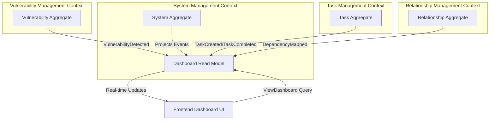
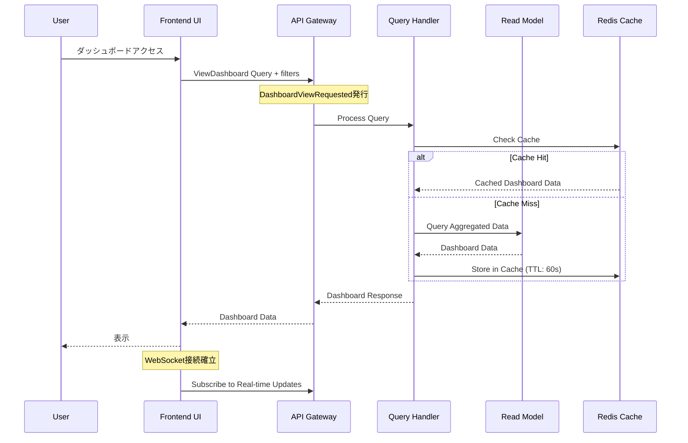
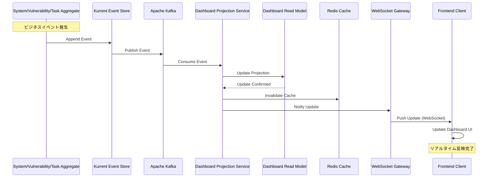

# US-SM-006: ダッシュボード機能 - ドメイン設計仕様書

**担当**: ソフトウェアアーキテクト
**作成日**: 2025-09-30
**Issue**: #170 (US-SM-006-001: ダッシュボード機能のドメイン設計)
**親Issue**: US-SM-006 (ダッシュボード表示)
**アーキテクチャパターン**: オニオンアーキテクチャ + DDD + CQRS + イベントソーシング

## 1. アーキテクチャ概要

### 1.1 設計方針

**Dashboard機能の特性**:

ダッシュボードは本質的に**Query Model（読み取り専用モデル）**であり、複数の集約からデータを集約して表示する**Read-side**機能です。Event Sourcingアーキテクチャにおいて、ダッシュボードは以下の特性を持ちます：

- **Command側には存在しない**: ダッシュボードはビジネスロジックを持たず、状態を変更しない
- **Read Model専用**: 複数の集約から投影されたデータを効率的にクエリする
- **結果整合性許容**: リアルタイム性は重要だが、数秒の遅延は許容される
- **CQRS最適化**: 読み取り専用に最適化されたスキーマ設計

**設計上の重要な決定**:

1. **Dashboard Aggregateは作成しない**: ダッシュボードはAggregate Rootではなく、Read Modelとして設計
2. **DashboardViewRequested は技術的なイベント**: ビジネスイベントではなく、UI/UXレイヤーのリクエストイベント
3. **ViewDashboard は Query**: Commandではなく、CQRSのQuery側として設計
4. **リアルタイム更新はEvent-driven**: Kafkaによるイベントストリーミングで実現

### 1.2 品質属性優先順位

1. **パフォーマンス**: 2秒未満のレスポンス時間（複雑な集約クエリでも高速）
2. **リアルタイム性**: 数秒以内のデータ更新反映（WebSocket/SSE経由）
3. **可用性**: 99%以上のビジネス時間稼働率
4. **スケーラビリティ**: 5-10同時ユーザーに対応
5. **保守性**: Read Modelの独立性による変更容易性

### 1.3 コンテキストマッピング



**境界の定義**:

- **Dashboard Read Model** は System Management Context に属する
- 他のContext（Vulnerability, Task, Relationship）からのイベントを購読し、投影を更新
- Dashboard専用の非正規化された高速クエリ用スキーマを持つ

## 2. イベント設計

### 2.1 DashboardViewRequested イベント

**分類**: Technical Event (ビジネスイベントではない)

#### 2.1.1 イベント仕様

| プロパティ名 | 型 | 説明 | 制約 |
|-------------|----|----|------|
| eventId | string | イベント一意識別子 | UUID v4、必須 |
| eventType | string | イベント種別 | "DashboardViewRequested"、必須 |
| timestamp | Date | イベント発生日時 | ISO 8601形式、必須 |
| userId | UserId | リクエストユーザーID | 必須 |
| sessionId | string | セッション識別子 | 任意 |
| filters | DashboardFilters | フィルター条件 | 任意 |
| viewMode | ViewMode | 表示モード | "overview" \| "detailed"、デフォルト: "overview" |
| metadata | RequestMetadata | リクエストメタデータ | 任意 |

#### 2.1.2 TypeScript型定義

```typescript
import { DomainEvent } from '@shared/domain/DomainEvent';
import { UserId } from '@shared/domain/UserId';

export interface DashboardFilters {
  systemTypes?: SystemType[];
  criticality?: CriticalityLevel[];
  status?: SystemStatus[];
  hasVulnerabilities?: boolean;
  hasEOLWarnings?: boolean;
}

export type ViewMode = 'overview' | 'detailed';

export interface RequestMetadata {
  userAgent?: string;
  ipAddress?: string;
  requestId?: string;
}

export class DashboardViewRequested extends DomainEvent {
  public readonly userId: UserId;
  public readonly sessionId?: string;
  public readonly filters?: DashboardFilters;
  public readonly viewMode: ViewMode;
  public readonly metadata?: RequestMetadata;

  constructor(props: {
    userId: UserId;
    sessionId?: string;
    filters?: DashboardFilters;
    viewMode?: ViewMode;
    metadata?: RequestMetadata;
  }) {
    super({
      eventType: 'DashboardViewRequested',
      aggregateType: 'Dashboard', // Technical aggregate
      aggregateId: props.userId.getValue(), // User-scoped
    });

    this.userId = props.userId;
    this.sessionId = props.sessionId;
    this.filters = props.filters;
    this.viewMode = props.viewMode || 'overview';
    this.metadata = props.metadata;
  }

  public toJSON(): Record<string, unknown> {
    return {
      ...super.toJSON(),
      userId: this.userId.getValue(),
      sessionId: this.sessionId,
      filters: this.filters,
      viewMode: this.viewMode,
      metadata: this.metadata,
    };
  }
}
```

#### 2.1.3 イベント発行タイミング

1. **ユーザーがダッシュボード画面にアクセス**: 初回ロード時
2. **フィルター変更時**: ユーザーがフィルター条件を変更
3. **表示モード切替時**: Overview ⇔ Detailed切替
4. **定期リフレッシュ**: 自動リフレッシュ機能（オプション）

#### 2.1.4 イベント処理フロー



## 3. コマンド設計

### 3.1 ViewDashboard Query（コマンドではない）

**重要**: CQRSパターンにおいて、ダッシュボード表示は**Query**であり、**Command**ではありません。

#### 3.1.1 Query仕様

| プロパティ名 | 型 | 説明 | 制約 |
|-------------|----|----|------|
| queryId | string | クエリ識別子 | UUID v4、必須 |
| userId | UserId | リクエストユーザーID | 必須 |
| filters | DashboardFilters | フィルター条件 | 任意 |
| viewMode | ViewMode | 表示モード | "overview" \| "detailed"、デフォルト: "overview" |
| pagination | PaginationOptions | ページング設定 | 任意 |

#### 3.1.2 TypeScript型定義

```typescript
import { IQuery } from '@nestjs/cqrs';
import { UserId } from '@shared/domain/UserId';

export interface PaginationOptions {
  page: number;
  pageSize: number;
  sortBy?: string;
  sortOrder?: 'asc' | 'desc';
}

export class ViewDashboardQuery implements IQuery {
  constructor(
    public readonly queryId: string,
    public readonly userId: UserId,
    public readonly filters?: DashboardFilters,
    public readonly viewMode: ViewMode = 'overview',
    public readonly pagination?: PaginationOptions,
  ) {}
}
```

#### 3.1.3 Query Handler実装

```typescript
import { IQueryHandler, QueryHandler } from '@nestjs/cqrs';
import { DashboardReadModelRepository } from '../infrastructure/DashboardReadModelRepository';
import { DashboardResponse } from './DashboardResponse';

@QueryHandler(ViewDashboardQuery)
export class ViewDashboardQueryHandler implements IQueryHandler<ViewDashboardQuery> {
  constructor(
    private readonly dashboardRepository: DashboardReadModelRepository,
    private readonly cacheService: CacheService,
    private readonly authorizationService: AuthorizationService,
  ) {}

  async execute(query: ViewDashboardQuery): Promise<DashboardResponse> {
    // 1. 認可チェック
    await this.authorizationService.ensureCanViewDashboard(query.userId);

    // 2. キャッシュ確認
    const cacheKey = this.buildCacheKey(query);
    const cachedData = await this.cacheService.get<DashboardResponse>(cacheKey);

    if (cachedData) {
      return cachedData;
    }

    // 3. Read Modelからデータ取得
    const dashboardData = await this.dashboardRepository.findDashboardData(
      query.userId,
      query.filters,
      query.viewMode,
      query.pagination,
    );

    // 4. レスポンス構築
    const response = new DashboardResponse(dashboardData);

    // 5. キャッシュ保存（TTL: 60秒）
    await this.cacheService.set(cacheKey, response, 60);

    return response;
  }

  private buildCacheKey(query: ViewDashboardQuery): string {
    return `dashboard:${query.userId.getValue()}:${JSON.stringify(query.filters)}:${query.viewMode}`;
  }
}
```

### 3.2 DashboardResponse 型定義

```typescript
export interface SystemSummary {
  systemId: string;
  systemName: string;
  systemType: SystemType;
  status: SystemStatus;
  criticality: CriticalityLevel;

  // Vulnerability Info (from Vulnerability Context)
  vulnerabilityCount: number;
  highSeverityVulnerabilities: number;
  criticalVulnerabilities: number;
  maxCVSSScore?: number;

  // EOL Info (from System Context)
  hasEOLWarnings: boolean;
  eolDaysRemaining?: number;

  // Task Info (from Task Context)
  openTaskCount: number;
  urgentTaskCount: number;
  overdueTaskCount: number;

  // Last Updated
  lastUpdated: Date;
}

export interface DashboardStatistics {
  totalSystems: number;
  activeSystems: number;
  systemsWithVulnerabilities: number;
  systemsWithEOLWarnings: number;

  totalVulnerabilities: number;
  criticalVulnerabilities: number;

  totalTasks: number;
  urgentTasks: number;
  overdueTasks: number;
}

export class DashboardResponse {
  public readonly statistics: DashboardStatistics;
  public readonly systems: SystemSummary[];
  public readonly timestamp: Date;
  public readonly viewMode: ViewMode;

  constructor(data: {
    statistics: DashboardStatistics;
    systems: SystemSummary[];
    viewMode: ViewMode;
  }) {
    this.statistics = data.statistics;
    this.systems = data.systems;
    this.viewMode = data.viewMode;
    this.timestamp = new Date();
  }
}
```

## 4. Read Model設計

### 4.1 Dashboard Read Model スキーマ

**設計原則**:

- **非正規化**: クエリパフォーマンス最適化のため、意図的に冗長化
- **結合なし**: 可能な限りSingle Table Queryで完結
- **マテリアライズドビュー**: PostgreSQLのMaterialized Viewを活用
- **キャッシュ**: Redisで頻繁にアクセスされるデータをキャッシュ

#### 4.1.1 PostgreSQL Read Model Schema

```sql
-- Dashboard専用の非正規化テーブル
CREATE TABLE dashboard_system_view (
  system_id UUID PRIMARY KEY,
  system_name VARCHAR(255) NOT NULL,
  system_type VARCHAR(50) NOT NULL,
  system_status VARCHAR(50) NOT NULL,
  criticality VARCHAR(50) NOT NULL,
  security_classification VARCHAR(50) NOT NULL,

  -- Vulnerability aggregated data
  vulnerability_count INTEGER DEFAULT 0,
  high_severity_vulnerabilities INTEGER DEFAULT 0,
  critical_vulnerabilities INTEGER DEFAULT 0,
  max_cvss_score NUMERIC(3,1),
  latest_vulnerability_date TIMESTAMP,

  -- EOL aggregated data
  has_eol_warnings BOOLEAN DEFAULT FALSE,
  eol_days_remaining INTEGER,
  eol_packages_count INTEGER DEFAULT 0,

  -- Task aggregated data
  open_task_count INTEGER DEFAULT 0,
  urgent_task_count INTEGER DEFAULT 0,
  overdue_task_count INTEGER DEFAULT 0,
  latest_task_due_date TIMESTAMP,

  -- Package summary
  total_packages INTEGER DEFAULT 0,
  vulnerable_packages INTEGER DEFAULT 0,

  -- Metadata
  created_at TIMESTAMP NOT NULL DEFAULT NOW(),
  updated_at TIMESTAMP NOT NULL DEFAULT NOW(),
  last_event_applied_at TIMESTAMP NOT NULL,

  -- Indexes for filtering
  INDEX idx_system_status (system_status),
  INDEX idx_criticality (criticality),
  INDEX idx_has_vulnerabilities (vulnerability_count) WHERE vulnerability_count > 0,
  INDEX idx_has_eol_warnings (has_eol_warnings) WHERE has_eol_warnings = TRUE,
  INDEX idx_has_urgent_tasks (urgent_task_count) WHERE urgent_task_count > 0
);

-- Dashboard統計情報（Materialized View）
CREATE MATERIALIZED VIEW dashboard_statistics AS
SELECT
  COUNT(*) AS total_systems,
  COUNT(*) FILTER (WHERE system_status = 'ACTIVE') AS active_systems,
  COUNT(*) FILTER (WHERE vulnerability_count > 0) AS systems_with_vulnerabilities,
  COUNT(*) FILTER (WHERE has_eol_warnings = TRUE) AS systems_with_eol_warnings,

  COALESCE(SUM(vulnerability_count), 0) AS total_vulnerabilities,
  COALESCE(SUM(critical_vulnerabilities), 0) AS critical_vulnerabilities,

  COALESCE(SUM(open_task_count), 0) AS total_tasks,
  COALESCE(SUM(urgent_task_count), 0) AS urgent_tasks,
  COALESCE(SUM(overdue_task_count), 0) AS overdue_tasks,

  MAX(updated_at) AS last_updated
FROM dashboard_system_view;

-- Materialized Viewの定期リフレッシュ（PostgreSQL Scheduler）
CREATE INDEX ON dashboard_statistics (last_updated);

-- 自動リフレッシュ用関数
CREATE OR REPLACE FUNCTION refresh_dashboard_statistics()
RETURNS void AS $$
BEGIN
  REFRESH MATERIALIZED VIEW CONCURRENTLY dashboard_statistics;
END;
$$ LANGUAGE plpgsql;
```

### 4.2 Event Projection Service

Read Modelは複数のContextからのイベントを購読し、投影を更新します。

#### 4.2.1 DashboardProjectionService実装

```typescript
import { EventsHandler, IEventHandler } from '@nestjs/cqrs';
import {
  SystemRegistered,
  PackageInstalled,
  SystemDecommissioned
} from '../domain/events';
import {
  VulnerabilityDetected,
  VulnerabilityResolved
} from '@vulnerability-management/domain/events';
import {
  TaskCreated,
  TaskCompleted,
  TaskEscalated
} from '@task-management/domain/events';

@Injectable()
export class DashboardProjectionService {
  constructor(
    private readonly dashboardRepository: DashboardReadModelRepository,
    private readonly eventBus: EventBus,
  ) {}

  async onModuleInit() {
    // Subscribe to events from multiple contexts
    this.subscribeToSystemEvents();
    this.subscribeToVulnerabilityEvents();
    this.subscribeToTaskEvents();
  }

  private subscribeToSystemEvents() {
    this.eventBus.subscribe(SystemRegistered, this.onSystemRegistered.bind(this));
    this.eventBus.subscribe(PackageInstalled, this.onPackageInstalled.bind(this));
    this.eventBus.subscribe(SystemDecommissioned, this.onSystemDecommissioned.bind(this));
  }

  private subscribeToVulnerabilityEvents() {
    this.eventBus.subscribe(VulnerabilityDetected, this.onVulnerabilityDetected.bind(this));
    this.eventBus.subscribe(VulnerabilityResolved, this.onVulnerabilityResolved.bind(this));
  }

  private subscribeToTaskEvents() {
    this.eventBus.subscribe(TaskCreated, this.onTaskCreated.bind(this));
    this.eventBus.subscribe(TaskCompleted, this.onTaskCompleted.bind(this));
    this.eventBus.subscribe(TaskEscalated, this.onTaskEscalated.bind(this));
  }

  @EventsHandler(SystemRegistered)
  async onSystemRegistered(event: SystemRegistered): Promise<void> {
    await this.dashboardRepository.insertSystemView({
      systemId: event.systemId,
      systemName: event.systemName,
      systemType: event.systemType,
      systemStatus: event.status,
      criticality: event.criticality,
      securityClassification: event.securityClassification,
      totalPackages: 0,
      vulnerablePackages: 0,
      lastEventAppliedAt: event.timestamp,
    });
  }

  @EventsHandler(VulnerabilityDetected)
  async onVulnerabilityDetected(event: VulnerabilityDetected): Promise<void> {
    // Update vulnerability counts for affected systems
    for (const systemId of event.affectedSystems) {
      await this.dashboardRepository.incrementVulnerabilityCount(
        systemId,
        event.cvssScore >= 9.0 ? 'critical' : 'high',
        event.cvssScore,
      );
    }

    // Invalidate cache for affected systems
    await this.invalidateCacheForSystems(event.affectedSystems);
  }

  @EventsHandler(TaskCreated)
  async onTaskCreated(event: TaskCreated): Promise<void> {
    if (event.systemRef) {
      await this.dashboardRepository.incrementTaskCount(
        event.systemRef,
        event.priority === 'URGENT' ? 'urgent' : 'normal',
      );

      // Invalidate cache
      await this.invalidateCacheForSystems([event.systemRef]);
    }
  }

  private async invalidateCacheForSystems(systemIds: string[]): Promise<void> {
    // Invalidate Redis cache for affected systems
    const cacheKeys = systemIds.map(id => `dashboard:*:*${id}*`);
    await this.cacheService.deletePattern(cacheKeys);
  }
}
```

## 5. リアルタイム更新アーキテクチャ

### 5.1 イベントストリーミング設計

**技術スタック**:

- **Apache Kafka**: イベントストリーミングプラットフォーム
- **WebSocket/Server-Sent Events (SSE)**: クライアント通知
- **Redis Pub/Sub**: 軽量な通知チャネル（オプション）

#### 5.1.1 Kafka Topic設計

```yaml
# Dashboard更新専用トピック
topics:
  - name: dashboard.system.updates
    partitions: 3
    replication_factor: 1
    config:
      retention.ms: 86400000  # 24時間保持
      cleanup.policy: delete

  - name: dashboard.vulnerability.updates
    partitions: 3
    replication_factor: 1

  - name: dashboard.task.updates
    partitions: 3
    replication_factor: 1
```

#### 5.1.2 Real-time Update Flow



### 5.2 WebSocket Gateway実装

```typescript
import {
  WebSocketGateway,
  WebSocketServer,
  OnGatewayConnection,
  OnGatewayDisconnect,
  SubscribeMessage,
} from '@nestjs/websockets';
import { Server, Socket } from 'socket.io';

@WebSocketGateway({
  namespace: '/dashboard',
  cors: {
    origin: process.env.FRONTEND_URL,
    credentials: true,
  },
})
export class DashboardGateway implements OnGatewayConnection, OnGatewayDisconnect {
  @WebSocketServer()
  server: Server;

  private readonly userSockets = new Map<string, Set<string>>(); // userId -> socketIds

  constructor(
    private readonly authService: AuthService,
    private readonly eventBus: EventBus,
  ) {
    // Subscribe to dashboard update events
    this.subscribeToDashboardEvents();
  }

  async handleConnection(socket: Socket) {
    try {
      // Authenticate socket connection
      const token = socket.handshake.auth.token;
      const user = await this.authService.validateToken(token);

      if (!user) {
        socket.disconnect();
        return;
      }

      // Store socket mapping
      socket.data.userId = user.id;
      this.addUserSocket(user.id, socket.id);

      // Send initial data
      socket.emit('connected', { userId: user.id });

    } catch (error) {
      socket.disconnect();
    }
  }

  handleDisconnect(socket: Socket) {
    const userId = socket.data.userId;
    if (userId) {
      this.removeUserSocket(userId, socket.id);
    }
  }

  @SubscribeMessage('subscribe-system')
  handleSubscribeSystem(socket: Socket, systemId: string) {
    socket.join(`system:${systemId}`);
  }

  @SubscribeMessage('unsubscribe-system')
  handleUnsubscribeSystem(socket: Socket, systemId: string) {
    socket.leave(`system:${systemId}`);
  }

  // Event handlers
  private subscribeToDashboardEvents() {
    this.eventBus.subscribe('dashboard.update', (update: DashboardUpdate) => {
      this.broadcastUpdate(update);
    });
  }

  private broadcastUpdate(update: DashboardUpdate) {
    if (update.systemId) {
      // Broadcast to subscribers of specific system
      this.server.to(`system:${update.systemId}`).emit('system-update', update);
    } else {
      // Broadcast to all connected clients
      this.server.emit('dashboard-update', update);
    }
  }

  private addUserSocket(userId: string, socketId: string) {
    if (!this.userSockets.has(userId)) {
      this.userSockets.set(userId, new Set());
    }
    this.userSockets.get(userId)!.add(socketId);
  }

  private removeUserSocket(userId: string, socketId: string) {
    const sockets = this.userSockets.get(userId);
    if (sockets) {
      sockets.delete(socketId);
      if (sockets.size === 0) {
        this.userSockets.delete(userId);
      }
    }
  }
}
```

### 5.3 フロントエンド統合例

```typescript
// Frontend Dashboard Service
import { io, Socket } from 'socket.io-client';

export class DashboardRealtimeService {
  private socket: Socket | null = null;
  private listeners: Map<string, Function[]> = new Map();

  connect(token: string) {
    this.socket = io(`${process.env.API_URL}/dashboard`, {
      auth: { token },
      transports: ['websocket'],
    });

    this.socket.on('connected', (data) => {
      console.log('Dashboard WebSocket connected:', data);
    });

    this.socket.on('system-update', (update: DashboardUpdate) => {
      this.notifyListeners('system-update', update);
    });

    this.socket.on('dashboard-update', (update: DashboardUpdate) => {
      this.notifyListeners('dashboard-update', update);
    });
  }

  subscribeToSystem(systemId: string) {
    this.socket?.emit('subscribe-system', systemId);
  }

  unsubscribeFromSystem(systemId: string) {
    this.socket?.emit('unsubscribe-system', systemId);
  }

  onUpdate(event: string, callback: (update: DashboardUpdate) => void) {
    if (!this.listeners.has(event)) {
      this.listeners.set(event, []);
    }
    this.listeners.get(event)!.push(callback);
  }

  private notifyListeners(event: string, data: any) {
    const callbacks = this.listeners.get(event) || [];
    callbacks.forEach(cb => cb(data));
  }

  disconnect() {
    this.socket?.disconnect();
    this.socket = null;
  }
}
```

## 6. 境界の定義

### 6.1 System Management Context内のDashboard境界

**Dashboard機能の位置づけ**:

```text
System Management Context
├── Domain Layer
│   ├── System Aggregate (Write Model)
│   ├── Package Entity (Write Model)
│   └── Value Objects
├── Application Layer
│   ├── Command Handlers (Write)
│   └── Query Handlers (Read)
│       └── ViewDashboardQueryHandler ← ここに配置
├── Infrastructure Layer
│   ├── Kurrent Repository (Event Store)
│   ├── PostgreSQL Read Model Repository ← Dashboard Read Model
│   └── Kafka Event Publisher
└── Presentation Layer
    ├── REST Controllers
    ├── GraphQL Resolvers
    └── WebSocket Gateway ← Dashboard Gateway
```

**境界ルール**:

1. **Dashboard Read Modelは System Management Contextに属する**
   - System Aggregateからの投影を含む
   - 他Contextからのイベントも購読可能（Published Language）

2. **Dashboard機能はQuery専用**
   - Commandを発行しない
   - Aggregateの状態を変更しない
   - Read Modelからのみデータ取得

3. **リアルタイム更新は Presentation Layerで処理**
   - WebSocket GatewayはPresentation Layer
   - Event BusからDashboard更新通知を受信
   - クライアントに配信

### 6.2 他Contextとの連携

**Published Language Pattern適用**:

```typescript
// Vulnerability Management Context → Dashboard
export class VulnerabilityDetected extends DomainEvent {
  // Dashboard Projectionで利用される公開データ
  public readonly affectedSystems: string[]; // SystemId[]
  public readonly cvssScore: number;
  public readonly severity: string;
}

// Task Management Context → Dashboard
export class TaskCreated extends DomainEvent {
  // Dashboard Projectionで利用される公開データ
  public readonly systemRef?: string; // SystemId
  public readonly priority: string;
  public readonly dueDate: Date;
}

// Dashboard ProjectionはこれらのPublished Eventsを購読
```

**Anti-Corruption Layer (ACL)**:

Dashboard Projection Serviceは各Contextのイベントを自身のRead Model形式に変換します：

```typescript
// VulnerabilityDetectedをDashboard Read Model用に変換
private transformVulnerabilityEvent(event: VulnerabilityDetected): DashboardVulnerabilityUpdate {
  return {
    systemIds: event.affectedSystems,
    vulnerabilityCount: 1,
    severity: this.mapSeverity(event.cvssScore),
    timestamp: event.timestamp,
  };
}

private mapSeverity(cvssScore: number): 'critical' | 'high' | 'medium' | 'low' {
  if (cvssScore >= 9.0) return 'critical';
  if (cvssScore >= 7.0) return 'high';
  if (cvssScore >= 4.0) return 'medium';
  return 'low';
}
```

## 7. パフォーマンス最適化戦略

### 7.1 キャッシュ戦略

**多層キャッシュアーキテクチャ**:

```typescript
export class DashboardCacheStrategy {
  // L1 Cache: In-Memory (Node.js)
  private readonly memoryCache = new Map<string, CacheEntry>();

  // L2 Cache: Redis
  constructor(
    private readonly redis: RedisService,
  ) {}

  async get<T>(key: string): Promise<T | null> {
    // L1 Check
    const memCache = this.memoryCache.get(key);
    if (memCache && !memCache.isExpired()) {
      return memCache.value as T;
    }

    // L2 Check
    const redisValue = await this.redis.get(key);
    if (redisValue) {
      const parsed = JSON.parse(redisValue) as T;

      // Populate L1
      this.memoryCache.set(key, {
        value: parsed,
        expiresAt: Date.now() + 30000, // 30秒
      });

      return parsed;
    }

    return null;
  }

  async set<T>(key: string, value: T, ttlSeconds: number): Promise<void> {
    // Set L1
    this.memoryCache.set(key, {
      value,
      expiresAt: Date.now() + Math.min(ttlSeconds * 1000, 30000),
    });

    // Set L2
    await this.redis.set(key, JSON.stringify(value), ttlSeconds);
  }

  async invalidate(pattern: string): Promise<void> {
    // Clear L1
    for (const key of this.memoryCache.keys()) {
      if (this.matchesPattern(key, pattern)) {
        this.memoryCache.delete(key);
      }
    }

    // Clear L2
    await this.redis.deletePattern(pattern);
  }

  private matchesPattern(key: string, pattern: string): boolean {
    const regex = new RegExp(pattern.replace(/\*/g, '.*'));
    return regex.test(key);
  }
}
```

**キャッシュTTL戦略**:

| データ種別 | TTL | 理由 |
|-----------|-----|------|
| Dashboard統計 | 60秒 | 頻繁に変更されるが、リアルタイム性よりパフォーマンス優先 |
| システムリスト | 30秒 | 中程度の変更頻度 |
| 個別システム詳細 | 120秒 | 変更頻度低い |
| フィルター結果 | 60秒 | ユーザー操作に応じて変化 |

### 7.2 クエリ最適化

**Indexed Query Patterns**:

```sql
-- 高速フィルタリング用インデックス
CREATE INDEX CONCURRENTLY idx_dashboard_critical_systems
ON dashboard_system_view (criticality, system_status)
WHERE criticality IN ('HIGH', 'CRITICAL') AND system_status = 'ACTIVE';

-- 脆弱性検索用複合インデックス
CREATE INDEX CONCURRENTLY idx_dashboard_vulnerabilities
ON dashboard_system_view (vulnerability_count, max_cvss_score)
WHERE vulnerability_count > 0;

-- EOL警告用部分インデックス
CREATE INDEX CONCURRENTLY idx_dashboard_eol_warnings
ON dashboard_system_view (eol_days_remaining)
WHERE has_eol_warnings = TRUE;
```

**Materialized View自動更新**:

```sql
-- PostgreSQL pgAgent / pg_cron による定期更新
SELECT cron.schedule(
  'refresh-dashboard-stats',
  '*/5 * * * *', -- 5分ごと
  $$REFRESH MATERIALIZED VIEW CONCURRENTLY dashboard_statistics$$
);
```

### 7.3 Event Projectionバッチ処理

大量のイベントを効率的に処理するためのバッチ最適化：

```typescript
export class DashboardProjectionBatchProcessor {
  private readonly batchSize = 100;
  private eventBuffer: DomainEvent[] = [];
  private flushTimer: NodeJS.Timeout | null = null;

  async processEvent(event: DomainEvent): Promise<void> {
    this.eventBuffer.push(event);

    if (this.eventBuffer.length >= this.batchSize) {
      await this.flush();
    } else if (!this.flushTimer) {
      // 最大5秒でフラッシュ
      this.flushTimer = setTimeout(() => this.flush(), 5000);
    }
  }

  private async flush(): Promise<void> {
    if (this.eventBuffer.length === 0) return;

    const batch = this.eventBuffer.splice(0, this.batchSize);

    // バッチ更新
    await this.dashboardRepository.batchUpdate(
      batch.map(event => this.transformEvent(event))
    );

    if (this.flushTimer) {
      clearTimeout(this.flushTimer);
      this.flushTimer = null;
    }
  }
}
```

## 8. セキュリティ・認可設計

### 8.1 ダッシュボードアクセス制御

**Role-Based Access Control (RBAC)**:

```typescript
export enum DashboardPermission {
  VIEW_OWN_SYSTEMS = 'dashboard:view:own',
  VIEW_ALL_SYSTEMS = 'dashboard:view:all',
  VIEW_CONFIDENTIAL = 'dashboard:view:confidential',
  VIEW_RESTRICTED = 'dashboard:view:restricted',
}

export class DashboardAuthorizationService {
  constructor(
    private readonly authService: AuthService,
  ) {}

  async ensureCanViewDashboard(userId: UserId): Promise<void> {
    const user = await this.authService.getUser(userId);

    if (!user.hasPermission(DashboardPermission.VIEW_OWN_SYSTEMS)) {
      throw new UnauthorizedError('User does not have dashboard view permission');
    }
  }

  async filterSystemsByAuthorization(
    userId: UserId,
    systems: SystemSummary[],
  ): Promise<SystemSummary[]> {
    const user = await this.authService.getUser(userId);

    if (user.hasPermission(DashboardPermission.VIEW_ALL_SYSTEMS)) {
      return systems;
    }

    // Filter by user's assigned systems
    const assignedSystemIds = await this.getAssignedSystemIds(userId);
    return systems.filter(s => assignedSystemIds.includes(s.systemId));
  }

  async maskConfidentialData(
    userId: UserId,
    system: SystemSummary,
  ): Promise<SystemSummary> {
    const user = await this.authService.getUser(userId);

    if (system.securityClassification === 'CONFIDENTIAL' &&
        !user.hasPermission(DashboardPermission.VIEW_CONFIDENTIAL)) {
      return {
        ...system,
        systemName: '*** CONFIDENTIAL ***',
        // Mask other sensitive fields
      };
    }

    return system;
  }
}
```

### 8.2 監査ログ

```typescript
@Injectable()
export class DashboardAuditService {
  async logDashboardAccess(query: ViewDashboardQuery, response: DashboardResponse): Promise<void> {
    await this.auditRepository.log({
      eventType: 'DASHBOARD_ACCESSED',
      userId: query.userId.getValue(),
      timestamp: new Date(),
      metadata: {
        filters: query.filters,
        viewMode: query.viewMode,
        systemCount: response.systems.length,
        ipAddress: query.metadata?.ipAddress,
      },
    });
  }

  async logUnauthorizedAccess(userId: UserId, reason: string): Promise<void> {
    await this.auditRepository.log({
      eventType: 'DASHBOARD_UNAUTHORIZED_ACCESS',
      userId: userId.getValue(),
      timestamp: new Date(),
      severity: 'WARNING',
      metadata: { reason },
    });
  }
}
```

## 9. 実装順序と段階的展開

### 9.1 Phase 1: 基本ダッシュボード (MVP)

**スコープ**:

- [ ] ViewDashboardQuery実装
- [ ] Dashboard Read Model (PostgreSQL)
- [ ] System Aggregateからの投影
- [ ] 基本的なフィルタリング機能
- [ ] REST API実装

**成功基準**:

- システム一覧表示（2秒未満）
- 基本統計情報表示
- 5同時ユーザー対応

### 9.2 Phase 2: リアルタイム更新

**スコープ**:

- [ ] Kafka Event Streaming統合
- [ ] WebSocket Gateway実装
- [ ] 他Contextからのイベント購読（Vulnerability, Task）
- [ ] リアルタイム投影更新

**成功基準**:

- イベント発生から5秒以内のUI反映
- WebSocket接続安定性 99%以上

### 9.3 Phase 3: 高度な機能

**スコープ**:

- [ ] 高度なフィルタリング
- [ ] カスタムダッシュボード
- [ ] エクスポート機能
- [ ] 多層キャッシュ最適化

**成功基準**:

- 複雑なクエリでも2秒未満
- キャッシュヒット率 80%以上

## 10. テスト戦略

### 10.1 Query Handler Unit Test

```typescript
describe('ViewDashboardQueryHandler', () => {
  let handler: ViewDashboardQueryHandler;
  let repository: MockDashboardRepository;
  let cacheService: MockCacheService;

  beforeEach(() => {
    repository = new MockDashboardRepository();
    cacheService = new MockCacheService();
    handler = new ViewDashboardQueryHandler(repository, cacheService, authService);
  });

  it('should return dashboard data from cache if available', async () => {
    const query = new ViewDashboardQuery(
      'query-123',
      UserId.create('user-123'),
    );

    const cachedData = createMockDashboardResponse();
    cacheService.set('dashboard:user-123::overview', cachedData);

    const result = await handler.execute(query);

    expect(result).toEqual(cachedData);
    expect(repository.findDashboardData).not.toHaveBeenCalled();
  });

  it('should query repository and cache result if cache miss', async () => {
    const query = new ViewDashboardQuery(
      'query-123',
      UserId.create('user-123'),
    );

    const mockData = createMockDashboardResponse();
    repository.mockFindDashboardData(mockData);

    const result = await handler.execute(query);

    expect(result).toEqual(mockData);
    expect(repository.findDashboardData).toHaveBeenCalledTimes(1);
    expect(cacheService.get('dashboard:user-123::overview')).toEqual(mockData);
  });
});
```

### 10.2 Projection Integration Test

```typescript
describe('DashboardProjectionService', () => {
  it('should update dashboard when VulnerabilityDetected event occurs', async () => {
    const event = new VulnerabilityDetected({
      vulnerabilityId: 'CVE-2024-1234',
      affectedSystems: ['system-123'],
      cvssScore: 9.5,
      severity: 'CRITICAL',
    });

    await projectionService.onVulnerabilityDetected(event);

    const dashboardData = await repository.findSystemView('system-123');
    expect(dashboardData.criticalVulnerabilities).toBe(1);
    expect(dashboardData.maxCVSSScore).toBe(9.5);
  });
});
```

### 10.3 WebSocket Integration Test

```typescript
describe('DashboardGateway', () => {
  it('should broadcast update to subscribed clients', async () => {
    const client = await createTestClient();
    await client.emit('subscribe-system', 'system-123');

    const update = {
      systemId: 'system-123',
      updateType: 'vulnerability',
      data: { count: 1 },
    };

    gateway.broadcastUpdate(update);

    await expect(client).toReceive('system-update', update);
  });
});
```

## 11. 運用・監視

### 11.1 メトリクス収集

```typescript
export class DashboardMetricsCollector {
  @Histogram({
    name: 'dashboard_query_duration_seconds',
    help: 'Dashboard query execution time',
    labelNames: ['view_mode', 'filter_count'],
  })
  queryDuration: Histogram;

  @Counter({
    name: 'dashboard_cache_hits_total',
    help: 'Number of cache hits',
  })
  cacheHits: Counter;

  @Gauge({
    name: 'dashboard_active_websocket_connections',
    help: 'Number of active WebSocket connections',
  })
  activeConnections: Gauge;
}
```

### 11.2 ヘルスチェック

```typescript
@Controller('health')
export class DashboardHealthController {
  @Get('dashboard/readiness')
  async checkReadiness(): Promise<HealthCheckResult> {
    const checks = await Promise.all([
      this.checkReadModelConnection(),
      this.checkCacheConnection(),
      this.checkKafkaConnection(),
    ]);

    return {
      status: checks.every(c => c.healthy) ? 'healthy' : 'unhealthy',
      checks,
    };
  }
}
```

## 12. まとめ

### 12.1 主要な設計決定

| 決定事項 | 選択 | 理由 |
|---------|------|------|
| Aggregateの有無 | Dashboard Aggregateは作成しない | ダッシュボードはRead Model専用、ビジネスロジックなし |
| イベント分類 | DashboardViewRequestedは技術イベント | ビジネスイベントではなくUI/UXレイヤーの要求 |
| Command/Query | ViewDashboardはQuery | CQRSのQuery側、状態変更なし |
| Read Model設計 | 非正規化・Single Table | クエリパフォーマンス最優先 |
| リアルタイム更新 | Kafka + WebSocket | Event-drivenアーキテクチャに最適 |
| キャッシュ戦略 | 多層キャッシュ (Memory + Redis) | パフォーマンス最適化 |
| Context境界 | System Management Context | System Aggregateの投影を含む |

### 12.2 成果物チェックリスト

- [x] **DashboardViewRequested イベント構造設計完了**
  - 技術イベントとして定義
  - フィルター、表示モード等のプロパティ設計

- [x] **ViewDashboard Query仕様設計完了**
  - CQRSのQueryとして設計
  - Query Handler実装パターン定義

- [x] **Dashboard Read Model設計完了**
  - PostgreSQL非正規化スキーマ設計
  - Materialized View設計
  - Event Projection Service設計

- [x] **Dashboard境界定義完了**
  - System Management Context内に配置
  - Published Language Patternで他Contextと連携
  - Read Model専用として明確化

- [x] **リアルタイム更新アーキテクチャ設計完了**
  - Kafka Event Streaming設計
  - WebSocket Gateway実装設計
  - Event-driven更新フロー定義

### 12.3 次のアクション

**Backend Developer向け**:

1. Dashboard Read Model Repository実装
2. ViewDashboardQueryHandler実装
3. DashboardProjectionService実装
4. WebSocket Gateway実装

**Frontend Developer向け**:

1. Dashboard UI実装
2. WebSocketリアルタイム更新統合
3. フィルタリング・ソート機能実装

**Database Architect向け**:

1. PostgreSQL Read Modelスキーマ実装
2. Materialized View作成
3. インデックス最適化

**DevOps Engineer向け**:

1. Kafka Topic作成・設定
2. WebSocket負荷分散設定
3. メトリクス・監視設定

---

**設計完了日**: 2025-09-30
**設計者**: Software Architect
**レビュー推奨者**: Backend Developer, Database Architect, Frontend Developer
**次回更新**: 実装フェーズ完了後のフィードバック反映
