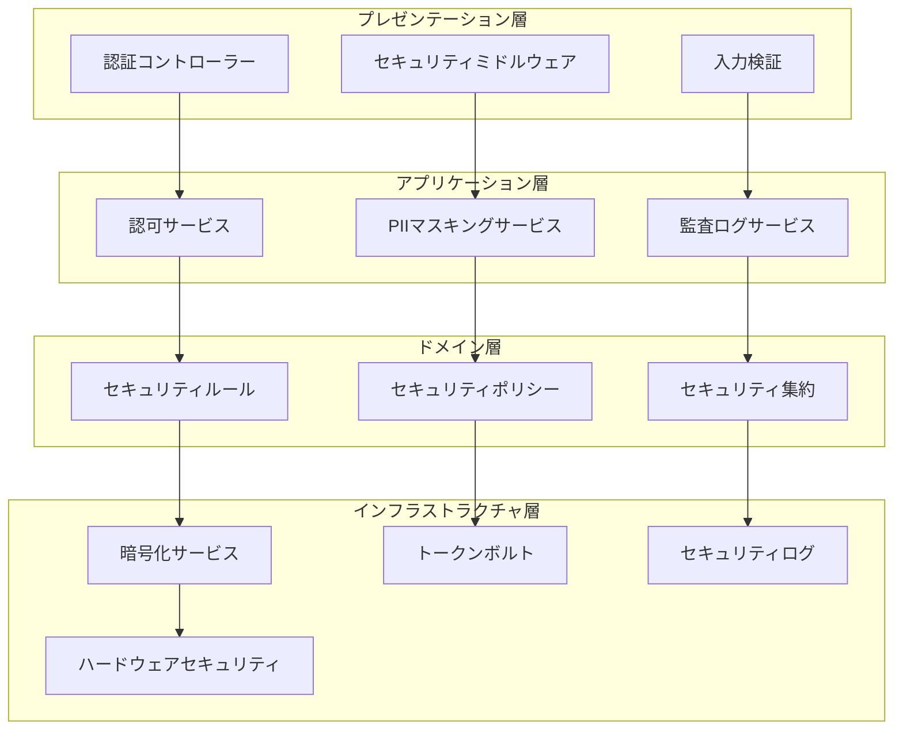

# セキュリティコンポーネント実装一覧

**担当**: セキュリティエンジニア
**作成日**: 2025-09-21
**Issue**: #34 (US-SM-001: システム新規登録)
**関連仕様**: System集約設計仕様書 (US-SM-001.md)
**アーキテクチャパターン**: オニオンアーキテクチャ + DDD + CQRS + イベントソーシング

## 1. アーキテクチャ概要

### 1.1 セキュリティ層構成



## 2. 認証・認可コンポーネント

### 2.1 認証関連コンポーネント

#### AuthenticationController

```typescript
// apps/backend/system-mgmt/src/presentation/controllers/authentication.controller.ts

@Controller('auth')
@ApiTags('Authentication')
export class AuthenticationController {
  constructor(
    private readonly authService: AuthenticationService,
    private readonly auditLogger: SecurityAuditLogger
  ) {}

  @Post('login')
  @ApiOperation({ summary: 'ユーザーログイン' })
  async login(@Body() loginDto: LoginDto): Promise<AuthResult> {
    // 実装内容: JWT認証、MFA対応、レート制限
  }

  @Post('logout')
  @ApiOperation({ summary: 'ユーザーログアウト' })
  async logout(@Req() request: Request): Promise<void> {
    // 実装内容: セッション無効化、監査ログ記録
  }
}
```

#### UserContextService

```typescript
// apps/backend/system-mgmt/src/application/services/user-context.service.ts

@Injectable()
export class UserContextService {
  constructor(
    private readonly jwtService: JwtService,
    private readonly roleRepository: UserRoleRepository
  ) {}

  async getCurrentUserRole(): Promise<UserRole> {
    // 実装内容: JWT検証、ロール情報取得
  }

  async getCurrentUserContext(): Promise<UserContext> {
    // 実装内容: ユーザー情報、権限、セッション情報の統合取得
  }
}
```

### 2.2 認可関連コンポーネント

#### SystemAuthorizationService

```typescript
// apps/backend/system-mgmt/src/application/services/system-authorization.service.ts

@Injectable()
export class SystemAuthorizationService {
  constructor(
    private readonly userContext: UserContextService,
    private readonly securityPolicy: SecurityPolicyService
  ) {}

  async authorizeCommand(command: SystemCommand, system?: System): Promise<AuthorizationResult>
  async authorizeFieldAccess(fieldName: string, classification: SecurityClassification): Promise<boolean>
  async authorizeClassificationChange(from: SecurityClassification, to: SecurityClassification): Promise<AuthorizationResult>
}
```

#### SecurityPolicyService

```typescript
// apps/backend/system-mgmt/src/domain/services/security-policy.service.ts

@Injectable()
export class SecurityPolicyService {
  getRequiredRoleForOperation(operation: string, classification: SecurityClassification): UserRole
  validateSecurityCompliance(system: System): SecurityComplianceResult
  enforceDataClassificationRules(data: any, classification: SecurityClassification): boolean
}
```

## 3. PII保護コンポーネント

### 3.1 PII検出コンポーネント

#### PatternBasedPIIDetector

```typescript
// apps/backend/system-mgmt/src/infrastructure/security/pii/pattern-detector.ts

@Injectable()
export class PatternBasedPIIDetector implements PIIDetector {
  private readonly patterns: PIIPattern[]

  detect(content: string, context: DetectionContext): Promise<PIIDetectionResult[]>
  private compilePatterns(): void
  private calculateConfidence(match: RegExpMatchArray, pattern: PIIPattern): number
}
```

#### ContextualPIIDetector

```typescript
// apps/backend/system-mgmt/src/infrastructure/security/pii/contextual-detector.ts

@Injectable()
export class ContextualPIIDetector implements PIIDetector {
  constructor(
    private readonly nlpService: NaturalLanguageProcessingService,
    private readonly knowledgeBase: PIIKnowledgeBase
  ) {}

  detectPIIInContext(content: string, context: DetectionContext): Promise<PIIDetectionResult[]>
  private analyzeEntityContext(entity: NamedEntity, content: string): Promise<ContextAnalysis>
}
```

### 3.2 PII マスキングコンポーネント

#### PIIMaskingService

```typescript
// apps/backend/system-mgmt/src/application/services/pii-masking.service.ts

@Injectable()
export class PIIMaskingService {
  constructor(
    private readonly detectors: Map<string, PIIDetector>,
    private readonly strategies: Map<MaskingLevel, MaskingStrategy>
  ) {}

  maskPIIInString(content: string, context: ProcessingContext): Promise<PIIMaskingResult>
  maskPIIInObject(obj: Record<string, any>, context: ProcessingContext): Promise<Record<string, any>>
  unmaskPII(maskedContent: string, context: ProcessingContext): Promise<string | null>
}
```

#### TokenVaultService

```typescript
// apps/backend/system-mgmt/src/infrastructure/security/vault/token-vault.service.ts

@Injectable()
export class TokenVaultService {
  constructor(
    private readonly encryptionService: EncryptionService,
    private readonly tokenRepository: TokenRepository
  ) {}

  storeMapping(mapping: TokenMapping): Promise<void>
  findMappingByToken(token: string): Promise<TokenMapping | null>
  generateSecureToken(): Promise<string>
  rotateTokens(criteria: TokenRotationCriteria): Promise<number>
}
```

## 4. 暗号化・セキュリティコンポーネント

### 4.1 暗号化サービス

#### EncryptionService

```typescript
// apps/backend/system-mgmt/src/infrastructure/security/crypto/encryption.service.ts

@Injectable()
export class EncryptionService {
  constructor(
    private readonly keyManager: KeyManagementService,
    private readonly hsmService: HardwareSecurityModuleService
  ) {}

  encrypt(plaintext: string, keyId: string): Promise<string>
  decrypt(ciphertext: string, keyId: string): Promise<string>
  generateDataEncryptionKey(): Promise<DataEncryptionKey>
  rotateKeys(keyId: string): Promise<void>
}
```

#### CryptographicService

```typescript
// apps/backend/system-mgmt/src/infrastructure/security/crypto/cryptographic.service.ts

@Injectable()
export class CryptographicService {
  hmacSHA256(data: string, secret: string): string
  hashPassword(password: string): Promise<string>
  verifyPassword(password: string, hash: string): Promise<boolean>
  generateSecureRandom(length: number): string
  createDigitalSignature(data: string, privateKey: string): Promise<string>
}
```

### 4.2 キー管理コンポーネント

#### KeyManagementService

```typescript
// apps/backend/system-mgmt/src/infrastructure/security/crypto/key-management.service.ts

@Injectable()
export class KeyManagementService {
  constructor(
    private readonly keyStore: KeyStoreRepository,
    private readonly hsmService: HardwareSecurityModuleService
  ) {}

  createMasterKey(): Promise<MasterKey>
  deriveDEK(masterKeyId: string, purpose: string): Promise<DataEncryptionKey>
  rotateKey(keyId: string): Promise<KeyRotationResult>
  revokeKey(keyId: string, reason: string): Promise<void>
}
```

## 5. 監査・ログコンポーネント

### 5.1 セキュリティ監査

#### SecurityAuditLogger

```typescript
// apps/backend/system-mgmt/src/infrastructure/security/audit/security-audit-logger.ts

@Injectable()
export class SecurityAuditLogger {
  constructor(
    private readonly auditRepository: AuditEventRepository,
    private readonly encryptionService: EncryptionService
  ) {}

  logAuthorizedAccess(event: AuthorizedAccessEvent): Promise<void>
  logUnauthorizedAccess(event: UnauthorizedAccessEvent): Promise<void>
  logPIIMasking(event: PIIMaskingEvent): Promise<void>
  logSecurityPolicyViolation(event: SecurityViolationEvent): Promise<void>
  logKeyRotation(event: KeyRotationEvent): Promise<void>
}
```

#### AuditEventRepository

```typescript
// apps/backend/system-mgmt/src/infrastructure/repositories/audit-event.repository.ts

@Injectable()
export class AuditEventRepository {
  constructor(
    private readonly prisma: PrismaService,
    private readonly integrityService: IntegrityProtectionService
  ) {}

  store(event: AuditEvent): Promise<void>
  findByTimeRange(start: Date, end: Date): Promise<AuditEvent[]>
  findByUser(userId: string): Promise<AuditEvent[]>
  verifyIntegrity(eventId: string): Promise<IntegrityCheckResult>
}
```

### 5.2 脅威検知・分析

#### SecurityThreatDetector

```typescript
// apps/backend/system-mgmt/src/infrastructure/security/threat/threat-detector.ts

@Injectable()
export class SecurityThreatDetector {
  constructor(
    private readonly anomalyDetector: AnomalyDetectionService,
    private readonly threatIntelligence: ThreatIntelligenceService
  ) {}

  detectSuspiciousActivity(events: AuditEvent[]): Promise<ThreatDetectionResult[]>
  analyzeAccessPatterns(userId: string): Promise<AccessAnalysisResult>
  checkCompromiseIndicators(request: any): Promise<CompromiseIndicators>
}
```

## 6. セキュリティミドルウェア

### 6.1 入力検証・サニタイゼーション

#### SecurityValidationPipe

```typescript
// apps/backend/system-mgmt/src/infrastructure/security/validation/security-validation.pipe.ts

@Injectable()
export class SecurityValidationPipe implements PipeTransform {
  constructor(
    private readonly sqlInjectionDetector: SQLInjectionDetector,
    private readonly xssDetector: XSSDetector
  ) {}

  transform(value: any, metadata: ArgumentMetadata): any
  private validateInputSecurity(input: string): SecurityValidationResult
  private sanitizeInput(input: string): string
}
```

#### RateLimitingMiddleware

```typescript
// apps/backend/system-mgmt/src/infrastructure/security/middleware/rate-limiting.middleware.ts

@Injectable()
export class RateLimitingMiddleware implements NestMiddleware {
  constructor(
    private readonly redisService: RedisService,
    private readonly configService: ConfigService
  ) {}

  use(req: Request, res: Response, next: NextFunction): void
  private checkRateLimit(identifier: string): Promise<RateLimitResult>
  private updateRateLimit(identifier: string): Promise<void>
}
```

### 6.2 セキュリティヘッダー

#### SecurityHeadersMiddleware

```typescript
// apps/backend/system-mgmt/src/infrastructure/security/middleware/security-headers.middleware.ts

@Injectable()
export class SecurityHeadersMiddleware implements NestMiddleware {
  use(req: Request, res: Response, next: NextFunction): void {
    // CSP, HSTS, X-Frame-Options等の設定
  }
}
```

## 7. 設定・ポリシー管理

### 7.1 セキュリティ設定

#### SecurityConfigurationService

```typescript
// apps/backend/system-mgmt/src/application/services/security-configuration.service.ts

@Injectable()
export class SecurityConfigurationService {
  constructor(
    private readonly configRepository: SecurityConfigRepository
  ) {}

  getPasswordPolicy(): PasswordPolicy
  getSessionPolicy(): SessionPolicy
  getEncryptionPolicy(): EncryptionPolicy
  getMaskingConfiguration(): PIIMaskingConfiguration
  updateSecurityPolicy(policy: SecurityPolicy): Promise<void>
}
```

### 7.2 コンプライアンス管理

#### ComplianceManagerService

```typescript
// apps/backend/system-mgmt/src/application/services/compliance-manager.service.ts

@Injectable()
export class ComplianceManagerService {
  constructor(
    private readonly complianceRepository: ComplianceRepository,
    private readonly auditService: ComplianceAuditService
  ) {}

  checkISO27001Compliance(system: System): Promise<ComplianceResult>
  checkGDPRCompliance(dataProcessing: DataProcessingActivity): Promise<ComplianceResult>
  generateComplianceReport(period: ReportingPeriod): Promise<ComplianceReport>
}
```

## 8. 実装フォルダ構造

```text
apps/backend/system-mgmt/src/
├── presentation/
│   ├── controllers/
│   │   ├── authentication.controller.ts
│   │   └── security.controller.ts
│   └── middleware/
│       ├── rate-limiting.middleware.ts
│       └── security-headers.middleware.ts
├── application/
│   ├── services/
│   │   ├── system-authorization.service.ts
│   │   ├── pii-masking.service.ts
│   │   ├── user-context.service.ts
│   │   └── security-configuration.service.ts
│   └── commands/
│       └── handlers/
├── domain/
│   ├── aggregates/
│   │   └── security/
│   ├── services/
│   │   ├── security-policy.service.ts
│   │   └── compliance-manager.service.ts
│   └── value-objects/
│       ├── security-classification.ts
│       └── user-role.ts
└── infrastructure/
    ├── security/
    │   ├── auth/
    │   ├── pii/
    │   ├── crypto/
    │   ├── audit/
    │   ├── threat/
    │   └── vault/
    └── repositories/
        ├── audit-event.repository.ts
        └── security-config.repository.ts
```

## 9. 実装優先順位

### Phase 1: 基盤セキュリティ（必須）

1. **認証・認可フレームワーク**
   - UserContextService
   - SystemAuthorizationService
   - SecurityPolicyService

2. **基本的なPII保護**
   - PatternBasedPIIDetector
   - PartialMaskingStrategy
   - PIIMaskingService（基本機能）

3. **セキュリティ監査**
   - SecurityAuditLogger
   - AuditEventRepository

### Phase 2: 高度なセキュリティ機能

1. **高度なPII保護**
   - ContextualPIIDetector
   - TokenizationStrategy
   - TokenVaultService

2. **暗号化・キー管理**
   - EncryptionService
   - KeyManagementService
   - CryptographicService

### Phase 3: 運用セキュリティ

1. **脅威検知・分析**
   - SecurityThreatDetector
   - AnomalyDetectionService

2. **コンプライアンス管理**
   - ComplianceManagerService
   - ComplianceAuditService

## 10. テスト戦略

### 10.1 セキュリティテスト要件

- **認証・認可テスト**: 各ロールでのアクセス制御確認
- **PII保護テスト**: 検出精度、マスキング有効性確認
- **暗号化テスト**: 暗号化・復号化の正確性確認
- **監査ログテスト**: 完全性、改ざん検知確認
- **脆弱性テスト**: OWASP Top 10対策確認

### 10.2 パフォーマンステスト

- **認可チェック**: 1000req/sec での応答時間確認
- **PII処理**: 大量テキスト処理の性能確認
- **暗号化処理**: 暗号化オーバーヘッド測定

## 11. 運用・保守要件

### 11.1 監視項目

- セキュリティイベント発生率
- 認証失敗率
- PII検出率
- 暗号化処理性能
- キーローテーション状況

### 11.2 アラート条件

- 連続認証失敗（5回以上）
- 異常なアクセスパターン
- セキュリティポリシー違反
- 暗号化処理失敗
- キー有効期限接近
